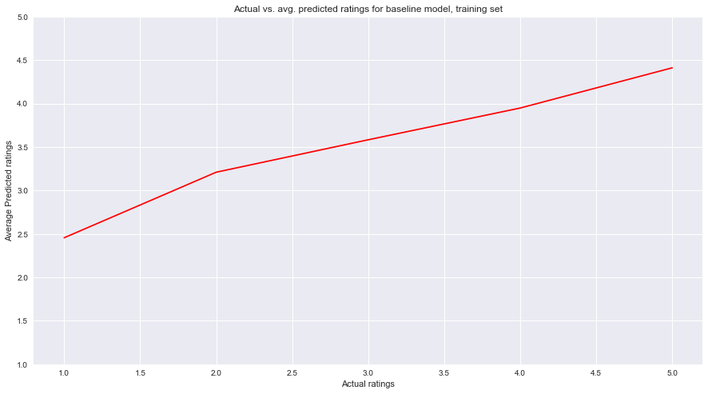
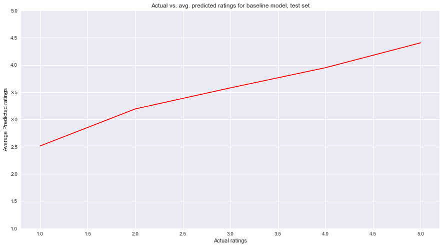

## Contents
{:.no_toc}
*  
{: toc}

## Part 0: Data Processing and EDA

## High level overview 


This project was interested in building various regression models to predict a restaurant's rating given it's features and a particular user's features. We first built a baseline model that took in global averages to make predictions, followed by regularized Ridge and Lasso regressions, a matrix factorizaiton approach, a KNN approach, and lastly an ensemble method that brought it all together. Overall it seems that fitted models performed marginally better than the baseline model, as you will see throughout the notebook code and explanations.


### Importing Data


```python
with open('dataset/business.json') as f:
    business_data = [json.loads(line) for line in f]
with open('dataset/user.json') as f:
    user_data = [json.loads(line) for line in f]  
with open('dataset/restaurant_reviews_trimmed.json') as f:
    review_data = [json.loads(line) for line in f]

restaurant_data = [x for x in business_data if 'Restaurants' in x['categories']]

restaurant_reviews = review_data[0] 

restaurant_df = json_normalize(restaurant_data)
```


## Part 1: Create a Baseline

Our first model was a simple baseline approach, written out as 

$$ \hat{Y}_{um} = \hat{\mu} + \hat{\theta}_{u} + \hat{\gamma}_m $$

where $\hat{\theta}_{u}$ and $\hat{\gamma}_m$ indicate the deviations of user $u$ and restaurant $m$ from some intercept paramter $\mu$. The baseline estimates we used in $\hat{\theta}_{u}$ and $\hat{\gamma}_m$ were the global averages, as seen and explained further below.

### Creating training, validating, and testing sets


```python
data_array = (np.random.choice(restaurant_reviews, size = 100000))
data_set = list(data_array)
```


As the dataset is so large, we had to take a subset of it to work with because of technical limitations of our computers.


```python
from collections import Counter
all_categories = []
for r in restaurant_data:
    if 'Restaurants' in r['categories']:
        for c in r['categories']:
            all_categories.append(c)
```


In the original dataset, "categories" is given as a list in each cell. We found all the unique categories here (e.g. French, Burgers, etc.).


```python
counts = list (Counter(all_categories).items())
counts.sort(key=lambda x: x[1], reverse = True)
most_popular = [x[0] for x in counts[:150]]
```


Many of the categories were either inappropriate (e.g. laundry) or too rare to be useful. Here, we narrowed down the categories to the top 150.


```python
restaurant_dict = {}
for item in restaurant_data:
    restaurant_id = item['business_id']
    restaurant_dict[restaurant_id] = item

user_dict = {}
for item in user_data:
    user_id = item['user_id']
    user_dict[user_id] = item
    
expanded_reviews = copy.deepcopy(data_array)
```


```python
for review in expanded_reviews:
    #print (review)
    restaurant = review['business_id']
    user = review['user_id']
    restaurant_info = restaurant_dict[restaurant]
    #print (restaurant_info)
    user_info = user_dict[user]
    for attribute in restaurant_info:
        #print (attribute)
        if attribute not in ['is_open', 'latitude','longitude','name','business_id',
                             'neighborhood','address','city','postal_code','hours']:
            if attribute == 'categories':
                for c in most_popular:
                    if c in restaurant_info[attribute]:
                        review['R_' +  c] = 1
                    else:
                        review['R_' +  c] = 0
            else:         
                review['R_' + attribute] = restaurant_info[attribute]
    for attribute in user_info:
        if attribute not in ['user_id','name']:   
            if attribute == 'friends':
                review['U_friends'] = len(user_info[attribute])
            elif attribute == 'yelping_since':
                review['U_yelping_since'] = user_info[attribute][:4]
            elif attribute == 'elite':
                if user_info[attribute]:
                    review['U_elite'] = True
                else:
                    review['U_elite'] = False        
            else:
                review['U_' + attribute] = user_info[attribute] 
```


Here, we added user and business attributes to the reviews dictionary.


```python
flatframe = json_normalize(expanded_reviews)
flatframe = flatframe.drop(['text','useful','funny','cool','date'], axis=1)

flatframe['U_years_yelping'] = [2015 - int(x) for x in flatframe['U_yelping_since']]
flatframe.drop(['U_yelping_since'],axis = 1, inplace = True)
```


We decided to change "U_yelping_since", which was a year, to the number of years a user has been active (so that it would make more sense as a continuous variable).


```python
flatframe_wids = flatframe.drop(['business_id', 'review_id', 'user_id'], axis = 1)
```


This was just for convenience when performing regression later==we didn't want to use the drop function every time we referred to the dataframe.


```python
#one hot encode
flatframe_wids = pd.get_dummies(flatframe_wids, columns = ['R_state', 
                                                    'R_attributes.Alcohol', 'R_attributes.AgesAllowed', 'R_attributes.RestaurantsAttire',
                                                    'R_attributes.RestaurantsPriceRange2','R_attributes.Smoking',
                                                    'R_attributes.WiFi', 'R_attributes.NoiseLevel','R_attributes.BYOBCorkage'])
```


```python
nan_count = {}
for column in flatframe_wids:
     nan_count[column] = flatframe_wids[column].isnull().sum()

nan_sorted = sorted(nan_count.items(), key=lambda x: x[1], reverse = True) 
drop_nans = [x[0] for x in nan_sorted if x[1] > 50000]
```


```python
flatframe_wids = flatframe_wids.drop(drop_nans, axis = 1)
flatframe_wids = flatframe_wids.fillna(flatframe_wids.mean())
```


There were many attributes with an unusually large number of NaNs (not 0 or False). We used mean imputation for many of these, but if more than half of the rows had missing values, we felt uncomfortable doing so and decided to drop the column entirely instead.


```python
msk = np.random.rand(len(flatframe_wids)) < 0.5
data_train = flatframe_wids[msk]
data_test = flatframe_wids[~msk]
```


### Getting global averages


```python
user_df = json_normalize(user_data)

data_train_temp = flatframe[msk]
data_test_temp = flatframe[~msk]
```


For this part of the project, we needed to include business and user ids for lookup purposes, which we had earlier deleted.


```python
users = data_train_temp.user_id.unique()
user_total = user_df[user_df['user_id'].isin(users)]['average_stars']
global_user_average = sum(user_total)/len(user_total)
print ("The global user average is {}".format(global_user_average))

restaurants = data_train_temp.business_id.unique()
restaurant_total = restaurant_df[restaurant_df['business_id'].isin(restaurants)]['stars']
global_restaurant_average = sum(restaurant_total)/len(restaurant_total)
print ("The global restaurant average is {}".format(global_restaurant_average))

global_review_average = data_train['stars'].mean()
print ("The global review average is {}".format(global_review_average))
```


    The global user average is 3.7280291378075754
    The global restaurant average is 3.5649292823467786
    The global review average is 3.708529901832855


The "global user average" takes a single user and his/her average rating given as one data point. The 'global restaurant average' does the same with individual restaurants. The 'global review average' averages every rating from every review. These are different values as each individual rating is weighted differently in each method.

### Getting restaurant and user biases


```python
user_deviations = {}
for item in user_data:
    user_id = item['user_id']
    user_deviations[user_id] = item['average_stars'] - global_user_average
```


```python
restaurant_deviations = {}
for item in restaurant_data:
    rest_id = item['business_id']
    restaurant_deviations[rest_id] = item['stars'] - global_restaurant_average
```


We decided to use the global user average and the global restaurant average for the user and restaurant bias calculation respectively (rather than global review average for everything) because we felt that it was most appropriate to compare a user's average rating to other users and a restaurant's average rating to other restaurants rather than to an average of all reviews.

### Baseline Model


```python
Xtrain = data_train.drop(['stars'], axis = 1)
ytrain = data_train['stars']
Xtest = data_test.drop(['stars'], axis = 1)
ytest = data_test['stars']
```


```python
def baseline(user_id, business_id):
    pred = global_review_average + user_deviations[user_id] + restaurant_deviations[business_id]
    return int(round(pred))
```


```python
base_pred = [baseline(x,y) for x,y in zip(data_train_temp['user_id'],data_train_temp['business_id'])]
base_pred_test = [baseline(x,y) for x,y in zip(data_test_temp['user_id'],data_test_temp['business_id'])]
```


```python
print ("The accuracy score of the baseline model on the train set is {}"
       .format(metrics.accuracy_score(ytrain, base_pred)))
print ("The accuracy score of the baseline model on the test set is {}"
       .format(metrics.accuracy_score(ytest, base_pred_test)))
```


    The accuracy score of the baseline model on the train set is 0.3930700821070805
    The accuracy score of the baseline model on the test set is 0.38866638770996476


```python
pred_df_train = pd.DataFrame({'y' : ytrain, 'ypred' : base_pred})
pred_df_test = pd.DataFrame({'y' : ytest, 'ypred' : base_pred_test})

base_pred_avg = []
base_pred_test_avg = []
for i in [1, 2, 3, 4, 5]:
    base_pred_avg.append(pred_df_train[pred_df_train['y'] == i]['ypred'].mean())
    base_pred_test_avg.append(pred_df_test[pred_df_test['y'] == i]['ypred'].mean())
```


```python
fig, ax = plt.subplots(1, 1, figsize=(15, 8))
ax.plot([1, 2, 3, 4, 5], base_pred_avg, color='red')

ax.set_xlabel('Actual ratings')
ax.set_ylabel('Average Predicted ratings')
ax.set_title('Actual vs. avg. predicted ratings for baseline model, training set')
ax.set_ylim((1,5));
```





```python
fig, ax = plt.subplots(1, 1, figsize=(15, 8))
ax.plot([1, 2, 3, 4, 5], base_pred_test_avg, color='red')

ax.set_xlabel('Actual ratings')
ax.set_ylabel('Average Predicted ratings')
ax.set_title('Actual vs. avg. predicted ratings for baseline model, test set')
ax.set_ylim((1,5));
```





On average, our predictions for both the training and the test set follow the increasing trend of actual ratings but overestimate for lower ratings.
