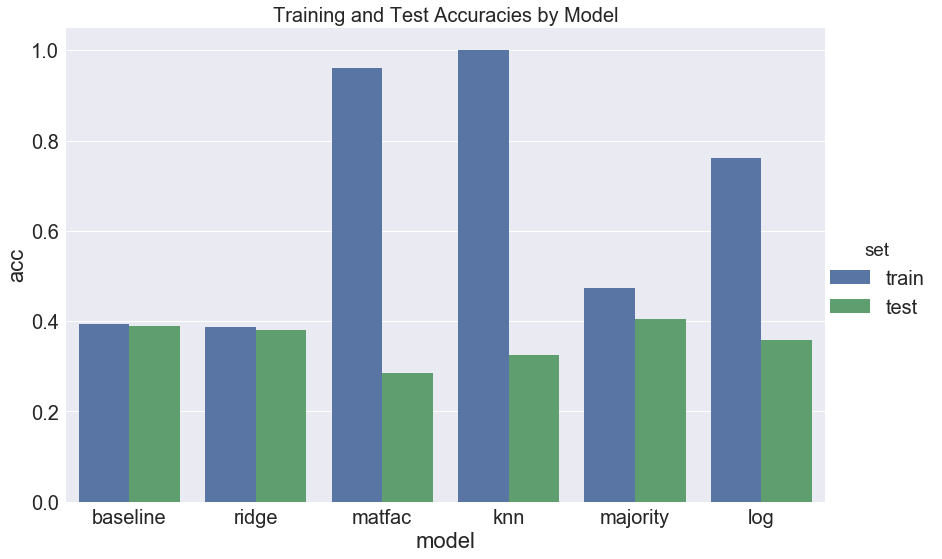

This project really was the ultimate capstone to the course. Throughout this project we were able to experience cleaning and wrangling a large dataset, building various prediction models from the Yelp database, and learning a lot about the ins-and-outs of Matrix Factorization. While none our models did significantly better than our first baseline model, it was still a valuable learning experience and the built models performed better than pure chance alone. Ultimately, two of the models (Majority vote and Matrix Factorization) did better than our baseline model when evaluated on the test set. 

Throughout this project we built a total five different models - a baseline model, regularized linear models,  matrix factorization, KNN, and an ensemble model. All of these models tended to have accuracy rates on the test sets are 0.37. In particular, the testing accuracies for each of the different models were 0.389 for the baseline, 0.382 for Ridge, 0.364 for the Lasso, 0.324 for the KNN, 0.396 for matrix factorization, 0.404 for majority vote, and 0.357 for the Logistic ensemble. Of these models, it would appear that majority vote is the best type model to predict unknown ratings. It might be best equipped to handle some of the smaller idiosyncrasies with some of the models.  

Looking at the overall conclusion, it appears that there were definitely some overfitting with some of the models. KNN with K=1, for example, performed the second worst on the test set even though it performed the best on the training set, even when confirmed through cross-validation. For most of these models, the testing accuracies tended to hover around the 0.35 to 0.40 range, even though the training accuracies were high for generalized stacking, KNN, and matrix factorization. None of the models stand out as significantly better than the others,  

We definitely ran into some troubles along the way as well, in particular around matrix factorization. The theory behind it was a little difficult to wrap our heads around, and determining how to create a train/test split and predict on new users was challenging to grasp. However, we did eventually fit a model that appeared to be overfit to the training. Ultimately it had a training accuracy of 0.96 and a testing accuracy of 0.29. Cross-validation proved to be extremely computationally expensive and due to some time constraints we were unable to find the optimal lambda. It really interesting how this method can translate so well into making recommendations of not only similar restaurants in this case, but also movies in the case of the Netflix challenge. It was incredibly computationally expensive and time consuming, so we weren’t able to really flesh out as much as we hoped, but it did capture a lot of the data. 

If we had more time to really flesh out this project, we would spend more time on the matrix factorization portion. Based on the results it definitely shows promise to be very successful in recommending restaurants and predicting unknown outcomes. However, we underestimated the amount of the time with would take to actually compute a factorization. We limited ourselves to 4 latent factors and really didn't have the time to fully flesh out cross validation sizes. Future work should look into optimizing our code to improve efficiency and really push the amount of latent factors to include. Doing so may boost matrix factorization to be the most successful. Expanding on matrix factorization, we were also facing significant difficulties including it in our ensemble method. We would like to explore this issue further to see if it had a large impact on an ensemble method. Further time could also be spent on really visualizing more of our data to make the website more appealing. 

Another thing to consider would be a different evaluation metric. Throughout this project we only used the accuracy score, which requires an exact match of prediction and the actual result. However, this might not be the best metric looking back. A model that that predicts a 4 when the true rating was a 5 is penalized the same as a model that predicts a 1 when the true rating was 5. Considering another metric like MSE might give us a better sense of which models are better at predicting values closer to the truth consistenly.  

In the end, this was definitely a worthwhile experience that taught us much about recommender systems. As recommender systems are so prevalent in many of the common resources we use today, including but definitely not limited to Yelp and Netflix, we were excited to delve into the topic and look forward to exploring the realm more in the future.

Special thanks to Chin-Hui Chew, Rahul Dave, and Pavlos Protopapas, Kevin Rader, and Margo Levine for their wisdom and guidance.

