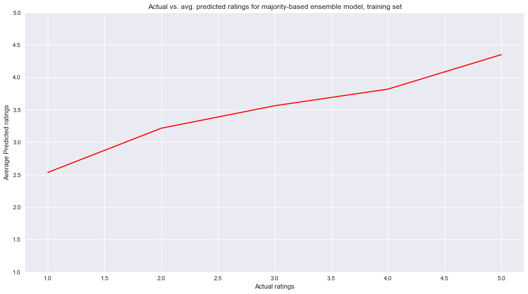
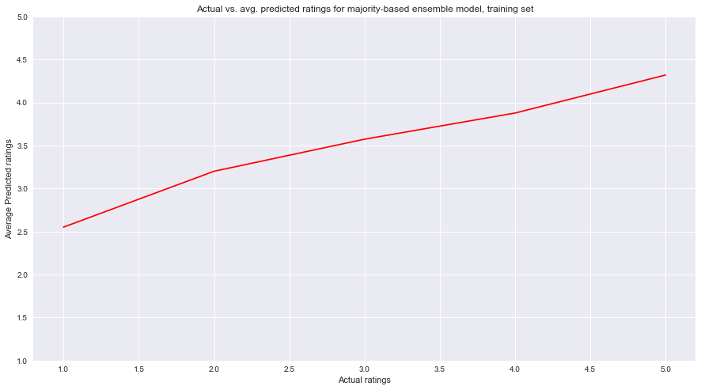
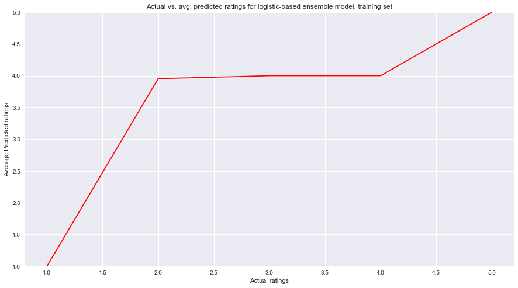
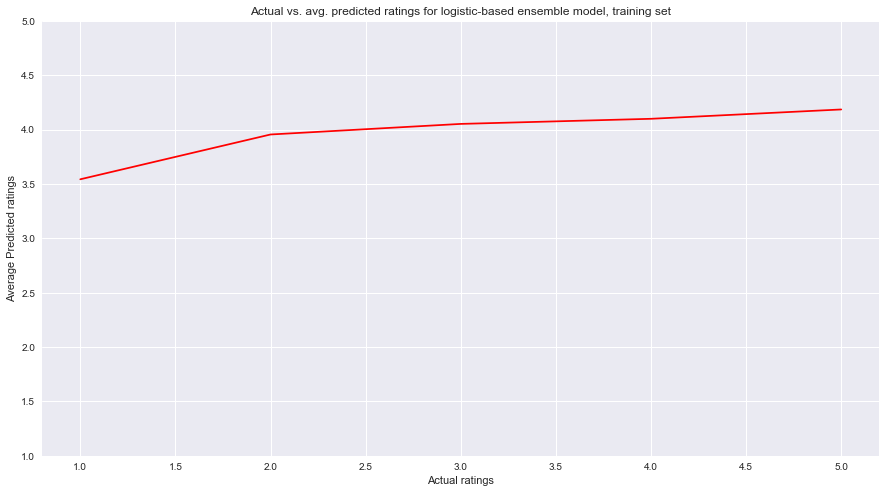

## Contents
{:.no_toc}
*  
{: toc}


## Part 5: Ensemble Method

We dedcided to build two separate ensemble methods - one of majority vote and one of generalized stacking. He we actually had some pretty promising resuilts. The majority vote method had a training accuracy of 0.474 and a test set accuracy of 0.409. This ended up having the hghest testing accuracy out of any of the models we built for this project. Our generalized stacking with Logistic Regression as te meta-classifier performed significantly better on the training set with an accuracy of 0.760, but had a testing accruacy of 0.3574. This makes it seem that the generalized stacking model overfit the training set, but it still performed moderately well when compared to our other models. 

For this section, we did not include our matrix factorization model. This is because for matrix factorization, we deleted many datapoints to reduce the sparsity of the input matrix, resulting in a dataset of around 5000 entries for the training set. In contrast, the original training set that we used had 50,000 entries. Because we wished to generalize our model for as many restaurant-user combinations as possible, we found it most appropriate to keep the matrix factorization model out of the ensemble method.

### Majority Vote Model


```python
from collections import Counter
predictions_train = []
predictions_test = []
counter_predictions_train = []
counter_predictions_test = []

base_pred = [baseline(x,y) for x,y in zip(data_train_temp['user_id'],data_train_temp['business_id'])]
base_pred_test = [baseline(x,y) for x,y in zip(data_test_temp['user_id'],data_test_temp['business_id'])]
ridge_ypred_round = [int(round(x)) for x in ridge_ypred]
ridge_ypred_test_round = [int(round(x)) for x in ridge_ypred_test]
#matrix factorization train
#matrix factorization test
knn_pred_train = np.round(knn.predict(Xtrain)).astype(int)
knn_pred_test = np.round(knn.predict(Xtest)).astype(int)

for i in range(len(ytrain)):
    temp = []
    temp.append(base_pred[i])
    temp.append(ridge_ypred_round[i])
    #temp.append(matrix factorization train)
    temp.append(knn_pred_train[i])
    counter_predictions_train.append(Counter(temp))
    predictions_train.append(temp)
    
for i in range(len(ytest)):
    temp = []
    temp.append(base_pred_test[i])
    temp.append(ridge_ypred_test_round[i])
    #temp.append(matrix factorization test)
    temp.append(knn_pred_test[i])
    counter_predictions_test.append(Counter(temp))
    predictions_test.append(temp)
```


```python
ensemble_pred_train = []
ensemble_pred_test = []

for i in range(len(counter_predictions_train)):
    value, count = counter_predictions_train[i].most_common()[0]
    ensemble_pred_train.append(value)
    
for i in range(len(counter_predictions_test)):
    value, count = counter_predictions_test[i].most_common()[0]
    ensemble_pred_test.append(value)
```


```python
print ("The accuracy score of the ensemble model (majority vote) on the train set is {}"
       .format(metrics.accuracy_score(ytrain, ensemble_pred_train)))
print ("The accuracy score of the ensemble model (majority vote) on the test set is {}"
       .format(metrics.accuracy_score(ytest, ensemble_pred_test)))
```


    The accuracy score of the ensemble model (majority vote) on the train set is 0.47372725821895945
    The accuracy score of the ensemble model (majority vote) on the test set is 0.40393407122232916


This ensemble method predicts by taking a majority vote of every model's prediction for a given predictor set. This improves upon all the models--both training and test accuracies are higher than any individual component model of the ensemble model (excluding training accuracy for kNN, which was 1 because k = 1).}


```python
pred_df_train = pd.DataFrame({'y' : ytrain, 'ypred' : ensemble_pred_train})
pred_df_test = pd.DataFrame({'y' : ytest, 'ypred' : ensemble_pred_test})

majority_pred_avg = []
majority_pred_test_avg = []
for i in [1, 2, 3, 4, 5]:
    majority_pred_avg.append(pred_df_train[pred_df_train['y'] == i]['ypred'].mean())
    majority_pred_test_avg.append(pred_df_test[pred_df_test['y'] == i]['ypred'].mean())
```


```python
fig, ax = plt.subplots(1, 1, figsize=(15, 8))
ax.plot([1, 2, 3, 4, 5], majority_pred_avg, color='red')

ax.set_xlabel('Actual ratings')
ax.set_ylabel('Average Predicted ratings')
ax.set_title('Actual vs. avg. predicted ratings for majority-based ensemble model, training set')
ax.set_ylim((1,5))
```





```python
fig, ax = plt.subplots(1, 1, figsize=(15, 8))
ax.plot([1, 2, 3, 4, 5], majority_pred_test_avg, color='red')

ax.set_xlabel('Actual ratings')
ax.set_ylabel('Average Predicted ratings')
ax.set_title('Actual vs. avg. predicted ratings for majority-based ensemble model, training set')
ax.set_ylim((1,5))
```




On average, our predictions for both the training and the test set follow the increasing trend of actual ratings but overestimate for lower ratings.

### Ensemble Method Using Logistic Regression


```python
logreg = LogisticRegressionCV()
y_hat_test = logreg.fit(predictions_train, ytrain).predict(predictions_test)
y_hat_train = logreg.fit(predictions_train, ytrain).predict(predictions_train)

print("Train LogReg: ", metrics.accuracy_score(ytrain, y_hat_train))
print("Test LogReg: ", metrics.accuracy_score(ytest, y_hat_test))
```


    Train LogReg:  0.760453239706
    Test LogReg:  0.357455085018


This model performed significantly better on the training set; however, it actually performed *worse* on the test set. This may be because of the kNN model being weighted more because of its high training accuracy due to its parameter k being 1.


```python
pred_df_train = pd.DataFrame({'y' : ytrain, 'ypred' : y_hat_train})
pred_df_test = pd.DataFrame({'y' : ytest, 'ypred' : y_hat_test})

log_pred_avg = []
log_pred_test_avg = []
for i in [1, 2, 3, 4, 5]:
    log_pred_avg.append(pred_df_train[pred_df_train['y'] == i]['ypred'].mean())
    log_pred_test_avg.append(pred_df_test[pred_df_test['y'] == i]['ypred'].mean())
```


```python
fig, ax = plt.subplots(1, 1, figsize=(15, 8))
ax.plot([1, 2, 3, 4, 5], log_pred_avg, color='red')

ax.set_xlabel('Actual ratings')
ax.set_ylabel('Average Predicted ratings')
ax.set_title('Actual vs. avg. predicted ratings for logistic-based ensemble model, training set')
ax.set_ylim((1,5))
```





```python
fig, ax = plt.subplots(1, 1, figsize=(15, 8))
ax.plot([1, 2, 3, 4, 5], log_pred_test_avg, color='red')

ax.set_xlabel('Actual ratings')
ax.set_ylabel('Average Predicted ratings')
ax.set_title('Actual vs. avg. predicted ratings for logistic-based ensemble model, training set')
ax.set_ylim((1,5))
```





For the training set, the model performed well for when actual ratings were 1, 4, and 5 (not 2 and 3). The line was very flat for the test set, reflecting the large influence that the knn model had using this ensemble method.
