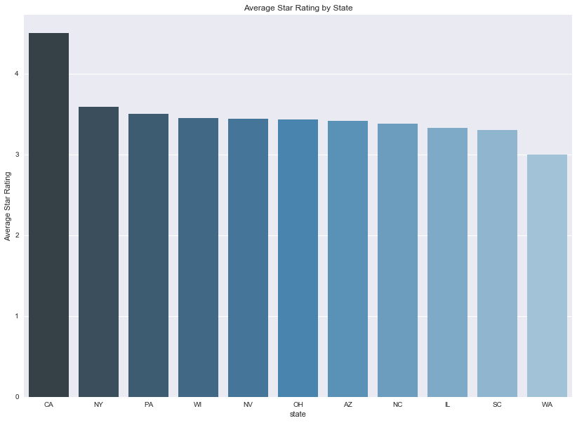
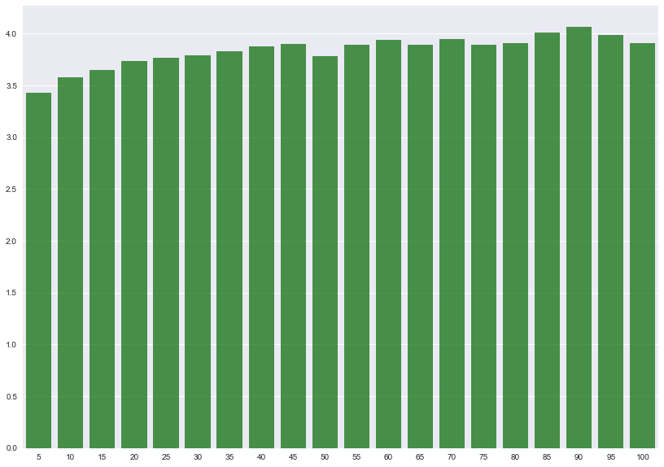
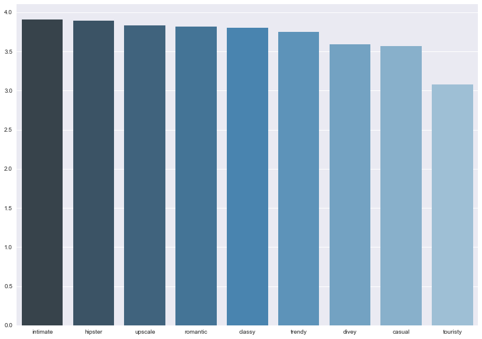
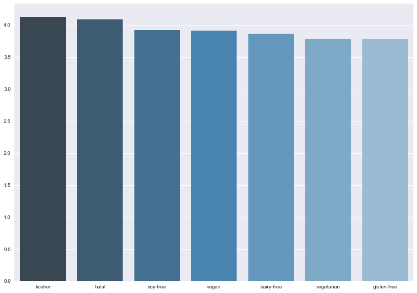

```python
import numpy as np
import pandas as pd
import seaborn as sns
import json
import matplotlib
import matplotlib.pyplot as plt
import sklearn.metrics as metrics
from sklearn.model_selection import cross_val_score
from sklearn import tree
from sklearn.tree import DecisionTreeClassifier
from sklearn.ensemble import RandomForestClassifier
from sklearn.ensemble import AdaBoostClassifier
from sklearn.linear_model import LogisticRegressionCV
from random import *
from math import log

from scipy.stats.stats import pearsonr   
%matplotlib inline
```


```python
with open('dataset/business.json') as f:
    business_data = [json.loads(line) for line in f]
with open('dataset/user.json') as f:
    user_data = [json.loads(line) for line in f]
```


```python
with open('dataset/review.json') as f:
    review_data = [json.loads(review) for review in f]
```


```python
review_data
```


    [{'business_id': 'uYHaNptLzDLoV_JZ_MuzUA',
      'cool': 0,
      'date': '2016-07-12',
      'funny': 0,
      'review_id': 'VfBHSwC5Vz_pbFluy07i9Q',
      'stars': 5,
      'text': 'My girlfriend and I stayed here for 3 nights and loved it. The location of this hotel and very decent price makes this an amazing deal. When you walk out the front door Scott Monument and Princes street are right in front of you, Edinburgh Castle and the Royal Mile is a 2 minute walk via a close right around the corner, and there are so many hidden gems nearby including Calton Hill and the newly opened Arches that made this location incredible.\n\nThe hotel itself was also very nice with a reasonably priced bar, very considerate staff, and small but comfortable rooms with excellent bathrooms and showers. Only two minor complaints are no telephones in room for room service (not a huge deal for us) and no AC in the room, but they have huge windows which can be fully opened. The staff were incredible though, letting us borrow umbrellas for the rain, giving us maps and directions, and also when we had lost our only UK adapter for charging our phones gave us a very fancy one for free.\n\nI would highly recommend this hotel to friends, and when I return to Edinburgh (which I most definitely will) I will be staying here without any hesitation.',
      'useful': 0,
      'user_id': 'cjpdDjZyprfyDG3RlkVG3w'},
     {'business_id': 'uYHaNptLzDLoV_JZ_MuzUA',
      'cool': 0,
      'date': '2016-10-02',
      'funny': 0,
      'review_id': '3zRpneRKDsOPq92tq7ybAA',
      'stars': 3,
      'text': "If you need an inexpensive place to stay for a night or two then you may consider this place but for a longer stay I'd recommend somewhere with better amenities. \n\nPros:\nGreat location- you're right by the train station, central location to get to old town and new town, and right by sight seeing his tours. Food, bars, and shopping all within walking distance. Location, location, location.\nVery clean and very good maid service\n\nCons:\nTiny rooms \nUncomfortable bed \nAbsolutely no amenities \nNo phone in room \nNo wardrobe \n\nWas given a lot of attitude about me and my husband sharing a room which was quite strange and we were charged 15 pounds more for double occupancy not sure why that matters I felt like it was a money grab. It was just handled in a kind of odd manner to me... \n\nIf you book this hotel all you get is a bed, desk, and a bathroom. It isn't awful but know what you're getting into.",
      'useful': 0,
      'user_id': 'bjTcT8Ty4cJZhEOEo01FGA'},
     {'business_id': 'uYHaNptLzDLoV_JZ_MuzUA',
      'cool': 0,
      'date': '2015-09-17',
      'funny': 0,
      'review_id': 'ne5WhI1jUFOcRn-b-gAzHA',
      'stars': 3,
      'text': "Mittlerweile gibt es in Edinburgh zwei Ableger der Motel-One-Kette - diese hier ist eher das schlechtere.\n\nWir hatten auf unserer Schottlandtour die Gelegenheit beide Ableger kennenzulernen, da wir beide Nächte in Edinburgh (am ersten sowie am letzten Tag) in einem der beiden Motel One's verbrachten. Von diesem hier waren wir nach dem überraschend positiven Erlebnis im Motel One an der Princes Street [1] etwas enttäuscht.\n\nDas Hotel ist wesentlich größer und extrem unübersichtlich. Da man auf der fünften Etage noch Teile eines weiteren Gebäude, das mittels einer Glasbrücke mit dem Hauptgebäude verbunden ist, hinzugenommen hat, kann die Suche nach dem Zimmer insbesondere auf dieser Etage zu einem Gang im Labyrinth ausarten. Habe ich so noch in keinem Hotel erlebt - uns begegneten immer wieder Menschen, die sich auf der Suche nach ihren Zimmern verirrt haben.\nUnser Zimmer war ähnlich aufgebaut wie das Zimmer im Motel One Princes Street - befand sich jedoch im Inneren des Gebäudes und hatte daher kein Fenster. Nur eine kleine Dachluke, die sich am oberen Ende eines etwa 3m langen Schachts befand, sorgte für einen minimalen Anteil Tageslicht im Zimmer. diese Luke ließ sich auch nicht öffnen, nur ein elektrisches Rollo ließ sich mittels eines Schalters öffnen bzw. schließen.\nSonst gilt für das Zimmer eigentlich das Gleiche wie für das Zimmer im im Motel One Princes Street: Relativ klein, trotzdem extrem ansprechend und schick gestaltet und clever durchdacht. Dazu sehr ruhig.\n\nIm gesamten Hotel gibt es kostenloses WLAN für die Dauer des Aufenthalts für maximal 3 Geräte.\n\nDie Lage des Motel One Royal Mile ist großartig. Vom Airlink-Flughafenbus kann man quasi in den Hoteleingang stolpern, es sind maximal 50m. Zur Royal Mile sind es etwa 100m Luftlinie (bergauf) und man benötigt etwa 5 Minuten bis dort.\n\nDas Frühstück für 9,50 GBP / Person kann man nutzen - muss man aber nicht. Es ist eher übersichtlich und kontinetaler Prägung, trotzdem aber sehr gut. Für den gleichen Preis oder weniger bekommt man aber problemlos ein reichhaltiges Frühstück in einem der zahlreichen Cafes von Edinburgh.\n\nFür ein oder zwei Nächte kann man hier problemlos bleiben, sollte aber nicht allzuviel erwarten. Hat man die Wahl, sollte man meiner Erfahrung nach lieber auf das andere Motel One an der Princes Street ausweichen. \n\n\n----\n[1] http://www.yelp.de/biz/motel-one-edinburgh-2?hrid=7UDwl3s_DuOokkGPZXZgBw",
      'useful': 0,
      'user_id': 'AXgRULmWcME7J6Ix3I--ww'},
     {'business_id': 'uYHaNptLzDLoV_JZ_MuzUA',
      'cool': 0,
      'date': '2016-08-21',
      'funny': 0,
      'review_id': 'llmdwOgDReucVoWEry61Lw',
      'stars': 4,
      'text': "Location is everything and this hotel has it! The reception is inviting and open 24 hours. They are very helpful and have a lot of patience answering all my questions about where to go etc. there is also a lounge open 24 hours with snack-type food. Breakfast is continental-style so if you want heartier fare look elsewhere though you don't have to go far. The bus and train stations are right across the street so it's easy access to the airport or anywhere else you may want to go. Turn uphill to old town or cross the bridge to new town. The room with a view i got was spacious and comfortable though it's a bit of a maze to find it-just follow the signs. The windows are double paned so the room is quiet plus i was on the 5th floor which helps. It's a bit pricey but still one of the best values i found!",
      'useful': 0,
      'user_id': 'oU2SSOmsp_A8JYI7Z2JJ5w'},
     {'business_id': 'uYHaNptLzDLoV_JZ_MuzUA',
      'cool': 0,
      'date': '2013-11-20',
      'funny': 0,
      'review_id': 'DuffS87NaSMDmIfluvT83g',
      'stars': 5,
      'text': 'gute lage im stadtzentrum. shoppingmeile und sehenswürdigkeiten, sowie gute pubs in laufweite. das hotel ist neu, gut gepflegt und hat bemühtes/nettes personal. ideal für einen kurztrip nach edinburgh. längere aufenthalte eher nicht, da die zimmer recht klein sind.',
      'useful': 0,
      'user_id': '0xtbPEna2Kei11vsU-U2Mw'},
     {'business_id': 'uYHaNptLzDLoV_JZ_MuzUA',
      'cool': 0,
      'date': '2016-06-05',
      'funny': 0,
      'review_id': 'GvLmUkjUrOyFH8KFnmT1uw',
      'stars': 5,
      'text': 'Erstklassige Lage. Dazu ist alles geschrieben  worden.\nWir hatten Zimmer 718 mit Blick auf den Bahnhof. Ist zwar zu laut mit offenen Fenster nachts, aber der Ausblick verzeiht alles. Das Personal ist sehr freundlich und super hilfsbereit. Wer Edinburgh zu Fuß erkunden möchte, ist hier perfekt aufgehoben.',
      'useful': 0,
      'user_id': 'rW8q706dz5-NnXDzMwVkiw'},
     {'business_id': 'uYHaNptLzDLoV_JZ_MuzUA',
      'cool': 0,
      'date': '2015-02-21',
      'funny': 0,
      'review_id': 'lGEl24NGj2HVBJrodeXcjg',
      'stars': 4,
      'text': 'Beautiful space, great location, staff rock. Tiny room, but this was expected. Bathroom amazing. Walls, however, paper thin, which is why I can barely string a sentence together in this review.',
      'useful': 0,
      'user_id': 'yx8vNXUL0D0HS8rUIC7AFA'},
     {'business_id': 'uYHaNptLzDLoV_JZ_MuzUA',
      'cool': 0,
      'date': '2013-07-07',
      'funny': 0,
      'review_id': 'cUgvEy5wj7zYE68v1BzzVg',
      'stars': 4,
      'text': "This is a fairly new property I think. It is a German company and has most of the amenities you would want. It is priced on the budget minded side so it won't break your bank.\nLocation is really good. Near the Royal Mile and Waverley station without being too noisy. Very easy to walk to everything we wanted to do. Has WiFi but we did have to re-log in every day.",
      'useful': 0,
      'user_id': 'zXnH6W74FAJQ7q7b-NuBsA'},
     {'business_id': 'uYHaNptLzDLoV_JZ_MuzUA',
      'cool': 2,
      'date': '2013-04-27',
      'funny': 0,
      'review_id': 'FSB_BnvysBgH3JYrbFNcgw',
      'stars': 4,
      'text': 'First time at this group of hotels. Pretty new, only one in UK, another to open in Edinburgh and one in London. Rooms not very big but great price and location for a weekend in Edinburgh. Rooms clean, comfortable, good shower and free wifi!',
      'useful': 2,
      'user_id': 'c5yp5hxwC1N98MjbV2LyWQ'},
     {'business_id': 'uYHaNptLzDLoV_JZ_MuzUA',
      'cool': 0,
      'date': '2015-04-13',
      'funny': 0,
      'review_id': 'dhl3ZW9aAEX_T7_um5tfaQ',
      'stars': 4,
      'text': "Location location location! \n\nMotel One is just right in the middle of everything. To one side you have the New town and the main trains station ( and right in front of the airport bus)  and on the other side the beautiful old town of Edinburg. \n\nThe room was small but clean and with all you need. \nThe bathroom was also small but nice and clean and the shower was big and good! Next to the bed there is a European plug (CC 7/7) so we actually didn't need to use our adapter. \n\nThe beed was to hard for my back and I prefer the bed more soft, but I will still come back to Edinburgh and Motel One.",
      'useful': 2,
      'user_id': 'xJisL5w4wOgiYLokGMT_IA'},
     {'business_id': 'uYHaNptLzDLoV_JZ_MuzUA',
      'cool': 1,
      'date': '2016-11-08',
      'funny': 1,
      'review_id': 'JQJvnM3p-3eML05eKcTgiw',
      'stars': 4,
      'text': "A hotel that has all the basics that you'd need - no additional fuss. For the price we paid, I'd say this place is actually pretty good value. The location is super central and it's easy to get to everywhere from here! It's also right next to the airport shuttle bus and train station, so transport is also easy. \n\nThe insides is a bit of a maze depending on where your room is located - you may have to go down to go up to go back down again to get to your room! But no bother, it's good for walking off the chips and sobering from your drinks.",
      'useful': 1,
      'user_id': 'tgV6tsYQ66DZ3LQKvtC6cw'},
     {'business_id': 'uYHaNptLzDLoV_JZ_MuzUA',
      'cool': 0,
      'date': '2015-07-27',
      'funny': 0,
      'review_id': '6JF4WfHgwYrrdZ2VeYtnFw',
      'stars': 3,
      'text': "Stayed here for two nights, costs was £109 per night for two people sharing a room which was not a budget price for what felt like budget rooms. Firstly they don't have any twin rooms in the hotel which would be preferable when I was sharing with a friend not my lover! There is only one small bin which is located in the bathroom.  No soap, which I find ridiculous, only toiletries were a dual shower gel/hair wash. There was a hairdryer but no wardrobes or drawers. Room was also very cold. \n\nNow for the positive, the location is very good, close to princes street and St. Andrews square. The staff are very helpful and the bar is 24 hours. \n\nDon't bother with the breakfast which is £9.50 each for a continental breakfast where you can easily get a cooked breakfast in any one of the cafes in Cockburn Street, which is adjacent to this hotel. \n\nIf I go to Edinburgh again I will book a different hotel.",
      'useful': 1,
      'user_id': 'Q-3YCVywc03w56wYtGlKvg'},
     {'business_id': 'uYHaNptLzDLoV_JZ_MuzUA',
      'cool': 0,
      'date': '2014-05-07',
      'funny': 0,
      'review_id': 'fbVYETRuWDw8QnpimpGMpg',
      'stars': 4,
      'text': "Well, i like the idea of Motel One. Always in the center of the city, somehow modern design, good beds. No fancy unnecessary stuff. All of this is true for this motel one in Edinburgh. Perfectly located even if it's hard to discover. \nBreakfast is ok, but not more. \nService is friendly. \nNo twin rooms available..",
      'useful': 1,
      'user_id': 'Cx4UCow0zQgFQOp47RRRaA'},
     {'business_id': 'uYHaNptLzDLoV_JZ_MuzUA',
      'cool': 0,
      'date': '2015-02-26',
      'funny': 0,
      'review_id': 'lobj38NgaokqVseN8_nn6g',
      'stars': 4,
      'text': "I really do love the Germans. This chain is spreading fast over there and they're bringing their efficiency and attention to detail with them here. \n\nMotel One is, as the name suggests, aimed at the budget market. Rates for this venue range from approximately £69/night up. I booked ahead and appreciated the completely free reservation process with room guaranteed until 6pm on the day of arrival. If you give your credit card details, it's reserved beyond that time.\n\nLocation is excellent! If you exit from the Market St side of Waverly and turn right it's maybe 3 minutes away. It would be very hard to have it closer. That also makes it very close to the castle and Princes St. Welcome was warm and check-in easy. The lobby area is pretty small but clean and cosy with sweets, maps etc. There's a bar area down a few steps where they also serve the buffet breakfast each morning.\n\nMy room was the cheapest version and was internal, facing onto a courtyard. It had no view and was quite dark, but quiet. Everything was completely spotless. The bathroom was small but well designed and had a great shower. Bed was comfy with 2 single duvets. So continental, don't you know? I appreciated the tea and coffee making facilities (I'm like a beast without them), the decent sized TV and the free wifi. The hanging storage facilities are limited but it was fine for a few days. \n\nRandom: hands down the best hotel hairdryer I have ever used. And one of the best dryers in general-called a Black Mambo. It was worth staying there for that alone. Well, you know, also the really good value and the pristine conditions. But definitely the hairdryer.",
      'useful': 1,
      'user_id': 'eqWEgMH-DCP74i82BEAZzw'},
     {'business_id': 'uYHaNptLzDLoV_JZ_MuzUA',
      'cool': 1,
      'date': '2015-08-21',
      'funny': 0,
      'review_id': 'ysfjtAWreLoy7um8WTb8xA',
      'stars': 5,
      'text': "Motel One sets the standard for budget hotels. I stayed at the Dusseldorf branch a while ago so when I saw one in Edinburgh, I knew this was the place to book. We managed to get a reservation during the Edinburgh Fringe Festival and only booked a few weeks before. We did pay a premium over the normal rate but given the crowds in the city during this time, it was still a good deal compared to other hotels.\n\nStaff were all friendly and welcoming, presentable and professional.\nWe received a room upgrade with quite a large room overlooking the bridge crossing Waverley station to Princes St. Despite overlooking a busy road, the room was almost silent thanks to solid double glazing. The room temperature was perfectly controlled with an individual A/C unit. Super clean, modern, uncluttered. Bathroom was similar. No slamming doors or noise in the night. Bonus.\n\nFree wifi that works with one log in (doesn't require repeated log ins as some places do) and had decent signal strength.\n\nThe buffet continental breakfast was also a hit with fresh croissants, danishes, cold cuts, cheese, toast, fruit and yoghurt all well presented, fresh and good quality as was the coffee.\n\nIf I am looking for a reasonable hotel in a city, Motel One will be by first choice.",
      'useful': 1,
      'user_id': 'd0DGZRp6lHXGECJSc_nn-A'},
     {'business_id': 'uYHaNptLzDLoV_JZ_MuzUA',
      'cool': 0,
      'date': '2013-12-07',
      'funny': 0,
      'review_id': 'OF1ToqGAubsWGri5iad15w',
      'stars': 3,
      'text': "Had Continental style breakfast here a short distance from Waverley Station as I had half hour before a train home and wanted to try somewhere new. Motel1One is nearby and a easy two minute walk, slightly uphill towards the castle from the station. \n\nOn entry it's modern, cosy has tons of cool yet bright pastel and mochilato colours to accommodate your cold wintertime self. Wooden floors, warm rugs, sheepskins on the sofas, slate walls and oak barrelled tables, with slight distinct Scottish themes due to their tartan furnished accessories completes the feel.\n\nI sat in One Lounge, had tea and food self served for well under £10, you know bran, meats cheese and croissant that sort of stuff. With a copy of local newspaper in hand I really needed to eat, stay warm and access wifi, the reasons I came in.\n\nSome hotels in the city give you access to wifi if your a paying guest, but repeated attempts to access their wifi even with staff help, eventually gave access but in German. On going to reception again for additional help the staff were great got the correct website for me, but still no luck.\n\nHmmm, by the time this was all done I came back to cold tea and didn't really have time now to finish a second cup of hot Earl Grey, so sorry to staff for removing an almost full cup of tea. Great place though nice breakfast and funky decor especially the plasma tv displaying a roasting log fire in reception, but sadly for me no easy access to wifi when badly required.\n\nMaybe next time I will endeavour to try food against technology!",
      'useful': 1,
      'user_id': 'IpLZ7RevQrFPJWYc9Gxymg'},
     {'business_id': 'jQsNFOzDpxPmOurSWCg1vQ',
      'cool': 0,
      'date': '2017-06-03',
      'funny': 0,
      'review_id': 'ByRzJ8rF2KJWLr-cUNU6EA',
      'stars': 1,
      'text': 'This place is horrible, we were so excited to try it since I got a gift card for my birthday. We went in an ordered are whole meal and they did not except are gift card, because their system was down. Unacceptable, this would have been so helpful if we would have known this prior!!',
      'useful': 0,
      'user_id': 'kzyLOqiJvyw_FWFTw2rjiQ'},
     {'business_id': 'jQsNFOzDpxPmOurSWCg1vQ',
      'cool': 0,
      'date': '2015-03-26',
      'funny': 0,
      'review_id': 'i5UwUPlQFPLcE8p2gPFwBw',
      'stars': 4,
      'text': 'For being fairly "fast" food.. Pei Wei (pronounced pay way I confirmed haha) is pretty darn good. we got a few things to share. I had the Asian chicken salad and was impressed! There was a decent amount of chicken. Some more veggies would be nice, but overall pretty good. The steak teriyaki was great as well as the fried rice. Over all good was good! Nice, clean, and reasonable.',
      'useful': 1,
      'user_id': 'WZXp9-V2dqRRJqhGgRqueA'},
     {'business_id': 'jQsNFOzDpxPmOurSWCg1vQ',
      'cool': 1,
      'date': '2012-12-30',
      'funny': 1,
      'review_id': 'EyQyvTTg2jX4or9bB8PC9g',
      'stars': 5,
      'text': "I decided to try it out, I'm celiac and therefore can only eat gluten free...\nThey have an easy to understand GF Menu with anything you can possibly want.\n\nI placed my order online and picked the exact pickup time. I cam and my food was ready for me. Driving home the smell in my car was so good I could barely wait to get home and try it - true umami!\n\nI got home and dug into the delicious spicy chicken and rice with sugar snapies and carrots. It was superb! For $9 I will definitely try this again! I did see a huge line at the store, so try doing an online order and pickup forsure!\n\np.s. they even include GF soy sauce!",
      'useful': 2,
      'user_id': 'XylT12exfdLiI_3uDLVIpw'},
     {'business_id': 'jQsNFOzDpxPmOurSWCg1vQ',
      'cool': 1,
      'date': '2009-01-12',
      'funny': 1,
      'review_id': 'G-EFA005besj5uHsH0sQFA',
      'stars': 3,
      'text': 'I\'m not saying Pei Wei is the best asian food I\'ve ever tasted, far from it, it\'s a fairly large chain that puts on the appearance of something more refined, it\'s essentially to Asian food what Olive Garden is to Italian Food.\n\nWith that said I\'ve always had pretty good experiences with Pei Wei, the food although not spectacular is better than some of the overcooked chicken drowning in MSG offered by some of the local chinese restaurants.  the portions are good sized, the food is generally consistent, and the prices are really reasonable considering this is a corporate chain in some cases cheaper than the local establishments. or dare I say it\'s name "panda express" (which is overpriced crap)\n\nthe time before last that I went they forgot the tomato\'s and the dressing for an asian chopped chicken salad that my wife ordered, I didn\'t discover that the dressing was missing until I got home, I immediately called the restaurant and was speaking to a manager within 30 seconds. The manager apologized and asked me If I would like to come back to the restaurant or if he could have my address so he could send me a gift certificate. I decided to go back to the restaurant, when I got the restaurant I told the person at the counter my name and they already had a bag set aside for me, the manager came over and explained to me there was another full salad in the bag, and he put additional dressing for the salad we already had, and additionally he gave me a coupon for free lettuce wraps.(which mental note: I need to use)\n\nI must say I was impressed with this manager, and it was refreshing after being in situations where a manager has taken back the bag/plate and essentially "un-F$@k\'s" your food and returns it to you.\n\nOverall great customer service, consistent food, and a good option for takeout in surprise.',
      'useful': 1,
      'user_id': 'Ji9PeffxjwqPLO7pEfSpKQ'},
     {'business_id': 'jQsNFOzDpxPmOurSWCg1vQ',
      'cool': 0,
      'date': '2015-07-11',
      'funny': 0,
      'review_id': '6PcJSGUBSLjt4VLXos5C4A',
      'stars': 3,
      'text': 'Sometimes the food is spot on and delicious and other times it is quite salty at this location.  Very difficult to get a consistently good meal.  Menu items add up quickly.',
      'useful': 0,
      'user_id': 'TLIWzAJPrET0zX4_vgvLhg'},
     {'business_id': 'jQsNFOzDpxPmOurSWCg1vQ',
      'cool': 0,
      'date': '2015-05-27',
      'funny': 0,
      'review_id': 'PFJmyZD_lNBa_Y3kbX1VvA',
      'stars': 1,
      'text': 'Decent customer service but the food was awful. It was cold and had no sauce at all. I was expecting it to be good but this place really went down hill. I will never eat here again.',
      'useful': 0,
      'user_id': 'JZEiTNWBwmv6MOOXYCAaMQ'},
     {'business_id': 'jQsNFOzDpxPmOurSWCg1vQ',
      'cool': 1,
      'date': '2015-02-28',
      'funny': 1,
      'review_id': '_Qv1FQUToLrKMuG6pV4Gzw',
      'stars': 5,
      'text': "Super clean restaurant and friendly staff. FRESH food. Hasn't been sitting under heat lamps. NO MSG, this is the good stuff. I have to have the Kung Pao Chicken weekly.",
      'useful': 1,
      'user_id': 'E56sVQT5-OWfSejJrma8_w'},
     {'business_id': 'jQsNFOzDpxPmOurSWCg1vQ',
      'cool': 0,
      'date': '2010-04-05',
      'funny': 0,
      'review_id': 's2mlqrFNaPEGtcnEu3EJ4Q',
      'stars': 4,
      'text': "Found this the other night.  It is the PF Chang fast food option and it worked perfectly for us.  Limited menu, but lower prices. Very basic decor, but clean and fast seating.  Lettuce Wraps just as good as Chang's.  Very busy, especially the take out.  Glad to have it close",
      'useful': 0,
      'user_id': '4WYICo4emecA9r7sPYQkBw'},
     {'business_id': 'jQsNFOzDpxPmOurSWCg1vQ',
      'cool': 0,
      'date': '2015-05-22',
      'funny': 0,
      'review_id': 'oiSzZRrbi3y01_wqU528ZQ',
      'stars': 1,
      'text': "The staff here is great and they're nice,  wonderful and quick. People were ranting in raving about pei wei, I had to try it.  Even good yelp reviews.  I'm highly dissatisfied with the flavor of the food. This  should be labeled Asian inspired and not Asian. I've tried a variety of Chinese restaurants, this doesn't taste close to anything I've had at other Asian restaurants. Their Mongolian beef  was 5 pieces of beef and large mushrooms cut into thirds in a thick sauce. You eat the rice to wash off the nasty flavor. My shrimp was thickly coated in an overpowering  sauce as well.  I only ate some of the veggies that take center stage on a meat dish.  The center of my pork egg roll was cold. The hot N sour soup was a much thicker consistency almost like that of a chili instead of being brothy. Worst of all was the price.  This was not worth it to us. Neither me or my husband enjoyed either of  our dishes.  We didn't even eat half of our plates.  We even refused to take it home with us.  If you like and enjoy what typical Asian food tastes like,  don't waste your time here.",
      'useful': 0,
      'user_id': 'P8mVj7AZwJTFFH5FXbbmUg'},
     {'business_id': 'jQsNFOzDpxPmOurSWCg1vQ',
      'cool': 0,
      'date': '2011-06-15',
      'funny': 0,
      'review_id': '4BPjRE9VI0HhyZzyyYv0BQ',
      'stars': 2,
      'text': 'I had the garlic ginger broccoli chicken and it was not very good. The broccoli was hardly cooked and the sauce was way to sweet. Everything else was great. I will give them a few more tries before I write them off as another crappy Asian restaurant in Surprise.',
      'useful': 1,
      'user_id': '7Y4NEBQqWg7j-TvrQi6UZQ'},
     {'business_id': 'jQsNFOzDpxPmOurSWCg1vQ',
      'cool': 0,
      'date': '2017-03-12',
      'funny': 0,
      'review_id': 'kznHtw1Qido_9GX6sDQPJw',
      'stars': 5,
      'text': "This review is based upon consistency of flavor and great customer service.  We came and there was an unknown issue that required a 25 minute wait for food.  The employee notified us, and although hesitant, we decided to stay.  We have been here numerous times before in the past years so we are familiar with this location.  The employee was apologetic and gave us a free drink.  That was a simple gesture but rarely do you see decent customer service anymore.  We received our food and had an issue with an incorrect order.  It was explained and the issue was resolved quickly.  They gave us a free appetizer.  We do not expect perfection, nor free food.  This restaurant cares for customers and works to provide a positive experience.  We would return again because they have good food and they care.  That is a rarity in today's restaurant culture.  Kudos to the manager for creating this culture.  Ordered- fried rive and Tofu, edamame, won ton soup, dynamite chx, and Thai curry chx",
      'useful': 0,
      'user_id': 'vgZqQqe8cj6SBMH0EqDliw'},
     {'business_id': 'jQsNFOzDpxPmOurSWCg1vQ',
      'cool': 1,
      'date': '2016-12-19',
      'funny': 0,
      'review_id': 'HWRTVn3Lc-RwN6udv4WJzQ',
      'stars': 5,
      'text': "I love this place i'd recommend it to anyone ! We always order it togo and it never disappoints! The food always taste fresh and is always ready on time! Definitely our favorite lunch spot !",
      'useful': 1,
      'user_id': 'O7G_c6wFXSygr82qs0GAcA'},
     {'business_id': 'jQsNFOzDpxPmOurSWCg1vQ',
      'cool': 0,
      'date': '2011-08-10',
      'funny': 0,
      'review_id': 'GiEB_A-m9HuX521WQNbL8w',
      'stars': 4,
      'text': '1st! Place is not closed. There was an issue with legal workers in the franchise chain. Now they are back! Food is one of the best! Especially their chicken mango! Daughter is a huge PF Chang fan, so she loves this place also! Her favorite is their Mongolian beef, and noodles! They are always coming up with something new, so you may have to try them more then a few times.',
      'useful': 1,
      'user_id': 'UG4EKu13JRwzRix6ESINdg'},
     {'business_id': 'jQsNFOzDpxPmOurSWCg1vQ',
      'cool': 0,
      'date': '2013-06-17',
      'funny': 0,
      'review_id': 'GKi4i6qocIgaYcwv1_0zzQ',
      'stars': 2,
      'text': 'Definitely not a fan. Coming from Orange County, CA, I have high expectations when it comes to Asian food.  Suffice to say that Panda Express would have been a better choice, which is pretty sad.',
      'useful': 0,
      'user_id': 'ZZG6yR27lIy3xwUYVgHO7w'},
     {'business_id': 'jQsNFOzDpxPmOurSWCg1vQ',
      'cool': 0,
      'date': '2015-11-03',
      'funny': 0,
      'review_id': 'OrhWg2MmCznwfKfjHKvuhA',
      'stars': 3,
      'text': "Pretty good, not great. Definitely overpriced. It's barely a step up from Panda and not worth the price difference. Not saying it was bad, but $25 for two basic dishes is a bit much and they didn't make the order how I requested.",
      'useful': 0,
      'user_id': '1YorWW0Z-YDuYC5GplNabw'},
     {'business_id': 'jQsNFOzDpxPmOurSWCg1vQ',
      'cool': 0,
      'date': '2017-07-08',
      'funny': 0,
      'review_id': 'QXWku_OB3FCj9VCZfUZwwg',
      'stars': 1,
      'text': 'I wish I could give 1.5 stars. Nothing special. Lack of flavor. The entrees were either sweet or spicy. The crab Rangoon were.....different. The filling had a mealy consistency. Friend rice was bland. Plenty of other places to spend 50$ on takeout. Save your money.',
      'useful': 0,
      'user_id': 'ujOPJEz_KxzAyZDnji-2Ng'},
     {'business_id': 'jQsNFOzDpxPmOurSWCg1vQ',
      'cool': 0,
      'date': '2015-09-22',
      'funny': 0,
      'review_id': '5NtaW5EwXK595kP4Ynnisg',
      'stars': 2,
      'text': "Disappointed that on yelp their hours show them open at 1030am but when you arrive they don't open until 11am. Waiting in the car to pick up a large order makes me think twice about catering from here. Don't get me wrong the food is great as always but they need to fix this.",
      'useful': 1,
      'user_id': '6aEUn50d3Ts7MiGu6WdpKA'},
     {'business_id': 'jQsNFOzDpxPmOurSWCg1vQ',
      'cool': 0,
      'date': '2012-10-08',
      'funny': 0,
      'review_id': 'ai6O4UqqDqnjO7gfz6jBkA',
      'stars': 3,
      'text': '1st visit had the lo mein...delish!  \n2nd visit had the teriyaki...fine if you like salt.  Ick!',
      'useful': 0,
      'user_id': 'R6vb0FtmClhfwajs_AuusQ'},
     {'business_id': 'jQsNFOzDpxPmOurSWCg1vQ',
      'cool': 0,
      'date': '2015-12-28',
      'funny': 0,
      'review_id': 'ZrvsD7PSyPolII3gp4-uHw',
      'stars': 5,
      'text': "As a vegetarian, it can difficult to find places with good options, but I love getting a tofu bowl at Pei Wei. The first time I had it, I had to double check because it looks and has a similar texture to meat, but it's great. I love going to Pei Wei",
      'useful': 0,
      'user_id': 'CPuUagT2rfUJm6hRgxn3JQ'},
     {'business_id': 'jQsNFOzDpxPmOurSWCg1vQ',
      'cool': 0,
      'date': '2009-11-18',
      'funny': 0,
      'review_id': 'p7OqbXTjwmIN_XYohB6TFw',
      'stars': 2,
      'text': 'Typical big business chinese place. Slightly fancy but very average food. Kinda like a fast food place.... you walk up and order then get your own drinks etc. Portions are very small. Prices are higher than average.\n\nThey offer a few different vegetarian options but it all tastes pretty bad\n\ndo yourself a favor and also support a local business and eat at big buddha around the corner. Its much better food',
      'useful': 0,
      'user_id': 'OYRBjBWy1uOm12N3cokS_Q'},
     {'business_id': 'jQsNFOzDpxPmOurSWCg1vQ',
      'cool': 2,
      'date': '2012-07-29',
      'funny': 2,
      'review_id': 'ukpjwnetF5wGhGrSXmPRwA',
      'stars': 4,
      'text': "I love Pei Wei since it's just a bit more affordable than PF Changs.\n\nThis is the first restaurant in the chain where I found patrons tipping the servers. Although I don't mind leaving a dollar when it's due I find it hard to do when they don't do very much, especially since it's more of a counter service experience.",
      'useful': 1,
      'user_id': 'PKZLwAGgBtQCjJtGhyPETA'},
     {'business_id': 'jQsNFOzDpxPmOurSWCg1vQ',
      'cool': 0,
      'date': '2016-06-19',
      'funny': 0,
      'review_id': 'mT6U5lujK_zIcIqux92seA',
      'stars': 4,
      'text': "Great fresh food and clean restaurant. Friendly and very accommodating staff. I'm a frequent visitor. This is a sister restaurant to PF Chang's, but without the formality or higher prices. Great place to eat if you want the same style foods as PF Chang's, but a more laid back environment without the need to dress up or spend more.",
      'useful': 1,
      'user_id': '9bJ6j0zrV1XSiSnzQWM5Tw'},
     {'business_id': 'jQsNFOzDpxPmOurSWCg1vQ',
      'cool': 0,
      'date': '2012-08-23',
      'funny': 0,
      'review_id': 'YxAxExTdWtdMhEb14RGFRg',
      'stars': 3,
      'text': "This is pretty good. My wife and I usually split lettuce wraps and an entree of some sort. It's convenient to be able to order take out online. Overall, if I'm really in the mood for chinese food I'm going to make the drive a little further out to Big Buddha on Greenway and the 303, but this is a good substitute as it's about 1 minute from my house.",
      'useful': 0,
      'user_id': '8nCmV4RMwf4GpaN-A_2Tfw'},
     {'business_id': 'jQsNFOzDpxPmOurSWCg1vQ',
      'cool': 1,
      'date': '2009-06-25',
      'funny': 1,
      'review_id': 'ue6ts-gA9khywe76lEL1Kg',
      'stars': 4,
      'text': 'Food is good and consistent and the service is always great. I\'ve never dined in, but get take-out fairly often. I love being able to just say "same as last time" when I call it in. Not as good as PF Changs, but certainly better than most other Asian-ish places in Surprise. Be aware that they use shitake mushrooms is almost everything, but they are fine with custom orders if you don\'t want them. All in all, it\'s not my favorite place, but I always enjoy it every time.',
      'useful': 2,
      'user_id': 'tbAQMMVlhxvXhe6KifrZ-A'},
     {'business_id': 'jQsNFOzDpxPmOurSWCg1vQ',
      'cool': 0,
      'date': '2008-10-06',
      'funny': 0,
      'review_id': 'WsTYqsyNyUd7xpwFrgwI0g',
      'stars': 4,
      'text': 'The hubs and I dined at the Glendale location about two years ago. i guess we were hoping it was like PF Chang\'s....but unfortunately were dissapointed.\n\nWe discovered the Surprise location a couple weeks ago and decided that tonight we would grab a quick bite. The hubs ordered Mongolian Beef (his fav at PF Chang\'s) and I ordered my "tried and true" Ginger Broccoli and Chicken." Of course we started with the Lettuce Wraps because honestly...they are just the most delicious things ever!\n\nTonight we were pleasantly suprised that the food was quite delicious. Although the dishes are EXACTLY like what you would get at PF Chang\'s they are scrumptous in their own right. The only downfall is that the noise isn\'t conducive to conversation.  I haven\'t been to an establishment this noisy since Buca de Beppo\'s...which I love (don\'t get me wrong)!  But I will say (on a positive note) that the customer service is fabulous! Something that can be hard to come by at times...\n\nAs for price....$28 bucks for the two of us including an appetizer, two entrees and two drinks. (coke and iced tea...with free refills) Seems a bit pricy to me but honestly....EVERYTHING is expensive now days. \n\nOverall, try it out...they offer take out too so you can enjoy great food in the comfort of your home....without all the noise! (or they have a patio you can dine from)',
      'useful': 0,
      'user_id': '1s0Q1KwGpJIKvD-SRSpwjw'},
     {'business_id': 'jQsNFOzDpxPmOurSWCg1vQ',
      'cool': 1,
      'date': '2015-03-17',
      'funny': 1,
      'review_id': 'g9yv-M3kvOQFPyJHCjUrdg',
      'stars': 3,
      'text': 'Very clean and staff is always friendly. I usually order the honey seared chicken but decided to switch it up. I ordered the Thai dynamite and it had a weird, almost chemical taste. I will go back but will stick to my usual order.',
      'useful': 2,
      'user_id': '-0kiduTUToVYFqN_NEqMSw'},
     {'business_id': 'jQsNFOzDpxPmOurSWCg1vQ',
      'cool': 0,
      'date': '2014-04-22',
      'funny': 0,
      'review_id': 'fk8OI26dAhQfot46T_SXWg',
      'stars': 1,
      'text': 'If I could give no stars I would. My family placed an order to be picked up and were told to be there at 7:20. We get there and I sit waiting for the food until 8! Nobody acted like it was a big deal when I told them and just said "oh.... Well we are running behind." Um okay?! We get home and they forgot to put the crab puffs in my bag. Didn\'t bother going back and moved on to our meals. My honey glazed chicken was average, edible. My husbands sweet and sour chicken was so soggy it was disgusting! Couldn\'t even eat it. My daughter loves fried rice and wouldn\'t even eat hers, it was so greasy. We all ended up eating PB&J\'s and it was 100x better than anything we brought home.',
      'useful': 0,
      'user_id': 'KrQ_dWOBn2voaQLNv7hj8A'},
     {'business_id': 'jQsNFOzDpxPmOurSWCg1vQ',
      'cool': 0,
      'date': '2016-05-07',
      'funny': 0,
      'review_id': 'ld06EwR5YyutWxud9ude0Q',
      'stars': 5,
      'text': 'I went to Surprise Pei Wei Restuarant tonight on Bell.  This was my first visit to a Pei Wei.  I was very impressed with the atmosphere, food and staff.  The chicken teriyaki with fried rice was DELICIOUS.  The spring rolls were delicious too!  Your Pei Wei location is my new fav restaurant..',
      'useful': 0,
      'user_id': '2L_1kyJDOkEaPDiBRohx9w'},
     {'business_id': 'jQsNFOzDpxPmOurSWCg1vQ',
      'cool': 1,
      'date': '2014-05-03',
      'funny': 0,
      'review_id': 'CxVx2FD73kw--RuzXL_RVA',
      'stars': 4,
      'text': "I like Pei Wei overall and enjoy their varied menu selections.  The food is good and fresh.  Sometimes it's hard to find a place to sit though.",
      'useful': 1,
      'user_id': 'xlkjaJUu2fVojeaaVgQPOw'},
     {'business_id': 'jQsNFOzDpxPmOurSWCg1vQ',
      'cool': 1,
      'date': '2014-05-29',
      'funny': 1,
      'review_id': 'jJaU6pbKkYgl15P-5zfg3A',
      'stars': 3,
      'text': "Everything was good except Thai chicken wraps. Too much cilantro, absolute overkill. I think long stems is just yucky, cut them off!! Korean beef was ok but just missed the flavor I'm used to in this dish. Service is always spot on.",
      'useful': 0,
      'user_id': 'alTlRb9qMBX11pARX05Big'},
     {'business_id': 'jQsNFOzDpxPmOurSWCg1vQ',
      'cool': 0,
      'date': '2009-12-10',
      'funny': 0,
      'review_id': '7M2GCeIba1uTJMJbVO7TKw',
      'stars': 1,
      'text': "I really don't understand how anyone can eat the food from here.  Granted, I am Chinese and enjoy authentic food, however I like good Chinese American food.  For someone who usually doesn't leave food on her plate unless it is really bad, I could not finish my meal because it was tasteless and below average.",
      'useful': 1,
      'user_id': 'e--whH51bx5mDaMo3aJ-hg'},
     {'business_id': 'jQsNFOzDpxPmOurSWCg1vQ',
      'cool': 0,
      'date': '2014-10-01',
      'funny': 0,
      'review_id': 'pxs5biP-IzmjXZpoh-iVHg',
      'stars': 2,
      'text': "Went in for lunch with a coworker today. The small portions are overpriced and really aren't small-half would've been more than enough. \nWe were served quickly and the staff was friendly! The restaurant was clean and tables were bussed quickly. \nI was disappointed with my Mongolian chicken. It tasted more like Teriyaki and was swimming in sauce. I had at least a 1/3 cup of sauce left on my plate after eating my food.\nAll in all, PeiWei's food will be why I don't return anytime soon even though their staff was excellent and so was the atmosphere.",
      'useful': 0,
      'user_id': 'Ns0hZ0xDOuVRMpHk0Q-5Yw'},
     {'business_id': 'jQsNFOzDpxPmOurSWCg1vQ',
      'cool': 0,
      'date': '2015-07-13',
      'funny': 0,
      'review_id': 'DW0B2tlav4Z7T1DTzAL7kQ',
      'stars': 5,
      'text': 'The food is great and customer service is the best! The Dan Dan noodles are dynamite but they come standard pretty spicy...  I placed a pick up order by phone and asked for them to be mild, but they ended up being  spicy!  When I got home and tried to eat them they were too spicy.  I called in and spoke to the manager and he took care of it completely and replaced the order for me at no charge!',
      'useful': 1,
      'user_id': 'SM20gx7YH0GtI5JOXhfXdg'},
     {'business_id': 'jQsNFOzDpxPmOurSWCg1vQ',
      'cool': 0,
      'date': '2016-02-14',
      'funny': 0,
      'review_id': 'nI2rhDM2CgNazMdhiODoRQ',
      'stars': 2,
      'text': "OH MY GOD, this place. I used to like Pei Wei until I moved to Surprise and this location ruined it for me. They consistently screw up on orders, have huge wait times, and run out of key ingredients on an alarmingly regular basis. We just spent an hour waiting for a take out order (kung pao veggies and vegetable fried rice), which was twice the time they quoted us, only to be told they were out of WHITE RICE (how does a chinese restaurant fail to foresee the possibility that they might serve a lot of white rice on a Saturday night?!). I may have chosen to stick around the extra 15 minutes if they hadn't already had to re-make half my order after making it incorrectly the first time. When I change up an order even slightly to accommodate for allergies/dietary needs, they have to re-make it at least 75% of the time.\nIf the food was consistently delicious, I'd rate it higher, but honestly, it's only okay.",
      'useful': 0,
      'user_id': 'R-kL1bocHgP4GW7Mgd-ZXA'},
     {'business_id': 'jQsNFOzDpxPmOurSWCg1vQ',
      'cool': 6,
      'date': '2015-02-12',
      'funny': 5,
      'review_id': 'sb7iYaCc6ggpShtElkcwiw',
      'stars': 3,
      'text': "My wife wanted to try this place for awhile now.  One of her brothers friends used to be a manager of one in Colorado too.  Tonight we decided to try it out.\n\nI placed my order online.  Easy process.  My wife went with an order of Chicken Lo Mein and I went with Sesame Chicken/Steak with fried rice as well as an egg roll and 2 pot stickers.  Total for everything was $24.80 after tax.  I drove down and picked up my food.  The manager their was friendly, rang me up real quick and I was out the door in no time. This bag was heavy as hell too!   Here is how everything tasted.....................\n\nChicken Lo Mein-  Only had a little of this.  Good noodles, good white meat chicken.  My wife liked it.\n\nSesame Chicken/Steak-  I decided to try out 2 kinds of meat.  They let you mix and match which is cool...they charge you for the highest priced item.  I substituted fried rice for white rice (.99 cents extra).  This was touted as soy citrus glaze, red bell peppers, onions, scallions, ginger, garlic and chile paste and sesame seeds.  It was just alright.  The flavors didn't really do much for me.  It was a tad spicy from the chile paste but overall it was kind of bland.  I had some pieces of steak/chicken that were a bit funky too.  I would definitely try out a different dish next time here...if there is a next time ;-).  The fried rice was good!\n\nEgg Roll- Eh.  It was an egg roll.  Nothing fantastic about it but it tasted fine.  It came with a sweet mustard dipping sauce which was pretty tasty.  Usual fillings of pork, veggies etc.\n\nDeep Fried Pot Stickers-  I got 2 of these things.  They were good.  Small but good.  Straight pork filling in the middle of them.  \n\nOverall it was just alright.  I will say that they give you a GRIP of food.  The 2 entrees we got could have easily fed 1-2 more people.  For $24.80 it was a great value.  The food just wasn't the type of thing that  you would ever crave and keep you coming back though.  While I was eating my meal, all I could think of were better Chinese food places I have had before....wishing I was eating them instead.  It filled my belly, service was friendly and the value is definitely there.  I'll probably give them another try and order some other dishes to see if there is something I really like.  We shall see............",
      'useful': 7,
      'user_id': '6jz_Yr6_AP2WWLbj9gGDpA'},
     {'business_id': 'jQsNFOzDpxPmOurSWCg1vQ',
      'cool': 0,
      'date': '2009-01-24',
      'funny': 0,
      'review_id': 'j51qEbi4hMm6WHGlkt57xg',
      'stars': 2,
      'text': "Haven't eaten at this location in particular, but in general the prices are high for what you get.  It's nothing special and any other Chinese place in the city can probably beat it in the price/quality area.",
      'useful': 1,
      'user_id': 'UXZDRVdx8eJqdqb13Bcfcg'},
     {'business_id': 'jQsNFOzDpxPmOurSWCg1vQ',
      'cool': 0,
      'date': '2014-08-28',
      'funny': 0,
      'review_id': 'fKCizCcgm5lrdh0fxnOplg',
      'stars': 4,
      'text': 'Always on point. I get the Carmel chicken.. The crab wontons are a guilt must have. And I love there  tea too. Ate her for two years and always pleased. Thx!',
      'useful': 1,
      'user_id': 'EKTCccgwn9MAIDNSsDwuIg'},
     {'business_id': 'jQsNFOzDpxPmOurSWCg1vQ',
      'cool': 0,
      'date': '2015-11-01',
      'funny': 0,
      'review_id': 'TGG8n3Cb3klpPdamJ88owA',
      'stars': 5,
      'text': 'I love Pei Wei. The food is delicious. The atmosphere is chill. The restaurant was clean and staff friendly.',
      'useful': 0,
      'user_id': 'rHP3q9Ok1qu9_tJmIy4i9w'},
     {'business_id': 'jQsNFOzDpxPmOurSWCg1vQ',
      'cool': 0,
      'date': '2010-01-10',
      'funny': 0,
      'review_id': 'hQCBUqXmVB2QuQ2MVv3Apg',
      'stars': 5,
      'text': "Came here with my friend today cause we were starving and decide to go whichever next place we saw. And we were very surprised at how pretty the inside of the restaurant looked. The decor was amazing. I ordered the Japanese teryaki bowl vegetarian style and it was amazing. I loved the tofu and the brown rice and the veggies. My friend ordered the lo mein and she loved it. We didn't finish due to the fact that the portions are huge. (we didn't know it was a like share the bowl type of place, and when we figured it out we didn't do it because hers had meat). But overall this place was amazing. The employees are very very nice! And this place is vivid and just amazing. WAY better than panda express. I will definately come here again, and recomend it to everyone!!!",
      'useful': 0,
      'user_id': 'bwElUOvj3cIjMp2qp4vjeQ'},
     {'business_id': 'jQsNFOzDpxPmOurSWCg1vQ',
      'cool': 0,
      'date': '2010-07-04',
      'funny': 0,
      'review_id': 'P8h9lk3qwwzaYgM4ueCeqA',
      'stars': 5,
      'text': "Very consistent food. Definitely a second best to P.F. Chang's.",
      'useful': 1,
      'user_id': 'C38sl6tI_DVrpL5sg4Kmfw'},
     {'business_id': 'jQsNFOzDpxPmOurSWCg1vQ',
      'cool': 0,
      'date': '2015-10-29',
      'funny': 1,
      'review_id': 'LP1OdCHa7DMVpbLhB4dgMg',
      'stars': 3,
      'text': "Service is fast and on time. Love the online ordering-very convenient!  Food is always hot and delicious. However...NO FORKS FOR TAKE OUT?  That is poor management. Either you didn't order in time or there was a problem with the order...either way, hustle your booty to Walmart and buy a couple boxes: Unacceptable!",
      'useful': 2,
      'user_id': 'cs6biPoaG9SmtVB44hU9Sw'},
     {'business_id': 'jQsNFOzDpxPmOurSWCg1vQ',
      'cool': 0,
      'date': '2013-06-21',
      'funny': 0,
      'review_id': '_laP3dAOE--w6JMCG4HFjg',
      'stars': 4,
      'text': 'The food was fantastic! I highly recommend  the lettuce wraps.',
      'useful': 0,
      'user_id': '1fMDrDfB3IHPCka9SeSHsA'},
     {'business_id': 'jQsNFOzDpxPmOurSWCg1vQ',
      'cool': 1,
      'date': '2010-07-02',
      'funny': 1,
      'review_id': 'RMuW5m75o_5RgL2mTMfg2g',
      'stars': 4,
      'text': "Then we went to dinner at Pei Wei. Not bad for an Asian fusion place. Filled with senior citizens, but that's not all that surprising. I had the Mango Thai Shrimp, apparently, which was good. Right amount of spice in the dish. Not too heavy, either. Steve and Chris had their own plates as well, both of which looked appetizing. Not crazy about the moderate wait nor the fact that strangers came up to the table with unnecessary parenting advice for Steve and Chris.",
      'useful': 2,
      'user_id': 'zLt0Qu_98ZGObYBTcG7jRQ'},
     {'business_id': 'jQsNFOzDpxPmOurSWCg1vQ',
      'cool': 0,
      'date': '2012-09-11',
      'funny': 0,
      'review_id': '9-mx4vAByTMxJDrLfNZZbA',
      'stars': 4,
      'text': 'We use them to cater family get-togethers. Love the vegetarian dishes, especially the baked tofu- yum!  The Mongolian beef is a favorite with family.  When we dine in we always get the lettuce wrap.',
      'useful': 0,
      'user_id': '33h6CGtB9MSYHi0-kbXMhw'},
     {'business_id': 'jQsNFOzDpxPmOurSWCg1vQ',
      'cool': 0,
      'date': '2011-02-27',
      'funny': 0,
      'review_id': 'FxAxYxj5SbiOtcK36bJxCA',
      'stars': 1,
      'text': "We went as a family of 6 and was treated very poorly by the manager at the  place. The food was greasy (I guess most Americans would love it since they don't see the difference) The manager had the audacity to compare this restaurant with PF Chang which is equally greasy and bad. I wouldn't recommend this place to any health conscious people. To top it all its expensive. Go to taco bell or China Panda and save your frustration and your appetite. Just being fancy is not the attraction motto for me. Maybe they will train their managers to change the attire of the restaurant. I wont waste my time here.",
      'useful': 0,
      'user_id': 'mCE5jUDzP-ihU_6cwQsiiw'},
     {'business_id': 'jQsNFOzDpxPmOurSWCg1vQ',
      'cool': 0,
      'date': '2016-05-31',
      'funny': 0,
      'review_id': '0sRld5Hk0O6JUGKpPlWgPQ',
      'stars': 5,
      'text': "I love their food. I have gone there multiple times and still think it's great. I especially love their soda machine.  The Mongolian Beef dish is my absolute favorite.",
      'useful': 0,
      'user_id': 'gRhtEXoxVpaccgvr3OkC0A'},
     {'business_id': 'jQsNFOzDpxPmOurSWCg1vQ',
      'cool': 1,
      'date': '2015-01-21',
      'funny': 1,
      'review_id': 'g9IdtJr5oVv4Df0nY_IPng',
      'stars': 2,
      'text': "We are winter residents and always look forward to eating here when we return.  Sorry to say we were quite disappointed with our Pad Thai orders today, so much sauce that it resembled a thick soup.  The egg ingredient seemed to be overlooked and was in big slices rather than smaller curds,  when I asked a server about the sauce he replied that it wasn't really sauce but that the rice noodles were too wet.  Either way, it was not a pleasant dish today.",
      'useful': 2,
      'user_id': 'ljGTQD_-yC4iXievtgCsbA'},
     {'business_id': 'jQsNFOzDpxPmOurSWCg1vQ',
      'cool': 0,
      'date': '2009-10-06',
      'funny': 0,
      'review_id': 'i_g131Z2mXHBSSm5erJZbw',
      'stars': 3,
      'text': 'Very tasty Chinese food!  The prices are reasonable and serving sizes are generous.  I really enjoyed the Mongolian Beef!\n\nDont forget to grab a fortune cookie from the bowl on your way out!',
      'useful': 1,
      'user_id': 'faaOI6hU64h6SSaF0f11eg'},
     {'business_id': 'jQsNFOzDpxPmOurSWCg1vQ',
      'cool': 0,
      'date': '2010-10-04',
      'funny': 0,
      'review_id': 'pta_2pIbHJhx_XM1-rIHzw',
      'stars': 5,
      'text': 'All around great flavor and portions. Perfect for take-out always consistent the fam eats here about three times a month never had a bad meal.',
      'useful': 0,
      'user_id': 'd6om2E23bPoZFWzLss-rrA'},
     {'business_id': 'jQsNFOzDpxPmOurSWCg1vQ',
      'cool': 0,
      'date': '2008-12-02',
      'funny': 0,
      'review_id': 'Ty2JjQqEZrmbSO7eFwlyiA',
      'stars': 4,
      'text': 'The vegetarian options are pretty good, especially if you like tofu. The restaurant was out of napkins the last time I was there and the staff was friendly. I would recommend the take-out option versus dining in though.',
      'useful': 0,
      'user_id': 'O2U5kLpXDY-xjDppJ7d_Nw'},
     {'business_id': 'jQsNFOzDpxPmOurSWCg1vQ',
      'cool': 0,
      'date': '2016-02-13',
      'funny': 0,
      'review_id': 'hZsxP7BZi8seJQRKw6hxEQ',
      'stars': 4,
      'text': "Pretty good food a chain. You do get a lot of food for the price. However, every time I have ordered online there has been a mistake. Sometimes they tell me they never even received my order when I received the confirmation email. Also, if you in during a busy time and have a teenage girl as a cashier, you're chances of having a pleasant experience with her are slim to none. This has happened to me multiple times with multiple different cashiers. I have spoken to the manager and he is always very apologetic, but I guess you just can't get stressed teenage girls to be nice to customers. I will continue to go here as the food is good for the price and they are relatively quick with preparation. Nice options if you're veggies as well.",
      'useful': 0,
      'user_id': '5zkRD7dv8GqysVCvwPr-Ew'},
     {'business_id': 'jQsNFOzDpxPmOurSWCg1vQ',
      'cool': 1,
      'date': '2012-07-08',
      'funny': 1,
      'review_id': '1GVnTlLTCeR6Ew8z2D1EFw',
      'stars': 5,
      'text': "What can I say, I'm a sucker for Pei Wei.  When we lived in California, I heard the place was shut down.  Glad to move back and see it open.  \n\nTake out rocks, call ahead.  They remember your phone number and name, so when you call they already know you.  They also save your last order to ask if you want the same, or to add anything to it... Nice touch.  I think I eat there too much! \n\nThe only thing I don't like, and I think I'm the only one who doesn't like it, is the soda machine.  Only because I always get a soda after someone has pumped out some nasty combination of orange soda and root beer, then I can taste it in my coke.  Wish they had some filter system.  Otherwise, I could eat here daily.  Find me here at least once a week! :)",
      'useful': 2,
      'user_id': 'Ov-0pRQxz5fTTElFE-WtTQ'},
     {'business_id': 'jQsNFOzDpxPmOurSWCg1vQ',
      'cool': 0,
      'date': '2013-05-23',
      'funny': 0,
      'review_id': 'lHZziOQQYBGuyx11nCGSnA',
      'stars': 2,
      'text': 'Took the family there last week.  Ordered fried wontons, sweet and sour beef, Mongolian beef, honey crusted chicken and pad Thai noodles.  \n\nThe Mongolian beef was delicious, however the white rice was undercooked, some of the rice was hard still and crunchy.\n\nHoney crusted chicken also quite good, same story with the rice.  Same thing with the sweet and sour beef.\n\nOrdered the Pad Thai without peanuts... Son is allergic to peanuts so we made it very clear we didn\'t want anything with nuts.  They deliver the pad Thai with peanuts all over the top.  Sent it back and they fixed it.\n\nThey brought us spring rolls which we did not order.  We said they were not ours we ordered wontons.  They bring us the wontons a few minutes later.  The wontons are less expensive than the spring rolls, we point that our to the guy at the register and with a bit of smart-alecky-ness says that he "let us keep the spring rolls" and "didn\'t charge is for all of our drinks" as if he did us a favor.\n\nOverall the food was decent, the rice was terrible and the attitude of the cashier was not what I expected with a $65 food order!!\n\nI wouldn\'t go back for that price and food quality but perhaps we caught them on a bad day..',
      'useful': 0,
      'user_id': 'QZmG0pJlPQUq0PudwDKI5g'},
     {'business_id': 'jQsNFOzDpxPmOurSWCg1vQ',
      'cool': 0,
      'date': '2017-04-07',
      'funny': 0,
      'review_id': 'hUnVNj83RehIogPzxKkR9w',
      'stars': 5,
      'text': 'I love the food and the containers it comes in. We eat there sometimes and also carry out. My favorite is ginger beef broccoli! Thank you for the emails especially. I really appreciate it',
      'useful': 0,
      'user_id': 'iSWxqsVgkzn_I3t5pAw66w'},
     {'business_id': 'jQsNFOzDpxPmOurSWCg1vQ',
      'cool': 0,
      'date': '2016-03-17',
      'funny': 0,
      'review_id': 'wmoivnocytzFnsJaB-5RIA',
      'stars': 5,
      'text': 'Pei Wei has become a favorite "take out" spot for both myself and my girl friend.  We drive a little further than the local Taco Bell - KFC combination fast food stop, but to eat healthier it is certainly worth our time. \n\nYesterday, after our Silver Crafting Class, we drove the 2.4 miles and not only enjoyed a relaxing healthy lunch, but then purchased "take home" orders so we would have our evening meal in the refrigerator waiting.  (I brought my husband home an order of his favorite Kung Po Chicken with brown rice.)  \n\nIf you haven\'t give Pei Wei a try, stop in some time. I believe you\'ll enjoy it -- that is, IF, you enjoy Asian dishes.',
      'useful': 0,
      'user_id': 'DAIpUGIsY71noX0wNuc27w'},
     {'business_id': 'jQsNFOzDpxPmOurSWCg1vQ',
      'cool': 0,
      'date': '2015-08-08',
      'funny': 0,
      'review_id': 'ZUKo5tY7ZXqzF8-Uu0R8Rw',
      'stars': 4,
      'text': "It's just above average.  Portions are decent and cost was ok.  Got in and out fast by phoning our order in.  Good was ok, it didn't floor me but it didn't make me not want to there again.",
      'useful': 0,
      'user_id': 't9lwePmlZ7Sl_wiw9SFSrQ'},
     {'business_id': 'jQsNFOzDpxPmOurSWCg1vQ',
      'cool': 6,
      'date': '2008-11-27',
      'funny': 4,
      'review_id': 'l8cGGc6AaHCj8XomkYRzAw',
      'stars': 2,
      'text': 'In Surprise this is probably the best Chinese offering which isnt saying a whole lot. I really wish there was an awesome offering out there in terms of Chinese food.. Mexican food, oh yeah, some very good places mostly but Asian, youre better off staying at home and cooking. \n\nWe ordered the Asian Chicken Salad, chicken was old and had that old gross fridge taste.. Dan Dan Noodle, the noodles were over cooked and stuck together as one large soggy noodle.. Curry with Tofu, the curry had a weird perfume taste.. the honey chicken was pretty good as well as the hot and sour soup though neither made for good leftovers. \n\nWith Surprise having so many chains it wasnt surprising to see one of these finally opening up.. a far better choice than Panda Express.. kind of sad, huh?',
      'useful': 8,
      'user_id': 'p_azadim_uWFOXAhhKB3ag'},
     {'business_id': 'jQsNFOzDpxPmOurSWCg1vQ',
      'cool': 3,
      'date': '2017-06-10',
      'funny': 1,
      'review_id': 'kAA5n5ie00OFi0w0K53WSA',
      'stars': 3,
      'text': 'Pei Wei is the fast food version of PF Changs. There\'s a long and interesting story surrounding Pei Wei and that of PF Changs. Let me just say that, a man named Paul Fleming (PF) and (Flemings) is responsible for many of the restaurants that you and I frequent. His ex wife and him went through a bitter divorce her nickname is (Flow) and she operates "Flows," Chinese restaurants. Flow is Chinese and married another Caucasian man 20-25 years younger than her, who speaks fluent Chinese. Anyways, Peiwei\'s in my opinion is overpriced for the small amount of you receive for the consideration you give. In other words, there\'s no value for your consideration. Yes, I do enjoy the PeiWei Spicy chicken, extra spicy with water chestnuts, but at $12.53 for the water chestnuts and extra chicken, it\'s just not worth it. The rice is almost always dry and is cooked incorrectly in massive amounts, as well as being a long grain, not short grain rice. NOT WORTH THE MONEY!!!',
      'useful': 5,
      'user_id': 'GG9tAoEC9sMa_DokSkkImA'},
     {'business_id': 'jQsNFOzDpxPmOurSWCg1vQ',
      'cool': 0,
      'date': '2013-04-26',
      'funny': 0,
      'review_id': 'k53Lj6HucbPbqZWYNFoBsg',
      'stars': 4,
      'text': 'I love the lettuce wraps here. They are simply the best.  I order carry out often from here. I occasionally dine in.  My problem with the dinning in is the seating. It is always difficult to find a seat.  The place really needs to expand.  If you have a party of more than 4 most days you can hang it up.  Other than the seating I like it. Large portions of rice and noodles.  A little stingy on the meat.',
      'useful': 0,
      'user_id': 'cPfnF9PAvVjamEdZM3wTzA'},
     {'business_id': 'jQsNFOzDpxPmOurSWCg1vQ',
      'cool': 0,
      'date': '2014-12-27',
      'funny': 0,
      'review_id': 'ULJhNKA4iikk9fVyvfPHqA',
      'stars': 2,
      'text': 'Just dirty ... Sometimes I wonder why we come back here. At the register the girl handed me a cup. There was particles of food on the inside. I handed it back and said "It\'s dirty, I\'ll take a different one." She put the dirty cup back with the other \'clean\' cups. I stopped and restated "No. It\'s DIRTY, you probably shouldn\'t give it to someone else." (Shaking my head)',
      'useful': 2,
      'user_id': 'MFKjHdwguK0kDzNteF07_A'},
     {'business_id': 'jQsNFOzDpxPmOurSWCg1vQ',
      'cool': 0,
      'date': '2017-04-23',
      'funny': 0,
      'review_id': 'En6K7NF2Sqxjc3NKLjx0cw',
      'stars': 5,
      'text': 'Hot,vegan,carbo load \nYou name it and they have it\nPricing is reasonable  and quality excellent \nNo disappointments here\nFive stars for the food \nWe try to stop by monthly',
      'useful': 0,
      'user_id': 'e3S63222bmnlIYLi2DCeQg'},
     {'business_id': 'jQsNFOzDpxPmOurSWCg1vQ',
      'cool': 0,
      'date': '2016-03-02',
      'funny': 0,
      'review_id': 'uiSS0Hd9L4krCvwX0jMugg',
      'stars': 5,
      'text': "I eat regularly (3-5 times a month) at Pei Wei, usually in Scottsdale or North Phoenix. My wife's doctor is across the street from this Pei Wei, so we have been stopping in when we go to her baby check ups. It is, without a doubt, the best Pei Wei I have eaten at. It is consistent, they don't get frustrated if you customize your order, and the cooks on always on point. \n\nWish this location was closer!",
      'useful': 0,
      'user_id': 'GjxM-LmQcta13_DiUniVgg'},
     {'business_id': 'jQsNFOzDpxPmOurSWCg1vQ',
      'cool': 0,
      'date': '2017-06-12',
      'funny': 0,
      'review_id': 'z30Tv_MrQzEow6WjLFmtXQ',
      'stars': 5,
      'text': 'This Pei Wei location has such kind, welcoming staff. They are so accommodating and hospitable. 5 stars, hands down.',
      'useful': 0,
      'user_id': 'C_DEhSnhqFbtJcPb39FALA'},
     {'business_id': 'jQsNFOzDpxPmOurSWCg1vQ',
      'cool': 0,
      'date': '2009-01-19',
      'funny': 0,
      'review_id': 'EvlwP4hCwnFdQyUvC6RFVQ',
      'stars': 4,
      'text': "Pei Wei is a fast, easy, cheaper PF Chang's - and that's what makes it great! If you like the tofu dishes at PF Chang's, you'll love Pei Wei. The food here is great. The service is exceptional. And the portions are huge! I usually end up taking about half the food home with me. Also, compared to other lunch spots near by (like Paradise Bakery), it's really not all that busy. Of course, it's not authentic Asian food, but you shouldn't be expecting that when you come here anyway.",
      'useful': 0,
      'user_id': 'wsDiT-IGGM8tvlaMwf1zwQ'},
     {'business_id': 'jQsNFOzDpxPmOurSWCg1vQ',
      'cool': 0,
      'date': '2010-12-29',
      'funny': 0,
      'review_id': 'mgNBEZoEznL5VYGAUmyAWQ',
      'stars': 1,
      'text': "The problem may be that I lived in the Bay Area for 30 years. There, bad restaurants expire in less that a year.  Pei Wei wouldn't last very long.  We had the Mongolian Beef and Kung Pao chicken.  The beef was in a salty, sticky sweet brown sauce that rendered it almost inedible.  The Chicken had little spice or sauce, although the pea pods were fresh.  Think Panda Express. Food is not serve family style. Food is ordered at the register and brought (eventually) to your table.",
      'useful': 2,
      'user_id': 'LSNwKpMPDsTjaAZEq5ud2Q'},
     {'business_id': 'jQsNFOzDpxPmOurSWCg1vQ',
      'cool': 0,
      'date': '2016-08-28',
      'funny': 0,
      'review_id': 'UQ68U4Z2JAhuBMOrAv1AGA',
      'stars': 1,
      'text': 'First time ever giving a review but felt it was necessary. I\'m just gonna go all in and say it... Pei Wei sucks ass. It seems to be subjective, I know. But in comparison to legitimate Asian food, wheather that\'s credible Thai, Chinese, Vietnamese, etc., I\'m not sure how anyone can make a compelling argument that Pei Wei is "good" food.. The crab wontons are usually a sure bet at any Asian restaurant but for some reason it just always sucks ass here. Fishy weird taste that\'s contrary to what they should taste like and the sauce is garbage. Teriyaki Chicken was bland and shitty. Pei Wei Spicy dish was average at best only cuz of the sweet sugary sauce that masks the overall flavor. Now my girlfriend and I just feel like shit.. Why? Cuz it\'s shitty food. Also saw on the local news that the location on Glendale and 7th st. had 4 health code violations. I\'m officially done with this place. Spend a couple extra bucks and go eat some authentic Asian cuisine at a family owned restaurant that actually knows how to cook real food.. Not some corporate food chain bullshit.. Thank you for reading and bless your heart.',
      'useful': 0,
      'user_id': 'd5xWk1GosWpEP7pGfLzh9g'},
     {'business_id': 'jQsNFOzDpxPmOurSWCg1vQ',
      'cool': 0,
      'date': '2015-11-07',
      'funny': 0,
      'review_id': 'wFP3lpVdl03_NxZoXL4Pzg',
      'stars': 2,
      'text': "The wait time for the food was way too long- 30 minutes for a bowl of spicy noodles with some veggies. I'm a guest from out of state but this is nothing better than my local Panda joint. They should probably let the customers cook the food cause we could do it faster. \nThe food was okay but the portions were a bit big. While I was waiting for the food (+30 min) I noticed a lot of people just ate a few bites and left the food on the table. So much food wasted- there must be a reason for that right?? \nThe bathrooms weren't clean, barely had soap no towels and toilet didn't even flush!! \nI hope next time I'm down here that it isn't this bad.",
      'useful': 0,
      'user_id': 'F783ardridpj3owUMHg-Fg'},
     {'business_id': 'jQsNFOzDpxPmOurSWCg1vQ',
      'cool': 0,
      'date': '2010-11-19',
      'funny': 0,
      'review_id': '0udTI0_Iy32PVH5ASUjfpA',
      'stars': 4,
      'text': 'I ordered the teriyaki bowl and it was great food for the price.  Quite impressed by the variety of options on the menu. Not sure if this location was the one I tried.',
      'useful': 1,
      'user_id': 'hxhKA0q9jLxTfUdg1LM9Bg'},
     {'business_id': 'jQsNFOzDpxPmOurSWCg1vQ',
      'cool': 0,
      'date': '2015-03-15',
      'funny': 0,
      'review_id': 'ylXGqKJWJkwCwO-mhKh12A',
      'stars': 5,
      'text': 'Absolutely wonderful. This place is clean, the staff is wonderful and go out of their way to help you. They stay a step ahead of you and get what what you need. \n\nThe food is perfect! I have eaten here many many times and it has always been fresh, hot, and delicious! I highly recommend this place, 100%!',
      'useful': 0,
      'user_id': 'IFBx9nPxyomWzj_2prR6bg'},
     {'business_id': 'jQsNFOzDpxPmOurSWCg1vQ',
      'cool': 0,
      'date': '2011-09-15',
      'funny': 0,
      'review_id': 'mUgMtcicQR39CJX9FCchTg',
      'stars': 4,
      'text': "Service is a 4  . Very sloppy also the hot and sour soup aint that  bad if u add enough chile paste and salt and soy sauce the gentleman named pop he is the manager great service from him and this other lady did not get her name unfortunetly  I've changed my rating 2 times that's how impressed I am",
      'useful': 0,
      'user_id': 'RhDwmkLWmC1SGF0VPV7xYQ'},
     {'business_id': 'jQsNFOzDpxPmOurSWCg1vQ',
      'cool': 0,
      'date': '2014-10-27',
      'funny': 0,
      'review_id': 'nsUHkKb3vIdwd0x7egzBUQ',
      'stars': 1,
      'text': "Love the food but it's great at all locations. The customer service is horrible at this location. Only two tables were occupied at the time we walked in for a carry out. We walked in and they looked at us like.....really? Go away!! Someone walked up to the register and he just looked at me. I asked him if he was ready to take my order and he just kept looking at me like I was wasting his time.  No thank you, nothing. Just a hand to take my money and then a bag in my face so I would leave and get out of their faces. Really???",
      'useful': 0,
      'user_id': 'CnSzFGho_Ofsda3DOg0cIA'},
     {'business_id': 'jQsNFOzDpxPmOurSWCg1vQ',
      'cool': 0,
      'date': '2017-03-06',
      'funny': 0,
      'review_id': 'M6qZU16SjXoyoLrmNENhQg',
      'stars': 5,
      'text': 'We are from the Midwest and are visiting Phoenix on a vacation. We stopped in this place for some quick Asian food. What a great surprise! I had the Mongolian chicken and it was great. Very similar to PF Chang. You order at the counter and they bring the food. I wish we had one of these where I live.',
      'useful': 0,
      'user_id': 'kq0emTsKE2DcDOWbe1NYRg'},
     {'business_id': 'jQsNFOzDpxPmOurSWCg1vQ',
      'cool': 0,
      'date': '2017-01-24',
      'funny': 0,
      'review_id': 'Wjcm9kzfQp3d2R6uqblzzg',
      'stars': 1,
      'text': "I usually go to pei wei regularly and am usually over all satisfied.  However today did not go well . First I was unable to order online,   when I  went to pick up the food I brought  a gift card with a remaining credit on it and the remaining total written on top with a permanent marker which would have covered the entire cost of my meal. When I handed it over to the employee  she swiped the card and simply stated there is a zero balance on this card. To which I replied that can't be correct because the last time I used it the employee wrote the available balance on the top of the card for me. The cashier didn't seem to take me serious and simply asked for another method of payment. I was in a rush it was my lunch hour so  I paid out of pocket. \nThe sauce on my food taste watered down over all a poor experience. To add insult to injury I later called the number on my gift card and they assured me that I did have a credit balance which leave's me wondering what are gift card's good for? \nBUYER BEWARE...",
      'useful': 1,
      'user_id': 'mIGfb8yh-zSOoh0U2Y8mSQ'},
     {'business_id': 'dwQEZBFen2GdihLLfWeexA',
      'cool': 0,
      'date': '2011-08-21',
      'funny': 0,
      'review_id': '4RF8dMNBW-p2eTluPME_4g',
      'stars': 4,
      'text': 'Enjoyed the bright fun Mexican decor!  The food was delicious and reasonably priced!  And the margaritas were delicious!',
      'useful': 0,
      'user_id': 'rv6_U_4AsOQ-L50aNRuNNg'},
     {'business_id': 'dwQEZBFen2GdihLLfWeexA',
      'cool': 0,
      'date': '2013-06-03',
      'funny': 0,
      'review_id': 'ClgrKJ6dqiM7vSKJBJ2w6Q',
      'stars': 4,
      'text': "I've been here at least 5 times now and each time is better than the last. I Iove what they have done to improve the building and add outdoor dining. Service is always good here and on par with other top places in Mentor. I really suggest the chicken soup on a cold day it's very yummy! Everything I've had on the menu has been great.",
      'useful': 0,
      'user_id': 'T5MGS0NHBCWgofZ6Q6Btng'},
     {'business_id': 'dwQEZBFen2GdihLLfWeexA',
      'cool': 0,
      'date': '2014-03-15',
      'funny': 0,
      'review_id': 'IBCTqmvwvd5ZqQhuvFDNXg',
      'stars': 5,
      'text': 'Terrific service. The place was packed, but we were seated right away. Chips and salsa on the table as we were seated. Great food, big portions, fast service.',
      'useful': 0,
      'user_id': 'NtkMuGqcis30GjAkq91etA'},
     {'business_id': 'dwQEZBFen2GdihLLfWeexA',
      'cool': 0,
      'date': '2014-06-09',
      'funny': 0,
      'review_id': '69kni-xG6qtg9y3Hq_zw5g',
      'stars': 4,
      'text': 'Ate here for lunch on a Sunday.  Arrived around 12:30, and there were a decent number of customers seated.\n\nService was friendly and fast, food was excellent, and they have DRAFT BEER, including a couple of Mexican brews.\n\nThis location is the best Don Tequila I have been to.',
      'useful': 0,
      'user_id': 'unEY79t6hHECP9Yd58R1dg'},
     {'business_id': 'dwQEZBFen2GdihLLfWeexA',
      'cool': 0,
      'date': '2012-02-25',
      'funny': 0,
      'review_id': 'rQOasxLFCDNWLNW27VHnyA',
      'stars': 5,
      'text': "Been dining here since it first opened. Wife is from tx so this is her taste of home. When tx folks come to visit they ask to go to Don's. \nIt's very good tex-mex.",
      'useful': 0,
      'user_id': 'UwfgmOOul1fc79IcI5h2MQ'},
     {'business_id': 'dwQEZBFen2GdihLLfWeexA',
      'cool': 0,
      'date': '2014-03-15',
      'funny': 0,
      'review_id': 'eGtRHSII_uNGVELSxjYNSA',
      'stars': 5,
      'text': 'If you have a hankering for Mexican, head on over to don tequilas. Fast service and delicious food with generous portions. We ordered the Guadalajara special tamale and the pollo adobe and they were both delicious.',
      'useful': 0,
      'user_id': 'kqsBiDRm1u34Q0RqN62QIA'},
     {'business_id': 'dwQEZBFen2GdihLLfWeexA',
      'cool': 0,
      'date': '2011-06-14',
      'funny': 0,
      'review_id': 'O5UfgCBj4osaEeolc_muUA',
      'stars': 3,
      'text': "Kind of disappointed with the previous reviews in the area of customer service because honestly there was none. We were the only patrons in the restaurant and the waiter seemed  inconvenienced by us being there. After he took our order he went and sat down in another booth and started playing on a computer. We did not get our food quickly like everyone else has said, as we were the only people here it shouldn't take as long as it takes for me to finish my beverage. Maybe it had something to do with the fact that the waiter was farting around instead of doing his job? They got three stars because despite the service the food was AMAZING and quite inexpensive. If you order a quesadilla you may want to order a la carte items as well because the quesadilla was the size of a large Taco which is odd.",
      'useful': 0,
      'user_id': 'BYgAy3hu2s5GeiJ5WMuD0w'},
     {'business_id': 'dwQEZBFen2GdihLLfWeexA',
      'cool': 0,
      'date': '2013-04-24',
      'funny': 0,
      'review_id': 'Dq7iR4uVsVWPfqKqaLtmtw',
      'stars': 5,
      'text': 'I eat here all the time and most of the staff are from Guadalajara.... Food is definately "americanized" and by that i mean tamed down in heat and changed a little for what americans expect.... But when i order my racos de carne asada with lime and cilantro and onions.... All i get are big smiles and HOT sauce.... So if your in the mood for authentic hotmexican food.... Just let the waiter know.. Hell guide you to a great choice!',
      'useful': 0,
      'user_id': 'iIZhrDYOmcyGdiWSWAldmw'},
     {'business_id': 'dwQEZBFen2GdihLLfWeexA',
      'cool': 0,
      'date': '2017-07-01',
      'funny': 0,
      'review_id': 'H4ecwTdoO_sjwELf62BjwQ',
      'stars': 3,
      'text': "Inconsistent service, average food.....I've had better at Chipotle.....\n\nWon't be back.",
      'useful': 0,
      'user_id': 'tV0N0henYG4krjjA7glZhA'},
     {'business_id': 'dwQEZBFen2GdihLLfWeexA',
      'cool': 0,
      'date': '2012-12-10',
      'funny': 0,
      'review_id': '0IOu6FA2x-rcvtXb8Xvheg',
      'stars': 1,
      'text': 'Always the same old bad Mexican food. At least this time I did not get the nearly 2 foot piece of hair in my Fajita Burrito.\nWhy many people I know, including my wife like to go to this place is beyond me.',
      'useful': 0,
      'user_id': 'Rt1sD4KdPD6Uquf9BIsw2Q'},
     {'business_id': 'dwQEZBFen2GdihLLfWeexA',
      'cool': 0,
      'date': '2015-09-07',
      'funny': 0,
      'review_id': 'ysv7Ynllze9TV3GkzF0D3g',
      'stars': 4,
      'text': 'Very good, reasonable priced . The Texas quesadilla with chicken, \nSteak, shrimp, onion, peppers and cheese was large and very good\nThey have Dos Equis on draft!',
      'useful': 0,
      'user_id': 'xU3FI_O1XrjGRzOiFWvjBw'},
     {'business_id': 'dwQEZBFen2GdihLLfWeexA',
      'cool': 0,
      'date': '2013-11-23',
      'funny': 0,
      'review_id': 'CwiGJRzxJ0wOfgmA4yCdig',
      'stars': 5,
      'text': 'What a surprise!  The most amazing Mexican food I have ever tasted and I am a foodie. My husband and I ordered the table side guac.  Delicious!   Texas margaritas. Delicious!  Seafood burritos with fresh cilantro!  I will be salivating for them soon!  All of the food was so fresh!  You must try this place. We will try the Green Road location next as it is closer to our home.',
      'useful': 0,
      'user_id': 'b7zWPM3MDi074PbSw9GSIA'},
     {'business_id': 'dwQEZBFen2GdihLLfWeexA',
      'cool': 0,
      'date': '2016-12-16',
      'funny': 0,
      'review_id': 'DmVaJHiNO21faYMc74YegQ',
      'stars': 2,
      'text': 'Amazingly good Mexican food but they rip you off EVERY time.  They scratch your order on a piece of paper with no descriptions and prices never add up. Its ALWAYS more. We have checked this several tines and wrote down everything we ordered and the prices on the menu and its been 20-30% higher consistently every time.  Its too bad they scam their customers like this because the food really is awesome.  Write down everything you order and be prepared to question your bill.',
      'useful': 0,
      'user_id': 'vUeijF36ja09bwzjUkoNpA'},
     {'business_id': 'dwQEZBFen2GdihLLfWeexA',
      'cool': 0,
      'date': '2017-06-04',
      'funny': 0,
      'review_id': 'Oj67TGc1ZBWYzzZi-7dIkQ',
      'stars': 3,
      'text': 'The service was ok, the salsa flavorful, and the food pretty good. They only serve pre mixed margaritas,  which is no bueno. I ordered the burrito fajita and it was great, but the kids nachos were bland and rubbery.',
      'useful': 0,
      'user_id': 'nbeZzsqfROHS9Ol2V4nyUA'},
     {'business_id': 'dwQEZBFen2GdihLLfWeexA',
      'cool': 0,
      'date': '2014-03-21',
      'funny': 0,
      'review_id': 'UR_LseKj5wZjLo-tCwwMIg',
      'stars': 5,
      'text': 'We came here for the first time to celebrate my birthday.  We ate a ton of fresh chips in advance of the meal, the salsa was pretty mild.\n\nI had the Chori pollo, which is a burrito with chorizo and chicken with rice.  Man, it was amazing. Hot and spicy with peppers, I took some of the huge portion home and ate it the next day.  \n\nThe service was seriously, amazingly fast for a group of 4, and they kept our drinks regularly filled.',
      'useful': 1,
      'user_id': 'ciFYbNSdhRpHW0LofmmeEQ'},
     {'business_id': 'dwQEZBFen2GdihLLfWeexA',
      'cool': 0,
      'date': '2013-03-20',
      'funny': 0,
      'review_id': '5DOAfsOxp0zfhMjR2PdFgw',
      'stars': 5,
      'text': "Yum!!! I love this place! Come almost every Friday. Try the Chicken Chili Verde, my first favorite dish. My new favorite, Burrito Chipotle!!!! So delicious! Don't forget the margaritas!! :)",
      'useful': 0,
      'user_id': 'mPfLvSeRYqdQxJQk5ANVUg'},
     {'business_id': 'dwQEZBFen2GdihLLfWeexA',
      'cool': 0,
      'date': '2017-03-13',
      'funny': 0,
      'review_id': 'SsVEwBJDgATGEtZSRhNCGw',
      'stars': 5,
      'text': "We've eaten here 2-3 times a month for the last few years. It's my absolute favorite Mexican restaurant in the area. I've never had a meal I didn't like! The menu is so huge and full of options, even your pickiest eaters should be able to find something they can enjoy.\n\nI love how quickly the meals come out, which is especially nice when you're on your lunch hour. The portions are always great, and the staff treats us like family each time we stop in!",
      'useful': 0,
      'user_id': '8e2Khf95bZgBlkeMqh59fA'},
     {'business_id': 'dwQEZBFen2GdihLLfWeexA',
      'cool': 0,
      'date': '2015-09-13',
      'funny': 0,
      'review_id': 'DTTZFF-izUvZbrmP_4b2Jg',
      'stars': 3,
      'text': 'We have just moved from Austin,TX to NE Ohio and are searching for our new favorite Mexican restaurant.  We were greeted promptly and brought to our table.  The chips were fresh and warm.  The salsa was a little blander than we care for.  Service seemed slow, but in all fairness it was Saturday evening.  I ordered the Lobster Enchiladas which had pieces of lobster sautéed with onion and tomato wrapped in a fresh corn tortilla.  It was average.  My husband had the Burrito Especial with a chicken burrito and a beef tip burrito.  Hubby said it was above average.  The rice had a nice flavor with an aftertaste of tomato and cilantro.  We were disappointed with the lack of complex flavor profiles that we have become accustomed to while living in the Southwest.  Overall, we rated it as adequate to good.',
      'useful': 0,
      'user_id': 'xevJes9a3TJOsuasqVpidA'},
     {'business_id': 'dwQEZBFen2GdihLLfWeexA',
      'cool': 0,
      'date': '2015-01-14',
      'funny': 0,
      'review_id': 'loBnTqzypW71GSEsE8-R_g',
      'stars': 3,
      'text': "Maybe let's work on the chili rolenos. Do nice large poblemo peppers like el rancho and you got me as a frequent customer. A+ on the guacamole! Large portion. Nice!",
      'useful': 0,
      'user_id': 'fGgE1ASXCWfuw5edGCfCFA'},
     {'business_id': 'dwQEZBFen2GdihLLfWeexA',
      'cool': 0,
      'date': '2014-11-21',
      'funny': 0,
      'review_id': 'iDRXhARsx77_IpWhey58Gg',
      'stars': 1,
      'text': "The food isn't bad, but every time I come here with friends they overcharge us. We end up getting charged at least a few dollars more than our menu items should be when we check out, and it's happened on several different occasions. \n\nThough the food may have been good and reasonably priced (on the menu, not on the bill), we will unfortunately never be going back. Very disappointing.",
      'useful': 1,
      'user_id': '9Y_HfxjyZU7ltQ3VY3Wj-A'},
     {'business_id': 'dwQEZBFen2GdihLLfWeexA',
      'cool': 0,
      'date': '2010-03-29',
      'funny': 0,
      'review_id': '6sX7YcBhK0ASD8kLdVdCnw',
      'stars': 3,
      'text': "First time I eat here I came with friends who told me the food was the most authentic Mexican food they ever had, well it was not for me since it's not really Mexican but Tex Mex really. It wasn't bad but nothing to write home about either, I ordered a piña colada and the waiter spill it over me without replacing it not good at all, the place tries so hard to be unique and as Mexican as can be but it is just a caricature and a stereotype of anything Mexican honestly I was waiting for the three amigos to come out of the bathroom or something I despise decoration like this  and it affected the overall rating. Second time there food was not as good I ordered a dish that included carnitas in it but they were missing I told my waiter he apologized brought them in told me he was sorry but he charged me for them anyways even though they were supposed to be included. Not as bad as others but not great by any means.",
      'useful': 1,
      'user_id': '9CiRp71NmS_AP74rW-1gdg'},
     {'business_id': 'dwQEZBFen2GdihLLfWeexA',
      'cool': 0,
      'date': '2016-07-14',
      'funny': 0,
      'review_id': 'oDOyMnSs70q3jSeCKkETwQ',
      'stars': 5,
      'text': 'Amazing Mexican place!! Very tasty and reasonably priced. We ordered Molacajete, seafood chimi and carne asada burrito. The best!! Molacajete is a must try! This is something new I have never tried before. Service is quick! Cute authentic decor.',
      'useful': 0,
      'user_id': 'yycHN--LCuCjYt6G-SBu8A'},
     {'business_id': 'dwQEZBFen2GdihLLfWeexA',
      'cool': 0,
      'date': '2012-07-26',
      'funny': 0,
      'review_id': 'SgUSVEETtE_HcBmeKAsN_w',
      'stars': 4,
      'text': "Service is great. Food is texmex and very good. I wish they offered black beans, I'm from California where black beans are popular. Margaritas are great, I got a buzz from two. The place was busy. Mexican families were here  and that's a plus.",
      'useful': 1,
      'user_id': 'I7nW8TNt7h4Q6NnsJg3roA'},
     {'business_id': 'dwQEZBFen2GdihLLfWeexA',
      'cool': 0,
      'date': '2010-05-18',
      'funny': 0,
      'review_id': 'LWsWwahRBEPbmiSlrwA31g',
      'stars': 3,
      'text': "The first thing I noticed here was the decor, which I have to say I liked.  Of course, yes, I enjoy lime green walls and bright pink color washes, but that's just me.  \n\nWe had three little ones with us, so you can imagine that we were a little less than organized, but our server took it all in stride, which we appreciated.  He was also super fast; I think all of us were surprised how quickly our meals came out. \n\nAs for the food, I feel like it's a little difficult to review.  I had never been here before and my Mexican palate is less-than-sophisticated, so I randomly ordered a plain enchilada and quesadilla.  The latter was pretty good, though I found the enchilada a little perplexing.  It was hiding under the sauce and I couldn't really tell what was in it.    \n\nThe chips and salsa were great, though.  And hot.  The one person at our table who can apparently drink tabasco sauce straight even admitted his eyes were watering a little.  Everyone else seemed to really enjoy their meals.  \n\nI'm not in Ohio much, but I'd happily go back and try something else.  Oh, and um, I wouldn't exactly object to painting my living room lime green, after seeing how cool it looked at Don's.",
      'useful': 1,
      'user_id': 'vikyvfRREkyvIFg1wtxk1g'},
     {'business_id': 'dwQEZBFen2GdihLLfWeexA',
      'cool': 2,
      'date': '2010-03-20',
      'funny': 0,
      'review_id': 'mvThe_xt5r-nXwM4btoxeA',
      'stars': 4,
      'text': "With everywhere else packed on a Friday night, we wondered in, not expecting much quite honestly. \n\nWe both ordered off the specials menu, and my husband barely managed to squeeze in his standard 'where's my burrito' before two large plates, overflowing with food, arrived in front of us.\n\nThe food itself was good. Mexican food can too easily be greasy, but this was not. The menu is nothing startling, but the classic mexican dishes were all on the mark. And there was enough left over for a second meal tomorrow.\n\nPrices were very reasonable - our total bill, including tips, was less than $25.  Definitely planning another visit.",
      'useful': 3,
      'user_id': 'xlp2qzyxgBg31wFHSDhKww'},
     {'business_id': 'dwQEZBFen2GdihLLfWeexA',
      'cool': 0,
      'date': '2013-09-11',
      'funny': 0,
      'review_id': 'SzI_v454Dd6HmxSi-wSZPw',
      'stars': 2,
      'text': 'i don\'t understand all of the high marks for the this place. the chips were not good and the salsa wasn\'t good either.. the chips were bland, old and not seasoned at all, the salsa represented canned tomato taste, yuk, the chix enchilada was flavorless, while using white meat chicken it was not seasoned and very chewy, it had no flavor whatsoever and was definitely something "not" to order. the  most off putting thing about the place is the filthiness of all the furniture and the fact that we had fruit flies buzzing our table thru out our meal. while el rodeo and el patron are nearby, and have far better food,i cant understand what the attraction is to this place, will not be back',
      'useful': 0,
      'user_id': 'vkOWrnWgPhgpqev9ZanAnw'},
     {'business_id': 'dwQEZBFen2GdihLLfWeexA',
      'cool': 0,
      'date': '2010-08-22',
      'funny': 0,
      'review_id': 'rwzyKNL1bA54asCoTGiQUA',
      'stars': 4,
      'text': 'On a recent trip to Kirtland, OH.\n\nDecided to try even though the outside appearance was somewhat questionable.\n\nBut nice simple decor inside.  Friendly waitress who gave good tips from the menu.\n\nWe both had the Tres Amigos.  Nice chicken, steak, shrimp combo.',
      'useful': 0,
      'user_id': 'eyYzBULJ8uIi41drYCctuw'},
     {'business_id': 'dwQEZBFen2GdihLLfWeexA',
      'cool': 2,
      'date': '2011-07-26',
      'funny': 0,
      'review_id': '1JgdQwRj4IrGaNfQIoxF1Q',
      'stars': 5,
      'text': "If you blink. You will miss this little eatery, squished into the corner of a small strip mall in Mentor, Ohio.\n\nI went with a friend of mine from the area, who was treated like a rock star when he arrived (well, he IS a rock star), and that's indicative of the casual and familial vibe at this restaurant.  I didn't take notes - too busy enjoying the company - but I'm pretty sure I got a burrito and it was delicious.  Margaritas were excellent (this much I do remember) and service was quick and pleasant.  Now that I know that this place exists, it gives me even more reason to travel to the northern tip of Ohio for good company and eats!",
      'useful': 0,
      'user_id': 'KQ-gI-xsZzq5xeHYev6eYg'},
     {'business_id': 'dwQEZBFen2GdihLLfWeexA',
      'cool': 0,
      'date': '2014-08-14',
      'funny': 0,
      'review_id': '8sK2ci8cUOzRxKP1hpkPNQ',
      'stars': 5,
      'text': 'Good food, great prices, large portions, fast, friendly service. What more can you ask for. We highly recommend you try it!',
      'useful': 0,
      'user_id': 'is6jBVBI3fbjFOCD9cJwvA'},
     {'business_id': 'dwQEZBFen2GdihLLfWeexA',
      'cool': 0,
      'date': '2015-06-05',
      'funny': 2,
      'review_id': 'z6wG7RrcONWJlxE8AJypeg',
      'stars': 1,
      'text': "This will probably be my last review of this location. I was at don tequila yesterday & the cashier was talking  to me but I couldn't understand so I laughed it off. \n    \nHe told me I looked sexy today and said something else. I said thanks and laughed so that he wouldn't be offended. He came around the counter and walked up on me then hugged me so I assume he was asking for a hug. \n    \nHe then whispered in my ear that he just wanted to feel my breast on his chest. Seriously....I don't feel like I need to wear jeans and sweaters in the summer because he is a pervert. \n\nIt was very disrespectful and unprofessional and I feel uncomfortable eating there anymore.",
      'useful': 1,
      'user_id': 'YBbNemmB8wWbKGr6V3bCAA'},
     {'business_id': 'dwQEZBFen2GdihLLfWeexA',
      'cool': 0,
      'date': '2014-04-04',
      'funny': 0,
      'review_id': 'NSBC7JSjUn3ru4vf3f21Dg',
      'stars': 3,
      'text': "Sometimes you need a little spice in your life. Don Tequilla delivers. The neon sign beckons you inside and once there, sit back and enjoy.\n\nThe roomy booths offer space for cozy dinner or enough room for your whole brood or gang of friends. Nibble some fresh chips and salsa while you ponder your meal options. The salsa is fresh with tomatoes, cilantro and spice. In case that isn't enough heat for you ask for the special sauce from the kitchen for extra kick and spice.\n\nI ordered the chili rellenos hoping not to be disappointed - this gal spent some time in Arizona and loves her Mexican food. These didn't disappoint. Yum. Served with rice and beans with a drizzle of red sauce.\n\nGood enough to want to return and sample through the menu -- several other items caught my eye - fish tacos, nightly specials, burritos with tomatillo sauce!!! \n\nThe staff is friendly and patiently gives you time to check-out the menu and answer any questions. nom.nom.",
      'useful': 0,
      'user_id': 'CLHRQRNRrpj7Ht-oQSFf7g'},
     {'business_id': 'dwQEZBFen2GdihLLfWeexA',
      'cool': 1,
      'date': '2012-11-26',
      'funny': 0,
      'review_id': 'wPGXLAQX0z7FVh1PhInyLg',
      'stars': 4,
      'text': "i love this place!\n\nFirst impressions this place is a fun atmosphere filled with mexican clay rooftops and colorful furniture.  You get your chips and salsa as you sit down as usual while they take orders for drinks.  They got horchata here now, which is a + in my book, if you haven't tried it yet, i totally recommend to.  \n\nThe food came out rather fast and speedy on extremely hot plates.  The salsa and hot sauces there are bombbbbb. Ask them for homemade style hot sauces they make in the kitchen, it's different everytime you go in.  Some will leave you sweating and some will leave a sweet or an extra tomato flavor in your mouth.\n\nThe food i'd definitely rate 7.5/10. as i'm a hardcore mexican food lover.  It's nothing you find in texas or california, but quite damn close.  I always find myself coming back to this fun filled, warm, family owned place and always leave feeling satisfied.  for taqueria style tacos, try the tacos el pastor!",
      'useful': 0,
      'user_id': 'MGBv4e-Z6lfyUcSVwPXQPA'},
     {'business_id': 'dwQEZBFen2GdihLLfWeexA',
      'cool': 0,
      'date': '2016-01-01',
      'funny': 0,
      'review_id': '5oLdxF5fJfwrCZ20XDFDXg',
      'stars': 5,
      'text': 'Authentic. Delicious chips and salsa follow you to the table on arrival - food arrives on plates too hot to touch. We lived in the South West for 9 years and ate at many Mexican places ONCE, before calling DonnyTs our favorite. We have been enjoying perfect food here for 6 plus years. Very little turn over in wait or kitchen staff... consistent quality food and service.',
      'useful': 0,
      'user_id': '4pVwuNpFwn8nWrSkT0urvA'},
     {'business_id': 'dwQEZBFen2GdihLLfWeexA',
      'cool': 1,
      'date': '2010-08-18',
      'funny': 0,
      'review_id': 'BaqYuJH1oIMNayOBW_AqFw',
      'stars': 4,
      'text': "Why hello service. Don't let the lime green walls scare you, this place is all business. Seated immediately, the waiter came to the table immediately, and the food came almost immediately after we'd ordered. Boyfriend got a combo platter with an enchilada and taquito and devoured the whole thing. I got a carnitas dinner platter and I could only finish half since I filled up on chips and salsa and guacamole. It was so good! \n\nThe only disappointing part was the dessert. We ordered flan, and when it arrived it was covered in whipped cream and strawberry sauce which I am not a fan of. The consistency was nubbly. Should've went with the churros.",
      'useful': 1,
      'user_id': '5z587IBRnjCbo51IaHNPzQ'},
     {'business_id': 'dwQEZBFen2GdihLLfWeexA',
      'cool': 0,
      'date': '2011-10-28',
      'funny': 0,
      'review_id': '0yqWd0USYSpaPI7zUW4JAw',
      'stars': 1,
      'text': "Passed this place a few times and finally decided to try it. I got the #17 on the lunch menu. It was a burrito  with eggs, chorizo and cheese.  It was probably one of the most tasteless burritos I've ever had. It was covered in what appeared to be some sort of franks red hot sauce, and no im not mistaking it for enchilada sauce. The side of my plate was a pile of tomatoes shredded cheese and a piece of lettuce, a whole piece not shredded. Not happy with my lunch at all. The salsa and cheese dip were average, nothing to go crazy over. Service was quick and friendly. The food came out about 5 minutes after we ordered which kinda scared me. I like quick service, but also don't mind waiting a few minutes for some really good food. Overall the place was cute, people were friendly but food was less than OK. I wouldn't go back.",
      'useful': 0,
      'user_id': '-S1dz92Q3RPfHomiqEeP8Q'},
     {'business_id': 'dwQEZBFen2GdihLLfWeexA',
      'cool': 0,
      'date': '2016-04-02',
      'funny': 0,
      'review_id': 'pVpmE6BWfK6W-1Zvat94NQ',
      'stars': 5,
      'text': 'This is our go to Mexican restaurant. The staff is kind and courteous and Javier is an amazing gentleman. Always prompt , fresh and delicious. Their mango margaritas and dos Equis pair perfectly with our meals. Very family friendly and great atmosphere. Really a great place',
      'useful': 0,
      'user_id': 'ludX46lEfeQ8TuHsK0D9zw'},
     {'business_id': 'dwQEZBFen2GdihLLfWeexA',
      'cool': 1,
      'date': '2012-09-12',
      'funny': 0,
      'review_id': 'd1y0PAqpOQ_Ml-xil4Pz6A',
      'stars': 4,
      'text': "Food was AWESOME. The normal tacos are ... well ... normal and typical. My wife ordered the chicken fajitas and they were very good fajitas. I ordered the burrito durango which was a 12 inch shell STUFFED with chicken, steak, and huge shrimp! I asked for it spicy... and it actually came with pretty good heat. The burrito was outstanding, which is why I gave it 4 stars instead of 3. Overall, we'll probably be back.",
      'useful': 0,
      'user_id': 'rK2aGPWEU7UVwz_fqKE8mA'},
     {'business_id': 'dwQEZBFen2GdihLLfWeexA',
      'cool': 0,
      'date': '2017-06-02',
      'funny': 0,
      'review_id': 'yED_RnJWbt03uA2tW56zFA',
      'stars': 4,
      'text': "Food is always great especially Tableside Gauc but today service was really slow because of kitchen. Waiter couldn't have been nicer",
      'useful': 0,
      'user_id': 'XeOCjJwfLlKpkSd_oYxyGQ'},
     {'business_id': 'dwQEZBFen2GdihLLfWeexA',
      'cool': 1,
      'date': '2016-09-17',
      'funny': 1,
      'review_id': 'M8g0a_W1AcHxrOcyXG0paw',
      'stars': 5,
      'text': 'We had a really good meal here, service was quick and accurate.  Food was definitely better than most Mexican places around.  Margaritas were very good.  Most of all, the place was very clean!  Would definitely go again!',
      'useful': 1,
      'user_id': '3o2vT1qybhjpm_yChoLxlA'},
     {'business_id': 'dwQEZBFen2GdihLLfWeexA',
      'cool': 0,
      'date': '2014-06-25',
      'funny': 0,
      'review_id': '3v3S0lYInTbqeN-lBh9VNA',
      'stars': 4,
      'text': 'Went on a saturday night on the first night of summer, and had a party of 12.   We were sat almost immediately.  Went there because they had catered a party of a friend of mine.\n\nOur server was professional, and bilingual.  But you could totally understand him and had a cool accent.  Americanized i suppose.  They do not use a POS system but use an old paper check system...so separate checks becomes an issue.\n\nThey put tons of chips and salsa in front of you...the chips are super crunch but almost no salt, and the salsa was bland for my taste.\n\nI had the el paso speciai; beef tip burrito and chicken burrito w/ rice and beans.  All came out hot but a little watery.  Dunno where that came from.  But I did ask for lettuce/tomato set as it did not come with any in or on it.\n\nKids food came out fast, they did have the world cup and that seemed to distract the waiters...but as far as Mexican food goes it was pretty good for Mentor.',
      'useful': 0,
      'user_id': '09jpZrKD_j0SG9WPBDSJQg'},
     {'business_id': 'dwQEZBFen2GdihLLfWeexA',
      'cool': 0,
      'date': '2016-09-09',
      'funny': 0,
      'review_id': 'bBkEPhdZhni_vzvTKFv-oA',
      'stars': 3,
      'text': 'Your basic traditional Mexican style restaurant, never at in only ordered out.\nMade me wait for a hand full of my orders when I came to pick it up..but super tasty. With a lot of hit and miss items in the menu.',
      'useful': 0,
      'user_id': 'NvI6nkdKut_x5GommcngDw'},
     {'business_id': 'dwQEZBFen2GdihLLfWeexA',
      'cool': 0,
      'date': '2017-01-14',
      'funny': 0,
      'review_id': 'Z8P9EK2sOgYnyG9jqH25Tw',
      'stars': 1,
      'text': 'Very bland. Salsa is like tomato sauce. Enchilada sauce taste like canned marinara.. just awful.',
      'useful': 1,
      'user_id': 'gf_VD1MJRnoqLDljDwiDnw'},
     {'business_id': 'dwQEZBFen2GdihLLfWeexA',
      'cool': 0,
      'date': '2015-01-28',
      'funny': 0,
      'review_id': 'MjkZOjE7Wi5V7SjAhgcj-Q',
      'stars': 5,
      'text': "Been here a couple times and so far every time we've gone the foods been great, the service has always been friendly and the portions are amazing!",
      'useful': 0,
      'user_id': '2rIHr_3qznLHn73YfOwkWA'},
     {'business_id': 'dwQEZBFen2GdihLLfWeexA',
      'cool': 0,
      'date': '2016-06-04',
      'funny': 0,
      'review_id': '2pfPmMCXr3KEdHlO7k_N-g',
      'stars': 5,
      'text': 'Tacos al pastor--delish! Salsa and guacamole was very fresh! Refried beans were super good. Service was friendly and fast. Beer was cold and the bathroom was clean. What more can you ask for?',
      'useful': 0,
      'user_id': 'o82jtAsa6rSgkl2jQIKfPA'},
     {'business_id': 'dwQEZBFen2GdihLLfWeexA',
      'cool': 0,
      'date': '2017-07-04',
      'funny': 0,
      'review_id': 'V-YiU3DC3prLkOh1ByOUAw',
      'stars': 3,
      'text': "So, I thought the food was average. But what makes this place is the cool interior and super attentive and friendly bartenders and servers.  We felt like we were part of la familia. I haven't felt that way in a Mexican restaurant, probably ever.  Fajitas did not arrive sizzling. Bummer.  My bean burrito and cheese enchilada were standard fare. Nothing to shout about. The beer was extra cold so bueno for that.  Very clean restaurant.",
      'useful': 1,
      'user_id': 'Xxvz5g67eaCr3emnkY5M6w'},
     {'business_id': 'dwQEZBFen2GdihLLfWeexA',
      'cool': 0,
      'date': '2012-12-02',
      'funny': 0,
      'review_id': 'nLiRNtABmKq5-Vu2jsJQKg',
      'stars': 5,
      'text': "We've been going here several times a month ever since they opened. Some of the BEST Mexican food I've ever had at absolutely the LOWEST prices I have ever found for food this good. Waiters friendly and attentive. Nice decor. Nice new Bar.",
      'useful': 0,
      'user_id': 'TQTMic2HzXjXmeMls5l0-g'},
     {'business_id': 'mr4FiPaXTWlJ3qGzp4-7Yg',
      'cool': 0,
      'date': '2009-07-21',
      'funny': 0,
      'review_id': 'Z5l99h18E3_g1GLcDSsWqA',
      'stars': 3,
      'text': "I left Table 17 feeling very ambivalent. Meh as others would put it. Some things good somethings not so great but on the whole in between.\n\nThe room is simple, farmhouse chic: long harvest table, ornamental roosters and wooden chairs with cushions for seating. Sundays and Mondays they have a decent prix fix menu on offer or you can order a la carte from their shared plates menu. I went with the steak frites and salad off the table d'hote. Spinach salad came nicely dressed though the dressing was plain could have used more tartness. I had a few slight issues with the steak frites, the steak came closer to medium when medium rare was requested and was under seasoned. My accompaniment of frites (which were wonderful btw) on the other hand was too liberally salted with kosher salt so I guess I got the best of both worlds! The Bearnaise sauce sauce on the side was so-so and didn't do too much to perk up the steak. Dessert was chilled rhubarb with creme anglaise really lovely but too much sugar in the sauce and the sprig of thyme thrown in kinda messed with my tastebuds, I really should have plucked it out!\n\nMy server was a lovely affable gentlemen who was very friendly, warm and quick on his toes. I did like the service. But the food was so-so and I find that there are better bistro options around town.",
      'useful': 3,
      'user_id': 'djpMXOA1ic5wv3FPtubHNw'},
     {'business_id': 'mr4FiPaXTWlJ3qGzp4-7Yg',
      'cool': 0,
      'date': '2008-12-13',
      'funny': 0,
      'review_id': 'Z3Fw292i0Eg8liW0DT1jsw',
      'stars': 3,
      'text': 'for the time being, for all its worth, i am going to stick to the magical number three.  okay. lets break it down.\n\nthe service.  when we walked in the waitress seemed to be adept at being the problem solver, however, slowly this role for her, became more difficult and intrusive.  we were (ironically enough) a party of three at around one pm on a friday for lunch and there was not a three person table available.  there seemed to be only one three person table available for seating in general (lets give them the benefit and say there was 2 three person tables) and so we were relegated to a two person at the front of the restaurant decorated with a third chair.  not the best, but so be it; its one pm at a relatively new restaurant and i was prepared to deal.   i will say though, with no regret, that it is worth it for them to reconsider how many two person tables they have versus three.  if they are popular or getting to be, this is something they might need to reexamine.  the waitress seemed to be the only one serving (i would guess) the 17 tables that were almost filled at that time, and so, i can appreciate it was a hard go, but at the same time it doesnt excuse for me her terseness and impatience.  every person at a job has stress to deal with and if yours deals directly with customers, you should learn to keep the dealing with that pressure to yourself.  its not the problem of the customer.  its her job to figure out how to make that work for herself.\n\nfor lunch table 17 serves sandwiches, salads and a soup.  we each had a sandwich, a salad, a coffee or tea and the bill came out to be about 60 bucks with tax and tip.  not exorbitant and not cheap.  though im sure the quality of the ingredients used was high, the sandwiches felt like they could be made at home.  in conjunction with that sentiment i am eager to admit that it takes skill to know when to stop cooking something, to pair spices up with core ingredients to arrive at something special, and not any joe will have the wherewithal to claim he can do the same whether he thinks so or not.  but if you are going to charge me somewhere around 9 bucks for a sandwich (with no other sides except for a couple pieces of cauliflower and a sliced carrot - which were good, doused in some kind of vinegar or pickled sauce) then perhaps you should use dijon instead of yellow mustard, or applewood smoked cheddar instead of havarti.  its fair to assume for the general population that 9 bucks is a hefty price for a sandwich and with that in mind one might put their ingredients where there outstretched palm is.\n\nthat being said the sandwiches tasted great.  (one thing has nothing to do with the other should you be saying to yourself something along the lines of "well then what the hell is he complaining about").\n\nthe vegetables that came on separate plates alongside the sandwiches were  4 dollars each.  we had three kinds.  one was sweet potatoes dressed with chilies, toasted coriander, mint and olive oil.  another was called farro, an ancient tuscan grain dressed with extra virgin olive oil, cucumber, carrot, and fine herbs. and the last one was chickpea salad with celery, pickled red onions, rosemary, parsley and lemon.\n\ni enjoyed all of them, but they were honestly not representative of their ingredients.  i dont need to have my dishes overpowered by their listed ingredients, but if something says its going to be flavoured by mint, fine herbs and lemon dont you think you should be able to experience that as you taste it?  i think so.  again, to reiterate, i didnt mind the natural taste of the vegetable offered, but if thats the way it will end up tasting, perhaps you should say so.\n\nall my peeves aside, i am still interested in trying this place out for dinner; the feel of the place is great, cool and relaxing and as i looked at their dinner menu it looked quite tasty.  so perhaps once they get their groove on itll be more enjoyable.',
      'useful': 1,
      'user_id': '-pXs08gJq9ExIk275YLvPg'},
     {'business_id': 'mr4FiPaXTWlJ3qGzp4-7Yg',
      'cool': 1,
      'date': '2013-10-12',
      'funny': 0,
      'review_id': 'hsKINx1dIKeFTDe-ZlCvgA',
      'stars': 5,
      'text': "Love this place. I went there with me boyfriend to celebrate our anniversary and I am glad my colleagues suggested me this place. The food is really really good. They have a great cocktail list. \n\nWe shared the hot balls (delicious) and the rillettes (I loved it). Then, I had the beef tartare with the side of potatoes cooked in duck fat (awesome). To finish, I had the lemon pannacotta...this is by far one of the best dessert I've tried. I am not a dessert person and not a big fan of lemon but that dessert was just perfect!! \n\nThe service was slow so don't go there if you are in a rush! Our waiter was really nice  and even tried to speak in French as he noticed that we were speaking French. \n\nI will definitely go back there...I am sad this place is kind of far from were I live!",
      'useful': 1,
      'user_id': 'PTj29rhujYETuFlAZaDi3w'},
     {'business_id': 'mr4FiPaXTWlJ3qGzp4-7Yg',
      'cool': 0,
      'date': '2013-02-17',
      'funny': 0,
      'review_id': 'oviMS8F4ACflGysxsXKmew',
      'stars': 5,
      'text': 'Had a lovely evening last night at Table 17.  Great selection of wine and the owner made an excellent suggestion of something we had never heard of before - bearing in mind both price point, meal choices and preferences (though overall it was a bit of a pricey list, only one bottle south of $50, just).  \n\nLovely, vibrant atmosphere, the polenta was delicious as a starter (the chef tops it with a different finish every day - last night it was meatballs) - though the other ones we saw at other tables also looked sumptuous - and our meals/sides were excellent.  Also, the food prices\n\nAll in all a great evening  - could have happily ordered anything from the menu, and what we did order was delish.   \n\nDefinitely will go back to work our way through the rest of the menu.',
      'useful': 0,
      'user_id': '3hLMY2dBEP1kYbd_ywTsCQ'},
     {'business_id': 'mr4FiPaXTWlJ3qGzp4-7Yg',
      'cool': 0,
      'date': '2011-08-14',
      'funny': 0,
      'review_id': 'SmH05C7YViVmVjaL4FpHPQ',
      'stars': 3,
      'text': "Table 17 is a classic bistro with a very good menu, wine list and cocktail list.\n\nI've been many times for dinner as well as brunch.\n\nFood is always consistent, have never not liked anything I have ordered. \n\nDinner: have been numerous times have tried their salumi & cheese board ($15) with was good, not Black Hoof excellent, but still pretty good. Their steak frites ($21) consisting of an 8 oz top cut sirloin was cooked perfecting medium rare and served with a side of beranaise sauce. decadent and good. Have also had lamb here but it must have been a special because it does not appear on the menu.\n\nBrunch: You need to order a side of their thick cut double smoked bacon. Its to die for. They also typically have cinnamon buns at brunch that are baked in house. My favourite brunch item on the menu has to be Farmer's breakfast with consists of a scotch egg (soft boiled, battered then deep fried egg), a terrine with toast and a small side salad. Surprisingly it doesn't look like its on the menu anymore :( Have also had the stewed eggs which was also good.\n\nNote: If you are a member of Foursquare, check out their specials for check-ins, last time i was there for brunch you got a mimosa or caesar on the house with you check-ins.",
      'useful': 1,
      'user_id': 'zZy5Jljx7rEvISiJ2isJpA'},
     {'business_id': 'mr4FiPaXTWlJ3qGzp4-7Yg',
      'cool': 0,
      'date': '2014-11-12',
      'funny': 0,
      'review_id': 'wNe5wh4wXjdRfkb6agPyAg',
      'stars': 4,
      'text': "I've been here for a few dinners and brunches, and it has been a pleasure every time. \n\nThe service has always been very attentive and helpful. For one of the dinners, our group had trouble deciding on dishes so our server suggested that we pick a price point and let the chef put together a menu. It was a really fantastic experience!",
      'useful': 0,
      'user_id': 'B7IvZ26ZUdL2jGbYsFVGxQ'},
     {'business_id': 'mr4FiPaXTWlJ3qGzp4-7Yg',
      'cool': 0,
      'date': '2015-03-09',
      'funny': 0,
      'review_id': 'H_rqSpDAvTIWRG2-I6nOzw',
      'stars': 5,
      'text': 'Ok, full disclosure:  went here as a default because Ascari Enoteca was closed down due to a busted water pipe or something.  \nFood was AMAZING!  We ordered a bunch of appetizers and 3 mains, as well as dessert and cocktails......thought for sure we would get something that we did not like, but alas everything was delicious.  To quote an obnoxiously catchy song from The Lego Movie, "Everything is awesome...."',
      'useful': 0,
      'user_id': 'XCDxUzBSY8-JOvcp4jqpvg'},
     {'business_id': 'mr4FiPaXTWlJ3qGzp4-7Yg',
      'cool': 0,
      'date': '2014-10-29',
      'funny': 0,
      'review_id': '-8AcVBM6o3v0dbXhCSBOBA',
      'stars': 4,
      'text': 'We had an exceptional experience at Table 17. Chef John prepared an incredible fois gras app, the squid ceviche did not disappoint... the Rainbow trout was melt in your mouth delicious and we ended our foodgasm with the dark chocolate tort.',
      'useful': 0,
      'user_id': 'bzKH1kadsxohV4UgNc1wTw'},
     {'business_id': 'mr4FiPaXTWlJ3qGzp4-7Yg',
      'cool': 0,
      'date': '2013-06-08',
      'funny': 0,
      'review_id': 'c62RkSBhA3kmqcyyFn6dIg',
      'stars': 4,
      'text': "Found this place by chance and walked in for brunch on a Sunday. There was one table available luckily. There wasn't a lot on the menu, but all the items we ordered wew so fabulous!! And very out of the ordinary. Service was good too.\n\nFrench toast with creme anglais, pastry shell with onions, pears etc... all fabulous. It's a delight for the senses, this place.",
      'useful': 0,
      'user_id': 'Kf10dTiGlcnyhj8DBoZn1A'},
     {'business_id': 'mr4FiPaXTWlJ3qGzp4-7Yg',
      'cool': 0,
      'date': '2015-03-29',
      'funny': 0,
      'review_id': 'DMksEQKXo4s8Df59X6EvWw',
      'stars': 5,
      'text': 'By far my favourite restaurant in the east end. Always great food and service - and a cool and inspired cocktail list. Great for any occasion!',
      'useful': 0,
      'user_id': 'uenzd7mVPIhCdphDQNRKCg'},
     {'business_id': 'mr4FiPaXTWlJ3qGzp4-7Yg',
      'cool': 1,
      'date': '2014-07-29',
      'funny': 0,
      'review_id': 'zxVqUWJbDRhjwLKTsCt5eg',
      'stars': 5,
      'text': "I booked the private room for a small wedding reception recently. We had 14 guests, the room was perfect. Booking was incredibly easy and they took care of everything professionally and quickly. We were even able to come in the night before and decorate.\n\n\nThe dinner was amazing. We had the family style menu, which included: kale citrus salad, buffalo mozzarella, hunters mash, green beans, polenta with lamb bolognese, braised lamb shank, short ribs... There was more, but you get it. Lots of food for every one, lots to choose from, and so amazingly delicious. Everyone stopped talking at one point, they we're too busy eating.\n\nWe had a cake of our own brought in, so we got to take the dessert from the menu home. It was amazing, so decadent.\n\nIt was a fantastic dinner at the end of a fantastic day. I don't think I could have picked a better place to host my wedding meal.\n\nMy favourite was the polenta bolognese. I could eat that for days.",
      'useful': 0,
      'user_id': 'MFNZ5_mQIPOsGO-PBmf26Q'},
     {'business_id': 'mr4FiPaXTWlJ3qGzp4-7Yg',
      'cool': 1,
      'date': '2010-06-07',
      'funny': 1,
      'review_id': 'UbL9dgEYA7PeL-47W6m3KA',
      'stars': 3,
      'text': 'I wasn\'t super impressed but I also wasn\'t really turned off, I guess my experience was mediocre with a little disappointment. \n\nThe restaurant in itself is very down to earth with only a slight hint of class. The host and the servers are not snobby and seem fairly friendly in this Leslieville establishment. The patrons are mixed with both young and hip city dwellers along with older more experienced foodies dining out with other couples of the same.\n\nI found myself here ordering the much touted "Hot Balls" but found it just okay. The only hot ball that really stood out was the Goat Cheese with a honey like dipping sauce. It was actually a pretty amazing piece of creation. The other appetizer we have were the "Diver Scallops" which were cooked to perfection and came with a side of really thick and salty bacon. Our mains were the "Leg of Lamb" and "Wild Stripped Bass" both were great entrees that did not disappoint but at the same time didn\'t have a great WOW factor.  Desert was a bit of a disappointment, not much of a variety, you had a choice between chocolate, chocolate, or chocolate in some form or another. We had the homemade chocolate cheesecake, which really didn\'t amount to much for my taste buds. \n\nThe Wine list is very French and if you\'re going by the bottle they don\'t really have an inexpensive alternative. Every bottle is $50+ which can make for a very expensive meal. \n\nOverall the food experience was just okay with some ups and downs. But the real down of the night was the service, after sitting down to our table , it took literally 10 min for someone to show up to greet us and take our drink orders. The other downside of the service, they don\'t place the wine bottles at your table but at a communal table in the centre of the room, they\'re suppose to pour for you but I found that our server kept forgetting even when our wine glasses were empty. I had to reach over to this communal table to grab our own bottle of wine and pour every time which really kills the experience.\n\nI hope this was just an isolated experience for us as I think this restaurant is a real gem in the Leslieville area. If you do decide to go, make sure you have reservations as the restaurant seems to get filled up in all hours of the night.',
      'useful': 3,
      'user_id': 'Jyi0WJt0UfGdEg0grR38ZA'},
     {'business_id': 'mr4FiPaXTWlJ3qGzp4-7Yg',
      'cool': 1,
      'date': '2013-07-05',
      'funny': 1,
      'review_id': 'OrRzQ2F9vhKFB0idvvB_SQ',
      'stars': 4,
      'text': "I had a nice time at Table 17.\n\nIt was busy when we got there. We had reservations but had to wait at the bar (no big deal) and the bartender (he's in his early 100s) was a riot.\n\nI had the polenta to start. It was creamy and buttery, and the braised pork shoulder in white wine on top was oh-so-good.\n\nI had the short ribs as my main. The meat was tender and moist and the root veggies were perfectly cooked.\n\nWe shared the hunters mash as a side - I was expecting more flavour.\n\nTable 17 had a great vibe to it.\nThe food was good. The servers were attentive. I'd definitely go back.",
      'useful': 1,
      'user_id': '0HxInQ94hVHVlO1FGPWctA'},
     {'business_id': 'mr4FiPaXTWlJ3qGzp4-7Yg',
      'cool': 0,
      'date': '2015-06-14',
      'funny': 0,
      'review_id': 'CLOqBbXZuKdcFG7meiGYMw',
      'stars': 4,
      'text': 'We had the scotch egg and the tomato based eggs. Everything was delish!\nWhile I prefer to have my bread toasted I understand it\'s not the french way (and they would have accommodated if I asked!)\n\nThe potato rosti was totally worth breaking the diet for, and comes in 4 pieces and is easily shared!\n\nThe americano was outstanding they use amazing beans, and I wanted more. I had on of their $5 mimosas which is something that would keep me coming back weekly if I could !\n\nThe staff are all super lovely, and the ingredients were all do fresh (you can tell these things)\nA perfect brunch spot, no need to wait in line at the other two "brunch hot spots" in the area. \n\nHighly recommend this spot!',
      'useful': 0,
      'user_id': 'hnMURVuScWLJPovCAC5dng'},
     {'business_id': 'mr4FiPaXTWlJ3qGzp4-7Yg',
      'cool': 0,
      'date': '2012-11-07',
      'funny': 0,
      'review_id': 'AT6hOO-wA9TPfvWXcEJyaQ',
      'stars': 4,
      'text': 'my first time here. Very impressed. Food was very tasty. Our waiter recommended me the Trout and it was amazing. So fresh. It came with a side of vegetables and i got some steak fries with it as well.  The service was pretty spot on and we were always asked if  everything was o.k...which it was.',
      'useful': 0,
      'user_id': '6V2QIqiVY692Ncwev5kokw'},
     {'business_id': 'mr4FiPaXTWlJ3qGzp4-7Yg',
      'cool': 0,
      'date': '2009-03-01',
      'funny': 0,
      'review_id': 'vYjLW5T9-uqpUv7K_jXtEQ',
      'stars': 4,
      'text': 'Walked in on a cold saturday afternoon round 1330!\nwaitress Helen received us very warmly and sat us at the best table for two by the window in the sun with view onto queen st east.\nWe started with mimosas while studying the brunch menu.\nHelen was helpful, knowledgeable  and prompt.\nI ordered the seasonal scramble, which today was chorizo artisanal, and tarragon scrambled fluffyly together with country butter toast. Loved it.\nMy girlfriend had the french toast, cinnamon creme anglaise and berries which she thought was pretty good.\nWe then asked for a cheese plate which was only available for dinner.\nHelen accommodated us with it anyway:\n*Paillot de chevre\n*Mapledale 5 year cheddar\n*Ciel de charlevoix\n*Monforte toscano pecorino\n*Clandestin \nGreat little figs stuffed with walnuts dry crannies and almonds\nA good bottle of sancerre and "Voila"\n$118 for the both of us\nwill come back, loved it!',
      'useful': 0,
      'user_id': 'EiSkWQLm3zPy4BNqkDwHXw'},
     {'business_id': 'mr4FiPaXTWlJ3qGzp4-7Yg',
      'cool': 0,
      'date': '2013-09-26',
      'funny': 0,
      'review_id': 'OBIcZAxeCihJZeJpwcUCYQ',
      'stars': 2,
      'text': 'I was very excited to try Table 17, and unfortunately it was a huge let down. I was made to feel very uncomfortable from the moment that I walked in. It was terrible service, and I was very surprised to see this. The waitress asked us to order our appetizer and entree at the same time, causing us to feel very rushed. We waited about an hour for our dinner and were quite disinterested when the food even came.  The beef tartar was by far my best course. The scallops were fine, as to be expected. The broccoli Was good once you were able to get past that it was cold. Wine list by the glass was limited, and we never heard of any specials for the evening. We did receive bread with oil prior to the meal, but no extra plate to put the oil on. We had to get up ourselves and go to the bread table for a plate, balsamic vinegar, salt and pepper. An all around let down for a place that I had heard was good.',
      'useful': 0,
      'user_id': 'Ggl13LZFNdNO3z1fXj_1RQ'},
     {'business_id': 'mr4FiPaXTWlJ3qGzp4-7Yg',
      'cool': 1,
      'date': '2011-03-04',
      'funny': 0,
      'review_id': 'JQAM0HY2FM6XxL9yYCW8KA',
      'stars': 3,
      'text': 'Had an enjoyable meal at this Leslieville spot. Menu is light on  vegetarian options but is otherwise diverse. The tagliatelle was al dente and did not disappoint. My pal ate the steak and frites and licked the plate clean. My pomegranate cocktail was so sweet and satisfying\n that I had two.',
      'useful': 1,
      'user_id': 'm6GlY6JALeb0nGnE29FJ8Q'},
     {'business_id': 'mr4FiPaXTWlJ3qGzp4-7Yg',
      'cool': 0,
      'date': '2014-12-31',
      'funny': 0,
      'review_id': 'lJOWB2JeEsb6-z6-0e70Cg',
      'stars': 4,
      'text': "I've had the pleasure of dining at Table 17 on two occasions. One time we were a group of four and another time it was just me and my husband. The place is simple but beautiful - gorgeous reclaimed wood, candlelit tables and lush fabrics. It just feels good when you walk in. The staff on both visits were very friendly and attentive, and both times the meals were excellent. Their prix fixe meal is tremendous value for the quality of the food you get although just a heads up that some of the dishes are very rich, so go easy on the apps! (re: get yourself a nice salad if you order the short ribs or risotto). If you're feeling like a cocktail to start the meal (and who wouldn't?) I'd suggest the Bourbon sour. Yummy.",
      'useful': 1,
      'user_id': '1cb0oJc2pR2efodBQbXdvQ'},
     {'business_id': 'mr4FiPaXTWlJ3qGzp4-7Yg',
      'cool': 1,
      'date': '2012-06-05',
      'funny': 1,
      'review_id': 'pasBQx813wC1fBRw8fsvew',
      'stars': 4,
      'text': "I'm going to ignore the fact that the service was off and just chock that up to the fact that it was the poor girl's first week, so the cocktail spilled, the flatware dropped and the general feeling that the girl was nervous as all get out didn't really taint my evening because the food was excellent. \n\nOur group started off with the polenta special, a strong recommendation from the friends that suggested Table 17. As I understand it, the polenta to start rotates nightly... maybe weekly? This particular night it was served with some seasoned pork and Parmesan cheese. Thumbs way up for the polenta, the pork on the other hand... eh. Didn't have a tremendous amount of flavor. But no worries. Our entrees were bomb. Fish, filet, sides I don't think you can go wrong, and I highly suggest grabbing things everyone will like because you'll want to start forking at your neighbor's! I was impressed this place had such a strong cocktail program, figured wine was where it's at, at a place like this.",
      'useful': 1,
      'user_id': 'JUT0U3HTSB3kz9Wh7N0GqA'},
     {'business_id': 'mr4FiPaXTWlJ3qGzp4-7Yg',
      'cool': 3,
      'date': '2010-12-14',
      'funny': 1,
      'review_id': 'WcgoxemFDJbv33uc4FLxew',
      'stars': 4,
      'text': 'I love this place.  It\'s definitely a little pricey, so it\'s more of a special occasion place.  Love the décor.\n\nThey have a gigantic table in the center of the restaurant where they slice your bread.  Kinda cool, but it takes up a lot of useful real estate.  Another 2 or 3 tables could potentially be in it\'s place.\n\nThe "hot balls" were highly recommended by a friend so we just had to order them.  I can\'t say I\'ve ever had anything like them before.  There are 3 different types:  Arancino - mushroom & Fontina stuffed risotto, Goat cheese - wildflower honey, and Arancino - spiced lamb stuffed risotto.  A little expensive for the size of these things, but delicious.\n\nI went with the fish (trout) for my entrée.  It was very good.  Nothing special or unique to report.\n\nI was very impressed with the service here.  I\'ve recommended this restaurant to others, and they\'ve loved it too.',
      'useful': 4,
      'user_id': 'AhoxHm569hH_PRkoegDwcA'},
     {'business_id': 'mr4FiPaXTWlJ3qGzp4-7Yg',
      'cool': 0,
      'date': '2013-10-07',
      'funny': 0,
      'review_id': 'k_swPjZERWnqRbP0Fuu5uw',
      'stars': 2,
      'text': "Considering the amount of rave reviews on here, I suggested our group of five celebrate a birthday at Table 17. Maybe it was an off night but I walked away with a bad first impression. So did my guests.\n\nThe dinner reservation was at 5:45 on a Saturday, so it wasn't like it was packed. Still took close to 40 mins until our cocktails arrived. \n\nOur server was very pleasant but the service steadily declined over the course of our 3 hour (!!!) meal. Scatterbrained service, slow bartender and even slower kitchen. It was clear the kitchen and bar were completely backed up. \n\nOur table was finished our bottle of wine before our mains arrived so I ordered another glass of wine so I could enjoy some with dinner. That glass arrived 20 mins after I was finished my main. Lots of apologies but little else.\n\nThat being said, the cocktails, hot balls and panna cotta were outstanding. And the space is gorgeous. However, our mains were overpriced and overcooked. We all cleaned our plates because we were starving (almost 2 hours to receive mains), but they just weren't great. The Halibut was the best of the bunch.\n\nConsidering the amount of solid restaurants in this city, I won't visit again.",
      'useful': 1,
      'user_id': '9FhtC5gKQvUCQMMGlcXW3w'},
     {'business_id': 'mr4FiPaXTWlJ3qGzp4-7Yg',
      'cool': 1,
      'date': '2012-01-09',
      'funny': 0,
      'review_id': '-4bMAu3ygzhG2VSn6ygyow',
      'stars': 4,
      'text': "Booked through OpenTable a few days before, for 8pm. Zipped right in to our table.\nHad the marinated olives and Diver Scallops to start...wow! The scallops were fantastic, some of the best I have had here in Toronto. I am usually not a big béarnaise fan, but found myself scraping the plate. The guanciale was a neat change too (different style of bacon).\n\nHad the pork tenderloin wrapped in pancetta for dinner, also fantastic. Well cooked and presented. Love the square plates.\nMy friend had the braised short ribs, but was mildly disappointed. Found them to be very chewy. She made up for it with chamomile grappa for dessert.\n\nThe cheese plate for dessert, was a LOT of cheese! Good size hunks of Ontario Swiss, Ontario 10 year cheddar, a blue (im not a blue fan, so didnt pay attention), a something else that was kinda gouda-esque, and wonderful creamy goat cheese. Plus bread, crackers, olives, honey and apricot jam. Massive. Took a piece of cheese with me to the car!\nMy friend had the chocolate trio. She didnt like the darjeeling sauce on the chocolate, so that kinda disappointed dessert.\n\nAll in all, i thought it was quite good, but rare occurrence in Toronto where i had a fantastic meal, but my dinner date's was ho-hum. We agreed though that we'd give it another chance based on the scallops alone.\n\nThe service we had was fine, gentleman with a bit of a british accent was quite good and knowledgeable. Too bad others had issues, thought our guy was fine.\n\nReservations are definitely recommended, was quite busy.",
      'useful': 1,
      'user_id': 'gXQfe8T1UvMpmR5rcWpGWw'},
     {'business_id': 'mr4FiPaXTWlJ3qGzp4-7Yg',
      'cool': 0,
      'date': '2011-10-16',
      'funny': 0,
      'review_id': 'gWxIIqLHfD0Pomiu3LilpA',
      'stars': 4,
      'text': 'I came here for weekend brunch. We arrived around 11:30 and there was no wait, lots of free tables. It was packed by 12 or 12:30 though. \n\nThe place is cozy and inviting. It\'s nice enough for a romantic dinner (NB: Sunday and Monday nights they have a $32 three-course table d\'hote, and bring your own wine) but relaxed enough for families with young kids. The chicken theme (in the logo, decor) reminded me of the old Bistro Bakery Thuet. \n\nThe brunch menu changes seasonally, so the current offerings are different from the menu on the website. I had the scrambled eggs -- smooth and fluffy with pecorino cheese and mixed peppers. It came with a green salad and warm baguette. It was filling without being too heavy or greasy. My DC had the Farmer\'s Breakfast, with a hard boiled egg in this deep fried batter, with an assortment of Ontario and Quebec cheeses (including a yummy Brie), pate, and tiny pickles. We shared an order of rosti, which was just right -- crisp and hearty. It\'s chunkier than the rosti at Le Petit Dejeuner, but not as thick as the rosti at Richtree/Movenpick. For drinks, I just had a glass of the freshly squeezed OJ. They do have $5 mimosas and caesars. DC had coffee, which was refilled diligently. \n\nThe whole meal for 2 people came to $40 including tax and tip. Pretty reasonable for a nice place and great food. Service was friendly and attentive. \n\nStreet parking on weekends is usually easy to find and $1.50 per hour. \n\nI checked-in and unlocked and offer for $36 for a "14 oz. (!!) Heritage Beef Ribeye with hen of the woods mushrooms and mint & orange gremolata" for my next visit.',
      'useful': 0,
      'user_id': 'alUuOskFSl1bODjnce2PpQ'},
     {'business_id': 'mr4FiPaXTWlJ3qGzp4-7Yg',
      'cool': 0,
      'date': '2014-09-28',
      'funny': 0,
      'review_id': 'WAzEW9fg-zy_eHE3_kRKeA',
      'stars': 5,
      'text': "I'll be frank: the only way we could afford this place was due to a gift certificate from a generous wedding guest. However, the food was right on the money. Good flavor; prompt service. If you have the money, go!",
      'useful': 0,
      'user_id': 'A-zo2jSQDnTgIoJg0sFevg'},
     {'business_id': 'mr4FiPaXTWlJ3qGzp4-7Yg',
      'cool': 0,
      'date': '2012-08-21',
      'funny': 0,
      'review_id': 'VAUqyws2WuYDvV3Uahx5Ag',
      'stars': 4,
      'text': "We were here for brunch a few weeks back - delish !  Service was great, food was fantastic, and as a nice surprise we didn't have to wait all that long for a table.  And a good brunch can't just rely on its food for good reviews, so the answer is yes, the Ceasars were awesome.  We don't really live in the area but our visit here was really good so we'll be back.",
      'useful': 0,
      'user_id': 'nQuC_UE-TYI5Epb5KR4AWQ'},
     {'business_id': 'mr4FiPaXTWlJ3qGzp4-7Yg',
      'cool': 0,
      'date': '2011-02-27',
      'funny': 0,
      'review_id': 'rUnkJt8Mm4OpvXzJac9P-w',
      'stars': 3,
      'text': 'I came here with my sisters for brunch on a Sunday so there was free street parking. (Yay!). \n\nThe decor is nice and the tables are well spaced out. We were seated by the bar area close to the entrance. They have huge windows which are nice but get in your eyes in the day so we asked the servers to bring down the shades. \n\nService was decent but not the best since the restaurant was pretty full and they only had two servers. \n\nThe brunch menu is pretty diverse and goes beyond the typical french toast, pancakes, scrambled eggs  with sausage/bacon/ham & hash browns deal. \n\nI had The Sloppy Guisseppe, which is a plate of a couple fried eggs over bolognese sauce and fried polenta and fresh greens with a vinaigrette dressing.  The bolognese sauce was really meaty and thick - delicious and paired with fried eggs, you just can\'t go wrong. The fried polenta didn\'t seem "fried" as it wasn\'t crispy; not even around the edges which made the dish mushy...but then again, that\'s probably why it\'s called the "Sloppy" Guisseppe. I would have preferred if I had at least toasted bread on the side for a crunch or simply just a different texture (the salad wasn\'t enough). \nMy sisters had the Pain Dore, which is french toast with cinnamon creme anglaise & berries. They liked it and thought the creme anglaise was a nice alternative to maple syrup.',
      'useful': 0,
      'user_id': 'qt1b6zXExL-uoJGRRouQYw'},
     {'business_id': 'mr4FiPaXTWlJ3qGzp4-7Yg',
      'cool': 0,
      'date': '2013-09-30',
      'funny': 0,
      'review_id': 'eAZDknO3E_za9AIGZjIDAA',
      'stars': 5,
      'text': "Had a very lovely meal here on Saturday. Came at 6:30 and it wasn't busy but filled up by the time we left. The crowd was definitely older, I don't think I saw anyone under 30 in there. Decor was very woodsy and rustic. But at the end of the day, it's the food that counts!\nWe had...\nHot balls: lamb risotto, mushroom and fontina risotto, and a goat cheese and honey balls. You get three little timbit sized balls for 7 bucks which I thought was very reasonable. They were so delicious, I wished we had gotten the double portion after we were finished.\nPolenta w/ Sausage Sugo: My affection for polenta knows no bounds so I loved every little spoonful of this. It came out on a slice of a tree trunk which allowed the polenta to slowly spread out perfectly over the dish. Polenta was creamy and had a nice umami flavour. Good liquid-to-polenta ratio made this comforting and incredibly addictive. Chef came out and laid the hot sausage meat sauce right on top of it. We loved it so much, we made it at home the next day...seriously.\nSteak tartare w/ frites and salad: Delish and flavourful tartare. The frites were incredible!! Get them!\n\nWill I be back? Yes! None of the dishes even remotely disappointed me and the service was solid.",
      'useful': 0,
      'user_id': 'FYAkhIj29gyWD_Lte1v7SQ'},
     {'business_id': 'mr4FiPaXTWlJ3qGzp4-7Yg',
      'cool': 0,
      'date': '2012-10-16',
      'funny': 0,
      'review_id': '4BEtZTKBXzska1oaB-mhAQ',
      'stars': 4,
      'text': 'One of my favourite restaurants in the neighbourhood. Food is consistent and the service impeccable. \n\nThe steak frites are the best in the city. Scallops, duck confit and short ribs are also regular favourites.',
      'useful': 0,
      'user_id': 'wnRv7PRPZ0jU_flnGJnYAg'},
     {'business_id': 'mr4FiPaXTWlJ3qGzp4-7Yg',
      'cool': 0,
      'date': '2011-06-15',
      'funny': 0,
      'review_id': 'ny9M2uEvdrxPpIxZ0B5euw',
      'stars': 5,
      'text': "Literally my FAVORITE new restaurant in the northern hemisphere. I've all but given up on Toronto until finding this gem through a friend in New York who raved about it. \nTook my vegetarian children for dinner, and we had an absolutely outstanding experience. \nEverything from the friendly and funny staff, to the custom vegetarian dinner that the teens devoured, was spectacular. \nThe highlights: Hot balls, Brussel Sprouts, Diver scallops, Tartare, and the pasta was so light and tender with incredible delicate flavors\nKudos.\nWe'll be back soon!",
      'useful': 0,
      'user_id': 'f-dzSIu2QURZ8Y_fxo7J-Q'},
     {'business_id': 'mr4FiPaXTWlJ3qGzp4-7Yg',
      'cool': 1,
      'date': '2013-11-15',
      'funny': 1,
      'review_id': 'elb_JjGey_SGKUyo91c8hA',
      'stars': 4,
      'text': "The first time I came to Table 17 was a little over a year ago. I took my grandmother and my aunt out for dinner. The moment I came to this place I was very impressed. \n\nFirstly, it was very conveniently located to us. Secondly, it has this very home-y feel and decor. Nothing felt overwhelming. We came on a Monday night. (To my knowledge Sunday and Monday nights Table17 offers prix fixe menu.) We all ordered different staters, steak and different desserts! However, what made me fall in love with this place is thee amazing home made olive oil. Their olive oil tasted amazingly fresh and you can't help but eat all of their fresh bread with it. Unfortunately, in multiple occasions I've asked if I could purchase a bottle and to my disappointment they do not sell their olive oil. :( \n\nThe only thing I found about this place that did not satisfy my expectations were tht the servers are very slow and not as hospitable as other servers from my other experiences. \n\nOverall, I definitely recommend this place. Especially their duck confit which is amazing! \n\n-CL \n\nPS they take reservations and it gets pretty busy so be sure to make them. :)",
      'useful': 1,
      'user_id': 'DuoBTfKNM67965BcrlYBYg'},
     {'business_id': 'mr4FiPaXTWlJ3qGzp4-7Yg',
      'cool': 0,
      'date': '2009-08-10',
      'funny': 0,
      'review_id': 'RNiNQyQ78zvKunbP09ChJw',
      'stars': 3,
      'text': 'On a stormy, humid night in Leslieville, my partner and I stumbled upon this welcoming looking restaurant with the rooster out front, and it turned out quite well.\n\nThough the category on Yelp is listed as French, I would say the food is much closer to Italian if you had to pick a cuisine.\n\nRight off the hop the service was questionable. Benefit of the doubt moment: it was after 8 pm on a Sunday -- which in Toronto means you\'re lucky if anything half-decent is open at all -- and the place seemed  understaffed. \n\nStill, having to stand awkwardly for 10-15 min in the non-foyer, while  waiters whisked by us was not too pleasant.\n\nAnd once we had a table, service continued to be spotty. Our waiter was friendly and self-effacing, calling us his "little neglected table." This was not inaccurate as even getting our initially requested waters (it was sweaty out!) took nearly 10 minutes, and later he left us with dessert menus for 20 minutes before coming back to see what we wanted, our appetites for anything sweet having seriously waned.\n\nFood-wise though, things were great. We weren\'t terribly hungry, and so avoided the table d\'hote fixed price menu going with the "shared food" section on the left column of the menu. It\'s a limited selection here, and we ordered about half of the available items, and were not disappointed. \n\nRich white polenta, brought out on a wooden cutting board was accompanied by an aproned chef who ladled a "sugo" of veal, zucchini and fresh basil on top. It was heart-warming, subtle and delicious, as well as a generous portion for two to share.\n\nAlongside the polenta we had two smallish ramekins. One contained "sauce & balls" a cheekily named but very tasty take on classic meatballs in tomato sauce. The other had what was possibly my favourite dish of the night, a simple roasted beet preparation with blue cheese. The multicoloured heirloom beets were "al dente" but tender and went amazingly well with the semi-melted cheese.\n\nWines were great as well. My glass of Rollegrosse red ($11) was smooth beyond even the menu description, and my companion\'s "Anna 6" white was very dry and very refreshing. \n\nIn addition to the service problems, my one other issue was the post-prandial whiskey, a single malt ($13) that came in a far-too large glass (we were informed the kitchen was "out" of snifters...) and which I found harsh and not to my liking. But that could be a matter of taste.\n\nTotal cost of meal for two: $77 + tip.\nThis would increase to over $100 easily if you go with the $30 table d\'hote option + drinks.\n\nI would happily give this place another shot, hopefully on day where service was at full steam. Until then I can\'t give it more than three stars out of five.',
      'useful': 3,
      'user_id': 'bCPO7i-x5eZ41lLVOwuQwQ'},
     {'business_id': 'mr4FiPaXTWlJ3qGzp4-7Yg',
      'cool': 2,
      'date': '2015-04-15',
      'funny': 0,
      'review_id': 'v79TP4gkdC3ud0y9YjoFSA',
      'stars': 5,
      'text': "Food: 9.5/10\nAtmosphere: 8/10 \nService: 9.5/10\nOverall experience: 9/10\n\nA lovely experience overall. Went and ordered:\n- foie gras appetizer\n- polenta (main #1)\n- pasta special\n\nAll the food was great. You could tell it had been prepared with great care and came out piping hot.\n\nThe service was also fantastic. The server was extremely helpful in selecting a wine, and providing recommendations on the menu. We didn't feel pressured at all during the meal to hurry up or order more AKA increase the bill amount.\n\nTHE BOTTOM LINE: wonderful food, and equally as wonderful service.",
      'useful': 1,
      'user_id': 'wu-ijx0ZiBThoc9tRHf_Hw'},
     {'business_id': 'mr4FiPaXTWlJ3qGzp4-7Yg',
      'cool': 0,
      'date': '2015-01-27',
      'funny': 0,
      'review_id': 'y-ARDKgXj26RjFm7AhoCdg',
      'stars': 5,
      'text': "We went on a Travelzoo coupon and we arrived early for our 7:30 reservation. No problem, here's your table. Our server was fantastic! I can't remember his name, unfortunately. He made excellent suggestions, was very helpful, knew all the dishes, and the ingredients.\nWe had the Beef Carpaccio and Squid Ceviche in Gozpacho to start and were blown away by both!\n My wife was really looking forward to the lamb shank, which was not on that days' menu, so our server suggested the Venison loin. My wife had never had venison, so it took a little convincing, but she loved it.  It was probably the best venison I've ever tasted. I had the polenta with the wild boar sugo. very good. We also ordered the Roasted Jerusalem Artichokes, which were fantastic. \nThe wine was very good, and dessert was excellent, Maple Panna Cotta and Sticky Toffee Pudding.\n All in all an excellent dining experience.",
      'useful': 0,
      'user_id': 'B0izwVcG6y-NbWvfNBVSAg'},
     {'business_id': 'mr4FiPaXTWlJ3qGzp4-7Yg',
      'cool': 0,
      'date': '2015-06-17',
      'funny': 0,
      'review_id': 'ndqc1YQPz3kTYbJIFORrdw',
      'stars': 5,
      'text': "This hidden gem is wonderfully delicious. Ordered from appetizers to entré. Everything is great. Great service, great food, great environment. Can't complain about a thing here. Even their bathrooms are sparkly clean. Heard They're moving to another location soon or renovating. Better call ahead and ask. Duck confit and their pasta in beurre sauce is mind blowing. Worth a try If you're in the area. Something different for date night.",
      'useful': 0,
      'user_id': 'a39kizwaoThU6uLIv_Ke2g'},
     {'business_id': 'mr4FiPaXTWlJ3qGzp4-7Yg',
      'cool': 1,
      'date': '2012-07-08',
      'funny': 0,
      'review_id': 'K2BYOl6veq4_aykdrDqSYw',
      'stars': 4,
      'text': "We were back here this evening.  Delish!\n\nI ordered the beef tartare - it was pretty tasty, large enough to share as beef tartare is both an acquired taste and fairly rich on it's own.  My main was the leg of lamb, it was a little well done for my liking, but the flavour was quite nice - the morel mushrooms were loaded with a burst of buttery flavour.  \n\nMy bf started with scallops, they were quite large for scallops, and quite nice, and had a white fish, not trout, maybe halibut, that was also quite delish.  I love the decor, and upon reading other reviews am super sad that I missed out on a group on!  It was wonderful anyway, and I think a great place to dine.  \n\nWe went for an early seating (a bit before 6), and I'm happy to report, that next time, I'll either go for another early seating or something later (after 9 in the evening), as it can get quite loud, and that makes it hard to hear your dining companion!",
      'useful': 1,
      'user_id': 'J3ucveGKKJDvtuCNnb_x0g'},
     {'business_id': 'mr4FiPaXTWlJ3qGzp4-7Yg',
      'cool': 0,
      'date': '2014-05-21',
      'funny': 0,
      'review_id': 'mP2j4QGj72q5VM-teKKcgg',
      'stars': 5,
      'text': "Love this restaurant!!! Awesome brunch, $10 for anything on the menu. My hubby doesn't get super full off of the stuff, but I'm good with the amount. Awesome decor too!!",
      'useful': 0,
      'user_id': 'dvr-iz4B9eNzDZ-uvjvHPQ'},
     {'business_id': 'mr4FiPaXTWlJ3qGzp4-7Yg',
      'cool': 0,
      'date': '2014-06-01',
      'funny': 0,
      'review_id': 'WaS0TdcqyAN-T4C_N0X9RQ',
      'stars': 4,
      'text': "We went here for Mother's Day brunch.  I had a very good egg omelette with guacamole and my wife had the French toast. Very nice intimate setting and the menu has very nice choices.  We got our son a fresh berry yogurt which I ended up eating most of it because it was so good. My son was still quite happy regardless. We will definitely be back to claim our check in deal but that is not what would bring us back. The exciting dinner menu is why we will be back soon.",
      'useful': 0,
      'user_id': 'L3X_u_PWEglem1ETrPMjpg'},
     {'business_id': 'mr4FiPaXTWlJ3qGzp4-7Yg',
      'cool': 0,
      'date': '2014-01-15',
      'funny': 0,
      'review_id': 'vv4S6OxIfBGbLTu_qxjMVA',
      'stars': 5,
      'text': 'We had a great time. Dinner for 4 - with a healthy amount of food (or unhealthy - depends on how you look at it).\n\nThe polenta had their "reindeer sauce" which consisted of venison, spices, and berries. Delicious. \n\nOysters were tasty, and the braised pork was unbelievably good. No idea what they used for aromatics - but there was a hint of fennel that was incredible. \n\n$400 for 4 people and drinks. Not a value dinner, but enjoyable, and guarantees my return. \n\nOh. Peanut Butter Panna Cotta. Order it and thank me later. Servers were hilarious, attentive, and accommodating. I just can\'t see anything wrong with this place.',
      'useful': 0,
      'user_id': 'ncULBoGp-kRF3zExhbdDfw'},
     {'business_id': 'mr4FiPaXTWlJ3qGzp4-7Yg',
      'cool': 0,
      'date': '2014-12-28',
      'funny': 0,
      'review_id': '0IeuJHDMwJxHPMMs-Bt0BA',
      'stars': 5,
      'text': "I left Table 17 as pleased as could be last weekend- indulging in the very reasonably priced Sunday night table d'hôte we enjoyed the scallops, salted cod, polenta, boar sausage, panna cotta and gingerbread cookies with eggnog (!) We were particularly wowed by the boar but the entire meal was fabulous.\n\nAs a big bonus the place is BYOB with no corkage fees for one or two bottles.\n\nA couple other reviewers noted a lack of attentiveness on the part of the servers- I would contend that our experience was the complete opposite of this. The server was charming, present and exceedingly helpful. Maybe this can be racked up to visiting on an early December Sunday evening? In any case, it was exactly what I was hoping for and more.",
      'useful': 0,
      'user_id': 'LRKmxCcf6ZkxyujPdmp5zQ'},
     {'business_id': 'mr4FiPaXTWlJ3qGzp4-7Yg',
      'cool': 0,
      'date': '2011-02-04',
      'funny': 3,
      'review_id': '8pDkQMl1UYO7goTuKHDaNw',
      'stars': 2,
      'text': 'I wish I could share Avitania B.\'s Groupon enthusiasm because I found this place a big let down. I too had a $50 Groupon here and was really excited to give it a try. \n\nAt first I was concerned that this place may be too fancy and romantic for a casual dinner with a friend, but the other patrons made that problem go away fast! Picture It\'s 9pm and you are trying to enjoy your meal next to four tables of three super loud middle-aged women who are all gossipping and complaining about their "first-world problems": She only got a 1.5 karat ring... I hate it when my maid doesn\'t iron the cuff on my pants... blah blah blah. I honestly wanted to tell them to all shut up. This is by no means the restaurant\'s fault but killed the ambiance for sure.\n\nThe food itself was good but the portions are quite small. I also found the menu selection to be minimal with only 6 entrees to choose from including a super tasty but super small bowl of pasta with wild mushrooms for $18.\n\nI found the service friendly but very slow and inattentive. At times I felt as though I might need a bell to get the waiter\'s attention.',
      'useful': 3,
      'user_id': '2VKVhy1SwaixHCeiWglLUQ'},
     {'business_id': 'mr4FiPaXTWlJ3qGzp4-7Yg',
      'cool': 0,
      'date': '2012-08-03',
      'funny': 0,
      'review_id': 'kJsYjLDPMO4b65NX3-ocYQ',
      'stars': 4,
      'text': "This is one of my favorite restaurants in the city. I love that they aren't over-priced (not cheap either, mind you) and that they can usually manage to squeeze you in at the end of the service without a reservation (I'm a late eater.) The appetizers are where it is at here!",
      'useful': 0,
      'user_id': 'M5Ci03Ce9gab2jahundlRQ'},
     {'business_id': 'mr4FiPaXTWlJ3qGzp4-7Yg',
      'cool': 0,
      'date': '2013-08-26',
      'funny': 0,
      'review_id': 'VyDNI9gAjAcTnSgW_Y4OBQ',
      'stars': 4,
      'text': "Had dinner here once and it was ok, but the brunch was great. I had the Sloppy Giuseppe - Two sunny side eggs top a crispy, fried polenta cake, surrounded by a moat of Bolognese sauce. Awesome. I'll definitely be back for that alone.",
      'useful': 0,
      'user_id': 'vMrnL8HA0OvnME8PC0Dg1A'},
     {'business_id': 'mr4FiPaXTWlJ3qGzp4-7Yg',
      'cool': 1,
      'date': '2014-06-01',
      'funny': 2,
      'review_id': '1goCEpy95A_Vxyo-IT1Yag',
      'stars': 4,
      'text': 'Is the food at Table 17 excellent? Yes.\n\nIs that enough for me to give it five stars? No.\n\nI\'ve been twice, once for dinner and once for brunch. On both occasions my meals were delicious, fresh and expertly prepared and presented. Wine and coffee top notch also! Yet, I still left hungry, and somewhat frustrated.\n\nWhy? The portion sizes at Table 17 are just too small, even for the average appetite. Add in frankly exorbitant costs, and it becomes clear that this place just ... well, just could be so much better. My French toast for brunch was served with about five berries -not even a salad - and must have amounted to about three slices of bread in total. $10 before tax.\n\nThe dinner menu was infuriating in its unnecessary pretentiousness. It took me about five readings of the menu to actually understand what was on offer. Less of the fancy culinary jargon and arbitrary French/Italian synonyms for basic food items, please. My chicken mushroom tagliatelle was flawless as it was - was there really any need to describe it as "Hen of the woods (is that the new word for chicken?!) hedgehog mushrooms, with tarragon beurre fondue"?! \n\nAgain I must reiterate the pricing. Two mains, one shared side and a glass of wine came to $70. \n\nThankfully, the friendly service and general lively ambiance is spared the unnecessary pretensions of the menu. And if the food continues to be mouth-wateringly delicious (and trust me, it is), then I can\'t see why I wouldn\'t return to Table 17, for a special occasion. \n\nThis restaurant could be a true five-star establishment, if only it had bigger portions and a more down-to-earth, straightforward menu, that would allow the world-class food to speak for itself.',
      'useful': 1,
      'user_id': 'Oxe8DXjBOi6C-cR2w64zOg'},
     {'business_id': 'mr4FiPaXTWlJ3qGzp4-7Yg',
      'cool': 0,
      'date': '2013-04-10',
      'funny': 0,
      'review_id': 'EGHciRl1EuEL16fXNvrFfg',
      'stars': 4,
      'text': 'Brunchy time and we have a winner.  To start, we got a seat right away on Sunday for brunch.  I highly suggest going around 11:30 as you just miss the 12pm rush.  It is a stylish restaurant and the service was top notch.\n\nFor my meal, I had the french toast.  It was good - light and perfectly cooked.  The cinnamon anglaise tasted like melted ice cream.  There was an assortment of berries as well.  Their orange juice was freshly squeezed and we were in and out in under 45 minutes. \n\nDefinitely will be back for another brunch extrodinaire!',
      'useful': 0,
      'user_id': 'Yl7OYdHuYmr7K-IW9_ayng'},
     {'business_id': 'mr4FiPaXTWlJ3qGzp4-7Yg',
      'cool': 1,
      'date': '2009-06-06',
      'funny': 2,
      'review_id': 'enYFb4pnwyarggyWSbCAVA',
      'stars': 5,
      'text': 'What an experience: from the shabby-chic decor, to the wonderful service, Table 17 was an all-around treat. \n\nFirst off the "hot balls" ( I know, I know), were phenomenal: arancini stuffed with risotto, another with goat cheese, and finally the crab. Each came with their own dipping sauce: amaaazing.\n\nFor dinner, the lamb tenderloin with a parsnip puree was cooked to perfection, a friend ordered the steak frites (delish), the beef tartare was tender and spicy and you can\'t really go wrong with an arugula salad, which was fresh and tasty. The presentation of the halibut wrapped in ramps (mild leek), was a show-stopper (as was the pomegranate mojito). \n\nGreat place for a date, for a nice celebration, or just a nice culinary experience.',
      'useful': 1,
      'user_id': 'asPq38KJqzxeLotQCdxQgg'},
     {'business_id': 'mr4FiPaXTWlJ3qGzp4-7Yg',
      'cool': 0,
      'date': '2012-06-07',
      'funny': 1,
      'review_id': 'dNrRyGjK9ur9UBZGMeBWyA',
      'stars': 4,
      'text': "Was here for my first time just last week. Loved it. It was highlighted by the Soft Shell Crab and the Hunter's Mash. Also tried my first pint of Chambly on a recommendation from the bartender. I will be hunting this beer down in other restaurants I visit. \nAlso, they are very quick to respond to any questions you have via Twitter.",
      'useful': 1,
      'user_id': 'XXxrsJ3KpTFybcBFpZLYiQ'},
     {'business_id': 'mr4FiPaXTWlJ3qGzp4-7Yg',
      'cool': 1,
      'date': '2012-01-16',
      'funny': 0,
      'review_id': 'pTq1ez9s0SNxaSlSxLBGGg',
      'stars': 4,
      'text': "Bottom line: great food, cute place, fabulous dinner. Would definitely go again. On the pricier side for the neighbourhood, but nothing ridiculous. Remember to make a reservation.\n\nWent to Table 17 for dinner last night. My dinner date and I stupidly didn't think to make a reservation at 7:15 on a Saturday night (dumb, I know). So I definitely recommend a reservation. He had been to Table 17 before, I had not. Of course there were no tables when we arrived, but the staff were more than happy to seat us at the bar, which was thankfully empty when we arrived. Usually not a fan of having a nice dinner at the bar, but the barman managed to do a good job of staying out of our face, but being attentive at the same time. Of course the seat wasn't the comfiest, but that was our fault.\n\nFood:\nThe server/ bartender made sure we knew all the daily specials and even recommended a few and took our drink orders (just beer). He also brought us a basket of bread, though it almost wasn't necessary because our appetizer came quickly.\n\nTo start we shared a Buffalo Mozzarella salad (arugula) with spiced pumpkin puree and honeycomb - yum! My date wasn't too sure about the honey at first, but actually really liked it, was a nice flavour with the mozzarella. The warm pumpkin  with the cheese was my fave part - so delish. \n\nFor my main I chose the pasta. It was capellini (I think, can't quite recall)...with gorgonzola cheese, roasted hazelnuts and I'm sure I'm forgetting a few ingredients. It was awesome - great mix of flavours and the pasta was cooked perfectly and served hot. I was skeptical about the hazelnuts at first but they were a great compliment to the gorgonzola. The portion was pretty big for this type of place, so my date had a bit of my pasta too and he also thought it was yum.\n\nMy date had the beef short ribs and said they were excellent and that the meat was falling off the bone. (As someone who does not eat beef or pork I was assured this was a good thing ha). It came with root vegetables and parsnip puree. Just as we were digging in our server brought a little bowl with extra root vegetables because the chef had suddenly realized my date didn't get enough. Once he pointed it out we realized there were only like 3 mini veggie cubes in his dish so it was nice that the staff noticed before we even did. \n\nWe contemplated getting dessert for a minute, but were pretty stuffed. Maybe next time I'd skip the appetizer and try a dessert.\n\nOnly main downfall was sitting at the bar, it's not the comfiest to sit on a stool and it felt a bit crowded when other patrons were seated at the bar. It was also a little chilly/breezy as it's near the door and it was cold out. But that was our own fault.\n\nNot sure what the total bill was in the end for the 2 drinks, appetizer and two mains, but our mains were around $20-25, some on the menu were a little pricier.\n\nOverall great food, good service, cute place, fairly priced (though pricier than some of the other places in the neighbourhood). Definitely recommend.",
      'useful': 1,
      'user_id': 'g5wYoa19wv1X0UOYVX1IlA'},
     {'business_id': 'mr4FiPaXTWlJ3qGzp4-7Yg',
      'cool': 0,
      'date': '2012-02-03',
      'funny': 0,
      'review_id': 'SQrS_X4z4_HolRUZ-9rHfQ',
      'stars': 4,
      'text': "If you want to have a more quiet place to meet up with your spouses parents for the first time - that's the place to go on a Saturday morning. Make sure to come early as they don't accept reservations for less than groups of 6!!",
      'useful': 0,
      'user_id': 'iF3V9eqIVAjX8sj96hJ_sw'},
     {'business_id': 'mr4FiPaXTWlJ3qGzp4-7Yg',
      'cool': 0,
      'date': '2013-02-23',
      'funny': 0,
      'review_id': 'CWOGe1a0q-FR_ofzEt-MEQ',
      'stars': 5,
      'text': 'We really enjoyed this place.  Food and service was excellent.  Table 17 has different and unique things to try! I highly recommend the goat cheese balls, they were fantastic!!',
      'useful': 0,
      'user_id': 'RYP7YVMcYPfO78H1OTzt7A'},
     {'business_id': 'mr4FiPaXTWlJ3qGzp4-7Yg',
      'cool': 0,
      'date': '2008-09-29',
      'funny': 0,
      'review_id': 'F7SZgPC5chCn4DItevIJGg',
      'stars': 4,
      'text': "I went here for the brunch the other day in this little bistro-style restaurant in Leslieville and I have to say I was pleasantly surprised. \n\nThe restaurant itself has a really cool decor - very minimal but rustic decor, brown paper tablecloths, quaint, romantic tables and nice, high ceilings. I couldn't get over how much personality the restaurant has, especially considering how new it is. \n\nAnd obviously its age has no affected its popularity. The place was packed at about 1 pm on a saturday. But considering how tasty the food was, I was surprised how busy it was. I ordered a mimosa and the toritilla - a sort of spanish-style dish that takes eggs, potatoes, cheese and bakes it into some quiche-type thing. It was served with a fresh tomato dip and some greens and it was absolutely delicious. I also sampled my boyfriends cheese plater, toasts with a variety of cheese and fruit, and it was also very tasty. \n\nMaybe it's because it's new, but the service was the one thing that didn't make this a 5 star occasion. Our waitress was slow, took forever to take our order and then forgot what we wanted. But the food was so good that it didn't ruin the experience.",
      'useful': 1,
      'user_id': 'y3MNMa0SG_cHC1cwmmntpQ'},
     {'business_id': 'mr4FiPaXTWlJ3qGzp4-7Yg',
      'cool': 1,
      'date': '2009-07-07',
      'funny': 0,
      'review_id': 'bqJP8gO-f2OadqqdXFdhPw',
      'stars': 5,
      'text': "Great decor, great food, great drinks.\nFood was really good, not a huge selection on the menu, but it was also a set menu for the night, so can't comment on the normal menu. Food was very tasty, and there was a very different selection of draft beer, all ones I hadn't heard of, but the one I tried was very good. Will definitly be going back!",
      'useful': 1,
      'user_id': 'nZiF42dKhSImm-1oOXxLVA'},
     {'business_id': 'mr4FiPaXTWlJ3qGzp4-7Yg',
      'cool': 1,
      'date': '2014-09-10',
      'funny': 1,
      'review_id': '650QSmmJ_MaF4WN1V_gFZA',
      'stars': 3,
      'text': '"Table 17 is the rare restaurant that\'s both a neighbourhood hangout and a culinary destination," is the opening line as you land on their homepage, a quote from Toronto Life from 2013.  That\'s a tall order to fill and sets the standards high.\n\nI wasn\'t a fan of Table 17 back then and I\'m not surprised that my most recent dining experience was no different.  It satisfies the former part of the claim (being a neighbourhood hangout) but is far from being a culinary destination.\n\nThe kitchen seems to work along at its own pace which errs on the side of slow while servers try their hardest to service the two-roomed restaurant.  While I wouldn\'t say they\'re under-staffed I often found myself turning my head in all directions to flag our server down.\n\nA meal at Table 17 errs on the side of pricey and while I have had many expensive meals in my lifetime as a food blogger; this one definitely errs on the side of overrated.\n\nI\'ve always lived by the mantra that if a restaurant\'s bread was not up to snuff that it would be an omen of the meal to follow.  Such was the case with the baguette sloppily appearing at our table; one has to ask for the communal balsamic vinegar and olive oil bottles because the servers can\'t be bothered to offer it.\n\n\nOysters come with a trio of condiments;  two mignonettes and the standard horseradish.\n\nWe opt for the halibut ceviche which, with its pretty plating is a disappointment as it turns out to be bland and flavorless.  The saving grace are the pea shoots, flavored with a peanut, chili and lime vinaigrette that is stellar and full-flavored.  I would happily eat a plate full of that as an appetizer.\n\nFor our mains we settle on an Ontario leg of lamb; which came deboned and served atop a bed of fava beans, roasted spring onion and butter poached black trumpet mushrooms.   Our table of 3 simultaneously shared a single thought - where\'s the rest of it?  To add insult to injury, the lamb was lukewarm (and the reason was in no way attributed to my occupational hazard of photographing the dish).\n\nThe Lake Erie pickerel is equally disappointing as we begin to pick at our food by this point.  The radish fennel & grapefruit "salad" which to me resembles more of a slaw is bland and lacking oomph.\n\nOur dinner suddenly finds salvation in the Spaghetti Al Anatra; its texture loosely reminding me of ramen cooked to a perfect al dente as the duck confit does its magic at flavoring the dish.  The crispy duck skin is a little scant but we happily devour the noodles.\n\nSide dishes are available à la carte and we opt for the sautéed kale.  It\'s nothing to write home about but gives us our daily dose of vegetables.\n\nAs with most things, what goes up must come down and in aviation-speak our dinner had a hard landing.  A dark chocolate torte that was reminiscent of a two-bite brownie drizzled in cheap store-bought chocolate sauce with some berries thrown on top.  The Panna-Colada was equally pedestrian as it loosely resembled those cheap complimentary desserts you\'d get at the end of a Chinese dinner - all gelatin and not much else.\n\nThe message at the end of the day is - don\'t let the appearances at Table 17 fool you.  While everything looks great from the outside, the experience lacks substance.\n\nOur meal with 2 glasses of wine and 3 coffees came just shy of $300.  Suffice it to say, this will be the last time I dine at Table 17.',
      'useful': 1,
      'user_id': 'HFItzRohDHZvcKDrM6ABZg'},
     {'business_id': 'mr4FiPaXTWlJ3qGzp4-7Yg',
      'cool': 0,
      'date': '2015-06-29',
      'funny': 0,
      'review_id': 'cYuLXekMwyxb7bCNes-JdQ',
      'stars': 4,
      'text': 'Stopped in right after lunch shift for a couple drinks. Bar tender was really helpful, friendly, and made for a great weekend afternoon drink. That said, they were definitely on the pricey end.',
      'useful': 0,
      'user_id': 'SRSmzTPA2dX2Zpfa2uE4sA'},
     {'business_id': 'mr4FiPaXTWlJ3qGzp4-7Yg',
      'cool': 1,
      'date': '2009-08-09',
      'funny': 0,
      'review_id': 'Bxxq3FoDgeyCN94P_dje_w',
      'stars': 3,
      'text': "Great service, the food and drinks were a miss.\n\nLimited menu so we went with the waiter's recommendations. The hot balls we were excited to try. 1/3 made the grade. Each hot ball is something different, fried risotto, goat cheese or crab croquette with its unique dipping sauce. Loved the goat cheese and honey, the other two were okay.\n\nPOLENTA - served hot on a board with a duck confit topping, pepper and parmesan cheese. The far and away highlight of the meal. Came served on a board with a few sprigs of fresh basil and the chef served the topping at the table. Could have eaten this for dinner alone and left very impressed.\n\nMains were lamb striploin with a ratatouille and a steak with the bone left on. Both were disappointing. The steak was very tough and overdone. The lamb was tender but lacked flavor and the sides seemed to be leftover add-ons. \n\nThe recommended Malbec was spot on. The decor was interesting, low lighting and some strangely heavy music detracted from the atmosphere.\n\nOverall, I'd have to be convinced to go back. Maybe if someone promised me I could get two polenta and some wine.",
      'useful': 1,
      'user_id': 'TZelLnaGbHgaG7LBI6rfgg'},
     {'business_id': 'mr4FiPaXTWlJ3qGzp4-7Yg',
      'cool': 0,
      'date': '2014-07-18',
      'funny': 0,
      'review_id': 'fdsak3Yi-XGcD4GCeMvpOw',
      'stars': 4,
      'text': "I went here with a group of 4 late on a friday night at around 9:30 pm. We had a bottle of wine, foie gras, risotto, the ribeye, and a few other sides. Everything was perfect. Service was great. Prices were not cheap, but worth every bit. This is a place is good for 2 to 4 people who don't mind sharing some delicious plates and paying for quality.",
      'useful': 0,
      'user_id': 'TYiDRwfIUBEos45ERdzeAw'},
     {'business_id': 'mr4FiPaXTWlJ3qGzp4-7Yg',
      'cool': 0,
      'date': '2013-02-28',
      'funny': 0,
      'review_id': 'rlEsmhITN6zfzHWepYuT0g',
      'stars': 4,
      'text': 'PEI oysters with the lime-tequila sauce were great.  The menu on the website was out of date, so the bearnaise I was expecting to have with my steak frites was not available. However, the chimichurri sauce that replaced it was very good.',
      'useful': 0,
      'user_id': 'He-fxlDE9JB3hOlmQ0gFIQ'},
     {'business_id': 'mr4FiPaXTWlJ3qGzp4-7Yg',
      'cool': 0,
      'date': '2014-06-14',
      'funny': 0,
      'review_id': 'Xn3eG_RukBlHubUivYT85g',
      'stars': 3,
      'text': 'Had a travelzoo voucher for this place. Went on a weeknight with my bf. waiter asked to take our coats, I paused to think if I wanted it taken and decided yes. Waiter remarks "might as well get your money\'s worth, right?". I was a little offended at the comment, I\'m not going to lie to you. I am 28 year old professional but am constantly mistaken for a teenager- I think he judged us based on my "age" and our voucher. \n\nAfter that initial snafu his service was fairly good while he was around. He seemed genuinely interested in our opinions on the menu and food. Had the beef tar tar, which could have been better. The taste of Dijon mustard was very strong and the meat was cut up almost to mush (rather than small chunks). Waiter changed shifts while we were eating but we were never told and were made to wait a long time. \n\nThe restaurant crowd wasn\'t my style either. Seemed like accomplished mid life adults who care a lot about $ and image. I prefer a more down to earth crowd (despite $ or age) and atmosphere- this could have just been the night we went (Tuesday). Food was good  but seemed slightly off mark. I expected better based on the reputation and price. \n\nI honestly felt like we were given the "pretty woman" young+poor treatment. Guess you can\'t tell by looking at us that we have good dual incomes and no children to eat up our $. \n\nBc we had the voucher I didn\'t mind as much that we weren\'t taken seriously and that the food was lacking- we were underpaying for it anyway!\n\nAll in all the food is a lot better than most restaurants. I think my dish was possibly good but not put together with has much care on a that particular night. My mashed potatoes were absolutely fantastic. Deserts were good too, nice and light. \n\nI wouldn\'t chance going back and getting similar service while paying full price. It wouldn\'t be worth it.',
      'useful': 1,
      'user_id': 'uyEIiUd0qGkZySz4kbA0uQ'},
     {'business_id': 'mr4FiPaXTWlJ3qGzp4-7Yg',
      'cool': 0,
      'date': '2013-05-06',
      'funny': 0,
      'review_id': 'kLMNy32I-Y0B8f6NbaO5pQ',
      'stars': 4,
      'text': "Rarely do I ever venture east of Yonge. It terrifies me. But when my BFF requested we go to Table 17 for her birthday, I put on my big girl pants and made my way to the East. Walking along queen, east of Broadview, I was amazed at how much has changed (I lived on Broadview and Dundas years ago and this was NOT the place to be). \n\nOnce we arrived at Table 17 I was really impressed with the overall vibe. Warm, inviting, with minimal segregation from the kitchen to the dining area (I love seeing who's making my meal!). \n\nI had oysters to start and the beef tartare for my main. It was chalked full of flavour. Everyone else at the table really enjoyed their dishes as well (Some fish, some pasta... no weak meal was served). \n\nThe server was wonderful. He had a great balance of being helpful and present at times and then absent when he wasn't needed. \n\nGreat venue... worth making the trek across the yonge street tracks.",
      'useful': 0,
      'user_id': '6X9PioodbNo5nnkZTFWhWQ'},
     {'business_id': 'mr4FiPaXTWlJ3qGzp4-7Yg',
      'cool': 0,
      'date': '2012-02-04',
      'funny': 0,
      'review_id': 'SbP4WoInuFF3KxY33mocOQ',
      'stars': 4,
      'text': "Had brunch again at Table 17 for a third time and each time it's been better and better.  Last time I had the daily quiche and it was good.  Today I have the Alsatian tart with salad and I enjoyed every bite of it.  \n\nI'm really shocked to read all the reviews about bad service.  Having been to this restaurant six or so times now, I have never once encountered any rudeness.  Maybe I've just lucked out.",
      'useful': 0,
      'user_id': 'VVm-TFCpi9M1-k8ED0l1eA'},
     {'business_id': 'mr4FiPaXTWlJ3qGzp4-7Yg',
      'cool': 0,
      'date': '2014-08-24',
      'funny': 0,
      'review_id': '3ljuhghMnJDB_ZuGiVtRvQ',
      'stars': 5,
      'text': "I am reluctant to write a review for Table 17 only because I want it to be Leslieville's best kept secret! I went for brunch with my husband and a friend. For Saturday brunch at prime brunching hour, we were quickly seated. The place wasn't full like all the surrounding places so not only were we served quickly, but we were also not rushed out the door. It made a great easy Saturday morning. \n\nServing staff were friendly and helpful. We loved that their bread comes from Bonjour Brioche, the best bakery east of the Don! My tart was so flaky and warm. Great sweet and savoury flavours in an appropriate portion for brunch. Everyone's plates were well-presented. \n\nThe decor had rustic charm and we didn't feel crammed in like many small brunch spots. \n\nOur coffees and water were constantly refilled and I spent an easy afternoon sitting and catching up with friends. What more can you ask for to make an enjoyable and easy-going Saturday brunch? \n\nI would definitely return to Table 17.",
      'useful': 0,
      'user_id': '3MbAc0Q7WEIGBIihksNTJA'},
     {'business_id': 'mr4FiPaXTWlJ3qGzp4-7Yg',
      'cool': 2,
      'date': '2011-05-25',
      'funny': 0,
      'review_id': '_lRk2d0vsLvJNrpzn_e85w',
      'stars': 5,
      'text': "The only downside about this place is that somehow I've only just discovered it!\n\nMy friend and I walked in around 11:00am on a Saturday after a workout. The restaurant was reasonably busy but there was no line-up - a welcome change for weekend brunch in Leslieville/Riverdale! The interior is dark wood/brick and quite cozy. Realistically, we were a little under-dressed for the occasion but they welcomed us in any event.\n\nMy friend had a dish (whose name escapes me) but consisted of eggs served on bolognese sauce on top of polenta. I had the quiche with a tomato salad. Both were really fantastic. Brunch entrees were reasonably priced at about $10.\n\nDuring our meal we saw a server walk by wih an order of frites and quickly decided we had to order them. No regrets here - crispy, salty, and delicious! At $4, totally worth it.\n\nI would absolutely return and recommend.",
      'useful': 1,
      'user_id': 'tYk7mMGGFl3gLfmhST5L-A'},
     {'business_id': 'mr4FiPaXTWlJ3qGzp4-7Yg',
      'cool': 2,
      'date': '2012-03-19',
      'funny': 1,
      'review_id': 'XLcIW09xJTIgUzjwUkT-5A',
      'stars': 4,
      'text': "Dropped in on a Sunday for Table 17's BYOW Table D'Hote.  There was a '96 Bourdeaux that just had to be drunk and so my friend and I spent a lovely Sunday evening dinner obliging.  \nTable D'hote gives you a  selection of pork belly, steak frites, trout and a vegetarian option with a selection of first courses and desserts to go with it.  \nNeither of our dishes disappointed.  \nWhat we got was high quality, well prepared bistro fare at a very reasonable price.  Service was efficient if not overly friendly. \n\nI remain a fan of this cosy Queen East bistro and wouldn't think twice about many repeat visits.",
      'useful': 2,
      'user_id': 'gMfkWTxRVZtJAMm_adQKsQ'},
     {'business_id': 'mr4FiPaXTWlJ3qGzp4-7Yg',
      'cool': 0,
      'date': '2013-02-12',
      'funny': 0,
      'review_id': 'zQiUh7rGAGFoVE6n2mpvfw',
      'stars': 5,
      'text': 'The fish croquette, pork belly and collard greens price fixe for $35 were to die for. Uncorking two bottles of Chateauneuf du Pape for free was simply priceless.  I am just not used to actually getting such value for money at restaurants in Toronto.',
      'useful': 0,
      'user_id': 'hrA2TKOiPrJ0Va3ceAgq9g'},
     {'business_id': 'mr4FiPaXTWlJ3qGzp4-7Yg',
      'cool': 1,
      'date': '2010-02-12',
      'funny': 0,
      'review_id': 'Ing_TePSktj9qCvI-z07Hg',
      'stars': 4,
      'text': 'Nice atmosphere with good food and attentive service.\n\nThe much-touted hot balls appetizers are a little over-rated: they are basically breaded, deep-fried balls of something with dipping sauce and were edible but nothing to write home about.\n\nFor entrees we had the delicious beef short ribs and black cod.  Both were cooked to perfection and in manageable portions (I often feel that mediocre fine-dining restaurants throw large portions at you to compensate for weak flavour).\n\n$250 for 4 people with some booze.',
      'useful': 2,
      'user_id': '3Le78qZoyKE0Od0sGU8EBA'},
     {'business_id': 'mr4FiPaXTWlJ3qGzp4-7Yg',
      'cool': 0,
      'date': '2014-03-28',
      'funny': 0,
      'review_id': 'pPPk-A3Hx6YApitBccDWsA',
      'stars': 3,
      'text': "Lovely ambience, we had a nice table for 2 by the window. I'm sure the table beside us could hear our conversation as we could hear theirs when there was a pause in ours. \n\nThe service started off being attentive and slowly started to slip (e.g. My date had to go find a waiter to get me a side plate for me to put shells from my seafood linguine, despite me having asked for it 5 min earlier). The fresh oysters were amazingly delicious and fresh! \n\nI enjoy dipping my bread in olive oil and Table 17's olive oil was no better or worse then any other nice restaurant's. My seafood linguine was average. I believe my date had lamb and he said it was fine. We also ordered a bottle of wine and felt their wine selection was appropriate. Overall, we weren't blow out of the water and have made no plans to go back as we were expecting more. Make sure you make a reservation!",
      'useful': 0,
      'user_id': 'zbSBmoujGgIPuNWQcny14g'},
     {'business_id': 'mr4FiPaXTWlJ3qGzp4-7Yg',
      'cool': 1,
      'date': '2010-01-05',
      'funny': 2,
      'review_id': 'J5x0w4x7D1mkUAtUbK9dMw',
      'stars': 3,
      'text': "The summary of 3 stars for Table 17 is that it's too expensive for it's location and quality.  It's still pretty good, I just don't like seeing a cheque for $60 for brunch.  \n\nThe good:\n- The food is good and the ingredients are top quality\n- Sundays and Mondays it's bring your own wine with no corkage fees\n- Brunch has a 14oz Blanche de Chamblis with a splash of OJ for $4 which is the best value on this menu\n- They do potato rosti right\n- Sarah T orders TWO sides of bangers because she loves them so much... I really do like their bacon\n- Good service both times I've been\n- Proximity to my house\n- they use opentable\n\nThe bad:\n- It is too expensive.  The breakfasts don't come with sides, and sides each cost $4. So scrambled eggs with toast is $10, plus bacon is $14 plus hashbrowns is $18. I could maybe stomach $14.95 for a complete brunch, but I hate paying 10$ for eggs then having to add on the things I feel should come with it.  Maybe I'm not classy enough to eat bacon here.\n- It's not as good as Le Select brunch, which I don't mind splurging $60 on once in awhile. I won't spend my $60 here instead of there. (both times I've been here Sarah T picked.)\n\nNo funny stories.\n\nWould I go here again?  Maybe.  I might try it out for dinner one one of the BYOB nights.  Man, this place is just too expensive.  I know that's all I keep saying about it, but they charge too much for the food here.",
      'useful': 8,
      'user_id': 'AlXx0P-OhUylep0jNi773g'},
     {'business_id': 'mr4FiPaXTWlJ3qGzp4-7Yg',
      'cool': 0,
      'date': '2010-07-16',
      'funny': 0,
      'review_id': '1K1YYeyrQfpaYc021nWKYg',
      'stars': 4,
      'text': "This was a nice little surprise.  My Friend and I were planning on going to The Comrade which is 4 units West of Table 17 but their food selection was limited.  The Comrade bartender recommend this place so we thought we'd give it a whirl.  \n\nThere was a good feel to this two roomed restaurant, classy but not fancy.  There was a long wooden table in the middle of the 2nd room where the wait staff cut bread and got their serving supplies from which I thought was a nice touch.  The waitress we had was extremely helpful in her recommendations, both in food and drink and cute as could be.\n\nI will return.",
      'useful': 0,
      'user_id': 'Ce9f0fGVphaywABOvwGOCw'},
     {'business_id': 'mr4FiPaXTWlJ3qGzp4-7Yg',
      'cool': 2,
      'date': '2009-08-07',
      'funny': 2,
      'review_id': 'DexBF1k8zV3lW9sNzpB0jg',
      'stars': 3,
      'text': "I can't seem to make the half star symbol work because I'd give Table 17 three and a half stars. I found myself there late last night where I met up with an old friend for dinner. I have been wanting to go there for a while so when I found myself on the eastern side of the city dealing with a late day work issue I seized the opportunity. \n\nI can't say all that much about the decor as we sat on the side western side of the restaurant right by the door (in all fairness, we just walked in and had no res so we knew it would be hit or miss). The other side of the restaurant, from what I could see, looked lovely and it appears that they have one of those large chef's tables as well. \n\nSpecials of the day included an unusual app of deep fried Zucchini flowers stuffed with ricotta (3 on a plate). The waiter explained that these flowers were only available for about two weeks of the year and it was a very special menu addition. The main menu is not that large with approx. half the mains being some sort of fish (arctic chair, salmon, halibut, scallops). \n\nWe started with the charcuterie board because I wanted to compare it with the charcuterie board that my fellow yelper, Deanna and I shared at Swirl the day before. The bread they served was very unusual, some sort of blueberry bread with walnuts in it. Very fresh but very heavy. The board consisted of four different types of meats, a small terrine of chicken pate, a couple of dried figs with walnuts shoved in them, no cheese of any sort, nor any savory (I have this thing for olives!).  Pate was pretty good but not anywhere near as good as the pate we chowed down on at Swirl. Would have loved the figs if maybe they had squeezed some mascarpone into them and then shoved the nuts in. I'm such a foodie critic. To drink we ordered the McManis Cabernet Sauvignon ($55) and it is a very reliable bottle of red. \n\nI opted for (let's be predictable Christine) the steak frites and my friend had the poached halibut. The steak was delicious and cooked to order (medium rare). The frites are so crispy, crunchy and tangled, just the way I love them but what the hell is up with all the salt? I mentioned this to the waiter when he asked me how my meal was and then to his credit he brought out an little bowl of frites sans salt. He insisted. He also apologized for the kitchen as he said sometimes they don't realize how much kosher salt they are tossing into the bowl when they shake up the frites. The halibut was meaty but bland as hell. Then again, it is poached. Great if you are on a diet. Personally I felt it could have been poached in perhaps a court bouillon with lots of fresh herbs. My friend began picking at my plate which tells me that she wasn't sated by her dinner because she dived right into the bowl of extra frites. \n\nWe passed on dessert. After all that meat there was no way I could eat dessert (urp!). All in all, I liked Table 17. The service was great, our waiter as friendly and stayed on top of making sure our glasses were looked after. Still, something just felt slightly off for me and I can't quite put my finger on it. Perhaps it may have just been our location inside of the restaurant, I never really felt like I was in it.  I would be willing though, in all fairness, to give Table 17 another go.   The lamb sounded wonderful as did a couple of the specials of the day.  I so gotta learn to step outside my steak obsession!",
      'useful': 2,
      'user_id': 'EhO5C7t3yfGFLvsTyK5PPw'},
     {'business_id': 'mr4FiPaXTWlJ3qGzp4-7Yg',
      'cool': 0,
      'date': '2013-07-15',
      'funny': 0,
      'review_id': '74P8qKUUGy9yQ5j_smzkrQ',
      'stars': 4,
      'text': "Table 17 is a truly awesome restaurant and worth a visit. My girlfriend and I stumbled across it for brunch one weekend and were impressed. We then returned for Sunday dinner and realized they have no corkage fees that evening, what a nice surprise.\n\nThe people running this restaurant get it, down to every detail. The servers are very friendly and helpful. The decor is nice, nothing overdone, just comfortable and 'rustic chic' which fits the type of place they are and food they serve. \n\nSpeaking of food, it's the best part. I don't have a high end palate, but I can say that I enjoyed every dish and felt the pricing was fair. Servings were generous so you won't come away hungry. \n\nBravo guys. Bra-vo.",
      'useful': 0,
      'user_id': 'gW4UsZSf81Xqc29eE2yqCg'},
     {'business_id': 'mr4FiPaXTWlJ3qGzp4-7Yg',
      'cool': 0,
      'date': '2012-05-26',
      'funny': 0,
      'review_id': '4rnjBGZ8nJQlYgyBQxLIuA',
      'stars': 5,
      'text': "We're regulars here. Delicious brunchs! Delicious dinners! Service is quick and helpful. Is a dressed-up/relaxed place. Bonjour Brioche have a line, come here!!!",
      'useful': 0,
      'user_id': 'fCy0RLrVg6xyhaNRpZtBIA'},
     {'business_id': 'mr4FiPaXTWlJ3qGzp4-7Yg',
      'cool': 3,
      'date': '2010-09-08',
      'funny': 0,
      'review_id': 'eOa6zF8E1CC3ZW5poylHgA',
      'stars': 3,
      'text': "I had very high expectations of Table 17 as it was recommended to us by a bartender at Origin (where I had a phenomenal experience - see my review) and a good family friend (who has exquisite taste). What do they say about having high expectations? You will usually be disappointed. Sigh. \n\nAnd so it goes...\n\n I loved the space at Table 17. It felt classy rustic, if that makes sense. The intimate bistro (composed of two small rooms) had wood floors and walls, antique lights and a subdued color palette. I felt relaxed. \n\nThe service was superb. Our waitress was more than a joy and spouted all the day's specials by memory and was well-versed in the few wines we were deciding between. She was attentive, humorous and gave great recommendations. \n\nThe food? It was good, but forgetable (don't hate me, Table 17!). I wanted them to elevate the flavors. Punch me in the face and make me giddy. Make me moan with pleasure (food here people, get your mind out of the gutter!). Make me want to lick the plate clean. \n\nLike the last green leaf on a tree whose leaves are changing with the Autumn air, the dolce forte wild boar polenta was the sparkling highlight in the crowd. They change the polenta frequently, but it's a must order. Even if you don't like polenta, order it. The presentation itself is worth it. You are brought a thick slice of wood where the polenta is perched. Two table spoons of fresh herbs and red pepper flakes accompany it. Chef John Sinopoli comes out himself and scoops the pipping hot wild boar out of the pot and onto the polenta as he explains the ingredients and care that went into it. It was delicious. Not too gamy, not too heavy, just right. I would have liked it a bit saltier, but maybe that's just me. I have an addiction to salt (blush). \n\nWe also ordered the chilled white gazpacho (definitely recommend), charcuterie board (typical), warm roasted beets side dish (yummy but I wanted more goat cheese!), summer arugula salad with blue cheese and peaches (the peaches were lovely) and the steak tartare. I am a sucker for steak tartare and always order it when it's on the menu. Table 17 serves it differently, they mix beets into the chopped beef. While some may like this, I did not. It tasted like beets, not meat. I missed the salt (shocked?), the capers, the onions, the quail egg on top, the savory flavors of a traditional steak tartare. \n\nI know every restaurant can't be phenomenal, but at those prices, I am a bit tougher on the food and my expectations are a bit higher. I liked Table 17. I would give it another shot.",
      'useful': 3,
      'user_id': 'Je9hP1439B3jp4y-nBgiMw'},
     {'business_id': 'mr4FiPaXTWlJ3qGzp4-7Yg',
      'cool': 1,
      'date': '2012-02-06',
      'funny': 0,
      'review_id': 'IJu2nUgiiEyvKjd4mA59gw',
      'stars': 4,
      'text': "Appetizer:\nHot Balls: Arancino - Mushroom & Fontina stuffed risotto, Goat cheese - with wildflower honey, Arancino - Spiced lamb stuffed risotto with mint\nMy friend asked me which one is which as she could not decipher. The flavours of each is not very strong....like it didn't punch you in the face. The mushroom flavour was not very full. The lamb flavour was very slight. The one with the most flavour is the goat cheese ball. It really had to be elevated by the sauce at the side. I actually had no issue with that because I often find the gamey taste of lamb and goat distasteful. She on the other hand was slightly disappointed about the legendary hot balls from Table 17. \n\nDiver Scallops: Diver Scallops with Roasted with fresh bay leaves, served with sauce béarnaise & guanciale\nI liked this dish. It was again on the heavier and saltier side. Everything plated works together harmoniously. The scallop balanced the béarnaise and the guanciale perfectly. The texture of the scallop is escalated by the crunchiness of the guanciale. \n\nEntrée:\n\nHaddock: Haddock with chanterelle mushroom, sprouts, truffled potato, radish\nPerhaps our expectations for fresh seafood is a little high. We both felt the haddock is lacking in freshness. Fresh fish tends to hold together better. The sprouts were supposed to reduce the heaviness of the dish but it just wasn't enough. \n\nDessert:\n\nLemon Panna Cotta with Blueberry compote. This dessert hit all the right notes! The panna cotta was silky and smooth (like my legs...just kidding!) The delicious blueberry compote adds fruitiness (DUH!) to the plate! The lemon balm gives it a bite of citrus taste. It was awesome! The combination just sings in your mouth! I can eat that all day! Nom nom nom! \n\nIn the end, I wish the chef would balance the dishes with more acids, spices and fresh herbs instead of sodium and grease. We are definitely anomalies here. Table 17 had garnered a lot of loyal patrons over the years. I really wanted to fall in love with this cosy little restaurant!",
      'useful': 0,
      'user_id': '7_RaCe5zzPBYWm9znlffUA'},
     {'business_id': 'mr4FiPaXTWlJ3qGzp4-7Yg',
      'cool': 0,
      'date': '2012-03-23',
      'funny': 0,
      'review_id': 'fbUfvWQw9ScdGinxahPutg',
      'stars': 4,
      'text': "I am a fairly regular dinner guest at Table 17, and thought it was time to leave a review.\n\nAmong the cosy bistros popping up in Leslieville, Table 17 was among the first, and is among the best for its consistency in quality of food and service. I also really appreciate the Sunday & Monday BYOB nights, and wish other restaurants would take Table 17's lead on this generous offering.\n\nI am always happy to see my favourite mains such as the braised beef short ribs and steak frites on the menu (and I happily order them over and over each visit - the fries appear to be crisply double fried in duck fat in traditional Belgian style. Yumm!) \n\nThat said, the menu does not seem to have changed very much over the years, and I almost wish they would take that risk and do a bit of a menu refresh. I still give it 4 stars because I go there when I crave my favourites. When I'm feeling adventurous, I just go a little further west on Queen to Ruby Watchco.",
      'useful': 0,
      'user_id': '3TdL8QTy4XOWo6BVQJIqQg'},
     {'business_id': 'mr4FiPaXTWlJ3qGzp4-7Yg',
      'cool': 0,
      'date': '2013-06-24',
      'funny': 0,
      'review_id': 'PFqnL8q2ipKj-eZWAZy2Zw',
      'stars': 3,
      'text': 'Taste good but bad value. Portions are way too small. We both had a app main and desert and still very hungry.',
      'useful': 0,
      'user_id': 'eV5usRjY2cDqNKVv8wXroA'},
     {'business_id': 'mr4FiPaXTWlJ3qGzp4-7Yg',
      'cool': 0,
      'date': '2014-07-07',
      'funny': 0,
      'review_id': 'FhpVX2jrqiF1oDghyyA-5w',
      'stars': 4,
      'text': 'Very good food and great atmosphere, friendly service. Bottom line: impossible to go wrong with a visit.',
      'useful': 0,
      'user_id': 'MC8wS2NGRMSfO5fFWU7b4Q'},
     {'business_id': 'mr4FiPaXTWlJ3qGzp4-7Yg',
      'cool': 0,
      'date': '2016-07-22',
      'funny': 0,
      'review_id': 'Jl_JjxrOReAXpWppP9m9Kw',
      'stars': 5,
      'text': "Went to a Brunch party and it was so cool and awesome, the food and service where amazing and the stuff where so funny!! \n\nKnow I here is shut down and closed that's sad :(",
      'useful': 1,
      'user_id': 'f3HeJmAQYWbbuyVVzxstOQ'},
     {'business_id': 'mr4FiPaXTWlJ3qGzp4-7Yg',
      'cool': 0,
      'date': '2015-01-22',
      'funny': 0,
      'review_id': 'kgVI4dW1kWlBJqFI6187YA',
      'stars': 4,
      'text': 'What a relaxed place to enjoy a nice dinner. Table 17 is intimate, split into two rooms.  The service is very personal but not invasive.  Tonight we got the right amount of attention without feeling rushed. \n\nThe menu is well edited with interesting selections. We choose the artichokes and  bocconcini as the starters followed by venison and steak tartare, with sides of amazing Brussels sprouts and frites. All excellent, but the venison was truly a standout. \n\nI have been here a couple of times, but tonight was the best. Certainly will return.',
      'useful': 0,
      'user_id': '8xArUHrVys0dH17X36KyJQ'},
     {'business_id': 'mr4FiPaXTWlJ3qGzp4-7Yg',
      'cool': 2,
      'date': '2010-10-25',
      'funny': 0,
      'review_id': 'wcgtJ2FMQjcOJsa_glqP2Q',
      'stars': 4,
      'text': "I think the main problem with this place is that it is too small to accommodate people who may want to hang out after dinner and have a few drinks. There is a bar, but it's small. \n\nAs for the food: quality ingredients, food cooked simply, and the right way. The trout was prepared perfectly. Overdone fish can be a problem, but not here. \n\nThe food was also not over-seasoned, which is one of my peeves with restaurant food in general. The flavors of the foods themselves are predominant here. Not that I don't enjoy spice, but there is a balance.\n\nThe duck rillette was really delightful, and I am generally not a huge duck fan. I'm not sure if that was orange zest or I imagined it in there, that's how subtle the flavors can be, but  I loved it. Especially the piquance of the pickled carrots with the toast and meat. Would have bought a quart of the pickles if we had room in our luggage. \n\nThe duck-fatted mash was bit too heavy for me that night, but my fiance had no trouble finishing it off. They give you a good heaping pile.  The greens were perfect to me--again, very simply prepared. \n\nThe arugala salad had the perfect amount of dressing on it. A little too much goat cheese on it for me though, could have been balanced more in that way for me. \n\nWe might even go back before we leave Toronto  to try the Polenta, which unfortuntely they were out of.",
      'useful': 1,
      'user_id': 'NL8ULDSd476vP3PtU4pvfw'},
     {'business_id': 'mr4FiPaXTWlJ3qGzp4-7Yg',
      'cool': 1,
      'date': '2014-02-16',
      'funny': 1,
      'review_id': '15jv3wYvtnS3bv6dDAKyIw',
      'stars': 2,
      'text': "Disappointing experience.  The restaurant was packed and my friend and I were crammed into a small table where we were basically touching elbows with the tables beside us.  The food wasn't anything special which surprised me - I had been intrigued to try this place for a while but I won't be going back.",
      'useful': 1,
      'user_id': '3gw82ABfZVOD9Yg51wTmiA'},
     {'business_id': 'mr4FiPaXTWlJ3qGzp4-7Yg',
      'cool': 0,
      'date': '2012-08-05',
      'funny': 0,
      'review_id': 'Jd-Twvmb3acE3fT8UH7JFA',
      'stars': 3,
      'text': "Went for Sunday brunch. Nacoise salad for me, scramble of the day for my friend.  Waiter had an attitude. Food was good / acceptable. Decor was lovely (especially the bathroom!), however  I wouldn't go back again.",
      'useful': 0,
      'user_id': 'NFH6lgwwub14W-sR7m40hA'},
     {'business_id': 'mr4FiPaXTWlJ3qGzp4-7Yg',
      'cool': 0,
      'date': '2011-06-23',
      'funny': 0,
      'review_id': 'p9cWIp_b_73CtKam8u3EIQ',
      'stars': 4,
      'text': 'Table 17 is a quaint find in Leslieville village perfect for a good catch up with your girlfriends or a dinner date.  The restaurant is divided into two rooms - the first room you walk into features a long bar and some seating and the room towards the side which we get seated in, is simple, farmhouse chic.  The menu has amazing sharing plates and we do choose a couple to start with. \nWe were very impressed with the presentation of the polenta du jour dish.  This is a must at Table 17!  The fluffy, white polenta, dished out on a wooden cutting board was accompanied by the chef who ladled a "ragu" of steaming lamb on top of it. There was chili and dried basil on little spoons for more flavour.  It was heart-warming, a generous portion - ideal for our group of 3.  The lamb ragu was flavourful and the polenta with some grated Parmesan cheese and cracked pepper was still light as air.\nAs a note, Sundays and Mondays it\'s bring your own wine with no corkage fees with decent prix fix menu on offer',
      'useful': 0,
      'user_id': 'OHfTeAhGpJtUMEOe7QLwgw'},
     {'business_id': 'mr4FiPaXTWlJ3qGzp4-7Yg',
      'cool': 0,
      'date': '2013-10-05',
      'funny': 0,
      'review_id': 'Actc5kcYxlR8uYCYrh68yQ',
      'stars': 2,
      'text': "Meh. Service was bad and food wasn't much better. The restaurant was clearly understaffed and our server rushed us all night.\n\nTo be fair, the hot balls and kale salad were very good appetizers. The main course was a huge disappointment. My fiancé ordered the trout on a recommendation from our server. It was bland and undercooked. The avocado mousse tasted processed and fake. I ordered the Simcoe County Pork Chop after our server highly recommended it over the steak frites. Super bland, no spices. \n\nMaybe it was an off night as there seem to be mostly positive reviews, but we left disappointed.",
      'useful': 0,
      'user_id': 'b6QQV4qVoyQ4rCQpj1yj_g'},
     {'business_id': 'mr4FiPaXTWlJ3qGzp4-7Yg',
      'cool': 0,
      'date': '2013-03-23',
      'funny': 0,
      'review_id': 'ZFj_gIgu0V2qIez1aET5Tw',
      'stars': 5,
      'text': "I had a groupon certificate for Table 17 and I'm not usually one to purchase groupons unless it's a place I really want to try or already like, We walked in without reservations, which I am also not prone to doing, but they had a small table available that was out of the way and quiet.\n\nI've heard others complain about the service here. I found it to be fabulous, and I'm in the industry myself, so I know what the job entails. Our server explained the specials and gave us some great recommendations for drinks and menu items.\n\nThe hot balls (arroncini) were fabulous and small enough to add on to any meal without spoiling your appetite. Lamb leg and merguez sausage wad fabulous and surprisingly lean.\n\nDesserts looked fab, although we were too full, but I loved that the cheese platter was priced with a glass of tawny port. Delicious.\n\nOverall, a great dining experience and will be back for sure!!!\n\nP.S. when you use a groupon, please please please remember to tip on the amount before discount. Your server worked just as hard as he or she would for any other patron and it's in very bad taste to not acknowledge this.",
      'useful': 0,
      'user_id': '_t3BJzyGaqr9mcDazYiYAQ'},
     {'business_id': 'mr4FiPaXTWlJ3qGzp4-7Yg',
      'cool': 0,
      'date': '2014-01-04',
      'funny': 0,
      'review_id': 'wq8HbFMyDGAMMdSChyS7tA',
      'stars': 5,
      'text': "Had dinner with some colleagues on Monday Dec 30, 13.  The food was ah-ma-zing!!  In addition it was BYOW night and no corkage fee - just some extra special icing on an already delicious cake!  You can't go wrong at table17.",
      'useful': 0,
      'user_id': '2Ez3VPd47JGv_hv975J-Uw'},
     {'business_id': 'mr4FiPaXTWlJ3qGzp4-7Yg',
      'cool': 0,
      'date': '2014-08-23',
      'funny': 0,
      'review_id': 'EKIrMW8Do8rR3OtdQY6f1Q',
      'stars': 3,
      'text': "I'm confused as to how to rate Table 17. When I lived in Toronto I ate here quite a bit for brunch and so when visiting the area again I was excited to go back. \n\nThe food and service were good, but my confusion lies in the cost of the Caesar at brunch time. It used to be $4.50 or $5. I saw they have a super special one on menu for $12 but I cannot justify paying that much for a Caesar. So I ordered a regular one, followed by another regular one. I was shocked when the bill came and they were $9/each. Ouch!\n\nMy bad for not reading the menu fully and noticing they are not part of the discounted brunch drinks anymore.",
      'useful': 0,
      'user_id': 'imPfhpAk61DqSW6K47D4QQ'},
     {'business_id': 'mr4FiPaXTWlJ3qGzp4-7Yg',
      'cool': 0,
      'date': '2014-03-22',
      'funny': 0,
      'review_id': 'hypJVgWGTNxWCeNBjFwfUg',
      'stars': 5,
      'text': "Came for brunch with my wife and two young boys on a Saturday. We had the scotch eggs and Giuseppe eggs. They have $4 kids meals too. We got the French toast which was two slices with fruits. We also got a side of rosti. Everything was really delicious and unique. I've been searching for a great French toast and this one was right up at the top. Full of flavour but not too heavy. Prices were all pretty reasonable around $10-$12. We'll be coming back for sure!",
      'useful': 0,
      'user_id': 'u04pbgaUuqqy0UnMI05p8A'},
     {'business_id': 'mr4FiPaXTWlJ3qGzp4-7Yg',
      'cool': 0,
      'date': '2012-04-10',
      'funny': 0,
      'review_id': '3FGjx0dgPKY1tCBYLxaoEA',
      'stars': 4,
      'text': 'What a great little restaurant in Leslieville.  I was pleasantly surprised at the quality of the food and the service.  Not too expensive and the the variety on the menu was a nice change from many other restaurants in the city. \n\nCall me a fan. I will definitely go back!',
      'useful': 2,
      'user_id': 'ZUsS5CjWh4YrPVi4Hi3Y6Q'},
     {'business_id': 'mr4FiPaXTWlJ3qGzp4-7Yg',
      'cool': 2,
      'date': '2010-10-25',
      'funny': 0,
      'review_id': '2v685kARRKjNxjxAaHYbfA',
      'stars': 3,
      'text': "For a small place, Table 17 is very accommodating.  I was a part of a very large party (10+ people) who could not make up their mind.  Various members called the restaurant multiple times to change our reservation.  I was horrified that when we showed up, they were going to turn us away (I would!).  But, they did not.  Everyone was very friendly and welcoming.  Our table was waiting for us when we arrived, and we were all served very quickly.  The waiter made excellent suggestions for drinks, apps, and entrees.  Everyone was happy with their meal.  The ambience is nice, quiet yet trendy.  The bathrooms were immaculate and while we were in the front room near the bar, the back room had a center table as a servers station for bread and wine bottles.  The only downside is that the entrees were very small - fortunately they weren't horribly expensive.   The drinks on the other hand.... Let's just say I'm very happy I wasn't paying ($15 for a basic martini).",
      'useful': 2,
      'user_id': 'p8rCTA139YIM6DQNq5s5XA'},
     {'business_id': 'mr4FiPaXTWlJ3qGzp4-7Yg',
      'cool': 0,
      'date': '2014-07-27',
      'funny': 0,
      'review_id': 'vcaoApX4YBRLYuKV28Eezw',
      'stars': 4,
      'text': "I have only been for brunch but was impressed.  Very friendly staff.  Somewhat traditional French brunch menu, and well executed items.  They have some fun cocktails, and the ambiance is great.  The nature of the menu (not traditional brunch obviously) precipitates only infrequent visits (I'm and eggs benny guy on Sunday mornings) but when we go we love it.",
      'useful': 0,
      'user_id': 'pQbLLV8uzry5S7EX114gUg'},
     {'business_id': 'mr4FiPaXTWlJ3qGzp4-7Yg',
      'cool': 2,
      'date': '2010-11-24',
      'funny': 1,
      'review_id': 'k5R2b5ZdTsxH5dFl5JdUpA',
      'stars': 4,
      'text': "All hail the mighty Groupon, without which I never would have experienced this place. After a really long, rainy, and cold school week during which my meals mainly consisted of stuff I grabbed from convenience stores on campus, I really needed a good dinner. Table 17 hit just the right spot. We started with a charcuterie plate, which was all kinds of good and porky. The standout starter for me, though, was the Ribollita soup -- a white bean soup with pancetta and kale. I could live off bowls of that stuff. For my main, I chose the braised short ribs. They were fork tender, but slightly dry and tough on top -- maybe I got the top of the pot or something -- but still delicious and just the perfect comfort food that I needed.\n\nService was great for the most part, but they were experiencing problems with their credit card machine that was a little frustrating -- they didn't seem to have a separate phone line for their credit card machine, so every time someone would call the restaurant, it would kick the credit card machine offline. Consequently, it took FOREVER to get our card charged for dinner. The food was excellent and I'm definitely coming back soon (dying to try their BYOW Table D'hote on Sundays and Mondays), but next time I visit, I'm totally bringing cash.",
      'useful': 1,
      'user_id': 'Uwu72w77MPox942_GnCS7g'},
     {'business_id': 'mr4FiPaXTWlJ3qGzp4-7Yg',
      'cool': 0,
      'date': '2015-06-14',
      'funny': 0,
      'review_id': 'FHWSAPYcX0qY9DAKcdcw3g',
      'stars': 4,
      'text': "We've been here for brunch a couple of times. Had the rosti both times, as well as the neapolitan eggs and the weekly scramble. Both times everything has been excellent and the service is great and friendly. Also entirely reasonably priced. Recommended.",
      'useful': 0,
      'user_id': 'dRlA0iymGFcNzsfWA7P-Jg'},
     {'business_id': 'mr4FiPaXTWlJ3qGzp4-7Yg',
      'cool': 0,
      'date': '2013-04-28',
      'funny': 0,
      'review_id': 'L3DqaARjr6I7RziyxMFERA',
      'stars': 4,
      'text': "I've been to Table 17 twice, and since the first time I came here, I have been anticipating the next time I would reunite with the sticky toffee bread pudding!\nWith a groupon in my hand and the final days ticking before expiration, I knew I had to get in here for what I hoped to be a fantastic dinner.\n\nThe tables were a little bit close, but not intruding and the waiter was patient and informative with the questions I had (I always have questions!)\n\nFor our shared appie, we went with the Burrata because I have been looking for a good burrata dish since I moved back to TO and had not found it yet.- I tried one at Reds last year and thought that it was not creamy enough and unfortunately, this one missed the mark as well. I thought that there was not mixture between the mozza and cream, so the soft texture of the burrata was lacking. The flavours and other components of the dish paired very well.. just wish there was more creamy goodness.\n\nIt happened to be Good Friday and I really did not plan to eat meat that night. I was tempted to go with the shortribs because I knew I would not be disappointed from my first experience. I was debating between the pasta and one of the fish dishes but there was one component of each dish that did not speak to me.\n\nOn a whim, I went with the scallops at the very last second. It came in a creamy broth (was not a fan at first read) but it had been quite some time since I had some good scallops and I definitely had set some high expectations. On first bite..... I was grinning ear to ear... the scallops were perfectly cooked, loads of flavour in the broth, and I could not get enough. I'm just not a super big fan of clams, so I cannot really comment on them. None the less, I tried to scoop up ever last ounce of the broth on the plate! The short ribs were tender (husband's review), and very tasty.\n\nFor dessert .... I did not have to look at the menu - sticky toffee pudding it is.... it came out hot in a ramekin, loaded with caramel sauce and apple butter on the side. Rich, decadent, tasty, mouth watering..... it was just like I remembered and more! S had the banana cheesecake, which I was hesitant about because I'm not sure how that could go well together... but it was actually surprisingly subtle but evident in banana flavour. With a touch of peanut butter to finish it off, the dessert was a great choice.\n\nI'm so glad that my second experience was just as good as the first. As someone who doesn't repeat restaurants often, I can vouch that this one will not disappoint.",
      'useful': 0,
      'user_id': 'uHZr3XbjKvRTwdXLXrFuvg'},
     {'business_id': 'mr4FiPaXTWlJ3qGzp4-7Yg',
      'cool': 3,
      'date': '2011-08-04',
      'funny': 2,
      'review_id': 'VjDmZq8wyyAjBarXceWstQ',
      'stars': 4,
      'text': 'I can never resist hot ballZ (sexy menu item here at Table 17).\n\nConveniently located near Jilly\'s (hey!!!), Table 17 is possibly a little too beautiful for the neighbourhood, but I suppose that makes it a true diamond in rough because it\'s such a nice place.\n\nI tried the Ontario lamb with merguez sausage (lamb x 2!) for my entree. Lamb was cooked perfectly (medium rare) and the merguez was delicious. A perfect plate.\n\nThe hot balls come 3 ways and each is served with it\'s own dipping sauce. I think these are a "must have" if you come here.\n\nThe service was excellent and our water & wine was always kept topped off .\n\nIt\'s a small place with only a few tables, dark hardwood, large mirrors, chandeliers and a nice long wooden table in the middle with food artfully displayed. Definitely a great date spot.\n\nThe wine list is extensive but the price point was a bit over the top - no bottles under $60 and the 1/2 liters started at $45. Apparently on Sunday/Monday you can bring-your-own-wine, but not sure what the corkage fee was.',
      'useful': 2,
      'user_id': 'TbhyP24zYZqZ2VJZgu1wrg'},
     {'business_id': 'mr4FiPaXTWlJ3qGzp4-7Yg',
      'cool': 0,
      'date': '2012-10-16',
      'funny': 0,
      'review_id': 'GAcivlxYCCapdmMzBgjFIQ',
      'stars': 4,
      'text': 'I have been hear a couple of times and overall have enjoyed the food.  I had the trout as my main and it was very fresh and perfectly cooked.  It came with some pretty boring side vegetables but overall the meal was satisfying.  Its a little on the pricey side but our server was great and I enjoy the vibe.',
      'useful': 0,
      'user_id': 'hWJdT09U7oHcSoc_pYr0Tw'},
     {'business_id': 'mr4FiPaXTWlJ3qGzp4-7Yg',
      'cool': 1,
      'date': '2011-11-14',
      'funny': 0,
      'review_id': 'VKcXJGdqyB0EO5LLfGeHfw',
      'stars': 3,
      'text': "Table 17 is okay. The hot balls are pretty standout although for $12 for 6 ($2 a ball) I'm not sure I would order them again (thank you miracle of groupon-type discount!). The goat cheese balls were excellent, reminding me I never get enough goat cheese in my diet or to my liking. I would not recommend dipping them in the accompanying honey. The sweet just masks the wild goat cheese taste. Actually, it would be nice if you could order 6 goat cheese hot balls straight up.\n\nMy pickerel was a big bowl of meh. It tasted like something you might get during a summer/winterlicious. Being from the Lake Erie region, I like a tenderly cooked pickerel that allows you to enjoy the delicate texture and nuanced flavor of this white fish. But Table 17 prepares it extra crispy, burning the joy out of this fish. \n\nSlinky woman ordered the arctic char and seemed to have no complaints.\n\nPortions are a touch small given the prices. You get a couple slices of decent bread before your meal.\n\nService is excellent.\n\nTable 17 seems a nice addition to the aspirational bars that have cropped up in Leslieville along Queen street. The only thing I hate about Leslieville is it seems so dark. The strip needs some BIA work.",
      'useful': 1,
      'user_id': 'mb_8jXannipO5T5V5kGXiQ'},
     {'business_id': 'mr4FiPaXTWlJ3qGzp4-7Yg',
      'cool': 1,
      'date': '2010-01-17',
      'funny': 0,
      'review_id': 'IN36oY4LbL3Ts_yXXBRTmw',
      'stars': 4,
      'text': "Quite a great meal. Came early and even though we booked using OpenTable and it was busy, we were allowed to sit. \n\nSpecial was Foie gras and said yes before the words were out of the servers mouth. Shared tartare and it was glorious with a very large hint of moutarde, but U dug it. Shoulder of Ontario lamb was great with a hint of mint in the salsa verde. I'm not a dessert guy but the Gateau Elvis with chocolate, caramelized bananas and peanut butter was awshum. \n\nNice wine list. Will return soon. \n\nOnly thing hindering a 5-star is the fact that we had to top up our own wine a couple times.",
      'useful': 3,
      'user_id': 'FTNaQZ3t0dsVWw1WZUQGFg'},
     {'business_id': 'mr4FiPaXTWlJ3qGzp4-7Yg',
      'cool': 0,
      'date': '2011-10-24',
      'funny': 0,
      'review_id': 'SMO2bJwqn3ZVfkAeRADmqg',
      'stars': 3,
      'text': 'The things that I liked:\n\nInterior was homely, lots of wood used on the walls & furniture, there was a chandelier & the bar had accommodation to dine at if you chose to.\n\nServer was a very lively & attentive British man.\n\nSome qualms I had with the place was that my drink was a bit warm & my food not warm enough.\n\nThe steak frites was excellent & cooked medium-rare. Steak tartare could have been a bit colder as the dish is meant to be served cold.  Shared PEI Oysters were very fresh & succulent.\n\n For the prices paid, I expected a little more out of Table 17. There are better options out there for the price range.',
      'useful': 0,
      'user_id': 'sfKwAw0FD8KuWp4Hjv0cxQ'},
     {'business_id': 'mr4FiPaXTWlJ3qGzp4-7Yg',
      'cool': 0,
      'date': '2014-08-23',
      'funny': 0,
      'review_id': 'Ek69QrhQtlFH92BlbIzBhQ',
      'stars': 4,
      'text': 'My experience with Table 17 were excellent.\n\nI do like the French Countryside deco giving the interior a homey and farmhouse vibe.\n\nWe were greeted warmly at the door and the service was really attentive for the whole evening.\n\nWe shared:\n\nLamb Polenta ($14)\nDuck Confit ($26)\nVanilla poached rhubarb ($8)\n\nEverything was well prepared with great care. I even enjoyed my Lamb Polenta and I am not a lamb or polenta lover!\n\nThe restaurant did get busy even on a weekday evening. I guess a lot of people were taking advantage of their prix menu $35 during Sunday and Monday with BYOW.\n\nWill definitely return when I am in the neighbourhood.\n\nPS: Thanks Amy L for the invitation',
      'useful': 0,
      'user_id': 'CxDOIDnH8gp9KXzpBHJYXw'},
     {'business_id': 'mr4FiPaXTWlJ3qGzp4-7Yg',
      'cool': 0,
      'date': '2011-05-07',
      'funny': 0,
      'review_id': 'yJoJhj-UyS2JnvjBJg_Qmg',
      'stars': 5,
      'text': "wow this place is amazing for brunch, french style cuisine, free parking on side streets even on weekends! bonus! i didn't know there were coupons and deals at this place as I was reading the reviews but I would still pay full price to come here, gotta try dinner someday. good vibe here, good neighbourhood, good food! no line-ups for brunch either",
      'useful': 0,
      'user_id': 'NNOLEPL8DidbqMCH3Qkecw'},
     {'business_id': 'mr4FiPaXTWlJ3qGzp4-7Yg',
      'cool': 0,
      'date': '2013-10-06',
      'funny': 0,
      'review_id': '5gx2BOdilpycJSbcWZEKqA',
      'stars': 2,
      'text': "I wanted to go to Table 17 since I moved down to Leslieville and was excited to finally find an opportunity to go. My party of 2 got there around 9 pm and waited about 10 minutes to be seated. Unfortunately that's how the night continued. The decor is nice but very loud, with a large table in the middle of the main dining room for the servers to cut bread which we didn't receive until about 20 minutes after we were seated. We ordered drinks and decided none of the entrees looked appealing enough to pay about $28 bucks plus for, so we shared appetizers. We waited about 15 minutes for our drink. When we finally received our food at about 9:45 it was nothing special. To top it all off even i got the bill and they charged me for an entree I didn't even order. There are too many options in the area to go back for a mediore experince.",
      'useful': 0,
      'user_id': 'JyLTAZZZB9L40Q3S9b1jlw'},
     {'business_id': 'mr4FiPaXTWlJ3qGzp4-7Yg',
      'cool': 1,
      'date': '2013-11-14',
      'funny': 2,
      'review_id': 'NyYZ78XcczwgmXPqUc8cwg',
      'stars': 4,
      'text': 'My girlfriend took me here for my birthday what a surprise! I had their fresh oysters which were incredible tasted like they were fresh out of the ocean. What I loved the most here was their own homemade olive oil, simply the best olive oil I have tried I can just sit there the whole day having their freshly baked baguettes dipping in their basalmic vinegar and olive oil. \n\nGlad my girlfriend showed me this little place book a reservation today you wont regret it!',
      'useful': 2,
      'user_id': 'U_6JkfbEYRG-lb4pbbtlLA'},
     {'business_id': 'mr4FiPaXTWlJ3qGzp4-7Yg',
      'cool': 1,
      'date': '2011-05-04',
      'funny': 0,
      'review_id': 'bLHMKw5LEXUCodI5-F8yww',
      'stars': 5,
      'text': "I had the most wonderful experience at Table 17 recently. I took advantage of the Telus Taste of Tuesday promotion in which you get a free appetizer and dessert with the purchase of an entrée. To top it off, parking was free at this part of town after 6 pm on weekdays. \n\nMy boyfriend had the potato and bacon soup. I had two delicious spoonfuls of the soup. I enjoyed chewing on the bits of bacon, which added a delectable smokiness to the creamy soup. \n\nI ordered the appetizer special of the day - chicken liver parfait. I absolutely loved this! The liver spread was delightfully creamy and I loved that intense flavour of the liver, complemented by a dab of tangy Dijon mustard.\n\nSteak Frites - 8oz thick cut top sirloin, served with lemon mayo - was executed to perfection. The steak was juicy, flavourful and amazingly tender. I really enjoyed the meat, but what stood out the most for me was the lemon mayo, which was, in one word, addictive. I wanted to eat it all right off a spoon. \n\nI had the striped bass, served over sweet onion purée and tartar garnish, with beer battered sweet dumpling squash and hen of the woods mushroom. I enjoyed all the components on the plate, and everything worked well together. The fish was perfectly cooked and the skin was nice and crispy. I wiped my whole plate clean and wanted more. \n\nFor dessert, our first choice was the maple panna cotta, topped with candied bacon strips. The bacon's saltiness really brought out the sweetness of the panna cotta and also provided a great crunch. The panna cotta, which came out resembling a block of tofu, was creamy and satisfying.\n\nOur other dessert choice was the honey and pistachio tart with crème anglaise. I loved that there was a generous amount of nuts in every bite. I wished the pistachio could be a little more toasted and crunchier, but the tart was, nevertheless, delicious. \n\nIt was a delicious meal and a great experience altogether. I can't wait to go back.",
      'useful': 1,
      'user_id': 'Jt1zgNmwz_jheOSmEsljPQ'},
     {'business_id': 'mr4FiPaXTWlJ3qGzp4-7Yg',
      'cool': 2,
      'date': '2011-06-09',
      'funny': 0,
      'review_id': 'X1Vimh5En427lvZQ4v2vKw',
      'stars': 5,
      'text': 'After trying to find a table at various downtown restaurants downtown and frowned upon for expecting to "walk-in" on a Saturday night we happened to find parking (another surprise for a Saturday night) right in front of Table 17 as if it was meant to be. We walked in expecting to be turned away, especially since it was quarter past 10pm,  and were graciously seated at a pretty table by the window. The atmosphere was perfect - mellow but happy crowd lingering over dessert, attentive hostesses dressed casual and candlelight in a rustic contemporary decor.\n\nThe menu isn\'t extensive but offers a good variety to please any dietary preferences. We ordered the soft shell crab to start and it was set on top of a green chutney which elevated the taste of the crab and was just delicious. I had the lemon caper pasta which was really good and my DH ordered the lamb which was falling-off-the-bone goodness on a plate. We finished with the toffee cake dessert and it is high on my list of favorite desserts. It was decadent, luscious and big enough to share (but who wants to!).\n\nA great evening and I am glad we didn\'t get a table anywhere else - Table 17 rocks!',
      'useful': 2,
      'user_id': 'OFawbcy1lqVOeRtDTOnSpg'},
     {'business_id': 'mr4FiPaXTWlJ3qGzp4-7Yg',
      'cool': 0,
      'date': '2013-01-08',
      'funny': 0,
      'review_id': 'HAz9jl1PJnnnN_n_Y2XQeQ',
      'stars': 5,
      'text': "My partner and I went to Table 17 for dinner while on a visit to Toronto, we both felt that this was a very good restaurant based on both food and service.\n\nOur hotel was in the financial center, so we wanted to explore a different part of Toronto, and the server at another restaurant said good things about Table 17. The atmosphere there is rather romantic, with candlelight and a somewhat dark setting. It's not a very large restaurant, but the small space doesn't make it too loud.\n\nThe menu we had was prix fixe with an appetizer, entrée, and dessert. Since there were two of us, we were able to try a good portion of the menu, and we were rather impressed with what we got. My pork belly entree was very tasty and light.  My partner had the steak frites for entrée, and I while normally tend to stay away from steaks at a non-steakhouse (because you never know what you're going to get), this steak was tender, charred, and very well-executed.\n\nThe service was definitely a bright spot here. Our waitresses very friendly and indulged all are crazy questions and requests.\n\nOverall, I would definitely recommend Table 17 for either a group dinner or romantic dinner. There's one table right by the window that was open when we arrived, and we asked to sit there but the hostess said that people reserve some tables by number because they're good. If you care, that one is ...Table 23. ;)",
      'useful': 0,
      'user_id': 's19c8t_yAmFrby90LjDk8g'},
     {'business_id': 'wjRFf_lTn5WyP-s6Ce2amg',
      'cool': 3,
      'date': '2008-10-11',
      'funny': 1,
      'review_id': 'dEmvzghnkGHFLo_jR9rfHQ',
      'stars': 4,
      'text': "I've been a resident here for almost 3 years, and I've been pleased with my time here.  First off, location is great for Scottsdale within walking distance to Sandbar, California Pizza Kitchen, At One Yoga, and a gas station, and plenty of other options within driving distance.  Approximately 10 minutes to both Kierland Commons, North, and Scottsdale Fashion Square, South.  \n\nMy specific apartment is on the 2nd (top) floor, and the high ceiling and sky light make the living room fill with natural light.   We pay an average price for the area, 1100/month, and that's after 2 years of raising it.  I have always, always, always felt safe there, which is important for a single woman in her 20's.  There are 3 pools on site too.  \n\nAs far as office/management, Karen is firm and can come across as harsh, but she is just doing her job.  Maintenance is AMAZING - after several days of my key sticking in the lock I called maintenance and in less than 30 minutes I had someone come up, look at the problem, get a new lock part, and fix it!  Good service, helpful attitude.  \n\nOnly negatives would be parking on the weekend and that they don't accept UPS packages anymore, so you have to go to the Post Office to get them.  Annoying.  It's also noisy on the occassional Friday or Saturday night - but never bad enough that I couldn't sleep.",
      'useful': 7,
      'user_id': '8lL-554wLEOxCrroFa4aeg'},
     {'business_id': 'wjRFf_lTn5WyP-s6Ce2amg',
      'cool': 0,
      'date': '2013-10-31',
      'funny': 0,
      'review_id': '0qb8egB4FLhqfi7SsiUUTw',
      'stars': 1,
      'text': "They are changing their complex name to Mosaic, so be forewarned the issues will exist there, too.\n\nI am sick of this. The water to my apartment has just been shut off 3 times in 3 months. The first time, the guy doing their renovations cut a line, the they had a scheduled outage that resulted in dirt in my lines, and now I wake up and there is no water and I can't get a hold of anyone at the leasing office or maintenance to ask if it will be on in time for me to shower before work!\n\nAlso, there is a line that drips from behind my washing machine to an open pipe and no one has ever come by to fix it after complaining to the front office. They also can't keep the walkway light by my apartment stairs lit, and I come home from work after it is dark. Since I come home after dark, I notice that it seems like the gates get stuck open pretty frequently.\n\nThe new management company also doesn't believe in posting how much you owe before it is past due. You can either set up an auto withdrawal or risk they won't have it up before you are late.",
      'useful': 1,
      'user_id': 'E0rM7jeEOZXUObgLG9Ixgw'},
     {'business_id': 'wjRFf_lTn5WyP-s6Ce2amg',
      'cool': 0,
      'date': '2012-05-05',
      'funny': 0,
      'review_id': 'VPEFgiiiWqMYoUjNN0azxg',
      'stars': 1,
      'text': 'I was going to post this for the leasing office, but it seems more appropriate to put it under the community as a whole...\n\nAfter searching for a new place for a couple of months, I settled on Acacia Creek.  I had liked what I\'d seen on the walk-throughs, and everyone in the office was pleasant enough.  One thing I\'d noticed, however, is that the prices for their available units change every day.  So I waited until the price was where I wanted it to be, and headed over with the full intent to sign a one-year lease.\n\nRight before I entered the leasing office, I pulled up their website on my phone and confirmed the amount.  I walked in and was seated with an agent/manager with whom I had toured the property less than a week ago.  We made small talk, and she pulled up the unit in question...and quoted me a price ten dollars higher than what I saw online.  It wasn\'t that big of a deal, but I was quite confused.\n\nI pulled up the price on my phone again and noted that at that very instant, there was a discrepancy between what she said and what I saw online.  Her defense was that "[their] prices change every day," but when I asked about the accuracy of the online pricing, she just repeated the line.\n\nI tried to find out why she would give me a different price quote, and she just repeated the line again.  I had my phone, and the unit price, staring me in the face, and she was telling me that it was wrong!  She then said that I should have booked during the previous week and said goodbye, as she apparently wasn\'t willing to negotiate down to their listed price or explain what was going on.\n\nI have no idea why she couldn\'t say something like, "Our website isn\'t accurate - you should call," or, "Let me see what I can do" or anything like that. She was willing to lose someone who was ready to sign ON THE SPOT because she couldn\'t be bothered to explain a slight difference in rent rates.\n\nIf this is how they treat prospective tenants who WANT to live there and pay their rent, I can\'t imagine how they treat their residents.',
      'useful': 2,
      'user_id': 'fuUmrxv-SzxXQ5ilT03V1A'},
     {'business_id': 'wjRFf_lTn5WyP-s6Ce2amg',
      'cool': 0,
      'date': '2011-05-28',
      'funny': 0,
      'review_id': '_7I-gyu2TEVtkBSIv56srA',
      'stars': 5,
      'text': "I don't expect much out of an apartment complex... lets be honest... we all had negative experiences that just make us hope for the essentials and that the staff will somewhat acknowledge your existence past routine notes taped to your door. That was my mentality before I moved into Acacia and I am SO GLAD that I live here!! It is amazing! \n\nBetween four years of college and four years of post college, I have lived in approximately 8 apt complexes in 3 states and Acacia Creek is the BEST overall!!! First and foremost, the staff and maintenance are just absolutely outstanding. If you have a request, they will tend to it immediately. They remember your name and call just to touch base and make sure things are okay. They are very respectful of your privacy and the grounds always stay clean and maintained. The complex is fairly quiet... and I don't even see my neighbors very often but it seems like more professional couples, young adults and singles... though there are some families with young children as well. There are 3 pools, and 1 is heated, a decent sized gym and lots of uncovered parking. (and a recycling bin!!!) \n\nThe location is great! It's just South of Scottsdale and Shea, on Gold Dust Avenue. Lots of things within walking distance grocery stores (Fresh and Easy, Safeway), bars and restaurants (Baja Bar, Eddies, Chop and Wok, Indulge Burger, Dennys, Oregenos), and two pharmacies. It's about 10 minutes to Old Town and Kierland Commons, approx 5-7 minutes to the 51 and 5-7 minutes to the 101. \n\nThe apts are nice. We live in a 2 bdrm/ 2 bath corner unit on the 2nd floor (top floor) with a fireplace and a HUGE patio (approx 7x15!). It has a nice skylight and an entire wall of windows. One design flaw I noticed is that there's only one AC vent in the living room area, while there are 3 in the master bedroom which is half the size. It does take a long time for the living room to cool down on the hot days (esp being a top floor, corner unit with lots of exposure to the afternoon sun). But the walls are 2 toned with a nice beige accent wall in every room, including the bathrooms. The master has a large walk in closet and lots of storage. There is also a full sized washer and dryer. The appliances are older Hotpoints, but they work well so no real complaints outside of aesthetic purposes. \n\nOverall, if you are looking for an affordable option in the heart of Scottsdale, or you are new to the area and want somewhere safe and comfortable... DEFINITELY consider Acacia Creek.. you will not be disappointed!!",
      'useful': 0,
      'user_id': '4TDeDywE3LL-jI8lQ1uRTw'},
     {'business_id': 'RLFIsHWmOFm-WsGfOTmH5Q',
      'cool': 0,
      'date': '2011-03-24',
      'funny': 0,
      'review_id': '_CVRMJj2sCragsx6gUik7g',
      'stars': 3,
      'text': "A beautiful set of high end shops. I can't really afford to shop here on a regular basis when i'm in Vegas, but I am a sucker for two of them.  The Rare Bookstore and Andrew's Ties usually get a visit out of me.\n\nThe fountain is usually the center of attention for tourists taking pictures of their sweeties or families.  If you sit near the water, don't move back too far or you'll get water down your pants!",
      'useful': 0,
      'user_id': 'zF10BKjK4Lz9U_8Yqw28ww'},
     {'business_id': 'RLFIsHWmOFm-WsGfOTmH5Q',
      'cool': 7,
      'date': '2015-12-04',
      'funny': 1,
      'review_id': '7NwjIHNt_Tey_hFeHIBRMg',
      'stars': 5,
      'text': "Definitely high end, high dollar stores! More like a museum than anything else. But it's so beautiful to walk around and do a little window shopping! Stop by Christian Louboutin and admire the red bottoms. Right across the way they have a little wine shop/lounge area to take a load off and enjoy a flight of white or reds or both! I very much enjoyed cruising around the shops.",
      'useful': 7,
      'user_id': '9df8KToLljo-v--Wke2W1w'},
     {'business_id': 'RLFIsHWmOFm-WsGfOTmH5Q',
      'cool': 0,
      'date': '2014-04-30',
      'funny': 0,
      'review_id': 'GW0eEq3y8coWaWy-8609KA',
      'stars': 4,
      'text': 'Love walking through here. Pretty views and displays.  And of course, high end stores.  Good restaurants can be found in here too.',
      'useful': 1,
      'user_id': '-vjSUjoYYROCHImyLenDNA'},
     {'business_id': 'RLFIsHWmOFm-WsGfOTmH5Q',
      'cool': 0,
      'date': '2014-07-25',
      'funny': 0,
      'review_id': 'yb-bohvPfYyQsDkiFOG_pw',
      'stars': 5,
      'text': "This was the highlight of my stay in Vegas! I love shopping at high end places, for some reason it makes me really happy spending loads of money. \nThe mall itself is kind of small, but it is really pretty inside. \nSome shops here include Fendi, Barney's New York, Cartier, Ralph Lauren (includes Black Label) and Michael Kors.. Among others! \nAll the stores are really nice with marble floors and such! \nThis is the best place to go besides Rodeo Drive and 5th Avenue in New York if you're looking for an upscale shopping experience!",
      'useful': 1,
      'user_id': '5aNrWttH8JiZU9RQ--Fzcg'},
     {'business_id': 'RLFIsHWmOFm-WsGfOTmH5Q',
      'cool': 1,
      'date': '2008-09-14',
      'funny': 0,
      'review_id': 'dojbVgKjvMY5Gy65QGewdw',
      'stars': 3,
      'text': "Had a number of high end shops in a really nice setting but the place was relatively dead overall on a Saturday night. Most stores barely had 1 customer in them. The stores didn't do anything for me. \n\nBottom line: Nice but I much prefer walking around the shops of Caesar's and Venetian.",
      'useful': 1,
      'user_id': '6mMk9hO_RAbdGMEGeg3oWQ'},
     {'business_id': 'RLFIsHWmOFm-WsGfOTmH5Q',
      'cool': 0,
      'date': '2011-10-02',
      'funny': 0,
      'review_id': 'o31WMkZsnWXpQPc3rwjmCQ',
      'stars': 4,
      'text': "This is one of those great Las Vegas places for window shopping and people watching. I haven't bought anything here, but I've spent several hours exploring the shops.  Bauman Rare Books is one of those fantastic stores where you want to walk around with your hands tied behind your back because you don't want to touch anything and leave a print on anything.  What an interesting shop.\n\nI also window shop and the tie shop and I smile when I think that I know longer have to wear a tie unless i want to.  \n\nThose are just two of the neat places in the Shoppes at the Palazzo.  I sometimes wonder how some stay in business because they're almost hiding in plain sight, but many people don't know the extent of the shoppes nor the different hallways that take you to different shops on different floors.",
      'useful': 0,
      'user_id': 'PKEzKWv_FktMm2mGPjwd0Q'},
     {'business_id': 'RLFIsHWmOFm-WsGfOTmH5Q',
      'cool': 0,
      'date': '2016-06-26',
      'funny': 0,
      'review_id': 'm76y2AAkyZT4SoIXiLt-qw',
      'stars': 3,
      'text': 'Lots of great high end stores and a couple staples like Banana Republic and Victoria\'s Secret.  Lots of options for dining and a fun view of the "Venice" canals.  The reason why my rating is so low is based upon the number of irritating merchants trying to hawk their wares/goods.  Don\'t accept any samples from the brick/mortar stores either because as you can imagine they are pretty viscous.  The Tea store (?) store the salesman was so rude when I said I was not interested in trying their products.  I must have been approached by five or six different annoying salespeople as I\'m trying to enjoy a leisurely stroll and shopping.  I must say my favorite place to shop is NorthPark Center in Dallas...no annoying kiosks or "hawkers."',
      'useful': 0,
      'user_id': '-r_TRDY6mOYZHrHw_4_GqQ'},
     {'business_id': 'RLFIsHWmOFm-WsGfOTmH5Q',
      'cool': 1,
      'date': '2008-12-15',
      'funny': 0,
      'review_id': 's8DQGNovwcm2kurqsabnNw',
      'stars': 1,
      'text': 'It wouldnt matter if I had all the riches in the world its just not my style all the uppity, high-end clothing & jewelry, to me its just not impressive. Yeah it sure is expensive but Not my cup of tea.',
      'useful': 0,
      'user_id': '3Vd_ATdvvuVVgn_YCpz8fw'},
     {'business_id': 'RLFIsHWmOFm-WsGfOTmH5Q',
      'cool': 2,
      'date': '2008-12-21',
      'funny': 1,
      'review_id': 'qChSJN6-EnjWgt17pWg_0w',
      'stars': 5,
      'text': "If you had all the money in the world, this is shopping heaven. I was drooling all over. Christian Loubitin boutique? Barney's New York? Chloé, Diane Von Furstenburg and Jimmy Choo all situated in one place! (They don't have a Chanel boutique but you will find one next door at the Wynn).  Basically, at The Palazzo, many of the stores have special collections you can't find anywhere else which is truly something ...\n\nIf you go in December, you will find some awesome deals. The shoes at Barneys were half off, and many of the stores had seasonal pieces at 40% off. If you are looking for high end fashion items, this is the place to go.\n\nI'll def revisit when I come here, even for the sake of window shopping =)",
      'useful': 1,
      'user_id': 'ibvH1Y7Rh_tstiWgH0OFTA'},
     {'business_id': 'RLFIsHWmOFm-WsGfOTmH5Q',
      'cool': 0,
      'date': '2013-06-07',
      'funny': 0,
      'review_id': 'b-E_EMKIMwvbbHtQl9-vrg',
      'stars': 4,
      'text': 'Definitely an upscale shopping center.\nThe shops/boutiques are definitely for the rich. =)\n\nGreat shopping experience.',
      'useful': 0,
      'user_id': 'siiwiW2CwUJrEdmLytsPKw'},
     {'business_id': 'RLFIsHWmOFm-WsGfOTmH5Q',
      'cool': 4,
      'date': '2010-10-18',
      'funny': 2,
      'review_id': 'W1kRqfgPv4yzbBJXZRjQAg',
      'stars': 4,
      'text': "Because it's on the Strip, we don't get down to The Shoppes to often....however, when we make the trip, we're always happy that we did.  There is a nice selection of upscale shops.....Fendi, Billionaire, Burberry, Coach...and many more.  Those are a few of the shoppes The Better Half (TBH) and I like to browse.\n\nWhile we're here, we always make sure to stop by the Double Helix Wine Bar to enjoy a glass of Wine while we're shopping.\n\nLocated on the 2nd floor of the Palazzo, it's away from the action of the Casino.  There's a good selection of restaurants on the 2nd floor as well.\n\nWill I return?  You can count on it.",
      'useful': 7,
      'user_id': 'QJI9OSEn6ujRCtrX06vs1w'},
     {'business_id': 'RLFIsHWmOFm-WsGfOTmH5Q',
      'cool': 0,
      'date': '2010-09-04',
      'funny': 0,
      'review_id': 'p413PZ20FDb2n-F0KWSSIQ',
      'stars': 3,
      'text': "A large collection of very upscale, world class stores. Although connected to the Venetian Canal, these two areas are worlds apart. The fountain area is very impressive, and very relaxing. I did notice that The Shoppes at Palazzo are very quiet and enjoyable, as there are virtually no children around. Very nice to grab a drink, walk through and enjoy the A/C, and do some fine window shopping.\nThere are a few restaurants scattered throughout, but the majority of the area is populated with upper class stores. My girlfriend and I spent about an hour or so, walking and window shopping. She refused to go into any stores due to the price factor, however couldn't resist walking into the Jimmy Choo shoe store.\nOverall, an enjoyable experience. If you're like me and spent almost every bit of your savings to travel to Vegas, be prepared for a fun afternoon of looking at things you probably can't afford.",
      'useful': 0,
      'user_id': 'UY3x_8KhKlrqVSDE0QKV8A'},
     {'business_id': 'RLFIsHWmOFm-WsGfOTmH5Q',
      'cool': 0,
      'date': '2011-11-15',
      'funny': 0,
      'review_id': 'avqKYAcnGk7_M5Tfcxa_Xw',
      'stars': 4,
      'text': "I love the shops....perfect for window shopping, because most of the time I can't afford anything. Its usually never crowded, well whenever I've been there. \n\nOnce you walk into one of the stores you get greeted by wonderful sales people. They make you feel so welcome. Walk into one of the stores, look around and sip on champagne. I utterly love that.",
      'useful': 0,
      'user_id': 'm9N3bBRLAxRJU_7F6aWOmA'},
     {'business_id': 'RLFIsHWmOFm-WsGfOTmH5Q',
      'cool': 0,
      'date': '2012-09-12',
      'funny': 0,
      'review_id': 'P2jAYuFRS1qk87Exw0ypSw',
      'stars': 4,
      'text': 'High end stores; very nice area to walk around if you want to window shop or get out of the Vegas heat.',
      'useful': 0,
      'user_id': 'mXRg6SXgyQO_nsPr3toIUQ'},
     {'business_id': 'RLFIsHWmOFm-WsGfOTmH5Q',
      'cool': 0,
      'date': '2012-05-04',
      'funny': 0,
      'review_id': 'v_ifw1_oBQoPdMnldcfyBA',
      'stars': 4,
      'text': 'The Shoppes at the Palazzo is one of the finest collections of luxury brands you will find one the strip.  The mix what you need and what you want is dangerous because you can spend a lot of time and money over there and that\'s exactly what they are going for.  Nestled above the Palazzo Casino floor it feels much more welcoming than the Grand Canal Shoppes at the Venetian although you can\'t discount the difference in atmosphere being a good change of pace.  The Shoppes at the Palazzo is more of your "traditional" shopping setting.  This is a great place to go for shopping, dinning and just strolling around.  If you haven\'t stopped by I would make it a point to go.',
      'useful': 0,
      'user_id': 'aT_AzbpcsbodNNtFzPqRVg'},
     {'business_id': 'RLFIsHWmOFm-WsGfOTmH5Q',
      'cool': 7,
      'date': '2014-02-10',
      'funny': 7,
      'review_id': '8ETeD5EQ-c8dlmc3TSHXtw',
      'stars': 3,
      'text': "This mall is a lot smaller than the ones that I walked through in Vegas, especially since they don't have a huge number of stores for you to look at.\n\nWhile the interiors and decorations of the mall looked really nice, the stores that they had were super pricey.\n\nWell, if you want to take a nice little walk in a shopping area, then this place is okay to do so.",
      'useful': 7,
      'user_id': 'w3dRT20CwQSNJ6GLGbM4SA'},
     {'business_id': 'RLFIsHWmOFm-WsGfOTmH5Q',
      'cool': 0,
      'date': '2017-04-19',
      'funny': 0,
      'review_id': '3n0PLe2xWz7GgCTH7q0gBA',
      'stars': 3,
      'text': "Of note, the Shoppes have been rolled into The Grand Canal Shoppes at the Venetian/Palazzo  under General Growth Properties. I imagine most of us will continue to consider these shoppes a separate entity for history's sake. This swanky mall within The Palazzo and now connected to the Grand Canal Shoppes houses restaurants and a wine bar as well as a variety of retail shops. Most of them are of a pricey, upscale nature, yes. Some aren't, such as Victoria's Secret, Tommy Bahama and Sephora. Double Helix is a cute little kiosk type wine bar located in the center of the shopping area. \n\nI've been to some of the restaurants a number of times, such as Grimaldi's and sushisamba, which is a standout. The shoppes have 3 levels, which proved to be wishful thinking even 9 years after the place opened! The atmosphere is kind of relaxing when it's not busy, and window shopping is usually cheaper than gambling!",
      'useful': 1,
      'user_id': 'Kp5KHBSmV-Htc9NeSjJfPA'},
     {'business_id': 'RLFIsHWmOFm-WsGfOTmH5Q',
      'cool': 0,
      'date': '2014-02-15',
      'funny': 0,
      'review_id': '7kzi2KebVgEgROBQZXPkaw',
      'stars': 3,
      'text': "Really nice shopping mall.  Beautiful with some really nice high end stores.  Some of its shortcomings are it's small compared to other malls or even casino shopping malls, it doesn't blow you away like the Venetian Grand Canal Shops or Caesar's Forum Shoppes.  Although it's attached to the Grand Canal shops. Nonetheless, because I never miss the Grand Canal Shops, I make the short walk to this place.  When you win the Megabucks, you can afford to shop here.",
      'useful': 0,
      'user_id': '7dnh9OrD8LekBwvachGH5Q'},
     {'business_id': 'RLFIsHWmOFm-WsGfOTmH5Q',
      'cool': 1,
      'date': '2009-01-06',
      'funny': 1,
      'review_id': 'DQLLzqFaFeOZetTok-KjVg',
      'stars': 3,
      'text': 'I\'m a little on the meh side for the Shoppes at the Palazzo because it\'s not a very inviting environment for shopping. It is true that some of the very high end, very up-scale stores reside here and without a lot of money its hard for you to enjoy this place. But wait!\n\nThe Forum Shops have JUST as many or similar types of designer stores ... why is it more fun?\n\nWell in the end, I attribute it to the fact that the Forum Shops have some "regular stores" as to draw a crowd and shows which retain the crowd. You don\'t want to shop in an empty mall where you\'re the only person browsing the store (unless you REALLY don\'t care). I feel like a great shopping experience and the whole point of shopping in a store is for the interaction, direct or indirect, that you have with everyone else. When I walk into the Palazzo, it\'s so empty it makes me want to be somewhere else with more people despite the awesome designer stores.\n\nThis is not to say I will boycott the Shoppes, but it\'s definitely not my popular choice.',
      'useful': 1,
      'user_id': 'EiwxlbR8fb68lMgEXhcWKA'},
     {'business_id': 'RLFIsHWmOFm-WsGfOTmH5Q',
      'cool': 0,
      'date': '2013-08-04',
      'funny': 0,
      'review_id': 'oG-lqaFIMfdEoqqwo4a3ww',
      'stars': 2,
      'text': 'Some great shops, but CRAZY hard to get your bearings, find the store you\'re looking for, or keep track of which "aisles" you\'ve "done" and what\'s left to shop... for a sport shopper like me, that\'s incredibly annoying - and tends to keep me away. Given almost all of these stores can be found in at least one other shopping center in Vegas...',
      'useful': 0,
      'user_id': 'll75pLg0owsEoo1jCMdRyg'},
     {'business_id': 'RLFIsHWmOFm-WsGfOTmH5Q',
      'cool': 0,
      'date': '2011-11-09',
      'funny': 0,
      'review_id': 'g8bZEXlmYxzilijMX33pfg',
      'stars': 3,
      'text': 'Few unique, independent stores line the corridors of The Shoppes at The Palazzo, making this shopping center, well, just a shopping center, rather than a destination.  While it is well kept, it is perennial ghost town, which allows for more personal service in many of the shops.',
      'useful': 0,
      'user_id': 'ntlvfPzc8eglqvk92iDIAw'},
     {'business_id': 'RLFIsHWmOFm-WsGfOTmH5Q',
      'cool': 6,
      'date': '2013-01-28',
      'funny': 8,
      'review_id': 'sK9Ezn42uXIHxh20nXhmTA',
      'stars': 5,
      'text': "Three words for you...High End Expensive. \n\nI can't give the Shoppes at the Palazzo any less than 5 stars because they market, advertise, and sell MONEY.  That's their main goal.  Put a bunch of high end stores together and make money.  Since they accomplish their goal, you can't fault them for it.  When it comes to expensive goodies, might as well set it up correctly and at one of the more classier casinos like the Palazzo.  All the stores are maintained, clean, and have some of the best service ever, like ever.  \n\nI've only been here a half dozen times and never bought anything due to my wine taste/beer budget.  But I can tell you one thing, you're never stereotyped here, you're never treated like you don't belong, and you're never more than a minute in a store without great service.  My issue...I just can't justify some of the expenses.  If I ever hit the CA Lottery (2, 23, 45, 55, 8, Mega 13) then you may finally find me here not window shopping, but actually getting something. \n\nThe Shoppes at the Palazzo:  http://www.theshoppesatthepalazzo.com/directory",
      'useful': 7,
      'user_id': 'y3FcL4bLy0eLlkb0SDPnBQ'},
     {'business_id': 'RLFIsHWmOFm-WsGfOTmH5Q',
      'cool': 0,
      'date': '2008-04-25',
      'funny': 1,
      'review_id': 'ljCvyuh0ojd3B4XJE_YFag',
      'stars': 2,
      'text': 'Be prepared to drop some serious cash here at the Shoppes. (I\'m wondering myself why they added an \'e\' in shoppes - maybe for that added flavor of pretention, haha). They definitely don\'t mess around here with high-end shops like Barney\'s New York, Coach, and Burberry just to name a few. Built just across the street from the Wynn Hotel and their own bougie shops, I\'m sure they aim to cater to that same crowd. \n\nMy friends and I walked into Michael Kors and there was a purse that caught her eye. She picks it up and then asked an associate how much it was. He casually replies, "That one is $1400." Upon hearing this, she immediately returned the purse to the display, looks at us, says "Okay," and walks away from the bag. With our incomes, we can only dream about getting the stuff here. Unless you can afford all the things here and can actually purchase them - that seems like a lot more fun!\n\nNothing special about the decor of the Shoppes. But, there is one thing worthy of note, a waterfall that is two-stories high at the center of the mall. Be prepared to see lots of tourists taking pictures. And hey, why not take one yourself? \n\nFor the hard-working middle class schmo and "normal" crowds, I recommend the Miracle Mile shops or Fashion Show Mall. I\'m sure once the blazing summer heat kicks in, people will use this mall as an air-conditioned excuse to stay off the strip.',
      'useful': 1,
      'user_id': '2jbu_xi_FEghI37kPG5LzA'},
     {'business_id': 'JB8-8TtNYX-vLqN7cz-zHA',
      'cool': 1,
      'date': '2017-02-25',
      'funny': 0,
      'review_id': 'kMrg_M_HOuTTH52AE6v_lg',
      'stars': 5,
      'text': "Smashed burgers done properly in the heart of Weston village. Very happy that we have a spot like this now in the area. All the right elements that make a great diner style smashed burger ( freshly ground steak on site, no fillers, execellent layer of crust on the patty, can't forgot to mention house cut fries ) . I opted for the signature z- burger ( double cheese burger with lettuce, tomato, pickle, onion strings,z-sauce)with an order of Greek fries( Caramelized feta,evoo, and what I think was tzatiki sauce, awesome) , my partner went for the sorry eh burger( bacon cheese burger, fried egg, tomato, onion string and z-sauce) with a classic poutine done right.  Definitely worth trying this place .",
      'useful': 1,
      'user_id': 'SJu5NWsA_DrPXu9ibN9y5A'},
     {'business_id': 'JB8-8TtNYX-vLqN7cz-zHA',
      'cool': 0,
      'date': '2017-06-04',
      'funny': 0,
      'review_id': 'U4dQK77vqV7eWC-o9B9T_A',
      'stars': 5,
      'text': "The burgers here are the best burgers I have ever had, to top it off the service is even better. I was in the car waiting and the cook brought us the food when he didn't have to. Overall I will be coming here again!",
      'useful': 0,
      'user_id': '5IDStuxulcMAid2BLU4L_g'},
     {'business_id': 'JB8-8TtNYX-vLqN7cz-zHA',
      'cool': 1,
      'date': '2017-04-08',
      'funny': 0,
      'review_id': 'tegon_HXy6YneQJ4-Y5h4Q',
      'stars': 4,
      'text': "Great fresh burgers seared on a flat-top, and excellent fresh-cut fries and poutines, served up by an owner who cares.\n\nFreshly-ground daily, a 4oz. scoop of AAA beef is dropped on the flat top then smashed flat and seared until it's nicely crusted, then served on a sesame seed bun. \n\nThe beef is juicy and flavourful, but not dripping with grease, like some places. Mark the owner tells me that he purposely set out to make decadent angus burgers, trying to keep it healthy, without sacrificing flavour.\n\nTheir poutine is huge, featuring thinner fresh cut potatoes, double-fried and topped with legit fresh white cheese curds and delicious beefy gravy.  \n\n*Don't forget to check-in to take advantage of the 15% discount special.\n\nIn a city where gourmet burger places are popping up every day, this is one of the good ones. Definitely check it out and help keep this place alive, we need to keep joints like this around and successful.",
      'useful': 1,
      'user_id': 'uf95iifC_TQ-DtDs0rtiXg'},
     {'business_id': 'JB8-8TtNYX-vLqN7cz-zHA',
      'cool': 0,
      'date': '2017-06-02',
      'funny': 0,
      'review_id': 'HhmVl2tYCzBZGEjzUGk24Q',
      'stars': 5,
      'text': "Finally checked out this place yesterday after hearing great reviews about it... and it did not disappoint! My husband had the Z burger, I had the Heat burger and we shared the chef's poutine. Everything was amazing!!! Patty was very fresh and cooked to perfection and the toppings just topped it all off! The owner and his father were both so fantastic and went out of their way to ensure we were enjoying everything! The place is very clean and lots of room for seating. The mama in me also noticed a high chair which is very convenient for families with babies/toddlers :) Definitely check this place out! Nice to see some good spots being put in Weston... will definitely be back soon!!!",
      'useful': 0,
      'user_id': 'y2NiFFhNzQVSuW4MoEG0PQ'},
     {'business_id': 'JB8-8TtNYX-vLqN7cz-zHA',
      'cool': 1,
      'date': '2017-01-30',
      'funny': 0,
      'review_id': 'Y3J0KfuOWk9iycOKUjwXRQ',
      'stars': 5,
      'text': 'Excellent and friendly service and even better burgers! Tried the Z-burger and it well surpassed my expectations. Highly recommend Zeal Burger.',
      'useful': 1,
      'user_id': 'n2p6VyO3dW46U2iCjiDYDg'},
     {'business_id': 'JB8-8TtNYX-vLqN7cz-zHA',
      'cool': 1,
      'date': '2016-11-26',
      'funny': 0,
      'review_id': 'xDE4sPobqhn2mEjfnurHeA',
      'stars': 5,
      'text': 'Really good burger and fries. Always fresh, you can tsste the quality of the ingredients. Reasonably priced for what you get. Will be a regular customer.',
      'useful': 3,
      'user_id': '0ckMhO2TSrxLn5dxj0fbdA'},
     {'business_id': 'JB8-8TtNYX-vLqN7cz-zHA',
      'cool': 1,
      'date': '2016-12-27',
      'funny': 0,
      'review_id': 'CY8Lahy5xwz63lR8OoTm1A',
      'stars': 5,
      'text': "Love this place! Got their Signature burger, The Z Burger but the mini one! Their Z sauce is like a Big Mac sauce but way better!! I wish I lived right next to this place. Can't wait to try the Dunamis burger next!",
      'useful': 2,
      'user_id': 'VKMVDCf9gZwZcjZFxGv2NA'},
     {'business_id': 'JB8-8TtNYX-vLqN7cz-zHA',
      'cool': 1,
      'date': '2017-04-27',
      'funny': 0,
      'review_id': 'veHCfFqF6mjoC-LkGpCqrA',
      'stars': 5,
      'text': "Had a Z burger with a fried egg and guac, one of the best burgers I've ever had the pleasure of devouring. The smell of those burgers on the flat top would make a vegetarian reconsider their dietary choices. I'm ecstatic that they opened a legit burger joint in the Weston and Lawrence area. I love the area, grew up there, so any new business, especially one of Zeal Burger's quality, is a welcome addition to the 'hood. Thumbs way up guys keep it up! You deserve every star. Believe the hype.",
      'useful': 1,
      'user_id': 'Uge5lXCFpnWB7btHDwn0rA'},
     {'business_id': 'JB8-8TtNYX-vLqN7cz-zHA',
      'cool': 1,
      'date': '2017-06-08',
      'funny': 0,
      'review_id': 'ZOAnTmATcq9OG0KymswfBA',
      'stars': 5,
      'text': 'Just had the zburger and poutine, if you want want a real filling homemade touch than this is the place. I definitely have a new hamburger stop, maybe I can can get a job there just to eat the food!!? \nCheers!',
      'useful': 1,
      'user_id': 'qWnEowA-nKE6eugdeKOmiw'},
     {'business_id': 'JB8-8TtNYX-vLqN7cz-zHA',
      'cool': 1,
      'date': '2017-05-23',
      'funny': 0,
      'review_id': 'p5WYETQospqA4ZCLfnXItg',
      'stars': 5,
      'text': "This was an amazing experience. The server/cook is such a friendly and caring host. He consistently makes sure that his customers are enjoying the food. He also makes sure the food is nice a presentable and treats every order and burger with perfection. I've tried The Heat and it's a pretty solid burger. It's a nice mix of ingredients. The fries were also pretty good. The area is spacious, clean and well maintained. \n\nI've never met someone who is so dedicated to perfection when it comes to serving food. I will most definitely be returning.",
      'useful': 1,
      'user_id': 'JULZNfDh0PJCpw0wyIULrQ'},
     {'business_id': 'JB8-8TtNYX-vLqN7cz-zHA',
      'cool': 1,
      'date': '2017-06-25',
      'funny': 0,
      'review_id': '7iL5lmSEjKhxgmCuUrVpHw',
      'stars': 5,
      'text': "The dude here is the nicest guy. Knew everything about the food and made us feel welcome. Burgers were amazing and worth the extra money. Skip Harvey's for this.",
      'useful': 1,
      'user_id': 'YnYcJQgeoLt2AW5Zi8quig'},
     {'business_id': 'JB8-8TtNYX-vLqN7cz-zHA',
      'cool': 1,
      'date': '2017-02-11',
      'funny': 0,
      'review_id': 'Uno26gf78bXx0oY4H3qALA',
      'stars': 5,
      'text': "Tastiest burger I've ever had! I highly recommend this place, you won't be disappointed:)",
      'useful': 1,
      'user_id': 'rtRAalLgvvqgQkCijhLkOw'},
     {'business_id': 'JB8-8TtNYX-vLqN7cz-zHA',
      'cool': 1,
      'date': '2017-04-08',
      'funny': 0,
      'review_id': 'svPvZfknc8mtDB4icvwBdA',
      'stars': 5,
      'text': "Honestly the best burger joint I've ever been too, hands down! I came here a couple months ago for the first time. I ordered the Sorry Eh burger and told them I prefer no egg and they were more then glad to leave it out. The feta poutine was amazing as was the Nutella milkshake! Very friendly owner and the other guy was as well! Keep up the good work and wish you all the best in the future!",
      'useful': 1,
      'user_id': 'D98mJS9A8r-coH37lZjnjw'},
     {'business_id': 'JB8-8TtNYX-vLqN7cz-zHA',
      'cool': 1,
      'date': '2017-04-04',
      'funny': 0,
      'review_id': 'B8bSQAwvodDFEEs2kVRrCw',
      'stars': 5,
      'text': 'This is by far one of the best burgers in the city.  I live in the area and been meaning to try these guys for a while now.  Finally went into grab their Zeal burger with bacon and cheese.  OMG!!!! This burger was juicy with tons of flavour and cooked to perfection.  That was yesterday and I went back in for another one today -had to it was too good.  Might even go back tomorrow for another!!!\nVery clean place and great service!! Highly recommend to any burger lover.  \nPS\nAte it too fast to take any pics to post.',
      'useful': 3,
      'user_id': 'ptrfQk5cVmfOgs6pHY85Nw'},
     {'business_id': 'JB8-8TtNYX-vLqN7cz-zHA',
      'cool': 1,
      'date': '2017-07-06',
      'funny': 0,
      'review_id': '3X_vXAwhiROkspZFBZhR_g',
      'stars': 5,
      'text': "I read all the reviews and decided to give this place a try. Absolutely the best hamburger I've had in a long long time. Love the fries and the feta, the beef is grilled with a nice crust. Very friendly guy behind the counter, he walked us through the menu and made some recommendations. I am so happy that this place is so close to home.",
      'useful': 1,
      'user_id': '1LcId4o9Ge0F0KXrUXhuyw'},
     {'business_id': 'JB8-8TtNYX-vLqN7cz-zHA',
      'cool': 1,
      'date': '2016-12-27',
      'funny': 0,
      'review_id': 'zIitRcnEgDzMq7L6Kw6m9A',
      'stars': 5,
      'text': 'Just had my first ever Zeal burger - I never did a review before but I felt like I had too here!  From the second I walked in with my guests, we were greeted with a great friendly smile!!!  The burgers were cooked in front of us and looked soooooo good!!!!  The fries are cooked to perfection and the burger is definitely memorable!!!!  100% recommendation!!!!!',
      'useful': 3,
      'user_id': 'ZQ6cfhFhjqql_wTsBxYVYQ'},
     {'business_id': 'JB8-8TtNYX-vLqN7cz-zHA',
      'cool': 0,
      'date': '2017-03-05',
      'funny': 0,
      'review_id': 'dE4kukIrmS1E8vlURN1l5A',
      'stars': 5,
      'text': "This had to be one of the best burgers I've eaten in a long time! Everything was fresh and very tasty. I can't wait to go back and try the rest of the menu. I would definitely recommend this place to people.",
      'useful': 0,
      'user_id': 'mG8XVKC6ze4ohTbBKvcWHg'},
     {'business_id': 'JB8-8TtNYX-vLqN7cz-zHA',
      'cool': 1,
      'date': '2016-11-16',
      'funny': 0,
      'review_id': 'S29p8jT6JMtvMTPbnjN-Bw',
      'stars': 4,
      'text': 'First time here since the Sang\'s Chinese restaurant at this location closed. Nice 50\'s decor in Coca-Cola red, white and black. Black marble table tops and black metal chairs. The burgers are a 10 for taste, freshness, all fresh toppings and juiciness say both my daughter and I. My daughter loves the soft fresh sesame buns and wants to know where the owner buys them. The fries are the old fashioned hand cut fresh kind and yes, they do have malt vinegar as well as white vinegar, which "chips" IMO should have in a good burger place (daughter of an Englishwoman here). Quite reasonable prices. Single cheeseburger combo with a can of Coke or other soft drink $8.85. Add $1.00 for bottled pop. You order your burger & fries at the back counter and take your can/bottle of pop from the fridge opposite the counter. The owner says he\'s trying to cook things the old fashioned way and welcomes customer feedback. I wanted to try the dessert of the day but unfortunately all they had was Nutella milkshake, and I don\'t like Nutella. Apparently they had an Oreo cheesecake cupcake yesterday but were sold out of it. I gotta try that!',
      'useful': 2,
      'user_id': 'W6CrBiuPNADGDIH_m39_aw'},
     {'business_id': 'JB8-8TtNYX-vLqN7cz-zHA',
      'cool': 1,
      'date': '2017-02-24',
      'funny': 0,
      'review_id': 'SdjEuABgdjl6jxpiKkReAQ',
      'stars': 5,
      'text': "Burger patty is ground from AAA meat and made daily you can tell from the taste that it is fresh. Fries are not greasy. Burger was done right not overly seasoned or drowning in toppings. I can tell the cook/owner loves what he's doing as you can see and taste it in the food. Customer service was top notch, place is very clean. I live in Markham and will drive to this place again probably next weekend!!",
      'useful': 2,
      'user_id': 'Hta27zzUlf4M-5mH2yYzBw'},
     {'business_id': 'JB8-8TtNYX-vLqN7cz-zHA',
      'cool': 0,
      'date': '2017-06-17',
      'funny': 0,
      'review_id': 'QedukfbFo4SMOahmWYpFxQ',
      'stars': 5,
      'text': 'Wonderful service with a smile. The owner does everything himself (two thumbs up). One of the best best burgers in the city for sure. I wish they were open later though, just a thought.',
      'useful': 0,
      'user_id': 'yKv3Nt93xU61hYn6DObZAw'},
     {'business_id': 'JB8-8TtNYX-vLqN7cz-zHA',
      'cool': 1,
      'date': '2016-11-14',
      'funny': 0,
      'review_id': 'hyDZcbKsYK4C_6N5h3qm1Q',
      'stars': 5,
      'text': "Excellent - so happy I discovered Zeal Burgers.  Much better than 5 guys or other places (and much more inexpensive - everything is included in combo!).  Meat is superb, bun is the freshest and fries are homemade, non-greasy.   The eating area is also extremely clean and cheerful. I don't live in the area, happened to discover it when I was visiting a friend but will certainly be travelling here all the time - certainly worth it.",
      'useful': 4,
      'user_id': 'stsJOpjpZI_jnm1V6XB-ww'},
     {'business_id': 'JB8-8TtNYX-vLqN7cz-zHA',
      'cool': 1,
      'date': '2016-10-29',
      'funny': 0,
      'review_id': 'x5sf5UtVAmz-j2fKXMbO5g',
      'stars': 5,
      'text': "Fantastic burger! Definitely on par with five guys and I would say it's even better. The z burger had delicious onion straws and all the ingredients were fresh. The texture of the patties were unlike any place I've ever been to, a must try!\n\nAlso worth a mention, the fries are very tasty (not greasy like most places). I didn't get a chance to try the Z poutine but it sounds like perfection.",
      'useful': 3,
      'user_id': 'CGjRewYS0p_WEm6ocQJFrw'},
     {'business_id': 'JB8-8TtNYX-vLqN7cz-zHA',
      'cool': 2,
      'date': '2016-12-23',
      'funny': 1,
      'review_id': 'sbQLXZiV_z44LSk0qEIy0Q',
      'stars': 4,
      'text': 'So I was randomly in the area, I had some time to kill waiting for someone so Zeal  Burgers was in area,  claiming they were great gourment burger and after having the Z Burger I cant say I disagree\n\nThe Z burger was a double cheese burger, two fresh grilled 4 oz patties, topped with their onion "stringer" Which is their take on mix between fried onion and onion rings, so it still is deep fried but not as large as onion rings, which is tasty add with their z sauce it was an amazing burger',
      'useful': 1,
      'user_id': 'bJTKxBIvb_AR8d4SuLPV8g'},
     {'business_id': 'JB8-8TtNYX-vLqN7cz-zHA',
      'cool': 1,
      'date': '2017-05-26',
      'funny': 0,
      'review_id': 'PDK0KXnGm7GVUpige9nAQA',
      'stars': 5,
      'text': 'Ordered the "Sorry, Eh" burger with fries and it was a really solid burger. It was cooked perfectly with a nice fried eggs and their signature Z sauce is a much improved version of the Big Mac sauce. Their fries were a little bit bland, but still acceptable. Although a bit pricy ($10-15 usd) I would highly recommend this place.',
      'useful': 1,
      'user_id': 'YG9wYveha8KgQY9OnsX43Q'},
     {'business_id': 'JB8-8TtNYX-vLqN7cz-zHA',
      'cool': 1,
      'date': '2016-12-23',
      'funny': 0,
      'review_id': '8x174dIsUo1-VdYqHUKSjg',
      'stars': 5,
      'text': 'Loved these burgers!  Fresh ingredients, flavours mesh perfectly for a mouthwatering experience.  My kids loved the fries and their cheeseburger. My husband devoured the spicy burger even though he "wasn\'t hungry" and I loved my feta.  We will go back often.  The owner is a great guy, made us feel really welcome as we had just moved to the city.',
      'useful': 3,
      'user_id': '-7B__mas1m1a6rLPL4Puqw'},
     {'business_id': 'JB8-8TtNYX-vLqN7cz-zHA',
      'cool': 1,
      'date': '2017-04-15',
      'funny': 0,
      'review_id': 'bays9EorJBAnRl0W3w12DQ',
      'stars': 5,
      'text': "Good food, good people, good prices. About 14$ for double patty and a couple extras and fries \n\nThe parking is a bit tricky if you don't wanna pay since the location is located on a main street",
      'useful': 2,
      'user_id': 'N9PQbJqnmVAK-wjgiaaGnw'},
     {'business_id': 'MKd_EUD0PG__cOfIbeqYAg',
      'cool': 0,
      'date': '2011-12-20',
      'funny': 0,
      'review_id': 'ABeny93AMSYm7Hn8UXPrRQ',
      'stars': 5,
      'text': "My go to place to study!  They play great music at a volume where you can still hear yourself think.  It's almost never crowded, and the people that come there generally are reading or studying.  They have an amazing tea collection, with equally good food and even grilled cheese sandwiches (with the option to add tomato :) )  One of the walls has some cute benches that are padded, making it a perfect place to wrap your hands around your warm cup of tea and read a book.  I agree with Rachel C, I wish they had high tea, that would make it perfect!  The only drawback is that it's small, and there aren't a lot of places to sit.  If you are the mood to try a variety of tea, or just need a place to study/relax this is it!",
      'useful': 1,
      'user_id': '3KkT6SmPFLGvBS1pnDBr8g'},
     {'business_id': 'MKd_EUD0PG__cOfIbeqYAg',
      'cool': 1,
      'date': '2012-11-01',
      'funny': 1,
      'review_id': 'KiGRD0ZhuDF1K1xLc0jjGA',
      'stars': 4,
      'text': "This place is ridiculously cute, colorful, and cozy, with a huge selection of loose leaf teas.  They offer teas by the pot only, except for iced teas (during warm months) which come by the cup.  They range from $3 to $4 per pot depending on how fancy the tea is.\n\nThe staff here has been friendly every time I've been.  They are always keen on offering suggestions if you ask!  Last time, I was struggling between going for a fruity tea vs. a chocolatey tea, and the girl working suggested this chocolate peppermint tea blend that was not on the menu but that she had made for herself the other day.  I tried it, and it was AMAZING!\n\nMy experiences with the food here (from at least a year ago) have been great as well.  They have their own pastries as well as a selection from a nearby bakery.  Savory offerings include grilled cheeses, soups, and sometimes specials.\n\nOne small gripe I have is that their teapots tend to, for whatever reason or another, leak some tea leaves and residue when you pour into your cup.  I suspect it's because the filter is not super fine and so small bits from the tea mixture can fall through.  It's never been a major problem, though.\n\nYou can always find fun, seasonal specialty drinks here too (e.g. hot apple cider in the fall), in addition to coffee, if tea isn't your thing.  Newspapers and reading materials are usually available to pick up, and there are board games in the back.  This is a great place for a rainy (or cold) day!",
      'useful': 2,
      'user_id': 'TsBUWbhRhuiEMXb56kL0Cg'},
     {'business_id': 'MKd_EUD0PG__cOfIbeqYAg',
      'cool': 0,
      'date': '2008-01-17',
      'funny': 0,
      'review_id': 'nGV40rXMRL_IN6lWpyrsmA',
      'stars': 4,
      'text': "You can purchase from a huge variety of loose leaf teas. It's one of the few places I know that really pays attention to brew times and water temperature. The smoothies are fresh and taste very natural. If you order in, they'll give you your drink in a cup that looks smaller than if you order to-go. They have nice metal counters with lots of plug in places for your laptop. The benches aren't terribly comfortable, but the couches are. Plus, the people behind the counter are great!",
      'useful': 0,
      'user_id': 'Um2iec4NKMXVpJEME3PfKg'},
     {'business_id': 'MKd_EUD0PG__cOfIbeqYAg',
      'cool': 10,
      'date': '2015-02-10',
      'funny': 8,
      'review_id': '8FvVPvTaMJAM5drD18JxAA',
      'stars': 4,
      'text': "I dropped by Te Cafe a week ago with CM to check out their offerings. As a tea lover, having passed it many times on Murray, I'd long been curious about it. My friends who live nearby never wanted to go, however, since they prefer Dobra Tea across the street. Last week, CM wanted to get a hot beverage in the area, and he was game for checking it out, so I was able to do so.\n\nWhen we went to order, the menu had loose leaf teas listed by type (columns) and by grade (rows), which determined their price.  While you can buy them by the cup, if you're with other people or you're planning on hanging out for awhile, it usually makes more sense to get a pot, since each pot provides 2-3 infusions, and hot water is free.  We decided on a pot of the milk (?) oolong ($4.50), recommended by the barista, which was on the lighter side and was quite pleasant.  Once we'd had a pot and refilled it with hot water for a second infusion, we also got a pesto grilled cheese sandwich with tomato as a snack ($4.75), which was crisp and super-flavorful (thanks for the recommendation, fellow Yelpers!), and complemented the tea well.\n\nMy favorite part of Te Cafe, however, was the board games that can be found on the back shelf and front table.  Unfortunately, not all of them are complete, as CM and I found out when we picked up the Ultimate Scenario Game (?), but those that are make for a fun time!  We ended up playing dominoes--which I'd never played with as a game before (just setting them up in rows and knocking them down ;-) ). Since the first two games went quickly, with each of us winning one, we played best out of three. The last game went on to the point I thought we were going to run out of dominoes, but I eventually won.  Yay!\n\nWhile I understand my friends' preference for Dobra, given that they have a more extensive menu of tea and snacks and a more unique Asian tea house-like atmosphere, I enjoyed Te Cafe for a change of pace. I'd definitely return for another visit in the future to sample more interesting teas--and to play another round of dominoes!",
      'useful': 14,
      'user_id': '135DbbQnr3BEkQbBzZ9T1A'},
     {'business_id': 'MKd_EUD0PG__cOfIbeqYAg',
      'cool': 0,
      'date': '2017-05-01',
      'funny': 0,
      'review_id': 'CBamcMDNj6fCU5JbkRFgfw',
      'stars': 4,
      'text': "Came on a weekday afternoon to study and it was a good environment to do so. I got salmon sushi for a great price, and the pots of tea with free refills are a great deal too. The employees are friendly and attentive. This place seemed like a nice casual place to spend a few hours studying, and I'd definitely recommend it to others.",
      'useful': 0,
      'user_id': '3ew6BEeK14K6x6Omt5gbig'},
     {'business_id': 'MKd_EUD0PG__cOfIbeqYAg',
      'cool': 0,
      'date': '2017-06-22',
      'funny': 0,
      'review_id': '9bdoZr1hs6ATyKNQPrRUYg',
      'stars': 5,
      'text': 'Amazing people \nLoveeee the owners. Best sushi in town best service and nothing beats their prices \nGood for bubble tea lovers',
      'useful': 0,
      'user_id': 'scnvdFMXTQ4o2DBJpHLbaw'},
     {'business_id': 'MKd_EUD0PG__cOfIbeqYAg',
      'cool': 2,
      'date': '2011-07-11',
      'funny': 1,
      'review_id': 'FuESGmmv_tsmKERvHQXXjg',
      'stars': 5,
      'text': "This place hasn't changed a bit. Still awesome tea, great service and friendly faces. Although, the owners have changed, Te Cafe remains the same. \n\nSo good to be back and sipping on my favorite iced lavender lemonade.",
      'useful': 3,
      'user_id': 'g0EQGDEVFl4DMN6jfarJFg'},
     {'business_id': 'MKd_EUD0PG__cOfIbeqYAg',
      'cool': 2,
      'date': '2015-10-15',
      'funny': 1,
      'review_id': 'uKl2HGMPzg2CazrvXYC6YQ',
      'stars': 4,
      'text': 'Mulled Apple Cider Tea. Deliciousness in a hot steaming cup.\n\nLots of space to lounge in. Friendly service.',
      'useful': 1,
      'user_id': 'hcZqq-a16ZTjaM2p2MljTg'},
     {'business_id': 'MKd_EUD0PG__cOfIbeqYAg',
      'cool': 1,
      'date': '2015-10-10',
      'funny': 0,
      'review_id': '-p0bL6keK6bJ963Z6MycJg',
      'stars': 5,
      'text': "First visit here the other evening and it turned out to be the perfect place to sit and relax after a long busy day at work.  I didn't even look over  the tea selections because this café had me the minute I saw the featured drink listed on their outdoor sidewalk sign.  I thoroughly enjoyed sipping  my  hot cider tea drink on  the cozy corner seat near the window while reading and watching the world pass by.  Truly a good place to unwind and be refreshed.",
      'useful': 2,
      'user_id': 'ZLS7cwa1UplSB8nRrwrHIQ'},
     {'business_id': 'MKd_EUD0PG__cOfIbeqYAg',
      'cool': 3,
      'date': '2016-11-12',
      'funny': 3,
      'review_id': 'ziGTjPAhjPkmb3KUvntfZg',
      'stars': 5,
      'text': 'LOVED THIS PLACE.\n\nIt\'s like a coffee shop (/it is a coffee shop ha), but also has sushi. Good vibe and fairly quiet, which I always appreciate. There were about 5 other people working in here when my friend and I stopped in for lunch - and it\'s sad that this is rare - but everyone respected the fact that everyone else was working and stayed reasonably quiet.\n\nThe sushi rolls were good and priced well for sushi. They were a good size too, which meant I ate just the right amount of food for lunch by ordering one roll with a seaweed salad.\n\nThe best part for me was by far the service. Very friendly throughout my whole experience. As my friend and I were leaving, the people behind the counter even asked us if needed anything else. We said we were all good and they sent us off with a "have a good day" and a smile.',
      'useful': 5,
      'user_id': 'f44In4p5PicSF4E4GaeTrw'},
     {'business_id': 'MKd_EUD0PG__cOfIbeqYAg',
      'cool': 0,
      'date': '2017-03-25',
      'funny': 0,
      'review_id': 'Zu4Xl5Ab4h6XhpbkGfiEGQ',
      'stars': 5,
      'text': "This place doesn't even need anymore 5 star reviews. But it's just so damn good that I had to.\n\nThe employees and owner(s?) are soo nice and recommended some pretty good teas! They also have a convenient water boiler where you can refill your own pot. \n\nTheir sushi is spot on. Honestly, better than some sushi places around the area.  The ambience is really nice, although wish their tables were a tad bit bigger. Still, a great place to study!",
      'useful': 1,
      'user_id': '9tIjFbmboV3ioyng_G2Pgg'},
     {'business_id': 'MKd_EUD0PG__cOfIbeqYAg',
      'cool': 0,
      'date': '2013-02-03',
      'funny': 0,
      'review_id': 'ImmGjseTAFTfhgcLIKKspg',
      'stars': 4,
      'text': "Te Cafe has an extensive selection of teas including dozens of green and black teas as well as a few other variations; you can also order coffee, hot chocolate, and pastries. In terms of ambiance, it is one of the coziest establishments that I have been in making it an ideal place to read, study, or complete some work. It's also a nice venue to meet up with a friend for a pot of tea and some quiet conversation. There are also some board games (including Chess, Backgammon, and Dominoes among several others)",
      'useful': 0,
      'user_id': 'SqVUNVeYJblyoUz4e-Fiqw'},
     {'business_id': 'MKd_EUD0PG__cOfIbeqYAg',
      'cool': 0,
      'date': '2007-07-18',
      'funny': 0,
      'review_id': 'E0mubEQsoe-Ag84dF4RWPw',
      'stars': 5,
      'text': "I came here with a friend and her young child for my first visit.  What a nice and friendly place!  The staff was super sweet and helpful and suggested some different teas for my friend.  I ended up getting a white tea which was nice.  \n\nThe cafe has both tables and comfortable side seating (long comfy bench).  I believe they also have a couple of comfy chairs.  In addition to the internet, they have made this a cozy place with games that customers can play with - both for adults and children!  My friend's child ahd the time of his life.  \n\nI'll definitely be going back!",
      'useful': 0,
      'user_id': '7sAkIM47_LE99Hyg5lwdrg'},
     {'business_id': 'MKd_EUD0PG__cOfIbeqYAg',
      'cool': 0,
      'date': '2013-09-01',
      'funny': 0,
      'review_id': 'f_rTGnBD1UvYKUp77xipIw',
      'stars': 5,
      'text': "Went here with my girlfriend and really enjoyed this place. Great atmosphere. I'm not that into tea, but I had a couple cups from the pot my gf ordered and enjoyed it. We ordered 2 biscotti, a medium coffee and a pot of tea (which comes with a free refill) and it cost just over $7. The Barista was really nice and helpful.",
      'useful': 1,
      'user_id': 'tBwWTZHMSR2m0XkmuXrWpA'},
     {'business_id': 'MKd_EUD0PG__cOfIbeqYAg',
      'cool': 0,
      'date': '2015-11-08',
      'funny': 0,
      'review_id': '3zrel1UtG993XTc9BcVq5A',
      'stars': 4,
      'text': "This is a cute little shop that you might miss if you're not paying attention. The person behind the counter was very helpful and the tea I ended up getting was very delicius. The atmosphere is nice and relaxing, it's worth stopping in.",
      'useful': 0,
      'user_id': 'HoM645ouLZA0grMBtj4w2w'},
     {'business_id': 'MKd_EUD0PG__cOfIbeqYAg',
      'cool': 0,
      'date': '2007-06-28',
      'funny': 0,
      'review_id': '46TNgyRfXo8NP5hydQFD_Q',
      'stars': 5,
      'text': 'Good tea, comfy chairs.  I hear the food is also good, but have not tried it.  Nice quiet place to relax.',
      'useful': 0,
      'user_id': 'YCZA7dlc3Rdj80Egh3__JA'},
     {'business_id': 'MKd_EUD0PG__cOfIbeqYAg',
      'cool': 1,
      'date': '2006-07-16',
      'funny': 1,
      'review_id': '5Lz5wCZiKd28fXYDV1p36A',
      'stars': 5,
      'text': 'With wireless internet and a relaxing ambience, this was a place I was looking for during my two years in grad school.  Coffeehouses in Pittsburgh often were too loud and rickety uncomfortable chairs.\n\nThe owners are often attentive and bring a certain unique warmth to the place.  Sure, a large part of the cafe is devoted to them.\n\nI loved coming here for an after-dinner conversation with a friend or for studying.  Normally I would order a pot of darjeeling or a green tea.  Great selection of teas.  Very attentive service.  They give you a timer to help you remember how long to steep the tea.  The cups are all selected for the particular type of tea being served.\n\nWhen I was in the area, the cafe closed on Saturdays (being in Squirrel Hill), but I hear the hours may have changed.  Also, the owners seemed to have hired some of the younger crowd in the last few months which changed the pace somewhat.\n\nStill, when I visit Pittsburgh, I will return to this place.',
      'useful': 3,
      'user_id': 'BoUGdFkiU6EVsHGSvt-Uwg'},
     {'business_id': 'MKd_EUD0PG__cOfIbeqYAg',
      'cool': 0,
      'date': '2008-09-10',
      'funny': 0,
      'review_id': 'A2ONjv4-0-RbzUScRHTEJQ',
      'stars': 4,
      'text': 'I\'m writing from Te Cafe right now.  I love this place and always made an effort to come here when I was visiting Pittsburgh from other locales.  It\'s sad that I don\'t come out here more often, now that I live here again...\n\nAnyway, they have a fantastic beverage selection (not just tea), high-quality loose-leaf teas you can buy by the ounce, comfortable enough seating, free wifi, and friendly staff.  The music\'s a toss-up; right now, it\'s some pretty good oldish rock, but apparently there is "wispy Lillith fair crap," sometimes?  On the bright side, if you show up on a bad day, it is definitely quiet enough to allow you to just listen to your own on headphones.  And the clientele is pretty varied, which I also rather like.',
      'useful': 0,
      'user_id': 'lPeHcLi-6y4nIEdPmDedtQ'},
     {'business_id': 'MKd_EUD0PG__cOfIbeqYAg',
      'cool': 0,
      'date': '2009-10-24',
      'funny': 0,
      'review_id': 's8USKjytCBnirArAjujQsA',
      'stars': 5,
      'text': "Stopped by Te when I was in Pittsburgh and loved it.  Quaint little place in Squirrel Hill with a fantastic selection of loose teas.  The staff knows their teas and is friendly/helpful.  And the atmosphere is comfortable and neighborly.\n\nIf you're new to tea, this is a great place to get started and learn more.  And if you're a tea veteran, you'll be happy with the variety.  Cream Earl Grey is delicious, as well as peppermint rose.",
      'useful': 0,
      'user_id': 'uNWIwGh50410cZLgFo6g_Q'},
     {'business_id': 'MKd_EUD0PG__cOfIbeqYAg',
      'cool': 6,
      'date': '2014-10-16',
      'funny': 4,
      'review_id': 'YtMoh__UWg9x-frr43bqTg',
      'stars': 5,
      'text': "Te Cafe is going to be one of my favorite places in Squirrel Hill.  I feel it.\n\nSo here is the quick summary:\n-  Loose leaf teas served by the cup or pot at reasonable prices!  Cups of tea were around $2, and I got a pot of peaches and cream tea for $4.01 with tax.  The Cream Earl Grey is amazing as well!  There is also free hot water so you can keep going!\n\n- If you are not a hot tea drinker, there is also iced tea, lemonade, and hot chocolate!\n\n-They sell grilled cheese sandwiches with pesto for $4.50 ish.  I don't remember the exact price, but I remember that the pesto grilled cheese was amazing.\n\n-This place gets packed with wifi hogs.  You've been warned.\n\nI really like the vibe of this place.  It's a good place to catch up with a friend or study, and I like that it's on the quiet side of things.  They usually are out of most of the teas on the menu, but there are still at least 50 types.  I will definitely be returning here soon!",
      'useful': 5,
      'user_id': 'Ic6-gs1_FjrWGx6JIr95Mw'},
     {'business_id': 'MKd_EUD0PG__cOfIbeqYAg',
      'cool': 0,
      'date': '2017-04-02',
      'funny': 0,
      'review_id': 'tzUnUNWTxqTS_NgpAGePBA',
      'stars': 4,
      'text': "Not as fancy as Dobra Tea across the street but it's a comfortable place to meet people work, study, read comma or relax. They have a great selection of Teas and coffee the staff is personable and if asked will give her a recommendation without a lecture about tea.",
      'useful': 0,
      'user_id': 'A4SLfGedOniAWjjIwC5iOw'},
     {'business_id': 'MKd_EUD0PG__cOfIbeqYAg',
      'cool': 0,
      'date': '2016-08-06',
      'funny': 0,
      'review_id': 'xawyoCQGgQkUcLQm3hW6MQ',
      'stars': 5,
      'text': "Love how they serve their tea if you get a pot of tea. It's also a great study spot, especially since you can get sushi for lunch here. I usually get the spicy tuna roll, and it's a pretty large portion size. There are plenty of plugs and the wifi is usually pretty good too.",
      'useful': 1,
      'user_id': 'ySq-gVgm0gxmllf0ZFz-mA'},
     {'business_id': 'MKd_EUD0PG__cOfIbeqYAg',
      'cool': 0,
      'date': '2008-09-11',
      'funny': 0,
      'review_id': 'aJXNCEdwEfSJk8E9o6BEhw',
      'stars': 5,
      'text': "Huge fan of Te!  Always a great experience every time I come.  The atmosphere is cozy, nice friendly staff who all know what they are talking about.  Not sure what to order? they will for sure help you out!  I'm a fan of Dragon Pearl Jasmine...yum!  Great place to read a book, do some work, or just hang out with friends.  \n\nThey have awesome fruit smoothies, made with REAL fruit!  I've gotten them for breakfast a few times, also NYC famous H&H bagels, you cant go wrong grabbing something on the go here.\n\nI get some tea to take home from time to time, there are tons to pick from its hard to choose!\n\nTheir daily teas are always changing and are a great way to try something you may not think you would have chosen yourself.\n\nAll in all I think Te is great, I don't how they do it but they do it well.",
      'useful': 1,
      'user_id': 'EsJmtRBbnUEzLx2cGhIBdA'},
     {'business_id': 'MKd_EUD0PG__cOfIbeqYAg',
      'cool': 0,
      'date': '2012-12-18',
      'funny': 0,
      'review_id': 'rtlv8tD24Gila1o6_aHOPQ',
      'stars': 5,
      'text': 'Certainly up there as one of my favorite spots in town to study.  The overall ambiance is very conducive to being productive: comfortable chairs, good lighting, a great selection of music at the appropriate volume, and of course the warm tasty beverages that are an absolute steal.  This place has the most robust hot chocolate lineup I have ever seen, with the Mexican chocolate being my favorite.  Free wi-fi, with no necessary password, makes things all the more convenient.  I also love how this place caters to those who want to study/read.  Sure light conversation does occur, but I hope it stays that way such not to detract from the great study vibe this place engenders.',
      'useful': 1,
      'user_id': '32M_2x0IzeIxcJucQp6BOw'},
     {'business_id': 'MKd_EUD0PG__cOfIbeqYAg',
      'cool': 0,
      'date': '2013-05-13',
      'funny': 0,
      'review_id': 'R8SVECqA0rWwa0FCd-ViNg',
      'stars': 1,
      'text': "I came in for the first time, sat down to setup my computer, and within 2 minutes had a server telling me that if I do not order anything I will have to leave. I'm not sure if I was being judged by the way I looked (wearing sweatpants and ratty t-shirt), or if this is standard practice. I was planning on staying and purchasing a drink, but found this treatment extremely rude and uncomfortable. Do not plan on returning.",
      'useful': 1,
      'user_id': '3ACrcBGuulDP4q_IicHJ3w'},
     {'business_id': 'MKd_EUD0PG__cOfIbeqYAg',
      'cool': 0,
      'date': '2011-09-21',
      'funny': 0,
      'review_id': 'gTYNjQmNvUC6cIKaYaRo2w',
      'stars': 5,
      'text': "Amazing place to read or just relax, lots of loose leaf teas to choose from. Some of their lower priced teas aren't thrilling (especially the greens) but you get what you pay for. \n\nThe only problem I see arising is, if you buy a pot which is the best deal, you get a neat tray that comes with a timer, a cup for drinking, and a cup to hold the used leaves. If you're drinking on your own or with a single friend, that's fine and dandy- but it's near impossible to have a proper meeting with three or more people without forcing everyone to use inefficient mugs instead. I might be mistaken but they really should have party tray type tea sets. \n\nStill, 5 stars for sure. Excellent service, eclectic music (classical one day, indie the next), good ambiance, good price, decent hours (I wish they would open a bit earlier, but they close so late that it makes up for it), and some really amazing teas mixed in. Free wifi makes it even better.",
      'useful': 0,
      'user_id': 'BKMP5NtMa-VqP_lnWjbOYw'},
     {'business_id': 'MKd_EUD0PG__cOfIbeqYAg',
      'cool': 0,
      'date': '2016-06-19',
      'funny': 0,
      'review_id': '4TLx9EUZOPuej3FhT1p4eQ',
      'stars': 2,
      'text': "Great selection of teas. sushi are fresh, but I don't like the sushi rice they used, much sticky than I thought for sushi rice",
      'useful': 0,
      'user_id': 'sV-rtJQGY48VO1fqWefUaw'},
     {'business_id': 'MKd_EUD0PG__cOfIbeqYAg',
      'cool': 0,
      'date': '2008-02-05',
      'funny': 0,
      'review_id': 'Zfb77iqBJKxZutGh0nud9w',
      'stars': 5,
      'text': "I'm a graduate student here in Pittsburgh, and this is one of two main places I go when I want to get work done. The tea selection is excellent, and the staff was excellent - everyone knows the teas very well.",
      'useful': 1,
      'user_id': 'Z3ACEiYK1hY-YXpPQ3s10A'},
     {'business_id': 'MKd_EUD0PG__cOfIbeqYAg',
      'cool': 0,
      'date': '2015-12-05',
      'funny': 0,
      'review_id': '3HDCrtkYkoBK93AQWd4hVQ',
      'stars': 4,
      'text': 'I only wish they offered sugar. However, good atmosphere. If you wanted to have a decent conversation with a friend of interest, this place is currently ideal. The Chai is amazing.',
      'useful': 0,
      'user_id': 'kHIKU_7cvSQVYTI1Iiw9EA'},
     {'business_id': 'MKd_EUD0PG__cOfIbeqYAg',
      'cool': 0,
      'date': '2016-11-01',
      'funny': 0,
      'review_id': 'oVfKbZcICdgZatDWd_MtSg',
      'stars': 5,
      'text': "A neighborhood gem.  Don't come here looking for lattes or other fancy coffee drinks, though - it's a TEA shop.  The sushi is pretty good by Pittsburgh standards (no offense, Pittsburgh, but sushi ain't your strong suit).  It's bright and sunny, which is a huge plus, but that means it can get a little warm; layer appropriately.",
      'useful': 1,
      'user_id': '4YwesZEX8VPPJOKLfPD7lg'},
     {'business_id': 'MKd_EUD0PG__cOfIbeqYAg',
      'cool': 0,
      'date': '2008-09-26',
      'funny': 0,
      'review_id': '6XwvR5K_VNsK3bJia4BPQw',
      'stars': 5,
      'text': "Oh what wonderful, delicious, unique drinks they have! I'm a tea person and I was extremely impressed by their selections (with prices better than Teavana, mind you). It's small but beautiful (think Ikea beautiful). And damn good people work there. :)",
      'useful': 1,
      'user_id': '6CoMpwA8D2s00RfzpKDuOg'},
     {'business_id': 'MKd_EUD0PG__cOfIbeqYAg',
      'cool': 0,
      'date': '2012-06-11',
      'funny': 0,
      'review_id': 'pItymWcrt6jB6h_vZCtusQ',
      'stars': 5,
      'text': 'I love Te Cafe. I buy loose leaf tea here and also like to come in and occasionally drink a pot with a friend or my fiance. The atmosphere is great. I love it here.',
      'useful': 0,
      'user_id': 'GvYzuy5nwG9QWC7Mp11dHg'},
     {'business_id': 'MKd_EUD0PG__cOfIbeqYAg',
      'cool': 0,
      'date': '2011-02-24',
      'funny': 0,
      'review_id': '26jzh7o4_D5ifUIPwqn_-g',
      'stars': 5,
      'text': 'I have trouble ordering tea when I\'m out because it\'s such a simple thing to make. I know there are a lot of nuances to the preparation, like everything else, that can give you a plethora of subtle variation that you wouldn\'t get if it was made incorrectly. However, I still can\'t stand paying for it.\n\nHowever, Te Cafe has a great selection of gourmet teas that make the stop worth it. It\'s the kind of stuff that, unless you were a tea connoisseur, you would never be tasting. Their menu is full of teas all with names that vary from mundane, to Japanese, to just plain odd. I\'ve been to the Te Cafe a few times but last night I ordered the "Kokeicha". It\'s a kind of smokey green tea that you steep for 3 minutes. I tried to order a tea by the name of "gunpowder" but they were sadly out of it. The man behind the counter informed me that the "Kokeicha" was very similar.\n\nThe tea was great and, honestly, even when something\'s not your cup of tea you have a fun experience. It\'s something you usually don\'t get to try on your own. Who would honestly buy 23 dollars worth of loose leaf tea that they\'ve never tried? I\'ll leave it to the Te Cafe to let me sample them a pot at a time.\n\nEvery time I enter the cafe the staff are friendly, accommodating, and most of all informative. They know their way around tea so someone who is completely ignorant, as I am, can get a little guidance. It\'s a fun place to relax and enjoy a beverage you usually wouldn\'t; how often do you drink gunpowder at home?',
      'useful': 2,
      'user_id': 'knDrH7HggUkpMSO92bzJLQ'},
     {'business_id': 'MKd_EUD0PG__cOfIbeqYAg',
      'cool': 0,
      'date': '2016-05-29',
      'funny': 0,
      'review_id': 'zFYHaBth2JyaK2VaTyzF1w',
      'stars': 5,
      'text': 'Great selection of fairly-priced teas. Good food, too. Could be bigger, but never had a problem finding a comfortable seat. Not much to say, check it out!',
      'useful': 0,
      'user_id': 'A8_ovU0s8KGipI8DPPzXzA'},
     {'business_id': 'MKd_EUD0PG__cOfIbeqYAg',
      'cool': 0,
      'date': '2009-08-11',
      'funny': 0,
      'review_id': 'DnOWvfCUtGZlfiAJm13b0g',
      'stars': 5,
      'text': 'This is my favorite cafe in Pittsburgh.  The ambiance is nice, somewhat modern and chill, but still comfortable.  There are board games available for playing, but most people seem to either be there with one or two other people to chat, or on their laptops making use of the wi-fi. The staff is very knowledgeable about different kinds of tea, and if you need help picking something, will ask you questions to figure something out - green or oolong?  floral or fruity? - and then bring out several teas for you to smell before choosing one.  My favorite so far is the silk oolong, which is a smooth and slightly creamy oolong tea.  I also really like the tea cups they use for Chinese teas.',
      'useful': 0,
      'user_id': 'Q1HKO4Q4S_r0JCwdugs3Og'},
     {'business_id': 'MKd_EUD0PG__cOfIbeqYAg',
      'cool': 1,
      'date': '2017-01-18',
      'funny': 0,
      'review_id': 'g9vdZh-qikRXXqlTZq_l_g',
      'stars': 5,
      'text': "Te Cafe is one of my favorite spots in Sq. Hill! In the winter, the windows are usually nice and foggy, providing the coziest feel when you're settling in with a hot cup of tea. They also have a nice selection of pastries and sushi, so you can snack or have a tasty meal while you're there to compliment your drink. Their chai tea latte is deeeeelicious as well, highly recommended! Great prices, great service, great food & drink :)",
      'useful': 1,
      'user_id': 'MoFYvOoufOMyVTmUFAhRxQ'},
     {'business_id': 'MKd_EUD0PG__cOfIbeqYAg',
      'cool': 0,
      'date': '2016-03-11',
      'funny': 0,
      'review_id': '2PKj9KBB4qSNW4hFl9TNKw',
      'stars': 5,
      'text': "Really delicious tea and a good atmosphere. Everyone who works here are nice and helpful. I never feel rushed when I work on my computer. The owners are also great, and bring a nice sense of community to Squirrel Hill when you walk in. \n\nI tried the Sushi here for the first time, and was surprised that they made it on site. You get a lot for $8-$9, and it tastes yummy. Would recommend. \n\nThe mulled tea is my favorite though. I'll miss it in the summer.",
      'useful': 1,
      'user_id': 'UcwzDDDK4dElIwBLTH4UwQ'},
     {'business_id': 'MKd_EUD0PG__cOfIbeqYAg',
      'cool': 0,
      'date': '2010-08-08',
      'funny': 0,
      'review_id': 'D7N8Fw8WxsZT86S__k00tg',
      'stars': 4,
      'text': "Good selection of tea, plentiful seating, nice atmosphere. I had an iced hibiscus tea that was pretty great. I will definitely be returning.\n\nAlso, they have outdoor seating (though it's on the Murray Ave sidewalk and a little noisy) and a clean bathroom.",
      'useful': 0,
      'user_id': '9iNyv-Kf4B748GsL0d4QxQ'},
     {'business_id': 'MKd_EUD0PG__cOfIbeqYAg',
      'cool': 0,
      'date': '2017-05-22',
      'funny': 0,
      'review_id': 'uV0ElhSj-gNRWqlHppN8fQ',
      'stars': 5,
      'text': 'The best hidden gem sushi in pittsburgh! Great tea selection also.. highly recommend for delicious inexpensive delivery sushi',
      'useful': 0,
      'user_id': 'YTb6dkfoYlYAzXI8veXgZA'},
     {'business_id': 'MKd_EUD0PG__cOfIbeqYAg',
      'cool': 0,
      'date': '2012-12-09',
      'funny': 0,
      'review_id': '9mvAc-aujfSYPP-2K6-3Lg',
      'stars': 5,
      'text': 'Perhaps one of the best tea/cafe experiences in Pittsburgh. Hands down, this place is off the charts. The ambiance, employees, and tea are the best in Pittsburgh. Their selection of tea is impressively large. The cafe is also a great place to study.',
      'useful': 0,
      'user_id': 'nLXCAodRN6Z6O4-CjshgPQ'},
     {'business_id': 'MKd_EUD0PG__cOfIbeqYAg',
      'cool': 1,
      'date': '2006-09-24',
      'funny': 0,
      'review_id': 'nXUw865N8wCXCoS0sWzQEQ',
      'stars': 5,
      'text': "I can't think of a better to way to spend a lazy sunday afternoon than a pot of oolong, a copy of the sunday times, and just sitting back and relaxing at the Te Cafe.",
      'useful': 1,
      'user_id': 'k6Y8yT_EJtL5hhwnYPDUfg'},
     {'business_id': 'MKd_EUD0PG__cOfIbeqYAg',
      'cool': 2,
      'date': '2017-06-24',
      'funny': 0,
      'review_id': 'c_IJF6qqXY8f2wjPGt5EKA',
      'stars': 4,
      'text': "I've come here twice and have to say their tea selection is fantastic. There are so many different kinds of teas and I appreciate the variety they offer in terms of food + ambiance + teas. \n\nI would give this place 5 stars but I am not a fan of their bubble tea. They microwaved the boba (they pre-make it and then put it in the fridge) and the flavor didn't even taste like tea. It was $4 and I don't feel like it was worth it. I was hoping it would be better since they do specialize in tea but I do realize that doesn't necessarily mean their bubble tea would be good since in my opinion that is a whole different category.\n\nI would come back strictly for their hot teas but definitely not the bubble tea.",
      'useful': 0,
      'user_id': '3EN4rQgpR8cR1NxuJNzi9Q'},
     {'business_id': 'MKd_EUD0PG__cOfIbeqYAg',
      'cool': 1,
      'date': '2008-09-10',
      'funny': 1,
      'review_id': 'JB8Nwp6J-jX-jiQbWPfn3g',
      'stars': 4,
      'text': "Every tea and tea-related concoction I have had here has been great. The atmosphere is bright and warm. They must have taken the other poster's music complaint into account, because I have heard a wide variety of great stuff every time I have been in there.\n\nThe staff is always super-friendly (without being annoying) and the clientele is usually a good mix of studying students/laptop users and people actually having conversations.\n\nIn short, good tea, good tea-related creations, good service, good music, good place to study or have a chat.",
      'useful': 1,
      'user_id': 'cQpTkatAqnOBCarVNwixPQ'},
     {'business_id': 'MKd_EUD0PG__cOfIbeqYAg',
      'cool': 0,
      'date': '2008-03-15',
      'funny': 0,
      'review_id': 'AyHH7u7bFe6EIGa5309bCg',
      'stars': 3,
      'text': 'Te Cafe does tea well.They have an outstanding selection of teas, and they are very careful with brewing and all of that.\n\nThey also have a nice selection of board games and big tables to play on, which is a nice addition.\n\nOne thing kills it for me: the music is ABYSMAL. New age, strummy folky wispy Lilith fair crap every time. I still keep coming back from time to time when I have a tea craving but WOW.',
      'useful': 0,
      'user_id': 'yKFeQD-gcsPKj1BIs813oQ'},
     {'business_id': 'MKd_EUD0PG__cOfIbeqYAg',
      'cool': 0,
      'date': '2009-11-07',
      'funny': 1,
      'review_id': 'RBEoSzBeoqAaEXfxYlrzRw',
      'stars': 4,
      'text': "Even if you're not in the mood for something from Te Cafe's diverse tea selection, there are plenty of other drinks that satisfy: tea lattes, lemonades (both plain and with unusual flavors like ginger, lemonade and hibiscus), hot chocolates and more.  The pleasant staff is knowledgeable about its teas and can offer great recommendations.  The loose leaf tea is also sold, and some of the more unusual tea blends can make neat gifts for people.\n\nThe atmosphere is calm enough that I can concentrate if I bring work to do.  It's also really helpful that in terms of food, Te Cafe offers more than sweets--while I loved baked goods, sometimes I need something more than sugar to fuel my noggin.  Grilled cheese sandwiches and vegetable soup are recent additions to the cafe's menu.  While the soup is clearly from the can, it and the grilled cheese are nourishing.  I definitely appreciate not having to pack up all my study materials and leave in search of a decent meal.  \n\nI really like the feeling of community that Te Cafe fosters with an area for posters and fliers for upcoming local events and work by local artists on the walls.  The cafe also hosts occasional poetry readings, but unfortunately I've never been able to attend one.",
      'useful': 2,
      'user_id': 'zh8-XfjqlwAxf--RS4azzg'},
     {'business_id': 'MKd_EUD0PG__cOfIbeqYAg',
      'cool': 0,
      'date': '2012-11-30',
      'funny': 0,
      'review_id': 'ODzDGcRzGUw2J-Yvxfjz9Q',
      'stars': 4,
      'text': "This is my favorite place to go in Squirrel Hill. There's so many different drink and tea options, I have to keep going back to try everything! The atmosphere is really nice and chill too- perfect for reading, sketching, studying, etc. I only wish there were more pastry/dessert options, other than just tarts and biscotti. It may actually be a good thing (for my wallet) though... haha.",
      'useful': 0,
      'user_id': 'hHhUIFHQucto-L3GDY8XxA'},
     {'business_id': 'MKd_EUD0PG__cOfIbeqYAg',
      'cool': 0,
      'date': '2010-12-29',
      'funny': 0,
      'review_id': 'lvMMuZZqR6uQ79O-XcfjXw',
      'stars': 5,
      'text': "Started going to the Te' when they first opened. The two ladies that run the place are very nice and good to talk to.\n\nThe teas are excellent! I have yet to find a better place to get good, loose leaf tea. The presentation is top notch and the variety is excellent.\n\nThe atmosphere of this little tea shop cannot be described. I would stop by towards the end of the day to finish up some work. The relaxed setting and fairly quiet place made it easy to focus and get things done.\n\nI don't work in the area anymore, but I'll use any excuse to get back there.\n\nSeriously, it is worth fighting to find a parking spot in Squirrel Hill for this place.",
      'useful': 1,
      'user_id': 'mit8WLpdSlOrRZD71SOgjw'},
     {'business_id': 'MKd_EUD0PG__cOfIbeqYAg',
      'cool': 1,
      'date': '2015-11-14',
      'funny': 0,
      'review_id': '6kpcse53pqmuKjwuCrKy5Q',
      'stars': 5,
      'text': 'They have outlets almost everywhere and the seats are extremely comfortable. I had a Kyoto Cherry Rose tea that was absolutely incredible. The staff really knows their tea, the presentation is wonderful, and the atmosphere is beyond pleasant. They also have a few board and card games. Go for work or a game night with friends!',
      'useful': 0,
      'user_id': 't3FKu7xMv6UkyGegAewWCw'},
     {'business_id': 'MKd_EUD0PG__cOfIbeqYAg',
      'cool': 0,
      'date': '2017-07-12',
      'funny': 0,
      'review_id': '0Hv-VzdIdn-oraQfIvBKCA',
      'stars': 4,
      'text': "This place is super cute! I went here with my bestie (visiting from CBus) and she said it reminded her of Zen Cha, which I can see. You can order pots of tea, sushi, other drinks and real meals! We got a pot of their Apricot black tea to share. It had enough for about 2 refills and the set it came with was adorable! Taste was rich and fruity and made me want to go back for another flavor!\n\nMy friend got their sashimi bowl and it looked awesome! It made a nice, light lunch for her and the price wasn't outrageous. I see that they have crepes too so will definitely have to drag the hubs here to order all new stuff! \nThey also have some games in the back but I was happy just chatting with my friend in the laid back atmosphere. \n\nSome other reviewers mentioned this but the smell of this place really wasn't appetizing--must be due to the combo of fish + tea? The owners were nice enough but they don't start selling their savory dishes until after a certain time which was not listed on the menus. So don't come here too early on the weekends!",
      'useful': 0,
      'user_id': '8DclOINSPldMTgiEbuCdoA'},
     {'business_id': 'MKd_EUD0PG__cOfIbeqYAg',
      'cool': 0,
      'date': '2012-04-02',
      'funny': 0,
      'review_id': '3p37CToxlfadSTt5-sSBqA',
      'stars': 4,
      'text': 'Delicious green tea latte and tea mulled apple cider. Cozy atmosphere, generally quiet, would recommend for reading or studying and enjoying good tea.',
      'useful': 0,
      'user_id': '6lu-nRaojUcVdP4nhi3Asg'},
     {'business_id': 'MKd_EUD0PG__cOfIbeqYAg',
      'cool': 1,
      'date': '2015-01-25',
      'funny': 0,
      'review_id': 'BMhy7jzIDZThq8ft4R_K1A',
      'stars': 4,
      'text': "Nice basement/attic feeling where it feels like it's probably what your house feels like",
      'useful': 0,
      'user_id': 'OVyBgRQORTrSNodNYPxJlQ'},
     {'business_id': 'MKd_EUD0PG__cOfIbeqYAg',
      'cool': 2,
      'date': '2012-06-23',
      'funny': 3,
      'review_id': 'xUq3iv0vyx4_sAhPX4GQ4Q',
      'stars': 5,
      'text': "I can't believe all this time I did not write a review for Té Cafe. Since I came to Pittsburgh 4 years ago, this place has been my favorite location for some serious work. Hmmm, maybe I didn't write the review because subconsciously I wanted to keep this little gem all to myself. \n\nThey have an extended selection of teas though I usually just go for the easy option: the tea of the day. I've gotten their yerba mate every once in a while and I like that they tell you to properly time it at 5 minutes. Nowadays they make smoothies too though I personally haven't tried them (it's nice and quiet without the constant blender buzz). For snacks you can go with the grilled cheese sandwiches or some of the regular coffe shop sweets. Sometimes I complain about the lack of options in the snack department but I have to admit it seems wise to keep the food choices simple, after all you have more than 50 teas to chose from.\n\nIf you're looking for a mellow place to work (with comfy chairs) and few people mostly working at their computers or reading their ipads this is the place for you. \n\nSide warning:  I love the comfy chair and I'll give you mean stares if you happen to occupy it :)",
      'useful': 5,
      'user_id': 'VwAhjZPN7zJuyG03P8mp_w'},
     {'business_id': 'MKd_EUD0PG__cOfIbeqYAg',
      'cool': 0,
      'date': '2017-03-01',
      'funny': 0,
      'review_id': 'hHbG4oTPwLcrl2MZ20Af0Q',
      'stars': 5,
      'text': "I love this place, it's become my go-to take out sushi place. The owners are very friendly people, the atmosphere is charming and quiet, the tea is very delicious and varied, and the sushi is excellent at a cheap price. I come here at least once a week now.",
      'useful': 0,
      'user_id': '0zwj4cI7rhhQM9Ck8ZnIGg'},
     {'business_id': 'MKd_EUD0PG__cOfIbeqYAg',
      'cool': 1,
      'date': '2014-09-29',
      'funny': 0,
      'review_id': '1Y61Yy0hZtv4jzTqlUh4-w',
      'stars': 5,
      'text': "I love buying a pot of tea and studying here. It's always quiet, there's a ton of outlets, and you can always get free refills of hot water. It has a great, relaxing environment. Their lavender lemonade is great as is their plum berry white tea. I wish they had more room. The one thing they can definitely improve upon is their bathroom. The toilet is almost always broken and it never seems too clean.",
      'useful': 1,
      'user_id': 'CMjjwZ43THQpVS9VwbpWOw'},
     {'business_id': 'MKd_EUD0PG__cOfIbeqYAg',
      'cool': 1,
      'date': '2010-09-02',
      'funny': 0,
      'review_id': '0ZZXh9XpkNnuUyHEP1jmHA',
      'stars': 5,
      'text': "Not a tea drinker myself, but I stumble in here about three or four times a year to buy tea for my mom for various gifts. Every time I've been in, the staff's  been great with suggestions, samples, patience, etc. Went in again yesterday, and again...totally great. For being a clueless meathead, I was treated with no condescension, just the barista's enthusiasm for tea.  \n\nOne of the good businesses in Squirrel Hill I'm happy to support.",
      'useful': 0,
      'user_id': 'cKTuL7ZUKZv027HVxQWkNA'},
     {'business_id': 'MKd_EUD0PG__cOfIbeqYAg',
      'cool': 1,
      'date': '2014-07-07',
      'funny': 0,
      'review_id': 'rfqHyUT7f0mJIvB7qFQc3w',
      'stars': 5,
      'text': "I recently  moved away from Pittsburgh, but this is one of the spots I miss the most. I spent many hours here working on my thesis, but also many hours here just hanging out with friends or reading a book. The people who work there are very friendly and very patient. When I first started stopping in, I knew very little about tea, and they always took the time to explain different properties of each type of tea and were able to make thoughtful suggestions for things they thought I should try based on my current mood and goals for the day.\n\nOne of the best parts of this place is the insane selection they have. I felt like there was always something new to try. I loved the hot cider in the winter.\n\nThe space was almost always neat and clean, including the bathroom. I enjoyed the little flowers they kept on the tables, and the music selection was what you would hope for in a cozy little tea shop. The atmosphere is inviting, and only rarely would it be too crowded to find a place to sit. The wi-fi was much more reliable than other places in the area.\n\nI love this place! If I ever make it back to Pittsburgh, I'm going to make it a point to stop in. Keep up the great work!",
      'useful': 1,
      'user_id': 'OKUs_ZvoDYkgg-bFRfmHCg'},
     {'business_id': 'MKd_EUD0PG__cOfIbeqYAg',
      'cool': 0,
      'date': '2011-11-19',
      'funny': 0,
      'review_id': 'mp70-GC6K-GUWhr0zhMVzg',
      'stars': 5,
      'text': "This is my favorite cafe in Pittsburgh. I'm not much of a coffee drinker, I prefer drinking tea or smoothies if I'm sitting at a cafe and Te Cafe is perfect for that. It's a very chilled out place, got big windows and all kinds of seating. It's not the fanciest cafe around, which is actually nice, because it has a very comfortable vibe to it. They have free and unlimited wifi. The ambience is great for doing your own thing, but I've also played board games there.\n\nThey have all kinds of teas there. They have specials every day in each variety, and they give you a pot of it, which is around 2-3 cups. You can also order a pot of any loose leaf tea on the menu. Or, you can buy loose leaf tea as well. My all-time favorite is the Panetonne. It's a black tea with vanilla and orange, and just the right amount of it too. I also really like their Green Tea smoothie, they make it with Maccha powder. They make grilled cheese sandwiches and have some biscottis and muffins.\n\nGreat place, check it out!",
      'useful': 0,
      'user_id': 'uFinfsLRjbiEdiW1qgpRHQ'},
     {'business_id': 'MKd_EUD0PG__cOfIbeqYAg',
      'cool': 0,
      'date': '2009-08-09',
      'funny': 0,
      'review_id': 'B-f8PvfKHiMus0vkeB--6A',
      'stars': 3,
      'text': 'Really interesting tea flavors. Stop by if your in the neighborhood.',
      'useful': 0,
      'user_id': 'JVJOfFqPmZEvkRznzF8w-w'},
     {'business_id': 'MKd_EUD0PG__cOfIbeqYAg',
      'cool': 0,
      'date': '2015-08-28',
      'funny': 0,
      'review_id': 'GINnZIuD2_Y2gbnVvPn2AA',
      'stars': 5,
      'text': "That's my second time here, and I'm so happy that i've discovered that place! Very comfortable and relaxing atmoshere, delicious teas and huge variet varieties them! Friendly, always kind and heping stuff! That's one if my favorite places now!!!!",
      'useful': 0,
      'user_id': 'QNps8E2YEMweAnWdqPZxhQ'},
     {'business_id': 'MKd_EUD0PG__cOfIbeqYAg',
      'cool': 0,
      'date': '2013-06-05',
      'funny': 0,
      'review_id': 'kMfF-7-zB65p7fTf79CWbA',
      'stars': 4,
      'text': 'Aw, I love it. It looks like a really great study area. I would come here to study. Also they give you a pot of tea with free hot water refills. That would be perfect for studying. Also, the guy working there was really helpful with suggestions. And the place inside is just super chill.',
      'useful': 0,
      'user_id': 'qpnrU31DaVDjxO8gxkrQGg'},
     {'business_id': 'MKd_EUD0PG__cOfIbeqYAg',
      'cool': 0,
      'date': '2016-08-14',
      'funny': 0,
      'review_id': 'kPF3A3_90Q76Z3-zjWkn9A',
      'stars': 4,
      'text': "Can't vouch for the sushi as I only stopped by for a lunch time snack.  Tried the sandwich of the day which was a grilled cheese pannini and I have the iced chai latte.  Both were tasty and reasonably priced.  Staff was friendly and place was clean and comfortable.  If I was living in this area I could see myself coming in here on a pretty regular basis.",
      'useful': 0,
      'user_id': 'Ed_8rtw2VLvS-la9nWjWBw'},
     {'business_id': 'MKd_EUD0PG__cOfIbeqYAg',
      'cool': 1,
      'date': '2016-04-18',
      'funny': 0,
      'review_id': 'DfHmJy7B_IiOZtF4fOBizg',
      'stars': 5,
      'text': "With a calm, peaceful atmosphere, a very friendly and knowledgeable staff, and a wide selection of great quality products, I would definitely recommend this place.  Both the iced chai tea latte and the sparkling tea were excellent, and I'm sure that their other stuff is great too.\nI'm definitely going to have to make a point of coming back.",
      'useful': 0,
      'user_id': 'sV3xGQ-mFG48hzJcArlLZw'},
     {'business_id': 'MKd_EUD0PG__cOfIbeqYAg',
      'cool': 0,
      'date': '2017-06-20',
      'funny': 0,
      'review_id': '4MwWqMejF_5Lm3HJlPvjFA',
      'stars': 2,
      'text': "I wouldn't have guessed that a tea cafe would sell sushi but my friend recommended to try this place. Ordered the Twin City Roll which had tuna, salmon, avocado, and cucumbers. There was more sushi than rice so the ratio was good. The sushi looked good and I thought the price was reasonable. But when I was eating it, the sushi didn't seem fresh. There was a strong fish smell and the aftertaste left a slimy feeling on my tongue. The interior of the cafe also had a weird smell... I don't know how to describe it exactly. I don't think sushi and tea smells go well together? I don't know if I would recommend coming here for sushi. Maybe their tea is better as it is a tea cafe.",
      'useful': 1,
      'user_id': 'bryAPtwnnMYjbzoOWHzbWg'},
     {'business_id': '7q7RWPwljKtmX-fbSinuHw',
      'cool': 0,
      'date': '2013-03-16',
      'funny': 0,
      'review_id': '7hqzqymiaqoo1QwWB2x38A',
      'stars': 4,
      'text': "I've been shopping at this mall since I was a child and in the last couple years they've really outdone themselves by doing a total makeover and renovation. The whole interior is a lot more trendy and reflective of our times and the big name brands and boutiques that have settled in the Mail.\nEverything is a glossy white marble, clean and sleek.  Lots of natural sunlight coming from glass rooftop openings. The food court is also impressive, they've expanded the seating area by shutting down one of the stores on the side. Color combination and lighting makes this place a whole lot more appealing.\n\nSince the building of the Dix 30 mega outdoor shopping lifestyle complex, Mail Champlain has had to renew itself to retain shoppers. The opening of the Forever 21 store was one of their best moves. They also appeal to a higher class of shoppers with big brands like BCBG and Browns shoes. Even The Bay has undergone a slight revamp - on the main floor, they've rearranged their handbag and shoe department to make way for name brands.\n\nI used to see mostly elderly people wandering around during the week, it didn't seem like a popular hangout place for youngings but that has changed.\n\nMail Champlain has a bit of everything for all ages, tastes and budgets. The only thing missing might be a pharmacy, they used to have a Jean Coutu but it closed down.",
      'useful': 2,
      'user_id': 'KcFMI-hsr2Em7whfI4OM5g'},
     {'business_id': '7q7RWPwljKtmX-fbSinuHw',
      'cool': 1,
      'date': '2016-08-24',
      'funny': 1,
      'review_id': 'i53uVRYpoPibBn4fUy1iDA',
      'stars': 3,
      'text': "une de mes places préférées pour magasiner sur la Rive-Sud ! Surtout pendant l'hiver puisque c'est intérieur donc pas besoin de geler au coton en changeant de magasins!! Il y a beaucoup de boutiques dont un H&M, un forever 21, un Archambault, etc! Il y a aussi plusieurs fast food pour te rassaisir après une bonne journee de magasinage intensive ! Il manque cependant quelques boutiques phares tel un Simons, mais ça fait l'affaire pour une virée shopping dans ton heure de lunch :) !!",
      'useful': 1,
      'user_id': '3H5Ty7TV7SZvZLa1oTUGDg'},
     {'business_id': '7q7RWPwljKtmX-fbSinuHw',
      'cool': 2,
      'date': '2016-10-29',
      'funny': 1,
      'review_id': 'xHoTpyWyefqfpCA6KaElPQ',
      'stars': 3,
      'text': 'Though this mall is smaller and less variety compared to others around it, I still love to come here as there are a few shops which are not in Promenade St Bruno. The food court is OK, not the best but the mall is cute and easy to navigate around. I love the Yves Rocher here, great little salon inside. Also the fact that there is a huge sirens store here which has way more variety than Dix30. When the weather is like today (raining) we end up at this indoor mall instead of the outdoor Dix30 and love the atmosphere here. \nIt was the first mall I visited in Montreal so I hold many fond memories of the place :)',
      'useful': 3,
      'user_id': '3zdB0SSrXIDIgsrOmhdUtQ'},
     {'business_id': 'xOx-N9G7AteZTnZfVFfNHA',
      'cool': 0,
      'date': '2015-07-29',
      'funny': 1,
      'review_id': 't9Ay7vjt_FkLRyfDVrbfXQ',
      'stars': 4,
      'text': 'This is my 9 year olds review.     Hamburgers are great and the cheese curds are awesome.   There is a Great Lake View',
      'useful': 0,
      'user_id': '0J4xtoM6MeqFr_mizTNvhw'},
     {'business_id': 'xOx-N9G7AteZTnZfVFfNHA',
      'cool': 0,
      'date': '2016-07-08',
      'funny': 0,
      'review_id': 'DoOr0Vsn9cxwzU9M-HPQFQ',
      'stars': 2,
      'text': "So I know Christy's is a Madison tradition with those lovely views of Lake Waubesa. But this place is a one-track pony... location, location, location. This is a family-owned bar/restaurant and the owners know they have a captive audience. The beer is cold and the food is average, but the service is atrocious. On a recent beautiful Saturday afternoon, there were only two servers for the outside seating area.  There's no host, so we (4 adults and 1 kid) sat at a picnic table and proceeded to wait at least 10 minutes to no avail. We eventually went inside to order drinks and lunch. At no time during our visit did a server ever approach our table. I'd certainly be inclined to write off this awful experience to a bad day or poor staffing, but unfortunately this is more the rule rather than exception. One really weird thing is the Friday Fish Fry that features a special menu available ONLY inside, this isn't communicated very well;  so you'll grab a table outside, wait to order only to learn you can only order from the pizza/sandwich menu.",
      'useful': 1,
      'user_id': '5JOP01e-jC-N3OrnevM7bA'},
     {'business_id': 'xOx-N9G7AteZTnZfVFfNHA',
      'cool': 0,
      'date': '2015-06-07',
      'funny': 1,
      'review_id': 'C7d9s1Oo2wtPkMh6JvQDoA',
      'stars': 5,
      'text': 'Great scenery. Solid food. Great energy! A must in the summer!!',
      'useful': 0,
      'user_id': 'Y9UTvawzqt1gObIsPxPQaA'},
     {'business_id': 'xOx-N9G7AteZTnZfVFfNHA',
      'cool': 0,
      'date': '2016-08-14',
      'funny': 0,
      'review_id': 'KhuDGyZaiRQ7ogBWGHqYgg',
      'stars': 2,
      'text': "This place has such potential but the service SUCKS! And I wrote that in capital letters on purpose. You literally have to stare a waitress down and even if you make eye contact you're lucky if they will stop at your table. Come on! We boat on the lake and wish there were better options than this. I guess it's Waypoint every time! As a side note: I'm writing this on a Sunday afternoon as I've been sitting at an outside table for over 15 minutes without one of the three servers currently working even acknowledging us! I really wanted the Shrimp Christy's. (Because it's fantastic!) Oh well. There probably won't be a next time either!",
      'useful': 1,
      'user_id': '4RptW32AaMcCzEArZjjitw'},
     {'business_id': 'xOx-N9G7AteZTnZfVFfNHA',
      'cool': 0,
      'date': '2016-09-05',
      'funny': 0,
      'review_id': 'qqiIYIsE_6eKjeLRn004VQ',
      'stars': 1,
      'text': "Unless you're a local yokel McFarland douchebag, you won't get any measure of service here.  After waiting more than 15 minutes for a server outside, I went inside to inquire of outdoor food service.  Of course, since I am not one of the regular inebriated bar flies, getting the attention of a bartender is nearly impossible.  I guess I'm just not loud enough, drunk enough, or both.  And once I did get his ear, the next local loudmouth douche bag stumbles up to the bar and interupts me to order his next round of Captain and Cokes (classy).  So we left and will never be back...unless of course we lose all sense of decency and purpose and relocate to McFarland.",
      'useful': 2,
      'user_id': 'tlQ2MDwfE1TBCNmsofeGfg'},
     {'business_id': 'xOx-N9G7AteZTnZfVFfNHA',
      'cool': 0,
      'date': '2016-05-05',
      'funny': 1,
      'review_id': 'c3Qu6sAMJTOgwyjnWbFhMQ',
      'stars': 4,
      'text': 'Great volleyball courts! The sand is soft but at night, some of the lights will shine right in your face and obstruct your view while you\'re playing.\n\nThere is a hose and area to rinse off afterwards, by the dock facing the beautiful, glistening Lake Waubesa.\n\nA cherry bomb will run you $7 and a Vodka 7 will run you about $5 or so.\n\nBe careful when you order the pizza, you start with either a 12" ($8.99) or 16" ($10.99) cheese and each topping is $1.50! My friends and I weren\'t aware of that and got a little carried away when we got our tab for all the drinks, pizza and wings was just under $100!\n\nOn Monday nights they have a AYCE taco bar with ground beed and chicken, as well as assorted toppings. The pico de gallo was very fresh, the shredded romaine was crisp, and the salsa had a nice bite to it. Every time you were ready for more, just ask the nice bartender to give you more shells (corn hard shell or soft flour tortillas).',
      'useful': 5,
      'user_id': 'd5WLqmTMvmL7-RmUDVKqqQ'},
     {'business_id': 'xOx-N9G7AteZTnZfVFfNHA',
      'cool': 0,
      'date': '2015-03-06',
      'funny': 1,
      'review_id': 'UtsYhJchMT1Y_JsB9SU_5g',
      'stars': 5,
      'text': "Great food, great environment, low key, full bar plus a tiki bar in the summer! Best nachos I've ever had in my life. Seriously. Overall just a chill, consistently great place that in the summer is the place to be if you like the sun lake and boating. Been looking for a place like this",
      'useful': 0,
      'user_id': 'uVsoP6rc9fHhjtVienl68Q'},
     {'business_id': 'xOx-N9G7AteZTnZfVFfNHA',
      'cool': 0,
      'date': '2013-08-29',
      'funny': 1,
      'review_id': 'RUdGyQeJuddLPu6FqE12lw',
      'stars': 3,
      'text': 'Menu is short. Excellent black bean veggie burger and seasoned waffle fries.  Old fashioneds are made from scratch/muddled.  I had excellent service while there--nice, competent bartender came outside to refill drinks several times.  It was a comfortable experience, relaxing outside watching the waves.  Veggie people beware taxidermied animals inside.',
      'useful': 0,
      'user_id': '6uLqCFKpK7nav7Zp_3TfRA'},
     {'business_id': 'xOx-N9G7AteZTnZfVFfNHA',
      'cool': 0,
      'date': '2014-01-18',
      'funny': 1,
      'review_id': '4ed5B3N9Y8Cuo2bnm43Nig',
      'stars': 5,
      'text': 'Good food, drinks, and views.  Great place to come by boat in the summer!',
      'useful': 0,
      'user_id': 'hT_2tGVf4b6ahqFj6GpApw'},
     {'business_id': 'xOx-N9G7AteZTnZfVFfNHA',
      'cool': 0,
      'date': '2015-02-03',
      'funny': 0,
      'review_id': '2KoVbCwHp49aUnvflElEbw',
      'stars': 2,
      'text': "Enjoyed a beautiful day on the patio last Sunday listening to the Blue Olives (they're great!) and sipping beer. Ordered the nacho's and was fully disappointed-a somewhat small pile of flavorless corn tortillas and minimal cheese, chicken, peppers, and a clump of black olives. It appeared to have been placed briefly under a hot broiler as the top was charred and any buried shredded cheese was unmelted. The result was a very dry dish that required multiple cups of salsa to provide flavor and moisture.\n\nNote: This review was written during the summer of 2014 but I just found it in my Drafts-- sorry for the delay!",
      'useful': 1,
      'user_id': 'VvwrCpL2_uMrRumFWo7nLQ'},
     {'business_id': 'xOx-N9G7AteZTnZfVFfNHA',
      'cool': 0,
      'date': '2012-02-27',
      'funny': 0,
      'review_id': 'iurpwMMbZ3CeNDd9GX1JIg',
      'stars': 2,
      'text': "Love going here during the summer.  Nice bar outside and great people and boat watching.  Went here for dinner last week and it was just Meh.  Food was bland an uninspired.  What the waitress offered as the special was not what was delivered.  After we asked, she still didn't know what was included with the dinner.  Walleye sandwich was just OK.  Service was on the slow side too; one server for the entire 2 floors.  The lady tried hard, so she earned a good tip.  The kitchen and management could do a lot better.  Probably will not go here again for dinner.  Too bad because we do like the place overall.",
      'useful': 1,
      'user_id': 'BcLEkxjjYX-L3jKdUKtWnw'},
     {'business_id': 'xOx-N9G7AteZTnZfVFfNHA',
      'cool': 0,
      'date': '2011-07-16',
      'funny': 0,
      'review_id': 'eYxRUyzyPkQJ63ypRjVHqQ',
      'stars': 1,
      'text': "I have been to Christy's quite a few times over the years and have never had a very good meal; however, last night's meal was a disaster! It started with the bartender getting our drink order wrong, One member of our party received a different potato than ordered, 1 had a different salad dressing than ordered and I had the worst fish fry EVER. It could have been good if the breading wasn't soggy on one piece and excessively crispy with holes in it (looked exactly like a funnel cake!). The baked potato tasted dry and leftover. The one high point was a waitress (first night on the job) that was very friendly and actually cared about our poor experience. Christy's is back on my list of places to avoid.",
      'useful': 2,
      'user_id': 'uzojZqd-h289ibuB6wPZ9g'},
     {'business_id': 'xOx-N9G7AteZTnZfVFfNHA',
      'cool': 2,
      'date': '2013-08-09',
      'funny': 1,
      'review_id': 'E1pjnmEX71QOZvDAGx3gJA',
      'stars': 4,
      'text': "I'm very surprised to read all the negative reviews. We were made to feel very welcome as soon as we sat at the bar by Tim the bartender. He was unfailingly polite and friendly, as were the people who sat near us. It made me wish we had more time to hang out and soak up the lovely waterfront location. \n\nStarving, we ordered a pizza and both enjoyed enjoyed the hell out of it. The toppings tasted very fresh and the crust had a slight flakiness to it. The only drawbacks I can think of are the plastic cups the beer is served in and that I'd love it if another taphandle were devoted to something a bit more local to Madison, like Ale Asylum, Karben4, or even Tyranena (from Lake Mills).\n\nAs we left Tim thanked us for stopping in and asked us to come back the next time we were nearby. I 100% plan to do so.",
      'useful': 1,
      'user_id': '1_9EFD8ZdRVVI1ylu2ks_A'},
     {'business_id': 'xOx-N9G7AteZTnZfVFfNHA',
      'cool': 0,
      'date': '2008-04-13',
      'funny': 0,
      'review_id': 'Fzg9uXBGOZgrEZO53W5diQ',
      'stars': 3,
      'text': 'Decent but not great.  OK as far as bar food goes.  Very smokey.',
      'useful': 1,
      'user_id': 'reN-Y7lIjv3VW21I4Z8WHQ'},
     {'business_id': 'xOx-N9G7AteZTnZfVFfNHA',
      'cool': 0,
      'date': '2013-06-20',
      'funny': 0,
      'review_id': 'ZDZ7Nu88u4jwIG1Yh_5KrA',
      'stars': 1,
      'text': 'Worst service ever. we arrived at 7 pm on a Friday night. Since it\'s on the lake, were not surprised there was a wait, but didn\'t really seem to be enoughpeople waiting for 1-1/2 hour wait.  We sat on the deck with a couple of drinks, and enjoyed that. At the 1-1/2 hour mark, went in to see how much longer and were shocked to see the mostly empty dining area in the bar. Maybe the upstairs dining was busy? Nope- one table of 4 waiting to be served, and 2 large tables of people who had finished eating and were doing their party speeches. We think they just forgot us.\nBrief wait for the waitress.10 minutes later got our salads for 2 of us, soup for 2  (husband wanted cole slaw, but they were out). Soup was good. Salad was very small, with a huge carrot \'coin\' and cucumber slice. italian dressing was blah, bleu cheese dressing had no bleu cheese chunks.\n30 minutes later, caught the attention of our oblivious waitress to check on the status of our order, and her comment was "didn\'t they tell you it would be an hour wait?" Wouldn\'t that be the waitress\' job? After another 20minutes, and the 1 hour mark, i went to find a manager. Bartender blew me off, so I went to find the host,who apologized, said it was coming out now, and said they "were just catching up". From what? The bar area dining was almost empty, and we were still one of two 4 person tables up in the big dining area.\n5 minutes later, with no waitress, no food, we left. We will not be back. Maybe the food is good, can\'t comment on that, but the aggravation is not worth it.',
      'useful': 1,
      'user_id': '_-Zgo91EBqEz5LiQtmZVDg'},
     {'business_id': 'xOx-N9G7AteZTnZfVFfNHA',
      'cool': 0,
      'date': '2017-06-11',
      'funny': 0,
      'review_id': 'NyWxv3NWZGkRym94DN8jOA',
      'stars': 2,
      'text': "I've been here a few times. The cheese curds and fries are nice. Onion rings ok.  Wings my kids love but I think they are too smothered in sauce. Each time I've been here It was by boat so we've sat out side. I would have rated it a 3 or 4 except each and every table has an ash tray which is gross and they allow smoking in the entire area. My kids 6 and 11  were with us and one has asthma so we had to move to get out of the smoke. Very inconsiderate allowing smoking, only 3 out of maybe 40 people were smoking so maybe inconvenience 3 people and not everyone else. Going forward Ill probably just get takeout.",
      'useful': 0,
      'user_id': 'QDzMM2YcB0LDLJVHDqrz3g'},
     {'business_id': 'xOx-N9G7AteZTnZfVFfNHA',
      'cool': 0,
      'date': '2015-08-01',
      'funny': 0,
      'review_id': 'reRtpwsYPjGLyeCVAaOpLg',
      'stars': 1,
      'text': "We tried the fish fry a few weeks ago after hearing great reviews from friends. We weren't disappointed. Everything was wonderful. Tonight we went back and our experience was the opposite. The lobster bisque was cold ( Apparently, they forgot to turn the burner on and we were the first to mention it. We were there at 8:00pm.). The fish was okay and the waffle fries were cold. My husband asked why we didn't get any bread. He was told that they ran out. We found that interesting since people who were seated after we were had bread. Not sure we need to go back.",
      'useful': 1,
      'user_id': '3z6t58i1h7tkDSaaGu-ukw'},
     {'business_id': 'xOx-N9G7AteZTnZfVFfNHA',
      'cool': 0,
      'date': '2014-07-18',
      'funny': 0,
      'review_id': 'Eh9x3hf6bA6p1KNkNlMkPw',
      'stars': 1,
      'text': 'Just got back from this restaurant for the third time. It is close to where we live and like the convenience of going there. This was the last time though. When we arrived we where told we needed to wait 5 to 10 mins for a seat. After 15 mins we where seated in a room with 10 open tables (not sure why we needed to wait).  About another 15 mins went by and 2 other tables where seated and served drinks and still no one waited on us.  No one ever did so we left. \n\nThe other times that we have been the food is only mediocre for bar food at best.',
      'useful': 4,
      'user_id': 'aJBDMS1-fLSxpEdj12I6dw'},
     {'business_id': 'xOx-N9G7AteZTnZfVFfNHA',
      'cool': 0,
      'date': '2012-08-08',
      'funny': 0,
      'review_id': 'FJ8RHbfzzbVg3hIB7QDdOg',
      'stars': 1,
      'text': 'This place is good only for the outdoor atmosphere. Their online menu does not correspond to their actual menu, buy they don\'t seem to see this as a problem. I requested my favorite beer: "Oh, we\'re out of that." Then, my second favorite: "We\'re out of that too." As a vegetarian, I had to order a black bean burger, which was burned, as was the bun. I asked for a dark or spicy mustard. No, they just have the mainstream basics. Combine this with extremely mediocre service. I will never eat there again.',
      'useful': 3,
      'user_id': 'O7Wru5nlVMwXzuI1-CNG4Q'},
     {'business_id': 'xOx-N9G7AteZTnZfVFfNHA',
      'cool': 0,
      'date': '2017-04-09',
      'funny': 0,
      'review_id': 'Y_DH_03zyYBmsLVkVaA0cA',
      'stars': 3,
      'text': "Unfortunately we had really high hopes for this place mostly because we noticed All You Can Eat Taco Bar on the website but apparently the websitr was not correct/up to date so we were left with other options. The waffle fries were delicious, wraps were average and a little pricey, and service was fair (even in the off season). Can definitely see the appeal during the summer but it won't be a place I seek for good eats and drink.",
      'useful': 2,
      'user_id': 'sxVgVtnnxyJlOB550cy5sA'},
     {'business_id': 'xOx-N9G7AteZTnZfVFfNHA',
      'cool': 0,
      'date': '2010-08-08',
      'funny': 0,
      'review_id': '_slgwd3lV-935lVEYZHeYA',
      'stars': 3,
      'text': "I was actually quite surprised at how good the fish fry was.  I had some great hashbrowns with it and my wife really enjoyed the salad that accompanied the meal.  If you're a craft beer lover like myself, you'll be disappointed in their beer selection, but Christy's is worth a visit solely for their fish fry.",
      'useful': 1,
      'user_id': 'YJInht2-Z0Pj9CH3ML1R3g'},
     {'business_id': 'xOx-N9G7AteZTnZfVFfNHA',
      'cool': 0,
      'date': '2015-07-06',
      'funny': 0,
      'review_id': 'oHm8T7HOpB8CAy6aHpOZhQ',
      'stars': 3,
      'text': 'Drove out on the bikes on a gorgeous Sunday.   It wasn\'t overly crowded.  Overlooks the lake and many people dock their boats and enjoy the patio and food.   Lots of people taking food back out onto their boats.  \nUpon arriving, there is no sign telling you to sit down or see the hostess for a seat.  We walked around and into the bar and then we finally were told by the bartender that we can sit where we want.   \nThe menus at the table were all different.   Three different menus, one omitted the burger and the other one didn\'t have the "baskets" on it.  Weird!!  The waitress knew that something was wrong with the soda guns and brought us 2 pitchers of essentially colored water.  When we finally mentioned it, she acknowledged that they were having problems with it.  After a while she brought us another one and said she hoped it was better.  It finally was.   The orange and lemon peels thrown on the grass, could be cleaned up as well.  \nOverall, the food was good.   Burger was juicy and flavorful and he bacon wrapped shrimp was really yummy.  The pizza at the table next to us looked delish and may be ordered if we return. \nThe place has some potential but a little makeover would be great!!!',
      'useful': 2,
      'user_id': 'fzWuWObdqMv-81BUk6Z8hA'},
     {'business_id': 'xOx-N9G7AteZTnZfVFfNHA',
      'cool': 0,
      'date': '2014-12-16',
      'funny': 1,
      'review_id': '8ia9RSWTgh-ZFqhftS8ylQ',
      'stars': 5,
      'text': 'A great neighborhood hangout with good food and great beer.  This is THE place to be on a summer night, and usually something fun happening on the ice in the winter.  The place is loaded with character(s) and is a true Wisconsin tavern on the lake.',
      'useful': 0,
      'user_id': 'u9aPEXqLiJKT84t9bzm-kA'},
     {'business_id': 'n5pocJmLE0vI3uskJcZIFg',
      'cool': 0,
      'date': '2013-02-01',
      'funny': 0,
      'review_id': 'Vt4pYnSQuAP7005VZAU_pA',
      'stars': 5,
      'text': 'Today I had another session with Les.  I was having so much pain in my foot I thought I was going to have to give up dance.  Les did a combination of multiple modalities on me including lymphatic drainage, chiropractic massage, Russian massage to realign my leg and foot.  I was very relaxed and even when he had to use more pressure on the reflexology, it was fine.  He diagnosed that I had a tight inner thigh muscle and he got it to release.  Les is so experienced and can read your body and diagnose where your physical issues are.  I am telling all my friends about his work!',
      'useful': 2,
      'user_id': 'VtLdzz_1olnpRU6AuSsEVg'},
     {'business_id': 'n5pocJmLE0vI3uskJcZIFg',
      'cool': 1,
      'date': '2011-04-23',
      'funny': 0,
      'review_id': 'RWt3BFe73QHo-3HVqrHO_A',
      'stars': 5,
      'text': 'Les is just incredible!!  I participate in a number of sports and work my muscles to the max.  A typical week includes 6 hours of high-intensity interval training as well as three to four 3-6 mile runs.  As a public speaker, I spend 8-hours per day standing on high heels.  Massage is not a "luxury" for me nor is it about relaxation - it is about allowing me to continue to do the things I love without pain.  Until I began going to Advanced Body Therapy, I did not think that was possible.  Les is fantastic in the office and encourages me to continue my active lifestyle by even showing me stretches I can do at home.',
      'useful': 3,
      'user_id': '9bs-jvAayiWN1Hq2iDLiXw'},
     {'business_id': 'n5pocJmLE0vI3uskJcZIFg',
      'cool': 0,
      'date': '2017-07-06',
      'funny': 0,
      'review_id': 'xmuu-dPRZtv2oMxGmCsvSQ',
      'stars': 5,
      'text': 'Les is the Masseuse Master. Had a Deep Tissue massage this morning and it was great!',
      'useful': 0,
      'user_id': 'DqJxeQRzalCj-Rfmm0jJ-g'},
     {'business_id': 'n5pocJmLE0vI3uskJcZIFg',
      'cool': 0,
      'date': '2015-11-28',
      'funny': 0,
      'review_id': 'eDYRSJ7YVMZ3mKd7_zv5tw',
      'stars': 5,
      'text': 'Again.... Les has worked his magic on me. \nJust 1 visit & already I have less pain & more mobility in my injured knee.',
      'useful': 0,
      'user_id': '6hi7gWjaIYC51ZlmrXmevA'},
     {'business_id': '_mqUzNXs_sJ1EJYgYZYszg',
      'cool': 0,
      'date': '2017-05-15',
      'funny': 0,
      'review_id': 'onfGsGa0z59efaD6URgAEA',
      'stars': 4,
      'text': "A really good sandwich place. It's location is a little unusual but very convenient to the surrounding airport hotels. The turkey, avocado bot was great.",
      'useful': 0,
      'user_id': '2ik193bx9ElgztaB0Gf9qg'},
     {'business_id': '_mqUzNXs_sJ1EJYgYZYszg',
      'cool': 0,
      'date': '2016-02-29',
      'funny': 0,
      'review_id': 'CI2hQUaR8KR8SGXvM1t0GQ',
      'stars': 5,
      'text': 'The food was definitely solid but what stood out the most for me was the friendly staff and the iced coffee they whipped up. Wish I had got their largest size. Highly recommended!',
      'useful': 0,
      'user_id': '9HGer_DiSPF3xJVXIcQM4Q'},
     {'business_id': '_mqUzNXs_sJ1EJYgYZYszg',
      'cool': 0,
      'date': '2017-03-31',
      'funny': 0,
      'review_id': 'CsmCJ-2V3MyTYETirfBo0Q',
      'stars': 4,
      'text': "Great place to grab lunch. The location is a little hidden. It's in an office building. There is shaded outside seating. The food was fresh and my sandwich tasted great. My only complaint was that the potato salad had too much dill in it.",
      'useful': 0,
      'user_id': 'pwpQncGpmxgJ01r2KI67qw'},
     {'business_id': '_mqUzNXs_sJ1EJYgYZYszg',
      'cool': 0,
      'date': '2016-09-14',
      'funny': 0,
      'review_id': 'hgovU_roMRHwRsYRdy0yYQ',
      'stars': 5,
      'text': 'What a find, right behind the Radisson, fresh cheap and delicious.  Friendly staff. Give it a try.',
      'useful': 0,
      'user_id': 'SuPR-q-vaOkdY1K3IbMYYw'},
     {'business_id': '_mqUzNXs_sJ1EJYgYZYszg',
      'cool': 0,
      'date': '2013-01-28',
      'funny': 0,
      'review_id': '40nKNzdl3ulfPRKVGDgz7g',
      'stars': 5,
      'text': "I work in a office building right around the corner from them.  The place is small, but once you find it, you'll keep coming back.  Honest to God, the food is addictive.  My faves are the Italian Hoagie (reminds me of home back East) and the Chipotle Chicken sandwich.  And I also enjoy their flavored iced tea to go along with it.\n\nStaff is friendly too which makes the experience even better!\n\nI'm a fan!",
      'useful': 1,
      'user_id': 'h7J6pJrLCzUu-LLpuQpxGg'},
     {'business_id': '_mqUzNXs_sJ1EJYgYZYszg',
      'cool': 0,
      'date': '2016-03-17',
      'funny': 0,
      'review_id': 'rOC3Hs18POWCqbituKs0lg',
      'stars': 3,
      'text': "I can't figure out why their food isn't that great. They seem to use good quality products. Been there for breakfast and lunch and its meh.",
      'useful': 0,
      'user_id': 'GKcIOfDnPSrveGRi4BLMmA'},
     {'business_id': '_mqUzNXs_sJ1EJYgYZYszg',
      'cool': 0,
      'date': '2016-03-21',
      'funny': 0,
      'review_id': 'F4E_0pzw0uZLhuHLfLVudg',
      'stars': 4,
      'text': 'Only open for lunch spot, a nice little sandwich shop hidden behind the Radisson. I had the Grilled Fiesta Chicken Wrap and really enjoyed it. Pretty large sandwiches from what I can tell and looking forward to trying other options, as well. Being from out of town, you can tell it has its regulars and people really like this lunch place.',
      'useful': 0,
      'user_id': '-AUqoiMsKwilppN1671nHQ'},
     {'business_id': '_mqUzNXs_sJ1EJYgYZYszg',
      'cool': 0,
      'date': '2017-01-03',
      'funny': 0,
      'review_id': '97f1lNOtVnT25y_Qs1_PGA',
      'stars': 5,
      'text': "After arriving at PHX airport we searched for a nearby lunch option and this was well reviewed.  It was a little difficult to find.  It's hidden in a larger building with very little signage.  Also the parking lot has signs about hotel guests only etc.. so that was a little unnerving.  They were closing soon when we came in, but we ordered a BLT and a southwest chicken panini.  Both were ready quickly and were very good.",
      'useful': 0,
      'user_id': 'ni9ClI2mhAeAJUSaSY58jQ'},
     {'business_id': '_mqUzNXs_sJ1EJYgYZYszg',
      'cool': 0,
      'date': '2012-02-03',
      'funny': 0,
      'review_id': 'Y3y1EdnVyhtTdn0asawa9g',
      'stars': 3,
      'text': 'I have visited The Lunch Lounge 3 times since one of their workers stopped by my office and dropped off a menu and some yummy cookies. The first time I wasn\'t sure what to expect so I got a Ceasar Salad hold the Ceasar please. It was okay, the chicken was good and none of the leafy greens were in bad condition. I guess I was expecting a wow factor when it came to the $6 salad I had received. they do brew Starbucks so I had decided to get one of my favorites. Hazelnut latte... only they were out of the Hazelnut Syrup. I instead got a caramel latte. Not my favorite, but it would do.\n\nMy second visit I was very excited to try one of their specialty sandwiches the Deluxe Roast Beef Press (only with 9 grain instead of sourdough) ! However when I arrived they had run of or roast beef, but I was told they were expecting their shipment to arrive tomorrow. Still hungry and not wanting to wait till tomorrow to eat I decided to try the Vegetarian Delight. $8.00 later my meal was... okay. Good sized, but in the end not what I was really hoping for when I had first came.\n\nToday I went to give it one more try. I got the Sandwich "your way" which I ordered Roast Beef, imported Swiss, on 9 grain with Lettuce and Spicy brown mustard. I also got a huge chocolate chip cookie and a Caramel Macchiato to wash it down. A total that came to $13.38. I arrived at my office and to my surprise my 9 grain bread turned into Sourdough - My least favorite bread... \n\nTo say the least I really wanted to like this place, but I am not blow away by The Lunch Lounge. I have given them a 3 for effort. - Also to add I found out this last visit that they only have soup on Tuesday\'s',
      'useful': 0,
      'user_id': '6ai3vG2vlcQXTINdbO5H3w'},
     {'business_id': '_mqUzNXs_sJ1EJYgYZYszg',
      'cool': 0,
      'date': '2015-06-19',
      'funny': 0,
      'review_id': 'R3gJ_j4bWlkO8QD32Di06A',
      'stars': 5,
      'text': 'Happy to have found this place! Great food, decent prices, friendly staff. This makes me a more-than-once-a-week patron! And they will even accomodate an off-menu request as long as they have the ingredients. Thanks, Fred!',
      'useful': 0,
      'user_id': 'Zh_ochroi2vle8ZZPZ8dUw'},
     {'business_id': '_mqUzNXs_sJ1EJYgYZYszg',
      'cool': 0,
      'date': '2016-12-30',
      'funny': 0,
      'review_id': 'uhxRYN8DsM2K1YWiuaTroQ',
      'stars': 5,
      'text': 'I absolutely love this place! In fact, probably my favorite sandwich spot. A hidden gem. I eat here atlas once a week. I have yet to have one bad thing.  My favorite sandwiches are the Queen of Clubs ( like the King of clubs, but with only a double decker not a triple decker) and the tuna melt. The cobb and garden of eden salad are my favorites. Their sandwiches and salads are pretty big, so go with an appetite. Its a mom and pop sandwich shop, which I love. Try it out! You will not be disappointed!',
      'useful': 0,
      'user_id': 'P7Bwn2qljq8qqKoZEXbsGQ'},
     {'business_id': '_mqUzNXs_sJ1EJYgYZYszg',
      'cool': 0,
      'date': '2016-01-25',
      'funny': 0,
      'review_id': 'b7K6FGNibHQ6TH4j7feW6w',
      'stars': 4,
      'text': "Tucked in behind the Radisson at the corner of an office park, this is a great alternative to the food in the local hotels.\n\nI had the Cobb salad. Despite the generic iceberg lettuce it was enhanced with fresh spinach, avocado and egg and everything else was fresh. Good dressing and generous portions.\n\nAs others have said come before noon or after 1 o'clock if you don't want to wait in line. Three nice tables outside with a little lawn view.",
      'useful': 0,
      'user_id': 'IoLMXv6wzfKaisN60u5iyg'},
     {'business_id': '_mqUzNXs_sJ1EJYgYZYszg',
      'cool': 0,
      'date': '2013-11-27',
      'funny': 0,
      'review_id': 'vsiKrkAlOXCEXiuN6SeF2w',
      'stars': 5,
      'text': "an excellent place for lunch, the food is great the service too! always friendly, never pushy, as one guy said, i like the 'tude of the lounge lady...i call it the the lunch lizard and its off the beaten path but you wont go wrong with thier specials or anything on the menu for that matter. the outside seating is nice, i try to eat here regularly...beats any chain sammich shop!",
      'useful': 0,
      'user_id': 'Rs0jSJBwEuv5SJ16m1UWhw'},
     {'business_id': '_mqUzNXs_sJ1EJYgYZYszg',
      'cool': 0,
      'date': '2015-07-27',
      'funny': 0,
      'review_id': 'bVF8fvEiLfs4pnVwvPJy5w',
      'stars': 5,
      'text': 'i am not a fan of turkey so when i asked the sandwich guy for his recommendation, and he suggested the albuquerque turkey, i was unsure, nevetheless i went on to try it and boy! Was i glad? The sandwich comes with   fresh cole slawish salad, bacon cooked just right crisp and retaining its flavor, generous slice of turkey and to top it off chile mayo which is really what separates  this sandwich from the other diners... .all in all a great sandwich...made to perfection. I want to come here and try other items on the menu... They all look good....hopefully on my next trip to phoenix.',
      'useful': 0,
      'user_id': 'mtg2AObS7ZxtjJ47WSsfig'},
     {'business_id': '_mqUzNXs_sJ1EJYgYZYszg',
      'cool': 2,
      'date': '2017-02-17',
      'funny': 1,
      'review_id': 'iCtyeCryz3FzGARhTjbEvA',
      'stars': 5,
      'text': "Great service in a quick-bite-to-eat, make-your-own-sandwich spot. Most of the business probably wanders from those office buildings. People looked lost and in their own heads as they would methodically make their way. It is a sunny day at 74° but it's clear that's it's Friday at the office.\nAnyway back to the food-\nChoices for breads cheese meats veggies\nChips and soda \nPretty standard with more selections available too\n\nSandwich was well prepared and tasted as expected.\n\nNote: Almost gave them four stars because the cashier is a Colts fan but we all make choices and their good service and food shouldn't suffer from his choice to root for the Colts. I joke, I joke. Also, Go Patriots. :)",
      'useful': 1,
      'user_id': '6IrzPt91rwVgH52o8_ytNg'},
     {'business_id': '_mqUzNXs_sJ1EJYgYZYszg',
      'cool': 0,
      'date': '2016-11-05',
      'funny': 0,
      'review_id': 'Hk33_V_Ltk708njGR-kT9Q',
      'stars': 4,
      'text': "Good food at a small lunch restaurant,  it is a good place to pick up lunch if in the area but it is not a destination lunch spot. More of a business man's quick stop.",
      'useful': 0,
      'user_id': 'B0ASQntm8Sy4aV1CXJi_rQ'},
     {'business_id': '_mqUzNXs_sJ1EJYgYZYszg',
      'cool': 0,
      'date': '2014-07-17',
      'funny': 0,
      'review_id': 'nWk7otoD_ZL42bbbK4-jVg',
      'stars': 5,
      'text': "I have been to the Lunch Lounge many times for lunch and love the chicken salad.  It is the best!  I also love the BLT's.  Today I stopped in for breakfast and had the breakfast panini sandwich and I am once again impressed.  Thank you Lunch Lounge!!!",
      'useful': 0,
      'user_id': 'Aw9YiasaOs9zikh1XsbI9g'},
     {'business_id': '_mqUzNXs_sJ1EJYgYZYszg',
      'cool': 0,
      'date': '2017-04-13',
      'funny': 0,
      'review_id': 'kmZTkEDMApvsuRwBrbgWbA',
      'stars': 1,
      'text': "Ordered the Southwest Chipotle Chicken Panini and it was still frozen in the middle.  FROZEN! I couldn't believe it; it took them a long time to have my order ready but still manage to not cook it all the way.  I didn't realize it was frozen until I got back to work to eat it.  By then, I didn't have time to return to have them make me a new one.\n\nThis is an expensive place for just sandwiches only.  My Panini alone was over $8 after tax.  Not a good value because it doesn't even come with a drink or side.  I appreciate and support local businesses whenever possible but after this mishap, I won't be back.",
      'useful': 0,
      'user_id': 'SR9KgvoaxcBsSd4Gds8LnQ'},
     {'business_id': '_mqUzNXs_sJ1EJYgYZYszg',
      'cool': 0,
      'date': '2014-04-30',
      'funny': 0,
      'review_id': 'n3oI45ffNqHRriyyS8dY_Q',
      'stars': 4,
      'text': "I eat here at least once a week all of their sandwiches and salads are always fresh and delicious and every 9 salads or sandwiches you buy you get the 10th on FREE. Goodstuff! Glad it's near my work.",
      'useful': 0,
      'user_id': 'FL9L2jIG9QT4ODYE_VdEgA'},
     {'business_id': '_mqUzNXs_sJ1EJYgYZYszg',
      'cool': 0,
      'date': '2014-05-20',
      'funny': 0,
      'review_id': '0W5SEy35PV93rjcAj3X1bQ',
      'stars': 5,
      'text': "Love this place.  Weekly specials are amazing.  Great, fast, and friendly service.  I'd highly recommend to anyone.",
      'useful': 0,
      'user_id': 'Lqp0uX1ShEpxgq1Rou7iHg'},
     {'business_id': '_mqUzNXs_sJ1EJYgYZYszg',
      'cool': 0,
      'date': '2017-02-03',
      'funny': 0,
      'review_id': 'vShpdW9kU92417H9HvigDA',
      'stars': 5,
      'text': "Today I had the hot pastrami with on the side. The sandwich and the slaw: EXCELLENT!  The staff is great. I'm flying today so I also purchased a pb&j on grain bread for later.   I'm sure it will be awesome too.",
      'useful': 0,
      'user_id': '7i6GtPosZxmiAFtTZcuggg'},
     {'business_id': '_mqUzNXs_sJ1EJYgYZYszg',
      'cool': 0,
      'date': '2015-08-26',
      'funny': 0,
      'review_id': 'GbzOy5nb6g9apvc5sb8lhQ',
      'stars': 5,
      'text': 'Excellent little hidden spot. Great menu with fair prices. Had the Breakfast burrito with a cup of coffee. Outstanding burrito! Loads of cheese & stuffings. The menu on yelp is a little outdated but the prices are more than reasonable. Definetly give this place a try.',
      'useful': 0,
      'user_id': 'Gq8OwMLyRRdL71NWp6VM9A'},
     {'business_id': '_mqUzNXs_sJ1EJYgYZYszg',
      'cool': 0,
      'date': '2017-04-03',
      'funny': 0,
      'review_id': 'RN6EcYhy7JzlTgiu1ku_4g',
      'stars': 5,
      'text': "Great sandwich shop near several airport hotels. They also serve salads at lunchtime, and breakfast starting at 7:00 AM. Alas, wasn't in town long enough to sample the breakfast, but lunch was fantastic. Small but very popular at lunch when I was there",
      'useful': 0,
      'user_id': '4tGyRRF7ygEnwIs4ZqLBZg'},
     {'business_id': '_mqUzNXs_sJ1EJYgYZYszg',
      'cool': 1,
      'date': '2015-04-16',
      'funny': 0,
      'review_id': '6WWIKC_GYHFZKKZ8-mCrSg',
      'stars': 5,
      'text': "Had lunch here. Very close to work but only found out about it through yelp. My sandwich was delicious and the staff was super friendly.  I'll definitely be back.",
      'useful': 2,
      'user_id': 'JM18LKd3By6gL3WOFXhaMA'},
     {'business_id': '_mqUzNXs_sJ1EJYgYZYszg',
      'cool': 0,
      'date': '2015-12-08',
      'funny': 0,
      'review_id': 'nzIHJdGBbkLFeUCBflmzOQ',
      'stars': 5,
      'text': "For a little sandwich shop in an office park, this place is great. \n\nDelicious, big breakfast burrito.  No problem to substitute avocado for the meat. Hot tasty coffee. friendly staff. Outdoor seating option.\n\nAll for under $6.\n\nSo glad I didn't have the more expensive breakfast in my corporate airport hotel.",
      'useful': 0,
      'user_id': 'v7omYtBpRag3wsStEwXYpg'},
     {'business_id': '_mqUzNXs_sJ1EJYgYZYszg',
      'cool': 1,
      'date': '2014-11-22',
      'funny': 0,
      'review_id': 'Xd7fDGNp6wc_8mjPs0Unvw',
      'stars': 4,
      'text': "I stumbled upon the Lunch Lounge while staying at the Aloft last week, and was thrilled that I did. It's kind of hidden from the street behind the Radisson on 44th St, but that didn't stop me from taking the short walk over from the hotel. Cute little place with great service and good eats! They have all kinds of sandwiches and salads, and couldn't decide what I wanted since the menu looked so good. They serve Boar's Head meats, which makes for an awesome sandwich. My friends who were staying with me raved about the food and said they wanted to come here for lunch again tomorrow. Only not so great thing was that they were out of the soup of the day, which we wanted to try, but since we did come about a half hour before they closed I could live with that. Wish we had more deli-type places like this in Milwaukee! Yummmmm!",
      'useful': 0,
      'user_id': '7a2OVx6IJTMpUtYDLPZhwA'},
     {'business_id': '_mqUzNXs_sJ1EJYgYZYszg',
      'cool': 0,
      'date': '2013-04-05',
      'funny': 1,
      'review_id': '18RML0hSOiL4oWSpHefNfA',
      'stars': 5,
      'text': "What a find!  While staying at the Aloft in Phoenix for business we found this on a morning walk.   \n\nWe had the breakfast burrito and a breakfast panini.  Both were excellent!  The burrito was so large we agreed that it could have fed us both.\n\nThe lunch menu looked great and I would like to try some of the sandwiches.\n\nWe are here for a few more days and will eat here on Monday.\n\nIf you are staying at a hotel in this area be sure to give it a try for a good quick breakfast or lunch.  You won't be disappointed.",
      'useful': 1,
      'user_id': 'bCj_W-14a7SmGKyYufPzZg'},
     {'business_id': '_mqUzNXs_sJ1EJYgYZYszg',
      'cool': 0,
      'date': '2016-02-19',
      'funny': 0,
      'review_id': 'x3Yy3gLYyTkd98_pH_ux8w',
      'stars': 4,
      'text': "Excellent sandwich luncheon spot!  The Albuquerque Turkey Panini is fantastic!  Green chili mayo?  Who knew?  I had to buy some to go!  Fresh vegetables and Boar's head meat. Warning if you order a cold sub sandwich the bread is a bit too much.  It's loaded with goodies but it's too much bread.",
      'useful': 0,
      'user_id': '02Z0sSGvQRm2rgQwUmNAJQ'},
     {'business_id': '_mqUzNXs_sJ1EJYgYZYszg',
      'cool': 0,
      'date': '2016-07-07',
      'funny': 0,
      'review_id': 'gKMHY8pY2yLELjYqqa57ng',
      'stars': 4,
      'text': 'Great breakfast panini for $5. More affordable than a breakfast or brunch chain for sure. Nothing for breakfast is over $5 which makes this a spot I will recommend and more than likely come back to next trip. Iced coffee is only $1 till 11 and breakfast is served til 11.',
      'useful': 1,
      'user_id': 'k-p5RfLnAPEherauN4CxUQ'},
     {'business_id': '_mqUzNXs_sJ1EJYgYZYszg',
      'cool': 0,
      'date': '2013-09-25',
      'funny': 1,
      'review_id': 'F5Hj9ozgOJ6VILZGmNeY8g',
      'stars': 5,
      'text': "Amazing lunch.  Fresh Boars Head meats. Fresh bread (marble rye is awesome) and tr staff is great.  One of the best sandwiches in the Phoenix area.  Don't miss this place. You won't be disappointed!",
      'useful': 0,
      'user_id': 'cwAxa2L4T0t5Hu1zgb5YVQ'},
     {'business_id': '_mqUzNXs_sJ1EJYgYZYszg',
      'cool': 0,
      'date': '2015-12-20',
      'funny': 0,
      'review_id': 'w4xgWD2tc9llQwqHl9C9kA',
      'stars': 5,
      'text': "Worth finding - a little awkward the first time, but I don't regret having to drive the block an extra time! The Italian sub was loaded with meat - just like back home (Boston) - salad was fresh, bread was fresh, meat was just YUMMY!! Nice surprise - we will all be back. BTW - lunch for 4 + drinks was $30.00 ... Great, clean, fresh and friendly!!",
      'useful': 0,
      'user_id': '24Azqoft4fexUdM9yQbqrg'},
     {'business_id': '_mqUzNXs_sJ1EJYgYZYszg',
      'cool': 1,
      'date': '2014-03-01',
      'funny': 1,
      'review_id': 'GXtY_8FkuWCVfWjjBuHw9g',
      'stars': 1,
      'text': "Food is good and location is convenient. Service is terrible - even the owner - the older woman acts like its an inconvenience to help people. We have had the opportunity to give her more business but decided against it because of the service. Don't waste your time.",
      'useful': 1,
      'user_id': 'Ru2NSw1CzoGAsXYvDGf0Uw'},
     {'business_id': '_mqUzNXs_sJ1EJYgYZYszg',
      'cool': 0,
      'date': '2016-08-04',
      'funny': 0,
      'review_id': 'RH2Hzv7_erHGpDlXMvYWdw',
      'stars': 4,
      'text': "Restaurant/Ambiance: Small cafe tucked away in a corporate office park. Has a Modern but relaxed cafe vibe inside. Has about 12 or so tables inside with 3 tables outside. Typical clients are business execs and tradespeople on lunch break. No issue getting a table or parking space. Little difficult to find though.\n\nFood: Great selection of sandwiches. Quality meats and fresh veggies. I like the southwest chicken chipotle sandwich. Also excellent salad menu. They also have a great breakfast menu but I've never been there for breakfast.\n\nService: Fast service, able to move the lunch rush pretty well.\n\nOverall: Great little lunch cafe!",
      'useful': 1,
      'user_id': 'CQ7tEwDL_5jpEJzDKKYv4Q'},
     {'business_id': '_mqUzNXs_sJ1EJYgYZYszg',
      'cool': 0,
      'date': '2014-11-20',
      'funny': 0,
      'review_id': 'X3J4JtADK48m9DXjuWZmBA',
      'stars': 5,
      'text': 'SImple to find and great custom made food. Sandwiches, Chips and Drink. No frills but delicious.',
      'useful': 1,
      'user_id': 'LGeBGv_vXRSBvIq2ypABxg'},
     {'business_id': '_mqUzNXs_sJ1EJYgYZYszg',
      'cool': 0,
      'date': '2016-10-27',
      'funny': 0,
      'review_id': 'N0cm6cj-c3EWx5Y2FdkZNw',
      'stars': 5,
      'text': "First time for breakfast. Waiting for someone at sky harbor. Breakfast burrito outstanding. A meal in a tortilla. Very tasty and really inexpensive. I'll be back!!",
      'useful': 0,
      'user_id': 'tkpIV6DjjNKsbmSB2OkP_Q'},
     {'business_id': '_mqUzNXs_sJ1EJYgYZYszg',
      'cool': 0,
      'date': '2016-03-26',
      'funny': 0,
      'review_id': 'U6an2qDggnvuWWFMo6V2CA',
      'stars': 5,
      'text': "Great little local place with tasty food.  Be diligent in finding it as it isn't obvious from the main street.  Minimal seating for eat-in so plan ahead.  Friendly staff, good prices.",
      'useful': 0,
      'user_id': 'xodu7YZipff5EW5QbpT0aQ'},
     {'business_id': '_mqUzNXs_sJ1EJYgYZYszg',
      'cool': 0,
      'date': '2016-03-10',
      'funny': 0,
      'review_id': 'fdGbPDqSpnhjj1UdVyYdhg',
      'stars': 5,
      'text': "If you work in the area and have not been here, GO IMMEDIATELY!  I have worked across the street for 15 years and I am so thrilled to finally have good food in the area.  The Chicken Fiesta Wrap is my favorite (I CRAVE it) and the California Club is really good too (crispy bacon....yummmm). If you can get there before they run out of Tortilla Soup it is outstanding. The food is always consistent and they don't seem to cut corners. Reasonably priced for what you get and what's in the area. Fast service, wifi on site, nice staff...I seriously cannot say anything negative.  Thank you for saving our lunch dilemma in the area!",
      'useful': 0,
      'user_id': '9EBTKHoCH1sl3X0MX8txjg'},
     {'business_id': '_mqUzNXs_sJ1EJYgYZYszg',
      'cool': 0,
      'date': '2016-06-08',
      'funny': 0,
      'review_id': 'CEyzTVZ2MD7mwhwxY5B6JA',
      'stars': 4,
      'text': "I picked this spot out because of Yelp. I was looking to walk from my hotel (Aloft) and it's just down the street. Pay attentuon to the signs. It's in the back of a building that blends in with the rest.\nI had a Cobb salad and it was fresh and ready in about 3 minutes. Seemed like good friendly sevice. Portion was perfect and prices were reasonable.",
      'useful': 0,
      'user_id': 'QT76PggHNvPtzgOJ-zns6w'},
     {'business_id': '_mqUzNXs_sJ1EJYgYZYszg',
      'cool': 0,
      'date': '2015-05-21',
      'funny': 0,
      'review_id': '2-g2Fhn2qAAYI0aaVPJKUg',
      'stars': 5,
      'text': 'Awesome find! Stopped in for breakfast on the run and will probably come back for lunch. The guys are super nice... Coffee is amazing!',
      'useful': 0,
      'user_id': 'QZ0vkltdo_JYmh65SoFqiA'},
     {'business_id': '_mqUzNXs_sJ1EJYgYZYszg',
      'cool': 0,
      'date': '2015-07-31',
      'funny': 0,
      'review_id': 'A6vxSSNe2x2c_kdHtvF7hA',
      'stars': 3,
      'text': 'Great little sandwich shop tucked into the office plaza (Follow the sandwich board signs to find it). I had the lunch roast beef special and it was really good. The red potato salad seemed to be missing something for my palate, but over all it was really good! Meat was tender, taste was good and no overpowering sauces. \n\nIts a bit cramped in there so a togo order is a good idea, but its close to my other office so it makes for a perfect stop. Service was fast considering the crowd at lunch and the patrons and employees seemed to know one another.\n\nIts a nice place if you are in the area, stop by and have lunch!',
      'useful': 0,
      'user_id': 'sOCuf-jZo43DUzWTDKiR9w'},
     {'business_id': '_mqUzNXs_sJ1EJYgYZYszg',
      'cool': 0,
      'date': '2017-05-14',
      'funny': 0,
      'review_id': 'N75A6yCqjZk0hrthXcSbNg',
      'stars': 4,
      'text': "It is hard to locate but just look for a small sign stating there are just hiding in the back! (: The set up is nice with an option to eat indoors/outdoors although I wouldn't recommend bringing large parties. Customer service was good and the food was delicious! I had to go with the BLT which, they did not shy away with the bacon. I wouldn't mind visiting back for lunch again.",
      'useful': 0,
      'user_id': 'aemN874BzsJo6NBEIbygfA'},
     {'business_id': '_mqUzNXs_sJ1EJYgYZYszg',
      'cool': 0,
      'date': '2017-01-10',
      'funny': 0,
      'review_id': 'XcARF3jBueZcmXNyfr6gNQ',
      'stars': 2,
      'text': 'I feel like this place has gotten worse over time, and it feels as every time I try to go back, they fail to meet the mark somehow. I used to frequent it when my work first moved into this area, about 4 years ago, but I think today was the draw for me. They forgot to include dressing with my $9 salad. Also, without the dressing, the chicken has a strange taste, almost questionable, which makes me wonder how it has tasted in the past...at least I got extra spinach. The initial reason I started going here less often was a noticeable decrease in their salad sizes a few years back, hence I ask for extra spinach. One good thing they have going for themselves is that the veggies they use in their salads always taste fresh, for that reason I gave them two starts instead of one. However, I expect better for the price they ask for their food. Today was my last visit and I will make sure to spread the word at work.',
      'useful': 0,
      'user_id': 'ktdSILM4nVCPAzVVVQmB_w'},
     {'business_id': '_mqUzNXs_sJ1EJYgYZYszg',
      'cool': 0,
      'date': '2015-11-12',
      'funny': 0,
      'review_id': 'j6vBl6VAbNWnOszna9C2bA',
      'stars': 5,
      'text': 'Great little lunch spot!  Fresh food.  Something for everybody.  Long line at lunch though.  We had our food within 15/20 minutes from the line at the door.',
      'useful': 0,
      'user_id': 'APnNt9CdoZ3n3EAIB2nMog'},
     {'business_id': '_mqUzNXs_sJ1EJYgYZYszg',
      'cool': 0,
      'date': '2013-11-04',
      'funny': 0,
      'review_id': 'LIFGdvp1ftt7FSknVReeGg',
      'stars': 5,
      'text': "Was in Phoenix for business and discovered this friendly, wonderful  haunt  near the airport.  I had the best lunch ever -  a Southwestern chicken chipotle panini.  OMG!  The guy behind the counter turned out to be the owner, and himself grew up in a family owned East coast deli.  \n\nI had several expensive meals during my trip, but nothing was as tasty as my Lunch Lounge experience!  I made sure I had time for a breakfast stop on my way back to the airport., and was again wowed with a huge breakfast burrito, great latte and a smile - all for less than my daily NYC latte and muffin.  \n\nMy  client has never been to The Lunch Lounge, so next time I am in town, we have a lunch date at the best undiscovered charming cafe in Phoenix!  I can't wait to share the secret!",
      'useful': 0,
      'user_id': 'oBQL575GZLzElgQg7wrq9Q'},
     {'business_id': '_mqUzNXs_sJ1EJYgYZYszg',
      'cool': 0,
      'date': '2015-07-18',
      'funny': 0,
      'review_id': 'n4z4QbIaMv9feBBja7X3Tg',
      'stars': 4,
      'text': 'Tasty and fast.  They primarily serve the corporate crowd so keep that in mind if you visit during prime lunch hours.',
      'useful': 0,
      'user_id': 'zTK1nPD2Hpa-ksSXsE-JzQ'},
     {'business_id': '_mqUzNXs_sJ1EJYgYZYszg',
      'cool': 1,
      'date': '2013-06-20',
      'funny': 0,
      'review_id': 'eizIAeDy6K9bVFqjQ_j9mg',
      'stars': 2,
      'text': 'I visited this restaurant because I got a groupon now deal. When I walked In and the older woman standing there took about 5 minutes to acknowledge that I was standing there at the counter waiting to be served..\n\nFinally she said "whenever your ready..". I told her hi how are you, giving her a nice reminder that that is how your supposed to greet new customers in your establishment. That on its own turned me off because I hate giving my money away tobusinesses that don\'t appreciate me.  I don\'t feel like I am asking for much in exchange for coming back and supporting local businesses. \n\nAs I was standing waiting for my food I overheard the employees (including my o so pleasnt serve lady) complaining about the groupons that kept coming in.. while I was standing there! Rude! \n\nThe older man behind the counter making sandwiches was very nice. He is the only reason I am giving two stars. \n\nThe food on the other hand was decent. Too bad I won\'t ever becoming back just to be treated like I am bothering them.. next time I will just eat mcdonalds breakfast like I wanted anyways.',
      'useful': 1,
      'user_id': 'e0TeYGOQRM2PrYCAdho7lg'},
     {'business_id': '_mqUzNXs_sJ1EJYgYZYszg',
      'cool': 2,
      'date': '2012-10-21',
      'funny': 1,
      'review_id': 'nN70gmUQEXvIJZedynlbwg',
      'stars': 3,
      'text': "Tucked away in a very boring looking business park, you can sneak in for a great sandwich. Go around the corner and look for the Boar's Head sign. I had the Thanksgiving lunch special - turkey, stuffing, cranberry jam, and I held off on the cheese. Nicely toasted bread - all in all, a decent lunch!",
      'useful': 1,
      'user_id': 'vUUWdvgtD0EPqDOzTv6iag'},
     {'business_id': '_mqUzNXs_sJ1EJYgYZYszg',
      'cool': 0,
      'date': '2017-06-26',
      'funny': 0,
      'review_id': 'SpJQn8ijiLFPs9n31XSJTg',
      'stars': 3,
      'text': "I had the Egg-Cellent Burrito. Its name is not representative of the taste. It indeed did have eggs, but not the greatest tasting. They pulled the burrito out of the microwave so I assume that's how they cook it. I'd recommend checking something else out next time.",
      'useful': 0,
      'user_id': '69nezrTL38skxMaA9CO5VA'},
     {'business_id': '_mqUzNXs_sJ1EJYgYZYszg',
      'cool': 0,
      'date': '2014-10-21',
      'funny': 0,
      'review_id': 'hpX2k1MvzRAF8naLfaUYWA',
      'stars': 5,
      'text': 'I stopped in last Friday morning and thoroughly enjoyed the breakfast burrito. The service was fast, and not only was the breakfast burrito reasonably priced, but it was also enormous.',
      'useful': 0,
      'user_id': '_k3o_AKj-S9JD0q6AhSXdw'},
     {'business_id': '_mqUzNXs_sJ1EJYgYZYszg',
      'cool': 0,
      'date': '2017-03-14',
      'funny': 0,
      'review_id': 'sQYnC14kF_Hkubr6x-zPvQ',
      'stars': 5,
      'text': 'Yum! Good food and they deliver on Amazon Restaurants! I will certainly be ordering again. I was particularly happy with the carb free option for breakfast. We had a happy breakfast crowd.',
      'useful': 0,
      'user_id': 'YcmNpPM0ag94g4T0zAtdcg'},
     {'business_id': '_mqUzNXs_sJ1EJYgYZYszg',
      'cool': 1,
      'date': '2015-09-30',
      'funny': 0,
      'review_id': 'C4J79LVbr991w48PzKy9yw',
      'stars': 5,
      'text': 'Awesome meal.  Very willing to make adjustments and recommendations. Would come back here in a heartbeat.',
      'useful': 0,
      'user_id': '0rFoL4NHtwN4qVNK8HhXWA'},
     {'business_id': '_mqUzNXs_sJ1EJYgYZYszg',
      'cool': 0,
      'date': '2015-01-28',
      'funny': 0,
      'review_id': 'LRwvRtyuITMr8juNqBGe9Q',
      'stars': 5,
      'text': "This place is ridiculous! Wasn't expecting much from a deli sandwiched between office buildings, but wow! This place is just across the street from where I work and everyone is blown away by the food. The staff is super friendly and the food is really fresh. The owner took my order a few weeks back and recommended the Stromboli since I always ordered the Roast Beef Press (which is fantastic!). O. M. G... the Stromboli is the best sandwich I've ever had. Inside out sub roll, pesto, ham, pepperoni, salami, cheese, and cherry peppers - toasted on a panini press. Seriously? On my day off from work, I drove 30 minutes back there to take family there for lunch. If they served dinner, I'd have to think about moving closer.",
      'useful': 0,
      'user_id': 'U_FfJTKoLsutJf-r98H9EA'},
     {'business_id': '_mqUzNXs_sJ1EJYgYZYszg',
      'cool': 0,
      'date': '2014-08-15',
      'funny': 1,
      'review_id': 'ETamajeJMUVK0kjqTlV8Ug',
      'stars': 4,
      'text': "Just paid my first visit to this place and I will definitely be back.  I tried the Southwest Chipotle Chicken Panini and my co-worker had the Hot Roast Beef Press.  Both were good choices, but seeing how happy she was with her choice I have to come back to try that one next.  Plenty of off-street parking.  I only wish this place was open on weekends (although given their location I can understand why they are not).  Maybe open a second location near the business park at University and Elwood (hint, hint)?  I'm pretty sure it would be a big hit.",
      'useful': 0,
      'user_id': 'LZdMLoFIpW8X0QdIZOVGbQ'},
     {'business_id': '_mqUzNXs_sJ1EJYgYZYszg',
      'cool': 0,
      'date': '2016-02-15',
      'funny': 0,
      'review_id': 'zFXJ1g4xkD4-WLANb_7tkQ',
      'stars': 5,
      'text': "The Lunch Lounge is absolutely delicious and fresh! Everyone is always there with a smile on their faces serving up yummy sandwiches, wraps, and salads. I haven't had one thing on the menu that I have not enjoyed. It is the perfect mom n pop shop of a deli!",
      'useful': 0,
      'user_id': 'OW0PZxoGFGSOthAmN_cSUg'},
     {'business_id': '_mqUzNXs_sJ1EJYgYZYszg',
      'cool': 0,
      'date': '2016-10-19',
      'funny': 0,
      'review_id': 'jeONDYVsH6xxKd0K18yrlw',
      'stars': 3,
      'text': 'I got the southwest chipotle chicken panini and it was good but not great. It also cost $7.99+ tax which is too expensive for a sandwich with no sides or drinks. I would come here again if a friend wanted to eat here but i wont come back again on my own accord.',
      'useful': 1,
      'user_id': '7aHlhpJFiAdFHVhs6OHP6w'},
     {'business_id': '_mqUzNXs_sJ1EJYgYZYszg',
      'cool': 0,
      'date': '2016-10-04',
      'funny': 0,
      'review_id': 'S22_jgLFNA8AQyGM5SusMg',
      'stars': 4,
      'text': 'Really good sandwich. I love having my lunch here. I usually buy Veggie Sandwich and I ask them to grill it. Tastes really good and affordable too.',
      'useful': 0,
      'user_id': 'XQfRpQv5q0uiP95QzIynug'},
     {'business_id': '_mqUzNXs_sJ1EJYgYZYszg',
      'cool': 0,
      'date': '2014-01-31',
      'funny': 1,
      'review_id': '43ngKD54LnCu_BUrNWy92w',
      'stars': 5,
      'text': "Hidden cafe with outside seating.  \n\nDon't let the name fool you...they also serve breakfast. \n\nGreat prices including my 1$ coffee!",
      'useful': 1,
      'user_id': '_JpgkISb5Bd2MyiN614QJw'},
     {'business_id': '_mqUzNXs_sJ1EJYgYZYszg',
      'cool': 0,
      'date': '2016-02-05',
      'funny': 0,
      'review_id': 'ow9-GQeZy9f8PnOa4KSnng',
      'stars': 5,
      'text': "Needed to find a quick easily accessible place for my kids and myself to eat and this place was in walking distance right behind Radisson hotel where we're staying at. Was able to find something for all of us. Pb&j's for the kids and a hot pastrami for me. Both were delicious and the staff was friendly. Quick, easy and much healthier than the fast food chains. Would of course recommended and return to the lunch lounge. Might actually get me some coffee there tomorrow morning.",
      'useful': 0,
      'user_id': 'bBAwihLfU7N2ombsDY5A0A'},
     {'business_id': '_mqUzNXs_sJ1EJYgYZYszg',
      'cool': 0,
      'date': '2014-03-25',
      'funny': 0,
      'review_id': 'LV_chTALhXSNHwkpgCybbw',
      'stars': 4,
      'text': "This place is located in a prime spot for travelers as well as office workers. \nThe menu is a diverse and creative mix on standard lunch box fare. \nWhether it is breakfast or lunch you can't go wrong with trying this place for a simple, but gourmet, breakfast sandwich or a dressed up salad for lunch. \nI only gave them four stars for this type of venue because I felt they were a bit understaffed when I arrived around 10am. Don't hold this against them. It was a bit of a wait for a sandwich but the quality is well worth the wait. The dill on the breakfast sandwich was a nice touch. \nThe outdoor seating was nice on a cool morning.",
      'useful': 2,
      'user_id': 'BS7etqD8Y2_zgZdFQWMliA'},
     {'business_id': 'q1Mzg7Zv17dZEA5vRCm6Zg',
      'cool': 0,
      'date': '2016-10-15',
      'funny': 0,
      'review_id': 'h2jLfElXn9fcXTJXjajhQw',
      'stars': 5,
      'text': 'Ashley is a great photographer! She took my maternity photos and newborn photos of my daughter. The pictures came out amazing, she did such a great job. She was so much fun to work with and made you feel comfortable. I would definitely recommend her to anyone needing a photographer and will continue to use her in the future. :)',
      'useful': 0,
      'user_id': 'FggHd5cqx65Eu2bT1eHtEQ'},
     {'business_id': 'q1Mzg7Zv17dZEA5vRCm6Zg',
      'cool': 0,
      'date': '2016-12-19',
      'funny': 0,
      'review_id': '63e0TJE2W5BAgce_eVtbig',
      'stars': 5,
      'text': "Ashley shot our Christmas card and we had the best time with her, plus she's a complete professional! Our two dogs were there and she was so patient with them and also helpful when trying to get them to look at the camera. She came prepared, had different variations of props to best suit us and was truly a joy to work with. Since our shoot, we eloped and are now married but when we were shooting, I told her we had been engaged in April but never did an engagement shoot. After that, every single shot she took she made an effort to show off my ring! I am looking forward to working with Ashley again for our maternity and future family photo sessions! :) Thanks again for everything, Ashley!",
      'useful': 0,
      'user_id': 'jV-MHT6BbWw_Lfh-hlfa6g'},
     {'business_id': 'q1Mzg7Zv17dZEA5vRCm6Zg',
      'cool': 0,
      'date': '2016-09-23',
      'funny': 0,
      'review_id': 'RO0XuRRqiVVjqz-SkO7P8A',
      'stars': 5,
      'text': 'Ashley took newborn photos for my daughter. She was so detailed, warm & made it fun. Not to mention the pictures turned out beyond beautiful. I look at them often (years later) and tear up. Ashley really captured those moments you want to remember forever. We will absolutely be using her for future pictures.',
      'useful': 0,
      'user_id': 'XpuNfndl5pRh1XQWSFvvQA'},
     {'business_id': 'q1Mzg7Zv17dZEA5vRCm6Zg',
      'cool': 0,
      'date': '2016-09-23',
      'funny': 0,
      'review_id': '0ae8xjqyulXFyRnVod1EoA',
      'stars': 5,
      'text': 'Great photographer who took beautiful pictures of my grandchildren. Attention to detail is impeccable, customer service is outstanding and the cost is comparable.',
      'useful': 0,
      'user_id': 'v2omk00heDIqt_EKL1RO7g'},
     {'business_id': 'wtazPNyIbsRMHmrpEYbqZA',
      'cool': 0,
      'date': '2016-09-13',
      'funny': 0,
      'review_id': 'QqXa7pnQYcyyUHI2uo1J9Q',
      'stars': 4,
      'text': "Much better! I frequent the Charlotte area for work. I previously tried the Golden Crust and honestly I was not impressed. I just went  back this past Saturday not for any cooked food but for prepackaged goods. I shared my dissatisfaction with the manager and she shared things have changed for the better.  A new cook has been hired and she offered samples of oxtail which was tender, well-seasoned and delicious. She also shared a hot flaky fried dumpling, YUM! I'm pleased that the management and cook has changed they are now representing Caribbean food well.",
      'useful': 0,
      'user_id': '9dWPoN02z3JBbmqjtz2_tg'},
     {'business_id': 'wtazPNyIbsRMHmrpEYbqZA',
      'cool': 0,
      'date': '2017-06-22',
      'funny': 0,
      'review_id': '77vyq7BxQ9QBRdys1W_aDg',
      'stars': 4,
      'text': 'What I had was good .. jerk chicken combo with rice and cabbage and gravy on top , and a patty .. very tasty, will stop back 3.6 to 4',
      'useful': 0,
      'user_id': 'Cqn_766h_JpQoV6fwizJhg'},
     {'business_id': 'wtazPNyIbsRMHmrpEYbqZA',
      'cool': 0,
      'date': '2011-06-25',
      'funny': 0,
      'review_id': 'kPp5xyH5QMr8wxYz6ylNFw',
      'stars': 4,
      'text': 'I was SO excited to see Golden Krust outside NY so I had to stop in while in the shopping center.  My curry goat was SO delicious and had all the right flavor and spice.  The flavors reminded me of the great food I used to get when I lived near a Jamaican area in Brooklyn!',
      'useful': 2,
      'user_id': 'DDFAI_WROA_J8FF8dWe_6Q'},
     {'business_id': 'wtazPNyIbsRMHmrpEYbqZA',
      'cool': 0,
      'date': '2017-03-24',
      'funny': 0,
      'review_id': '8eLLSpaJnzNF-wckRiQnQQ',
      'stars': 2,
      'text': "Prepare to be flexible because a lot of things run out.  The food is ok but I tried it because of the lunch specials. I wanted Mac and cheese they'd ran out. Ok, sucked that up because I prob didn't need it anyway. The vegetables and rice to me was very bland. The staff is not friendly and customer service is poor.  Don't come here with a lot of expectations.",
      'useful': 0,
      'user_id': 'zSblIQYZhN0gauAhIx46Tg'},
     {'business_id': 'wtazPNyIbsRMHmrpEYbqZA',
      'cool': 0,
      'date': '2015-01-03',
      'funny': 0,
      'review_id': 'bQH4t-oqo-5JUlTLq_pn1w',
      'stars': 3,
      'text': "I really enjoy Jamaican food and was excited to see a Golden Krust in Charlotte.  The food was average and I didn't get to try the items I really wanted or any patties. I came in at 11:15 and they told me that most of the menu wouldn't be out til noon.  \n\nI may come back to try the patties.",
      'useful': 2,
      'user_id': 'QQ7sxRNs0A4uFK6pQE4AYw'},
     {'business_id': 'wtazPNyIbsRMHmrpEYbqZA',
      'cool': 0,
      'date': '2012-07-08',
      'funny': 0,
      'review_id': 'abzG_1BqpTq0sR2Ol099AA',
      'stars': 4,
      'text': "I've been going to Golden Krust since the franchise came to Charlotte. Food is always great. The prices are reasonable. Service is just OK. On busy nights like Friday and Saturday they have run out of certain items.  I don't know how authentic the food is but it is on par with other Caribbean spots in town. Over all, I do recommend Gold Krust to get your Caribbean fix.",
      'useful': 1,
      'user_id': '9khBWjeKA9rHjT9Wo63WrA'},
     {'business_id': 'wtazPNyIbsRMHmrpEYbqZA',
      'cool': 0,
      'date': '2011-03-15',
      'funny': 0,
      'review_id': '75wHJ12WyXoxmpQ6fFFlQQ',
      'stars': 4,
      'text': "Golden Krust is a bakery first and their specialty is the patty, and other baked goods, they also serve Jamaican staples such as oxtails, fish, jerk chicken, and curry chicken with all the fixins(rice and peas, plantains, and veggies), Ting, and other Jamaican drinks. With that said, if you're looking for patties look no further because they're simply the best ever! Buttery, flaky, fat-laden pastry, filled with chicken, beef or shrimp! Yes, it is a chain and the patties are shipped in but they're baked in house daily and trust me they're addictive! \nNow, the food overall has been fresh and pretty solid, but over the years it has been a tad inconsistent, but everyone has a bad day so I haven't held that against them. I had my very first oxtail here several years ago and I've been ordering them ever since, but I must say my favorite is still the curry chicken. The oxtails and curry chicken are both seasoned just right with plenty of gravy.........it's all about the gravy. I know most people think of jerk chicken when coming to Jamaican restaurants but since I'm not a jerk type of chic, I can offer no insight on that entree:-) Golden Krust has been serving up solid Jamaican food in Charlotte for years and though there are other decent Caribbean spots in the city, I continue to return to the Krust.......",
      'useful': 4,
      'user_id': '9IRuYmy5YmhtNQ6ei1p-uQ'},
     {'business_id': 'wtazPNyIbsRMHmrpEYbqZA',
      'cool': 0,
      'date': '2015-11-10',
      'funny': 0,
      'review_id': 'LydIJlouXND8lXDTzSBUyA',
      'stars': 4,
      'text': "No frills, just good Caribbean curry to go. Goat curry lunch special is under $8.00 with tax. And they have other specials daily while they last. This is a franchise so like all franchises there are certain guarantees in terms of food style and quality and ingredients, but there's also a sense of family here which doesn't exist in all offbeat chain restaurants.",
      'useful': 0,
      'user_id': 'Oau7UrS5KRIB6iYSSsuWtw'},
     {'business_id': 'wtazPNyIbsRMHmrpEYbqZA',
      'cool': 1,
      'date': '2010-08-15',
      'funny': 2,
      'review_id': 'XEdHAeMYhH5iF0kTA5Npuw',
      'stars': 2,
      'text': 'Golden Krust is decent Caribbean for fairly cheap prices.  If you don\'t have high expectations for service or want to be "wowed" with food, you won\'t be too disappointed.\n\nOn both occasions, I\'ve had the dinner combo ($8-$10).  The food itself is pretty good.  I had the Jerk Chicken and the Curry Goat, both of which were not too spicy. The plates are served with generous helpings of rice and red beans and another side, usually steamed cabbage or collards.  The meat portions was kinda slim.  But the service?  A total take-a-number-and-wait-for-me-to-move attitude pervades this place.  The line was long and the staff were slow to move.  Geez!\n\nMy buddy and I sat in the back dining hall, which they closed off with a wet floor sign as they were closing in an hour.  RUDE!  I had to walk around it to get a drink refill.  If you want cheap Caribbean food for takeout, this might be a OK place.  I\'m sure that there is a Caribbean joint with more personable service and exceptional food.',
      'useful': 5,
      'user_id': '7IZQ06zkYSCLQM4JU9kFvg'},
     {'business_id': 'wtazPNyIbsRMHmrpEYbqZA',
      'cool': 0,
      'date': '2017-01-21',
      'funny': 0,
      'review_id': 'JeQ7nexlSkcuq35CBIiG1w',
      'stars': 5,
      'text': "I am so glad that they got one of these stores here in Charlotte North Carolina I have been trying to find it I found you found Golden Krust Bakery you must eat their the best you're making pulled ever wish they had more big location that is just a little too far for me to get but I get there when I can try it you will love it Golden Krust the best ever",
      'useful': 0,
      'user_id': 'NJ8i8HeGJUDFlzKj6S7Jow'},
     {'business_id': 'wtazPNyIbsRMHmrpEYbqZA',
      'cool': 0,
      'date': '2017-07-13',
      'funny': 0,
      'review_id': 'SAzBU_Sx7Cfq7CGYptTMNw',
      'stars': 5,
      'text': "If I could give this place 6 stars or more, I DEFINITELY WOULD! I always recommend this place to everyone. Outside of the place doesn't due justice to what deliciousness is served inside!",
      'useful': 0,
      'user_id': 'HS3y3GltOH_pJ37-EJwOng'},
     {'business_id': 'wtazPNyIbsRMHmrpEYbqZA',
      'cool': 0,
      'date': '2015-12-07',
      'funny': 0,
      'review_id': '_yBv4ZtH7ifEeudNmbFyPQ',
      'stars': 1,
      'text': "Food is just okay.. Their portion sizes for the amount you are paying is terrible.. You get more Styrofoam than food and I don't like paying $10 FOR Styrofoam. They need to give you a better value. If you are going to cut portions on the meats at least put a good portion of rice so you feel like you got something..  The ones in NEWYork are much better. imho",
      'useful': 0,
      'user_id': 'w3ReHv4j5f-gnzHIz4Krbg'},
     {'business_id': 'wtazPNyIbsRMHmrpEYbqZA',
      'cool': 0,
      'date': '2016-06-01',
      'funny': 0,
      'review_id': 'ZnIYRO5zXuW8eE4Qiqwovg',
      'stars': 4,
      'text': "Pretty good Caribbean Food, Nice location, and decent service. They use to be a lot better years ago. It's a little overpriced for the portions you get, but overall it's ok and I'll probably return",
      'useful': 0,
      'user_id': '17TiV5o3EsIIbyFgSpBmXg'},
     {'business_id': 'wtazPNyIbsRMHmrpEYbqZA',
      'cool': 0,
      'date': '2015-09-18',
      'funny': 0,
      'review_id': 'ifGCxe9H9GmiA9_Yh8-wQg',
      'stars': 2,
      'text': "Bland food. I don't even know how you can make jerk chicken bland but they managed. The customer service is mediocre. I just recommend going elsewhere.",
      'useful': 0,
      'user_id': 'XjuZm_TSZwlPq28jF8w0Rg'},
     {'business_id': 'wtazPNyIbsRMHmrpEYbqZA',
      'cool': 0,
      'date': '2014-09-11',
      'funny': 0,
      'review_id': 'Ub7ZiK9pfK4CVM3JFSAOHw',
      'stars': 2,
      'text': 'I have been to this restaurant quite a few times and always received pretty decent service. The food is always tasty and never really found that service was an issue until my last visit.\nI had a Jamaican visitor and she want hard dough bread to go with our dinner. Now I could have gone a couple of different places but I chose the Bakery. I love this bread but I typically only eat it when in NY, Jamaica or Florida because I need my hard dough to be as fresh as possible. \nWhile the seemingly nice woman was ringing me up I politely asked "how old is the bread?" Now I know this is called a bakery but everyone knows their baked goods are shipped in. She responds by saying "the bread is fresh." I say your idea of fresh and mine maybe 2 different things. She became a maniac but in a calm way. She asks: do you want the bread or not? At the time I really just needed to get the bread and leave, dinner was waiting. But not before I explained that as a consumer and patron of this store I have a right to know how old something is in a darn bakery that doesn\'t bake anything.  \nAfter the fact, i was very upset because I could have gone somewhere else, and for her think that it was OK to respond in that manner bothered me. Why was she so combative in the first place? In the end, she told me their shipments come every Tuesday. So this would be the best day to visit if you need baked goods. I myself, will never spend another nickel there.',
      'useful': 3,
      'user_id': 'E1szdQHhFDwO115pGDh_Xg'},
     {'business_id': 'wtazPNyIbsRMHmrpEYbqZA',
      'cool': 0,
      'date': '2012-09-23',
      'funny': 0,
      'review_id': 'RJOCu7omsWzeLGaw191eOQ',
      'stars': 1,
      'text': "This place is NOT Caribbean food! It's terrible. You must ask for a drink separate from the combo even though you've ordered a combo. They're not going to offer it to you either. The food tastes horrible. I wish I could sit outside and turn people around to save their souls. But unfortunately this is all I can do. Take heed and go elsewhere!!!!!",
      'useful': 1,
      'user_id': '-8mGZ-pJi-NcjZckuz1M7A'},
     {'business_id': 'wtazPNyIbsRMHmrpEYbqZA',
      'cool': 0,
      'date': '2017-05-20',
      'funny': 0,
      'review_id': 'IDAs8s_uBf2Ag7JfCzKdSA',
      'stars': 1,
      'text': "The jerk sauce tastes like bbq sauce from a bottle mixed with ketchup! I should've known to keep walking when I didn't see any customers. Never again.",
      'useful': 0,
      'user_id': 'wsCRhiX1UpakSeDvo9DHQg'},
     {'business_id': 'wtazPNyIbsRMHmrpEYbqZA',
      'cool': 0,
      'date': '2017-04-19',
      'funny': 0,
      'review_id': '8xeVKHqYWyL7kc7GW6ot1A',
      'stars': 4,
      'text': "Golden Krust really does live up to the name. I ordered Jerk Chicken with a shrimp Jamaican patty. The Jamaican patty had such a crispy, well put together crust. It was probably the best Jamaican patty I've ever had. If you're in the Charlotte area & you like Caribbean food, it's definitely a spot to look into.",
      'useful': 0,
      'user_id': 'El0_mZrcFQmyW7LNz41R5Q'},
     {'business_id': 'wtazPNyIbsRMHmrpEYbqZA',
      'cool': 0,
      'date': '2014-10-10',
      'funny': 0,
      'review_id': '8qWThGPh_hFoUBLzonAKPA',
      'stars': 3,
      'text': "Love the veggie patties, when they are available...haven't really eaten anything else there.",
      'useful': 1,
      'user_id': 'FSJDnMPHNOpZrqR1wHp53A'},
     {'business_id': 'wtazPNyIbsRMHmrpEYbqZA',
      'cool': 0,
      'date': '2015-08-20',
      'funny': 0,
      'review_id': 'ZoliATYd76iNDQM-R6mS1g',
      'stars': 4,
      'text': 'The food here is really good, if you are in the mood for Jamaican food this restaurant is great. The sell cakes and patties which are very good. They get a four star because their portions could be better for the price.',
      'useful': 3,
      'user_id': 'bm2tUuhog7tMu7EqfN7BNw'},
     {'business_id': 'wtazPNyIbsRMHmrpEYbqZA',
      'cool': 1,
      'date': '2016-07-26',
      'funny': 2,
      'review_id': '7PUEJnGT_R9KjUC43uAckQ',
      'stars': 2,
      'text': "It has been awhile since I've been to Golden Krust and I remembered this place being pretty good but things have sadly changed. Walking into the restaurant it was extremely humid and hot so I assume the air condition was not working. My family and I proceeded to order since we were starving. We ordered the Curry chicken with rice and beans and cabbage, Oxtails with rice and beans and cabbage and Jerk Chicken with rice and beans and cabbage. We also added 2 spicy beef pattys, they did not have any more regular beef pattys, I was disappointed. With it being so hot in the restaurant I wanted a Large ice water BUT their fountain drink machine was not working and they did not have any bottle waters. The only drinks that were available were bottled juices that I was not interested in. So I walked over to Shane's to buy a large drink. After returning with my large drink in hand my family and I ate dinner. The curry chicken was my favorite out of all the entrees we ordered but I was disappointed in my plantains were very soggy and not fried long enough. The oxtails disappointed me the most. They were not seasoned and did not really have a taste. Overall my experience here was just ok, I hope Golden Krust improves the obvious issues and bring back the original Golden Krust.",
      'useful': 1,
      'user_id': 'uaeU6FBaY5by7V1Cj_2RpQ'},
     {'business_id': 'wtazPNyIbsRMHmrpEYbqZA',
      'cool': 2,
      'date': '2015-12-22',
      'funny': 3,
      'review_id': 'mLpQ8o2UVydo5SIYPicYkg',
      'stars': 3,
      'text': "The roti here is an improvement on the other Jamaican restaurants I've eaten at in Charlotte. I'm from Brooklyn, so I'm used to having maximum food for a great price. Not so in Charlotte, for the minimal amount of oxtail, the price could be a bit lower. There is no reason to pay a high price for lots of rice and cabbage but a scoop of oxtail. \n\nI'm definitely not expecting oxtails to dominate the plate, but the serving my daughter had was enough to convince me I won't be getting anything other than beef patties here. That is, when they actually have any available.",
      'useful': 6,
      'user_id': '7U3H1iJZ04FbadJtt2Npjg'},
     {'business_id': 'wtazPNyIbsRMHmrpEYbqZA',
      'cool': 0,
      'date': '2015-07-22',
      'funny': 0,
      'review_id': 'qhN6T0i8Bcz77Gw0lZXrsQ',
      'stars': 3,
      'text': "Right off the bat, don't go to this place expecting warm and cheery service. Just focus on the food to keep your satisfaction levels in check.  I met some friends here after work based on their recommendation. When we got there, it was empty (this was around 5:30 on a Monday evening) but definitely picked up as time passed.\n\nThis was my first time eating Jamaican food (I know!) and I wasn't all that hungry so I hemmed and hawed over the menu for a little bit. I went with the spicy chicken Jamaican patty and a pineapple-flavored Jamaican soda. There's a case of bottled Jamaican sodas or cans of American sodas (coca-cola, pepsi, or mountain dew). FYI - they don't always have all of the patties listed on the menu available to order so just ask before you get too committed to a particular flavor. The woman went into the back and came right back out with my patty. Nice and warm, ready to eat.\n\nI went into the back seating area while my friends finished placing their orders. The patty was a fluorescent yellow color which threw me off a little bit but when I bit into it, my fears were long forgotten. The patty crust was flaky and had a little bit of a sweet flavor that balanced the mild heat from the meat inside. The Jamaican soda was very sweet, which should come as no surprise since its second ingredient is high fructose corn syrup. It's definitely not anything I would probably have again but it was good enough to wash down my patty. I got to taste a bit of my friends' meals and I really, really enjoyed the jerk chicken. The chicken was juicy and extremely flavorful. It's definitely some I would order on my next visit. Also, the coco bread was/is a winner.\n\nOverall, a good spot to get your introduction to Jamaican food and/or to indulge your already long-held affection.",
      'useful': 1,
      'user_id': 'SBi0TYUSIrct8WSTyK6DFg'},
     {'business_id': 'wtazPNyIbsRMHmrpEYbqZA',
      'cool': 1,
      'date': '2013-05-02',
      'funny': 0,
      'review_id': 'tfNlQpBAJgZepWO6IXhIxg',
      'stars': 3,
      'text': "This is a nice spot for some of your Caribbean needs.  You should definitely check it out at least once if you find yourself in the University Area.\n\nIt's small and tucked away in the shopping center, but you visibly see the sign for the place.  The menu isn't that big, so you for sure will not be overwhelmed with too many choices.  I have gone here twice now and definitely recommend the Goat Curry or the Oxtail meal.  I don't know about you, but when I ordered these, I also asked for extra gravy.  It was great to have the extra gravy with the rice and cabbage. Note that when you order the meal, it doesn't come with a drink though.  Kinda a bummer on that part. \n\nThe place is alright, pretty small.  They have tables near the register, and also near the back.  I haven't been towards the back to see how many tables there are as I have only gotten take out.  The prices are a little pricey to me, but the food was worth it.",
      'useful': 1,
      'user_id': 'hhQUVO2AqBdSeQcPo19Bsw'},
     {'business_id': 'wtazPNyIbsRMHmrpEYbqZA',
      'cool': 0,
      'date': '2015-05-15',
      'funny': 0,
      'review_id': 'WUJLbMGtLXenOauafm7BOw',
      'stars': 2,
      'text': 'Was given three prices for The ox tail combination additionally they did not have any fountain drinks or ice had to pay an extra dollar for a canna Coke in addition to the meal that should have included a drink, according to the menu',
      'useful': 0,
      'user_id': 'yIYXU7Upih6ihm9usrBCJw'},
     {'business_id': 'wtazPNyIbsRMHmrpEYbqZA',
      'cool': 0,
      'date': '2015-01-31',
      'funny': 1,
      'review_id': '1ltFxd_dxJ55ZiEGtdhimw',
      'stars': 3,
      'text': 'Food is good, price is good I can\'t take that away from them to be fair. However I ordered a combo that included a drink and Jamaican bread(forgive my ignorance). I paid with my debit card then when I got my food that\'s when the woman informed me their drink machine was down, and they were out of the Jamaican bread. Which she then immediately followed up with " no refunds".',
      'useful': 3,
      'user_id': 'TqoxE8B0r4CUWpGYAHXoOg'},
     {'business_id': 'wtazPNyIbsRMHmrpEYbqZA',
      'cool': 0,
      'date': '2016-11-07',
      'funny': 0,
      'review_id': 'C0QZoRpYdaWsU4ne5TUihQ',
      'stars': 5,
      'text': "Delicious food!!! I have been coming to this Caribbean Restaurant since moving to Charlotte 6 years ago. I must admit there was a decline in the food quality about a year ago due to a change in chefs. I did stop coming during that time. I stopped in about a week ago to give it another try. I spoke to the owner and the pleasant staff and found out they have a new chef which they gave rave reviews. I was pleasantly surprised that the were indeed correct. I food was scrumptious  just as I remembered!! Keep up the good work!! I'll be back and I'm putting the word out.",
      'useful': 0,
      'user_id': '3oXOq3p_XzMvmL6G2ALYMw'},
     {'business_id': 'wtazPNyIbsRMHmrpEYbqZA',
      'cool': 0,
      'date': '2013-05-23',
      'funny': 0,
      'review_id': 'f6snZFRJ2SadUP9Km7nnOw',
      'stars': 4,
      'text': 'FOOD IS GREAT.  The service is average.  The prices are cheap so you tend to get idiots in there who have no manners.  I recommend, taking the food to go or sitting in the back.',
      'useful': 0,
      'user_id': 'iN5kL0PrH0lb_69fZ6difQ'},
     {'business_id': 'wtazPNyIbsRMHmrpEYbqZA',
      'cool': 0,
      'date': '2017-06-09',
      'funny': 0,
      'review_id': '-hAtmQFWrDePTOioOGAW3w',
      'stars': 2,
      'text': 'This food was not my favorite I spent about $12 and barely ate any of it. I went on my lunch and was driving and eating very disappointed. I may try this place one more time in hopes of better flavor.',
      'useful': 0,
      'user_id': 'sbtSsIQKYRPmS4KJ6jdYnw'},
     {'business_id': 'wtazPNyIbsRMHmrpEYbqZA',
      'cool': 0,
      'date': '2008-12-31',
      'funny': 1,
      'review_id': 'TK-4DQpBNzvtfGSPskSQQA',
      'stars': 4,
      'text': 'Tis De Place Mon!  First Off me Being from one of the best cities in the world. NYC i know good west indian food and this hit the nail on the head! Great to the point service, with hardy plates not for the quickly filled stomachs here! Try the cuury goat! and the beef patties!! and a DG Soda!   best in carribean food in charlotte, nc! This is truly the mirror image of true carribeen food! anything else is just a watered down xerox copy.  then even have the spice bread and pastries!  Best for lunch $5-6, and dinner $8-10.',
      'useful': 3,
      'user_id': 'ifZh_oEWxd05Ci_RQVoL9Q'},
     {'business_id': 'wtazPNyIbsRMHmrpEYbqZA',
      'cool': 0,
      'date': '2016-03-12',
      'funny': 0,
      'review_id': 'df6kl4vRmARX0ydiQt4SeQ',
      'stars': 2,
      'text': 'Ive been going here for yrs ...as a NYer I\'m familiar with the chain. The foods good but I\'m never going back. They\'ve lost me and numerous family members. I wonder if they changed management or something because their portion sizing are horrendous! Theyve scaled back so much and still charge the same thing! I\'m not paying for Styrofoam! Then if you ask for more rice you get told "no!"  What kind of service is that?! I got a whole lot of gravy though! Ugh theyre rude too! Now the food Id rate a 4...maybe 3.5. But the service and portions a 1. Shame I stopped getting plates and stuck to beef patties but then they stopped serving cheese beef and never bothered to have them again or remove it from the menu. Ill be going to the other Caribbean restaurant up the street from now on.',
      'useful': 0,
      'user_id': 'b6icLzaIuloPmFvWuuUIsw'},
     {'business_id': 'wtazPNyIbsRMHmrpEYbqZA',
      'cool': 6,
      'date': '2016-06-17',
      'funny': 3,
      'review_id': '3IZqYKXIG7qmPr1wgxeKKg',
      'stars': 4,
      'text': "Love this place for spicy patties! The patties are worthy of 6 stars, the only reason I gave the 4 stars is because every time I visit the music is blaring and the air conditioning seems to be turned off or not working. They have a dining area, but I can't imagine eating here. And be prepared for a wait, if you have been to the Islands then you know the slower pace you have to get used to. \n\nI have tried several of their curry dishes, the goat was my favorite. And if you're looking for a cold bottle of Ting or a piece of rock cake, this is your place. Did I mention the spicy patties? Wow, they are delicious. Growing up in Miami, we had a favorite place to go for patties. Here in Charlotte, this is our favorite place. I usually pick up 6, and I'm sure they would hold up fine for a couple of days in the fridge. They never last that long.",
      'useful': 6,
      'user_id': 'uT-yzDkY79szXYNWk7zDzQ'},
     {'business_id': 'wtazPNyIbsRMHmrpEYbqZA',
      'cool': 0,
      'date': '2017-03-18',
      'funny': 0,
      'review_id': 'U38h1YLDdZZCEr5MbKLujw',
      'stars': 5,
      'text': "If I could give this place 10 stars I would !!! I loved the food and the service was VERY FAST ! I loved everything and the small plate filled me up I couldn't even finish. The prices are GREAT and it's seasoned so amazing! I felt like I was on the islands. I would go back and take everyone in my family if I could I will definitely be returning my next trip to North Carolina. I loved it !",
      'useful': 0,
      'user_id': '30XooIBLkNu5kuLyplk99Q'},
     {'business_id': 'OQcvO5P3gH0cuJ-bPXwfQQ',
      'cool': 0,
      'date': '2017-04-01',
      'funny': 0,
      'review_id': 'BLIJFaJZ-_fOcBs16fL_6g',
      'stars': 5,
      'text': 'Loved, Loved, Loved. It is a simple place, but you dont come to this place for the decor. You come for the damn good food. \n\nPlease note* I am just a customer. There is no dicount for posting nor any compensation for this rating.',
      'useful': 0,
      'user_id': 'jgzD7eBwZrasqy6wUy122w'},
     {'business_id': 'OQcvO5P3gH0cuJ-bPXwfQQ',
      'cool': 0,
      'date': '2016-11-05',
      'funny': 0,
      'review_id': 'VuKbGklNbOESJSx76_EjyA',
      'stars': 5,
      'text': 'Is a small restaurant food is good! Also the owners are very friendly they make sure u are satisfied!',
      'useful': 0,
      'user_id': '2v_meK453YAWXz4NjJ9abA'},
     {'business_id': 'OQcvO5P3gH0cuJ-bPXwfQQ',
      'cool': 0,
      'date': '2017-06-01',
      'funny': 0,
      'review_id': 'HBaAmcS9zp5rY1qiMuWygA',
      'stars': 5,
      'text': 'Best Mexican restaurant in Vegas. Meat is super soft and very tasty. Fried fish is delicious. Salsa is so yummy! Very friendly service.',
      'useful': 1,
      'user_id': 'cdFWtOgA1PAkNYkiwzUJbQ'},
     {'business_id': 'OQcvO5P3gH0cuJ-bPXwfQQ',
      'cool': 0,
      'date': '2017-07-16',
      'funny': 0,
      'review_id': '41ORR2OPi2CP0FAoiWjwWA',
      'stars': 5,
      'text': "I  would've like to take a before picture when it looked all nice and pretty, but it was so delicious I just couldn't wait. I had the chicken chimichanga and my friend had of the chicken burrito supreme. I will never visit Robertos, Pepe's tacos, etc. again. #obsessed",
      'useful': 1,
      'user_id': '60ENRcuFKNf9oeA2zWROFQ'},
     {'business_id': 'OQcvO5P3gH0cuJ-bPXwfQQ',
      'cool': 67,
      'date': '2017-06-20',
      'funny': 42,
      'review_id': 'Oxz26pqpIb7dDVeuUzNZlg',
      'stars': 4,
      'text': "We had originally planned on eating at the Sinaloa food truck across the street, but they had a really long line, so we decided to give Mi Pueblo Taco Shop a try. Walking inside I was greeted by a sweet young girl who also took my order and she was nice about going over the menu and what the specials included. Inside was clean and decorated nicer than I expected. There was also a good amount of customers eating inside which I took as a good sign. \n\nI noticed they had different daily specials on the windows out front and they are totally worth checking out. I was here on a Friday and the special that day is 2 enchiladas, beans, rice and a drink all for $5.95 before tax. Great deal! The rice was lacking a bit on flavor and while the beans could have used more cheese, they did taste good and I liked the few tortilla chips on top of them. The enchiladas had a decent amount of cheese inside and the sauce tasted good. I'd for sure come back for this special again.\n\nAl Pastor Taco ($1.75) - The tacos come meat, onion and cilantro. There's a salsa bar with veggies and containers. I grabbed some of the red and green sauce and favored the green. My taco was filled nicely and had great flavor. \n\nCarne Asada Burrito ($5.99) - Here's where things got odd for me. Hubby and I intended to share this and he always prefers just meat, cheese and sour cream in his burritos. The girl who took our order said he couldn't have it that way and that the burrito had to have beans and rice inside. If the burritos aren't pre-made this shouldn't be a hard request at all. I saw a different girl putting meat on the grill and then put the burrito together, so I can't figure out why the burrito couldn't be customized to have the rice and beans left off. The burrito was a nice size for the price and did taste good, but it would have been better enjoyable if it could have been made the way preferred. \n\nGreat weekly deals and decent Mexican food. I'd come back.",
      'useful': 66,
      'user_id': 'Fv0e9RIV9jw5TX3ctA1WbA'},
     {'business_id': 'OQcvO5P3gH0cuJ-bPXwfQQ',
      'cool': 1,
      'date': '2016-06-12',
      'funny': 0,
      'review_id': 'JGIVj26nGtLgzsL4zeaP2Q',
      'stars': 5,
      'text': "One of the few times I have given a business five stars. This restaurant has very good food everything on the menu is fresh and very very tasty. I've been to this restaurant probably 10 to 15 times and have never had a bad meal. Is the owner and staff of this restaurant are very nice and courteous and provide a good service and excellent food. I highly recommend this place for anything Mexican on their menu you will not be disappointed.",
      'useful': 1,
      'user_id': 'UKFgwgNM1a7Gmr0UIGPzpw'},
     {'business_id': 'OQcvO5P3gH0cuJ-bPXwfQQ',
      'cool': 2,
      'date': '2015-08-01',
      'funny': 1,
      'review_id': 'w3ezGmzYbucBCNB66ilE4Q',
      'stars': 4,
      'text': "Las Vegas does not have a lot of good Mexican food unfortunately. So, when we do find one, it's always pretty exciting. This place was good. Reminded me a little of Texas, in terms of quality. \nEnchilada was very tasty, great sauce. Rice and beans were both delicious. Chile Relleno needed a tiny bit more flavor, but had plenty of cheese. Great little salsa bar. Had a bite of gf's Huevos Rancheros and we agreed that they were pretty awesome. We'll be back soon.",
      'useful': 4,
      'user_id': 'LnGDsxHFPhoCKT8sFGaViA'},
     {'business_id': 'OQcvO5P3gH0cuJ-bPXwfQQ',
      'cool': 0,
      'date': '2017-03-11',
      'funny': 0,
      'review_id': 'wM9a-pB0MSnyIJ4eMmXBUw',
      'stars': 5,
      'text': "Trying to curb my taco cravings, checked yelp for a taco spot not too far from the house, when I came across the review for Mi Pueblo Taco Shop and they have a perfect 5star rating. I haven't got my food yet, but the smell coming out the kitchen is amazing. It's a Friday night in Vegas, at a hole in the wall taco shop. The single file line is out the door.....Now that's a recipe for GREAT Mexican food",
      'useful': 0,
      'user_id': 'E1b2_YD1uwufHmCsrKteCw'},
     {'business_id': 'OQcvO5P3gH0cuJ-bPXwfQQ',
      'cool': 0,
      'date': '2015-07-22',
      'funny': 0,
      'review_id': 'fEpol5iWEiqKdbrIuHOc3A',
      'stars': 5,
      'text': 'My daughter and I stopped in yesterday and truly enjoyed our meal. So much so we added an order to go. Just might have to give up my usual taco spot!!!! Food was great. My only critic no chips and salsa before the meal and only gives you a couple chips stuck in the great beans!!! Also might look into making up paper menus. Nothing to take home to read. The service impeccable. Will be back for sure.',
      'useful': 1,
      'user_id': 'JoATwObKNywEmAduyKdm6w'},
     {'business_id': 'OQcvO5P3gH0cuJ-bPXwfQQ',
      'cool': 1,
      'date': '2017-05-24',
      'funny': 0,
      'review_id': 'rqCifVSFO9vNV9S97NoQng',
      'stars': 5,
      'text': "The carnitas sopés are the best! Carne Asada tacos are in second place... \nI eat there at least twice a week, and it's fantastic every time!",
      'useful': 1,
      'user_id': 'BYL1E668zAEJNimiFPSA-Q'},
     {'business_id': 'OQcvO5P3gH0cuJ-bPXwfQQ',
      'cool': 1,
      'date': '2014-09-05',
      'funny': 0,
      'review_id': 'XgoMPW26QuJ6duS08QXc-g',
      'stars': 5,
      'text': "Talk about authentic Mexican food!! there i was in search of a new place to eat close to work. I was craving authentic tacos, as i reminisced on my favorite taco shop in san francisco.\n      First stop was Cardenas. It was closer to me but the lines were ridiculous and the environment chaotic. Needless to say, i left in search of greener pastures. Second stop, the las vegas chain Rigos tacos. The place gave me a creepy vibe plus their soda machine was not working. I'm all for hole in the wall places but this place was too much. \n    As I drove aimlessly i came across this place, Mi pueblo Taco shop. Boy was I pleasantly surprised!! my  long search of a mom & pop taco shop proved fruitful. The lady at the counter and the cook turned out to be husband and wife, and the owners. They were both extremely friendly  and the food was delicious!! they had weird pricing quirks but hopefully they figure it out. overall, 5 stars and will definitely come back again.",
      'useful': 2,
      'user_id': 'OVFCRSZ_yFEc1rAlye_Z5g'},
     {'business_id': 'OQcvO5P3gH0cuJ-bPXwfQQ',
      'cool': 0,
      'date': '2017-05-20',
      'funny': 0,
      'review_id': 'AL3myD9GD5Zj7YuVLq0N1w',
      'stars': 5,
      'text': 'I stop by here on my way to ed fountain park when my son has soccer games.  I usually get tacos and tamales for the team and they love them more than pepes.\nDefinitely a go to place for great Mexican food...cant wait to try other items.',
      'useful': 0,
      'user_id': 'Jl-0N4zQ6VCbvk7DFpNfJg'},
     {'business_id': 'OQcvO5P3gH0cuJ-bPXwfQQ',
      'cool': 0,
      'date': '2017-05-12',
      'funny': 0,
      'review_id': '6EYXqTZHxfoZgA4gIrDVrQ',
      'stars': 4,
      'text': 'Very clean and friendly service. I had the Carne asada torta and my friend had tacos overall fairly good.  For a quick bite not bad.',
      'useful': 0,
      'user_id': 'C6ezDVKNyQz-aKr4OOjC4w'},
     {'business_id': 'OQcvO5P3gH0cuJ-bPXwfQQ',
      'cool': 0,
      'date': '2016-12-11',
      'funny': 0,
      'review_id': '0dP8Woa5xr1eNJ4eJlojlw',
      'stars': 5,
      'text': 'I was surprised it was this good it was like a home cooked meal... I purchased one posole, 3 carne asada tacos, 5 fried fish tacos, a combination of carnitas, 1 chicken nugget plate, 2 orchatas and my total was $51 not bad at all.',
      'useful': 0,
      'user_id': '59-R2EWXP6EUelGzuM1UsQ'},
     {'business_id': 'OQcvO5P3gH0cuJ-bPXwfQQ',
      'cool': 0,
      'date': '2017-07-15',
      'funny': 1,
      'review_id': 'sG2U7rH5NSTYR3-DumVT7w',
      'stars': 2,
      'text': "TLDR: Lunch Specials; salsa bar available; excellent service; subpar food; convenience charge for card payment\n\nI was really craving excellent chips and salsa so I usually have a go-to spot for Mexican fare. Learning that they were closed, I found something in the area with excellent reviews and was happy to find this location with a Yelp check-in.  I skimmed the reviews and saw several 4/5 star reviews with a couple of 2 star reviews so I decided to give this place a shot. \n\nService was excellent and I was impressed with the politeness and grammar used in both English and Spanish upon walking in and ordering. It reflected that the business cares about the customer and how they are perceived when spoken to by the various clientele. \n\nI immediately placed an order for the chips and beans and was happy to see breakfast items on a menu. My foodie friend ordered a pastor burrito and I ordered chilaquiles with green sauce. Unfortunately, this is where I should've listened to the 2-star reviews. \n\nWhile I believe that the food is made fresh in-house, the quality lacks and pales in comparison to the service. The beans lacked flavor, excluding the cotija cheese and the chips were stale. This is probably a storage issue. The salsa were flavorful, but lacked spice. Interestingly enough, the green salsa was the spiciest. \n\nMy friends pastor burrito was just ok. Not fantastic, not terrible. Just ok. It probably is similar to Roberto's, my terrible baseline for Mexican food flavor and service. My chilaquiles were tragic. The rice was pretty bad and the green sauce was pretty boring. It's sad to say that Del Taco has better rice, beans, and green sauce. Needless to say, I didn't enjoy the dish and I won't return anytime soon.",
      'useful': 2,
      'user_id': 'cQzo2WX1TyPEmS5jPzOUoA'},
     {'business_id': 'OQcvO5P3gH0cuJ-bPXwfQQ',
      'cool': 0,
      'date': '2017-03-26',
      'funny': 0,
      'review_id': 'Eb3mICEEu0E8obitUjI8sA',
      'stars': 5,
      'text': 'Their food is delicious!!! I got Huevos Rancheros and my bf got menudo. He loved it! The lady at the register was friendly and super nice! The coffee is really good too!!',
      'useful': 0,
      'user_id': 'ozS37Fa6pFDEEMuqU3qmvg'},
     {'business_id': 'OQcvO5P3gH0cuJ-bPXwfQQ',
      'cool': 0,
      'date': '2017-06-12',
      'funny': 0,
      'review_id': 'jM1RJRrF4OUU0OyZSTgFeg',
      'stars': 5,
      'text': 'Great tacos de carne asada.  I really liked the salsa.  I added rice and bean and I am glad I did.  Delicious and very affordable.',
      'useful': 0,
      'user_id': 'hcK85MiLdfYYrIOuzKtJQQ'},
     {'business_id': 'OQcvO5P3gH0cuJ-bPXwfQQ',
      'cool': 0,
      'date': '2015-02-09',
      'funny': 0,
      'review_id': 'LbwHTp9GEKk5xoQzIjITeg',
      'stars': 5,
      'text': "Wonderful divey taco shop with awesome Mexican food. Highly recommend the tacos dorados, cheese enchiladas and chips with the salsa bar. The flavors are amazing! They must do most of their business as take out since it is so small, but the eating area is clean and nice. Don't be swayed by the strip mall. Definitely worth a stop.",
      'useful': 3,
      'user_id': 'Rh2YtAmvRxDonUqZlxJDIw'},
     {'business_id': 'OQcvO5P3gH0cuJ-bPXwfQQ',
      'cool': 3,
      'date': '2016-11-03',
      'funny': 0,
      'review_id': 'PM5aFLiwbKWDm_AtC71-3Q',
      'stars': 5,
      'text': "I walked in my scrubs and the owner asked me how I found out about his place.  I told him Yelp and that I was in the area for a school assignment and lived across town.  He never heard of Yelp and didnt know that his place has a 5 star rating.  He was wearing an SD cap and I found out he lived in San Diego.  If you ever had authentic San Diego Mexican food you know this place is legit, because it reminded me of that.  I found this to be a unique experience with genuinely nice restaurant owners not catering to Yelp reviewers.  Hopefully that won't change after my random stop there.\n\nI had a carnitas burrito, cachete taco and carne asada taco, and a horchata (no not Smart Chata).  Overall the carne asada was the most flavorful with a nice charred taste.  The cachete was tasty.  My carnitas burrito was good too, similar to the SD burritos I miss.  Tortilla, meat, rice, beans, and since I'm originally from San Francisco I added some sour cream with guacamole.  The salsa was also fresh and tasty.",
      'useful': 3,
      'user_id': 'd9y5MjVOgxcP4Zc7qjowdA'},
     {'business_id': 'OQcvO5P3gH0cuJ-bPXwfQQ',
      'cool': 0,
      'date': '2015-02-10',
      'funny': 0,
      'review_id': 'SxPbDeghypuf3ESF3CzXQw',
      'stars': 5,
      'text': 'THE MOST AUTHENTIC MEXICAN FOOD IN TOWN. \nDo not sleep on this spot, if you are ever in Vegas definitely stop by... I cant think of my favorite dish because you cannot go wrong with anything on the menu; The menudo The cocteles, The enchiladas. Mm everything is bomb! and always great customer service and very clean nice little shop. Love it.',
      'useful': 0,
      'user_id': '5IgLVsxowG4gcIJK8ovSzQ'},
     {'business_id': 'OQcvO5P3gH0cuJ-bPXwfQQ',
      'cool': 0,
      'date': '2015-10-20',
      'funny': 0,
      'review_id': 'gonKSjSZrYkOzhdHBaCDeg',
      'stars': 5,
      'text': "Great place if you want some traditional fresh Mexican food ! The over ceviche which is one of my favorite dishes, to to be honest it's one of the best ones I had !",
      'useful': 0,
      'user_id': 'vb9UuBS_qwUR-EGsJKlSFw'},
     {'business_id': 'OQcvO5P3gH0cuJ-bPXwfQQ',
      'cool': 0,
      'date': '2017-06-24',
      'funny': 0,
      'review_id': '_dROxY7jxG8hH4eGOi6-nA',
      'stars': 5,
      'text': 'They have tamarindo! My girlfriend and I have been looking for weeks and finally found our new go to spot!  Thanks!',
      'useful': 1,
      'user_id': 'IeVYKQZObeFnKTa04oB5Gg'},
     {'business_id': 'OQcvO5P3gH0cuJ-bPXwfQQ',
      'cool': 2,
      'date': '2016-07-05',
      'funny': 1,
      'review_id': '6SaVHkF1qwexY-nbGaxlPg',
      'stars': 5,
      'text': 'Craving for authentic Mexican Food and feeling adventurous and out of your comfort zone. Gotta try this humble and family operated place. Everything I had was simply delicious and would go out of my way to venture in this neighborhood for Tacos and Mexican food\n\nThe cashier/server was very friendly and asked if it was my first time here. She answered my questions and made me feel welcomed. I originally was going to order Tacos only but the enchilada combo grab my attention and got the combo with a single order of Carne Asada Taco on the side because I had to get a taco too. \n\nWhen the order finally arrived at my table. I got the three different salsas that was available at the salsa bar. From the first bite of my taco and enchiladas 1-beef & 2-chicken combination along with the fresh salsas. Every bite was amazingly flavorful and authentic. The whole experience was great and felt like I was taking a short vacation in Mexico!',
      'useful': 4,
      'user_id': '6pzA8EDhHgW3A5-rBObhBA'},
     {'business_id': 'OQcvO5P3gH0cuJ-bPXwfQQ',
      'cool': 0,
      'date': '2014-11-20',
      'funny': 0,
      'review_id': 'FiNxxZQA_b6HEuTumHaEag',
      'stars': 5,
      'text': "Man this place is bomb dot com - \nLet me tell you when it comes to Mexican good I'm picky  there's so many spots here in vegas so when something really catches your taste buds then you know lol",
      'useful': 2,
      'user_id': 'Nym1l6I0gMFrr9WCAcMO0w'},
     {'business_id': 'OQcvO5P3gH0cuJ-bPXwfQQ',
      'cool': 1,
      'date': '2017-06-16',
      'funny': 0,
      'review_id': '7NzfZCe-pdsY0oMJr17MZw',
      'stars': 5,
      'text': "We were in Vegas for a few days and after eating at a number of the expensive resort offerings we found this little diamond in the rough. This place ROCKS! Totally authentic mexican food. The tacos and flautas are legit and hit the spot dead on. We are mexican and we know our cuisine and you can't go wrong eating here. Just stop reading this review and try it. Like now.  Go!",
      'useful': 1,
      'user_id': '2qLnlH24c6wdPn5XvG6DLg'},
     {'business_id': 'OQcvO5P3gH0cuJ-bPXwfQQ',
      'cool': 0,
      'date': '2017-05-05',
      'funny': 0,
      'review_id': 'D26ZjupzxrjQHEt-wtCN7w',
      'stars': 5,
      'text': "Yes its definitely a five star hidden gem. A great pit stop on the way to Moab. Everything was fresh right down to the rice. A nice older couple seem to run the restaurant. The prices are fair, it's probably not not in the best part of N. Vegas but worth trying out, we'll be back.",
      'useful': 0,
      'user_id': 'WRWvu_McOkXguooZftZJmw'},
     {'business_id': 'OQcvO5P3gH0cuJ-bPXwfQQ',
      'cool': 0,
      'date': '2017-05-05',
      'funny': 0,
      'review_id': 'Y5kb-t6_mRVHnr2Yv778ig',
      'stars': 2,
      'text': "I ordered carne asada, fish, & chicken tacos. Tacos are really small & over cooked. Was really disappointed, expected a lot based on the reviews I read. You're better off going to a taco truck. I really hate how over priced tacos are now. Wouldn't mind paying $2-3, but at least give me what I'm paying for.",
      'useful': 0,
      'user_id': 'CL2Zdl7Uynf4h7QwxMNkuQ'},
     {'business_id': 'OQcvO5P3gH0cuJ-bPXwfQQ',
      'cool': 0,
      'date': '2017-07-16',
      'funny': 0,
      'review_id': 'onvMwlNZZjZ4mIz_2z7kvA',
      'stars': 5,
      'text': "MI Pueblo is the BEST TACO SHOP IN VEGAS.\nThe owners are so sweet and kind. Their food is absolutely delicious. I have had every single meal available here, and I NEVER once had anything that was bland or stale. They Cook everything fresh, despite what others think. Even though I'm guessing those people have never seen the cooks in action. This place is 1 IN A MILLION! I've been going since they've opened in 2008. I have never regretted going there. I ABSOLUTELY LOVE THIS PLACE AND THE OWNERS! It's such a shame when people check in on here to get free food and THEN POST NEGATIVE REVIEWS ABOUT THE FOOD THAT THEY ACTUALLY HAVE TO PAY FOR LOL. \nYOU WONT FIND MANY CLOSE TO HOME, DOWN TO EARTH AND DELICIOUS PLACES LIKE THIS.",
      'useful': 1,
      'user_id': 'Wt5mt4Byw5Mn3U41jUnCAQ'},
     {'business_id': 'OQcvO5P3gH0cuJ-bPXwfQQ',
      'cool': 0,
      'date': '2017-01-03',
      'funny': 0,
      'review_id': 'EgQjBwQ1cA0ymPZ-uYgGHw',
      'stars': 5,
      'text': "I haven't eaten yet but if it tastes half as good as it smells I'll be happy. The staff was super friendly thumbs up!!",
      'useful': 0,
      'user_id': 'OMnGx8677VNH3-n3FGujYw'},
     {'business_id': 'OQcvO5P3gH0cuJ-bPXwfQQ',
      'cool': 0,
      'date': '2015-05-12',
      'funny': 0,
      'review_id': 's2GQlpCicvkBv0vzDj235Q',
      'stars': 5,
      'text': "By far the best burrito and salsa I have ever had. This place is way across town from where I live but i go there just to get my burritos, yes if I'm gonna go across town I better get two burritos to go.",
      'useful': 0,
      'user_id': 'wwucRFQsufzBZBxsNBDkwQ'},
     {'business_id': 'OQcvO5P3gH0cuJ-bPXwfQQ',
      'cool': 0,
      'date': '2016-07-22',
      'funny': 0,
      'review_id': 'eDQEgk6uoZEATcDzwAi10w',
      'stars': 5,
      'text': "Legit food!! I had the chilaquiles with red sauce comes with eggs,  beans and the best rice I've had in a long time.. Definitely recommend this spot. They know how it's done",
      'useful': 1,
      'user_id': '8ToVL-FXEu5kjh3LC7kBRQ'},
     {'business_id': 'OQcvO5P3gH0cuJ-bPXwfQQ',
      'cool': 2,
      'date': '2016-12-01',
      'funny': 2,
      'review_id': 'EEAdWv92XwDgFnJOmacXHA',
      'stars': 4,
      'text': "Came here while visiting my friend in Vegas.  We wanted tacos and I'm picky about Mexican food.  This place totally hit the mark.  Not only was it delicious, the lady taking orders was super sweet and a really good salesperson.  I was debating on getting carne asada fries because i had already had fast food that day.  Here's how the convo went:\n\nHer: do you eat them [carne asada fries] every day?  \nMe: well, no...\nHer: then they're not so bad then\nMe: good point\n\nSalsa bar was on point and the spicy carrots and onions were crispy and super hot.  Yum.",
      'useful': 2,
      'user_id': 'u5o_QDwRPQW8gjgFudu9bg'},
     {'business_id': 'OQcvO5P3gH0cuJ-bPXwfQQ',
      'cool': 0,
      'date': '2016-10-14',
      'funny': 0,
      'review_id': 'Z5bwRMa0dR_e5Pm_cz5zog',
      'stars': 4,
      'text': 'Once again. The good was hot and fresh tasty, the customer  service  is friendly  and personal. This what to expect from a family owned restaurant.   The burritos  are very nice sized /over sized for your $$ the torta  is good also,  all the food is good sized portions',
      'useful': 1,
      'user_id': 'zc6cucEAy6Qxkxr9ZUkqbw'},
     {'business_id': 'OQcvO5P3gH0cuJ-bPXwfQQ',
      'cool': 0,
      'date': '2017-02-19',
      'funny': 0,
      'review_id': 'LVRBgIK3CP5Ap__LlczgRg',
      'stars': 5,
      'text': 'This place is special. All their food is made with the care you would expect at a family gathering. The hospitality is incredible. This is NOT your typical Mexican turn-and-burn kind of place. Every dish I\'ve ordered thus far has been absolutely fantastic...Well assembled and delicious. Personally, I love the "caldo de pollo" (chicken soup). I could eat it every day! This establishment is a definite winner in my book!!',
      'useful': 1,
      'user_id': '0Fhcuf1rKxSZOWQ4J56udw'},
     {'business_id': 'OQcvO5P3gH0cuJ-bPXwfQQ',
      'cool': 1,
      'date': '2016-06-16',
      'funny': 0,
      'review_id': '4UPAFxc0r-KrJ20p4LOrRA',
      'stars': 5,
      'text': 'Best fish tacos! I also like the Carne Asada fries. The first time I had a chicken chile verde burrito.  But once I tried the fish tacos, I was hooked! The other burritos are good, too. My husband loves the pickled/peppered veggies. He gets a bagful and eats them while we wait. Family owned and operated. Friendly, cheerful staff.',
      'useful': 1,
      'user_id': 'TqoqUHUCiMVG4_PEZK4qkQ'},
     {'business_id': 'OQcvO5P3gH0cuJ-bPXwfQQ',
      'cool': 0,
      'date': '2016-05-19',
      'funny': 0,
      'review_id': 'kC5ecZO35TPFuSV_H9poew',
      'stars': 5,
      'text': 'The food is very tasty, generous portions.  Had the combo with cheese enchilada, Carne Asada taco and chili rellenol with rice and beans.  Hubs had the Carne Asada plate .',
      'useful': 0,
      'user_id': 'qDdc-EvTGorahsfXnBYAEw'},
     {'business_id': 'OQcvO5P3gH0cuJ-bPXwfQQ',
      'cool': 1,
      'date': '2015-07-29',
      'funny': 0,
      'review_id': '_SfOk_nyyitCBgZSEi6G_A',
      'stars': 5,
      'text': 'I really enjoyed it here. The cheese enchiladas and carnitas taco were really good. The staff is very friendly, always nice to see positive happy people. I will be back for sure! give this place a try, you will enjoy it.',
      'useful': 2,
      'user_id': 'VDjzt6N--TMXH4E7Y6ialQ'},
     {'business_id': 'OQcvO5P3gH0cuJ-bPXwfQQ',
      'cool': 2,
      'date': '2017-05-14',
      'funny': 1,
      'review_id': 'qbkhfoOAP43YREAH2t-PTQ',
      'stars': 4,
      'text': "I really liked the 'mom and pop' feel of this little Mexican restaurant, and the quality of the food was really good. Solid four stars. The complimentary chips and beans I got for my Yelp check-in were excellent. I upgraded to a larger size beans in order to share. You can tell these beans are the real thing.... slow cooked with love for the flavor and not smashed too much. Yum.\nMy husband has the carne asada burrito, it was huge, their version came with rice and beans inside the burrito, a little different than other taco shops I have been to.\nI had the combination plate, Chicken Enchilada, Chiles Relleno, and Chicken Taco. This plate came with rice and beans. Everything was excellent, but the star of the show was the taco!\nMy next visit I will definitely try some of the other tacos on the menu. The salsas in the salsa bar were amazing, I put it on everything!\n\nSo here is the bad news about this place........ the neighborhood! This shopping center and parking lot is scary! There are so many people loitering in front of the next door liquor store. I am glad I was with my husband, I really would not have felt safe coming here without him and coming here after dark.......",
      'useful': 3,
      'user_id': 'FEwPxhjdVKxSPVQQAHX2gg'},
     {'business_id': 'OQcvO5P3gH0cuJ-bPXwfQQ',
      'cool': 0,
      'date': '2017-02-19',
      'funny': 0,
      'review_id': 'bepPxZRTYhy4jWfWu_eCHg',
      'stars': 5,
      'text': 'This place is great! The food is amazing. Had a plate of chilaquiles and my wife had the machaca. The portions were generous and tasty. I highly recommend this place if you you in the area and want great Authentic Mexican Food!',
      'useful': 1,
      'user_id': '7JQsASQOgJAPuneUTxYZEg'},
     {'business_id': 'OQcvO5P3gH0cuJ-bPXwfQQ',
      'cool': 1,
      'date': '2014-10-30',
      'funny': 0,
      'review_id': 'K9RjHW__5WqYMZDdkFsneA',
      'stars': 5,
      'text': "Outstanding. Visiting Las Vegas and happened upon this place. Having been raised in San Antonio, I feel like I know great Mexican food. And we found it here. The food is very authentic because they know how to build the meal with a great foundation. The chips and homemade tortillas are to die for. We all had various tacos, chicken and asada. Their burritos are huge!  The best part of the meal was the carnitas nachos. Don't miss out on them. When I'm back in vegas again, a meal here will be on my itinerary.",
      'useful': 2,
      'user_id': 'y74WFWeQHLCC9AbxuRWcSg'},
     {'business_id': 'OQcvO5P3gH0cuJ-bPXwfQQ',
      'cool': 0,
      'date': '2013-09-26',
      'funny': 0,
      'review_id': 'wL9hpAfkMx6FueuuoMOo4w',
      'stars': 5,
      'text': "Dont sleep on this spot! Consistently great, authentic mexican food. We've tried many other places but continue to return here!",
      'useful': 2,
      'user_id': 'o5hZLSgek20FFV0-aHY6TA'},
     {'business_id': 'OQcvO5P3gH0cuJ-bPXwfQQ',
      'cool': 0,
      'date': '2015-11-13',
      'funny': 0,
      'review_id': 'I_xF8TrcJkiamX3lDBlstg',
      'stars': 5,
      'text': "Seemed questionable from the outside especially only the outside thou when u walk in the atmosphere changes the cashier / sever name is Sarah she was really helpful I been here twice now I've tried the cabesa tacos, the lague  tacos, fish tacos, the shrimp cocktail  and the carnitas torta with fries all of it was outstanding I am surprised on how good it was they have a large variety of menu options which in sure there all good the cabesa was tender and juicy the torrilla they use was thin and delicious tasted home made fish taco was fresh it was fried still good thou love how fresh the tomatoes where , shrimp was perfect and Devined  correctly had a good amount of avacodo too which I loved , the carnitas were tasteful and not overcooked lettuce was fresh and crunchy over all I would say they put a lot of love in there food which makes it super good new spot for my Mexican food cravings I highly recommend this place",
      'useful': 0,
      'user_id': 'Ozg8dKXznd911fQx-6qy1g'},
     {'business_id': 'OQcvO5P3gH0cuJ-bPXwfQQ',
      'cool': 0,
      'date': '2016-06-28',
      'funny': 0,
      'review_id': '2mEJoiRnFmlyJKe10lpi_w',
      'stars': 5,
      'text': 'Amazing, fresh and inexpensive! First time here and I love it.',
      'useful': 0,
      'user_id': 'yvWZJA-h-UEC_Xf51eE0OQ'},
     {'business_id': 'OQcvO5P3gH0cuJ-bPXwfQQ',
      'cool': 0,
      'date': '2017-02-15',
      'funny': 0,
      'review_id': 'AQgNtmL_BZ1sNw0UsekBtw',
      'stars': 5,
      'text': 'Was in town on a short layover and was looking for some real deal Mexican! This place was so good! The sopes were amazing!!!!!  Will definitely be back when in the area!',
      'useful': 1,
      'user_id': '7vomvJjoNBthj7iVo1lFqg'},
     {'business_id': 'OQcvO5P3gH0cuJ-bPXwfQQ',
      'cool': 1,
      'date': '2014-04-28',
      'funny': 1,
      'review_id': 'Pmbh65APyWtZ2A9UNkNZfQ',
      'stars': 5,
      'text': "Only 1 review?? C'mon! This place has awesome food!! It's rough around the edges but don't let it fool you. Tacos! Burritos! 3 different soups!",
      'useful': 3,
      'user_id': 'w7Q-WMxPuznP-P2Y79ICng'},
     {'business_id': 'OQcvO5P3gH0cuJ-bPXwfQQ',
      'cool': 1,
      'date': '2015-11-03',
      'funny': 1,
      'review_id': 'Nyb_AnA1nP6u1uPQ2p_RNg',
      'stars': 5,
      'text': 'Mi Pueblo Taco Shop is a family owned treasure in Las Vegas , Nevada.  Owners Juanita and Manuel make homemade Mexican food in small batches and treat E everyone like family.\n\nIt is outstanding.\n\nPaulette Motzko',
      'useful': 1,
      'user_id': 'vlcsGHaSPAS_Bb59EW6E8g'},
     {'business_id': 'OQcvO5P3gH0cuJ-bPXwfQQ',
      'cool': 0,
      'date': '2017-07-21',
      'funny': 0,
      'review_id': 'iHJQRpIvKhStGT6ruIaqQA',
      'stars': 5,
      'text': "This place is great. I come here almost every day. Today I had a California burrito which was incredible. The fish tacos are always delicious. I really enjoy coming here, the staff is nice and it's always clean.",
      'useful': 4,
      'user_id': 'yianVcvmHzUE08AVOz1iKw'},
     {'business_id': 'OQcvO5P3gH0cuJ-bPXwfQQ',
      'cool': 0,
      'date': '2017-07-08',
      'funny': 0,
      'review_id': '2z563U4pdgYWkYKfpYhhBg',
      'stars': 5,
      'text': 'Finally found the BEST Mexican restaurant in Las Vegas!! The food is not only fresh but comes in large quantities! Will come back again and will recommend this place to my family and friends!!',
      'useful': 0,
      'user_id': 'nx7twsWNlAMrsr1CBIW6AA'},
     {'business_id': 'OQcvO5P3gH0cuJ-bPXwfQQ',
      'cool': 0,
      'date': '2016-07-29',
      'funny': 1,
      'review_id': 'ulzjicEUXoVff3d7VWzkeA',
      'stars': 5,
      'text': "Bomb! Fresh ingredients! \nYummy to my tummy! \nI would highly recommend this gem. This meal hit the spot, next time I'll try the enchiladas.....",
      'useful': 0,
      'user_id': 'nbVr7Q8j48hBODKrMOZdKQ'},
     {'business_id': 'OQcvO5P3gH0cuJ-bPXwfQQ',
      'cool': 0,
      'date': '2016-12-29',
      'funny': 0,
      'review_id': '8-sknGIGoDXqudrGyMNS_g',
      'stars': 5,
      'text': 'I will say our expectations were guarded when we pulled up, but step inside and receive a warm greeting and look at the menu, you know all will be good, and it was. The burrito was tasty and plentiful, "sandwich" with the fried pork, Pastor tortas, absolutely satisfying, simple and perfect. The hot salsas were fun and tasty. Enjoy',
      'useful': 0,
      'user_id': 'pmPsoV2jamfOgWOgiZxLmA'},
     {'business_id': 'OQcvO5P3gH0cuJ-bPXwfQQ',
      'cool': 0,
      'date': '2017-03-26',
      'funny': 0,
      'review_id': 'aWeHWmKbYRWbNh5_rSHd3Q',
      'stars': 5,
      'text': 'Small mom and pop joint. Food is really good here and service is great, super friendly and welcoming.',
      'useful': 0,
      'user_id': 'ynaNvoqkUEm0Uoh06EltZQ'},
     {'business_id': 'OQcvO5P3gH0cuJ-bPXwfQQ',
      'cool': 1,
      'date': '2015-12-05',
      'funny': 0,
      'review_id': 'Sz7Q5Ylx6zeuxPqKx1Ohbw',
      'stars': 5,
      'text': 'Very good I recommend the fish tacos!!! And carne asada tacos! All with red salsa!! Bomb!!!',
      'useful': 1,
      'user_id': 'bmjZVlu-GdjK6f_c8FLNvw'},
     {'business_id': 'rPiS3Vt3usEE8tkDQNrObg',
      'cool': 3,
      'date': '2014-08-20',
      'funny': 0,
      'review_id': 'UPuJxZbXmDrkzQJEo_S5mA',
      'stars': 3,
      'text': 'Great selection of hockey stuff, jerseys and gift stuff. Pricey, but if you want hockey stuff, they have it.\n\nYou enter here upon existing the Hockley Hall of Fame, or you can enter from the indoor mall. \n\nFood and drink are just outside if you are exhausted and thirsty.',
      'useful': 5,
      'user_id': 'DgrIg1OR7arL8tVRiZ-psA'},
     {'business_id': 'rPiS3Vt3usEE8tkDQNrObg',
      'cool': 0,
      'date': '2015-01-13',
      'funny': 0,
      'review_id': 'yVBbxIdDi5L1wf8BXQ9JZg',
      'stars': 3,
      'text': 'The Spirit of Hockey is technically the gift-shop for the Hockey Hall of Fame but you can still enter from the main entrance even if you don\'t want to go through the museum (even though you definitely should!)\n\nThis store is pretty much exactly as you\'d expect: wall-to-wall memorabilia of all your favourite NHL teams. While I was mystified at first, it quickly wore off. It kind of became of game of laughing at all the ridiculous things you can stick a logo on (would you like some novelty cups to go with your keychain??) \n\nHowever, the fact of the matter is that people do buy them so obviously there is a market for these things. I actually saw someone at the airport on his way out of Toronto carrying a giant Washington Capitals "Man Cave" sign that they had purchased at the store. I didn\'t exactly walk out empty-handed either (because who doesn\'t need a Harvey the Hound figure to sit on their desk??)\n\nAll of that being said, the store is well laid out and staffed by friendly, helpful employees, all of whom are enthusiastic to talk about hockey (or at least good at faking it!)',
      'useful': 0,
      'user_id': 'Vc4QSYKAOf8NXriGXo919Q'},
     {'business_id': 'rPiS3Vt3usEE8tkDQNrObg',
      'cool': 2,
      'date': '2011-06-23',
      'funny': 2,
      'review_id': 'fRGJjeWSbQfCZ8TDWasqLA',
      'stars': 3,
      'text': "It is not really fair for me to write a review of The Spirit of Hockey. I do enjoy watching hockey.. but really not into buying any memorabilia or some cheap overpriced keepsake just because there is a NHL's team logo on it. \n\nAnyway, if you have a friend that into that... and he/she might enjoy something from here... \n\nBut if you are from out of town hockey fan visiting, you will be really impressed to see all these hockey related merchandise all under one roof! \n\nNow go spend your money!! :)",
      'useful': 1,
      'user_id': 'CxDOIDnH8gp9KXzpBHJYXw'},
     {'business_id': 'nFLjodhGSJ8B-KB_SCjlmw',
      'cool': 0,
      'date': '2016-04-24',
      'funny': 0,
      'review_id': 'PQRUQUvK3uydkkeNL5pnow',
      'stars': 4,
      'text': 'Ich fand es sehr schön\nGute kostüme\nGute Besetzung \nEin bisschen hat beim Bühnenbild gefehlt im Vergleich zu König der Löwen aber die haben ja auch ihr eigenes festes Theater \nTolle Musik\nTolle Stimmung',
      'useful': 0,
      'user_id': 'diNawPvmeDemADEw-ikaVg'},
     {'business_id': 'nFLjodhGSJ8B-KB_SCjlmw',
      'cool': 0,
      'date': '2016-05-17',
      'funny': 0,
      'review_id': 'vD6cSUQR_iiJ2ju8o89WgQ',
      'stars': 5,
      'text': 'Mir ht das Musica sehr gut gefallen. In den vorderen Reihen tanzte der Affe...soll heißen die Darsteller bewegten sich auch im Publikum. Beeindruckend auch, wie sie durch den Zuschauerraum schwingen. Es ist ein Musical von dem ich behaupten möchte hat sich gelohnt dafür nach Stuttgart zu fahren. Auch die Plätze im Theater sind gut ausgerichtet, so dass man auch in den hinteren Reihen gut sehen kann.',
      'useful': 0,
      'user_id': 'ZVT_oZ_wXGYIoJxfzowF3w'},
     {'business_id': 'nFLjodhGSJ8B-KB_SCjlmw',
      'cool': 0,
      'date': '2015-07-19',
      'funny': 0,
      'review_id': 'aQa-UGwpdZoRkjGZYEBIyg',
      'stars': 5,
      'text': 'Ich war nicht in Stuttgart im Theater sondern damals in Hamburg. Aber es war einfach ein Mega geiles Erlebnis und für mich eines der schönsten Musicals. Bühnenbild, Darsteller und die Musik einfach nur klasse und empfehlenswert.',
      'useful': 0,
      'user_id': 'v9QH75026KP8URq_68zBTw'},
     {'business_id': 'TFDT0ueZ3b3uyyMzhJFHTA',
      'cool': 0,
      'date': '2015-11-17',
      'funny': 0,
      'review_id': 'VRx9QZhMV0JmUIwYdYWftQ',
      'stars': 5,
      'text': 'Love the place. Been going for years. The coffee is really good too. I always get the special meal and my wife the dosa. Both are great.',
      'useful': 0,
      'user_id': 'gTWPMVLcOrTb3OSy0XgTGw'},
     {'business_id': 'TFDT0ueZ3b3uyyMzhJFHTA',
      'cool': 0,
      'date': '2016-11-05',
      'funny': 0,
      'review_id': '5gEdpTSiXkbKzxwAuTvcDQ',
      'stars': 3,
      'text': "Great place to enjoy South Indian food\nThali was good along with mini tiffin \nPretty busy on weekends \nDon't forget to try the coffee ( served in traditional stainless steel utensils)\nWashroom pretty clean",
      'useful': 0,
      'user_id': '8q711of5XKzLGJ400PI09Q'},
     {'business_id': 'TFDT0ueZ3b3uyyMzhJFHTA',
      'cool': 1,
      'date': '2016-10-09',
      'funny': 0,
      'review_id': 'hmHpfSZfXTuNi0vsReTq8w',
      'stars': 3,
      'text': 'We went during Thanksgiving weekend and realized they only had a buffet for $14-15/person. \n\nThe dosas were brought fresh to your table. Dosas were made from chickpea and rice flour (i.e. not authentic). But all restaurants here use this method rather than actually soaking "washed urad dhal" and rice and then grinding them and allowing it to ferment (have a bit of a sour flavour which I love). \n\nSambar was warm but the idlis and vardas and other dishes were cold. Sambar tasted okay. \n\nThree types of chutneys as well as lemon pickle. \nI liked the hoppers dish.',
      'useful': 0,
      'user_id': 'zbSBmoujGgIPuNWQcny14g'},
     {'business_id': 'TFDT0ueZ3b3uyyMzhJFHTA',
      'cool': 0,
      'date': '2014-10-19',
      'funny': 0,
      'review_id': 'GOUoPL6Y_aicIvoP4B3aEQ',
      'stars': 3,
      'text': 'The food was quite good but the service could be better. We went there 1/2 hour before closing and were rushed to order and our food wasn\'t even hot. They wouldn\'t provide refills to the "sambhar & chutney" as the kitchen was closed!!',
      'useful': 0,
      'user_id': 'QEt3srla7bfPICwlXqRsyQ'},
     {'business_id': 'TFDT0ueZ3b3uyyMzhJFHTA',
      'cool': 1,
      'date': '2016-03-26',
      'funny': 1,
      'review_id': 'pshC96Vt8phDg335MR6uxQ',
      'stars': 1,
      'text': "I used to love their ala carte menu...now they have all day buffet very bad and stale food.....avoid at any cost....we can't even order ala carte. ....",
      'useful': 2,
      'user_id': 'P5f5Dx3_rL0znuE4wy77xQ'},
     {'business_id': 'TFDT0ueZ3b3uyyMzhJFHTA',
      'cool': 0,
      'date': '2015-04-28',
      'funny': 0,
      'review_id': 'z1IPBvG4czEcwzVYYRXgGw',
      'stars': 4,
      'text': "I'm really not sure why this place gets such bad reviews - maybe the quality of the food has gone down over the years, or maybe people are comparing it to some of the more fancy/expensive dosa places in the area. \n\n I thought the Chana Bhatura & the Dosa that I ordered were delicious and I'm a complete sucker for Sambar. For the price and the quick service, I thought it was a great alternative to some of the other choices in the area.",
      'useful': 0,
      'user_id': 'IL1-dyCe_zSqhmt0ExL_Jg'},
     {'business_id': 'TFDT0ueZ3b3uyyMzhJFHTA',
      'cool': 0,
      'date': '2017-02-21',
      'funny': 1,
      'review_id': 'Xn4pIF9paC7QjZrR3oVdCQ',
      'stars': 1,
      'text': "I have been to the Scarborough location and had a decent experience. I took my family here (12 people) after calling ahead and being ensured that there would be minimum wait time. When we reached here the line was out of the door but we were told it wouldn't take long. \nAfter 45 mins(!!!) of waiting we finally got a place to sit. We were happily looking forward to some tasty masala dosas. Well that's the first thing your order at a Dosa place right? Well guess what, they ran out of potatoes.... You can have a palak paneer dosa sir, our server said. Well I didn't come here and wait 45 mins to eat a palak paneer dosa. We walked and instead of having a nice time at dinner, we ate greasy Domino's pizza instead.\n Interestingly upon further investigation, I discovered some older reviews with the same experience. I wish I had read them before. At this point I don't want to set foot in at least this location of Saravana Bhavan. I might consider giving the Scarborough location another shot. With so many options around, please do yourself a favor and go to some other South Indian place in Mississauga where they don't run out of potatoes....",
      'useful': 3,
      'user_id': '1mmaT_rJbI0Y8NJDyJcWRw'},
     {'business_id': 'TFDT0ueZ3b3uyyMzhJFHTA',
      'cool': 0,
      'date': '2014-06-07',
      'funny': 0,
      'review_id': 'O-DBxzWowHr1vi5LuB_x6A',
      'stars': 4,
      'text': 'I am a big Saravana Bhavan fan. Back home in India as well as here. new to Mississauga. food is good. enjoy the buffet specially. Thali with tiny cups and variety dishes is another favourite specially the vata kolambu. I love the cabbage curry too. \nsamabr vada is another favourite. \nI was wondering about the tip money I left for the server. I did not see the server come back for it. but supervisor/manager lady took the money and went inside. I am wondering how much does the server get? I went twice after that day, but did not find the server who had served me. other restaursnts have a tip collection box and the money goes there. \nI was charged extra for a coffee I did not drink I brought it to their notice and it was taken off without an apology. \nwell, I love the food, and I am willing to overlook these thing.\nD James, \nEtobicoke',
      'useful': 0,
      'user_id': 'kZpxNuWO25elzvBpAvAyRQ'},
     {'business_id': 'TFDT0ueZ3b3uyyMzhJFHTA',
      'cool': 0,
      'date': '2014-07-15',
      'funny': 0,
      'review_id': 'cHA14ugNdhBISxWIKw_HSg',
      'stars': 3,
      'text': 'EDIT:\n\nI tried this place again almost after 2 years and it seems to have improved quite a bit. Possibly because of the new management. The food is much better now and we visit this place a couple of times a month and are pleasantly surprised with the changes. \n\n2014 Review:\n\nI\'m really disappointed with the degrading quality of food and service at this place. I\'m not a fan of this place, but decided to give it another chance as my friend wanted to eat here.\n\nThe place has been upgraded, which is about the only good thing with this restaurant. The new management is pathetic and the food equally worse. We went in on a Monday night for dinner and the waitress took our order and took close to half and hour to get our appetizer. The vada was spoilt and when we mentioned it to her, she just ran away and came back after a while to say that "This is how it is" !!! and she did not even apologize. How Rude!!!! She seemed to have a lengthy discussion in the Kitchen and another waitress came to our table and served our food almost 40 minutes later. She did however apologize for the delay. Much better than our previous waitress. We were appalled at the quality of service here and vowed never to come back here again and recommend people from going here ever.\n\nIf you\'d like to get good South Indian food in Mississauga, goto either Udupi Madras Cafe or Chutney Swamy or Guru Lakshmi.',
      'useful': 0,
      'user_id': 'mT_0RP1y9qYyfU4Kd2SRTg'},
     {'business_id': 'TFDT0ueZ3b3uyyMzhJFHTA',
      'cool': 0,
      'date': '2012-10-02',
      'funny': 1,
      'review_id': 'ckevdpWvkhPiIlXN3609Ug',
      'stars': 4,
      'text': 'Been in to eat and also have picked up takeout. Great menu, fair prices. Food was solid. I will return.',
      'useful': 1,
      'user_id': 'CXwHjHxwGDzRTgvU_NdLIQ'},
     {'business_id': 'TFDT0ueZ3b3uyyMzhJFHTA',
      'cool': 0,
      'date': '2014-03-22',
      'funny': 0,
      'review_id': 'th_T0lKPrYCt6lcIECM-vA',
      'stars': 1,
      'text': "Terrible service - they can't handle pressure\nFood served cold. Sambar that's key to a South Indian Dosa meal must always be served hot but was served cold. Their excuse for cold sambar was that they're just preparing it because of the rush. Shouldn't that mean the sambar should be hot?!?  And their servings for sambar are too small. They skimp on the chutneys. \n\nWe'd ordered a Kara dosa which they got wrong. Not authentic at all. \n\nHot coffee served cold. And when we asked for it to be brought back and served hot we got a lame excuse that the milk was just poured fresh, what fresh from the fridge?!?  When they did take the coffee back, it never was served again. And we still got billed for it. We asked for water several times.  Not served!!!  They finally brought out a jug of water as we were putting on our jackets to leave.  \n\nThis is the 3rd time in as many months that I've made the mistake of coming here. But no more.  \n\nThis place sadly does not have its act together and gets a big fat zero in both the food and service department. One of the staff even have the excuse that cold food is a 'kitchen problem'. Hello, is management listening.  \n\nWith this sort of customer service I seriously wonder why the place is busy or popular. If I could I would give them negative marks. One things for sure., they've lost an avid foodie customer.",
      'useful': 0,
      'user_id': 'h3q-Y8pf1-_0jKgdEj29Uw'},
     {'business_id': 'TFDT0ueZ3b3uyyMzhJFHTA',
      'cool': 0,
      'date': '2014-04-12',
      'funny': 0,
      'review_id': 'COoskhNoQrbjpcxCh5BdYA',
      'stars': 1,
      'text': "This place has lost my vote completely .... Used to be an awesome South Indian buffet for breakfast with hot kaapi served with idli dosa and wada and a background music of suprabhatam to augment your weekend into a bliss... But off late the service is unbearable... I used to go as the food was atleast better than the others... Today the food also was a huge let down! Sambhar with no sambhar aroma just daal with tempering of curry leaves and mustard seeds and idli, dosa, wada all undercooked and stone like texture and not to mention cold ..... And a background music of titanic? Really? This has to be a management issue.. Even the rava upma was disastrous ... The table was not even served water! \nI would just like to add is this restaurant was special to me and I used to come here very often... This is a yelp alert to other people to avoid this place and not to get their heart broken like me! \n\nIf you are still thinking to try this place let me tell you they don't have gulab jun the only star entry of this place and have some cheap kesari... \nThank you for not going and trying out Cora's adjacent to this shit",
      'useful': 0,
      'user_id': '348o9qgR_hiNe25Rs-CDsw'},
     {'business_id': 'TFDT0ueZ3b3uyyMzhJFHTA',
      'cool': 0,
      'date': '2014-09-01',
      'funny': 0,
      'review_id': '1eZJbt6Y7b54CGli3YeW7A',
      'stars': 5,
      'text': 'Absolutely love the food! Brought many people here for lunch and dinner and they also love the food. I highly recommend masala dosa and gun powder idlys.',
      'useful': 0,
      'user_id': 'r0_9MfX9tzTKvuIQFwKuQg'},
     {'business_id': 'TFDT0ueZ3b3uyyMzhJFHTA',
      'cool': 0,
      'date': '2012-02-09',
      'funny': 2,
      'review_id': 'OTgGe54jpKgIJ0e0wzUGHA',
      'stars': 1,
      'text': "Had heard so much about Saravanna Bhavan- we just moved here from California and was excited to give this place a try. The service was non-existant...it was as if they were doing us a favour by serving us lunch. The supposedly spicy 'kara' dosa was tasteless and the potato stuffing inside was a violent red colour- using red food colour does not make anything spicy people!\nMy friend ordered another dosa which was so greasy that it had no taste but stale oil.\nThe thali looked OK but tasted zilch. The little bowls that the sambar came in...that was a mystery...some of them were stuck inside the other- probably the dishwasher could not get them separated- so basically that meant that the lower one was dirty. When we complained the server mumbled something and then never showed his face. \nNever going back here again",
      'useful': 3,
      'user_id': 'cW1v5mgoC8KAZsHanDLAUw'},
     {'business_id': 'TFDT0ueZ3b3uyyMzhJFHTA',
      'cool': 0,
      'date': '2017-05-05',
      'funny': 0,
      'review_id': 'zB-uYinco4c9u14GtYBn3Q',
      'stars': 1,
      'text': 'How many of you are aware that you get charged 10% gratuity on your bill plus 13% HST on the tip amount?  I am not aware that this automatic gratuity mentioned in the menu card. Can someone advise  if this is legal?  Anyway I think it is a dishonest practice. I am really disappointed.',
      'useful': 0,
      'user_id': 'Ur0gkDyk310NsZu4V-krqg'},
     {'business_id': 'TFDT0ueZ3b3uyyMzhJFHTA',
      'cool': 0,
      'date': '2017-05-15',
      'funny': 1,
      'review_id': 'Lc7GzIzD7n06dfyqvihKRg',
      'stars': 2,
      'text': "So I'll start by saying I had a terrible experience at the flagship location in Chennai, India in 2005. Since then, I swore off coming to this place ever again (no matter what corner of the world). \nSo after successfully boycotting this restaurant for 12 years, I was forced into going on a recent family dinner. \n\nNow I'll tell you why I will not go back again:\n\n1. They sat us directly next to the cash and a waiter just hovered outside of the register directly behind my seat. Table was not clean! \n\n2. We were a party of 6 and received 3 menus. When I asked for an additional 3 menus, I was handed one without a word and the waiter walked away. Another one walked by and I asked for an additional two menus and was asked why I couldn't share and rolled her eyes?! (Ummm ok)\n\n3. Six people, 5 spoons. It was a mission to get another spoon. \n\n4. One of our appetizers came after our mains because we asked if it was coming (I'm guessing they forgot to put in the order)? \n\n5. Not enough napkins. We asked for more and got 2. (Maybe they're saving money by reducing napkin waste?!) \n\n6. Had to ask four times for extra sambhar before getting any. \n\nOverall, the food was not anything special. There are many other dosa places that serve far better quality food and actually care about their customers. The service is horrendous. We went on a Monday evening around 6pm. They were not busy and many servers were just hanging around chatting with each other. When interacting with customers they behave in a manner that leads me to believe that the customer is a burden and they are not interested in ensuring a positive experience.\n\nThank you for reminding me why I had not eaten here since 2005 and why I should never eat here again.",
      'useful': 0,
      'user_id': 'QgiR84sGGz1jpGLMs-ZGSA'},
     {'business_id': 'TFDT0ueZ3b3uyyMzhJFHTA',
      'cool': 0,
      'date': '2016-01-26',
      'funny': 0,
      'review_id': 'cW9XQINtwasnXh3FoZk-mg',
      'stars': 3,
      'text': '#SOUTHINDIANFOOD #SARAVANAABHAVAN #YELPGTA\n\nI\'ve been to Saravanaa Bhavan multiple times, a couple of years ago. It never was my "go to" place for dosa, but after an extremely unhealthy-greasy feeling at Guru Lukshmi one time, Saravanaa became a recent first-pick. \n\nMy dad and I decided to try the weekend vegetarian buffet. The restaurant gets super busy and for the South Indian food lover, this could be paradise. However, for a person like me who goes for selective items only (dosa, idli, chutney), this didn\'t exactly strike much of a chord in my heart. The dosa was subpar and I found the supply limited and fleeting. Every 20-25 minutes, the staff put out dosas that were gone in 5-10 minutes. Same story with idli. \n\nIt was fantastic having all-you-can-eat coconut chutney though. A lot of places skimp out on that one in particular. \n\nOverall, an okay experience. I probably wouldn\'t return for a buffet. I\'d like to select my kind of crisp dosa next time.',
      'useful': 4,
      'user_id': 'mOVyk3O18VY5nrUMTZgM1w'},
     {'business_id': 'TFDT0ueZ3b3uyyMzhJFHTA',
      'cool': 0,
      'date': '2014-01-09',
      'funny': 0,
      'review_id': 'iI4MCm3h1CBH4mIm9mDRnA',
      'stars': 1,
      'text': 'Dosa is sometimes seen as a delicacy. Most do not make this at home. So when looking for a dosa fix, and a proper one, I have tried to come here.\n\nI came here about 3 times this year.\n\nThe service is minimal. You get your food, which comes in small portions, and you get out. You pay at the counter at the front. So that kind of tells you what type of set up this is.\n\nZero ambiance. hard cold seats, storefront setting, in a plaza. Walls peeling. \n\nIt is all veg food - no meat. \n\nThe dosa was barely filled. I mean, barely. I would say two tablespoons of filling in the large paper dosa.\n\nI would rather go to Annjapar a bit further south.',
      'useful': 0,
      'user_id': 'eOTzkS-by4pVwwCVrifmqg'},
     {'business_id': 'TFDT0ueZ3b3uyyMzhJFHTA',
      'cool': 1,
      'date': '2014-04-21',
      'funny': 1,
      'review_id': '_AQBiBk4NGuFS5MuIoyGfg',
      'stars': 3,
      'text': 'This Saravanaa is not as well run as the one in Scarborough. The food is not that good. The dosa was cold & okay. The sambar tasted like spicy north Indian dal! I am surprised since I was under the impression that this Saravanaa in Mississauga will be better than the one in Scarborough.',
      'useful': 2,
      'user_id': '0CSlu7ZhK0SfEmo_1WkcnA'},
     {'business_id': 'TFDT0ueZ3b3uyyMzhJFHTA',
      'cool': 0,
      'date': '2016-10-15',
      'funny': 0,
      'review_id': '62rQaTXb0XMo3D8FfVbJBw',
      'stars': 3,
      'text': 'Three stars for the absolutely amazing delicious food. They lose two stars from me because their service is HORRIBLE. Not only are they EXTREMELY slow, they don\'t actually care about it. They forgot half of our meal about 20 minutes after the first part was brought to the table they "remembered" one dish was completely forgotten about, had to ask (the girl who was sitting on her phone in the corner) to please it to us. We couldn\'t even get them to bring the bill after asking twice. \n\nIf you don\'t mind waiting or being ignored. At least the food is very good.',
      'useful': 0,
      'user_id': 'K-q7oE90OWNZ8IOXQqXsAQ'},
     {'business_id': 'TFDT0ueZ3b3uyyMzhJFHTA',
      'cool': 0,
      'date': '2015-09-21',
      'funny': 0,
      'review_id': 'ULFWaUwYi7PftxKIKIGu8g',
      'stars': 5,
      'text': "Ultimate south indian breakfast buffet! Totally satisfied with this place. The staff is friendly,the food is fresh, Dosas are crisp, chutneys are delicious and sambar is to die for! If you're planning to catch up the weekend buffet and don't want to wait then be there by 10.30 a.m.",
      'useful': 0,
      'user_id': 'qB6k6ubk1B6SkJYOWbdhSw'},
     {'business_id': 'TFDT0ueZ3b3uyyMzhJFHTA',
      'cool': 0,
      'date': '2012-03-19',
      'funny': 0,
      'review_id': 'vP8swFbBl9WEPUXgWAFM_g',
      'stars': 2,
      'text': 'Good value for food however I have always had an issue with their cleanliness. Overall not super clean but ok. Food quality is ok. Overall value 5/10',
      'useful': 1,
      'user_id': 'w2C0_M6WCfxYuY7ZvoSLvA'},
     {'business_id': 'TFDT0ueZ3b3uyyMzhJFHTA',
      'cool': 0,
      'date': '2016-05-14',
      'funny': 0,
      'review_id': 'TkaQjEzPUfCNUqGDKxeIBQ',
      'stars': 5,
      'text': "again - as usual - it's amazing!!",
      'useful': 0,
      'user_id': 'PbuXIB-7MRXcf1Ueg_g2lA'},
     {'business_id': 'TFDT0ueZ3b3uyyMzhJFHTA',
      'cool': 0,
      'date': '2014-10-21',
      'funny': 0,
      'review_id': 'xp63FhRxJYXL20WRvt3DJQ',
      'stars': 3,
      'text': 'It seems that a lot of reviewers have already shared their strong feelings on the flavor (or the lack thereof) of Saravanaa Bhavan. To be honest, it\'s not terrible like some of the reviews would have you believe. But it\'s not particularly amazing either. Maybe if we had ordered from the menu, it would have been better, but we opted for the buffet option, and it was all... one-note... Not bad. Just not mind-blowing. It was food stuffs that helped fill our bellies before we left town. It\'s closer to a [*][*] experience in that "I\'ve experienced better" but a lot of the [*] reviews are unnecessarily harsh. \n\nI didn\'t touch the sambar. Sambar is one of those things that varies quite a bit even between two people from the same part of India. Personal experience has taught me that ingesting sambar (especially sambar that you\'ve never had before) before a long road trip (or in my case, a long road trip and then a long plane trip) is asking for trouble and shaky leg syndrome.',
      'useful': 0,
      'user_id': 'itI6CqeR92ikei1n86N5sg'},
     {'business_id': 'TFDT0ueZ3b3uyyMzhJFHTA',
      'cool': 0,
      'date': '2014-02-01',
      'funny': 0,
      'review_id': 'iktzgZrYTmQceUqHLUOZNQ',
      'stars': 3,
      'text': '5 stars if you eat at a saravana bhavan in Chennai,India, but not here. They are not able to create the same magic here.',
      'useful': 0,
      'user_id': 'HPaMg9PTxf-7uQaatFtpgg'},
     {'business_id': 'TFDT0ueZ3b3uyyMzhJFHTA',
      'cool': 0,
      'date': '2017-06-15',
      'funny': 0,
      'review_id': 'frDZjONa7ubQhGmP2YzSTw',
      'stars': 4,
      'text': 'Excellent for vegetarians and healthy food. Variety of dishes. If you want taste something different this is the place to go.',
      'useful': 0,
      'user_id': 'XcO7fb0q-LukfudaBMNPIA'},
     {'business_id': 'TFDT0ueZ3b3uyyMzhJFHTA',
      'cool': 0,
      'date': '2016-06-25',
      'funny': 0,
      'review_id': '0ra9e8IxU5kJlwxih-soqA',
      'stars': 2,
      'text': "On the name of Chennai's Saravana Bhawan we visited here three to four times but not good as other branches are. Last time visited Delhi's Saravana Bhawan and it was really good. We can't even compare this Saravana to Delhi's Saravana. I didn't liked there sambar and dosa was not crispy at all even filter coffee was like Tim Hortons! Also the thali is limited... Can you imagine?!? For the first time I experienced this kind of thing... We just needed 1 extra poori and for that only we had to pay. We visited Bahrain's Saravana also... Even that branch is also far better than this one!",
      'useful': 0,
      'user_id': 'BCjsgRFDCxGQHr0hVlwqvg'},
     {'business_id': 'TFDT0ueZ3b3uyyMzhJFHTA',
      'cool': 0,
      'date': '2015-08-13',
      'funny': 0,
      'review_id': 'OVZ-TCbfh7fSu0vKVLZRrw',
      'stars': 3,
      'text': "I would like to update my review on this place based on my experiences since.\nI decided to try something different other than the usual thali. So I tried their Kara dosa, which came out to be a thick, soggy dosa with a sweet tomatoey sauce. Then when I visited again I decided to give their dosa's another shot and opted for their Mysore masala dosa, which I have loved in other restaurants. They warned me that this dosa is supposed to be spicy but I can handle heat so I was fine with that. But again, I ended up getting a overly thick dosa that was too soggy and tasteless. My brother got the chole bhatura, which he enjoyed but complained that the bhatura's were a bit too oily. \nSo I feel that ordering something other than the dosa would be your best bet because their dosa's are just not worth it and you can get much better ones at Guru Lukshmi or Udupi.",
      'useful': 0,
      'user_id': '39VYc2nWSdvdTCldsDJ7qw'},
     {'business_id': 'TFDT0ueZ3b3uyyMzhJFHTA',
      'cool': 0,
      'date': '2013-04-23',
      'funny': 0,
      'review_id': 'l7WiMOZPfP6UZhn_obnLCQ',
      'stars': 2,
      'text': 'Been here a couple of times and it was ok for most part. Not spectacular. The food has been ok, but we\'ve always had good service. Returned last week with baby in tow, only to find no changing table in bathroom of this "family" friendly restaurant. Not returning.',
      'useful': 0,
      'user_id': 'QsIDgqf4n71PjI1l2J9O9g'},
     {'business_id': 'TFDT0ueZ3b3uyyMzhJFHTA',
      'cool': 2,
      'date': '2009-09-16',
      'funny': 1,
      'review_id': 'X-caW4AMdMOBpDvqwGgiSg',
      'stars': 5,
      'text': 'For my money, Saravana Bhavan is just perfect. food for a great price.  Crispy, smooth dosas and bubbly, chewy uttapam.  The Sambar is just like Dosa in SF, packed full of leaves, seeds, and spices that hit your taste buds in all the right places! \nThe staff are super nice and kept making sure we were satisfied. "More sambar, More Chutney?" \nYes, please! \nAfter getting way more than 2 people could eat (come in groups) we packed it up and of course left with more sambar and more chutney.  \nSat and Sun, the buffet offers all the south indian food you could eat, (AYCE) and desserts. Try just a bite of these super sugary, fried desserts and think about jogging back to downtown TO.',
      'useful': 2,
      'user_id': 'gPK2AKr-UA_7hZus80SSng'},
     {'business_id': 'TFDT0ueZ3b3uyyMzhJFHTA',
      'cool': 0,
      'date': '2012-12-17',
      'funny': 0,
      'review_id': 'SmFAqExw0wY1itq8hqIwyQ',
      'stars': 4,
      'text': "Been to this location thrice at different times. The service has been pretty consistent - quick and efficient. I will not expect more from an Indian restaurant.\n\nThe food has been really good for the most part. Here are the things we've tried - \nThe vada sambar is top-class; fresh, hot, soft and super tasty.\nThe bisibele bath is good with plenty of good flavour. The onion rava masala dosa is crisp and filling - the best I've had. One star off for the rava idli that lacked life... Otherwise you cannot go wrong with anything here!",
      'useful': 1,
      'user_id': 'Rk_O89vyLCcEa3Xq6RYftQ'},
     {'business_id': 'TFDT0ueZ3b3uyyMzhJFHTA',
      'cool': 1,
      'date': '2009-08-12',
      'funny': 0,
      'review_id': 'A3ndd6Za9IwGl-e4WpqE9A',
      'stars': 4,
      'text': "This is going to be a biased review because this chain is from my home city in South India. \n\nNow that's out of the way, this is the best place to get authentic south indian food. If you are a newbie to the cuisine go on Sunday for the buffet when you can try a bit of everything \n\nIf you familiar with South Indian food, the mini Idlis, paper masala and the adai aviyal are something that you can always bet will be great. \n\nIt's a completely vegetarian joint, so meat eaters might be tad disappointed - the flavour will make up for it, trust me ;) \n\nEnjoy.",
      'useful': 3,
      'user_id': 'VH1tcxstMMtiLQ9ArdzmOg'},
     {'business_id': 'TFDT0ueZ3b3uyyMzhJFHTA',
      'cool': 0,
      'date': '2017-06-04',
      'funny': 0,
      'review_id': 'jBpGidedpQRcQsbE-aHfZg',
      'stars': 4,
      'text': 'The idlis are so good! The service is wonderful. Rava kesari is the best. Cheese Kara Masala Dosa is also a must try. The quality of food and the speed at which its served is amazing.',
      'useful': 0,
      'user_id': 'ff_rH18q-V_VhrKSzZZ16Q'},
     {'business_id': 'TFDT0ueZ3b3uyyMzhJFHTA',
      'cool': 0,
      'date': '2017-02-22',
      'funny': 0,
      'review_id': 'XKmM3gy7DTUkaKsN6tIs2Q',
      'stars': 3,
      'text': 'This place is always busy. We went for family day lunch. We waited for 10 mins after which we were shown our way to a table. After siting for 15mins (and waiting for the menu)  we were "informed" that they only have all day buffet that day. \n\nThe dosas were served fresh and piping hot and aloo masala was a favourite at our table. The rest of the food was average; uttapa, Idli and medu vadas were all cold. For dessert they had gulab jamun (avoidable) and rava kesari (yum). \n\nIn all a good place for South Indian food. The dosa and the rava kesari are a must have.',
      'useful': 0,
      'user_id': 'ieLHSYDzCnLbX1IjZBUdRA'},
     {'business_id': 'TFDT0ueZ3b3uyyMzhJFHTA',
      'cool': 0,
      'date': '2016-02-09',
      'funny': 0,
      'review_id': 'bmQ2jcgCKNryYtcczKe_1A',
      'stars': 5,
      'text': "I really love this place. The paper dosa is so crispy! The potato masala is very mild and the chutneys have varying degrees of spicyness. We also love their Rava Kichadi, Parotta's with potatoes and a delicious cauliflower dish. The Mini Tiffin is a great place to start and try a bit of everything. And don't forget to have some Rasmalai for dessert!  Enchanting!  The Rava Kesari is also delicious.",
      'useful': 1,
      'user_id': 'wkqy2o_qF0S_Z4vyG6pdIQ'},
     {'business_id': 'TFDT0ueZ3b3uyyMzhJFHTA',
      'cool': 0,
      'date': '2013-10-18',
      'funny': 0,
      'review_id': 'Qoc_JCZgk9Sv94fpwq_bdA',
      'stars': 4,
      'text': "I love the manager here, he knows us for a very long time. I like their food. The servers change so often that we don't like it but still they are much better than a lot of other restaurants.  \n\nFood - 4/5\nService - 4.5/5\nManagement - 5/5",
      'useful': 0,
      'user_id': '3bCDpygbXAkRDWxQ6_Nf6w'},
     {'business_id': 'TFDT0ueZ3b3uyyMzhJFHTA',
      'cool': 0,
      'date': '2014-05-26',
      'funny': 0,
      'review_id': 'OLSuyCoeOLaOgSfHeXsBcQ',
      'stars': 1,
      'text': 'I am a huge fan of Guru Lukshmi and they set a really high bar for dosa in GTA. Unfortunately, Saravanaa Bhavan was a big letdown. We went in pretty late on a sunday afternoon. The decor has been recently upgraded which gives the place a clean modern look although it is still based in a strip mall. \n\nMost tables around us were having the thali which should have given us some strong signals. \n\nWe ordered the vada sambar but the quality of the sambar was not good. The vada was not crispy as well which let the whole dish down. \n\nThe onion and chili utappam was the biggest disappointment. It was so thick and dry inside that after a few bites we just did not have the appetite to finish it. The chillies were huge and it was quite a task to remove them from the almost thick pizza crust like utappam. \n\nThe saving grace was the onion rava dosa but they had stuffed pepper in it which was annoying since it was quite strong. The accompanying chutney portion is too small and they were not flavorful at all. \n\nI am never going back again! Go spend your money at Guru Lukshmi. I am surprised they are a global chain with such poor quality of south indian food.',
      'useful': 0,
      'user_id': 'B4Rwp0SUYwO8lgSHVT9w5g'},
     {'business_id': 'TFDT0ueZ3b3uyyMzhJFHTA',
      'cool': 0,
      'date': '2017-05-23',
      'funny': 0,
      'review_id': 'cdpFy5i5V1cPWe4jFLuoWw',
      'stars': 1,
      'text': "Disappointed ! They don't seem to function to the level they built up their restaurants in Chennai.\nThey don't have a clue about the importance of ambience in a restaurant .\nSacha",
      'useful': 0,
      'user_id': 'XV52fNAaWKDinoKy4bo39w'},
     {'business_id': 'TFDT0ueZ3b3uyyMzhJFHTA',
      'cool': 0,
      'date': '2016-01-08',
      'funny': 1,
      'review_id': 'FovEkq4pj5U1uewA75Clvg',
      'stars': 1,
      'text': "This is the worst place to have South Indian food whatsoever. I am a South Indian myself and wanted to take one of my colleagues to try south indian food.\n\nInitially I thought of Guru Lakshmi but then I decided this place as Guru Lakshmi tends to get way busy. I have tried Saravanaa Bhavan in Dubai and this place comes nowhere close to it.\n\nI ordered dosa and madras coffee. The coffee came before the dosa. I requested the server to give the coffee a little later as it would get cold before the dosa would even arrive. But guess what, the server plainly refused. I didn't want to create a scene in front of my colleague. Finally the dosa arrived and guess what again, it had hair on it. Yes the dosa that I wanted my colleague who never tried south indian food in his life, was trying it for the first time and the dosa had HAIR on it !!!\n\nAt this point I was going to almost lose it. But I kept my calm and requested it to be changed and hoped that there would be no cockroach.\n\nTotally ruined my experience and I'm sure my colleagues as well. \n\nPlease folks go anywhere to try south indian food but not here. For the same price you will get better south indian cuisine with NO HAIR in it !",
      'useful': 1,
      'user_id': '6Yn7CvXitWjWo5OYDA9jSQ'},
     {'business_id': 'TFDT0ueZ3b3uyyMzhJFHTA',
      'cool': 1,
      'date': '2014-10-16',
      'funny': 1,
      'review_id': 'oaCwkb91TzpaKIZEMv1o3Q',
      'stars': 4,
      'text': 'I tired their Special Thali today ( only thali on the menu ) and it was fantastic, it was a gloomy day and it was just pefect, 14 items all veggie, it took about 10 minutes to get my order ready, that is kind of odd I would say as they were not busy all all when I entered, that being said it was worth it..the food you could just tell was fresh and clean.\n\nThey also renovated, the place looks way better than before, they added some booths as well . so if you are in the mood for some spicy south indian cusine, give this place a try.\n\n\nPlease note: If you are trying south indian food for the first time, it is pretty spicy :)\n\nthanks for reading \n\nPS. the service is a bit  odd but not rude. so dont be surpised if you find your server to be a little odd :)',
      'useful': 1,
      'user_id': '_cj4j6-FUBda7AvWrclHTw'},
     {'business_id': 'TFDT0ueZ3b3uyyMzhJFHTA',
      'cool': 0,
      'date': '2012-06-26',
      'funny': 0,
      'review_id': 'ASe8Hk6voOIytmrxDlkJbw',
      'stars': 1,
      'text': "went there for dinner last night. Service was average. Food was horrible. Sambar and Chutney tasted bland. Dosa was tasteless.\n\nWon't be visiting them soon.",
      'useful': 0,
      'user_id': '2w8ltW7s3iuMCu-ibASohA'},
     {'business_id': 'TFDT0ueZ3b3uyyMzhJFHTA',
      'cool': 0,
      'date': '2014-05-18',
      'funny': 0,
      'review_id': '5qIsq76JTyO3fmED2ujdew',
      'stars': 2,
      'text': 'Saravanaa has gone on a steep downhill trajectory over the past few years in food quality and service. The only upgrade as of now is the restaurant itself. A few months ago it was very unattractive, almost cafeteria style, with hard seats like you would find in a food court. Kudos to them for getting a massive facelift. I wish I took pictures, but it looks lovely inside. They even have an electric fireplace (for some reason) in the tiny entrance. \n\nBut ambiance aside, the food itself did not get a similar makeover. I will never again order a masala dosa from this place. There was a mere SMEAR of potato bhaji, a few tablespoons at most, in my dosa. The chutneys were pretty bland and also in small amounts. The best thing was the sambar, spicy and warming. The dosa itself was very oily.\n\nMy dad had the Saravanaa Special Meal, which consisted of ten TINY dishes (curries, chutneys, curd and a gulab jamun), rice, two papad and two pooris. As is the apparent custom here, the poories were miniscule. They were baby poories. I mean, how much are they saving really by cutting the quantity of their menu items? \n\nAnd it\'s not like this place isn\'t hopping. We got there at 7pm for dinner and already a queue had formed. This was the trend for the rest of the night, and people even crowded outside and left when they were told it would be a half an hour wait.\n\nThe waitstaff were pleasant enough, although our server tried to take away my plate before I had finished. They also left the front door open for a while, telling us "the air conditioning was not working". It is necessary to note that it was 10 degrees tonight, not a balmy summer at all. \n\nThis restaurant is NOT good for groups. There are tables of 4, and they can put a few together if needed. But do not come in with a group of 15, like people did tonight, and assume you will get a table quickly. Check ahead of time if you can make reservations.\n\nMy mom had the best meal tonight, the Mini Tiffin. It came with uppama, mini idlis in sambar, a mini dosa (with probably the same amount of bhaji as my dosa!) and a sweet. The sweet sheera was delicious, with cashews and raisins. Sad I didn\'t go for that.\n\nPROS:\n- nice ambiance, comfortable booths\n- delicious, spicy sambar\n\nCONS: \n- oily dosas with virtually no filling\n- crowded early, stays that way through dinner\n- NOT good for groups (call ahead)\n- hasty servers who do not consider the weather\n- miniature food',
      'useful': 0,
      'user_id': '1mie5crWiX4eMNEhmd5LDA'},
     {'business_id': 'TFDT0ueZ3b3uyyMzhJFHTA',
      'cool': 0,
      'date': '2015-07-13',
      'funny': 0,
      'review_id': 'i447aU58uZJs-Df94sKeGQ',
      'stars': 4,
      'text': 'Great Masala Dosa - the mustard seed flavour of the Masala is perfect. The Parotta was good but not excellent: a bit small and not quite the right flavour compared to other Parotta I have had. The Rasmalai dessert is fantastic - although the presentation is nothing like the menu picture (no saffron strands) and suffers as a result.  I will definitely come again if I am in the area. For those new to South Indian food, it would be a great introduction, but those who are picky may not like it as much.',
      'useful': 0,
      'user_id': 't21OyjIVoBMRmCIaElwuEQ'},
     {'business_id': 'TFDT0ueZ3b3uyyMzhJFHTA',
      'cool': 0,
      'date': '2016-11-22',
      'funny': 0,
      'review_id': 'tLQ-BpRYz1HvoHPWhSVlTQ',
      'stars': 2,
      'text': "We usually go to Anjappar Chettinad one weekends when I have a strong craving for a South Indian breakfast. My review is going to be a mild comparison of the two. \nWe decided to try Saravan Bhavan a few days ago as I like trying different options. \nThe breakfast buffet on Sunday is from 10-12 and we had arrived at 11:10 to quite a line up. We were seated at 11:30. \nThe first thing I noticed was that the dosas, idlis and vadas are much better than anjappar and are really well made. The sambhar and tomato chutney is delicious as well. \nOne of the reasons I crave this breakfast is because I love Rava Kesari and Payasam. The rava kesari was quite tasteless and the payasam seemed to have been thickened with starch rather than reduced the way it should be. \nWe asked for two coffees as we noticed that there were no beverages in the buffet area (In comparison, anjapar has coffee that you help yourself to) and they brought us two very small coffees that were quite good. We didn't know until it was time to pay the bill that each of the 150 ml coffees were $2.25 each adding $4.50 to the total. \nFor two people with coffee the bill came to $29.90 plus tip. \n\nI have rated it two stars because of the overall experience - food, service and pricing. \n\nFinal verdict: Liked- vadas, dosas, idly, sambhar and taste of the coffee\nDisliked: Service, wait time, pricing, poor tasting deserts, overall experience. \n\nWon't return.",
      'useful': 1,
      'user_id': '-9RU4LuI_TfYgv9rBijJoQ'},
     {'business_id': 'TFDT0ueZ3b3uyyMzhJFHTA',
      'cool': 0,
      'date': '2016-11-12',
      'funny': 0,
      'review_id': 'SKTpq87BB53yLy4o7xQr1A',
      'stars': 5,
      'text': 'Love the dosas here. The size of a dosa is smaller here but it is also cheaper. A great bang for your buck. Service is prompt and staff is friendly. The restaurant is usually packed and is also quite spacious',
      'useful': 0,
      'user_id': 'hFefNv6jWn3_cSjN_UwXNg'},
     {'business_id': 'TFDT0ueZ3b3uyyMzhJFHTA',
      'cool': 0,
      'date': '2016-09-17',
      'funny': 0,
      'review_id': 'JBEv2_R-4aATxy9mmiKrNQ',
      'stars': 4,
      'text': "Somehow after we moved to Mississauga this Sarvana Bhawan was just a block from our new place so obviously we had to check it out.  Come from Madras (the birth place of this chain) I would say it's the same flavour and taste as back home.  \n\nIt doesn't mean that's it's a great place to eat out south Indian food around here.  There are better options for sure. But if you are looking for good old Sarvana Bhawan taste this one pretty much nails it bang on.",
      'useful': 0,
      'user_id': 'z-9-XZdrmRrOFpMKAQ2rvQ'},
     {'business_id': 'TFDT0ueZ3b3uyyMzhJFHTA',
      'cool': 0,
      'date': '2014-06-18',
      'funny': 0,
      'review_id': 'QbJiK8Zj9XLssurUafOWfQ',
      'stars': 5,
      'text': 'Best south indian food in Toronto. Everything freshly prepared and I am surprised at all the negative reviews posted by some members. The service was slow but maybe due to the large number of people.',
      'useful': 0,
      'user_id': 'DvLjx73mypBzwke8DEy9vg'},
     {'business_id': 'TFDT0ueZ3b3uyyMzhJFHTA',
      'cool': 0,
      'date': '2016-12-13',
      'funny': 0,
      'review_id': 'VyOKSOtxe39K2CrwPRXHXg',
      'stars': 5,
      'text': 'Awesome authentic food and well priced\nCan be quite busy over the weekends\nService can be slow, but the food more than makes up for it',
      'useful': 0,
      'user_id': 'L6HGM8pmm2xCC8RTFqv0og'},
     {'business_id': 'TFDT0ueZ3b3uyyMzhJFHTA',
      'cool': 0,
      'date': '2014-04-12',
      'funny': 0,
      'review_id': 'pxK_sHN16OwRbe2LBPLfNw',
      'stars': 1,
      'text': 'New Management is crapy. Quality of food very low. Used to a big fan of this restaurant but will not recommend it to anybody. Please dont eat there.',
      'useful': 1,
      'user_id': 'ipbFsb710sHyYQcH3xbVkQ'},
     {'business_id': 'TFDT0ueZ3b3uyyMzhJFHTA',
      'cool': 0,
      'date': '2013-07-28',
      'funny': 0,
      'review_id': 'K3HZb8rF07FpWDJFXGmu4g',
      'stars': 4,
      'text': "This place serves the pure vegetarian south Indian cuisine .. even though I am not a pure vegetarian, I do eat out at this restaurant sometimes when I am in a mood for a light meal .. the thing with this kinda food is that no matter how much you eat, it doesn't makes your stomach go rumbling or feel heavy .. so I guess I can go here once in a while ..\nThe ambience isn't that great .. some of the tables are lined up in the middle of the path and I hate sitting in this area. The service is alright, not the fastest but reasonable . Everytime I've been here, I've noticed that the place is kinda crowded .. so there is a lot of noise but then if I choose to eat out then I should not complain about the noise I guess.\nFood is good if you are not looking for the typical spicy taste that Indian food is known for. Their spice level is pretty low.",
      'useful': 0,
      'user_id': 'm0uVfBkFiTbzg1GedPmBug'},
     {'business_id': 'TFDT0ueZ3b3uyyMzhJFHTA',
      'cool': 0,
      'date': '2015-08-02',
      'funny': 0,
      'review_id': 'gPHffHb7Pg_Erl_1dGkeQw',
      'stars': 4,
      'text': "The food here makes me forget that I'm not eating meat. I'm a carnavore and make few eceptions about not having some meat on my plate, but I have to say I don't even miss it when I eat here. My wife and I have only ever gone for the buffet. I eat my vada with sambar,  my dosa with rice and tomato chutney, and my puri with potato or rice. It tastes amazing and I've never left without being so full that I'm uncomfortable, which is a good thing. The only reason I don't give them five stars is because they need to expand. It's always so busy that the service is close to chaos. But I'd much rather have great food and slow service than great service and terrible food. I recommend this place to any meat lover like myself to prove that the occasional meat free meal can be very enjoyable.",
      'useful': 0,
      'user_id': 'dcdVcbfwiS5iz7ys1QSWWA'},
     {'business_id': 'TFDT0ueZ3b3uyyMzhJFHTA',
      'cool': 0,
      'date': '2010-07-13',
      'funny': 6,
      'review_id': 'e3XMzPuzQa-okjIR4nGo7w',
      'stars': 1,
      'text': "This was THE SHITTIEST first-dosa-tasting of my life. I know it's impossible to rate my first-tasting of anything, but I'm pretty sure when you get a sour stomach and horrible shits after being at a restaurant - it was a horrible first experience. \n\nI really hope dosas don't actually taste like what they did here. The food item itself can't be that horrible or else no one would eat it, right? But you see, I'm traumatized to a point where I might not even consider re-evaluating what they taste like and just leave it at that. \n\nThe service was shoddy. The drink prices (non-alcoholic) are shitty for the amount you get, which is close to nothing. The venue looks like a McDonald's in an airport food court. If this is what they think south India should be, then I recommend that Britain reoccupy. \n\nThe only thing I'd recommend is the Madras coffee, to-go. That's the one thing they didn't manage to screw up royally.\n\nAnd paying $30 for all this, that was the rotting cherry on top.",
      'useful': 4,
      'user_id': 'Hg1EF9PjGfcKBSNMjvWBeQ'},
     {'business_id': 'TFDT0ueZ3b3uyyMzhJFHTA',
      'cool': 0,
      'date': '2017-05-09',
      'funny': 0,
      'review_id': 'Icjrm_OvZnSJaGKujCEAtg',
      'stars': 4,
      'text': 'The place for Dosa, in my books!\nThis place has always provided the crowds with some great vegetarian food as well as my favourite, dosas! I am not much of a vegetarian, but i would go here for Dosas as well as other tasty dishes. \nThe service is good, not the best, but still good.\nThe place is clean, and has the sink to wash your hands, without going to the washrooms...a must for your seasoned foodie.',
      'useful': 0,
      'user_id': 'p-6RZe5JAtxB17AS4wOaXg'},
     {'business_id': 'TFDT0ueZ3b3uyyMzhJFHTA',
      'cool': 0,
      'date': '2014-04-21',
      'funny': 0,
      'review_id': '1PutBL8y8MTFFpyNEQzO2A',
      'stars': 2,
      'text': 'This is a poor version of this esteemed franchise. Sambhaar lacked any tamarind and looked and tasted like daal. Chutneys were also subpar. The dosa was strictly ok. The Scarborough branch is much better. Very disappointed.',
      'useful': 0,
      'user_id': 'Aqtnyl-rhUZF_zxDXlf0sw'},
     {'business_id': 'TFDT0ueZ3b3uyyMzhJFHTA',
      'cool': 0,
      'date': '2012-09-10',
      'funny': 0,
      'review_id': 'dsb7RjU_QuzAvKkemfMaVA',
      'stars': 2,
      'text': "I love a good fixin' of dosa every now and then. When I do have it, I always go in with expectations (which I'm working on) of the dosa rice crepe itself having to be crispy, the potato filling has to be spicy and spread evenly inside the dosa crepe. \n\nCraving dosa, I went to Udupai first (one of my favorite dosa restaurants) but they were closed on a Tuesday for lunch! Hence, I ended up coming to Saravanaa Bhavan due to proximity & time crunch. I guess it was a good excuse to try it out. \n\nHere's what I found at Saravanna Bhavan: \n\n-Mom and I ordered 2 Spicy Kara Dosas. We found them to be rather soggy and oily \n-The potato filling was blood red in color, making me think they had added in a ton of food coloring \n-The dosa crepe was overly thick\n-Chutney's were okay; however they really skimped on it. I also found that the chutneys were rather inconveniently served to the left into three portions of the thali (steel square plate)\n-The sambar was okay; nothing special. For some odd reason unbeknownst to me, they had used 2 katoris (small steel bowls) which were stuck together to serve the sambar in \n-As for service, there was only one person serving when mom and I went here for lunch making service slow. \n\nSure it was decently priced; but the quality of food and service was worth WAY LESS than the $8 we cashed out for each dosa. Unfortunately, food and price do not go hand-in-hand here.",
      'useful': 1,
      'user_id': 'kD9Gr2IxZQv0CNp5D-Bsjw'},
     {'business_id': 'TFDT0ueZ3b3uyyMzhJFHTA',
      'cool': 0,
      'date': '2014-06-24',
      'funny': 0,
      'review_id': 'Y2G4L0PGa-Pjtgq4p7rj7g',
      'stars': 3,
      'text': 'I have been to Sarvana Bhavan a zillion times, okay probably not zillion but you get what I mean :) if you are a true south indian food loyalist you will like the food. It offers good south indian food without the bells and whistles like Chinese hakka Masala dosa or the likes!! The food is very true to its roots and the chutneys and curries are cooked in chennai - tamilian styles.  \n\nThe place recently was revamped and is more organized and looks much neater. The servers are polite and the food is delivered without a very long wait time. \n\nI ordered the thali and it was very very delicious !',
      'useful': 0,
      'user_id': 'RgJ_nkjVYUKzCr47qJgSSw'},
     {'business_id': 'TFDT0ueZ3b3uyyMzhJFHTA',
      'cool': 0,
      'date': '2016-03-26',
      'funny': 0,
      'review_id': 'In9I9K6j_thJbDRvGr8p9A',
      'stars': 3,
      'text': "Loved the Delhi Sarvanna Bhavan so was here to give this place a try.. not sure if buffet time was worse time to try the food but my rating is for the buffet food.\n\nAmbience: 4/5 (on any other day would have given 5/5, only issue it's a little small place to have a buffet)\nService: n/a since it was a buffet I wouldn't rate the service coz there were a lot of people and food delays were natural\nQuality: 2.5/5 (food was average, not what I had expected and in comparison to what I have had)\nQuantity:5/5(since it was buffet)\nOverall, it was a 3/5 for me, deserts were too sweet food was cold. I will definitely give them a try but not on a buffet day",
      'useful': 0,
      'user_id': '0SNb69rzZWY0OQtBCNoqDg'},
     {'business_id': 'TFDT0ueZ3b3uyyMzhJFHTA',
      'cool': 0,
      'date': '2015-04-21',
      'funny': 0,
      'review_id': 'pWd6pYD-NxHFimRJKS-HVg',
      'stars': 2,
      'text': 'Average! They could do so much better. No exceptional flat ours. Poor is were way too small. Only redeeming feature was the pappadums. \nService is attentive but we have had much better South Indian.',
      'useful': 0,
      'user_id': 'zcBBHrItGGRHMEOEt1sT_Q'},
     {'business_id': 'TFDT0ueZ3b3uyyMzhJFHTA',
      'cool': 0,
      'date': '2015-07-25',
      'funny': 0,
      'review_id': '3lVfoZKsy1vgVyGshraC4A',
      'stars': 2,
      'text': 'I went here to have authentic south Indian food, however I was very disappointed.\nAlso the quality of food is low compared to their Scarborough location.\nIf you are looking for authentic South Indian food, I would not recommend this place.',
      'useful': 0,
      'user_id': 'R5_K6l9rSyYABGK9Bw2iEQ'},
     {'business_id': 'TFDT0ueZ3b3uyyMzhJFHTA',
      'cool': 1,
      'date': '2011-04-18',
      'funny': 0,
      'review_id': 'wN60MSvRif3ArcUX7wDkvw',
      'stars': 5,
      'text': "I love this place. The dosas are really good and portions are big. The place is very clean and service is the best I've had at an Indian restaurant. The waiters treat you like your at their home. Whenever I'm in town, I go here.",
      'useful': 2,
      'user_id': 'TCf3Qt9yyaU6kYERVTcBWw'},
     {'business_id': 'TFDT0ueZ3b3uyyMzhJFHTA',
      'cool': 0,
      'date': '2016-01-17',
      'funny': 0,
      'review_id': 'VbomFRiOsKp5NEwIpb1rUw',
      'stars': 3,
      'text': "Worth a 3.5 star rating. We tried  the Rasam soup, Masala Dosa and Tomato & Onion Utthappam. It was all quite flavourful, though I found the soup to be a little too spicy. The mango lassi was quite nice and cooling after the soup. It was fairly busy on a Saturday night, but tables come available quickly and service is quick.  The furniture is a strange mix of marble style tables and old library chairs.  The floor was a little messy with bits of food, but otherwise the restaurant was clean. It's an interesting place; we'll be back to try some other options.",
      'useful': 0,
      'user_id': '9YAcyOPntf2HJszcWgkLow'},
     {'business_id': 'TFDT0ueZ3b3uyyMzhJFHTA',
      'cool': 0,
      'date': '2015-09-14',
      'funny': 0,
      'review_id': 'K4yL9JmtDUDGQpiqdyihLA',
      'stars': 5,
      'text': "It's been a while since i have been to sarvana bhavan and boy had i been missing out. I have been going to another very famous South Indian restaurant which has forgotten how to serve their guests lately and the staff seems to be very arrogant lately. \nSarvana wasn't too busy at the moment of our visit on Sunday night at 9 and the food was delivered quickly. The dosas were delicious and crispy and sambhar was hot and just as i hoped. Staff has always been extremely polite at this place and i really enjoyed going back to a place that gets it right. \nEverybody in our group agreed that my favorite dish, paneer dosa, was the best they have ever tried. \nWill be going back there soon and telling all my friends about it too.",
      'useful': 0,
      'user_id': 'iTTq-wybXD0Ik_0g7E4sqQ'},
     {'business_id': 'TFDT0ueZ3b3uyyMzhJFHTA',
      'cool': 0,
      'date': '2010-05-09',
      'funny': 1,
      'review_id': 'bMJUUbfsRDLKdXWw-rSF2Q',
      'stars': 5,
      'text': "Overall:  Worth the trek to Mississauga.  Great value, great taste, great people. \n\nRoom: Not fancy, spacious, clean\n\nService: Friendly, even avuncular (more materteral), everyone's an auntie, and frankly a bit concerned that i wanted a second coffee \n\nMenu: Thorough south indian menu, tough to decipher without guidance from someone who knows the cuisine\n\nPresentation: Traditional south indian restaurant, paper dosas are intimidatingly big but that's why you get them \n\nTaste:  Delivers on south indian vegetarian goodness.  \n\nValue: There's a reason this place is packed with Indians.  Tastes good and cheap!",
      'useful': 2,
      'user_id': '1NT8m7QfuocAGaSqwR905A'},
     {'business_id': 'TFDT0ueZ3b3uyyMzhJFHTA',
      'cool': 0,
      'date': '2014-12-07',
      'funny': 0,
      'review_id': 'b3IVizd6WsfctbMJpRbmEA',
      'stars': 5,
      'text': 'Love the food.. We order thali last time, my god there was so much to eat.. Every bit of dish tastes heavenly..',
      'useful': 0,
      'user_id': '_a3wsODfjspKwa5hSPGxqQ'},
     {'business_id': 'TFDT0ueZ3b3uyyMzhJFHTA',
      'cool': 0,
      'date': '2012-07-23',
      'funny': 0,
      'review_id': 'Jx0BjTJwT_5v3Nskm--oHg',
      'stars': 3,
      'text': "My mom took me here today. I've had random dosas here and there but am not much of an expert. Per my mom, the portions were excellent, the sauces/dips tasted good and were plentiful, and the dosa itself was very good. I thought it tasted quite yummy but spicy (my mom says that's the point!), and was fairly filling. Around $8 for a masala dosa, which like I said is a good sized meal.\n\nService was very prompt, and the lady serving us seemed pleasant. The restaurant was fairly full at lunchtime. You order at your table but pay at the counter.",
      'useful': 0,
      'user_id': 'Mxw0lh2sAXrnidgvA9QG4g'},
     {'business_id': 'TFDT0ueZ3b3uyyMzhJFHTA',
      'cool': 0,
      'date': '2017-01-26',
      'funny': 0,
      'review_id': 't0va5YUHk53bR1KMaquL0g',
      'stars': 4,
      'text': "Came here last Saturday with my dad for some dosa.  We were pleasantly surprised with the texture of breads, dosa and the complex flavours of the bateta and chutneys.  The masala tea was also very good.\n\nThe channa could use a little bit of work though.\n\nI'll be back.",
      'useful': 0,
      'user_id': 'KJchQAfTQscgnQvDV38QIw'},
     {'business_id': 'TFDT0ueZ3b3uyyMzhJFHTA',
      'cool': 0,
      'date': '2017-07-22',
      'funny': 0,
      'review_id': 'ZNjx--MiMZHKjyBs_Qp0_g',
      'stars': 1,
      'text': "Are you kidding? I waited in line for 45 minutes when they said it was going to be 15! We got in and turns out there were no potatoes. I mean I can't believe their service! Worst part is the management though. This isn't the first time this has happened looking at other reviews. If there was a way this would be getting a 0 star!!!",
      'useful': 0,
      'user_id': 'I5o9rHxGwIGc75aWpxxGzA'},
     {'business_id': 'TFDT0ueZ3b3uyyMzhJFHTA',
      'cool': 0,
      'date': '2014-05-24',
      'funny': 0,
      'review_id': 'kP-zN7EuHdvuseLA8eySxA',
      'stars': 5,
      'text': 'Just had a great meal at the newly renovated restaurant. Dark wood and comfortable banquets. The food was excellent as always. Idli were fluffy and the vada were nice and crispy. The cauliflower gravy that comes with paratha was delicious and the service was prompt and pleasant. The best South Indian in the GTA!',
      'useful': 0,
      'user_id': 'Hkh7WyEuyUO4IXUz8TIygQ'},
     {'business_id': 'TFDT0ueZ3b3uyyMzhJFHTA',
      'cool': 0,
      'date': '2014-05-24',
      'funny': 0,
      'review_id': 'Tw4pg5YmhcFCLFJxR7MPlg',
      'stars': 5,
      'text': "Delicious inexpensive South Indian food. I had the cauliflower dosa, not often available. Accompanied by sambar and 3 chutneys it was delectably filling for only $8. The new renovation has made dining in very pleasant. If you're a fan of South Indian, don't miss it.",
      'useful': 0,
      'user_id': 'HfkbAm7Z51q7LSOA-mUQuA'},
     {'business_id': 'TFDT0ueZ3b3uyyMzhJFHTA',
      'cool': 0,
      'date': '2017-06-26',
      'funny': 0,
      'review_id': 'BAmsz_CslgqEVlNAM9QX3g',
      'stars': 1,
      'text': 'Check your bill! The restaurant adds 10% gratuity without clear disclosure. I added a 20% tip on top. In effect, I paid 30+% for service. And, adding insult to injury, this happened to be at the weeekend brunch buffet with minimal table service. The non-disclosure is deceitful.',
      'useful': 0,
      'user_id': 'jll5IjpfWOknurqUYxtsiA'},
     {'business_id': 'TFDT0ueZ3b3uyyMzhJFHTA',
      'cool': 0,
      'date': '2016-09-25',
      'funny': 0,
      'review_id': 'WvFo4yScWd6G1sziajK1ew',
      'stars': 4,
      'text': 'Reasonably good food but again the downside with this place, just like most other Indian restaurants is the service. The servers are unsmiling but not as bad as in most other Indian places. Depending on the time of the day, be prepared to endure some heavily irritating and ill mannered crowd. The food is however quite delicious and very fresh. For this reason I will keep on going back.',
      'useful': 0,
      'user_id': 'QWzMD9MDZH2RgnvOpoKTgA'},
     {'business_id': 'TFDT0ueZ3b3uyyMzhJFHTA',
      'cool': 0,
      'date': '2016-03-18',
      'funny': 0,
      'review_id': 'SmZqUEQUmSt2pp-MBFIl_w',
      'stars': 2,
      'text': "Poor service. Watered down sambhar! Cold idly and poori!! I have been coming here for past 2 years. There was never once when I had received good service. The server working there seems like he hates his job. He's been working there for as long as I dined there.\n\nThe dosa is average. However! The idly and poori always arrives at our table cold. The poori is so hard that it's barely edible. 50 % of the times, you will get good sambhar. But 50 % of the times you will get sambhar that is watered down and looks like water too.\n\nI really hope they improve their service and food. Don't serve the stale and hard poori to your customers!",
      'useful': 0,
      'user_id': 'E1hLHq6LZ6AoSJzW-oT4FQ'},
     {'business_id': 'TFDT0ueZ3b3uyyMzhJFHTA',
      'cool': 0,
      'date': '2013-03-29',
      'funny': 0,
      'review_id': '0ctYpkSOWxRYnnnA7N7akQ',
      'stars': 1,
      'text': "I will never return to this place! They made us wait for 20 minutes even though there were rows of empty tables. Then when seated, again another 15 minute wait and I had to ask to be served. We had a pretty simple order-2 people, 4 items. They managed to mess it up. Food took forever to come and one item was missing. When I asked for the item the wait staff denied I had ordered it-their computer clearly confirmed otherwise. The manager came by and said 'sorry we can't handle the crowd.' Um...you're running a restaurant with a certain number of seats. What are you doing if you can't handle the customers? And to boot-they offered us a free dessert (which we didn't want) but didn't take a penny off the bill. \nThe food was mediocre. Stay far far away from this place. I'm sure there are better places for a dosa craving.",
      'useful': 1,
      'user_id': 'qO_WUTGQKRiIpyloaGoXDw'},
     {'business_id': 'TFDT0ueZ3b3uyyMzhJFHTA',
      'cool': 0,
      'date': '2016-10-09',
      'funny': 0,
      'review_id': 'c3cV08FgOBsD13MDrSNr-Q',
      'stars': 3,
      'text': 'We went to this location during the dinner hour. The service was good and the servers are friendly. \n\nWe ordered a dosa and I went with South Indian thali as its very different than Punjabi thali. The food was average and good for the price and quantity point of view. \n\nThe only thing which threw away the stars was; while were eating the dosa, at the end we found a rubber band piece in the potato masala. I told the owner when I went to pay and he was very apologetic and stated we should have told him earlier and he would have made another one for us.',
      'useful': 1,
      'user_id': 'jnB_saJqNfOmVoCWquhAzg'},
     {'business_id': 'TFDT0ueZ3b3uyyMzhJFHTA',
      'cool': 0,
      'date': '2016-07-01',
      'funny': 0,
      'review_id': 'VYyGjHN0Z98K8szZ-JlG_Q',
      'stars': 2,
      'text': "I have been here thrice...not because I am a fan...but because this place serves decent south Indian food...\nFellow yelpers who have ever tried at their outlet in Connaught Place, New Delhi...will call it below average but you can't expect same standard everywhere! Can you?\n\nService Wise: It's slow and when the restaurant is busy...expect slower service. I went here on this Ugadi. It was packed and they forgot my order. Two gentlemen on my table finished their thali and I got my tomato uttapam when they were done. \n\nThey have good servers...warm and soft spoken...but expect slow service!\n\nFood: Decent/ Average/ OK..Thalis are ok...so it the idli/wada combo and Uttapams. Its not at all an expensive place\n\nAmbiance: Please don't expect much",
      'useful': 0,
      'user_id': 'QAkz4WcqCjVmq6UGuZD49Q'},
     {'business_id': 'TFDT0ueZ3b3uyyMzhJFHTA',
      'cool': 0,
      'date': '2016-09-11',
      'funny': 0,
      'review_id': 'j8f03XfX3AN8kXWJcdsI9A',
      'stars': 1,
      'text': 'We went here on Saturday evening and I wanted to order Kara dosa which they did not have. We ordered mix veg dosa and tomato onion uttapam and requested they make it in ghee which they refused.We had previously come here and they had made our dosas in ghee.The sambhar was cold and when we asked for another one that was cold too.Worst sarvanna bhavan in the world.I have been to Dubai and London locations which are much better than here and have more variety of dosas.',
      'useful': 0,
      'user_id': 'P6E338on5nClq_tAgeaTyw'},
     {'business_id': 'TFDT0ueZ3b3uyyMzhJFHTA',
      'cool': 0,
      'date': '2013-06-02',
      'funny': 0,
      'review_id': 'i35liAtJ6XY1LG7ARWtQig',
      'stars': 4,
      'text': "Went for Saturday dinner with 4 ppl.  Very friendly and knowledgeable staff.  Extremely clean!!!  Love the hand washing station!!!  Great service and fantastic food, however only gave 4 out of 5 stars for two reasons:  (1) waiter forgot to bring our lassi (yet it was charged on the bill and we had to ask for it to be removed.. oh well, not too big a deal, it was an accident), and (2) the timing of bringing our dishes.  We ordered one appetizer to share, and four entrees.  One entree came first, several minutes later the appetizer came, and then several minutes later second entree, and several several minutes later the third entree, then much later the last entree came.  It wasn't ideal for us to be eating one at a time, lol.  This is a great restaurant to try if those two things don't bug you :)",
      'useful': 0,
      'user_id': 'tuEmVbQfHXG5BmD7edTLNA'},
     {'business_id': 'TFDT0ueZ3b3uyyMzhJFHTA',
      'cool': 0,
      'date': '2017-05-21',
      'funny': 0,
      'review_id': '06cpVHnUQP6Ewusn88TlmQ',
      'stars': 5,
      'text': 'Consistent good quality, flavors and fast service. My favorite South Indian food option in GTA.',
      'useful': 0,
      'user_id': 't1GC374dOfL9FzuxBqYrzA'},
     {'business_id': 'TFDT0ueZ3b3uyyMzhJFHTA',
      'cool': 0,
      'date': '2015-12-29',
      'funny': 0,
      'review_id': 'd8MUpsiXZaNJnxxNkR3Oig',
      'stars': 4,
      'text': 'Tasty food , nice clean place . prices little bit high for dosas but similar to some others in the area. Try some of the specialty dosas.',
      'useful': 0,
      'user_id': 'AsiS6Ho8XR3OjEh2XLnauA'},
     {'business_id': 'TFDT0ueZ3b3uyyMzhJFHTA',
      'cool': 0,
      'date': '2013-05-27',
      'funny': 0,
      'review_id': 'xN20-TC9cunuQyzXlXraMw',
      'stars': 5,
      'text': 'Great place if you want to taste real South Indian food. Great customer service. The food was tasty, specially their Special Meal with different curries and rice. So far I have had very experience with this place after several visits.',
      'useful': 0,
      'user_id': 'ipGQ9MZC_7fFDeJmv35J1Q'},
     {'business_id': 'TFDT0ueZ3b3uyyMzhJFHTA',
      'cool': 0,
      'date': '2016-09-02',
      'funny': 0,
      'review_id': 'KuQaicmFpzBvGPvBQ0RbmA',
      'stars': 4,
      'text': "I've been to both the Scarborough and Mississauga locations and I prefer the Mississauga one because of cleanliness and also they have washroom and hand-washing area tucked away in the corner. \n\nThis time I ordered the paper dosa, sweet lassi and the special madras coffee.  The dosa and lassi were great.  The coffee was awesome! I'm not a coffee drinker but I liked that fact that it wasn't strong (they can make it strong if you want it that way) and I asked for sugar on the side. It comes in a cute little stainless cup in a small bowl and it has a lot of froth on top.  All in all a tasty meal.  At the end (where the cashier sits) I had some of the saunf (fennel) with candy...its good for digestion and its nice to eat something sweet (and free) at the end of the meal.",
      'useful': 0,
      'user_id': '-yqTLzfd-L9war_Mm2s8Eg'},
     {'business_id': 'TFDT0ueZ3b3uyyMzhJFHTA',
      'cool': 0,
      'date': '2015-05-13',
      'funny': 0,
      'review_id': 'ISh7m3FGLBFFsa_Iz-nOSQ',
      'stars': 4,
      'text': 'Saravana Bhawan has regained its touch after the last review though the Manager can certainly work on his attitude.',
      'useful': 0,
      'user_id': 'icqY1lAj3NvhLXkMEjdeRg'},
     {'business_id': 'TFDT0ueZ3b3uyyMzhJFHTA',
      'cool': 0,
      'date': '2013-08-18',
      'funny': 0,
      'review_id': 'ZuPJ7IPijglLoVd3X7o_4w',
      'stars': 1,
      'text': 'Today I went to sarvana bhava with my family at scarborough location this is one of the worst sevice I got I went with my infant baby (I had requested a seat in corner for my baby but the waiter was very rude he was more interested in accommodating other guest though place was relatively empty) and the service was pathetic. waited half an hour for tandoori paratha after finishing fist one and which never cameI wont recommend this place for anyone',
      'useful': 0,
      'user_id': 'ybSBMfvtIRXSlkOZ6sinaQ'},
     {'business_id': 'ShnXvNkJKsDIQaGJeM0L6w',
      'cool': 0,
      'date': '2013-12-24',
      'funny': 2,
      'review_id': 'ksAP7oFm2Eemm2WMyiXuWA',
      'stars': 5,
      'text': "It's inside the mall and the food is awesome! Probably the best authentic Chinese dinner you can have on Christmas Eve in North Carolina. Just don't peek in the kitchen. You're all good.",
      'useful': 1,
      'user_id': 'hj-o90h78ZHmxQ_VHC3M_Q'},
     {'business_id': 'ShnXvNkJKsDIQaGJeM0L6w',
      'cool': 0,
      'date': '2015-05-13',
      'funny': 0,
      'review_id': '76dFFvKoMDtfqAsu8O9V7A',
      'stars': 5,
      'text': 'A diamond in the rough... I get off the highway just to grab lunch from here. Remind me of the authentic Chinese take outs in NYC',
      'useful': 0,
      'user_id': '_NYfQjo7y9VPgUsJh3ch5Q'},
     {'business_id': 'ShnXvNkJKsDIQaGJeM0L6w',
      'cool': 0,
      'date': '2013-04-20',
      'funny': 2,
      'review_id': 'thIBUH_46y46e7jYtCR6Aw',
      'stars': 4,
      'text': 'It helps to have someone understand the language while in the Hong Kong BBQ, but they do have english menus that you can use on the counter.  It is pretty cheap for some good food.  Just ignore the pig hanging from the ceiling if you find that gross and also ignore the food rating as I survived my visit and I am sure you will yours.  Just make sure to wipe down your silverware when you get them.\n\nPersonally I really liked the BBQ pork which you can see hanging with all the meat in little strips; which, they cut up and serve with rice is really good.',
      'useful': 0,
      'user_id': 'kwyIPeGyXFpYVTJ5SoAuGQ'},
     {'business_id': 'ShnXvNkJKsDIQaGJeM0L6w',
      'cool': 1,
      'date': '2014-10-31',
      'funny': 4,
      'review_id': 'WWF2O94KLFL18o_fYceOHg',
      'stars': 4,
      'text': 'This is as authentic as you\'re going to get.\n\nI\'ll be straight up when I say that places like this can make me nervous.  The mall itself is sketchy...and it\'s in a sketchy part of town.  I make it this way every few weeks for some bánh mì at Le\'s, but came on a day that Le\'s was closed.  Dim sum?...or the place with ducks hanging in the window?  We opted for the ducks in the window and chose Hong Kong BBQ.\n\nWhen you enter Hong Kong BBQ...you can tell there\'s going to be a communication issue.  There is literally...not a single thing resembling "American" in this restaurant.  I knew I was going to like this place.  I did my best not to look back at the kitchen.  We all know what that is going to look like...and I\'d rather play dumb.  Dangit!  I looked.\n\nThe service was quick and the food was great!  We were even entertained with Chinese soccer on their small TV.\n\nI\'d recommend coming here if you\'re an adventurous person...otherwise...you\'ll never make it as far as the door...much less the table.',
      'useful': 0,
      'user_id': 'cx4-WfPgm1Jxurtd83I83g'},
     {'business_id': 'ShnXvNkJKsDIQaGJeM0L6w',
      'cool': 0,
      'date': '2014-03-30',
      'funny': 0,
      'review_id': 'DJJkwGxssiLmKH07Yal7iw',
      'stars': 4,
      'text': 'Pretty run of the mill mom & pop shop, roast pork & bbq pork is sold at $9 a lb. and what can I say the bbq is pretty on par with what I can get in Boston both crispy and flavorful respectfully. Great to know I can find some comfort food in Charlotte.',
      'useful': 1,
      'user_id': 'cZmPdFr5kBaJ-XGgt-2ARw'},
     {'business_id': 'ShnXvNkJKsDIQaGJeM0L6w',
      'cool': 0,
      'date': '2015-09-30',
      'funny': 0,
      'review_id': 'lHg3sPq5hFNM7IJAaJY7Bw',
      'stars': 3,
      'text': "Missing Hong Kong BBQ... found this on Yelp and was excited to try it.\n\nBut, the BBQ pork was extremely dry... was disappointed. However, the service was good and they had the ginger/green onion sauce which is a plus as most places either wouldn't have it or would charge you extra for it.",
      'useful': 1,
      'user_id': 'KLVRBakCWcDdUTcb3UMsZA'},
     {'business_id': 'ShnXvNkJKsDIQaGJeM0L6w',
      'cool': 0,
      'date': '2015-07-13',
      'funny': 0,
      'review_id': 'uM10SUTEKhukjqSUDQDKAw',
      'stars': 4,
      'text': "This is definitely a hole in the wall place. I was actually picking up banh mi sandwiches and saw this place. The duck and pork were prepared as well as the places I go to in ATL. I will definitely be stopping by this place again when I'm in the area.",
      'useful': 0,
      'user_id': 'cmCNYsCybXczlSL9O7uiRQ'},
     {'business_id': '2UmvDC88Wj3eKOBLFTh86w',
      'cool': 0,
      'date': '2015-08-24',
      'funny': 1,
      'review_id': 'ZNMpRGYdt1iwTcbVLxQyrA',
      'stars': 1,
      'text': "I took my 2011 Q5 in for a LOF (Lube, oil and filter). Went to pick up the car and was told it was $250 for the invoice, including a $72 charge to reset the service light which was not quoted. BTW this is like a 5 minute procedure that they charge you 30 minutes to do.\n\nI'll never go back there. \n\nI went to Midtown Audi in Agincourt previously and had excellent service. I didn't go back there because it takes weeks to get an appointment. \n\nI was able to get into this dump the same day, now I know why!!!\n\nAvoid this place!!!!!",
      'useful': 1,
      'user_id': 'OEG6At1PtdOitjE7B8EocA'},
     {'business_id': '2UmvDC88Wj3eKOBLFTh86w',
      'cool': 0,
      'date': '2014-11-19',
      'funny': 0,
      'review_id': 'Skfeg43entc5irWFUUxIAA',
      'stars': 1,
      'text': 'The worst service dept experience. The two people i dealt with  were defensive  dismissive and rude when posed simple questions. Especially on cost of items,In this case tires. There was a price difference of over two hundred dollars between tires and install between downtown and audi dealers north of city.  This was a second chance  for audi downtown for me because of a previous visit  that went bad and the manager called to apologize then and said give us a chance so we will make it right.  Sorry  i will never go there again.',
      'useful': 2,
      'user_id': 'Au1B69esRZCve56gPUZVmg'},
     {'business_id': '2UmvDC88Wj3eKOBLFTh86w',
      'cool': 0,
      'date': '2014-06-23',
      'funny': 1,
      'review_id': 'vquJIlx8HUQ6h1pcOj_o0g',
      'stars': 5,
      'text': "If you need to buy a car, call Edit Omar! \nThere are so many sales people out there that don't listen to what you want. And I'm in sales!\nEdit took the time to go through all the features, specs and pricing. She even clued into the fact that it was me buying the car and handed me the keys for the test drive. (so many car salesmen just talk to the husband...hello, the car is for me..) \nShe even stayed late so I could pick up my car the day it was ready.\n** note - the next guy up the food chain will try and sell you the Audi Care Package. Worth getting, but as I said before  he was again speaking to the wrong purchaser, so I opted to buy it from Edit the next day.  ;)",
      'useful': 1,
      'user_id': 'Kt0qNAi1_54Hcm2K8cumPw'},
     {'business_id': '2UmvDC88Wj3eKOBLFTh86w',
      'cool': 0,
      'date': '2017-06-09',
      'funny': 0,
      'review_id': 'Lhg-16iCCBg8UFo1edjKpA',
      'stars': 1,
      'text': "They are quick to overcharge you and collect your money but crap on customer service. I would expect more from a dealership that represents such a great brand. Paid just over $1000 for my yearly service. They called me to ask if I could come back to collect some touch up pens. I refused to battle traffic so they sent it with their shuttle driver. My accountant needed the invoice for the original purchase of the car. Spoke with Chloe on a Monday who said she would send it via email. Waited one day-no invoice. After 4 phone calls with multiple messages,  I had to be insistent that something so simple be escalated to the attention of the manager. If they can't handle something so simple, I don't know how they handle the intricacies of fixing European car. Worries me a bit. I was also told that they would have to go onto their stock room to find invoice. That could've been communicated in a professional way well before the fourth phone call. Not respectful that people are busy. I would avoid and go to another dealership.",
      'useful': 0,
      'user_id': 'p2mSWg1oxlWx_dw5flYKGA'},
     {'business_id': '2UmvDC88Wj3eKOBLFTh86w',
      'cool': 0,
      'date': '2012-06-28',
      'funny': 1,
      'review_id': 'IK6yJyjLjfsVtsOn_oRupw',
      'stars': 1,
      'text': 'After another problem with our Audi - this time a mal - function of the key in the ignition. I called and was told the battery for the key would need to be recharged a ten minute job I was told. As I drove in there were two service reps and 5 clients all waiting in line. So the ten minutes came and went and eventually the assistant manager asked me what the problem was I explained he checked the key and said they needed to order a part but the car was safe to drive.\n\nHalf an hour later my husband gets a call to say the part is in and they can fix the problem tomorrow. He calls back three times to eventually get someone live who insists there is no record of me going to the garage or of anyone calling my husband so "We must be mistaken"!!!\n\nFinally I have had it call back and ask for the service dept someone live and no v/mail - the girl on reception asks me over and over is it for an appointment or do they have my car in already. I reply neither - she asks the questions again this time no so politely I tell her to just put me through she then cuts me off.\n\nSo I call back and thank goodness get "Sarah" who I always dealt with until her mat leave. I tell her the problem she is gone for two seconds and comes back to tell me the car needs to be with them tomorrow as they have the part. \n\nSo my recommendation is do not deal with any of the brainless reps there - deal with Sarah she is polite -super efficent and gets results...........................Still battling over wether we will get a courtesy car which is part of our lease agreement with Audi but they always seem to fail at!!',
      'useful': 2,
      'user_id': '0Ilv9MMRxIJwKko8henjbg'},
     {'business_id': '2UmvDC88Wj3eKOBLFTh86w',
      'cool': 0,
      'date': '2014-08-29',
      'funny': 2,
      'review_id': 'tBSpYkCmay3_nPN6_VXWDg',
      'stars': 1,
      'text': 'This place is horrible with the worst service ever!  The sales reps were very attentive when I came in to buy my car. After that, every time I came in for service was a nightmare. I made an appointment for service just this afternoon, and I came in at 2 pm, then I\'ve been waiting for more than 2 hours for the service to be completed! I was told that they would arrange a shuttle service to get me home, and I\'ve been sitting in the lobby waiting forever ! Then the last time I checked with them, they told me that where I live, which is Bloor and Dufferin, which is practically still downtown, is too far, so they can\'t drive me home,\nbut they can drop me off at a subway station. Then the guy promised me to drop me off at Young and Bloor, and told me their driver was outside and would be back in 5 mins, then I continued to wait, for another 45 mins until my car\'s ready, and I drove home. I am extremely unsatisfied with the service, because of that, I need to re-arrange my plans for the afternoon. The guy at the desk was like " It\'s been crazy today. There\'s nothing we can do". If you are considering getting an Audi, I strongly recommend you getting your car at other dealers. The service here was unacceptable. I also came in once because I noticed the drive\'s side mirror didn\'t change angles when I back up, and it supposed to. I had to explain it over and over again, but they failed to fix it for the first 2 times. Overall, I am so disappointed with the service, now that my warranty is expired, I don\'t think I\'ll ever come back.',
      'useful': 6,
      'user_id': 'nejwCjVJJ99Wfui5Oxt87w'},
     {'business_id': '2UmvDC88Wj3eKOBLFTh86w',
      'cool': 1,
      'date': '2009-05-09',
      'funny': 1,
      'review_id': '194eVatIy18T33c3lJsqBg',
      'stars': 1,
      'text': "This Audi Downtown just opened a few weeks ago with a large showroom but horrible service.\n\nI made an appointment for service last week and waited 30 minutes in line for the attendant to process the paper. Because they couldn't repair a tailight bulb last week, I had to return today to repair the matter. There were 2 customers ahead of me when I arrived at the appointed 9:30am, the same service personnel was handling matters. \n\nGet this: it took 35 minutes for the guy to serve these 2 customers and he wasn't even done (he was supposed to simply take their keys, note the issues, print an order sheet). He was wasting time chatting with one customer about the pros and cons of PC Windows when there are customers waiting. He didn't even acknowledge my existence or simply inform me to wait. Giving up, I placed my car keys on his desk and spoke with WIlliam Yip, the manager, who said he would handle it.\n\nThe facilities are nice but extremely short staffed and the guys at service do not know how to prioritise or customer service!",
      'useful': 4,
      'user_id': 'BxCgM2bsV0AUvOpT42_klA'},
     {'business_id': '2UmvDC88Wj3eKOBLFTh86w',
      'cool': 0,
      'date': '2016-09-26',
      'funny': 0,
      'review_id': 'MNJ8yC21RKzq0yivKUS0qQ',
      'stars': 5,
      'text': 'Just bought a new A4 from Keif Grey. What a great atmosphere at the dealership, no pressure from Keif or Alexandra in finance and everyone else was very friendly also. Buying a car can be very intimidating and they took all that away. \nRobin the sales manager also helped make my decision easy. \nWould recommend them to anyone looking for a new or used Audi. \n\nThank you.',
      'useful': 0,
      'user_id': '_NtrkE3zJKz1igeESz3zww'},
     {'business_id': '2UmvDC88Wj3eKOBLFTh86w',
      'cool': 0,
      'date': '2012-11-27',
      'funny': 2,
      'review_id': 'o_X2PRC3KEkacuEK2QfHUg',
      'stars': 2,
      'text': "I liked the service when I purchased my car as sales rep was patient and knowledgable. I got a good deal on my car, and he even gave me winter mats. But when you're bringing your car in for maintenance or repairs, you won't get the same kind of service. Things rarely get fixed and you will be told everything is working as intended if you complain about abnormal behaviours. I once took my car in for alignment, and the car still didn't drive straight! Then I was told it's due to angle of the pavement. I can't wait to get ouf the lease and dump this dealer for good! I love audis, but I will take my business to Markham dealer.",
      'useful': 1,
      'user_id': 'l6WKaOQra85pIy1L7rxY2Q'},
     {'business_id': '2UmvDC88Wj3eKOBLFTh86w',
      'cool': 0,
      'date': '2017-01-18',
      'funny': 0,
      'review_id': 'PDZ2QE6IYoPhIZm7xhkp5g',
      'stars': 5,
      'text': 'The most professional, organized, and attentive Audi dealership I have stepped foot in. Great showroom and awesome downtown location. Great for test drives. Low pressure customer oriented approach',
      'useful': 0,
      'user_id': '0YSRhsxw1ca0EKJBpi90Uw'},
     {'business_id': '2UmvDC88Wj3eKOBLFTh86w',
      'cool': 0,
      'date': '2011-04-27',
      'funny': 2,
      'review_id': 'V24TLG56FjpOVJybX_wGAg',
      'stars': 3,
      'text': "service was ok when buying a new car, but follow-up service after the sales guy has made the commission is non existent. i would buy again since I live in the area and love Audi's but not from the same sales rep, don't rmbr his name but he is the first desk on the right when you enter",
      'useful': 0,
      'user_id': 'NNOLEPL8DidbqMCH3Qkecw'},
     {'business_id': '2UmvDC88Wj3eKOBLFTh86w',
      'cool': 0,
      'date': '2014-08-29',
      'funny': 1,
      'review_id': 'n7B42YWassLuiZbQE9dmqQ',
      'stars': 1,
      'text': "This dealership has the worst serve department I have ever dealt with. Their service advisors are defensive, they avoid necessary repairs and don't listen to or follow-up on problems. I had so many issues I had to contact Audi Canada to get them to intervene. Finally I got the needed repair but when I went in for it I was faced with the same problems, lack of advisors so it delayed the process of registering the vehicle for service, and there was no apology for all of the delays.\n\nThis deanship continues to do damage to the Audi brand. I wonder if Audi Canada will ever step in.",
      'useful': 4,
      'user_id': '02AOwJB1g9ETIDGZznyuAw'},
     {'business_id': '2UmvDC88Wj3eKOBLFTh86w',
      'cool': 0,
      'date': '2016-12-10',
      'funny': 0,
      'review_id': 'vYqw4Ziwoo-i3yPEdrjh1w',
      'stars': 1,
      'text': "These guys are a disgrace.  Have no clue about customer service at all and treat people like garbage. Without getting into a long story I've had an issue with my brand new car that I just got in April that they insist is working.  Ignored me completely for the past 2 months.  Workday return my call.  They have now refused to even service my car there.  WOW! \nI wouldn't give them a cent of my money if I were you. I now have the media after them.  No one needs to buy a new car and go through all this b*******. Stay far away from this place. DISGUSTING!",
      'useful': 1,
      'user_id': '0rxc_SbsEsHyAHf_ildb6Q'},
     {'business_id': 'e-hztV3mlfn5z8VmRFBNlw',
      'cool': 0,
      'date': '2017-03-15',
      'funny': 0,
      'review_id': 'ewvgdvrcbeL3Fa8WsGmyZw',
      'stars': 5,
      'text': 'The food truck is a welcoming asset for a guest from out of town. The food truck is named fire*and*foraged and is amazing. The beer is also amazing. In my book this nanobrewery/food truck combo is definitely a double dividend!! The dark beers on nitro rock on the flavor profile!!',
      'useful': 0,
      'user_id': 'QZfvw22meFuHl3XWLzs7HA'},
     {'business_id': 'e-hztV3mlfn5z8VmRFBNlw',
      'cool': 0,
      'date': '2016-10-04',
      'funny': 0,
      'review_id': 'MJHDrzDFonNY-uo4llrK5Q',
      'stars': 5,
      'text': 'Just went here for lunch and it was really wonderful. We had the burger from Fire and Forage and the B.L.A.T.. Both REALLY good. Great atmosphere too',
      'useful': 0,
      'user_id': 'O32l10i4aSEQNyS2mG5v_w'},
     {'business_id': 'e-hztV3mlfn5z8VmRFBNlw',
      'cool': 0,
      'date': '2017-06-16',
      'funny': 0,
      'review_id': 'grSyB_07nUfjPWY4MiLDhg',
      'stars': 5,
      'text': 'First time in Phoenix and went to Shop Beer Co on recommendation.  Great outdoor space. Cooled by misters and comfortable even when outside temps are 100+.  Great craft beer that is all brewed in house.  Great food truck out back that rotates.  Come by and check out if in Phoenix area.',
      'useful': 0,
      'user_id': 'WSITOjqgSolW3HFdQaxqKA'},
     {'business_id': 'e-hztV3mlfn5z8VmRFBNlw',
      'cool': 1,
      'date': '2017-03-06',
      'funny': 0,
      'review_id': 'wDUu3Muo9sQx83DJ3VunuA',
      'stars': 5,
      'text': "The Shop has pretty good beer and I like the fact that they have a few guest brews too.  The outdoor area is great and having a food truck on hand is always a nice touch in case you imbibe a little too much.  \n\nIf you're looking for a day drinking spot, look no further.  This place is ideal.",
      'useful': 1,
      'user_id': 'sOudRDE_R3VYni0rEYFkSA'},
     {'business_id': 'e-hztV3mlfn5z8VmRFBNlw',
      'cool': 0,
      'date': '2016-12-01',
      'funny': 0,
      'review_id': 'mz7JG9yfkyP4uE577Dnkug',
      'stars': 5,
      'text': "Great selections of beer. You can get a crowler there and the food is mighty fine. I'll be back.",
      'useful': 0,
      'user_id': 'H9bbrN-ZCCkLIYJo7-D1gw'},
     {'business_id': 'e-hztV3mlfn5z8VmRFBNlw',
      'cool': 0,
      'date': '2017-07-19',
      'funny': 0,
      'review_id': 'QbgT1Fr1pM0UsU7xQO41AA',
      'stars': 5,
      'text': "First timer.  My wife heard about this place at the dentist in east Mesa this morning.  It's tucked away in Tempe off Rio Salado.  Great selection of craft beers, my first brew was The Nines.  Great Red Ale, very smooth even though it's IBU was 90.  My wife had the Coffee Brown Nitro which was awesome.  What a find after a root canal!",
      'useful': 0,
      'user_id': 'NlMGxLkQOYsJ2u7lCA9dvw'},
     {'business_id': 'e-hztV3mlfn5z8VmRFBNlw',
      'cool': 2,
      'date': '2016-08-28',
      'funny': 0,
      'review_id': 'gUxdeFC19U4NmbwRQzdurg',
      'stars': 5,
      'text': "This place is amazing. I tried the nines, coffee brown nitro, and (480) session pale ale. All are the perfect beer for whatever your feeling that night. \n\nI made the mistake of grabbing food before heading over, the food truck looked legit.\n\n5 stars. You need to come here if you're in Tempe.",
      'useful': 3,
      'user_id': 'rtmRMQQ8M2VMhZYjvBmbFw'},
     {'business_id': 'e-hztV3mlfn5z8VmRFBNlw',
      'cool': 1,
      'date': '2016-10-18',
      'funny': 0,
      'review_id': 'Okv5rF8EN0HlB9-bCHyRfQ',
      'stars': 5,
      'text': 'First and foremost, I seriously love this place! \n\nFirst look:  \nThe whole place has a very cool, very inviting vibe.  The decor (industrial, rustic wood mixed with some seriously cool and unique art) hangout areas (sweet beer garden), lighting that makes everyone look pretty/handsome (with or without beer goggles) and a window looking into the brewery operation.  These features make it a really special place.  Even the restrooms are rad. It looks like a lot of love went into every detail.\n\nThe Beer:\nThis is a true tasting room.  I equate it to going to your favorite wine tasting room and enjoying the various types of wine, except it\'s delicious beer (obviously). (e.g.; the Nines, you gotta try the Nines!). What it is not is a pub or a sports bar with super loud people, Budweiser and NFL whistles blowing from 50 TV screens...which is refreshing.  I feel a person just starting to develop their beer palette would feel right at home bellying up to the bar along side a person with a honed, mature beer palette. It\'s a place to try and sample what suits your beerbuds best.  With tons of amazing beer options that have awesome names you know have a story behind them, you can\'t go wrong.  My husband tried the coffee brown ale and he loved it! Oh, and it looks like they offer special "reserve" and yummy flavored type brews each week as well.  Best to check out their Insta and Facebook pages for weekly beer offering updates.\n\nThe staff:\nGreat staff,  knowledgeable, welcoming, efficient and accommodating.  Eager to make you feel right at home.\n\nThe food:\nI\'ve eaten many burgers in my life, let me tell you.  Had the most delicious. burger. ever from the onsite food truck.  I think they are called, Fire and Forged.  Like the Shop, the food truck folks took great care to give me their best.  Quality beef cooked to medium rare perfection. Homemade pickles (homemade pickles people! Who does that!?!).  Real/non-iceberg lettuce.  Some seriously special sauce, too.  Paired wonderfully with the Nines! (See what I did there? )\n\nOverall:\nGreat night out with the Mr. Even bought a couple super softy shirts and of course bought a few cans of the Nines to take home to CA.  Do yourself (and your mouth) a favor and get over to the Shop.  They are doing some seriously good work there.  Wish we had one back home...',
      'useful': 3,
      'user_id': '1jwFGYysI1ZTGyWp0M_dwg'},
     {'business_id': 'e-hztV3mlfn5z8VmRFBNlw',
      'cool': 0,
      'date': '2016-10-23',
      'funny': 0,
      'review_id': '8ipnOsSFkoy3ReDZZP7GdA',
      'stars': 5,
      'text': 'Great beer and venue.  Like how the beertender was mellow despite some Tempe bartender douchebag telling him he needed to speak louder and with more authority.  The pale ale is surprisingly more hopped and higher IBU than the IPA.  I enjoyed IT.  They have a food truck out back and a huge patio so could be a great place to bring dogs as well.',
      'useful': 0,
      'user_id': 'HUN33bP2LofcZctrpOyKZQ'},
     {'business_id': 'e-hztV3mlfn5z8VmRFBNlw',
      'cool': 0,
      'date': '2017-05-20',
      'funny': 0,
      'review_id': 'UtUK0YiBdvBnrK1jtG_UZw',
      'stars': 5,
      'text': "The Shop is one of my go to jams for craft beers with a solid vibe. The staff is extremely knowledgeable/helpful and it shows in the beers they produce. They have a food truck in their patio area that has a constant presence; the chef consistently rotates the menu with all kinds of goodness that pairs fantastic with the brew. Must try beers when you go are Church Music & F.Y.I.T.M. ..... However, you can't go wrong in any selection you make. Might as well take a flight or two and experience for yourself. Cheers",
      'useful': 0,
      'user_id': '89nuVOYOLp-_xXlJLGJQdA'},
     {'business_id': 'e-hztV3mlfn5z8VmRFBNlw',
      'cool': 2,
      'date': '2016-09-14',
      'funny': 0,
      'review_id': 'TtWrWtTWcNqGoaNgXpCJiQ',
      'stars': 5,
      'text': 'This place gets an A+ for style and beer.  The ceiling of this building is beautiful!  The taproom is super comfortable and the patio is spacious and clean.  They have a permanent food truck that turns out burgers and other beer friendly food.  I had the hoppy red and the 480 pale ale.  I was very hoppy, I mean happy, with both.',
      'useful': 1,
      'user_id': 'siVtjO8xrSxbrK-zqXCGew'},
     {'business_id': 'e-hztV3mlfn5z8VmRFBNlw',
      'cool': 0,
      'date': '2017-05-22',
      'funny': 0,
      'review_id': 'lICj-pjW33k1bf9IddyH5w',
      'stars': 5,
      'text': 'There a a few times in life when we find a beer so expertly crafted we want to linger and savor the time and wisdom of our experience. This is one of those moments. My personal favorite  "The Nines" is an Ale with balanced fresh caramel elements to complement its Red identity. \n\nThe mellow yet vibrant atmosphere encourages your senses and stimulates your consciousness. \n\nEnjoy!',
      'useful': 0,
      'user_id': 'W41iFVGdDatFi-C84gBFJA'},
     {'business_id': 'e-hztV3mlfn5z8VmRFBNlw',
      'cool': 1,
      'date': '2017-06-18',
      'funny': 0,
      'review_id': 'hid1uBDuwYu4KY_qOWfVVA',
      'stars': 3,
      'text': "The Shop Beer Co is located in N Tempe not too far from ASU ...\n\nIt's a smaller cozy cool independently owned microbrewery that I didn't know ever existed.  One of the girls in the group had purchased a beer tasting deal off of Groupon and it was as an amazing price/deal!!! The amount of beer that comes with this deal is ridiculous - no joke!!\n\nIt's a nice looking establishment - very cool inside look... There is also a large back patio, a food truck, and then the bathrooms are located near the actual brewery area in a separate building. \n\nI am not a huge fan of alcohol, beer in particular, but I was open to tasting specialty micro brewed beers.  Some of the beers were awesome, some okay, some were hard to drink.  A place like this is for a true beer conoausor because they do offer a fair amount of diverse beers, but I don't know enough about beer, how it's made, ingredients, etc. to be overly critical about beer quality per say.  I would have to say that the darker beers here seemed smoother than the light/amber, and the beer made by/using coffee were the best tasting in my personal opinion.\n\nWhen we first arrived the place was slammed - we could hardly find a place to sit down.  But oddly enough, the crowd died down very fast and by the time we finished our tasting around 7:30ish there was hardly anyone left in the place - it was dead for the most part, which seemed rather odd on a Friday evening.  The staff here was good - but no one was especially friendly or went out of there way service wise even when it got super slow....\n\nThe crowd seemed like college kids for the most part ... So it wasn't really our scene and I doubt I would go out of my way to come back here ... There is just too many other great spots to hang out in Tempe & Scottsdale.\n\nThis place earns a solid 3 start review because it was good/average ... overall there was nothing very good/exceptional or memorable about my experience here other than the fact that they offered a phenomenal groupon deal.  It's definitely worth checking out though, and I would recommend beer lovers to definitely come try it out!  If you are not a huge fan of alcohol or you don't like beer ... This is not the place for you because to my knowledge for the most part they only serve beer and water.",
      'useful': 0,
      'user_id': '7fHmEe2V87xvN6MAEhFHJA'},
     {'business_id': 'e-hztV3mlfn5z8VmRFBNlw',
      'cool': 0,
      'date': '2016-08-27',
      'funny': 0,
      'review_id': 'Zug--S8mlTW92CNT91gkpw',
      'stars': 5,
      'text': "Awesome Brewery! I stumbled across this place on it's opening day, at least the opening to the public, and even that's kind of an opening. Today was friends and family day, and special invited people, but if the public showed up but let them in and give them a free beer!\nSo, I showed up!... and who did I get to meet but Harry Mitchell, Kelli Butler, Dr. Eric Meyer, and a whole bunch of people who really love brewing craft beer. It was a great crowd, and excellent beer.\nThere were two food trucks, one served poutine made Southwestern style, and instead of french fries, they sliced up tamales, and served the gravy and chilies on the top of that! By the way, that food truck was run by a guy named Craig.\nI had tried three of their beers the pale ale the IPA and the red and they were all excellent beers. I been to them before when they were cartel brewing and they were over in the old apartment building, and when they were in the coffee shop, but this venue is really nice and the the energy is palpable!\nI definitely will come back here, even when there are no political celebrities!",
      'useful': 0,
      'user_id': 'uE590yKd81Dye9XgKFK7MQ'},
     {'business_id': 'e-hztV3mlfn5z8VmRFBNlw',
      'cool': 14,
      'date': '2016-11-19',
      'funny': 7,
      'review_id': '_AKSsEukv3SIf1j9TIdLbw',
      'stars': 5,
      'text': "Totally cool hangout! I found this place when I was out jogging around Tempe Town Lake. It's a quaint little house with a really cool patio. They have about six beers that they brew and another six to eight beers that they bring in. There's a food truck parked on site, I ordered the street tacos. \nI love the inside as much as the outside. There are plenty of tables, high tops, low tops and  bar seating.  This place has a cool vibe. Staff is friendly. They were more than happy to give samples of their brews with no charge. That, in my opinion, is good business.\nI will definitely be back for another visit .....soon! \nLoved it!",
      'useful': 15,
      'user_id': 'MdGnY6eLxy82nEZhCc6rnQ'},
     {'business_id': 'e-hztV3mlfn5z8VmRFBNlw',
      'cool': 0,
      'date': '2017-07-04',
      'funny': 0,
      'review_id': 'lLBWRlarmRQH-p7gcZttgg',
      'stars': 5,
      'text': 'The Shop is THE BEST LOCAL INDEPENDENT BEER in the Phoenix Metro Area! Check them out... clean chill tasting room, incredible staff, and outstanding Fire & Forged food truck in the beer garden...\n5 STARS oh and of course GREAT BEER!',
      'useful': 0,
      'user_id': 'k2YF96_qSe04-GcoRCmOaw'},
     {'business_id': 'e-hztV3mlfn5z8VmRFBNlw',
      'cool': 1,
      'date': '2017-01-15',
      'funny': 0,
      'review_id': 'vojR4J1IiURJxmWhO9umOg',
      'stars': 2,
      'text': "Really cool layout. The beer garden is a nice additional too. But the service was not great. The waitresses were sitting at tables. One was counting her tips and another was eating food and sitting with friends. The beers are alright. I wish the experience was better it's a cool atmosphere. Won't be back though.",
      'useful': 1,
      'user_id': '2bNsak2chiBk-fb52uXSQw'},
     {'business_id': 'e-hztV3mlfn5z8VmRFBNlw',
      'cool': 4,
      'date': '2017-02-23',
      'funny': 1,
      'review_id': 'a1Sl5gNjh18erik6uEg94A',
      'stars': 5,
      'text': "Great little patio, good beer, one of my first picks for a spot to hang out and relax, now I just need to figure out what to do with my kids so I can do that more often.\n\nThere is a food truck always on site, so it is really just a kitchen in a box, I don't know why they took that route but I assume it is a permit based decision.\n\n\nThe nitro stout I had was everything one would expect it to be.",
      'useful': 2,
      'user_id': 'gScmsSCqBeFPp6q9yG5nmw'},
     {'business_id': 'e-hztV3mlfn5z8VmRFBNlw',
      'cool': 0,
      'date': '2017-03-06',
      'funny': 0,
      'review_id': 'AwIcZL3pydG0bfwjVXMm4A',
      'stars': 5,
      'text': "Live right down the block and am a regular here. Good beer selection with friendly service who continuously checked up on us. \nThe food from the food truck served the basics: burgers, tacos, grilled cheese, but they're all well done and cheap. The times I come late from work, I walk over and have a great cheap meal with a pint. \nLove this place.",
      'useful': 0,
      'user_id': 'MHiZ9Hbb6EIwRVGPFC46tg'},
     {'business_id': 'e-hztV3mlfn5z8VmRFBNlw',
      'cool': 0,
      'date': '2017-04-17',
      'funny': 1,
      'review_id': '5ZUGhxnpswu-pfIVFnfWEw',
      'stars': 1,
      'text': 'Husband and I stopped in around 4:00 on a Sunday to try a beer or two while visiting Phoenix. Two employees were inside, one of whom was talking/flirting with a patron at the only occupied table inside (one other table was occupied outside). Neither employee in any way acknowledged either of us. We reviewed the beer leaf for a minute or two, still with no acknowledgement from any of the staff, no hello, no invitation to find a seat etc. felt extremely pretentious, and not our scene. We left and were much happier and better-accommodated at Four Peaks.',
      'useful': 1,
      'user_id': 'RqT8iYp-hp6pffWp0wX3Bg'},
     {'business_id': 'e-hztV3mlfn5z8VmRFBNlw',
      'cool': 0,
      'date': '2016-09-03',
      'funny': 0,
      'review_id': 'k36_q9X86hEKJUoni-cd7A',
      'stars': 5,
      'text': 'New to the neighborhood, and certainly a welcome addition. This place is worth taking the path off Mill. Great beer, staff and vibe. Do yourself a favor, and stop in savor the flavor. "I just made that up" :)',
      'useful': 0,
      'user_id': '1bCRapFkVMwaGjbkzR5AmQ'},
     {'business_id': 'e-hztV3mlfn5z8VmRFBNlw',
      'cool': 0,
      'date': '2016-09-09',
      'funny': 0,
      'review_id': 'zmdj0DzFsxgbTvwrIJNkow',
      'stars': 5,
      'text': 'Great new place to have a some tasty microbrewery beer. Super friendly staff. 4-6 of their own beers available.  Food trucks on site if you get the munchies. Coffee Brown Nitro was my favorite.',
      'useful': 0,
      'user_id': '7UVOk0zGatVhfUfrhRA8jA'},
     {'business_id': 'e-hztV3mlfn5z8VmRFBNlw',
      'cool': 2,
      'date': '2016-08-30',
      'funny': 0,
      'review_id': 'XD5aqEu6IAh6KUf17SF4dw',
      'stars': 5,
      'text': 'The Shop Beer Co. knows what they are doing! I went here last weekend with some friends, and had a wonderful experience. The staff was very friendly and efficient, and the ambiance was really great. There is a beer garden out back complete with a food truck and plenty of seating. I had their Sunset Daydream IPA & it was delicious! Very refreshing, summery with the right amount of hops. I will definitely be coming back, and would recommend this as a great spot to come with friends or to grab a quick beer after dinner!',
      'useful': 1,
      'user_id': 'Z5TuQpVjX6jk-qTAS7MhoA'},
     {'business_id': 'e-hztV3mlfn5z8VmRFBNlw',
      'cool': 0,
      'date': '2017-05-28',
      'funny': 0,
      'review_id': '52rWpKW-G9P6xCUtlw3Yug',
      'stars': 5,
      'text': "I checked this brewery out with a groupon for 4 people. Beer and service was great! The location is weird since it's in a residential area but the place itself was very cool! Indoor and outdoor and the weather was just perfect for outdoor seating. We didn't try the food truck but it smelled delicious. I will definitely be going again and I suggest y'all try it! Groupon has a sweet deal for this brewery",
      'useful': 0,
      'user_id': 'ryIEqwqtWJBw1UKJIbSBWg'},
     {'business_id': 'e-hztV3mlfn5z8VmRFBNlw',
      'cool': 0,
      'date': '2016-10-18',
      'funny': 0,
      'review_id': '6hW9fM2ltACCBXs6mq0hsg',
      'stars': 4,
      'text': "Keepin' it simple & all about the beer! Love the vibe. No TVs, no sports games blaring. Just drink some beers and talk to your friends! They had a few different IPAs on tap, of course I tried them all. We had just ate dinner elsewhere, so we skipped the food truck, but will definitely be back to try!! They're just getting started, and I'm excited to see what's next for this new spot!",
      'useful': 1,
      'user_id': '60_lsQJ8JEGfZeXcTgKn8Q'},
     {'business_id': 'e-hztV3mlfn5z8VmRFBNlw',
      'cool': 1,
      'date': '2017-01-31',
      'funny': 0,
      'review_id': 'FS8D8CHK3rufcKamoBT6Zw',
      'stars': 5,
      'text': 'Had an awesome experience with my girlfriend over he weekend. The Church Music IPA and the "Fight-Em" DIPA were both ridiculously smooth. The food truck outside offered reasonable sandwiches to split and expedited service. I rate the whole experience as a 10 out of 10 and can\'t wait for my next trip back there. Additionally I purchased a t-shirt that fit perfectly and is quite comfortable.',
      'useful': 1,
      'user_id': 'nCxczYrzGJR3x5EJCqrW9w'},
     {'business_id': 'e-hztV3mlfn5z8VmRFBNlw',
      'cool': 0,
      'date': '2016-10-09',
      'funny': 0,
      'review_id': 'xHJXpfSKsJqmhwMf9mdvTQ',
      'stars': 5,
      'text': 'Always looking for new beers to try. Having "the nines". Great taste. Very friendly. Amazing atmosphere.',
      'useful': 0,
      'user_id': 'CqaIy57SHCjWBSl1M00S3A'},
     {'business_id': 'e-hztV3mlfn5z8VmRFBNlw',
      'cool': 0,
      'date': '2017-05-20',
      'funny': 0,
      'review_id': '4S9bj9ZPFrxCA9vuCTbmQQ',
      'stars': 4,
      'text': 'Ambience was great - small beer tap confusion on the second pour but overall great experience',
      'useful': 0,
      'user_id': 'xf7IkoDsNrJasHBrjORQRA'},
     {'business_id': 'e-hztV3mlfn5z8VmRFBNlw',
      'cool': 0,
      'date': '2017-02-13',
      'funny': 1,
      'review_id': 'tY6HL6X_kIJU52oh9ImPYg',
      'stars': 3,
      'text': 'Bring your beanie and your judgmental hipster attitude!  I wanted to love this place but we had such a bad first impression. My boyfriend and I had gone hunting and showed up to this bar in our camouflage. You would have thought we were aliens by the way people looked at us. We just wanted to try some good beer via a Groupon I found. Service was okay but the overall atmosphere was unwelcoming. The beer was good. I enjoyed the Coffee Nitro. My boyfriend liked the IPA but thought it was a little weak for a double. Flavors were good overall. When we left I expected some sort of conversation and I would have left a tip. Instead we were told to redeem the Groupon on our own and that was it. Customer service is a must! My advice would be to welcome people from all walks of life, not just the local hipster crowd.',
      'useful': 1,
      'user_id': 'hoALQHHI73AgzNycC2HcYQ'},
     {'business_id': 'e-hztV3mlfn5z8VmRFBNlw',
      'cool': 0,
      'date': '2017-06-17',
      'funny': 0,
      'review_id': 'iJ9buq-2r9Inl1hpdzayIA',
      'stars': 4,
      'text': "A little bit off the beaten path, but defiantly worth the trip. GREAT selection of beers. Cool little tasting room, and a food truck outside. I sampled plenty of beer, but didn't try any food, I will next time! What ever you guys are doing, KEEP IT UP!",
      'useful': 0,
      'user_id': 'PdCR2ElSc0cVym5dCN3Zsw'},
     {'business_id': 'e-hztV3mlfn5z8VmRFBNlw',
      'cool': 0,
      'date': '2017-06-19',
      'funny': 0,
      'review_id': 'WigaVF_uJv79m8_m8_C23g',
      'stars': 5,
      'text': "There's a great Groupon out for the place. I would Highly recommend the restaurant to any locals in the area that enjoy a good beer",
      'useful': 0,
      'user_id': 'Qgk325uGv0RNOGQJRj0VvQ'},
     {'business_id': 'e-hztV3mlfn5z8VmRFBNlw',
      'cool': 0,
      'date': '2016-12-06',
      'funny': 0,
      'review_id': '1udJhWROJVwO2jKxc7Xi1g',
      'stars': 5,
      'text': 'Awesome beers, awesome tasting room, great service.  Met Dave and he got me all hot and bothered.',
      'useful': 0,
      'user_id': 'WxScj0nzEvncQ7ZTY9HZXw'},
     {'business_id': 'e-hztV3mlfn5z8VmRFBNlw',
      'cool': 0,
      'date': '2017-06-19',
      'funny': 0,
      'review_id': 'YOZhlfq4KI9tU7B6zb9baw',
      'stars': 5,
      'text': 'Excellent beer. Best brewery we visited on our short trip to Phoenix. Their collaboration with Modern Times "BINGO BANGO BONGO IPA" was amazing. We didn\'t get a chance to try the food, but we will definitely be back next time we are in the area.',
      'useful': 0,
      'user_id': 'exfStkqo0hT7NuJIo80u9A'},
     {'business_id': 'e-hztV3mlfn5z8VmRFBNlw',
      'cool': 1,
      'date': '2017-04-01',
      'funny': 0,
      'review_id': 'wQ_raMLv0inJIkmGl1MNpA',
      'stars': 5,
      'text': "The guys running this place are awesome. They are very knowledgeable and friendly, and have turned this into one of the best places in Tempe. I have been a few times and the first time I thought it was difficult to find coming from Mill and around the train tracks. This time I came right off Rio Salado and it was right there. Much easier coming from that side. \n\nThey have a great selection of beers, and always something new. The DIPA is a staple and one of the best in town. I had a couple of new IPAs this time (Church Music and Circus Bandit). Both were great. They also have crowlers available in the cooler. They do not have a food kitchen, but there is a food truck that stays there and serves excellent food. The inside bar is very nice with a lot of space, but for me the real highlight (at least for most of the year) is the patio. It is very large, has some trees, a portion of it is under a roof and makes for a great time. This past visit it was a perfect afternoon with good weather, a nice breeze, good music, and awesome beer. I could chill out there all evening.\n\nDefinitely one of my favorite breweries in Phoenix and it's run by great people. I will always support them and their beers.",
      'useful': 3,
      'user_id': '3xORNxbKdd08LUf0tclx3A'},
     {'business_id': 'e-hztV3mlfn5z8VmRFBNlw',
      'cool': 0,
      'date': '2016-09-26',
      'funny': 0,
      'review_id': 'EaoQYeizdAyOaiz4dQoR6w',
      'stars': 5,
      'text': "Great Beer, great atmosphere, great people!!! Yep the Cartel guys can't go wrong with good peeps and good beer!! Love the beer garden!",
      'useful': 0,
      'user_id': 'L6QyLr6ao67yYt7RBKtv3w'},
     {'business_id': 'e-hztV3mlfn5z8VmRFBNlw',
      'cool': 3,
      'date': '2016-09-11',
      'funny': 2,
      'review_id': '4sNldeSqOXhRn7AFfcN-DA',
      'stars': 4,
      'text': "This is a neat little brewery.  They currently have four of their own beers on tap.  I tried the Hoppy Red, the Sunset Daydream IPA and the Coffee Brown on nitro.  All three of them were pretty good.  The also have a nice food truck in the parking lot.  You order the food at the truck and then they find you and deliver it to where you're sitting inside.\n\nThe servers were all friendly and very knowledgeable about craft beer.",
      'useful': 5,
      'user_id': 'S9Jw00eZHVj5_0sOM_C5Rg'},
     {'business_id': 'e-hztV3mlfn5z8VmRFBNlw',
      'cool': 0,
      'date': '2017-06-11',
      'funny': 0,
      'review_id': 'MD117HC8ze6K-wpS7EPAcg',
      'stars': 4,
      'text': "We love local beer and couldn't wait to pop in here. \nLove it!! \nGood selection of dark beers. The coffee brown nitro is my favorite. I think more breweries need to make dark beers. They are smoother and less hoppy.",
      'useful': 2,
      'user_id': '5Hj7YNszxRa1TmbA9L0rAQ'},
     {'business_id': 'e-hztV3mlfn5z8VmRFBNlw',
      'cool': 0,
      'date': '2016-10-06',
      'funny': 0,
      'review_id': 'R4MzlCj9xkdyZf7VG8A1uA',
      'stars': 5,
      'text': 'Great beer, great atmosphere with a really nice outdoor patio. We moved here recently from Chicago where food trucks are big at many tap rooms, none though serve food as good as what we enjoyed here from Fire & Foraged. Everything about this place is 5 stars.',
      'useful': 0,
      'user_id': 'd303YCqPUawYNErFfFlQGg'},
     {'business_id': 'e-hztV3mlfn5z8VmRFBNlw',
      'cool': 0,
      'date': '2017-01-03',
      'funny': 0,
      'review_id': 'muBn1Xue51M-JW65vAQ16w',
      'stars': 5,
      'text': "Bartenders are friendly and knowledgeable of their brews.  Beer is brewed to perfection. Clean and great prices. Food truck on property with a lunch box special that comes with food and a beer for $6, can't beat it! Food is awesome! Great place to have a beer with the people you love. Highly recommend trying it out. We will definitely be coming back!",
      'useful': 0,
      'user_id': 'I4ILQPjkYU7EENCGi3hD2g'},
     {'business_id': 'e-hztV3mlfn5z8VmRFBNlw',
      'cool': 0,
      'date': '2016-12-02',
      'funny': 0,
      'review_id': '4rpOGFQK4thC-_aqqQkRoQ',
      'stars': 5,
      'text': "My friend told me about this place and it has easily become my new favorite local brewery. I usually come here on Wednesday's for their Randall (they infuse one of their beers with some other yummy ingredients)--I just recently had their pale ale with persimmons, dates and currants and it was so tasty! The food truck out back (Fire & Forged) cooks up some amazing, fresh food and switches up their menu frequently. The back patio is beautiful and dog-friendly. This place just kills it all around.",
      'useful': 0,
      'user_id': 'LV8uSpYJVaYZ1goMwk8xYA'},
     {'business_id': 'e-hztV3mlfn5z8VmRFBNlw',
      'cool': 0,
      'date': '2017-02-17',
      'funny': 0,
      'review_id': 'JZIzZxOwGvNClqXq9OlPvg',
      'stars': 5,
      'text': 'Jason, Matt, Dyllon, and Dave. Great little venue! Beers are awesome and the mood is just right. If you are looking for that spot this is it. I wish you all the best and thanks for making my business a success with the local crafted beer from your brewery. I carry four of the six beers you craft and my customers up here love them. If you are ever in the neighborhood and looking for a great pairing of local crafted beers and true farm to table seafood and steaks then stop in and say hello! We are located at 32409 N Scottsdale rd. #107 Scottsdale Az. 85266. The Bourbon Cellar. We are in the Summit Plaza. CHEERS!',
      'useful': 0,
      'user_id': 'P0Xr__F_9wd37whkcVaXNg'},
     {'business_id': 'e-hztV3mlfn5z8VmRFBNlw',
      'cool': 0,
      'date': '2017-04-24',
      'funny': 0,
      'review_id': 'qCbuE1jYnLTUarjMyXlllg',
      'stars': 5,
      'text': 'Was in on Sunday evening. Very welcoming greeting from Brittany. Had a couple of samples. Brittany was very knowledgeable and got us just the beer we wanted. That FYITM is great. Craig at the food truck was super friendly as well. Food was awesome. Want that burger again already. The Shop has a great ambiance, better beer, and even better service. Cheers Brittany and The Shop.',
      'useful': 0,
      'user_id': 'mBjfiKkyz8pZ3N97uG1cGg'},
     {'business_id': 'e-hztV3mlfn5z8VmRFBNlw',
      'cool': 0,
      'date': '2017-02-17',
      'funny': 0,
      'review_id': '8u7liI6UfwQT3QDSLpeUtw',
      'stars': 4,
      'text': "My wife found this place on Groupon and it was a great bang for your buck. Not to big of a selection on house beers, IPA'S & coffee. The place seemed a little quiet, I'm sure it was just the night of the week we went but still a great atmosphere. I would definitely go again.",
      'useful': 0,
      'user_id': 'jdWEXRH_DaXe-BsXeVfTuQ'},
     {'business_id': 'e-hztV3mlfn5z8VmRFBNlw',
      'cool': 0,
      'date': '2017-03-14',
      'funny': 0,
      'review_id': 'DQB9JeyD4gRt_cnNWDBUug',
      'stars': 5,
      'text': "Hooray for The Shop Beer Co! They really have the small-neighborhood-brewery thing down pat. I had the pleasure of chatting with one of the brewers, Andy, at the Strong Beer Festival while sampling their limited edition releases specifically for said event. The beers I tried there were AMAZING! One was the FYITM another was a special FYITM [i think a fruity version], and something else I can't recall. \n\nA week or so after, I host a Sunday Funday at The Shop for a large group of friends and luckily remembered to tell Andy about it at the Festival. He and his team were gracious enough to reserve space for our group. The weather didn't want to cooperate that Sunday but when I arrived it was fairly dead inside so I pushed together large floor tables in the corner with no problems. Andy did such a great job going over the beer list many times as people came in at varied times as well as keeping track of what we ordered and making sure the glasses did not run dry. I definitely recommend doing the flight - it's $8 for 4 samples which can be a mix from The Shop and/or some from their guest beers. If I have to pick just 2 beers from The Shop to drink, #1 is the Galactic Porter Patrol nitro, #2 is Circus Bandit. \n\nI also recommend their food truck outside. While the guy/waiter wasn't the kindest, the food was fabulous. I really loved the chicken tacos I had. Other positives I noted were the hummus dip and burger. I believe the food menu changes often [don't quote me]. Their ordering system is kind of confusing because you have to order beer & food separately but they come out on one check. How they keep that organized, I would like to know.",
      'useful': 3,
      'user_id': 'ktm2YMsb65tRnePcYpVlqg'},
     {'business_id': 'e-hztV3mlfn5z8VmRFBNlw',
      'cool': 1,
      'date': '2017-07-17',
      'funny': 0,
      'review_id': 'Cia7yRpZPGFcDb5vU4n52g',
      'stars': 5,
      'text': "This place is AMAZING. My favorite things about it:\n\n1. The beer (obviously). Bingo Bango Bongo is beyond superb, as is Church Music and of course the ol' standard, F.Y.I.T.M.\n\n2. The music. Seriously, do you guys have a Pandora station? Whoever set that up has excellent taste and the music matches the atmosphere really well.\n\n3. The service, both inside and at their partner food truck outside. \n\nYou can't beat this place for a relaxing Saturday afternoon hang out or great happy hour spot. Love The Shop!!",
      'useful': 1,
      'user_id': 'tGuVOxa4mYaACOFtk1ivYw'},
     {'business_id': 'e-hztV3mlfn5z8VmRFBNlw',
      'cool': 0,
      'date': '2017-01-06',
      'funny': 0,
      'review_id': 'XdCp1hH3DEMVml0wS8bx_w',
      'stars': 5,
      'text': "Great little brewery. I love places like this that are smaller and cozy. Nice wood inspired interior with exposed trusses and wooden bar tops. 15 beers on tap; 7 of their beers and 8 guest beers. I'll definitely be back.",
      'useful': 0,
      'user_id': 'KcEa4h8xvyHOWSbbU52bkw'},
     {'business_id': 'e-hztV3mlfn5z8VmRFBNlw',
      'cool': 0,
      'date': '2016-10-07',
      'funny': 0,
      'review_id': 'UstCIoROtccjGPTE1GLWww',
      'stars': 5,
      'text': 'Food is amazing and the people are really friendly! shop is tucked away so dont miss it',
      'useful': 0,
      'user_id': '3-WVWBrPW1znDH_cI1y3fA'},
     {'business_id': 'e-hztV3mlfn5z8VmRFBNlw',
      'cool': 0,
      'date': '2016-08-29',
      'funny': 0,
      'review_id': 'ukd_lhGiOU0rgL3vIYf4cg',
      'stars': 4,
      'text': 'Great service (Amanda) and solid but average beer. This place has potential, and they are clean with their styles if not adventurous. I look forward to what their future may hold.',
      'useful': 0,
      'user_id': '8pDq1tcrnGCKOM8UD6Oh4Q'},
     {'business_id': 'e-hztV3mlfn5z8VmRFBNlw',
      'cool': 4,
      'date': '2016-08-27',
      'funny': 4,
      'review_id': 'vL0Y3CrU7dBjjDP2-CErYw',
      'stars': 5,
      'text': "Delicious fucking beer!\n\nOne of my favorite beer festivals is Made in the Shade in Flag because lots of awesome breweries show up and I get to try so many new beers.  I stumbled upon The Shop's tent in the first hour and I didn't leave.  I kept going back because they were pouring this delicious IPA that I couldn't get enough of, I didn't care what anyone else was pouring - it was that good.  \n\nWhen I got back to Phoenix I couldn't find the brewery anywhere.  No one had heard of The Shop, it was like I made it all up in my drunken stupor.  Finally someone did mention the name and I got the scoop that they wouldn't be opening for until August.  I started counting down the days till opening so I could get a taste of summa that epic beer, today was that day!\n\nMy favorite brew is a double IPA is called FYITM.  Someone told me it stands for Fuck You In The Mouth and I don't know if that's true or not but I do know that my taste buds get an orgasm every time the beer enters my mouth so I think it's a solid name.",
      'useful': 3,
      'user_id': 'TQ9A1LVp6z-fIc494RsLDQ'},
     {'business_id': 'e-hztV3mlfn5z8VmRFBNlw',
      'cool': 1,
      'date': '2017-03-10',
      'funny': 0,
      'review_id': 'sVAmrMyXVK02SIPsPdil1g',
      'stars': 4,
      'text': 'This is an awesome neighborhood brewery. It looks like someone\'s house with a food truck parked outside of it; apparently it was Mayor Mitchell\'s dad\'s home? \n\nAnyway, they have their own selection of brews as well as some guest beers. So far my favorites have been the Coffee Brown Nitro and the Circus Bandit. Many of their beers are a bit too hoppy for my taste, but their porters have been great. Their guest beer selections are usually pretty solid picks as well. \n\nEvery Wednesday they do a special brew called "The Randall" that they infuse with their flavors of the week. Recently it was thin mints, once it was jalapenos and sometimes they serve it with an accompanying bite (once it was a donut). Follow them on Instagram for Randall announcements as well as updates about entertainment, sometimes they host bands on the patio.\n\nThey do have a food truck, Fire and Foraged, which is basically a permanent on-site fixture. They are super creative with their food and have one of the best burgers I\'ve ever had. They source a lot of their food locally-greens from Rhiba Farms and meat from Doublecheck Ranch-and as much as I hate not being able to rely on my favorites, I like that I\'m hardly eve disappointed when I try something new. I recently had a salad here with hummus on it and who knew that salad needed hummus?! \n\nThe space is cool-lots of patio seating, about 12 seats a the bar indoors and eight 4-tops. This could be a great option to buyout for a birthday party or small wedding reception to be honest; it has nice ambiance!\n\nThis is a nice reliable place, walking distance from my house that I can just have a beer, a snack and leave pretty happy about all of it.',
      'useful': 3,
      'user_id': 'DZOA0yCbH4kDS0s-dHXWFg'},
     {'business_id': 'e-hztV3mlfn5z8VmRFBNlw',
      'cool': 1,
      'date': '2017-06-18',
      'funny': 0,
      'review_id': 'CLSYdPbyrnrstjl8sLZVuw',
      'stars': 5,
      'text': "Despite how humble and unassuming their outside is, this is in the running for one of my favorite arizona breweries. \n\nBeers I sampled: \nThe nines red: smokey but balanced all the way through. \nBingo bango boingo: top ten IPAs I've had in my life. Super hoppy without the bitter taste. Would love an IV drip of this...\nDesert pale: usually I cling to pales but this one was overshadowed by how amazing everything else was\n\nBut wait there's more! \nThen we start talking to the owner of the food truck planted outside, Craig. Solid guy. Lots of experience in the Fox concepts and Vegas restaurants and we got to chat him up about his experience. Really great guy. We ended up getting the meat and cheese board and he knew everything  about where the meats were from, where the veggies came from, how they were pickled and everything. Can't speak highly enough of Craig or this place.",
      'useful': 1,
      'user_id': 'HniT7WZjedXOqzaBo_gf3w'},
     {'business_id': 'e-hztV3mlfn5z8VmRFBNlw',
      'cool': 0,
      'date': '2016-10-30',
      'funny': 0,
      'review_id': 'SpqEUnRiuLXS3LUHv2HPqQ',
      'stars': 5,
      'text': "Came here on a Sunday afternoon. The vibe here is super cool and the atmosphere is inviting. This place is just getting started as it's only a few months old. I just wish we had pieces of paper to write our beer flight choices down.",
      'useful': 0,
      'user_id': 'RVMhKVqf7Pup095-l7RVGA'},
     {'business_id': 'e-hztV3mlfn5z8VmRFBNlw',
      'cool': 0,
      'date': '2016-08-29',
      'funny': 0,
      'review_id': 'ZMrq1ABIwxpw_P92HUR7uA',
      'stars': 5,
      'text': 'Amazing beer garden! Fantastic beer - love the 480! Great staff! This is already my favorite hang out place!',
      'useful': 0,
      'user_id': 'KRI58botQ5TKSY4sL-WcCA'},
     {'business_id': 'e-hztV3mlfn5z8VmRFBNlw',
      'cool': 0,
      'date': '2017-01-03',
      'funny': 0,
      'review_id': 'Qla6s5PLT9_uveUJef8_JQ',
      'stars': 5,
      'text': "Grab a glass and hit the beer garden! This amazing brewery in Tempe has a unique hip vibe with laid back attitude. A place you can definitely taste one of a kind beer flavors as you kick back with friends. We happened to visit during non-peak hours and we're lucky enough to spread out at a picnic table outside. From the patio lights and graffiti art, to the food truck and viewable brewery, the backyard neighborhood personality shines through. Enjoyed the 'Church Music' and 'F.Y.I.T.M' brews. Definitely a place I'd like to hit up again!",
      'useful': 1,
      'user_id': 'BuLW8fcqybb1Yz5DLTbiMw'},
     {'business_id': 'e-hztV3mlfn5z8VmRFBNlw',
      'cool': 2,
      'date': '2016-12-13',
      'funny': 1,
      'review_id': 'CtGkyMMGkbBlL9J3T8dASQ',
      'stars': 5,
      'text': "This is such a great place! I love craft beer and I'm happy to support local businesses. This might be our regular spot in Tempe. It's better than going out to Mill Ave with all of those bud light beers.",
      'useful': 2,
      'user_id': 'Ld59_S-w2gXtCsoX5Vuktw'},
     {'business_id': 'e-hztV3mlfn5z8VmRFBNlw',
      'cool': 1,
      'date': '2017-05-03',
      'funny': 0,
      'review_id': '1zO-I_6HSDzRXlQM69ztjg',
      'stars': 3,
      'text': "This is a cute little gem off of Mill Street. My friend that goes to ASU told us about it so we decided to make the drive from Gilbert and check it out. We purchased the groupon and each got a flight, a pint, and two crowlers. It really was a great deal however, they were out of a couple of the beers we wanted to try and the food truck is... meh. Pretty pricey for what you get and our chicken and fish tacos were a little dry. The chips and dip were delicious. Homemade chips with almost like a French dip. The environment is intimate and friendly and it's not usually busy. Not sure if we'd check it out again since we tried the beers we wanted to and weren't completely sold on any. BUT cute place to stop if you're in the area.",
      'useful': 1,
      'user_id': 'LrwvXGiGPAg7mEAppVW-dQ'},
     {'business_id': 'e-hztV3mlfn5z8VmRFBNlw',
      'cool': 0,
      'date': '2017-01-28',
      'funny': 0,
      'review_id': 'aAZx8qzkle7T8lhvADAKdA',
      'stars': 5,
      'text': "What a great spot and atmosphere! Oh and their beer is some of the best AZ stuff around! Can't wait to day drink there.",
      'useful': 1,
      'user_id': 'nDdcMqgQkRZuvjRzXhUJ5g'},
     {'business_id': 'e-hztV3mlfn5z8VmRFBNlw',
      'cool': 0,
      'date': '2017-05-03',
      'funny': 0,
      'review_id': 'pqIgnSDWEkkmMzQvxplCvQ',
      'stars': 2,
      'text': "It was just okay. Nothing special. A little small and none of the beers blew me away. It's a nice little neighborhood brewery that would be great if you live within walking distance.",
      'useful': 1,
      'user_id': 'KhWYMiyz6_46SIZLMCogVg'},
     {'business_id': 'e-hztV3mlfn5z8VmRFBNlw',
      'cool': 0,
      'date': '2016-11-06',
      'funny': 0,
      'review_id': 'c9Q-IGrLVfq5SS__SKrm_Q',
      'stars': 5,
      'text': 'the staff are friendly and the beers was good.  those who like old school strong ipa the FYITM was made for you. ask what it stands for.  I got a 32 oz can just for the name.  good beer overall.\nAlley enjoyed her time there.  everyone was friendly to her and the neighborhood had plenty of cats.',
      'useful': 0,
      'user_id': 'jwzo_uLsB-4njvL2q0aUMA'},
     {'business_id': 'e-hztV3mlfn5z8VmRFBNlw',
      'cool': 0,
      'date': '2017-05-17',
      'funny': 0,
      'review_id': 'JVIGBocDkY6i-_fqZV803g',
      'stars': 4,
      'text': 'Lots of hoppy IPA type of beers, friendly staff cool concept and always a different food truck',
      'useful': 0,
      'user_id': 'HGN7VARRSkm_M0G6OW1FGA'},
     {'business_id': 'e-hztV3mlfn5z8VmRFBNlw',
      'cool': 1,
      'date': '2017-04-06',
      'funny': 0,
      'review_id': 'MEjZU3G35cHC673wfWewIg',
      'stars': 5,
      'text': "Came here because they had a really good Groupon. Left extremely happy! The staff was very friendly and knowledgeable of their beer. We had a couple flights, liked them all. Had a couple pints and left with a couple crowlers. They have a permanent food truck outside that had some great choices and the owner and head chef came around to check on his customers. Next time I'm back in town I'll definitely be back. Keep up the good work!",
      'useful': 1,
      'user_id': '2ObGypunasuj3SbvSMcT8Q'},
     {'business_id': 'e-hztV3mlfn5z8VmRFBNlw',
      'cool': 0,
      'date': '2016-09-20',
      'funny': 0,
      'review_id': 'WfN__h8ZmOlqOh6NFzzUMw',
      'stars': 5,
      'text': 'This place is great. The ceilings! That patio!  Ahh, it has such perfect lighting. I tried the nines & a special beer infused with tequila in celebration of Mexican Independence Day. Both good beers. Would be a lovely spot for small events. Talented group of people brought this place to life!',
      'useful': 0,
      'user_id': '7GU-Hm6meue4fwUfDX2miw'},
     {'business_id': 'e-hztV3mlfn5z8VmRFBNlw',
      'cool': 0,
      'date': '2017-02-12',
      'funny': 0,
      'review_id': 'cFlzzJMDV6imIflB11xkag',
      'stars': 4,
      'text': 'Awesome and cool place. Service was good and the beer even better. I had a flight of 4 and the double IPA is simply great should have taken a crowler of it home. Will definitely be back!',
      'useful': 0,
      'user_id': '1vdMqzJrKjZXRFMAiiUGzw'},
     {'business_id': 'e-hztV3mlfn5z8VmRFBNlw',
      'cool': 0,
      'date': '2017-02-02',
      'funny': 0,
      'review_id': 'w6I2rj9vcRB-6ReTidQhbQ',
      'stars': 5,
      'text': 'Love this place! All bartenders are amazing, service is great, has a very homey feeling and being able to hang out with the owners and brewers while you drink is exactly what you want out of a brewery! Amazing beer, especially the F.Y.I.T.M.! I recommend it to everyone I know!\nAdded bonus....the food truck, fire and foraged is absolutely unbelievable! All local. All grass fed. Always on sight!',
      'useful': 0,
      'user_id': 'QRgrPUAUttP-OU7iwlKKQA'},
     {'business_id': 'e-hztV3mlfn5z8VmRFBNlw',
      'cool': 1,
      'date': '2017-03-10',
      'funny': 0,
      'review_id': 'wITc4a6oS13rMBUURi3usQ',
      'stars': 2,
      'text': 'The beer is pretty good and the food truck there is always great.  I am giving this review because they are obviously short pouring their customers.  You will note their glasses are exactly 16 ounces if they are pouring over.  They do offer some beers at a 13 oz pour but even when you get the 9 oz, 13 oz, 16 oz pours you will often get short pours for every single one of them.  I have been there over a dozen times now and easily over half of my drinks have been this way.  After a dozen visits I would say service is 60% good, 20% meh, and 20% bad.  I know it may seem minuscule to some but when you are buying premium product there should be pride in the company to give the customer what they are offering. Although they have good beer being ripped off leaves a bad taste in mouth and there are plenty of other breweries that offer just as good of beers if not better and do not rip their customers off.',
      'useful': 1,
      'user_id': 'fFFpBkLzwg9evGEIVigpxg'},
     {'business_id': 'e-hztV3mlfn5z8VmRFBNlw',
      'cool': 0,
      'date': '2016-12-02',
      'funny': 0,
      'review_id': 'tw9gPfrjTCX-zdhU7i2gFQ',
      'stars': 5,
      'text': 'Very nice!!! Great live music.\nYoung people, truck food,  prices alright, good location.',
      'useful': 0,
      'user_id': 'vmbKF48aCNRdKbq_Uf7SiA'},
     {'business_id': 'e-hztV3mlfn5z8VmRFBNlw',
      'cool': 0,
      'date': '2017-07-19',
      'funny': 0,
      'review_id': 'IM6jPzYlxbaTX2bGTdL0dw',
      'stars': 5,
      'text': "Small place with three solid dark beers on tap, in addition to the more usual ipas and wheats. Enjoyed our beers very much, the server was helpful and sweet, very pleased'",
      'useful': 0,
      'user_id': 'd_WNWUTOxJtdBlt5c_Ex1w'},
     {'business_id': 'e-hztV3mlfn5z8VmRFBNlw',
      'cool': 0,
      'date': '2017-01-08',
      'funny': 0,
      'review_id': 'SJ0z8us-W5t-Aytykt77wQ',
      'stars': 5,
      'text': "This place is amazing! I cannot recommend it enough from the staff to the food to their beers... I'd give it more than 5 stars if I could! We came here because of their awesome Groupon deal but we will definitely be back! They've only been open for 3 months but they are already doing a great job! If you're looking for a low key cool vibe type of place this is the place for you. It's really a hidden gem so hopefully it stays on the DL for awhile longer.",
      'useful': 0,
      'user_id': 'lzf7NsjgMOIecyzKD9eRSA'},
     {'business_id': 'e-hztV3mlfn5z8VmRFBNlw',
      'cool': 0,
      'date': '2017-03-01',
      'funny': 0,
      'review_id': 'Zf6HToP7uzYlOjR86fTZ5w',
      'stars': 5,
      'text': "Great place to have a few beers. They have a awesome outside sitting area and with the weather now you can't beat it. The server takes her time and explains the beers to you and offers suggestions. Can't wait until I have time to go back again",
      'useful': 0,
      'user_id': 'dK1-RZPuUXSHYMWE09zxbg'},
     {'business_id': 'AfoBKJuGBJvQhc3By4K9Dg',
      'cool': 0,
      'date': '2005-03-04',
      'funny': 0,
      'review_id': '8AIs-KQ8JmSv3QCNRCikTQ',
      'stars': 4,
      'text': 'Incredible asian fusion, and an impressive sake list, if you like that sort of thing. Mmmmm... coconut-crusted mahi mahi.... Just start ordering and keep going until you are full.  But save room for the dessert sampler plate.',
      'useful': 1,
      'user_id': 'ElAQK5tbY7GkmoJHMqhDtQ'},
     {'business_id': 'AfoBKJuGBJvQhc3By4K9Dg',
      'cool': 0,
      'date': '2007-05-24',
      'funny': 0,
      'review_id': 'cKuPTIJjA78dATvnrcgiSw',
      'stars': 3,
      'text': 'Delicious food. \nGood service. \nBUT-- if you are allergic to shellfish BEWARE-- they do not label all the dishes that contain shellfish.  You might order, say, the tomato bisque or the black cod, only to find out later (the hard way) that they contain such items as shrimp paste or oyster sauce.',
      'useful': 2,
      'user_id': 'nkCQg16DbT_1P3NqVPjoig'},
     {'business_id': 'AfoBKJuGBJvQhc3By4K9Dg',
      'cool': 0,
      'date': '2009-08-11',
      'funny': 0,
      'review_id': 'm29WL4DJVCiwq9bGazxdEw',
      'stars': 4,
      'text': "I really love Kushi Bar, it's the kind of place that I wouldn't be embarrassed to take my old friends from Boston or New York to. The sweet potato fries are fantastic and the dipping sauce just adds fuel to my firey addiction to sriracha. For vegetarians, I recommend the house salad (kumquats!), kimchi tofu, mushrooms, curry veggie and rice bowl and wash it all down with the gin rickey.",
      'useful': 1,
      'user_id': 'CbwqJgXyoPFHCGkRFWt5Fg'},
     {'business_id': 'AfoBKJuGBJvQhc3By4K9Dg',
      'cool': 0,
      'date': '2008-01-07',
      'funny': 0,
      'review_id': '1ypC-siSWIKS0XcGv8s34Q',
      'stars': 5,
      'text': "I'm a little wary of Asian fusion restaurants, and I wasn't sure quite what to expect from Muramoto, but my dining partners (a chef and a personal chef) and I were thoroughly pleased with our light dinner on Saturday evening. \n\nWe had two rolls, one eel and avocado and another tuna, avocado and some other stuff - both were fantastic. After seeing someone else with it, we also ordered the calamari with slaw and chili paste and, by far the best dish of the evening, the black miso seared cod. I've been remembering that cod all weekend, it was so good. There were a lot of other things on the menu that I wanted to try as well. Maybe another time.\n\nActually, everything was really, really good. This was a place I would want to revisit if I lived in Madison. Although we didn't order anything off it, they did have a specials menu with at least three items, and the very extensive sake menu. \n\nContrary to what one of the other reviewers said, I think it would be really hard for the average person to spend $100 alone unless you just stuffed yourself silly. We ordered five dishes total and two small bottles of sparking sake to share among three women and the bill was $85. Actually I couldn't quite believe how reasonable the bill was when it came. \n\nBTW, make reservations. We weren't in a hurry, so we went and had a drink and came back, but the dining area is quite small, so if you have more than two people you'll definitely want to call ahead on a weekend evening.",
      'useful': 2,
      'user_id': 'itmb9uAolzQnmEBDlV24qQ'},
     {'business_id': 'AfoBKJuGBJvQhc3By4K9Dg',
      'cool': 0,
      'date': '2006-09-01',
      'funny': 0,
      'review_id': 'FhVvlurmgtZy6kkQO2xfEg',
      'stars': 5,
      'text': "Muramoto is a paradise if you are a sake lover. Their collection is enormous and I believed the owner claimed Muramoto has the best collection in midwest. If you are a sake lover and haven't been there, what  are you waiting for? and if you don't usually drink sake, you should still try the sake out (especially the ones list under fragrant) and you might change your view about sake forever.\n\nFor the food Muramoto is Asian fusion in tapas style. Although each plate might be only around $10, most of them are not filling (rolls are the exceptions) and at the end combining your sake bill the check might cost as much as $100 per person.",
      'useful': 0,
      'user_id': '-N1rDtpUIHpjrEujRyzVKA'},
     {'business_id': 'AfoBKJuGBJvQhc3By4K9Dg',
      'cool': 0,
      'date': '2008-02-28',
      'funny': 0,
      'review_id': '5bGJn27l6uqgpdsWV02s-A',
      'stars': 4,
      'text': "[NOTE:  this review is about Restaurant Muramoto, which used to be in the location currently occupied by Kushi Bar, but has since moved down the street 2 blocks.]\n\nIn a handful of visits since it opened a few years ago, I've found Muramoto to have generally outstanding food and often less-than-ideal service.  IMO, the former more than makes up for the latter, which is at its worst just a bit slow and unconcerned.  (Once, for example, we were two dishes into our meal before our first round of drinks arrived.)\n\nBut, ahh, the food.  This is probably the most creative food in Madison.  I describe it as pan-asian fusion in a tapas form factor.  There is some sushi, and some is even pretty good (I'm thinking of the signature duck mango avocado rolls).  That said, it's a mistake to think of Muramoto as a sushi place, though (there is a Muramoto sushi restaurant in the hilldale area ) -- my favorite dishes here have included the soy cod, a lamb curry, and a few amazing salads.  In my experience, the oft-changing menu contains little that isn't great -- an omnivore with an open-minded palate could safely close their eyes and just start pointing.\n\nCome with an appetite and prepare to spend a bit of change (dinner for 2 with drinks and dessert will exceed $100), and avoid the tables in the front near the door on cold days.",
      'useful': 0,
      'user_id': 'PkDnxdH_L9ADnsC-oGfSlQ'},
     {'business_id': 'AfoBKJuGBJvQhc3By4K9Dg',
      'cool': 0,
      'date': '2008-06-10',
      'funny': 0,
      'review_id': 'av2d1ll29hrtUYhZYJJN0g',
      'stars': 5,
      'text': 'Like Leslie S. said Muramoto has a somewhat limited menu but what is on that menu is outstanding.  I adore places that encourage tapas style/family dining and Muramoto\'s portions are what some may describe as small.  (Two to share two entrees is just enough food.) Additionally I appreciate that food is brought out as it is done being prepared and does not suffer death under a heat lamp.\nFor drinks I had Lychee Liquor and grapefruit juice which was mango-ey and so tasty. I\'d consider coming back just for that concoction alone.  We ordered the Tuna with Wasabi Flying Roe, Shrimp in Spicy Coconut Sauce, and the Pan Seared Scallop. (which was the favorite dish)  All of our food embodied unique flavors, and were demonstrations of  "Asian fusion" done right.  Our server was incredibly helpful with questions, and prompt without seeming as if she was trying to rush us out the door.  \nAlso prices were not that bad.  For 2 entrees, 1 roll, and drinks we exited the restaurant only about $60-ish poorer (including tip). I am definitely returning. I wish the restaurant was bigger and took reservations because I\'d rent out the whole place for graduation.',
      'useful': 1,
      'user_id': '5oM7gXmeX7s6T1_KlL30yQ'},
     {'business_id': 'AfoBKJuGBJvQhc3By4K9Dg',
      'cool': 0,
      'date': '2009-08-22',
      'funny': 0,
      'review_id': 'kAFyjie8UClchNTpIsM4TQ',
      'stars': 1,
      'text': 'Kushi bar will close at the end of August (may already be closed)\nhttp://77square.com/food/restaurants/story_462727',
      'useful': 0,
      'user_id': 'fJ_qSZH_akvWzHUPMqab1g'},
     {'business_id': 'AfoBKJuGBJvQhc3By4K9Dg',
      'cool': 0,
      'date': '2009-06-15',
      'funny': 0,
      'review_id': 'jXarz-fPsDFLSfwHym1gzQ',
      'stars': 4,
      'text': "Wandered in here looking for the restaurant and they told me to go down the street.  They have some food, but it's not the same as the full restaurant.  However, their shochu drinks are more extensive at this location, so I had a shochu shiso mojito.  It was okay--not my favorite, but not bad either.  Maybe I should have tried a drink that wasn't trying to be another drink.  \n\nAnyway, the place is really nice, the bartenders are really nice.  Well worth a visit.",
      'useful': 0,
      'user_id': 'seAX967Wk8qiVXOYjbregg'},
     {'business_id': 'AfoBKJuGBJvQhc3By4K9Dg',
      'cool': 0,
      'date': '2006-11-06',
      'funny': 0,
      'review_id': 'FQl1geZHUfSeUTwbXZRQ_w',
      'stars': 4,
      'text': "best meal i had since coming to Madison.(Been here 2 months) I would say that this place serves fusion Japanese Food. My recommendation is that this is the place to go with friends so that you can share dishes and try more stuff. Food quality is top notch and each dish really offers you a new experience. Only gripe about the place is that portions are SMALL and it's relatively pricey. expect to spend 20 plus per pax. A must try is their dessert sampler! Definitely going back : )",
      'useful': 0,
      'user_id': 'Kx9x_dAOMcQYiUu5-uUTdA'},
     {'business_id': 'AfoBKJuGBJvQhc3By4K9Dg',
      'cool': 0,
      'date': '2005-09-19',
      'funny': 0,
      'review_id': 'LFTVAZQ7jOQbF07x1bGpdA',
      'stars': 5,
      'text': "Although I regularly miss Dog Eat Dog around noon every week day, I'm pleased that Muramoto replaced it and gave us a place to blow our cash on Sunday nights. The chef's tasting is key. And use the bathroom with the sink that makes you want to get out your GI Joes and Barbies and play in the bubbles all night.",
      'useful': 0,
      'user_id': 'lV0TGQufw-draFAWiawdSQ'},
     {'business_id': 'AfoBKJuGBJvQhc3By4K9Dg',
      'cool': 0,
      'date': '2008-11-16',
      'funny': 0,
      'review_id': 'HyVFtiiJqbPKNQZ1QmZRBA',
      'stars': 3,
      'text': 'Please note: Pricey, gourmet Restaurant Muramoto has moved down the street, and Kushi Muramoto has become a sort of "Izakaya" style place. Think Japanese Tapas. Reviews prior to November at this location should be thought as applying to it\'s new location, just down the street. \n\nI was not impressed by the food at Kushi. Your order will come out quickly, because almost everything is fried, fried, fried. The exception is the Donburi -- something yummy on rice. Our Eel Donburi was solid, and decently priced for $8... but if you\'re a Midwesterner with a healthy appetite like me, don\'t think this will make a meal. \n\nI also have a complaint about the drinks. My Cosmo was delicious -- and also standard Cosmo size and price ($7). However, because they make all their mixed drinks here with sake instead of vodka, what you\'re getting really packs much less of a punch than what you\'d get elsewhere.\n\nThe pluses are this: The atmosphere hasn\'t change since this was the pricey Muramoto, So it\'s a groovy low-lighting place to hang. Also, it\'s really reasonably priced. $4 drafts. $1.50-$2 things on a stick, $5.50-$8 for Donburi. So you can go out and feel like you\'re getting the "Muramoto Experience" without bleeding yourself dry.\n\nHowever, when they said "fried Snickers are our only dessert and they\'re only 2 for a dollar," I was so sick of panko fried tidbits, I said "no" without a moment or regret.',
      'useful': 0,
      'user_id': 'JWgti_adPZywG9SKUbnB-w'},
     {'business_id': 'AfoBKJuGBJvQhc3By4K9Dg',
      'cool': 1,
      'date': '2008-06-18',
      'funny': 2,
      'review_id': '1OWxam36s3CdkBLB1nozxQ',
      'stars': 1,
      'text': 'Oh my did this place not live up to the hype.  It was heinous how sloppy our rolls came out, my date\'s food came out a full 20 minutes after my own, and the black cod was incredibly salty.  The place looked "hip" but that\'s about as cool as it got.   If you are looking to make a fashion statement then by all means dress yourself up and head to Muramoto, if you are looking to enjoy your meal (be it tapas, sushi, real japanese or some fusion) look elsewhere.',
      'useful': 1,
      'user_id': 'BnLFYUzUnPYgDhazfQua-w'},
     {'business_id': 'AfoBKJuGBJvQhc3By4K9Dg',
      'cool': 1,
      'date': '2008-09-08',
      'funny': 3,
      'review_id': 'Toh-YLCULBVXyWsgn1_pPg',
      'stars': 4,
      'text': "This place accommodated our party of 8 well-sauced gentlemen nicely. Our waitress was friendly and extremely helpful with our menu choices. Her recommendation of one roll and another fairly small plate was the perfect amount of food for us, as we had more beers to consume apres-dinner. \n\nI got the impression this is one of the nicer restaurants in Madison, because everyone was dressed up. Except us of course. In Chicago this would be a nicer-than-average sushi restaurant, but it's not on par with Japonais. Think more along the lines of Sushi Ra if the food at Sushi Ra were a lot better. Sort of a modern, almost trendy thing going on, with a pronounced wet bar. \n\nThe food was good, but to be perfectly honest, I have no business reviewing a sushi restaurant since I usually don't get any of the real shit. If it's crispy and fried or if the flavor of the fish is masked by jalepeno, avocado, or cream cheese, that's just fine with me. \n\nSo yeah, sorry I made you read this review for nothing.",
      'useful': 2,
      'user_id': 'IHFVljMsPhMc2-lW3UMNuw'},
     {'business_id': 'AfoBKJuGBJvQhc3By4K9Dg',
      'cool': 0,
      'date': '2007-09-22',
      'funny': 0,
      'review_id': 'ose5bGJUQo86HS2yHQjiXA',
      'stars': 5,
      'text': "ASIAN FUSION WITH INCREDIBLE SAKE MENU.\n\nAll info I've seen says 'tapas style', but I will tell you - these plates are not too small, and quite filling. Their other spot cross town is an incredible sushi restaurant with everything under the sun. Here, only have a few rolls on the menu (and they are incredible), but that is not why you come. Come for the tasty, hot dishes, and for the sake flights.\n\nEvery so often, you eat a meal that is soooo good, so perfect in almost every way, and the tastes are so unforgettable, that you want to get right up then and there, and do what I affectionately call, The Food Dance. This is food that makes your eyes roll back into your head with every bite, and leaves you wondering where the hell you have been eating all these years. This was, hands down, my saving grace in Madison. Presentation of the food is spectacular. Eating alone? Sit at the bar and stare at um-teen bottles of Japanese sake. Eating with a group? Even better, as the sushi rolls they do have there (soft-shell crab or avocado and mango roll w/ thin-sliced duck breast on top, drizzled with a duck reduction sauce, or a few others) are HUGE. Don't think California sushi, as each roll which costs $10 has about ten large slices, and you will find it hard to eat an entire one by yourself. These rolls would easily be double the price if this was in SF.  Look for Michael, the tall, bald-shaven, server/barman that knows everything about the menu, and can recommend many good sakes on the list. Try the sake flight (3 glasses) for a nice accompaniment to any meal. Now for the best part........you want small slices of some of the tastiest beef anywhere? Get the hangar steak. Not a large portion (meaning not a whole steak) but you get several slices of this beef, drizzled with a white miso-bleu cheese sauce that is to DIE FOR. Not a fan of bleu cheese? No worries, as the taste is made subtle by the combining with miso. But please, do yourself a favor - ORDER THIS DISH! Not a big beef fan? That's fine, as the Grilled Miso Black Cod is their signature dish. My suggestion? Start with some sake, and order yourself one sushi roll, and one hot dish. Take a few people, and everyone order a few different things, and share. And won't you be happy when you get out of there, after all this tasty food, and still you are not over the per diem. And if you are, maybe you shouldn't have had that third drink. Be advised - this place has a little wooden sign in the window, and it took me forever to find it. Do me one better, and take the address WITH YOU when you go!",
      'useful': 0,
      'user_id': 'gh_RvEPwTMj5OXp8j9uePw'},
     {'business_id': 'AfoBKJuGBJvQhc3By4K9Dg',
      'cool': 0,
      'date': '2005-05-03',
      'funny': 0,
      'review_id': 'VgPnYAOJdFF_vD0GaFUNag',
      'stars': 5,
      'text': "Who says the Midwest can't have tasty seafood?  Dim and intimate, Muramoto is easily one of my favorites places in Madison.  A varied menu with some fantastic Asian-inspired cuisine, this ain't your grandmother's Friday night fish fry.\n\nUpdate:  swing by on Sunday night to try the blind chef's tasting.  4 courses ending in dessert for $30.  Never disappointing.",
      'useful': 1,
      'user_id': 'HLaSqQMDVvlcFPGJL_kGCA'},
     {'business_id': 'AfoBKJuGBJvQhc3By4K9Dg',
      'cool': 0,
      'date': '2009-05-13',
      'funny': 0,
      'review_id': 'xsdVuL20EEzRR_MavYAIVg',
      'stars': 3,
      'text': 'I had my first visit since they turned into a tapas bar style spot. \nGot to say, they\'re still serving the best "imitation" of the real stuff - doesn\'t really fly by me. \n\nBut if you like that kind of thing, I suppose it\'s ok. Depending on the bartenders, some drinks are so underwhelming that it made me feel unnecessarily girly.  Oh well. \n\nOn the positive note, I think it is fun to try out many small plates. So 3 stars for the fun factors. The hype doesn\'t match the food, though.',
      'useful': 1,
      'user_id': 'fuoYjsuU7qy1RlCMEZ0xfA'},
     {'business_id': 'AfoBKJuGBJvQhc3By4K9Dg',
      'cool': 0,
      'date': '2007-09-09',
      'funny': 0,
      'review_id': 'N6uMLOhrhQUmkwU9Iv97NQ',
      'stars': 5,
      'text': "I am infatuated with my new love, Muramoto. At first, I was highly doubtful the state of Wisconsin could feature decent sushi but boy oh boy was I wrong. Mad props incredibly for the fact that they feature a deeeelicious Philly role with salmon and cream cheese. Heavenly! I enjoy the fact that they serve their edamame with big grains of salt to give it an extra kick. And last but certainly not least, I could drink a million of the Russian teas (a smooth mixture of kahlua and green tea vodka, which I have never tried or seen before this restaurant introduced me to it!) \n\nI end my Valentine to Muramoto with a shout out to its modern decor that made me feel like I was in big city again, and that it smells like fresh sushi on the inside, since most Japanese restaurants don't smell like anything! This is the first place of many in Madison that I have graced with 5 stars because I was that impressed!",
      'useful': 1,
      'user_id': 'esaDbON8NXJC4PWt_CheUg'},
     {'business_id': 'AfoBKJuGBJvQhc3By4K9Dg',
      'cool': 0,
      'date': '2006-12-12',
      'funny': 0,
      'review_id': 'XRzpHvkivRV9yHdjiNJ8ng',
      'stars': 4,
      'text': "There were only a handful of rolls available at $10 each that are very fulfilling.  I would recommend the soft shell crab roll.  For some reason the Duck, Mango and Avocado roll made my stomach really queasy.  I didn't try the sake because it was a Monday night, but I would come back for the oyster shot!  A mixture of oyster, raw quail egg and spices it was something very unique!  I had two before my meal.  Slurrrrrp!",
      'useful': 0,
      'user_id': 'MPozTU7MRVKYISO5prvzdg'},
     {'business_id': 'AfoBKJuGBJvQhc3By4K9Dg',
      'cool': 0,
      'date': '2008-04-13',
      'funny': 0,
      'review_id': 'WRvtog3sUIYxcYdJO-srYw',
      'stars': 5,
      'text': "Yep, I did it- 5 stars.\n\nAfter a few missed attempts at going to muramoto, we finally made it in.\n\nWe tried some sake to start it off, and the Wakatake was superb- at the suggestion of the waiter. Next were the oyster/quail egg shots. What a nice melding of flavors. This was followed by the corn/lemongrass chowder- big disappointment, but I'll let it slide.\n\nOn to the main courses- started with the tuna/mayo roll. This was a quite a big portion and really was a great sushi roll for those that like the bells and whistles. The hangar steak was tasty. The bleu cheese sauce was just perfect and made the steak that much better. Could have used just a tad more crust on the meat. Finally, we had the miso black cod. This is how fish should taste. It melted in your mouth, and was salty, but in a great way. \n\nTIP- go early or late (after 9) because they don't take reservations.",
      'useful': 0,
      'user_id': 'q91tQNboB-0HWtM8cXRjdg'},
     {'business_id': 'AfoBKJuGBJvQhc3By4K9Dg',
      'cool': 0,
      'date': '2008-11-10',
      'funny': 0,
      'review_id': 'RItK2tnwM2QMw1sg9T7hGQ',
      'stars': 5,
      'text': "Yum!  Muramoto is really the best place in Madison for Sushi.  Period.  The service is always great, not just that they are prompt and attentive, but they know the menu and the drink menu and can make intelligent recommendations that I am usually pleased with.  Muramoto's creative rolls are SO delicious, they are all different tasting and the only comparison to their taste comes from good sushi places in Chicago.  I get take out here at least once a week and dine here about once or twice a month.  If you want fantastic sushi at really a quite reasonable price, this is your place!",
      'useful': 0,
      'user_id': 'jtD2TF2Pr-bwT6RwPCAE4g'},
     {'business_id': 'AfoBKJuGBJvQhc3By4K9Dg',
      'cool': 0,
      'date': '2009-06-03',
      'funny': 0,
      'review_id': 'NDJPlFn9agAkfyo7mMB4Vw',
      'stars': 2,
      'text': "Just to be clear, this is a review of the new 'tapas-style' Muramoto.  Ok, with that out of the way....\n\nThe Space:  Just like the old Muramoto that was there, its a great space and feels like a 'big city' restaurant.  Dark, calm, cool, and the lighting is superb.  Great date place and it just feels sexy.\n\nThe Food:  I wanted to like it, I really did.  We ordered a wide variety of small plates and not ONE of them was good.  In fact, even they even managed to blow bacon-wrapped figs stuffed with blue cheese.  Now thats not easy to screw up.  The plates ranged from merely ok to bad (octopus 'balls' were like fried croquettes with elastic bands in the middle).  \n\nThe Drinks:  Drinks were good.  Good pours, good selection and the Japanese booze was interesting.  \n\nThe Price:  Here's why Kushi Bar received an extra star.  The place is cheap for what it is, especially the drinks.\n\nSo all in all, go for drinks, ambiance and to impress a date.  Maybe even order a small plate or two but don't expect it to taste as gourmet as it sounds on the menu...",
      'useful': 1,
      'user_id': '66e_wFUf4GsDT2DTZ3u-Xg'},
     {'business_id': 'AfoBKJuGBJvQhc3By4K9Dg',
      'cool': 1,
      'date': '2008-08-12',
      'funny': 0,
      'review_id': 'csePl2jSG6teWWuGVys7cA',
      'stars': 5,
      'text': 'Muramoto has moved into its new space and its all good (great space, expanded menu, same great staff)...but, I strangely miss the old space. Maybe some therapy for this reviewer.',
      'useful': 1,
      'user_id': '6vlB2FYf2dGVWte9cViVcg'},
     {'business_id': 'AfoBKJuGBJvQhc3By4K9Dg',
      'cool': 0,
      'date': '2007-04-10',
      'funny': 0,
      'review_id': 'Z4wqE0K0w3lOHMY4jVBqwA',
      'stars': 5,
      'text': "I like this place.  The food and the service is great.\n\nSesame Crusted Big Eye Tuna with tahini sauce - I love it!  The sauce is so nutty and tasty and goes perfectly with the tuna and mixed greens.\n\nRock Crab Croquettes - it's their version of crab cakes but they deep fry the croquettes (4) and they arrive at your table piping hot.  They're delicious! - reminds me of my beloved dungeness crabs back home.   \n\nShrimp and Spicy Coconut Sauce with crushed peanuts - this is pretty good.  It's very similar to Thai food.\n\nHangar Steak with bean salad in bleu cheese & miso dressing - both times I've had it it's been a little tough and very chewy.  The bean salad (scattered around the steak on a long rectangular plate) drenched in the dressing is quite good.\n\nDESSERTS\nWe ordered the Sample Platter.  I'm glad we did because we were able to try some really interesting desserts.  This Platter is perfect for two people.\n\nYuzu (Japanese Citrus Fruit) Panna Cotta - a little more firm than normal panna cotta.  Didn't really taste the citrusy fruit.  But it was very good.  It kind of reminded me of a smoother version of cheesecake without the graham cracker crust.  It also had a drizzle of some berry compote.\n\nStrawberry Spring Roll w/Honey ginger ice cream - I really liked the spring roll.  It was nice and hot and I think there was some sweetened sticky rice in it as well.  I'm a big fan of ginger but for some reason I didn't like the ice cream.\n\nHoney Black Sesame Creme Brulee - this was not my favorite but it was interesting.  The creme wasn't super creamy but had a little texture to it.  The color of the creme was a dark charcoal grey and tasted like smokey sesame.  It's a clever idea but not something I would try again.\n\nKabocha (Japanese pumpkin/squash) Cheesecake - pumpkiny cheesecake with cinnamon or nutmeg with maple syrup lining the plate was my favorite.",
      'useful': 0,
      'user_id': '2yLD3esBneRzDI4Uh26q-A'},
     {'business_id': 'AfoBKJuGBJvQhc3By4K9Dg',
      'cool': 0,
      'date': '2006-10-22',
      'funny': 0,
      'review_id': 'GvvwtTL0KEqO9l8qNIgQ9w',
      'stars': 5,
      'text': 'I will never look at sushi the same way again!  I am a huge sushi addict, and this is above and beyond the best place to get your "fix" in Madison.  It even beats the places in DC that I\'ve tried, and they do a cool new take on  rolls.  Everything was fantastic, my date and I ate \'til we were stuffed...then had dessert on top of that (a delicious creme brulee).  At $10 a roll, these are more than worth the price..they are huge and come with their own individual sauces...no wasabi or soy needed.  We had a saki flight...not my thing, but good to try once I guess.  Service was great and I love the atmosphere.  I can\'t wait to go back!',
      'useful': 0,
      'user_id': '5Kbn1FjXmS7Jypz3_ybt_Q'},
     {'business_id': 'AfoBKJuGBJvQhc3By4K9Dg',
      'cool': 1,
      'date': '2009-03-30',
      'funny': 0,
      'review_id': 'Rg9aSqytD0jCMEkvwpdY2g',
      'stars': 4,
      'text': "The food here is amazing.  Kushi is like Japanese tapas - all small plate dishes here.  I went here on a date and enjoyed everything we ordered.  It was pretty deserted on a Tuesday night, but I've seen more people there on the weekend.  The ambiance is loungy - and pretty dark, so it gives off a romantic vibe.  A bit expensive, but worth it.",
      'useful': 1,
      'user_id': '38V9LFE9gbmqdxACJ98F8g'},
     {'business_id': 'AfoBKJuGBJvQhc3By4K9Dg',
      'cool': 0,
      'date': '2008-03-11',
      'funny': 0,
      'review_id': 'pubTy2GEizrk1Es638wgIA',
      'stars': 4,
      'text': "Muramoto is a very good restaurant if you enjoy a limited selection of very good things.  The duck roll is outstanding as are the oyster shots, which are my favorite way to start dinner.\n\nCriticism-wise, there is a bit of a problem with seating in the wintertime, as there is quite a draft coming in from the door if you sit too close to it.  Moreover, you cannot make reservations at Muramoto.  This means of course that you cannot request a table further away from the door if you want to in advance (first come first serve).\n\nService is just fine, ambiance is lovely.  Come with a date, not your kids and definitely not in your red UW sweatshirt.  Dress to impress; this is a spot for grownups only.\n\n!!!!!!UPDATE!!!!!! \nDowntown Muramoto has moved to an new location, which is interestingly just down the road from their old location.  This solves the drafty chill issue, there are LOTS more seats, and you can now make rezzos.  On the downswing, it's missing something of its original, uniquely Madisonian charm.  It now has vaulted ceilings, adequate lighting, and at least one waitress of questionable moral character.  Plus they have an additional location by the Hilldale Mall which is yet another step down.  I think what I'm saying is that Muramoto sold out to the man and is now no longer actually hip or trendy.  But honestly, it's still quite nice and the food is very good.  The new Hilldale location does not have the oyster shots, but they do have a delicious octopus salad which knocks me sockies off.  You might as well keep going.",
      'useful': 0,
      'user_id': '237EL2sEpc-ZUEbo0HUYGQ'},
     {'business_id': 'PnHxk6TozuSFXmlWjoLpdA',
      'cool': 0,
      'date': '2015-10-19',
      'funny': 0,
      'review_id': '4OPwwkmk8ScShnPmADDklw',
      'stars': 4,
      'text': "Graduated in 2012, school was ok. Nothing really hard even though I took honor classes and one Peggy Pane class. Some of the teachers are cool though such as Ms. Gazier. Take her if you take honors chem. There's also Mr. Barkdoll. He's always funny and makes math really fun. Another teacher would be Mr. Bailey. Very easy going guy and an easy A if you show some effort and not be obnoxious. Some of the stuff isn't mandatory, such as Pep rallys, just sleep in and go to class 15 minutes before the pep rally ends. Basically, just enjoy high school on how easy and how little responsibilities you have before going to college.",
      'useful': 0,
      'user_id': 'WG8V2B6DAT4lEA79Eraxkg'},
     {'business_id': 'PnHxk6TozuSFXmlWjoLpdA',
      'cool': 0,
      'date': '2015-08-22',
      'funny': 0,
      'review_id': 'u13t0HgIe-338Bqxge20UA',
      'stars': 5,
      'text': 'Has the only Peggy Payne Academy in the world that I know of, which is amazing!',
      'useful': 0,
      'user_id': 'h-aavgzksw9z-Rlwn9qZ8w'},
     {'business_id': 'PnHxk6TozuSFXmlWjoLpdA',
      'cool': 0,
      'date': '2012-07-12',
      'funny': 1,
      'review_id': '8Qv-QTo3UCMDNuy5Pnni-Q',
      'stars': 4,
      'text': "Good football team, wish they could be as good as the 5A schools but beggers can't be choosers. Best baseball team I have ever seen.\n\nOnce a charger, always a charger!",
      'useful': 0,
      'user_id': 'PxtbSDlYndCx2-KWpx49Wg'},
     {'business_id': 'cOWBLBde6AAwzBDuoa85Ag',
      'cool': 0,
      'date': '2016-08-06',
      'funny': 0,
      'review_id': '6xTi09iZ46uuu0iYctGyhA',
      'stars': 2,
      'text': "Pretty rude staff when I pointed out little mistakes on my nails. Also weren't happy about fixing my nails after only 12 hours and gel nails chipping. \nThe gel nails which usually last me 2-3 weeks bc my nails grow slow, are now ruined and have only been 8 days",
      'useful': 0,
      'user_id': 'hI7LDDh6GIgh9Y_T73hDwA'},
     {'business_id': 'cOWBLBde6AAwzBDuoa85Ag',
      'cool': 0,
      'date': '2014-12-11',
      'funny': 0,
      'review_id': 'IdB0xFuXN2mY6aInUXIlTg',
      'stars': 5,
      'text': 'First time to come here and I liked the full package... Service, manicure, variety of colors and the place is clean and has a great ambience. Definitely a favorite! ;)',
      'useful': 0,
      'user_id': 'DpEauSS23bh7dnuvygQPBA'},
     {'business_id': 'cOWBLBde6AAwzBDuoa85Ag',
      'cool': 0,
      'date': '2013-04-11',
      'funny': 0,
      'review_id': 'rD1TWSZfKlfhD01IfegJrg',
      'stars': 5,
      'text': "I love this place! Kenny is awesome! The owner is super cool and friendly. I have been coming here for 4 years and I would never go anywhere else. It's nice and clean and bright and open. I have been getting my nails done for 18 years and this is by far the best nail salon I have been to.",
      'useful': 0,
      'user_id': 'O3kOhTvb0kaysusMl0MSBA'},
     {'business_id': 'cOWBLBde6AAwzBDuoa85Ag',
      'cool': 0,
      'date': '2016-07-18',
      'funny': 0,
      'review_id': 'S-z4ILqGFVw6aWUGb6MfmA',
      'stars': 5,
      'text': "First time at this place and they just got a loyal customer. Service was amazing and the spa pedicure was the best I've had in years! The gels nails were also great and a great hand/arm massage to come with. The price wasn't bad either!!! I am definitely coming back!!!",
      'useful': 0,
      'user_id': 'tAAOJ5UrO3wj8RpNfDx-8A'},
     {'business_id': 'cOWBLBde6AAwzBDuoa85Ag',
      'cool': 0,
      'date': '2014-09-27',
      'funny': 5,
      'review_id': 'EED4CsAw7vYaZ7JUkDSutA',
      'stars': 1,
      'text': 'WILL NEVER GO HERE AGAIN! Unprofessional. Disloyal. Rude. Lazy. After giving this place and my nail tech Kim business for over a year, I was turned away today because I like my nails buffed too much. Seriously? You mean you don\'t want to "work" for the money I pay you. WTF? I\'ve never been so insulted. And I\'m not even a difficult client. In the year I\'ve been going here, Kim has barely said two words to me (which is Ok. I just want my nails done). I continued to go back week after week because she was good. Six months ago I walked in without an appt and let someone else do my nails. Mistake. She cut me and the buff was awful. Kim actually stepped over to finish the job. And I tip well for good service. \n\nSo understand how floored I was when I was told today Kim doesn\'t want to work on me any more. I was told her arm hurts too much after buffing my nails and she feels awkward. You\'re kidding, right? Now, if I was a jerk customer; demanding, loud, lousy tipper, etc I can see it. But I\'m none of that. In fact, when I find what I like, I\'m loyal. And I\'ve been loyal here. And I pay without complaint. And I tip well, always. That\'s why I\'m so pissed to have been turned away because the job is too difficult. That\'s just lazy! Yes, L-A-Z-Y!!! You perform a service. I pay you money. I have the right to be particular. You have the responsibility to do your job well. Today, they lost a customer and a fan. What happened today was BS. \n\nI will NEVER recommend this business. I\'m disappointed I can\'t give a zero star or negative star rating. Fancy Nails gets a big middle finger from me!',
      'useful': 2,
      'user_id': 'zhQ8XCCvvhLAIRaNIcth0g'},
     {'business_id': 'cOWBLBde6AAwzBDuoa85Ag',
      'cool': 0,
      'date': '2017-06-20',
      'funny': 0,
      'review_id': 'iPEwU7etTIJWS7NLbvkPsg',
      'stars': 2,
      'text': "I read reviews about this salon that were mixed so I decided to try it for myself. I called prior to actually going to the salon to find out prices as well as make an appointment. The girl who answered the phone took about 5 minutes to figure out what the cost of a basic pedicure was. Then I scheduled an appointment for 11am on Sunday. I get there just before 11 and no one greets me, I finally get the attention of the girl who answers the phone and let her know I have an 11am appointment for a pedicure. She says oh okay pick a color and we'll be right with you. I wait 10 minutes, then they have me sit in a pedicure chair. Another 15 minutes waiting for someone to finally become available to do my toes.  Holly did a really great job, but waiting 25 minutes after I made an 11oclock appointment is disappointing.  I go to pay and the girl who answers the phones also takes care of the payments. She seriously had no clue what she was doing. She asked me what it cost and I said $22 as It stated on the menu.  This girl up front really has to get it together, she is completely clueless. I am sorry to say I won't be back to this establishment.",
      'useful': 0,
      'user_id': 'oTJW_1bmoa_KQ55ERtC3sQ'},
     {'business_id': 'cOWBLBde6AAwzBDuoa85Ag',
      'cool': 0,
      'date': '2015-10-03',
      'funny': 0,
      'review_id': 'gFwl1YVLgtqfXoejnSyRCw',
      'stars': 5,
      'text': "I love this nail shop and I am very, very particular. It's super clean, with disposal liners in the pedi chairs. The decor is very cute. They have coffee and water for clients. They're a a wide variety of colors and brands of polish. Love Teresa's work and Tina gives great pedis too. They ensure their customers are happy.",
      'useful': 0,
      'user_id': 'TuTLXhNGkEi6jQwq4ATj2Q'},
     {'business_id': 'cOWBLBde6AAwzBDuoa85Ag',
      'cool': 0,
      'date': '2014-03-30',
      'funny': 0,
      'review_id': 'sLu1Dk0ddcPWJKiQbagFaA',
      'stars': 5,
      'text': 'This place is so clean. They engage you and talk directly to you and no cross talking. The owner runs a tight ship and you can tell. I really like coming here and always leave satisfied. They do such a good job. A spa pedi is only 22 and its amazing. Go here!',
      'useful': 1,
      'user_id': '6eukXWU7RbgXOr-U9-veHw'},
     {'business_id': 'cOWBLBde6AAwzBDuoa85Ag',
      'cool': 0,
      'date': '2015-03-29',
      'funny': 0,
      'review_id': 'jZg1Esr3g5HzNXTv-xMZFA',
      'stars': 5,
      'text': 'Awesome experience, Brenda took her time and did a great job. Salon was clean, prices were reasonable.',
      'useful': 0,
      'user_id': 'A5bGafhBN2Q4wpHwNT6hiw'},
     {'business_id': 'cOWBLBde6AAwzBDuoa85Ag',
      'cool': 0,
      'date': '2017-01-27',
      'funny': 0,
      'review_id': 'bJWFSHLznBZTEya2zTY9Aw',
      'stars': 5,
      'text': "This Salon is beautiful.. Very clean..people are friendly... Diana Hackett is amazing....great nails ..great Pedis'",
      'useful': 0,
      'user_id': '-pjcLZwPZp5gXilGZUCvCQ'},
     {'business_id': 'cOWBLBde6AAwzBDuoa85Ag',
      'cool': 0,
      'date': '2017-03-11',
      'funny': 0,
      'review_id': 'KJyPjXOAyxh8g5FdivGVGg',
      'stars': 5,
      'text': 'Came here yesterday for a gel mani and pedi . Clean salon and disposable liners in foot tubs Appreciated that they soaked my acrylic off instead of trying to "pop" them off . Tina did both my hands and feet and both are completely on point . Not to mention she took extra care and detail , plus the massage was amazing . I like that they offer a menu of ad ons for their pedicures as well , I love options . I will be back to this salon and will book an appointment with Tina again . Thanks Guys !',
      'useful': 0,
      'user_id': 'jYHrgDDz-mx5nsF-M6RdGA'},
     {'business_id': 'cOWBLBde6AAwzBDuoa85Ag',
      'cool': 0,
      'date': '2013-06-21',
      'funny': 0,
      'review_id': '-C5-uwUvwKanEQYSEyIAeQ',
      'stars': 5,
      'text': "love this nail salon. i read the reviews on yelp and decided to try.  each experience has been positive, i've been going every 2-3 weeks since march.  i generally get a pedicure and gel manicure.  I haven't had the same technician twice but i always walk out happy with my nails and toes and get loads of compliments.  \n\nthe have great selection of gel/ shellac/ gelish polishes, can almost always find colors that match the regular polish near perfectly. prices are good, they have different pedicure choices you can add on and different types of pedicures to encompass all their different services. \n\ngo during the week!  their weekends are insanely busy, you will have to wait and your services are good, but much better during the week.  that being said they like to take their time during the week.  sometimes its helpful to let them know you have a bit of a time crunch.  (my last gel manicure and pedicure i was there for just over 90 minutes)  i appreciated the time and enjoyed the break, but i know sometimes that much time is too much to spare.",
      'useful': 1,
      'user_id': 'NYiE3COjlFtU0huNlkPt8w'},
     {'business_id': 'cOWBLBde6AAwzBDuoa85Ag',
      'cool': 0,
      'date': '2014-07-27',
      'funny': 0,
      'review_id': 'M8pkXkyFYm90hIFKyjV3tA',
      'stars': 4,
      'text': 'Very impressed... Hannah did a great job.  I love the disposable liners for pedicures.  The only drawback was that I had to wait about 35 minutes for the appointment I made in advance.. But I would certainly recommend!',
      'useful': 0,
      'user_id': 'k-g5RgtwlLAmRoEnfaTcJg'},
     {'business_id': 'cOWBLBde6AAwzBDuoa85Ag',
      'cool': 0,
      'date': '2015-07-16',
      'funny': 0,
      'review_id': 'pjnpbMIv1yZup7hzXcnVgQ',
      'stars': 5,
      'text': 'Had an absolutely wonderful experience here this past weekend! Steven was in town and did not nails with a gel manicure. He did a great job and took his time.. I did not feel rushed one bit. This will be my new favorite place to go.',
      'useful': 0,
      'user_id': 'tJVDBw8cj92qfVCkXwEkRg'},
     {'business_id': 'cOWBLBde6AAwzBDuoa85Ag',
      'cool': 0,
      'date': '2014-04-01',
      'funny': 0,
      'review_id': 'cTi1DLsrzPDkAEIMmex5Xw',
      'stars': 5,
      'text': "Steven is the best here. He listens and does what you ask. No sharp square nails here. He does a great French pedicure. The price is great can't beat it.",
      'useful': 0,
      'user_id': 'jzs7JvXvLS8LAC8Vqayccg'},
     {'business_id': 'cOWBLBde6AAwzBDuoa85Ag',
      'cool': 0,
      'date': '2014-07-04',
      'funny': 0,
      'review_id': 'RsouMT7ipbxbyuHajom9bg',
      'stars': 5,
      'text': "I'm only in Phoenix visiting, and this salon is by far one of the best I have seen. I wish I lived here so I could come get my nails done here more often. They have complimentary coffee and tea at the entrance :) They have great service too! Ask for Kim or Steven to do your nails!",
      'useful': 0,
      'user_id': 'a2TX4mxeD0LUY3FPcfyVSQ'},
     {'business_id': 'cOWBLBde6AAwzBDuoa85Ag',
      'cool': 0,
      'date': '2015-03-10',
      'funny': 0,
      'review_id': 'xxuk_t_kJ6ou4Lq8PcxwVw',
      'stars': 5,
      'text': 'Awesome price of $25 for a gel mani. Lots of OPI gel colors too! Everyone is really nice and takes their time. My favorite place :)',
      'useful': 0,
      'user_id': 'yQiXl23Z49V0m-GL5RBL6A'},
     {'business_id': 'cOWBLBde6AAwzBDuoa85Ag',
      'cool': 0,
      'date': '2014-12-01',
      'funny': 0,
      'review_id': 'dWLY51_zP5ojsRKctmeQHg',
      'stars': 5,
      'text': "Salon is trendy and certainly FANCY! Pedicure includes a wonderful and lengthy foot and leg massage. Hundreds of nail polish color options and competitive pricing. I'll be back!",
      'useful': 0,
      'user_id': '5CsexqnkjNdon7M6okJ-tg'},
     {'business_id': 'cOWBLBde6AAwzBDuoa85Ag',
      'cool': 0,
      'date': '2013-06-08',
      'funny': 0,
      'review_id': 'kWJUK09q7GMnqrh3lX_QJw',
      'stars': 5,
      'text': 'I recently moved to this salon after 5 years somewhere else that was close by. This salon is great. Great prices, very clean and great service. The techs dont sit on their phone the entire time you are there :) I will be ditching the other salon and using this place from now on! Great find. Highly recommend!',
      'useful': 0,
      'user_id': 'UdY2po4EWqYIYCUCNUjK4g'},
     {'business_id': 'cOWBLBde6AAwzBDuoa85Ag',
      'cool': 0,
      'date': '2014-01-28',
      'funny': 0,
      'review_id': 'i61h1HHTO0OWXZwhEncqcA',
      'stars': 3,
      'text': 'Last week was first visit to Fancy Nail.  It is clean, they use disposable trays for pedis.  The pedi was nice, good massage, lots of colors to choose from, offered bottled water.  One of my toes got messed up from her putting my flipflop back on, but she fixed it right away.  I also had an acrylic nail fill with gel polish & top coat.  She did a good job of keeping them thin, nice colors to choose from, although they longer use Shellac.  I never felt rushed the whole time I was in there and everyone was nice.  However, when trimming my cuticles, she cut mine & it was bleeding~Not Good because No nail salon puts new tips on their drill for every new customer :(\nI think I would go back for a pedi but def not for a nail fill.',
      'useful': 0,
      'user_id': 'iJfnk3trvpModWj2V-zpnA'},
     {'business_id': 'cOWBLBde6AAwzBDuoa85Ag',
      'cool': 0,
      'date': '2014-04-19',
      'funny': 0,
      'review_id': 'g7CqiOoJBdlQbMHMRnNXOA',
      'stars': 3,
      'text': "I just moved to Phoenix and decided to try this place out. It's very clean, lots of colors to choose from, and close to my house. Every time it come in here they seemed very rushed and try to get you out of the door as quickly as possible. No room for relaxation. One time I did back my nails done by Steven, he's by far the best and takes his time. I'll probably be branching out if I can't reserve with him in the future.",
      'useful': 0,
      'user_id': 'MSNhl-hEylIRk9mC5gUs_g'},
     {'business_id': 'cOWBLBde6AAwzBDuoa85Ag',
      'cool': 0,
      'date': '2016-01-28',
      'funny': 0,
      'review_id': '0gYj10HFOxNHgNxFw5l5yw',
      'stars': 5,
      'text': "Still getting great service several years later! I've never have a bad experience here, even when they are packed with customers.\nTo those that are especially particular or love a more pampering experience and for the tech to take more time with them, try going during the week and during the day. If you like extra pampering, why would you go at the busiest time? It's common sense to go when they don't have a lot of other people to distract them and common sense to not go at the end of the day when they are exhausted and ready to go home, especially if you are a walk-in. That is with ANY business. \n Their busy time, btw, is weekends, especially late in the day.",
      'useful': 0,
      'user_id': 'qyQdqgoSW-inYUdmvQfJzA'},
     {'business_id': 'cOWBLBde6AAwzBDuoa85Ag',
      'cool': 1,
      'date': '2012-03-09',
      'funny': 1,
      'review_id': '3i0fLDrf96-9ZPorrJPpVQ',
      'stars': 5,
      'text': 'I love this place! They give great services for the price. I got a mani and a pedi there and they were by far the cheapest, and the cleanest!! They take care of their clients. The best part, is they rememer you! it had been a while since I went there and they mentioned that to me. I will definately be going back there!',
      'useful': 0,
      'user_id': '2vqLKLVcsKD1AdIDbJcc3A'},
     {'business_id': 'cOWBLBde6AAwzBDuoa85Ag',
      'cool': 2,
      'date': '2013-05-28',
      'funny': 0,
      'review_id': 'tO-HnpAcUXdq_601ng2jug',
      'stars': 5,
      'text': 'First time at Fancy today. Walk-in appointment and I got sat immediately with Ha. She was very good! Very clean and quick technique. The salon is very nice and welcoming...they offer coffee, water, etc. I recently moved to the area and will definitely be back!!',
      'useful': 0,
      'user_id': 'tZYVHdCKznlcM5tiEIE2aA'},
     {'business_id': 'cOWBLBde6AAwzBDuoa85Ag',
      'cool': 0,
      'date': '2014-01-21',
      'funny': 0,
      'review_id': 'b4O1WjOxBBCVggeiPHzEEQ',
      'stars': 5,
      'text': "I often travel to Phoenix, but I've never been able to find a great nail salon that's the trifecta: clean, reasonably priced, and does great shellac...until now. \n\nI called to check to see if I could come in without an appointment and was able to get in right away. I was greeted by the salon owner, who removed my old shellac and then prepped my nails. His next appointment arrived, so he sent me over to HaLee, who did my nails. She was awesome - precision shellac, super-nice, and very quick! \n\nThe salon is very clean and tastefully decorated. The cost of the manicure was very reasonable, considering what nearby salons were trying to charge. \n\nI'll definitely visit again! Very happy.",
      'useful': 0,
      'user_id': 'WAq-LUcfZJMy_eYfYXpYCA'},
     {'business_id': 'cOWBLBde6AAwzBDuoa85Ag',
      'cool': 0,
      'date': '2017-03-20',
      'funny': 0,
      'review_id': 'XE5cH2N76p3VH2p_2n_A2Q',
      'stars': 1,
      'text': 'I have been having my nails done now for over 30 years, and over this time frame, I have lived in 3 different states. I had to go to several different shops here in Arizona, since moving here 17 years ago, before I found the right one. I was very happy at that salon for almost 10 years. During those 10 years, I went to the same nail tech,for about 8 of the 10 years,he did\na great job, my nails lasted, and all was well! \nFor personal reasons I had to find a new salon.\nSo I went to a new place, it had high reviews and I got a new set and a gel pedicure! Everyone was nice and all looked okay, but they were so SLOW I was there 5 HOURS!!...I couldn\'t imagine ever going back there again, they were closed for over an hour, and I was still in there , the ONLY 1 in there!.....Not fun! \nSo I was stressed after that  , and knew I needed to  find a new place so now I am in the present time, and brings me to my review here today.  I took my time,and for 2 weeks,  I really did my homework. I researched, googled. read reviews, and finally decided on where I would go.  I chose Fancy Nails & Spa on Cave Creek Rd in Phoenix.  I didn\'t just make an appointment either. After I was done with all my research , I called about  4 of  the salons,  and went in person,  to see the salons, and speak to them, as well, as look at there selections of powders / colors. \nWhen I first called Fancy nails I spoke to the Owner David, he was very friendly. He offered for me to come in, and take a look, and told me they would take care of me, When I went to the shop, again he was friendly, I decided to make an appointment. For a new set and gel pedicure with Kim also eye brow wax.\nThey didn\'t have the chunky/confetti powder that I am used to, but assured me they could order at a later time.My nails seemed okay, I was just glad to have them done, and have found a place, that I didn\'t  pay to close attention.As the holidays were fast approaching and I was very busy at that time. The gel pedicure was good looked nice. But I was a bit disapointed that my, toe nails were grown out so quickly, as I had said please make them extra short, I like them short. And even after she first cut them, I asked her to trim off more, glad I did, because they were still to long. I figured though it was my first time, so next time it will be better. \nI always got compliments  on my nails, especially the last 10 years. Well all of a sudden no one is complimenting me?! I thought that is really strange?!\nAfter a couple days I looked harder at my nails and I could see every little mark under the pink area?...and it looked weird....they never looked like that before. . I had them use medium pink, same thing I had always used, for 10 years . Then still no compliments, and each day they looked worse... it was like you could see all the drill marks straight through it, on my nail beds. I went back to my next appointment because now new years Eve was here, and I had a party to go to. This time the same thing happened with my nails, and my pedicure also. Now my daughter is asking me whats wrong with my nails?...And even my husband!. They don\'t  look nice anymore, my husband says. I wanted to cry. So I called the nail salon and spoke to David the owner, he said come in and he would take care of me himself.\nSo I did, and he said they needed to be removed, and cleaned up underneath, and a whole new set, and he would take care of me, and he did!...:) So now everything will be okay..right?\nwrong!!....\nIt helped,  But he had to drill my nail beds way way down a lot and it hurt real real bad to do that!...I had another pedicure by a different tech, once again I explained they were left to long  2 times, and I like them extra short,  make them very short. They said yes but, they did not.\nAfter 2 weeks ( and still no compliments) I was beside myself. So I made my appointment with David again, thinking Id try one more time. And when I got there I showed him all the drill marks on my nail beds. He then showed his daughter Hannah, and had her do my nails.She said would do back / fill and use "her" medium pink powder.  and it will cover all those marks. She then proceeded, without saying anything to literally rip off my finger nail, it hurt!. I pulled away, in pain, and said, no! you need to soak them off!..and she laughed!! and said I was sensitive and begin to rip again!.OMG!I couldnt believe it now there was BLOOD! and a huge throbbing pain she laughed again! I had tears It hurt for the whole time, she was not even sorry.When she was finally finished, They looked good, so I thought it might be Okay Well wrong again! 2 days later 1 nail was lifting!..I called Hannah.Can she please fix it? She said to busy!!..Maybe tomorrow!!?? I got really upset. Then she said ok come in.The owner David looked at it, he fixed it, and never said 1 word to me the whole time.I knew right then, I would not be returning. Next day another nail lifted and came off 1 by 1 til all are gone just shy of 12 days! OMG',
      'useful': 0,
      'user_id': 'zcJSnim_9jdlANJpRve2lQ'},
     {'business_id': 'cOWBLBde6AAwzBDuoa85Ag',
      'cool': 0,
      'date': '2014-06-29',
      'funny': 0,
      'review_id': '-wlzNwfH69QbN3qry2zWig',
      'stars': 4,
      'text': "I was looking for a nail parlor that was close-ish to my area, and this place by far had the best and most consistent reviews. Called to make an appointment to do my gel nails, and the man on the phone was very clear about directions. Upon arriving there i can absolutely see why people might get lost. They're tucked into the back of a complex on Rose Garden lane. Easiest way to get there would be to turn and go east onto Rose Garden lane and then turn left (north) into the red brick complex. They're straight ahead of you there. \n\nIt's a nice new place, and was pretty busy when I got there, even though it was 1000 on a Saturday and they had only opened at 0900. Most people were actually there for pedis. Since I had an appointment I was seated almost right away, and they got down to removing my previous gel manicure and get a new one on me.\n\nI do have to make a disclaimer- I hadn't always had a great experience with gel nails. I did them for my wedding and loved them, and went back to get them done after they grew out, for a bachelorette party in Vegas. The removal process was horrid- they used this thing to scrape the stuff off and it felt awful. And then I left, went shopping and literally in an HOUR had a giant chip. Of course there was no time to go back and get it fixed. It was a very disappointing experience.\n\nBut getting mine done when I was out of town had been pleasant, and my best friend said she was addicted to them. So I decided to give it a shot again. \n\nAnd I'm glad I did. The removal process here was quick and painless- the gel manicure crumbled off when it came time to scrape it off, no awful sensations necessary. They had a great range of colors, and my lady even tried to recommend another color for me. (I wound up sticking with the color I wanted). The nails were beautifully done, and she did them promptly- I was in and out of the place in under an hour. I did decide to wait about a week to do a review, to see how well these puppies wear. The manicure I had prior to this chipped a bit on the thumbs within a week, which was also a bit disappointing.\n\nA week and these nails look as good as they did when I left the salon. I'm hard on my nails too- I pound at a keyboard, and have two big, rough dogs at home. These still look great- no chips, wonderful shine. \n\nI think I might have found my newest addiction, and I'll definitely be back to get them done again! \n\nPlease do note that you can pay with DEBIT cards, but not credit. Also, like several reviewers noted below- bring CASH to tip.",
      'useful': 2,
      'user_id': 'ALK9WBaokEtmotik0RepTQ'},
     {'business_id': 'cOWBLBde6AAwzBDuoa85Ag',
      'cool': 0,
      'date': '2017-07-18',
      'funny': 0,
      'review_id': 'xN4aQpzixhMtr5yKUiqfzg',
      'stars': 5,
      'text': 'Im a regular at fancy nails, I just love their staff and service.  They just moved the salon a few doors down to a bigger spot, which has better air ventilation(no nail odor).  I usually come with a big party because they have plenty of room to accommodate us all.  I get SNS and a pedicure which last me about three weeks.  Highly recommend this salon.',
      'useful': 0,
      'user_id': 'y3FNK-UpHuXmNucC_6slrA'},
     {'business_id': 'cOWBLBde6AAwzBDuoa85Ag',
      'cool': 0,
      'date': '2014-02-20',
      'funny': 0,
      'review_id': 'wBKpE7i1bqlxwNK_vgYvFw',
      'stars': 5,
      'text': "Best Salon ever! I'm so sad to be moving soon and I will miss David and Steven terribly.",
      'useful': 0,
      'user_id': 'Kn3oeT-CGx2cbyyNmi2MOg'},
     {'business_id': 'cOWBLBde6AAwzBDuoa85Ag',
      'cool': 0,
      'date': '2015-04-26',
      'funny': 0,
      'review_id': 'kCUMAS6w3p8s82j3SqxA2A',
      'stars': 5,
      'text': "Since I moved to Phoenix, I've happily driven 18 miles (one way) to have my nails done here.  Definitely the cleanest nail salon I've ever seen.  I like that they use disposable liners in the pedicure tubs.  Amazing colors of gel and regular polish.  Friendly and detailed staff.  Wish I could give 10 stars.  Very reasonably priced.",
      'useful': 0,
      'user_id': 'IZV6t4l-YivWsc8cEytEHw'},
     {'business_id': 'cOWBLBde6AAwzBDuoa85Ag',
      'cool': 0,
      'date': '2015-01-11',
      'funny': 0,
      'review_id': 'FcU_P_BNsHnMsAvFKdAZiA',
      'stars': 5,
      'text': 'Been coming to Fancy Nails for a few months. The place is very nice offering a number of features that give it an edge-nice decor, curtains separating some of the pedi chairs, a Keurig machine with coffee. Pedicures are relaxing and thorough. Very skilled nail technicians with both gel and acrylic. Got a nice bottle of lotion as a thank you Christmas gift last month. My new nail place!',
      'useful': 1,
      'user_id': 'm8TocXqEEPsxjmz1ql7_3g'},
     {'business_id': 'cOWBLBde6AAwzBDuoa85Ag',
      'cool': 0,
      'date': '2016-06-08',
      'funny': 0,
      'review_id': 'PKjIhafXlHEgtiMrpLjo8A',
      'stars': 5,
      'text': 'Best & cleanest nail shop in Northeast Phoenix!  David & his nail techs have the latest colors!  Try the mood gel polish!  Changes color in cold or with water!  They have liners in tubs and keep everything very clean!  You will love it here! Thanks David & awesome nail techs!',
      'useful': 0,
      'user_id': 'jY6G9fiCM-Vo9z1uK1dQDQ'},
     {'business_id': 'cOWBLBde6AAwzBDuoa85Ag',
      'cool': 0,
      'date': '2016-10-17',
      'funny': 0,
      'review_id': 'oIxBBbqCsMoNuUzEchEeiQ',
      'stars': 1,
      'text': "I'm a business owner myself. I made an appointment the day before to get a gel pedicure, and a back fill. The reviews I read were really great. I'd been seeing the same nail tech for 6yrs and never had I complained. However she moved to California. They put me with a guy that didn't speak any English. I get my pedicure & nails done every 10 days. this young man took 90mins doing nothing! He put callus remover on my feet and then place them in the water Hmmm... I wonder where he got his nail tech license? He didn't remove the skin or calluses on my feet after putting callus remover on them. The shape of my toenails are not the same or even. Oh! And he forgot to massage my feet!! Then the owner came over and told me that they're really busy and couldn't do my nails and could I come back tomorrow and he would do a very good job on my nails for me!! \nI sat in that chair for 90 minutes frustrated with this moron that shouldn't be doing pedicures or any other kind of service. It was inadequate & way below average customer service. I watched the owner book appointments for ladies that just walked in with no appointment and ask them to come back in 20mins. Well I dealt with being stressed out by someone that was not properly doing their service then being told that they didn't have time to do my nails because they were too busy! I was charged $48 for something that I most certainly was not happy with. I told the owner to stick it up his A..\n\nHow can anyone be so rude I don't know? I wish there was a law or a requirement that in order to get your license to be a nail technician or to perform any kind of public service that every individual of any race needed to speak and understand The English language fluently before they were able to obtain their license!  \nI owned 2 hair salons in scottsdale and I don't ever recommend anyone going to fancy nails.",
      'useful': 0,
      'user_id': '3-pqtVa42oESLX8_90XzTg'},
     {'business_id': 'cOWBLBde6AAwzBDuoa85Ag',
      'cool': 0,
      'date': '2014-09-08',
      'funny': 0,
      'review_id': '1ctLdRJjP9m5QdL7ruYAzA',
      'stars': 1,
      'text': "I will NEVER go to this salon again to get any service.  I have been a customer of this nail salon for over a year.  Last week I called to schedule an appointment.  After waiting 20 minutes with feet soaking & water now cold-I asked how much longer it would be.  The lady beside me said she would be doing my pedi & it would only be a few more minutes.  I understand a delay, but what's the point of making an appt. if you wait that long?  Once she began my pedicure she seemed to be rushing.  I have 3 places on my feet where she rubbed with the pumice so hard that she burned skin off like an abrasion.  This was on Sat, today is Monday & it still hurts & has not healed.  I will find a new salon.  Wish I knew the ladies name & I would post this!!!  I told her it was hurting so she stopped rubbing so damn hard.  After she painted my toes, she put antiseptic on the worst burn-that only made it burn more!!!  Terrible service...unsatisfied",
      'useful': 1,
      'user_id': 'kLRQZ3MuaAqfgWBOm5pB0A'},
     {'business_id': 'cOWBLBde6AAwzBDuoa85Ag',
      'cool': 0,
      'date': '2014-11-23',
      'funny': 0,
      'review_id': 'DpwR9r16eiMec0BMALlAWw',
      'stars': 5,
      'text': "Fancy Nails is a great place to go when you are in a rush and need your nails done.  Firstly when you walk in they assist you right away, and soon enough your in your seat.  Let's say you got gels they would check every coat before putting it in the light. And they turn out perfect!  They also have a great coffee machine and water.  The people are super nice and great at what they do. It is also a very clean shop which has super comfy chairs washed supplies and the nicest polishes. So be sure to go to Fancy Nails, the nicest and neatest nail salon on earth!",
      'useful': 0,
      'user_id': 'EkvFZ7vHwEpkKGY5-WeaUQ'},
     {'business_id': 'cOWBLBde6AAwzBDuoa85Ag',
      'cool': 0,
      'date': '2014-11-02',
      'funny': 0,
      'review_id': 'T8Y-sDeLHhoKFWBEMob1VQ',
      'stars': 1,
      'text': "Very disappointed with the pedicure I received. It was extremely rushed and lacked the sentiment of pampering yourself and relaxing. It was not meticulously done and there was nail polish left on my skin. I  can definitely do a better job myself. \n\nIn addition to that, the nail technician cut my big toenail at an angle to the inside on each side of the nail, and it looks absolutely ridiculous. It was only that one nail so my overall pedicure is inconsistent. I brought it to her attention even though there was nothing she could do to change it and she brushed it off and said that's how it's done.",
      'useful': 0,
      'user_id': 'seXjsuewdnh8-y8Ruow-Kg'},
     {'business_id': 'cOWBLBde6AAwzBDuoa85Ag',
      'cool': 0,
      'date': '2014-09-28',
      'funny': 0,
      'review_id': 'mpjVk2W8d3QXbmSnkNXrGQ',
      'stars': 5,
      'text': "Overall great experience Everytime I have been in here. Weekends get slammed so if you want a longer massage and more time spent then you need to go in during the week. Very consistent in here as far as cleanliness and service. Always a great idea to call ahead and let them know you are coming to make sure there isn't a wait.",
      'useful': 1,
      'user_id': 'riaO_Lw2qfLBu22FpdMA_w'},
     {'business_id': 'cOWBLBde6AAwzBDuoa85Ag',
      'cool': 0,
      'date': '2014-10-19',
      'funny': 0,
      'review_id': 'w0ABMHww4KHCHUp0eh9zog',
      'stars': 5,
      'text': "I've been here four times and each time was relaxing. Its quiet, does great work, and I'm going back again next weekend.",
      'useful': 0,
      'user_id': 'U0PtdIN508sn8RVJ4Mcs6w'},
     {'business_id': 'cOWBLBde6AAwzBDuoa85Ag',
      'cool': 0,
      'date': '2016-08-03',
      'funny': 0,
      'review_id': 'UXNLOvawyTLHqF1g0cn66Q',
      'stars': 5,
      'text': "Holly is amazing I've been seeing her for years. She always helps me with my ingrown toe nail and she does an amazing massage. She cares with much detail. Best massage chairs in town. Great owner. This is my monthly stop !! :)",
      'useful': 1,
      'user_id': 'HEobaj3QfS15reMJdhv3Rg'},
     {'business_id': 'cOWBLBde6AAwzBDuoa85Ag',
      'cool': 0,
      'date': '2014-10-10',
      'funny': 0,
      'review_id': 'Yvb0sza8E0Tu9PbfMp_teQ',
      'stars': 4,
      'text': "I'm normally not a girly girl so nail salons don't really interests me but I was on vacation with my chica and decided what the hell, why not? So this review is from not your typical girl who gets their nails done routinely. I probably do it once every few years lol. Upon arrival, this nail salon looks very fancy and clean. Their tools I think are packaged and their prices are pretty standard. This place is also the 1st time in my life to get my nails done by a guy 0.0\nI think the techs there are nice and friendly and they explained to me any questions I had like what is difference between gel manicure and regular ones. I believe there is a pretty big selection of colors to choose. Since I'm not an expert, check out my pics and see for yourself! :)\n\nAlso, they provide free coffee and candy. The only reason I didn't give 5 stars was because my legs became a mosquito buffet but it's not their fault and it's pretty cool there with ceiling fans turned on.",
      'useful': 0,
      'user_id': 'KZuxsItTyLGxowvFSQxhIw'},
     {'business_id': 'cOWBLBde6AAwzBDuoa85Ag',
      'cool': 0,
      'date': '2014-03-01',
      'funny': 0,
      'review_id': 'L6uaksyM01k0HR7oVOaN3A',
      'stars': 5,
      'text': "Very nice girls, clean salon and quick service. \nIf you pay with cash, you get a 5% discount. If you pay with debit, you can't add a tip to the charge, so be sure to bring cash. \n I counted 17 people working today, very busy on the weekend, I dropped in with no appointment and got right in, 1 hour later, fresh mani/pedi in Lincoln Park After Dark (my favorite color). \nGo here!",
      'useful': 2,
      'user_id': 'SbMSN-N7WGW3W8ayZYru0w'},
     {'business_id': 'cOWBLBde6AAwzBDuoa85Ag',
      'cool': 0,
      'date': '2015-12-05',
      'funny': 0,
      'review_id': '8X8KUOSLhzoqhgDN90-Dxw',
      'stars': 1,
      'text': "I've been to this salon twice. The first time was great and I was very happy with my gel manicure that lasted a very long time. The second time I came in and it was horrible!!!! I asked for a full set of acrylics. I got seated with the male tech. At first he was very nice and then when I asked for them to be a certain length he told me no and that that was ugly! I was so offended! I asked him again to go shorter and he refused. I finally picked a color and he did a horrible job. The color came out so streaky. I left and my nails looked horrible. My cuticles were still a mess, the lengths were all uneven and the polish sucked. I'm never going here again!!!!",
      'useful': 0,
      'user_id': 'V76ogoQDj2CoHbHkM06l_w'},
     {'business_id': 'cOWBLBde6AAwzBDuoa85Ag',
      'cool': 0,
      'date': '2013-10-30',
      'funny': 0,
      'review_id': 'uuXUDGO5kM1FtGx4FI0ZWg',
      'stars': 4,
      'text': 'Went on a whim while running errands and I was helped right away. The salon was very clean and the chairs comfy. The staff was friendly and though it was busy it was fairly quiet so I felt I could relax. basic mani/pedi for $34, not too bad! Will be visiting again!',
      'useful': 0,
      'user_id': 'CfQoqHt4ED57HY_RsCNhxg'},
     {'business_id': 'cOWBLBde6AAwzBDuoa85Ag',
      'cool': 0,
      'date': '2017-05-10',
      'funny': 0,
      'review_id': 'Os9pnsmw71rCWgToKKQGXg',
      'stars': 1,
      'text': "Terrible!! This was my first and my last time coming here. I came for a relaxing pedicure and dip powder manicure. I sat for my pedicure in between 2 ladies who were already well into their pedicures yet mine was done way before theirs. How is this possible when I got the same services they did? I asked them what pedicure they got and it was the same as me. Maybe because a guy was doing mine and he seemed to hate his job.  Hm... mine lasted about 15 minutes their pedicures lasted at least 30 - 40 if not more. Then I sit for my powder manicure. It was so bad I had the girl remove it. It took her 3 times of soaking my nails with the foil to get the gel off, that's how thick and awful it was. As I leave they charge me for my pedicure, ok fine, yes I got a pedicure, here's the kicker, she charges me $10 for a cuticle trim!! Are you serious? I left and immediately called my bank to dispute the charge. Worst customer service ever!!",
      'useful': 0,
      'user_id': 'tsXlmhcm5I43HrWvzrH9ew'},
     {'business_id': 'cOWBLBde6AAwzBDuoa85Ag',
      'cool': 0,
      'date': '2017-05-10',
      'funny': 0,
      'review_id': 'NGfWerOWmAW32Mo95qeWCQ',
      'stars': 1,
      'text': "My manicure was sub par and the owner was rude. He refused my Amex card only after seeing that I had other cards in my wallet. As if that wasn't enough he was rude about it claiming they charge him too many fees. I will not return.",
      'useful': 0,
      'user_id': 'Z9a42HVMX8bTUZO8_EZw0A'},
     {'business_id': 'cOWBLBde6AAwzBDuoa85Ag',
      'cool': 0,
      'date': '2015-12-20',
      'funny': 0,
      'review_id': 'HZGqeD16bQfkGJYNZYQRRw',
      'stars': 5,
      'text': 'This place is absolutely FANTASTIC!!  I did not have an appointment, but they got me in right away.  I had a full mani-pedi and an absolutely thrilled with the results.  I believe it was Jessica and David who helped me and they were both friendly as can be.  Hannah also was great.  I definitely recommend this place!!',
      'useful': 0,
      'user_id': 'Qvm3bvzfmudQ5p6PaV-VuQ'},
     {'business_id': 'cOWBLBde6AAwzBDuoa85Ag',
      'cool': 0,
      'date': '2013-10-23',
      'funny': 0,
      'review_id': 'yu2KZdzMnEo0wGdhZYDzQQ',
      'stars': 5,
      'text': "Love this salon. Kim is very friendly and did a really nice job on my mani and pedi. The owner runs a very tight ship and not very many people are talking, it's very quiet, the staff are very attentive and it's very relaxing. The place is very very clean. I will make this my nail salon now, it's reasonable, friendly, clean and relaxing, what more could you want?",
      'useful': 0,
      'user_id': 'VBSCDqyBRltgvBxLNOR4Uw'},
     {'business_id': 'cOWBLBde6AAwzBDuoa85Ag',
      'cool': 0,
      'date': '2014-05-29',
      'funny': 0,
      'review_id': 'H43aPUwEWxNZoitrUQzb6A',
      'stars': 5,
      'text': 'Lovely ambiance\nAttentive staff\nReasonable prices\nThey use disposable liners for their foot spas, which lessen the risk of catching bacterial infection.\nEveryone is great, my favorite is Lynn. She is super talented!',
      'useful': 1,
      'user_id': 'q7MRk6FBmx0H2xrZ10QUpQ'},
     {'business_id': 'cOWBLBde6AAwzBDuoa85Ag',
      'cool': 0,
      'date': '2013-11-20',
      'funny': 0,
      'review_id': 'hsTbfMqB2FCSXARx7i7Jcg',
      'stars': 4,
      'text': "Needed a new nail place closer to my house so went here on a whim. I went on a wed afternoon so was pretty quiet and they were able to get me in right away. Pedicure was very nice, massage was long, they offered me a bottle of water, normal prices, clean place, and friendly staff. My only complaint was they didn't have me sit under the lamp to dry so after I got home I noticed one if my toes was smeared. Luckily I brought my own polish so I could touch it up. I will be going here again.",
      'useful': 0,
      'user_id': 'XdLf7dZH-6kEcZMzo-lG8A'},
     {'business_id': 'cOWBLBde6AAwzBDuoa85Ag',
      'cool': 0,
      'date': '2017-05-15',
      'funny': 0,
      'review_id': 'Li_u03721rnB2YpK26tERQ',
      'stars': 5,
      'text': 'Just found this little gem! \n\nWe both had fabulous paraffin spa pedicures with hot stone massage. Very nice!!!\n\nHanna did a fabulous job on my powder mani! \n\nEveryone was super personable and the shop is beautiful and spotlessly clean... they are opening the new shop in four weeks and the pictures David showed us are OVER THE TOP!!!\n\nWe will definitely be back... this is our new spot!',
      'useful': 0,
      'user_id': 'ZvfnsPr4I9tsIMimN0qHtA'},
     {'business_id': 'cOWBLBde6AAwzBDuoa85Ag',
      'cool': 0,
      'date': '2014-04-24',
      'funny': 0,
      'review_id': 'U-pppHSGa5pJ57okTl8Mow',
      'stars': 5,
      'text': "Love this nail salon! They are clean, friendly and my mani/pedis always look awesome. I even took my 5 year old niece last time and they were so great with her!  Don't forget to bring cash!",
      'useful': 0,
      'user_id': '9R19VOuHHzdsZUrE0eecgw'},
     {'business_id': 'cOWBLBde6AAwzBDuoa85Ag',
      'cool': 4,
      'date': '2016-01-11',
      'funny': 4,
      'review_id': 'Qo6pq2VH8RaxdmAXeLSMpQ',
      'stars': 5,
      'text': "I've been going to Fancy Nails since I moved to PHX in July of last year based on the Yelp* reviews and have never been disappointed.  This is the first salon I have been to in a long time where I don't have a specific technician work on my nails.  Every person in the salon does a great job.  I am fortunate to be out of work before 3pm during the week so I can get to Fancy Nails by about 3:15...I've never had to wait for a service when I arrive around that time.  I have been on weekends and it does get busy, so I'd recommend you make an appointment.  The salon stocks OPI shellac/gel polish in addition to some other brands I don't recognize. A gel manicure costs $25. For all of my pedicure people, Fancy Nails uses disposable pedi tub inserts so no worries about someone else's foot funk touching your tootsies (big plus)!  They have a few options for pedicures, so ask to see the menu before you start.  They also offer waxing services and tanning as well but I can't comment on them since I've never used them.\nThe salon is clean, well stocked, and everyone is always professional and courteous.  There are plenty of other nail salons closer to where I live but I choose to come to Fancy Nails.  They're everything I was looking for in a nail salon!",
      'useful': 6,
      'user_id': 'PB1bOiWSUMipc2km17q4uw'},
     {'business_id': 'cOWBLBde6AAwzBDuoa85Ag',
      'cool': 0,
      'date': '2013-11-24',
      'funny': 0,
      'review_id': 'ZrVQz1SKMfRAu86SlpMblQ',
      'stars': 5,
      'text': 'Thank you yelpers!! I found also found this place to be awesome!! Clean and lots of gel colors and glitter to choose from. Ill be back there for sure!!',
      'useful': 1,
      'user_id': 'jVkOyGV7CybBfqk6vF3Q-A'},
     {'business_id': 'cOWBLBde6AAwzBDuoa85Ag',
      'cool': 0,
      'date': '2015-06-06',
      'funny': 0,
      'review_id': 'eK2OOv1r5Zua5e43rbWmlQ',
      'stars': 4,
      'text': 'This was my 1st time at Fancy. I took a chance coming in on a friday w/o an appt but was greeted and seated right away. I met Hannah and she did a gel manicure. Very sweet and friendly. She was quick and did a great job. Another girl did my pedi and I was happy with that as well. The place was nice looking and clean and I liked the service. Prices were fair and I will def be back!',
      'useful': 0,
      'user_id': '_labePetwAjwgWBUgV4wUg'},
     {'business_id': 'cOWBLBde6AAwzBDuoa85Ag',
      'cool': 0,
      'date': '2017-05-02',
      'funny': 0,
      'review_id': '7f7k1eIdqjdB9c-JgFPLqg',
      'stars': 3,
      'text': "Had an appointment at 4:30. Hit bad traffic and called to say we would be 5-10 minutes late. Got there and it was not as if anyone had just been seated -- they didn't skip a beat with getting folks in prior. So, we had to wait. No one looked up and acknowledged us. Waited until 5:00, when we were finally acknowledged and we had to mention the appointment time that has long passed.\n\nMy daughter asked for shorter nails twice and nail tech did not listen. 5:45 and still here. Frustrating.\n\nTips: \n\n1. Honor appointments. \n2. Greet customers as they walk in. \n3. Techs need to listen to their customers and also consider their age. My daughter is barely 14, and asked for shorter nails but did not get what she asked for.\n4. When nail techs aren't busy, do not sit in front lobby area on your phone with headphones on all kicked back.",
      'useful': 0,
      'user_id': 'Wyciy32b2y-8XDwM_mSCcA'},
     {'business_id': 'cOWBLBde6AAwzBDuoa85Ag',
      'cool': 0,
      'date': '2014-10-03',
      'funny': 0,
      'review_id': 'N-_MXQNFdaKAD7M0tnWtRQ',
      'stars': 5,
      'text': "Best nail salon I've been to in the Valley. I never have to wait. I don't ask for anyone in particular because every person who has done my nails has been fabulous. The polish lasts for longer than any salon I've been to. Love this place!!",
      'useful': 0,
      'user_id': '4jN7gnDv9GJrNx_fPUziZg'},
     {'business_id': 'cOWBLBde6AAwzBDuoa85Ag',
      'cool': 1,
      'date': '2010-02-03',
      'funny': 0,
      'review_id': 'rDVCSa019LijFvOT41-KrQ',
      'stars': 5,
      'text': "This is my go-to spot for mani-pedi's and brow waxing. They do a bang-up job on my poor feet because it takes a lot to get those pups looking good. I have never made an appointment but never had to wait more that 3-5 minutes to be assigned a nail tech. \nThey recently got new massage chairs that don't grind your bones or shake you to death like some chairs do. Also, this is one of the best places I have been for a brow wax. My sensitive skin has taken a beating at many other places but never here. I don't know anyone by name but the employees are all very nice and skilled at what they do. Oh, and they are typically $5 cheaper than anywhere else I have been for pedicures!",
      'useful': 6,
      'user_id': 'TK7208ZMWAERUUY2dEtD6w'},
     {'business_id': 'cOWBLBde6AAwzBDuoa85Ag',
      'cool': 0,
      'date': '2015-10-24',
      'funny': 0,
      'review_id': 'ub-bL39WA5xrnWcXW8yNBQ',
      'stars': 4,
      'text': 'Got a fill here about three weeks ago and my nails still look great!! Hannah did a great job and I will be back for sure!!!',
      'useful': 0,
      'user_id': 'NGkwcw5RWqDjSJOkfewgZg'},
     {'business_id': 'cOWBLBde6AAwzBDuoa85Ag',
      'cool': 0,
      'date': '2016-06-26',
      'funny': 0,
      'review_id': 'IZbcEBVo65n72tCbsPXmfw',
      'stars': 5,
      'text': 'This place is worth every penny, everyone is friendly and professional and they do great work every time, consistency is everything! I live an hour from this place and it always puts a smile on my face walking out.',
      'useful': 0,
      'user_id': 'wQbhmTsxwIyuPIIyyIHb0w'},
     {'business_id': 'ykSlMTRgyWzAmhP7ywc9gg',
      'cool': 0,
      'date': '2014-01-04',
      'funny': 1,
      'review_id': 'HrzzQj0KfR_MI68flznBLg',
      'stars': 5,
      'text': "Amazing place downtown Oakville that makes you feel very welcome and has a downtown Toronto feel.  It's open a bit later than other places in Oakville therefore it's great for the night owl crowd. I've been there at least 3 times and there is usually some party going on.  Later in the evening they play music and have the most interesting Japanese Anime or Sumo wrestling on a big screen.  \nThe food is authentic and high quality.  Their rolls are amazing.  \nBut what makes this restaurant such a hit is the personal staff and bartenders who make everyone feel like a regular.  They greet everyone in Japanese.  I'll be back!",
      'useful': 0,
      'user_id': 'tJO7401VdiZw8qlR7W52Bg'},
     {'business_id': 'ykSlMTRgyWzAmhP7ywc9gg',
      'cool': 1,
      'date': '2013-09-23',
      'funny': 0,
      'review_id': 'qIANnEo-oBuDld5xTYEUVg',
      'stars': 2,
      'text': "My GF and I ate at Fin's on Saturday night Sept 21, 2013.  We had the chef's special tasting box which had 9 different items. The honey topped eggplant was quite good but everything else was mundane at best.  There were rubbery little pieces of octopus with much chopped vegetables in a sauce that overwhelmed everything. There was spicy salmon which was not spicy and was overwhelmed by a massive amount of mayo.  The tuna was tasteless. Etc. In addition, the decor is primitive and the place is incredibly loud for a supposedly upscale restaurant. It is simply not a good restaurant and I would not return.",
      'useful': 1,
      'user_id': 'Z4uvXYqvOfVR32VGvNsLWw'},
     {'business_id': 'ykSlMTRgyWzAmhP7ywc9gg',
      'cool': 0,
      'date': '2013-09-25',
      'funny': 0,
      'review_id': 'xkVmcvD1A2qAMG75fC-miQ',
      'stars': 4,
      'text': "What a gem! I'm so happy I wandered into FIn! \n\nSince moving to Oakville I've been searching for as many Toronto-esque restaurants as possible so i can get my fill! I've found a few great places there, but no food (especially Asian) has actually been that great - until Fin! \n\nI went here on a Sunday evening, and was concerned it wouldn't be open, but it was until 10 PM. We were greeted in Japanese and seated immediately by our extremely friendly and attentive server. \n\nFood is a bit on the pricey side, but without there being much competition in terms of Izakaya in Oakville, I wasn't surprised, and it didn't break the bank. \n\nPersonal favorites were the selection of fish for three (see picture, so beautiful!) and the Eastern Style Caesar (who wouldn't love a drink with a crab leg in it!).\n\nOverall i was super impressed with the quality and variety of food, as well as the service. I couldn't recommend Fin enough to those starved for a bit of Asian food in Oakville!\n\nDisclaimer: If you're from Toronto and eat Izakaya all the time, this might be a touch pricey for you!",
      'useful': 1,
      'user_id': 'TUu4SppnJ1S3lQ_jTxMpOw'},
     {'business_id': 'ykSlMTRgyWzAmhP7ywc9gg',
      'cool': 0,
      'date': '2014-12-28',
      'funny': 0,
      'review_id': 'jXEDMeVE-UVzT1EKhrpt_A',
      'stars': 1,
      'text': 'warning. !!!!!!   This is not the same fin as before sold to new owner !   Super dry pull pork rice burger and stale sashimi salad and  gone bad chicken skewers were the 3 dishes ordered.    I gave 15% tip that the owner dared to ask for such food and service, smiled back at the owners and said "see you next time" NOT!',
      'useful': 0,
      'user_id': 'Cm1oxY-7c3lgiLDME21wfA'},
     {'business_id': 'ykSlMTRgyWzAmhP7ywc9gg',
      'cool': 0,
      'date': '2014-08-02',
      'funny': 0,
      'review_id': 'v2iNPLPlTLhkXjTwVnrplg',
      'stars': 2,
      'text': "Way too expensive for what you get. I don't mind paying more for good food but this place was not worth it. Was recommended by a friend after telling her how much I loved Guu but I definitely can't listen to her anymore! \n\nIt's a nice looking place and the service was good as well, but the food comes first and it definitely was lacking. Sashimi was on par with AYCE places, not what you expect when you pay 40 bucks for 16 pieces. \n\nOverall, not pleased with my food experience.",
      'useful': 0,
      'user_id': 'vKwJ1QZd9V4678Er_sBr0Q'},
     {'business_id': 'ykSlMTRgyWzAmhP7ywc9gg',
      'cool': 0,
      'date': '2013-10-04',
      'funny': 0,
      'review_id': 'JaAyQKuuxp1OOD-VQJEmSQ',
      'stars': 4,
      'text': 'Exceeded expectations. Ate early around 6.15 pm so was fairly quiet...2 others. Strangely asked if we had reservations...interesting! \nSauvignon Blanc from Chile was good and can be recommended. Cucumber Addiction tasty, avocado tempura very good, sashimi 3 kinds flawless, fresh raspberry point fresh oysters excellent value at $1.50 each. Shichimi duck salad also very good.  At $76 before HST & tip about right for the quality. Pleasant staff....will go again!',
      'useful': 1,
      'user_id': 'ON7__MUlZbxNn0a4T_09uw'},
     {'business_id': 'ykSlMTRgyWzAmhP7ywc9gg',
      'cool': 0,
      'date': '2013-07-08',
      'funny': 1,
      'review_id': 'u2n01D6o8TG9WLn2XODg6Q',
      'stars': 4,
      'text': 'Fairly new establishment on the Lakeshore strip in downtown Oakville.  A good thing to see with all the For Lease signs that have been cropping up lately.\n\nIf someone could translate what is yelled at patrons once they enter, it would be greatly appreciated.  I\'ll assume it is a greeting.  The friendly staff that helped us explained that the general restaurant experience is that of arriving, eating and then leaving to go enjoy something else, somewhere else.  The Izakaya experience is designed for you to eat, drink, socialize, etc. all under one roof.  Hence the loud and sometimes frantic atmosphere.  Pretty much a tapas menu.\n\nAfter perusing the Sake menu, my wife and I settled on some Sapporo, mine in the bath-sized glass.  It wasn\'t that the Sake menu wasn\'t impressive, but my wife doesn\'t love it, I have limited experience with the Gekkeikan brand and I just wasn\'t in the mood to take a chance on a 3 oz, $15-30 sake that I may or may not like.  Maybe if I\'d have been encouraged or had some sort of crash course I would have considered.\n\nAny way, food:\n\nIn absence of a bread basket, you are given what is called thin spaghetti, coated in salt and flavoured with a spicy curry.  A little strange a different as it is like eating spicy uncooked spaghetti.  \n\nStarted with the Cucumber Addiction - sliced pickled cucumber with sesame seed and oil.  A great clean-tasting starter.  All orders come out fast and furious, but staggered so as not to bung up the table too much.\n\nThe Pork Rib Kakuni was really good.  3 fall off the bone pork ribs that are slow braised and served on mashed potato with a spicy mustard for more flavour.  This was really tasty and a good portion of meat for only 3 pork ribs.\n\nThe Soy Bean Cream Crab Croquette is a mouthful.  Resembling arancini balls, but stuffed with crab, there 3 little guys are filling and have more substance to them than your average crab dish.\n\nThe Tuna Carpaccio is delicious with a savoury mixture coating the fish.  A little tricky to pick up with the chop sticks, as it is chopped rather finely, but worth the effort.\n\nThe Deep Fried Prawns are quite massive and heavy on the garlic, but the spicy sauce make \'em quite a lovely plate and pretty to look at once delivered.\n\nAs the evening progresses, more and more residents of Oakville filter in.  There is a lot of bumping and jockeying for room in this narrow little space.  Conversations can be heard from basically every table.  The fake-chested table were amazed when Barbie\'s shorter sister came in, no less than one month after giving birth and back to her fighting weight.  A quick cat walk, a twirl and they\'re sat beside us.  Yaaaaay.\n\nThis is where service fell apart.  We had one more order coming and we were contemplating another round of drinks and possibly dessert.  But with all the air-kissing going on and the place getting louder and packed, the person taking our orders came back to our table after 15-20 minutes, stating that he\'d forgotten to enter our last dish.  Another 20 minutes later and the special of the night Cod we\'d ordered arrived.  It was incredible and naturally buttery.  Any aggressive thoughts were forgotten instantaneously.\n\n\nFood for Thought:  if you come for the special catches of the day, come early.  4 of the 6 fish specials were sold out by 7:30.  And the Blowtorch Mackerel?  It may be delicious but smells of burnt arm hair.  Maybe its just me and my wacky palette.\n\nHopefully the "trendiness" wears off in the passing months.  The food is quite good and staff are helpful, sincere and very knowledgeable with the menu.  It is the clientelle that I could do without.',
      'useful': 1,
      'user_id': 'FTNaQZ3t0dsVWw1WZUQGFg'},
     {'business_id': 'zoq5SERVEDBd7MaKPjlLJA',
      'cool': 0,
      'date': '2014-09-03',
      'funny': 0,
      'review_id': 'a35yUa4tESbETOIq-28ozg',
      'stars': 5,
      'text': "Demi Colored my Hair yesterday and WOW! It's just what i wanted. I have been looking to do a soft ombre and she did it to perfection. I was bleach blond when i came in and left with a more natural looking blond!",
      'useful': 0,
      'user_id': 'V8ym34P-oibsEMVQWj-evg'},
     {'business_id': 'zoq5SERVEDBd7MaKPjlLJA',
      'cool': 0,
      'date': '2015-02-10',
      'funny': 0,
      'review_id': '-mGcy0fmQ8INB5Swv9MteA',
      'stars': 5,
      'text': 'Finally a person who can cut my hair the way I like it.  Anthony cut my hair and Demi did my color ...  always comes out perfect!!  I would recommend Theory Hair Design to anyone looking for a great cut.  Thanks!!!',
      'useful': 0,
      'user_id': 'KWY0QyEXEMGh6xCB5oMUzg'},
     {'business_id': 'zoq5SERVEDBd7MaKPjlLJA',
      'cool': 0,
      'date': '2014-08-28',
      'funny': 0,
      'review_id': 'NsR2NAJbW7tPQLfgNV9ZtQ',
      'stars': 5,
      'text': "I've known Demi since we were but wee lasses. I know for a FACT that she is one of the most passionate people I have ever met. She does hairdressing because it is her true passion. Even when we were down in the dumps she pursued her career energeticly and industriously. Not for money, leisure, or narcissism. She is extremely talented and near obsessed with what she does. It's a rare thing to find someone who loves what they do. Needless to say, she is an excellent colorist. She loves to try anything fun, new, and exciting (even though she tugs on my tender head ;) ) \n\nAnthony is also incredibly talented. As a former T&G instructor he knows what he's doing. He is extremely precise and meticulous when it comes to his work. It's not just a hair cut to Ant, it's art, and he wants you to feel exhilarated when you leave. Even if I say I'm going home to drink beer he'll spend and extra 20 minutes playing with my hair to make it look fantastic.\n\nI love you guys, keep up the good work xoxoxoxxxo",
      'useful': 0,
      'user_id': 'JP14p-CIOd-4jgVbsXRsAA'},
     {'business_id': 'zoq5SERVEDBd7MaKPjlLJA',
      'cool': 0,
      'date': '2016-12-01',
      'funny': 0,
      'review_id': 'LvrDkNEI-nKeWvnK-NfMOA',
      'stars': 5,
      'text': "I've been seeing Anthony for 12 years or so and have followed him and Demi from Toni and Guy to here. I can't say enough about their skills - they're the only people I trust with my hair. I have dark brown hair that many people have failed to lighten to blonde without it turning a hideous shade of orange and/or getting severely damaged. Demi has not only saved my hair from damage, but always takes my hair to the perfect shade of blonde. Before seeing them, I was told by someone at Regis that it wasn't possible for me to be blonde. Here I am, 12 years later, blonder than ever  Thank you Demi and Anthony for saving my hair. They're an amazing team!",
      'useful': 0,
      'user_id': 'uy1yiRgtV_8dJGlWL7IW3A'},
     {'business_id': 'zoq5SERVEDBd7MaKPjlLJA',
      'cool': 0,
      'date': '2014-08-25',
      'funny': 0,
      'review_id': 'efsrTAKWTQJePKS8t7-WBw',
      'stars': 5,
      'text': 'Amazing team!   Great hair by Demi and Anthony .  I would Highly recommend for great color and cut...',
      'useful': 0,
      'user_id': 'l5LIHRbIdmONuOvNfgB6Ag'},
     {'business_id': 'FxLfqxdYPA6Z85PFKaqLrg',
      'cool': 0,
      'date': '2015-11-06',
      'funny': 1,
      'review_id': 'f-bF8GvXvzjYAdG1cXmW0Q',
      'stars': 4,
      'text': 'My fiance and I really liked this place. Huge step up from Stonepepper Grill. Our server was very attentive and the food was quick and on point. Tried the bruschetta, chicken parm and cajun salmon. Every dish was good and the chicken parm was better than many spots in the area. The one negative was the hostesses attitudes. They seemed stressed and frustrated that they were busy at 7pm in a Friday night which should make them happy, right?',
      'useful': 1,
      'user_id': 'wqrXw4Vs-oW2WNZhWh3KKQ'},
     {'business_id': 'FxLfqxdYPA6Z85PFKaqLrg',
      'cool': 0,
      'date': '2016-05-07',
      'funny': 0,
      'review_id': 'Z7wgXp98wYB57QdRY3HQ3w',
      'stars': 4,
      'text': "Wow. So surprised at the one and two star reviews!  We started with the most tender calamari. Although the marinara sauce was a bit bland, but a touch of salt made it just right. My husband had the veal with peppers and said it was so delicious and tender. The mashed potatoes were perfect. I had the salmon Diablo which was also delicious. Our salad was beautiful! Dressing was served on the salad and it was a nice amount. We ended our delicious meal with a piece of tiramisu. Our server Matt was right on!! Very pleasant and knowledgeable about the menu. Our appetizer, salad and entrees were timed perfectly. I love salad and did not mind that my entree was served while I was still eating it! No problem it let my dinner cool to just the right temp for me to eat it comfortably. \nI wonder sometimes if people just don't appreciate relaxing and taking time to eat a wonderful and beautifully prepared meal.  A wonderful atmosphere. So relaxing. The chairs are super comfortable too!!! We will certainly be back. \nGive it a try.  Don't  always go by the reviews. \nA bottle of Riesling, calamari app, two delicious entrees and dessert for $92! \nWell with it.",
      'useful': 0,
      'user_id': 'GYNnVehQeXjty0xH7-6Fhw'},
     {'business_id': 'FxLfqxdYPA6Z85PFKaqLrg',
      'cool': 0,
      'date': '2015-09-10',
      'funny': 1,
      'review_id': '-k0u6krCe0vkJL-RKlEMtw',
      'stars': 4,
      'text': 'Came here trying a new place. Literally! Just opened two days ago and well worth it! Warmly welcomed at the front by a nice hostess, and we\'re told we could even have a seat in the bar. Since we were interested in the Pirates game, it worked out, they have a few TV\'s in the bar for such purposes. \nWe ordered our drinks; Prosecco & Malbec. Both by the glass. Our server gave us big glasses of water with out drinks so A+ there. \nThe bread came out first and it was awesome. Perfectly warmed, large slices, crunchy crusted Italian bread that tasted like it was made in house. Served with ambient temperature butter (another pet peeve of mine is ice cold butter) so A+\nThe salad came out next and was the first area where we\'d recommend a little change, maybe a little larger for sharing between two. But it was flavorful, cold, and dressed just right. The fresh cracked pepper added to it so overall: B\nNext our entrees: I had the Three-Cheese Lasagna my partner had the Gambellini Fra Diavolo (sorry if I misspelled it.) they came out at just the right temperature and at the same time. I tried a bite of his dish and the Diavolo was mild, but with a "back-of-the-throat" heat which is perfect. So: "A" for his dish. My lasagna was rather impressive, and I didn\'t realize the recipe was total cheese lasagna, but it was delicious. The only downside would be a personal preference of a little more herbs or spice in the cheese mixture. The tomato  sauce was slightly sweet and tasted of homemade. So well worth trying! \nOverall the reason behind the 4-star review is only for the slight downsides, but again, could just be my personal preference. \nI highly recommend coming here to try it out! Great ambience and extensive menu.',
      'useful': 0,
      'user_id': 'fttIbxIx4_zre4zOUGiqCw'},
     {'business_id': 'FxLfqxdYPA6Z85PFKaqLrg',
      'cool': 0,
      'date': '2016-10-10',
      'funny': 0,
      'review_id': 'FzdhTetM0a7teVVtrjuNKg',
      'stars': 3,
      'text': 'The wine selection was limited but of good quality.\nThe appetizer Arancini were good but seemed to just be a little bland the tomato sauce helped but it too needed more garlic.\nMy salad had too much vinegar and was drowning in it. \nThe seafood Rollitini was ok but under seasoned.\nThe strawberry mascarpone cake, basically tiramisu with strawberries instead of chocolate, was just good not great. \n\nService was ok but given the lack of a crowd should it should have been better.\n\nIt was not the best but far better than a chain store.\nWould I go back probably yes at least one more time.\n\nSuggestions to the owner.\n1. Stop seasoning for old white people or at least offer to kick it up\n2. Go to a team waiting model to give more attention to customers. \n3. Make us customers feel special not by cupon for free wine but giving a shit, talk to us treat us like we are honored guests.\n4. Keep the seasonal menu going. \n5. Offer old fart seating at 4:00 to 5:00 "give cupon for buy one pay 1/2 price for second " you can offer the bland "Special " then.',
      'useful': 0,
      'user_id': 'g94Ml1oo2qQe_iGBJL8nAA'},
     {'business_id': 'FxLfqxdYPA6Z85PFKaqLrg',
      'cool': 0,
      'date': '2016-08-22',
      'funny': 0,
      'review_id': 'XrKFPwrBPOwx8duWDLHFrg',
      'stars': 2,
      'text': "My husband and I went to Pazzo's for dinner during restaurant week.  We were both disappointed with our entrees.  We ordered off the restaurant week menu.  We both loved the lobster bisque.  My husband's crab ravioli was not warm.  My veal romano was hard and difficult to cut and eat.  My vegetable, carrots, were also not soft enough to chew. We enjoyed the ice cream for dessert.  The waitress was very friendly and attentive.  We may try Pazzo' s for lunch, but we wish we would have chosen a different restaurant for dinner.",
      'useful': 0,
      'user_id': 'qZawcXc_AtF1wmZky3KGAQ'},
     {'business_id': 'FxLfqxdYPA6Z85PFKaqLrg',
      'cool': 0,
      'date': '2016-08-07',
      'funny': 0,
      'review_id': 'C0B5VXECVGinXiTB7qWAJw',
      'stars': 5,
      'text': "We loved our experience here tonight.  Kim was our waitress and she was great.  Our children have an allergenic disease and are very limited in what they can eat.  I also have Celiac's disease, so no gluten for me.  Our meals came out just right, they made special accommodations for the kids and even had gluten free breadsticks they could eat.  You have now become one of our new favorite restaurants.",
      'useful': 0,
      'user_id': 'isxSgwqvKnOqUQPmRrJfcg'},
     {'business_id': 'FxLfqxdYPA6Z85PFKaqLrg',
      'cool': 1,
      'date': '2015-09-16',
      'funny': 0,
      'review_id': 'BP2mCfBp__gQESuDUNEXzg',
      'stars': 1,
      'text': "This restaurant looks lovely. There are beautiful paintings on the walls. The tables are set nicely. You are greeted kindly. The servers are very nice. The decor/environment and the service is the only reason I can give one star.  It was all downhill after that. \nI say all the time that of you can't get the basics right you can't get anything beyond the basics right. So we ordered two basic dishes-fettuccine Alfredo and Spaghetti & Meatballs. We chose to skip appetizers but a family style salad was brought to out table. It included a few cucumbers, a few grape tomatoes, some purple onions and a few croutons. There salad was cold but there was nothing memorable about it. We were also served 2 slices of bread. Again, nothing that stood out. \nThe entrees were brought out while we were still eating our salad. It was awkward. When we went to eat our entrees they were room temperature. The meatballs were over cooked, dry, and didn't seem to have any seasoning. The spaghetti sauce tasted like tomatoes and not much else. I was extremely disappointed. I also tasted the fettuccine. It too lacked flavor.  The fettuccine noodles were inconsistent. Some were cooked to the correct consistency but some were hard. \nWe skipped dessert because we didn't want to take the chance of eating anything else that lacked flavor. \nIt's safe to say that there won't be a second visit.",
      'useful': 5,
      'user_id': '5JVY32_bmTBfIGpCCsnAfw'},
     {'business_id': 'FxLfqxdYPA6Z85PFKaqLrg',
      'cool': 0,
      'date': '2015-10-27',
      'funny': 1,
      'review_id': '0mx2az90kwNHaQLPtK8VDQ',
      'stars': 4,
      'text': "Great food!  Thoroughly impressed with bolognese, manicotti, and veal.  Meatballs were soft and plenty of flavor. Sauce was a little too sweet for my liking, but still good. Service needs tightened up, but they're still new.",
      'useful': 1,
      'user_id': 'RHFKZji1mnsCXffs1VO1jw'},
     {'business_id': 'FxLfqxdYPA6Z85PFKaqLrg',
      'cool': 0,
      'date': '2015-10-09',
      'funny': 2,
      'review_id': 'GCf-MGbzQKNtqulgtpff3w',
      'stars': 2,
      'text': "Overpriced and flavroless.  This place tries really hard to seem fancy, but falls far short.\n\nThe bread was fantastic, but it was paired with ice cold, solid butter.  The salad, as others mentiones, had very little nearly-flavorless dressing.  \n\nI had the chicken marsala ($18).  The three chicken tenders that comprised it were tender.  The sauce, however, was a mess.  It was as if they splashed some marsala wine on the plate, and then dumped the chicken onto the plate, oil and all, straight from the sautee pan.  It was sweet, watery, spotted with oil, and devoid of any kind of seasoning.  Oh, it had a few sliced mushrooms, too.  I chose pasta with white sauce for the side.  Bad move.  It was pasta tossed in plain white sauce - no cheese, no garlic, not even a bit of salt.\n\nMy wife had the shrimp scampi ($22).  It came with 4 or 5 shrimp that were actually quite big.  They weren't overcooked.  The sauce, again, was a watery mess, a bunch of butter quickly thrown together with some white wine.  The whole thing was topped with *garlic powder*.  I don't think any of it was seasoned with salt or anything else.  She chose broccoli for her side.  Aside from the bread, the broccoli was the best part of the meal.\n\nCome here if you're looking to spend $20 a plate for food that's below even Olive Garden's standards.  The service here was slow and unenthusiastic, and I'm willing to bet that none of the cooks have ever actually tasted the food they're sending out.\n\nI only gave it two stars because the food did not make me sick.",
      'useful': 1,
      'user_id': 'N2Do46MzonACg_SZ18buvg'},
     {'business_id': 'FxLfqxdYPA6Z85PFKaqLrg',
      'cool': 1,
      'date': '2015-10-11',
      'funny': 1,
      'review_id': 'qGBVKSilE8S6oNqEZcOKIw',
      'stars': 2,
      'text': 'The perfect word for this place is: bland. \n\nI had the eggplant Parmesan, which had too much breading & was bland.\n\nAnother person in our group had the Greek pizza, which was thin & crispy & bland. \n\nOn the bright side (I guess), the kids liked their chicken fingers because, hey, kids like their food bland!',
      'useful': 2,
      'user_id': 'Lq6VdEsdhqKwR0ouqlxpMg'},
     {'business_id': 'FxLfqxdYPA6Z85PFKaqLrg',
      'cool': 0,
      'date': '2016-03-14',
      'funny': 0,
      'review_id': 'SJ-Kz-0E2-J814AczzWQ2w',
      'stars': 1,
      'text': "I can't comment on the food here because we didn't get that far. We were in a hurry on a Friday and there was an hour wait at Bonefish so we decided to try Pazzo because we wanted to since it opened. The parking lot was pretty empty and very empty inside. I guess now I know why. They seated us immediately and then nothing. We saw other waiters at other tables and people cleaning up and nobody even looked at us. It was like we were invisible. They weren't even busy. After almost 15 minutes we got up and left and my husband told the hostess we would not be coming back. I have never been ignored in a restaurant before but now, based on the reviews, I'm glad we didn't waste money on the food.",
      'useful': 0,
      'user_id': 'ufoQBirTWN_9LFM332PCpg'},
     {'business_id': 'FxLfqxdYPA6Z85PFKaqLrg',
      'cool': 1,
      'date': '2015-10-03',
      'funny': 0,
      'review_id': 'we0UPFb8-YCdO3031Q6ZqQ',
      'stars': 1,
      'text': "Save your $22+/ plate & take yourself over to Giant Eagle's Café. \n\nIt took over 30 minutes for the food to arrive at our table. The portions were generous, however nothing was seasoned properly. Shrimp Scampi was covered in garlic powder sitting in a bowl filled with microwaved butter. The broccoli was the best part of my meal. They were cooked to perfection. The salad that's given lacked any dressing. The dressing was bland. The beer is over priced. $9 for any craft beer. I could see if they had a 10% DuClaw on draft for Pazzo's to have a reason to charge that much.\n\nThe service is depressing. Servers don't smile here or seem enthusiastic. Perhaps it's because they feel guilty for being the poor souls to serve below average food for such a sky-high price. \n\nThe decor is nice. That's it. Now save yourself money and go to Chick-fil-A next door.",
      'useful': 5,
      'user_id': 'ng647hYAjWC4XANaACiPXA'},
     {'business_id': 'FxLfqxdYPA6Z85PFKaqLrg',
      'cool': 0,
      'date': '2016-04-30',
      'funny': 0,
      'review_id': '9LkhocX36Lq_vlH3N-Bp4w',
      'stars': 4,
      'text': "I don't understand the 2 star reviews. Lunch today was very good, especially the thin crust pizza and the wedding soup was superb.",
      'useful': 0,
      'user_id': 'TvwEz7v1xwRYenlDlypGcQ'},
     {'business_id': 'FxLfqxdYPA6Z85PFKaqLrg',
      'cool': 0,
      'date': '2016-08-19',
      'funny': 0,
      'review_id': 'OVYO5UZmnPIE_1vIFljokg',
      'stars': 2,
      'text': "The wedding soup was so good! After eating that I was hopeful that the reviews on here weren't accurate... I'm sorry to say that they are true! I would come back for the soup but wouldn't eat dinner here again. We came for restaurant week and the menu looked amazing but the actual food was pretty poor.",
      'useful': 1,
      'user_id': 'q3ycagiLqUaRkOgEPf_gbw'},
     {'business_id': 'FxLfqxdYPA6Z85PFKaqLrg',
      'cool': 0,
      'date': '2015-10-07',
      'funny': 0,
      'review_id': '9xhE5oSnN73ynKHc3nC6Bw',
      'stars': 1,
      'text': 'I completely agree with Kimberly said. BLAND CITY!!!  Hopefully my dogs will like the leftovers. But I doubt it.',
      'useful': 3,
      'user_id': 'jz9OdWuWs9cGewY-E4ASmw'},
     {'business_id': 'FxLfqxdYPA6Z85PFKaqLrg',
      'cool': 1,
      'date': '2015-10-18',
      'funny': 2,
      'review_id': 'DXegHspbOy3oWnQyEyj3iA',
      'stars': 1,
      'text': 'So far all the reviews have nailed it- flavorless and cold food. Four of us sat down and ordered Cabernet. After a few minutes the waiter stopped by to have us remind him what beer we had ordered... We placed our order for food and he brought out a "family style" salad. Bad lettuce with a couple of poor cut onions slices. There was 4 of us and they served the table of 2 next to us the same salad. We asked for me and the snotty waiter slammed a bowl of just lettuce on the table a few minutes later. The funny part was they give you a gallon of dressing per person.. We decided that since it was the new place in town we would order a few apps so that we could try it out. But, using some caution we stuck to the basics -- Calamari and Fried Zucchini. Both were dripping grease and had zero flavor what so ever. Luckily I had lots of the Lemom Basil dressing left from my salad to give the Calamari the citrus it needed (never been served Calamari without a lemon to squeeze on top). The Zucchini was so soaked in grease none of us could eat it. They didn\'t clear off the table so at this point we are overloaded and there was no room for the bread that was brought to the table. Unfortunately we made room for it and it was the most stale bread I have ever had. Perhaps I was mistaken and they brough us croutons to go with our lettuce?\nI\'ll wrap up with the entrees. I had ordered the "lightly breaded" veal chop with arugala and they served a disgusting piece of veal with a heavy and burned breading. No seasoning was involved. I opted for the starch and I was hoping it would be a pasta but instead if was a bowl of red skinned potatoes that had been given a butter bath. I literally poured the butter from the top before I could even tell what they had served me. I could have used these potatoes to apply wallpaper the place--gross. My wife was served cold, undercooked pasta and shrimp without any seasoning at all. It was supposed to be "diablo" but zero spice . She had two bites and was done. One guest ordered a side of chicken to go with his pasta and 5 minutes after his pasta was brought out they showed up with a bowl of shredded chicken.. a literal WTF moment.. The last meal was salmon and just to wrap this up was an awful piece of fish with no flavor -- same butter drenched gross potatoes..\n\nWe were honest with the waiter when he asked how everything was but he was more interested in being condescending in between smoke breaks. The manager does not have the skill level to deal with this type of complaint. She tried to make it better by taking the chicken off of the bill and offering a free desert.. And after all of this our bill was almost $200.... what a joke. I hope the place that goes in here next is better -- shouldn\'t be long.',
      'useful': 5,
      'user_id': 'yYagusi0EEOIn2qILEDXZQ'},
     {'business_id': 'FxLfqxdYPA6Z85PFKaqLrg',
      'cool': 0,
      'date': '2017-03-19',
      'funny': 1,
      'review_id': 'CWY2Taq2YxKLAydGJ4U-7Q',
      'stars': 2,
      'text': 'First time at this restaurant for my birthday dinner which was less than memorable. Our entrance less than a.warm greeting by a young blonde girl at the host stand. "Hi, just two of you?"not all that welcoming. Brought to our seat and was not informed of any daily specials. Was not presented a wine list but asked for one and got a not to impressive small list. Who has lambrusco on the menu? This place does. Opted for a mixed drink since wine choices were slim. Had the bruschetta. Appetizer. Nothing to write home about. Bland, no seasoning. Wife had pasta with salmon. Salmon was small tail end piece that was overcooked and dry. I had veal and peppers which was dredged in too much flour and not shaken off before sauteed. Asked for bread twice before i got three small slices that was told just came the oven, (cold). Asked for warm bread and finally got it as i was taking my last bite of veal. Also had to ask for water twice. Needless to say i had a subpar meal and terrible service. I usually give a place a second try but since both meals were average on a good day and no wine selection, we wont be back',
      'useful': 1,
      'user_id': 'VdUuNoGQfSXhgroDQ6i1XQ'},
     {'business_id': 'FxLfqxdYPA6Z85PFKaqLrg',
      'cool': 0,
      'date': '2016-01-16',
      'funny': 0,
      'review_id': '9O3ET_tLiuBfPbV4UF9zdQ',
      'stars': 1,
      'text': "My wife and i went there for the first time on Saturday night, decided to sit at the bar. We waited for 5 to 10 minutes without being acknowledged by the bartenders, even though it wasn't very busy. When a bartender walked by us without even saying hello, we decided to get a table.\n\nA waiter named Brandon took care of us, but his service was mediocre. He had to be reminded that we had ordered a second drink, the food was just warm, and not very good. (Chicken asiago and veal marsala) He never asked us if everything was ok after the food was delivered, didn't ask us if we wanted dessert or coffee, and didn't even say thank you after he returned the check after the payment was made.\n\nOverall, we were very disappointed with our experience at pazzo. We will not return or recommend it to our friends. It was overpriced for the quality of the food and service. Olive garden would be a much better value.",
      'useful': 3,
      'user_id': 'skSf0o3ba3sBZ_3Olxp_4Q'},
     {'business_id': 'FxLfqxdYPA6Z85PFKaqLrg',
      'cool': 0,
      'date': '2016-01-26',
      'funny': 1,
      'review_id': 'iBVABFfC5Yr0vvt6e7t4BA',
      'stars': 5,
      'text': 'We had a great experience for dinner a few days ago! The service was wonderful and our server was very knowlegeable about the menu. I am gluten free and my daughter is egg and dairy free and she was able to guide us to the best choices. The kitchen appears to be careful about food allergies and cross contaimination. From our zucchini appitizer, family style salad, entrees and wine, everything was beautifully presented and tasted great. The courses were well paced and we had plenty of time to enjoy the warm,remodeled space with tables with white tableclothes. We will be back!',
      'useful': 2,
      'user_id': 'SQL4HmnzESupIJ-dadx2wA'},
     {'business_id': 'FxLfqxdYPA6Z85PFKaqLrg',
      'cool': 0,
      'date': '2017-03-17',
      'funny': 0,
      'review_id': 'ss4x7yFbFKIkAjnhnswBRQ',
      'stars': 2,
      'text': "The parking lot is always empty which isn't a good sign. \nBut still wanted to give it a try. \nNo hostess. Waited a few minutes before the bartender came out to seat us. \nMy menu was dirty.\nMy silverware was dirty.\nGlasses spotty. \nCome on guys. If you're slow and still can't keep things clean.....?\nFood was ok, but definately didn't live up to the prices. I am in the business and it makes me sad when a new restaurant doesn't do well. \nThese little details could easily be fixed.",
      'useful': 0,
      'user_id': '4fdx6AiHPvLQv2Beca69uA'},
     {'business_id': 'FxLfqxdYPA6Z85PFKaqLrg',
      'cool': 1,
      'date': '2017-01-24',
      'funny': 1,
      'review_id': '0glKaP0H84XJxCORugfbxg',
      'stars': 1,
      'text': "The worst dining experience I have ever had.  The food was decent, although some people in my party were unable to eat their's as it wasn't cooked thoroughly.  \n\nIt took an hour and 20 minutes for us to get our drinks.  When they first started bringing out the drinks, the waitress mentioned she had not yet placed our dinner order, which we had given her an hour before.  Someone from our group searched out the manager and found him in a back corner of the restaurant hanging out (turns out he is also the chef).  He basically ignored them.\n\nThere was much confusion, wrong drinks were brought out, not all appetizers were brought out.  At 9:00 (we got there at 6:30) we couldn't find our waitress to get our checks.  Finally at 9:30 she appeared with all single checks.  Not all checks were there, and she basically just put them on the hostess stand for us to sort through ourselves.  A member of our party had to search out the manager, who said he was just about to come over and see how our meal was.  We had no signs of him until we had to search for him.  \n\nThis was by far, the worst dining experience I've ever had.  Anytime I drive by, the parking lot is empty.   I can't imagine it will be open long.  If only the chef could back up his arrogance with his culinary skills.",
      'useful': 2,
      'user_id': 'yRaaXNFgqnZesfMyw0GclA'},
     {'business_id': 'FxLfqxdYPA6Z85PFKaqLrg',
      'cool': 1,
      'date': '2015-11-01',
      'funny': 0,
      'review_id': 'Kb9xyEn9W2A1GMDsxF1xmA',
      'stars': 1,
      'text': "I really don't have too much to say other than the fact that I sent my food back and decided to just grab something to eat somewhere else.  Four of us went on a Friday night and were seated almost immediately.  Ordered drinks and 23 minutes later they show up.  Dinner was bland and not even italian food...\n\nPesto should at least have pine nuts and basil right?  Mine was tortellini with olive oil and parsley.  The service was slow and even after we complained no one came over to say a word or find out what they could have done better. \n\nOh, and a kettle one martini was 12.75  For ketel one and some vermouth.  WOW.   There is no way that the mgmt cares about this place based on all the other reviews.",
      'useful': 2,
      'user_id': 'MCsNB80uwohCMB16vc0mTg'},
     {'business_id': 'FxLfqxdYPA6Z85PFKaqLrg',
      'cool': 0,
      'date': '2016-01-08',
      'funny': 0,
      'review_id': 'A10kO8mkZgORSlC3R-kUbQ',
      'stars': 2,
      'text': "The food is very good. \nBut...... Bartender charged for a double. Should have been 6.50 but they charged 13.00. When we mentioned we didn't order a double, she said it was a computer glitch, but made no effort to reduce it. Asked for a manager, he offered to take off 4.00. Buyer beware!! They are sneaky and when they get caught, they are unapologetic.",
      'useful': 0,
      'user_id': '8JFEoPWoH32C8h-PjmobMA'},
     {'business_id': 'FxLfqxdYPA6Z85PFKaqLrg',
      'cool': 0,
      'date': '2016-08-24',
      'funny': 0,
      'review_id': 'M57psk3w8Tykb9nrbQ7bPA',
      'stars': 1,
      'text': "If you're going to charge $16 for manicotti and a $2 up charge for the WAY too salty wedding soup, I expect more... I have no problem paying for good food and if this food had been amazing, I wouldn't even mention the cost, but it's far from that. I normally get manicotti at Italian restaurants my first time there and maybe if I'd done that, I'd like this place more, but I doubt it, since there was barely any sauce with my crab ravioli and I didn't like the flavor. I know many people like bell peppers, but I'm not a fan. If I order crab ravioli, I expect to be able to taste the crab - the consistency of the crab was also very strange - it was mushy. My dad's linguine with red clam sauce barely had any sauce and the sauce that was there was SUPER runny - it looked more like died white clam sauce than red clam sauce. At least they used real clams, but neither of us were impressed. I wish Stone Pepper Grill hadn't closed.\n\nI'm REALLY not a fan of the Olive Garden, since there are so many better Italian places, but I think the food is better there, you get more, and it's certainly not as pricey... Of course, there are many much BETTER Italian restaurants than that (like Pasta Too, etc.), but if I'm saying the Olive Garden is a better choice, you know the food was not very good.\n\nA couple more thing I forgot to mention in my review... I had to practically beg for parmesan cheese and what I got wasn't fresh or even nicely grated from a container... It was the same kind of parmesan I have at home (though probably not even Kraft... ha ha ha...) it was in a dish and they spooned it on for me. I didn't even get any to go with my soup, since I didn't want to ask for it then. No cheese was EVER offered.\n\nThey seem to turn their air conditioning completely off instead of down when the restaurant is closed, so it was INSANELY HOT in the restaurant until we were almost ready to leave (we went there for an early dinner, since I met my dad right after work to avoid traffic). Someone should explain to them that this actually costs them MORE money and it makes guests uncomfortable, so it's bad on all fronts. \n\nAVOID this place at all costs. Here's hoping they don't last long so a better restaurant can open there.",
      'useful': 1,
      'user_id': 'ZnIaEvJwrxlBUjimIpx2Qw'},
     {'business_id': 'FxLfqxdYPA6Z85PFKaqLrg',
      'cool': 0,
      'date': '2016-12-31',
      'funny': 0,
      'review_id': '5E6r13MMn3HLIsTZU-28dw',
      'stars': 1,
      'text': "Review is based on service and bar only - did not order food. \n\nPlace was empty on Friday night. First warning sign.  My wife and I sat at the bar to order drinks and contemplate dessert. It was ten minutes before our order was taken. Second sign. Drinks were poured, took five minutes to find a lime for my wife's drink. Third sign. \n\nWe decided to skip dessert. We could tell as we looked around, wait staff was poorly trained and disorganized. This place needs help. Beautiful interior, and like I said - did not try the food. But with the number of good Italian places in Pittsburgh, come on - need to up your game!",
      'useful': 1,
      'user_id': 'FSRzQRl8GlnRU78w4vwP3A'},
     {'business_id': 'bzUSbd9YLoK3egnTkXFd1Q',
      'cool': 0,
      'date': '2014-07-12',
      'funny': 0,
      'review_id': 'rP1fOEMJZTUgJ5V8vAvTYA',
      'stars': 5,
      'text': 'You\'re not going to find Nihari and Biryani at this spot. It\'s American food made with a "desi" twist. \n\nStepping into this place, it\'s an enigma wrapped in an enigma. Sholay isn\'t heavily advertised in your face so you don\'t know what to expect. \n\nThe restaurant name brings memories of the legendary movie and elite characters. Come on. Don\'t tell me you can\'t hear Amjad Khan\'s voice :) \n\nEnough of me being Basanti . The place has: a large poster of Shah Rukh Khan, a pic of the Dalai Lama , and generic scenery pics. As you walk in you are promptly greeted by two American white people. The instinct as a desi is to run away but please resist this urge. \n\nYou find out the staff, are owners and chefs who love desi food. The "white dude" who is their head chef, couldn\'t be more "desi" when it comes to spices and food. \n\nLoved the chicken wings and chicken kabob here. \n\nOnly con: they are only open till 7pm.',
      'useful': 0,
      'user_id': '00Z-tCcJVe9LVP3GakkqDQ'},
     {'business_id': 'bzUSbd9YLoK3egnTkXFd1Q',
      'cool': 0,
      'date': '2014-05-06',
      'funny': 0,
      'review_id': 'iafwT1fvb5QQ-fqz7y7bQg',
      'stars': 3,
      'text': 'So here\'s the thing. This isn\'t an Indian restaurant. No matter how you spin it. \n\nThe "naan" is actually pita. The kind you buy in stores. There are three or four Indian curries on the menu. \nWe got the chicken curry. The guy (there was only one person there, to cook and work the counter, but they weren\'t busy, so hey) said it was really good. If you\'re desi, you know what shan and all the boxed masalas taste like, and this definitely had that taste. \n\nNot saying it\'s a bad thing, but fresh masalas give a curry an aroma that this lacked. \n\nThe chicken shish kabob was bland, except for the red chili powder added liberally on top, and it wasn\'t actual shish kabob. \n\nThe best thing I had was the lamb burger. Oh my gosh. The lamb was super juicy. And the fries already had black pepper. Loved it. \n\nThe place is super duper clean. Even the bathroom. \n\nLike I said, there was one person to cook, serve, answer calls, and take orders. He told us the others were out for a catering. \n\nThis is in no way true Indian food. The shish kabobs aren\'t Indian shish kabobs, but rather Middle Eastern kabobs, the naan isn\'t true naan, either. \n\nDon\'t go to this place expecting awesome Indian food. But it is a decent place to go for a burger or the pizza.',
      'useful': 1,
      'user_id': 'CS4c5WBPG14mHUx2qPJdMw'},
     {'business_id': 'bzUSbd9YLoK3egnTkXFd1Q',
      'cool': 0,
      'date': '2014-03-07',
      'funny': 0,
      'review_id': 'k0pUou-q-TFAV0oIvT_oPg',
      'stars': 4,
      'text': "Not sure why my lamb kabob meal took so long to be ready, but I overheard something about the rice still cooking, and this was at peak lunch hour (noon)! My only complaint (almost 20 minutes for one to-go order with only 2 or 3 other customers at the time) was the waiting, but the employees were nice and made sure to let me know that I wasn't forgotten.  The shish kabobs were tender and savory, and their balsamic vinaigrette for my salad was the best I've ever had!!!  The saffron rice was also delicious even though it appeared to be the item that was delaying my order.   I should've called ahead, but next time, I want to try their lamb burgers...  Limited menu but top quality ingredients, yummm!\n\n3/12/14\nI returned there after work to pick up my lamb burger and side salad to go.  The ground lamb meat was indeed tasty, but I was disappointed by the smallish size compared to the bun.  I'll stick with the kabobs and rice in the future.  I was told by the nice man behind the counter that they'll be expanding the Indian portion of the menu in a few months so here's hoping they add samosas!",
      'useful': 0,
      'user_id': '1o8vB0WKHfV7omrYWB_OLg'},
     {'business_id': 'bzUSbd9YLoK3egnTkXFd1Q',
      'cool': 0,
      'date': '2014-04-08',
      'funny': 0,
      'review_id': 'dBWviP3LipdHhdwbpMjiTw',
      'stars': 5,
      'text': 'Their burgers are so juicy and flavorful. Also greatly priced, and did I mention the burgers! I only tried a beef burger but the chicken looked so good! Te service was great with friendly staff. Definitely must try again!',
      'useful': 0,
      'user_id': 'HRP5zLOrhXgLYAlaBt-HgA'},
     {'business_id': 'bzUSbd9YLoK3egnTkXFd1Q',
      'cool': 0,
      'date': '2014-03-28',
      'funny': 0,
      'review_id': 'e3IeKncWZa55LPadXaFyUw',
      'stars': 5,
      'text': 'Fresh food... exotic flavors.  Their tag line says it all!  I ordered the beef kabob on the recommendation of Phil, the owner, and I was not disappointed at all.  The halal meat was moist and spiced just right... absolutely delicious!  The basmati rice was also spiced in a subtle way that complemented the meat.  He brought me a sample of the rice pudding, and it was very good, along with the mango yogurt smoothie, which would be a refreshing drink come the hot days of summer.  I cannot wait to go back and try some of the other items that other Yelpers have raved about!',
      'useful': 1,
      'user_id': 'kmC8nIGdQeLUOBCgRDzS8g'},
     {'business_id': 'bzUSbd9YLoK3egnTkXFd1Q',
      'cool': 0,
      'date': '2014-05-11',
      'funny': 0,
      'review_id': 'Q0Ngh3nFEiBnX4kng09ElQ',
      'stars': 4,
      'text': "The friendliest worker ever works here. I think he is the owner, or just a very friendly man. Every time my boyfriend and I come here we get free stuff. Last time it was dessert, the other time it was mango lassi. The food is good and decent pricing. Sure, it's not the most glamorous presentations, but it is good for someone who is very hungry.\n\nThis place just opened up like a 3 months ago, so they are pretty eager to get customers in.",
      'useful': 0,
      'user_id': 'TyepNPbEnMCy1_IhsT0YAg'},
     {'business_id': 'bzUSbd9YLoK3egnTkXFd1Q',
      'cool': 0,
      'date': '2014-04-02',
      'funny': 0,
      'review_id': 'VAuszSrcSOnnTz16-9Jadg',
      'stars': 3,
      'text': 'I usually come to Afandi a lot and would have never noticed the Sholay restaurant sign if it wasn\'t for my boyfriend. I had heard about it through yelp but didn\'t expect to try it out anytime soon. \n\nI was taken back by the fact that the owner of the place was not Indian! He was VERY friendly though and so I give this place a 5 for customer service! After having asked if the meat was halal, the owner told us that everything was halal except for the beef pepperoni. I\'m very grateful that he not only verbally stated it, but has it written down on the menu as well. \n\nWe weren\'t really starving so we placed an order for halal wings & fries as well as the pizza naan (with chicken, cheese and pizza sauce). He asked us if we wanted him to make it spicy, and like most Indians and Pakistanis, OF COURSE we said yes. So he made added chillies as well. \n\nFast forward to the food - the halal wings were GREAT. Spicy, but a little too breaded. My bf noticed this as well, and was the first one to point it out. The fries came out extremely salty, but I finished the majority of them anyways. The pizza naan was good! Especially if you like chicken keema! The chillies the owner added made it spicy and quite scrumptious. \n\nThe best part of our trip to this place was definitely the MANGO LASSI. The owner gave us each a sample which led us to ordering one. The lassi was thick, unlike many other places you order a lassi, and you could taste the yogurt. YUM. \n\nThe owner also gave us a sample of the rice pudding, but I wasn\'t that big of a fan. I\'m not the biggest sugar addict but I just wasn\'t feeling it. \n\nI hope to come back for the lamb burger and the lassi next time! \n\nOverall, this isn\'t entirely "Sholay". If you are looking for Indian (as in"desi khana") food, go elsewhere. If you are looking for American styled Indian food, this is your place.',
      'useful': 1,
      'user_id': 'n9zwrWp8EeB9ODTitKZYsw'},
     {'business_id': 'bzUSbd9YLoK3egnTkXFd1Q',
      'cool': 0,
      'date': '2014-03-02',
      'funny': 0,
      'review_id': '2ri42IvMGvPDKZCVBhJmCQ',
      'stars': 2,
      'text': "First impression is that this place is very clean but a little confusing- you walk in and see a buffet-type set up, but it's not being utilized and looks like there's a lot of junk around the kitchen area. I was immediately greeted and handed a menu, which has American breakfast specialties on the front, and inside is a small kabob selection, naan pizzas, and burgers. Very odd combination of offerings.\n\nOrdered the chicken kabob platter to go, and was offered a breaded chicken wing to sample while I waited- they are trying out new menu items. The wing was huge and mostly composed of breading, which is not what I'm looking for at all when I'm ordering wings. Flavor was okay, but the wing itself was just weird.\n\nGot home with my food in a reasonable amount of time and it was nice and hot- the kabobs were delicious, and my BF snagged a few bites even after devouring his sandwich. The rice in particular was very good: I'm not one to rave about rice, but it was moist and flavorful, and had some white, some yellow, and some orange in it- likely a combination of white and saffron rice, with additional seasonings. The naan and salad were also fresh, and the portion was generous, and on par with the $10 total. Best part of the meal was the cilantro sauce for the kabobs- it was killer. Highly recommend, get it on anything.",
      'useful': 3,
      'user_id': 'bLbSNkLggFnqwNNzzq-Ijw'},
     {'business_id': 'g_fGPZJlGeKGLgC-j-tj6w',
      'cool': 0,
      'date': '2016-05-02',
      'funny': 0,
      'review_id': 'lpx51CmKp0qnKunRi0LI0Q',
      'stars': 5,
      'text': 'Absolutely #Loving this place is. Scottish Mussels w/garlic, shallots, cream wow! Pan fried cod w/ asparagus, languostinemushroom sauce on a bed of creamy mashed potatoes #ToDieFor #KidFriendly - so welcoming to kids even later night! Ps side salad so fresh and tasty lots of feta and the mushroom pate appetizer #FAbulous',
      'useful': 1,
      'user_id': 'NZsvF7oESXAsGEowhZextQ'},
     {'business_id': 'g_fGPZJlGeKGLgC-j-tj6w',
      'cool': 0,
      'date': '2017-05-16',
      'funny': 0,
      'review_id': 'Ymuvr4CXsBLOtP0MeHorFg',
      'stars': 5,
      'text': "Went here for dinner with my mom on a one night stay in Edinburgh. We shared the mussels in shallots and cream sauce and they were delicious. Very generous portion. Had to ask for bread to sop up the sauce. \nFor the main course I had the Roasted Seafood and my mother had the rump steak (can't remember the other name for it). Both were excellent. Steak was perfectly done and the seafood was fresh and plentiful. Definitely recommend it, just sorry this will likely be my only time there.",
      'useful': 0,
      'user_id': '2KVpu1RQVZZ4Uv62mT_hEg'},
     {'business_id': 'g_fGPZJlGeKGLgC-j-tj6w',
      'cool': 0,
      'date': '2016-12-26',
      'funny': 0,
      'review_id': 'S-5sTPnzhFksk4AY09P65Q',
      'stars': 5,
      'text': "Popped in to meet a friend for lunch.  Looked very ordinary on the outside, but the food was top notch.   My husband had the best steak he's had this trip here.  Cooked perfectly and delicious!!  I had a seafood curry that was also fantastic. Friendly, helpful waitstaff.  Great experience.",
      'useful': 0,
      'user_id': 'le2_8k4PYRnWCBo_nKGXdQ'},
     {'business_id': 'g_fGPZJlGeKGLgC-j-tj6w',
      'cool': 0,
      'date': '2010-09-24',
      'funny': 0,
      'review_id': 'iZC379_rhDxb4fs-a4XBSg',
      'stars': 4,
      'text': 'Mouth is watering at the thought, this was the best meal I have had in a very long time, staff were pleasant enough. Muscles were huge, so tasty and very well cooked, the basket of bread was replaced a few times. Will be back soon :)',
      'useful': 0,
      'user_id': '4vl8Drja0PETBmlNCFZbvQ'},
     {'business_id': 'g_fGPZJlGeKGLgC-j-tj6w',
      'cool': 0,
      'date': '2012-08-23',
      'funny': 0,
      'review_id': 'naSqWo1iwIm_UNvRLmoFqA',
      'stars': 4,
      'text': 'Altro ottimo ristorante situato a 20 metri dalla piazza Grassmarket,livello alto di cucina sia di pesce che di carne!\nOttime cozze e pesci arrosto,buonissime ostriche scozzesi e deliziose bistecche di angus!\nPer concludere dolci ben fatti preparati da loro!!!!\nServizio gentilissimo curato e giovanile!\nSaluti Luca!',
      'useful': 1,
      'user_id': 'JCG7J-NmLxgmJK1c4ZRKmQ'},
     {'business_id': 'g_fGPZJlGeKGLgC-j-tj6w',
      'cool': 0,
      'date': '2017-06-07',
      'funny': 0,
      'review_id': 'DgrPLxnT6DJyvhwLEJnrfg',
      'stars': 4,
      'text': "This place is really good, but a little pricy I think. Although they do have some drink specials and a pot of mussels for about 13-15 pounds. But once you start ordering appetizers or any of the other entrees, it can get pretty pricey pretty fast. I didn't think the mussels were anything out of the ordinary really -- and I was surprised to find cilantro all over mine (usually it's parsley when you order a shallot, butter, and white wine sauce). This wasn't on the menu so I had to try and pick the cilantro out. The one must-order here though I would say is the grilled scallops with butter appetizer. It's juicy, buttery, slightly sweet scallops on the shell -- and probably my favorite thing here.",
      'useful': 0,
      'user_id': 'BnIY7cXbUfnrEqoQdQc9Pg'},
     {'business_id': 'g_fGPZJlGeKGLgC-j-tj6w',
      'cool': 0,
      'date': '2015-08-08',
      'funny': 0,
      'review_id': 'txV-qcucLaZSESdUSJdQ5Q',
      'stars': 5,
      'text': 'Perfekt, man kann draußen sitzen und das direkt am gut frequentierten Grassmarkt.\nLecker Fisch und Fleischgerichte, also rein mit dem Surf & Turf',
      'useful': 0,
      'user_id': 'qePB-HLOeim-BDMG0QkfuA'},
     {'business_id': 'g_fGPZJlGeKGLgC-j-tj6w',
      'cool': 0,
      'date': '2015-06-28',
      'funny': 0,
      'review_id': 'v6taWbXFF0a0r096qR3RNw',
      'stars': 5,
      'text': 'I ordered mussels with ginger/lime sauce and they were the best I have ever eaten. For £12.50, the portion was huge (may be 30 or more) and the sauce was more like soup at the bottom. It was spicy and delicious.',
      'useful': 1,
      'user_id': 'K5h_G-hGAkskrhqfW6l4DQ'},
     {'business_id': 'g_fGPZJlGeKGLgC-j-tj6w',
      'cool': 0,
      'date': '2014-05-21',
      'funny': 0,
      'review_id': 'UXYFVn5e_YoCU2mmxBglsQ',
      'stars': 4,
      'text': "it's been a while since I've posted anything to yelp - but I noticed a distinct lack of available info during my travels to Scotland and Ireland, so here goes\n\nThis place is located at the (end of the) Grassmarket in Edinburgh - from what the guide books tell me, it would have had a great view of all the hangings (puir man got hangit) that took place there.\nThe inside is modest but nice and aside from the somewhat crabbit (maybe German?) bartender, the service was just fine.  We split a bucket of mussels (shallot cream white wine sauce) and I had an 8oz ribeye - the husband had something weird like pasta.  The mussels were the best I've had in my life, truly amazing, and the steak, skinny little thing that it was, was delicious also.  The quality of the local beef and seafood spoke volumes - no extravagant preparations or sauces required.\n\nHighly recommend.",
      'useful': 1,
      'user_id': 'YczurbalRifsqoV3OmWE7w'},
     {'business_id': 'g_fGPZJlGeKGLgC-j-tj6w',
      'cool': 3,
      'date': '2015-03-24',
      'funny': 4,
      'review_id': 'lcyKTYsFF8311U4reDlDsQ',
      'stars': 4,
      'text': 'I went to The Mussel and Steak Bar after a date at the nearby BrewDog. The date was going well (oh la la) so he suggested stopping by this place for dinner. It was a Friday around 730 and we didn\'t have reservations, but we were able to be seated for a table for two. The manager was cheeky and ribbed my date a little bit for pretending to look in the reservation book to pretend to be someone else, which was very amusing. We were able to sit upstairs and I thought the place had lovely ambience. \n\nWe started with some fried goat cheese balls and garlic grilled mussels. Honestly, I\'m not a huge fan of mussels but I thought "When in Rome!" and tried them. They were really tasty, but I\'m not sure garlic was the best date choice! Anyway, for my main I had a special fried plaice with black pudding mash that was extremely tasty. My date had a steak that he enjoyed. Topped off with a nice glass of house white and I was a happy camper. I will definitely come back to The Mussel and Steak for another nice dinner in the future when I\'m in the area, which of course I will be because I do love BrewDog...',
      'useful': 3,
      'user_id': 'h7kFt1px7Z5A5e92X6aMvQ'},
     {'business_id': 'g_fGPZJlGeKGLgC-j-tj6w',
      'cool': 2,
      'date': '2013-09-08',
      'funny': 0,
      'review_id': 'F75u7vq1dndChBrAX_eA2g',
      'stars': 4,
      'text': "We had a light dinner here, it was fantastic! Fresh seafood at it's finest. Started out with Arran Smoked Salmon with Potato Scones, Crème Fraîche and Chives, the salmon was so fresh, it melted in your mouth. We also split a kg of the Scottish Mussels, we chose Shallots, White Wine, Garlic & Cream sauce, don't forget to order some bread to dip into the pot and soak up the goodness. This was probably one of the best mussels pots I've had. \n\nCall and make a reservation if you can, we waited 45 minutes for a table (we went over to the Bow Bar to pass the time). If you can, sit outside, great people watching, right in the heart of Grassmarket.",
      'useful': 1,
      'user_id': 'SfY0jEFqBkrqq9bVi6P31Q'},
     {'business_id': 'g_fGPZJlGeKGLgC-j-tj6w',
      'cool': 5,
      'date': '2013-11-28',
      'funny': 3,
      'review_id': 'K2NHGrPLPncaemIs43q-ng',
      'stars': 5,
      'text': "The best surf and turf I have ever had. \n\nI stumbled upon this place by accident during a day trip to Edinburgh. It was during Scotland's unexpected (and sorely missed) heatwave so we sat outside - a rare treat in our climate. We were the first diners when we sat down but by the time we left the place was full and there was a great vibe. \n\nNow to the food. Me and my dad both opted for the same thing - the surf and turf. This consists of a Rib Eye Steak served with half a kilogram of mussels cooked in your choice of sauce, crevettes and squid rings. Being a big fan of Asian flavours I opted for the chilli, ginger and lime sauce. We also ordered some buttered new potatoes on the side to add some carbohydrate to all the protein.\n\nWhen the dish arrived it was amazing. Perfectly cooked steak (medium-rare for me) sitting on a mountain of seafood - not many things could look so appealing. All the seafood was full of flavour, the sauce had just enough heat and the Corona with lime just added to an amazing meal.\n\nNext time I'm in Edinburgh I will definitely be making a return here (I hope the heatwave will too).",
      'useful': 6,
      'user_id': 'ivfKrqUuxZuc824Nce6jIw'},
     {'business_id': 'g_fGPZJlGeKGLgC-j-tj6w',
      'cool': 1,
      'date': '2015-11-28',
      'funny': 0,
      'review_id': 'fAX6RzUALYAp5mgN5VSAfQ',
      'stars': 4,
      'text': "I went there for a casual lunch date with my SO. It is lovely. They have a pretty reasonable lunch and even dinner deal if you want to fine dine on a budget. \n\nI had the steak and it was great! So good and nicely flavored and cooked just right. The mussels are great! They have a Thai inspired flavor which is not bad if you want something different. \n\nI do recommend getting the French fries fries in beef jus. It's good and so much better than their plain potatoes.",
      'useful': 1,
      'user_id': 'eN2pCfT17EGokP9UWnoZUA'},
     {'business_id': 'g_fGPZJlGeKGLgC-j-tj6w',
      'cool': 1,
      'date': '2015-07-05',
      'funny': 0,
      'review_id': '17bT7TRCa5_BpPDBvoue9A',
      'stars': 5,
      'text': "I'd recommend any seafood lover to go to the Mussels and Steaks Bar.  Excellent food, great service and located in a bustling part of town. The decor is basic but the great tasting fresh food and friendly service more then made up for it.  \n\nAll the food was fresh, vibrant and flavorful.  Our group tried the seafood platter, the special lobster dish, curry mussels and the surf and turf combinations.  No one had a complaint about any of the dishes.  The best part was the double fried chips in drippings.",
      'useful': 1,
      'user_id': 'Wv2jkAduauTiySavy81RvA'},
     {'business_id': 'g_fGPZJlGeKGLgC-j-tj6w',
      'cool': 0,
      'date': '2014-10-24',
      'funny': 0,
      'review_id': 'JpSrnl1OYhiX2iKKZ5CGLg',
      'stars': 4,
      'text': 'Heerlijk gegeten. In eerste instantie lijkt het wat klein maar boven zijn ook nog plaatsen. Het vlees is heerlijk en de mosselen ook. De wijnkaart is mooi en compleet en zelfs de whisky liefhebber kan hier uit de voeten. Een aanrader.',
      'useful': 1,
      'user_id': 'xz9ckxdXaVgypQjvfGJHiQ'},
     {'business_id': 'g_fGPZJlGeKGLgC-j-tj6w',
      'cool': 0,
      'date': '2007-08-30',
      'funny': 0,
      'review_id': 'cqDIsJfwh50sTSyW6ZBxJQ',
      'stars': 4,
      'text': 'This is a gem in an otherwise touristy Grassmarket. This place has fantastic food, Oysters, Fish, Steak, and plenty of other options. But the specialty has to be the mussels. Choose a mussel pot and have it in any of five ways to suit your palate and mood, just take your pick. Depending on how hungry you are choose a full three course, or share a divine starter and dessert. All this with great service, good price and fresh atmosphere.',
      'useful': 0,
      'user_id': 'h_yuvACgAPnBL2FXiCF4Yg'},
     {'business_id': 'g_fGPZJlGeKGLgC-j-tj6w',
      'cool': 0,
      'date': '2008-04-20',
      'funny': 0,
      'review_id': 'VTylazw9aG4M7IQbGMzz_g',
      'stars': 4,
      'text': "Fantastic seafood, with a wide menu selection. Staff are friendly, eager to please and not afraid to make an honest recommendation or suggestion. The restaurant is generally busy, mostly down to it's great reputation and location. The prices are reasonable given the quality and quantity. Also great at dealing with larger groups of dinners so a good place to book a special family meal",
      'useful': 0,
      'user_id': 'Dqji5fRROkLc3eNMMQOI_Q'},
     {'business_id': 'g_fGPZJlGeKGLgC-j-tj6w',
      'cool': 2,
      'date': '2010-05-31',
      'funny': 0,
      'review_id': 'U7wIblaF05QkXCKbGVIfOg',
      'stars': 5,
      'text': 'I come here. A lot. Either with my mum or with friends (usually to celebrate a birthday) this has become a personal favourite eating place. \n\nFirstly, it does good food- whether you are into seafood or meat. You get to watch your food being cooked on a screen (which is slightly odd) and I love the layout of the ground floor- quite modern without over doing it. Look out for the fun facts about mussels in the toilets.\n\nThe service has always been super friendly at this place. Being in such a prime location I was expecting shocking prices but I was pleasantly surprised. They have amazing lunch deals and I have never walked out of this place hungry.\n\nSadly they only have one vegetarian option as far as mains courses go. Also, in the winter the upstairs floor tends to get really warm. \n\nAside of these hitches Mussels and Steak Bar is a good standard for me.',
      'useful': 1,
      'user_id': 'nhVvcPyRGLw466qHVbUjrA'},
     {'business_id': 'g_fGPZJlGeKGLgC-j-tj6w',
      'cool': 0,
      'date': '2013-11-24',
      'funny': 0,
      'review_id': 'SpdjTAUq_AgsuP9ZuMi8bA',
      'stars': 3,
      'text': 'Was expecting a lot from this place based on the reviews, but honestly we didnt love it. It was just OK. Service was quick and friendly. They were also happy to oblige my dairy intolerance, which was nice. Both the seafood and steak were good quality, but I guess they were just a bit boring. \n\nBoyfriend wasnt so keen on the strange warm, limp cabbage on the side of the steak. Although the steak was cooked as ordered (medium-rare) which was good. The queen scallop starter was OK, but the scallops were quite small and over-salted. Mussels were pretty good. \n\nOverall a decent meal, but not good enough to get us over to Grassmarket on a regular basis.',
      'useful': 0,
      'user_id': 'A_dC3FJOqvlsDEiDyMrzlA'},
     {'business_id': 'g_fGPZJlGeKGLgC-j-tj6w',
      'cool': 0,
      'date': '2011-08-17',
      'funny': 0,
      'review_id': 'jaH1ZzTCgPAUZ5ktpcNBfA',
      'stars': 5,
      'text': 'AMAZING! Went at tea time on Monday night and couldnt have left fuller or happier :) Waiting staff are very very attentive and friendly. I had smoked salmon salad for starters and mussels in white wine and garlic for main and it was superb. It is a wee bit more expensive than other places but I would say its definately worth it. Food served very fast as well.',
      'useful': 0,
      'user_id': 'vbq-811-_beGtp-SSQhC5Q'},
     {'business_id': 'g_fGPZJlGeKGLgC-j-tj6w',
      'cool': 1,
      'date': '2010-04-14',
      'funny': 1,
      'review_id': 't0f4p1JLscASG2LZD13MCA',
      'stars': 5,
      'text': "Everybody in my family likes something different. My Dad likes Italian, my Mum French, myself Indian and my sister Chinese. The problems it causes when we each want our restaurant to provide something different. As a comprimise, we often decide that a restaurant serving British food is the best option - but then its time for the real battle to begin. Light and fresh sea food or good and hearty steaks?\n\nIt seems then that I should introduce them to Mussels and Steak Bar - which, as you would expect, serves Mussels and Steak.\n\nIts no secret in the restaurant that the produce is local (or at least Scottish) and the ingenious menu combines seafood and heavy meats in brilliantly tasty ways. The sauces used are outstanding, if a bit 'out there' and incredably mouthwatering (In fact my mouth is watering as I type).\n\nThe restaurant itself is simple and practicle - and despite the annoying big screen TV's - has a seaside town feel to it,matching the down to earth cooking style. The staff are friendly and helpful, while the bar offers a large range of drinks.\n\nSo there you have it, a restaurant which can cater for all appitites and in a mouthwateringly excellent way.",
      'useful': 1,
      'user_id': 'SxV1Jq7UANuSYpn42JXvOA'},
     {'business_id': 'g_fGPZJlGeKGLgC-j-tj6w',
      'cool': 0,
      'date': '2014-08-10',
      'funny': 0,
      'review_id': 'Aqur97gqGmgSTP92QQ4W6w',
      'stars': 4,
      'text': 'We were in for the Edinburgh Festival and saw our favorite tapas place replaced by Mussels and Steak. \n\nThe atmosphere looked a little cold and modern but the menu was interesting. \n\nIn a word, the mussels were terrific! We tried the bacon and cream. Plump mussels, huge pot, delicious.\n\nOur scallop starter was equally good. The steak was fine but next time we are just doing mussels. This is really their thing.\n\nNot five stars as they just opened (second location) and fumbled a bit with forgetfulness and delays.\n\nThe staff and owner were very friendly and apologetic. Highly recommended\n .',
      'useful': 1,
      'user_id': '7-ahDxB3qUg6nf3tvfG5Nw'},
     {'business_id': 'g_fGPZJlGeKGLgC-j-tj6w',
      'cool': 1,
      'date': '2012-12-13',
      'funny': 2,
      'review_id': 'BBUGwYfheR4YJL_77_o55A',
      'stars': 4,
      'text': "I must say the name of this restaurant is straight to the point and those two things are exactly what my friend and I ordered. The steak was alright, I've definitely had better, but I will say that the mussels were pretty damn good. Very flavorful and piping hot when they arrived at the table. They weren't as good as the ones I had in Belgium, but they definitely weren't bad, and there was also plenty to share for two people. The restaurant itself isn't all that fancy but their service is. They make sure you're taken care of throughout the entire meal. \n\nOh, you must get the Banoffee Pie. What's better than Banana + Toffee + Graham Cracker Crust. Absolutely nothing. It's heaven in your mouth.",
      'useful': 3,
      'user_id': '3jjiY5D7oIlKeiCIZGHQew'},
     {'business_id': 'g_fGPZJlGeKGLgC-j-tj6w',
      'cool': 1,
      'date': '2013-08-20',
      'funny': 0,
      'review_id': 'bIOQ7AOyi7BWGT_9buM0Zw',
      'stars': 5,
      'text': "I don't like mussels.  They are too strong and too fishy! Don't care for the smell and don't care for them in soups or stews.  Until now I would have told you that I'd rather eat rattlesnake.  Appearantly in Scottland, there is an entirely different species of mussels.\n\nWe stopped in at the Mussel and Steak Bar for dinner before walking up to the castle for the 10:30 Tattoo.  Our travel mate ordered the mussel starter.  It arrived with green sauce on it.  OMG, it smelled amazing.  So much so that I had to taste it.  The little mussels were tender and steamed to perfection with a light pesto sauce driselled over them.  It is such a great combination!\n\nI had the surf and turf for dinner.  The mussels were done in white wine and garlic and the ribeye steak was tender, juicey and cooked exactly as I ordered it. All four of us agreed that our meals were delightful.  The price was not out of line.  Service was spot on.",
      'useful': 1,
      'user_id': 'ZgMiIZC1sH6giDYVNpx_XA'},
     {'business_id': 'g_fGPZJlGeKGLgC-j-tj6w',
      'cool': 0,
      'date': '2013-10-05',
      'funny': 0,
      'review_id': 'gYeiI_21LzFWidjHbNkiyQ',
      'stars': 4,
      'text': "I went here recently for a colleague's leaving lunch. There were 8 of us in our group & it was quite busy. \n\nWe ordered from the lunch menu - 1 course £7.95, 2 courses £9.95 or 3 courses £11.95.\n\nMost of the group ordered starters & the haggis dish was the most popular. \n\nI saved myself for the 6oz rump steak which was awesome. The chips were chunky & crispy, just how I like them & the mushrooms were earthy & full of flavour. My steak was perfectly cooked, moist & melt in the mouth. \n\nA colleague had the seafood curry. It was full of enormous mussels & other fishy delights. It smelled amazing & he said it was the best fish curry he's had. The only problem being that it took so long to arrive he didn't have time to finish it before having to get back to work.\n\nUnfortunately the service was slow and I we all had to skip dessert & coffee as we needed to get back to the office (despite being there over 90 mins).\n\nA lovely lunch with great food & company. It was a shame the slow service meant it was a wee bit stressful. The front of house staff were lovely maybe they just need another pair of hands in the kitchen.",
      'useful': 0,
      'user_id': 'R9UNH0rb3a_glQlk4ylKCw'},
     {'business_id': 'g_fGPZJlGeKGLgC-j-tj6w',
      'cool': 0,
      'date': '2015-07-21',
      'funny': 0,
      'review_id': '5gXLsbta81wMFknMKdDBwQ',
      'stars': 4,
      'text': "On our last day in Edinburgh, I still hadn't tried Haggis.  And I really wanted to try it.  The waitresses we excited to watch me try it for the first time, they were chatty but not overly.  They were attentive, but not overly.  I had a good time, but next time I'd like to take my time and order more and stay longer.",
      'useful': 0,
      'user_id': 'bepOkIaK9763sq3S-zsGEQ'},
     {'business_id': 'g_fGPZJlGeKGLgC-j-tj6w',
      'cool': 0,
      'date': '2014-02-09',
      'funny': 0,
      'review_id': '2pofOFx9JttlOFs4hUoT7A',
      'stars': 5,
      'text': 'An excellent experience - all of the food was of a high quality, as was the service..\n\nWhether it was scallops, mussels, oysters or plaice, the seafood was first class and as fresh as the sea itself.\n\nSteaks were also delicious, both ribeye and sirloin.\n\nThe wine choices worked well with the food and the choice of whiskies suited our need to try something different. \n\nStaff were terrific. Attentive, friendly and showing real concern for our table.\n\nWe will be back.',
      'useful': 0,
      'user_id': 'HRzN56OMH60f2JdEVhI8QQ'},
     {'business_id': 'g_fGPZJlGeKGLgC-j-tj6w',
      'cool': 0,
      'date': '2017-07-18',
      'funny': 0,
      'review_id': 'lxNDA2vZqt7eZ0k1hg5hcg',
      'stars': 5,
      'text': 'I went here for the langoustines, and they did not disappoint.  They were nicely cooked and flavored with garlic butter.  The main course of mussels came with at least 30, and they were delicious as well (we had the chili seasoning). Others in our group had steaks that were nicely cooked (medium rare) and tasty--great chips, too. Our waiter was a bit casual with the service, but the other wait staff picked up the slack.  Overall, it was an excellent Edinburgh meal, with ingredients that featured the best that Scotland has to offer.',
      'useful': 0,
      'user_id': 'p3YrS5V34KBIa3cYutL_Dw'},
     {'business_id': 'g_fGPZJlGeKGLgC-j-tj6w',
      'cool': 0,
      'date': '2016-07-31',
      'funny': 0,
      'review_id': 'h0S3VvpTFURIKAecNyE5tQ',
      'stars': 5,
      'text': 'Very easy to find. Seafood place with reasonable price. We enjoyed both the mussel and steak :)',
      'useful': 0,
      'user_id': 'W9oNoeByolGx-11pPfPtOQ'},
     {'business_id': 'g_fGPZJlGeKGLgC-j-tj6w',
      'cool': 1,
      'date': '2009-02-06',
      'funny': 1,
      'review_id': 'V5RxjppLE-M_nFgIF2xFnw',
      'stars': 5,
      'text': "One of the best spots for seafood in Edinburgh, and one of my favorite restaurants in the world. \n\nLocated just across the street from a longer strip of restaurants and pubs in the Grassmarket, it would be possible to pass the Mussels Steak Bar without giving it a second thought. That would be a huge mistake.\n\nI've made about 12 trips here for lunch and dinner, and every time I've always been greeted by an unbelievably friendly waiter or waitress. They start you off with some of the best crusty bread and softest whipped butter you'll ever taste, and they are happy to replenish it many times over.\n\nMy favorite way to start a meal is with a kilo pot of their mussels, which are all ridiculously fresh and delicious, particularly with the white wine, shallots, garlic and cream sauce. Both the steaks and the seafood pasta (with loads of mussels, scallops, prawns, and calamari) are excellent main courses, and their fries with 'beef dripping' are some of the best I've ever tasted. Their wine list is not huge but offers good selection at reasonable prices. \n\nThe meal can definitely run on the pricey end depending on the conversion rate (if you're an American) but I have never walked out of this place unsatisfied. Highly, highly recommended!",
      'useful': 3,
      'user_id': 'jcNeSuL83hbsHyFDnbfHvw'},
     {'business_id': 'g_fGPZJlGeKGLgC-j-tj6w',
      'cool': 0,
      'date': '2015-06-28',
      'funny': 0,
      'review_id': 'mbTXVJxfZlgI5UAfEputjg',
      'stars': 4,
      'text': 'Great steak, great mussels, and great cocktails. Fun vibe in a great neighborhood. Get the chips fried in beef drippings.',
      'useful': 0,
      'user_id': 'wTJhR3NdvpCB2ZAx_qRiqQ'},
     {'business_id': 'g_fGPZJlGeKGLgC-j-tj6w',
      'cool': 0,
      'date': '2016-03-20',
      'funny': 0,
      'review_id': '-kBwORytF9aJ2PPivv39Lw',
      'stars': 4,
      'text': "Service was excellent!! The server was very attentive & accommodating. No one rushed or hurried us out even though we were the last to leave that night. Make reservations in advance if possible. \nThe Mussels were not bad although I had to order bread as it didn't come with bread. The scallops & bacon appetizer was a delicious combination. Yum! The Surf & Turf lobster tail & braised beef was my favorite entree and a big portion. The sirloin steak w/carrots & cauliflower was great. However, the mashed potatoes were not that flavorful. \nDessert - the chocolate mouse was good but the chocolate hazelnut (special of the day) was amazing! Must order this if you get the chance.",
      'useful': 0,
      'user_id': 'N67MEx1K3shsYoR8nCAtbA'},
     {'business_id': 'g_fGPZJlGeKGLgC-j-tj6w',
      'cool': 1,
      'date': '2015-03-22',
      'funny': 1,
      'review_id': 'Cj_Cu6xvzKgbViE1Btat8A',
      'stars': 5,
      'text': 'Came for a late lunch and enjoyed great food, friendly service, and an overall excellent value. I recommend it.',
      'useful': 1,
      'user_id': 'mdc0aTVned3fPyRb77a0bA'},
     {'business_id': 'g_fGPZJlGeKGLgC-j-tj6w',
      'cool': 0,
      'date': '2015-08-14',
      'funny': 0,
      'review_id': 'EuItnAFcC7BvskhO4GEscg',
      'stars': 5,
      'text': 'Our meal was stupendous! Got the surf and turf. Ribeye steak was juicy and cooked perfectly. The mussels were cooked in a whisky, bacon and cream sauce. OMG! Unbelievably delectable. Portion sizes were enormous. Smoked salmon duo for appetizer was just as good as the main course. Overall one of the best meals we had in Edinburgh.',
      'useful': 0,
      'user_id': 'Q1NOOUUhY-jQc2y5MZgdhw'},
     {'business_id': 'g_fGPZJlGeKGLgC-j-tj6w',
      'cool': 0,
      'date': '2014-06-07',
      'funny': 0,
      'review_id': 'IrchMqHAL3mZbp02GeDThg',
      'stars': 5,
      'text': 'Wow. This place was Sooooo good.  Oysters rib eye and cheesecake were all incredible. The side of mushrooms were also very good. The prices are great for what you get.',
      'useful': 0,
      'user_id': 'y6m-jBnQ-iRhKog8VThwJQ'},
     {'business_id': 'g_fGPZJlGeKGLgC-j-tj6w',
      'cool': 0,
      'date': '2013-10-02',
      'funny': 0,
      'review_id': 'qcTJVZ5R_-Ef0_tKnPKneg',
      'stars': 4,
      'text': 'Fantastic location but very small on the inside, can be a long wait.  The seafood was only slightly above average in freshness and quality, and small portions, so had to knock off one star.',
      'useful': 1,
      'user_id': 'WEO4AW75i86EiMEfH0mRfw'},
     {'business_id': 'g_fGPZJlGeKGLgC-j-tj6w',
      'cool': 2,
      'date': '2011-04-05',
      'funny': 1,
      'review_id': 'N2YP16zgWMdueJ_3e2vTJg',
      'stars': 3,
      'text': "So you get mussels or you get steak.  We both got the steak.  It was our first day in Edinburgh and the restaurant was recommended by a friend.\n\nFood was okay.  My steak wasn't all that flavorful and the chips were a tad bland as well.  Also, my food arrived to the table warm, not hot.  Y'all know how I feel about that.....\n\nA little pricey but not really worth it.\n\nService was very good.",
      'useful': 3,
      'user_id': 'kwLjniiYa1H57LwQX2TGIQ'},
     {'business_id': 'g_fGPZJlGeKGLgC-j-tj6w',
      'cool': 0,
      'date': '2009-01-07',
      'funny': 0,
      'review_id': 'Zbzh9ihIEPJCX0QgEjyDag',
      'stars': 5,
      'text': 'Wonderful steak, wonderful mussels, great value!\n\n\n A great place for meat and fish lovers like me - I highly recommend.\n\n\n Ess',
      'useful': 0,
      'user_id': 'vQnR9L9HILjw4PgWB8q1cQ'},
     {'business_id': 'g_fGPZJlGeKGLgC-j-tj6w',
      'cool': 0,
      'date': '2010-02-27',
      'funny': 1,
      'review_id': '26Z04ZSvjBclBLxQ21WdAQ',
      'stars': 4,
      'text': 'The other reviews are  surprising. The first surprise is that a reviewer is surprised to find that Scotland, the north part of Great Britain (a well known island), has decent seafood. The second, and more disturbing, is the complaint that a restaurant with the name "Mussel and Steak Bar" has a fairly short menu. One might have thought, nay expected, that the menu would be mainly ...\n\nOn a positive note, what I can say is that they provide first class food. What they say they do they do well. The steaks, in my experience, are meltingly tender. The chips (US: french fries) cooked in beef dripping are crisp and moreish.\n\nThe restaurant is good value because not a  morsel will be left on the plates.',
      'useful': 2,
      'user_id': 'QyP254XCNlI7DvPsze5LQw'},
     {'business_id': 'g_fGPZJlGeKGLgC-j-tj6w',
      'cool': 0,
      'date': '2016-10-08',
      'funny': 0,
      'review_id': 'ldoZRpriyacPFVkvtWqGGQ',
      'stars': 4,
      'text': "Stopped for lunch and we weren't disappointed.   It was fantastic.  My wife had the mussel special and I had the hot seafood platter.  I watched them deliver a few of the Tomahawk specials and they looked incredible.  My only disappointment was that the hot seafood platter was mostly mussels and not very varied but still well done.   The outside look of this place does not represent the quality inside.  Service was great.",
      'useful': 0,
      'user_id': 'xXm3sSVnn4mPFrTbph78gA'},
     {'business_id': 'g_fGPZJlGeKGLgC-j-tj6w',
      'cool': 0,
      'date': '2016-08-12',
      'funny': 0,
      'review_id': 'dW3MIOh9a1_ACWhcexIUtA',
      'stars': 5,
      'text': 'Stumbled upon this gem. An easy wLk off the Royal mile and below the castle.\nThe mussels were tasty and the scallops were terrific.\nThe cost was reasonable and the service was excellent.',
      'useful': 0,
      'user_id': 'QPYLJEzB07huiRnhtfrf6A'},
     {'business_id': 'g_fGPZJlGeKGLgC-j-tj6w',
      'cool': 0,
      'date': '2017-04-13',
      'funny': 0,
      'review_id': 'd9kdJMmc_wOBh9Kv-9GK3g',
      'stars': 3,
      'text': "Came here with family for dinner on a Saturday night. We booked in advance, but the place wasn't terribly busy in the end. The atmosphere is quite formal and a bit quiet, rather than bustling and busy. I went for the red curry mussels, as did my husband - my parents got the traditional with shallots and cream. The servers gave us the wrong mussel pots which took us a while to figure out, as all the sauce collected at the bottom and wasn't really coating the mussels, so we honestly couldn't tell whose was whose initially. We had to take some of the huge portion of mussels out and put them to the side, so we had space to use our spoons to coat the remaining mussels in sauce. Once we managed that though, the mussels were very tasty and fresh. The sauces were mild, but added a nice subtle flavour to the dish. Sides were decent but basic - slightly soggy fries, steamed seasonal vegetables, nothing terribly exciting. The price can't be beat though, at £14 for an enormous meal.\n\nNot the most memorable of meals, but an enjoyable one. I think a loosening up of the atmosphere would go a long way.",
      'useful': 0,
      'user_id': 'yaBIVHDxaUBN2YHQ8-YiuQ'},
     {'business_id': 'g_fGPZJlGeKGLgC-j-tj6w',
      'cool': 0,
      'date': '2012-07-27',
      'funny': 0,
      'review_id': 'Wm4TI3EnVaC35DQyZ2WBnQ',
      'stars': 4,
      'text': 'Very tasty food, great beer and really friendly service!!',
      'useful': 1,
      'user_id': 'qKzcpJh5CAXgXzfwC5NMhg'},
     {'business_id': 'g_fGPZJlGeKGLgC-j-tj6w',
      'cool': 0,
      'date': '2013-07-04',
      'funny': 0,
      'review_id': 'HMRA6uHM6qT3dfcndY_a4Q',
      'stars': 4,
      'text': "I never fail to enjoy a good feed at the Mussel and Steak Bar. Pot of mussels with white wine and garlic sauce does the job perfectly. The ambience is pleasant, but it's better to sit downstairs as the upstairs bit feels a bit empty and lonely I think. \n\nFood is generally lovely. Staff are generally lovely. Place is generally lovely. Go!",
      'useful': 2,
      'user_id': 'fcMTpwfLS9F5DWTqlp8ktQ'},
     {'business_id': 'lxR1ub7Gapwg_Doh7kqqIg',
      'cool': 0,
      'date': '2015-02-09',
      'funny': 0,
      'review_id': 'S9Ewi91NGNKdETXsnxzEgA',
      'stars': 4,
      'text': 'Pool tables were in good condition and so were the sticks. Went on a Sunday and was charged $16/hour. It was a good experience and atmosphere overall.',
      'useful': 0,
      'user_id': 'Lcjx46gQSDvFEGb-XJMZyQ'},
     {'business_id': 'lxR1ub7Gapwg_Doh7kqqIg',
      'cool': 0,
      'date': '2012-06-02',
      'funny': 0,
      'review_id': 'Vi1KHLU9RrRvK4zLIn1q0w',
      'stars': 3,
      'text': "In University every Monday was the night reserved for a couple of pints and a few games of pool. I still have fond memories of those nights spent with my house mates and when we get together now and then, someone always brings up a pool related story or joke.\n\nWalking into Petrina's Taps and & Billiards for the first time recently, the similarities  to my old pool hall brought back old familiar memories of my University billiards nights. Everything from the sounds of laughter or someone racking up a new game, to the smell of the velvet table tops mixed with tap beer and mixed drinks. Even the dimly lit room seemed all to familiar. I loved it.\n\nArriving later in the evening, my friends and I were unsure how long we would be playing for and didn't know if we wanted to pay the hourly rate of $15/Hr (even though it was very reasonable). Upon expressing this to our server he recommended that we use the $1/game table. What a deal!! With the average game of pool taking about 5-15 minutes why wouldn't we explore this affordable option?!\n\nSeveral libations later we had played 8 games over 2.5 hours, saving ourselves $37 by playing the $1 tables. We didn't even have this kind of deal when we were students!\n\nPool is not something I regularly play, however if I am ever in Ajax again with a hankering to play, I'll be sure to head back to Petrina's with a pocket full of change.",
      'useful': 2,
      'user_id': 'WeVkkF5L39888IPPlRhNpg'},
     {'business_id': 'lxR1ub7Gapwg_Doh7kqqIg',
      'cool': 1,
      'date': '2013-12-31',
      'funny': 0,
      'review_id': 'WH0x9lzFg7WJNNGBVbfnFg',
      'stars': 3,
      'text': "Definitely not the classiest joint in town... or maybe it is...?\n\nThe tables are old(er) but the felt is still in relatively good shape. Some of the cues have cracked tips but if you look, you can usually find one worth playing with. \n\nMonday and Tuesdays they have $5 pool from 6pm to 11pm (although I think that's gone up to $6 recently)... either way, you can't complain about that. \n\nThey have a fully stocked bar and will make tea and coffee on request for those of us who don't drink. They also have a half decent menu with food that's prepared downstairs at Texas Burger (yum).  \n\nYou're pretty much in view of a TV wherever you are and they have a large projection TV in the lounge area allowing you to sit, eat and watch the game. \n\nI'm not saying it doesn't happen but I've never seen a rowdy crowd here and although I've been to better halls, this place is okay for a fun night out.",
      'useful': 2,
      'user_id': 'CaaGjAM1yL_t4yhNLD3f_g'},
     {'business_id': 'OuRkiY-izvy5QXvWEMaimQ',
      'cool': 1,
      'date': '2016-08-31',
      'funny': 1,
      'review_id': 'BLNZCBGFjnU_E17IKNuGuw',
      'stars': 5,
      'text': 'Enrolling my 3 kids into their Sat morning Chinese Prog. The facility is clean and well organized. They  seems to focus on academics, kids are grouped by level and not age.',
      'useful': 1,
      'user_id': 'FIUsQ4A6O9L6clK-ois8KA'},
     {'business_id': 'OuRkiY-izvy5QXvWEMaimQ',
      'cool': 1,
      'date': '2014-08-06',
      'funny': 1,
      'review_id': 'lisyLGyKSTUMqrX8QbHTIQ',
      'stars': 5,
      'text': 'My child has attended this school for the last 9 months. Learning ABCs and math and chinese, playing outdoors and indoors.  The School has lots of different age students from when the child is potty trained to kids taking their SATs to adults learning Mandarin.  They even have water activities on weds and Fridays (weather permitting).  \n\nI am happy to drop off my kid to school. My kid has learn how to speak basic Mandarin.  There are lots of non asian children in school. Most teachers are bilangual. Lots of mixed asian children too.  The school is very focus on safety.  You need to be buzzed in to get into the building. Each parents sign in and sign out during pick up and drop off.\n\nWe (including my mom who is a former teacher) checked out three different pre kindergarten for my child and felt this was the best one.  We are happy we choice this school.',
      'useful': 1,
      'user_id': 'dLk0_ttzMKap0fv3nxtRFg'},
     {'business_id': 'OuRkiY-izvy5QXvWEMaimQ',
      'cool': 2,
      'date': '2015-12-18',
      'funny': 1,
      'review_id': 'd2kFz3Yl7QKK9j_RT6bhcg',
      'stars': 4,
      'text': 'Dedicated staff and a variety of teaching methods have helped with my daughter learn a lot in a short time.  I wish we had gotten her in here sooner. The staff has always listened to our feedback. I feel the school provides exactly what they promise, and would keep her here full time if they went past Kindergarten.',
      'useful': 2,
      'user_id': 'qnoXQsDOTOFwJEYXSCnHEQ'},
     {'business_id': 'OuRkiY-izvy5QXvWEMaimQ',
      'cool': 1,
      'date': '2016-08-13',
      'funny': 1,
      'review_id': 'NfdMfZXca4s7eGdCRAcCjA',
      'stars': 5,
      'text': 'I really like this school for my son . He learn a lot  here and he looks forward to come . The teachers are great and the rest of the staff . Thank you Las Vegas Chinese school',
      'useful': 1,
      'user_id': 'lLGrP2L7ZZmXu5hAUgZAkg'},
     {'business_id': 'OuRkiY-izvy5QXvWEMaimQ',
      'cool': 1,
      'date': '2014-08-26',
      'funny': 1,
      'review_id': 'YVEC4ow3mkAoqq-ykPKY7g',
      'stars': 1,
      'text': "I don't normally write reviews, but this place is just no good. The principle Cathy Endy is rude, I don't think someone like her can run a children's school. My son went there for a little bit, he didn't learn anything! What a waste of money.",
      'useful': 2,
      'user_id': 'C3htqYqHwV-anAySpONSdw'},
     {'business_id': 'OuRkiY-izvy5QXvWEMaimQ',
      'cool': 1,
      'date': '2016-01-09',
      'funny': 1,
      'review_id': 'u_NHsrzEsyRuGCFgdzQSbQ',
      'stars': 4,
      'text': 'My kids have attended to this school for two years. The staffs and teachers are really helpful, especially to bilingual students. All teachers are fluent in Chinese and English. The school creates a great environment for kids to communicate and learn Chinese is a fun way. Besides education, the school always pays attention to students safety too. I love this school!',
      'useful': 2,
      'user_id': 'A6g691W9sTBAadp_Eu8thQ'},
     {'business_id': 'GnGjeLuG4EmjcYrhHlvP7Q',
      'cool': 0,
      'date': '2017-07-23',
      'funny': 0,
      'review_id': 'aniFV2XWCa4fvfCvnafUNA',
      'stars': 5,
      'text': 'The wife and I wanted to modernize our home theater system and clean up the cluttered look.  We chose three businesses on the west side of town to start with.  Elite A/V was the only business that could be bothered to qualify us as customers and after about an hour of talking A/V with Carmine and Jeremy we had three quotes THAT DAY!\n\nI needed to convert my old "tube" TV niche so I could hang the plasma on the wall.  During this remodel project Elite A/V sent a team out to pull some new wired networking runs and they were able to complete this task in one day.  A couple of return visits to patch up the holes and you can\'t tell they were ever here!  The price was very reasonable and the job was finished quickly (much quicker than I expected) and professionally.\n\nWe had asked Carmine to give us three quotes and a budget cap to work with and when Carmine told us we would have quotes same day I originally thought that was a bit optimistic since we met with them later in the afternoon...but sure enough after dinner I had quotes in my inbox.  This is the kind of service we received from Elite A/V over and over, when they said they were going to do something they did it and always on time.  We decided to go with Martin Logan Eloctrostats and a Marantz receiver to replace our aging equipment and I will say it is impressive, the warmth, depth, and clarity is hard to imagine until you hear it.  This was an A++ purchase at a reasonable price and we are one hundred percent satisfied.\n\nWe are looking forward to our continued relationship with Elite A/V as their customer service and quality of service was unmatched by others we talked to during our remodel project.\n\nFive Stars from Robert and Stephanie',
      'useful': 0,
      'user_id': 'u-S0U8x0dDukaaiPCcfZnA'},
     {'business_id': 'GnGjeLuG4EmjcYrhHlvP7Q',
      'cool': 0,
      'date': '2014-11-07',
      'funny': 0,
      'review_id': '--Ls9Tr7TcANq95nLgIBZw',
      'stars': 5,
      'text': 'FRANK.......MY Hats off too Jeremy at Elite AV. Following a no show twice in 48 hrs. by one of his competiors. I had no choice but to grab the ball and run. I went on line and after about 15 min of reasearch I chose Elite AV. Within 45 min.  I had an Appointment set up for same day  installation. Wow was I lucky. Jeremy showed up right on time and 4 hrs later my install was completed. During the process there were recomendations made to meet my needs, I went with all sugestions. I must add not one recomendation was made that did not make financial sense to achieve my needs.He never tride to upsell me or his services. Thanks for the honesty. Jeremy and team will now service all of my  family and friends home theather/ security needs. Thanks young man...I wish you much sucess continue to do what your doing in the manner you are doing it dont loose focus, you cant miss. Frank....',
      'useful': 0,
      'user_id': 'SWAptuPBvnzfTz5urGdiZQ'},
     {'business_id': 'GnGjeLuG4EmjcYrhHlvP7Q',
      'cool': 0,
      'date': '2016-05-19',
      'funny': 0,
      'review_id': 'gfK2qPaEfBaip_LlikCqAg',
      'stars': 5,
      'text': 'PLEASE use these guys!  This has been the best experience for us!  We found them on Yelp (thanks Yelp!) and from the very beginning they were on top of it.  They were fast, efficient, courteous, and clean.  But more importantly, they know what they are doing and are true experts in their field.  We shopped a few companies before choosing this one and on top of everything else, they beat the other companies price!  Very happy overall and will recommend them to everyone.',
      'useful': 0,
      'user_id': 'YDXHsLuMrlJ4yDr4na0eOQ'},
     {'business_id': 'GnGjeLuG4EmjcYrhHlvP7Q',
      'cool': 0,
      'date': '2017-07-14',
      'funny': 0,
      'review_id': 'RZdcFaKqFHS3Ju2Cdqbkpw',
      'stars': 5,
      'text': "NO MORE DEAD SPOTS!  Thanks to Elite AV putting in an awesome Wi-Fi system in my house, every corner of my house has an awesome Wi-Fi signal that works perfect. It's just like having a Wi-Fi system in an office building but in my home!! so it's absolutely the best of the best in Wi-Fi and I couldn't be happier with what they've done!! Not to mention the install and set up that they installed in my closet looks amazing!! Truly an amazing installation it's not like that crappy job that the cable man does when they come to your house, by having Elite AV install your system your getting a  professional custom install with the cooling fan system and rack all bolted to my walls exactly what you want you're home ! So you can only imagine how happy my houses when every TV in my house is streaming videos movies music and have no problem at all thank you elite AV for everything that you've done!! I recommend anybody who's looking for professional courteous awesome installation with great working Wi-Fi to use Elite AV !!",
      'useful': 0,
      'user_id': 'IUa--QNrkT5a44P7AlpKsw'},
     {'business_id': 'GnGjeLuG4EmjcYrhHlvP7Q',
      'cool': 0,
      'date': '2015-05-30',
      'funny': 0,
      'review_id': 'CEnTV3fys6X2pH2-2V-s-A',
      'stars': 5,
      'text': "I spent so much time reviewing projectors and screens that I never really thought about installation. I finally narrowed down my choice to Jeremy and his team and that turned out to be the best decision in the world! Jeremy came by to check out my loft and we brainstormed ideas for my home theater. He was very knowledgeable and left zero doubt in my mind that I'd picked the right company. Jeremy and his team got my projector ceiling mounted and my 110 inch screen up in no time. He threw in a video receiver and two ceiling mounted speakers to complete the perfect home theater for me and my family! He even installed a new outlet so I could hide the wires on my living room television when I asked last minute. That was icing on the cake that made a person like me who rarely writes, just reads reviews, make sure that I shared the experience I had with this company! A+ work",
      'useful': 0,
      'user_id': '9OT8bWYdCNafDZooV7-QqA'},
     {'business_id': 'GnGjeLuG4EmjcYrhHlvP7Q',
      'cool': 0,
      'date': '2017-03-28',
      'funny': 0,
      'review_id': 'bMm81UvmMj2dZFyU8BKhLw',
      'stars': 5,
      'text': 'From the initial meeting for a detailed quote with Carmine to the install and set up of my system with Jeremy (brilliant young man) and team. The experience was pleasant, great attention to detail and absolutely no damage to my home. The mess that was inevitable with any A/V install was meticulously cleaned up by the team.  This company strives to be the best and will work with you regardless of your budget. I will stress however if you are looking for a superior system do not skimp with inferior components.\n\nTrue professionals and will spend the extra time to make sure you are completely satisfied with your system and truly understand the operation of your new system and control before leaving. \n\nDefinitely 5 stars, will definitely use this company again when the situation arises. And',
      'useful': 0,
      'user_id': 'k5XUuJ-o9HXkmH2XUREqeg'},
     {'business_id': 'GnGjeLuG4EmjcYrhHlvP7Q',
      'cool': 0,
      'date': '2013-09-05',
      'funny': 1,
      'review_id': 'AXg9hbR6fMfktGbAa40wKg',
      'stars': 5,
      'text': "Thank you, Finally an audio / video specialist company you can trust and thats not creepy. I was't even planning on putting a home theater system for my house until i talked to Jeremy, who was highly recommended by a close friend. Long story short he stopped by my house we did a walk through together and he really took his time to explain the different possible options we had based on quality of the products and my budget. He wasn't pushy and made me feel real comfortable. Next day i received an amazingly priced estimate and decided i was going to do it. Him and an associate of his stopped by on the date we agreed on (on time) and knocked my whole home theater system out in less than 5 hours. What made my experience even better was the fact that he was more than willing to teach me how to use my brand new pioneer receiver. All and all they made my life a lot  more entertaining. I have to admit i did spent a bit more than i had initially planned but it was worth it. I will be calling them back for more stuff, highly A+++ recommended...",
      'useful': 0,
      'user_id': 'e18Nf-JX1egiQ1VU5wEKFA'},
     {'business_id': 'GnGjeLuG4EmjcYrhHlvP7Q',
      'cool': 0,
      'date': '2016-07-01',
      'funny': 0,
      'review_id': 'AwLQrozoTx3YBKrVKX0w8Q',
      'stars': 5,
      'text': "I sent an email to Elite A/V LLC to see if they could give me an estimate to hook up a new blue ray, to an older home theater system and new tv.  They replied back to me within minutes saying it would probably be around $99.00 which I found acceptable and scheduled an appointment for the next day.  They arrived on time and explained that because the home theater system was so old they could not connect the new blue ray to it but could only connect it to the TV.   Since that was not a good option for me I declined and they were kind enough to not charge me for the service call.   I then thought about purchasing another home theater system but they suggested that I use the existing built in ceiling speakers.  I had originally not wanted to spend what I thought would be a lot of money to hook those up but after further discussions with Dylan I agreed this was the best route.   He was able to provide a receiver and sub-woofer for me or I could have went out and purchased my own.  I verified based on his quote and the cost was no more than what I would have paid at Best Buy.   We rescheduled for the next day for the install and again they were right on time.  Kevin and his partner came out and completed the installation in about 2  1/2 hours talking us through the whole process.  They had to cut a small hole in the back of the entertainment center so they could attach the wires which I was at first not crazy about but it was very small and behind a closed door so it was a non-issue.  The cost came to more than what I had intended to spend at the time but I am so glad that I went with their suggestion.  The sound is fantastic, I don't think we will ever go out to see movies again.  I would highly recommend Elite A/V LLC as I felt they were very honest in explaining our options and we did not feel pressured at all on the direction to go.",
      'useful': 0,
      'user_id': 'ey8MLFh2g55NMIgq33hPeA'},
     {'business_id': 'GnGjeLuG4EmjcYrhHlvP7Q',
      'cool': 0,
      'date': '2017-04-12',
      'funny': 0,
      'review_id': 'b_KUmSF-rpk0-ZR9BsO49A',
      'stars': 2,
      'text': 'Very disappointed. Less than 6 months after installation and setup, the cameras can no longer be viewed away from home.',
      'useful': 0,
      'user_id': 'oAq2KrLjThqfJ13rxQJJoQ'},
     {'business_id': 'GnGjeLuG4EmjcYrhHlvP7Q',
      'cool': 0,
      'date': '2016-01-22',
      'funny': 0,
      'review_id': 'yVwIjyhF0a9Bhamt-vzOJQ',
      'stars': 5,
      'text': 'I needed the surround system for my house set up.  Jeremy came in and evaluated the house.  He made suggestions.  Jeremy chose some great equipment that were the best bang for my buck.  He was willing to work around my schedule for everything.  Chris and Dillon came to install the equipment after the consultation.  They were "somewhat" professional.  No...they were great and easy to work with in the house.  They cleaned up after themselves and did a fantastic job.  Sometimes when strangers come into your house, it can become awkward.  In this case, we cracked jokes and were able to still maintain an efficient time frame.  They suggested some things for the future as well.  I would recommend them hands down for any work.  If all works out, I plan to use them for some automation.',
      'useful': 0,
      'user_id': '53p6VeOCuYidZ4xH0vo__g'},
     {'business_id': 'GnGjeLuG4EmjcYrhHlvP7Q',
      'cool': 1,
      'date': '2014-10-14',
      'funny': 0,
      'review_id': 'YRH5SVwGe6GxQ2YYSSitTA',
      'stars': 5,
      'text': 'Jeremy and his company have always done fantastic work for me. Anything I dream up he can accomplish. I have used his company for several years and would never trust anyone else. He is the best!',
      'useful': 0,
      'user_id': 'h8DCmxMLBSUR4ZCH5bu0Hw'},
     {'business_id': 'GnGjeLuG4EmjcYrhHlvP7Q',
      'cool': 0,
      'date': '2016-11-02',
      'funny': 0,
      'review_id': 'ucGC4r_07btRNWjlBsD1hA',
      'stars': 5,
      'text': "I am as picky as they come for A/V ascetics and performance. Elite came and mounted my tv on then when we didn't like the height they changed it without hesitation. The most professional team. We got an A/V rack, custom remotes, and everything worked perfectly and it was top notch equipment. \n\nWe had them come a second time and the same performance. We had all the A/V companies come out for the bid and they don't hold a candle to Elite. Jeremy & Dylan are the best.",
      'useful': 0,
      'user_id': 'lqRk5s0iZOdMNEV7OmOf2A'},
     {'business_id': 'GnGjeLuG4EmjcYrhHlvP7Q',
      'cool': 0,
      'date': '2017-06-30',
      'funny': 0,
      'review_id': 'vXzCly6VlAYtIg85wEzDXQ',
      'stars': 5,
      'text': "Dylan and the rest of the team are true professionals. They are very knowledgeable and worked quick; they did three plasma tv/ receiver/ blu ray set-ups in one day (and one of those involved installing speakers into the ceiling via my attic crawl space). I'm very happy with the results.",
      'useful': 0,
      'user_id': 'FSOCa-3eX7lun5CtpuW38A'},
     {'business_id': 'GnGjeLuG4EmjcYrhHlvP7Q',
      'cool': 0,
      'date': '2015-12-31',
      'funny': 0,
      'review_id': 'jvqoSKiBgHj4wTeo2fKh-w',
      'stars': 5,
      'text': 'Great experience!  Had 2 TVs and a sound bar installed.  Great quality work!  Jeremy, Dylan, and Chris are all very friendly and easy to work with.  Highly recommend them!',
      'useful': 0,
      'user_id': 'r0nq49A5OuqXtUwEmWoymg'},
     {'business_id': 'GnGjeLuG4EmjcYrhHlvP7Q',
      'cool': 0,
      'date': '2013-09-05',
      'funny': 0,
      'review_id': 'EQB9tt7pb-AsI08StkvouQ',
      'stars': 5,
      'text': 'I have worked with Jeremy at Elite A/V numerous times he is very particular clean and does excellent work. They do everything at 100%, never cut corners, very knowledgeable, polite, and honest. I recommend them to anyone!!',
      'useful': 0,
      'user_id': 'slm_RlNeC1nh_PZbdbOKcQ'},
     {'business_id': 'GnGjeLuG4EmjcYrhHlvP7Q',
      'cool': 0,
      'date': '2015-08-06',
      'funny': 0,
      'review_id': 'j5Gr1iJYlx-v2J7YAJppPQ',
      'stars': 5,
      'text': 'Just moved to town and my home theater system was still in moving boxes. \nI needed help and am very happy that I reached Jeremy at Elite. \nHe arrived at the time promised and installed everything at a fair price. \nHe and Dylan were more than professional and answered all by questions. \nWhen they were finished I was very pleased with my system and really noticed the improved sound with the suggestions that were made. \nI would not hesitate to recommend Jeremy and his team to any one who has a need for AV service.',
      'useful': 0,
      'user_id': 'jaoZ4ETmU9BQfnM9C4mXOg'},
     {'business_id': 'GnGjeLuG4EmjcYrhHlvP7Q',
      'cool': 0,
      'date': '2015-04-28',
      'funny': 0,
      'review_id': '6IpPwu8f0LnpwpP2ojb9zQ',
      'stars': 5,
      'text': "Chris and Jeremy are great. They installed a 4 camera system (with ability to run 8 total) in my home after my wife wouldn't stop nagging. The system is real nice. They installed two flush mount screens (about size of smaller computer monitor) in both my bedroom and family room area. The screens turn on and off with a switch, and run a constant 4 screen split view of all my cameras. The whole camera thing is silly to me if you aren't able to view them in a moments time when someone rings the bell, or if you hear something strange. Sure, everyone's able to look on their phones - but the monitors they put in are amazing. Full HD quality, and great picture. \n\nI had some minor issues with my first NVR. It would reset in the middle of the night, and when I woke up my screens in both living areas were reset. I called Chris and he was back the next day. It turned out there was a small update on the NVR that wasn't done prior to sending a small shipment of NVR's out.  A new one was sent via the manufacturer, and we had a new unit installed 3 days later. \n\nBoth very nice guys. Professional. Nice equipment. They take their shoes off. They pet the dog. All in all, good experience and have recommended them to a neighbor (after recent break-ins in the subdivision -- 3 in total).",
      'useful': 0,
      'user_id': 'owrNd439iiqvh9POeJQ_Ig'},
     {'business_id': 'GnGjeLuG4EmjcYrhHlvP7Q',
      'cool': 0,
      'date': '2017-06-09',
      'funny': 0,
      'review_id': '7evREZcxL5TyeHgCrkbSog',
      'stars': 5,
      'text': 'My Tech was Nestor, I had my new TV set up with receiver, 6 speaker surround sound, and my computer. Nestor was very knowledgeable, and his customer service was was excellent. The Gentleman who initially took my call (sorry I forgot his name) was also very knowledgeable, and professional. I will definitely recommend this company to anyone with A/V needs.',
      'useful': 0,
      'user_id': 'G_AgCfpYj4pBHauR4fwYJg'},
     {'business_id': 'GnGjeLuG4EmjcYrhHlvP7Q',
      'cool': 0,
      'date': '2015-08-12',
      'funny': 0,
      'review_id': '01elCI0hpmwYMNow4BVqmQ',
      'stars': 5,
      'text': "Jeremy came to our house on time, took off his shoes (without being asked!), was incredibly patient and helpful (marked the buttons we need to push) as he reworked some things we tried to install. He also did quite a bit of troubleshooting and will be back to help us again (per our request) as we need him for more than just the first request (we had purchased a new receiver and couldn't seem to hook it up to the existing whole house speaker system). We now have music that plays through the house and it is wonderful (and precisely what we needed). Reasonable rates and someone we can trust to come back and help us with the next project.",
      'useful': 0,
      'user_id': 'd4Y666iWUyf5L7EqUwzu3g'},
     {'business_id': 'GnGjeLuG4EmjcYrhHlvP7Q',
      'cool': 0,
      'date': '2015-04-12',
      'funny': 0,
      'review_id': 'a9algffMWW3Xfd0XJrBN6g',
      'stars': 5,
      'text': "Had multiple items installed in my office and I couldn't be happier with the service and the wonderful team. Will be doing more business with Jeremy and Elite A/V! If you have a chance to get services from them TAKE IT!!! You will be glad you did!!!",
      'useful': 0,
      'user_id': '-8QJrmlWezPtQJP8LhnmzQ'},
     {'business_id': 'GnGjeLuG4EmjcYrhHlvP7Q',
      'cool': 0,
      'date': '2014-12-28',
      'funny': 0,
      'review_id': 't-n7KqwpC_C6CvXwaEbAMQ',
      'stars': 5,
      'text': 'I am highly satisfied with the work Jeremy and his associate did at my house. I mounted a tv and needed someone to run the cables through the wall. It was a relatively small job and I was wondering if I could even find someone to do it. Just like the other reviewers mention, Jeremy quickly and politely answered my email. Within a week he had come to my house once, on time, knowledgeable and prepared to complete the job. He tested everything out and cleaned up and the installation looks great! I will use Elite again and will recommend them as well.',
      'useful': 0,
      'user_id': 'ayAI9D_AGSjLM1ysduF8-Q'},
     {'business_id': 'GnGjeLuG4EmjcYrhHlvP7Q',
      'cool': 0,
      'date': '2017-01-11',
      'funny': 0,
      'review_id': 'Hv3D_IjfiYUDbsCGYn11nw',
      'stars': 5,
      'text': "Called from reviews on Yelp and could not have been more professional. Upgraded a 15 year old home theater and Jeremy gave me everything and more within my budget. In addition, Dillon and his team did an amazing job with install. My theater is like new thanks to these guys. Don't buy from anyone else. Go directly to them and they will get you the right products and install within your budget.",
      'useful': 0,
      'user_id': 'wgGD2HYTBAAya7tO7--yhA'},
     {'business_id': 'GnGjeLuG4EmjcYrhHlvP7Q',
      'cool': 0,
      'date': '2015-06-09',
      'funny': 0,
      'review_id': 'I_6O_cvIKIC95eABzElHhQ',
      'stars': 5,
      'text': 'Jeremy and team did a fantastic job installing several new cameras and moving some A/V equipment from my existing entertainment center into a media room.  Everything is controlled with a single remote control.  The work was done in a timely manner and very clean.  That was my biggest fear...holes in walls, exposed wires, etc.  They ran all cables through the canned lights in the ceiling on the 1st floor of a 2 story house.  Very nice job.  Highly recommended.',
      'useful': 1,
      'user_id': 'bN-0UDJmLc4vs7e5xdX9xA'},
     {'business_id': 'GnGjeLuG4EmjcYrhHlvP7Q',
      'cool': 0,
      'date': '2015-01-30',
      'funny': 0,
      'review_id': 'jCO3usFRajdiJWNc81OdAA',
      'stars': 5,
      'text': 'i used these guys through angie\'s list..\nextremely satisfied with their work..\n\nhad a tv mounted and wires hidden behind 2 tv\'s.. \nthey didnt try to "overcharge\' for the materials i needed from them. \n(needed longer wires).\n\njeremy could do the work with his eyes closed.\n \nthey cleaned up everything after they were done...\n\nwill definitely use them again when i need.',
      'useful': 0,
      'user_id': 'DqSHLZpH3w79JKv8sVtA9g'},
     {'business_id': 'GnGjeLuG4EmjcYrhHlvP7Q',
      'cool': 0,
      'date': '2017-06-08',
      'funny': 0,
      'review_id': 'J1PFiTIS3w6hQvq68SJ9Ww',
      'stars': 5,
      'text': 'These guys are the best!  So helpful and so on the ball.  They walked me through all of my options and let me pick the one that best fit me :)\n\nI totally recommend this company!',
      'useful': 0,
      'user_id': 'XCyEPBGwzqYpFcJ4cwlGnA'},
     {'business_id': 'GnGjeLuG4EmjcYrhHlvP7Q',
      'cool': 0,
      'date': '2016-06-02',
      'funny': 0,
      'review_id': '3iDb1885wERBB5_vAILDbg',
      'stars': 5,
      'text': "Ok, I just had one of the best customer service experiences in my life! I called Elite A/V after reading the yelp reviews.  I called because the picture on my smart TV would go black if I even moved the receiver a fraction of an inch. Also I couldn't get Netflix audio to play through my surround sound. I called the office around noon today and the technician, Dylan, was at my door at 4:00 pm. Dylan was as professional, courteous and knowledgeable as it gets. Within 10 minutes Dylan had run a new HDMI cable inside the wall, switched some connections and presto now Netflix audio was playing through my surround sound! All that was perfect but it got even better. I asked Dylan about television options outside of the cable companies. We talked about Roku for streaming various shows and channels. Dylan was kind enough to offer to come back another day and set me up with Roku at no extra charge (outside of the cost for the Roku itself) as he had only been there about 20 minutes out of the hour I was being charged. Well it turned out that Dylan had a new Roku in his truck and 30 minutes later Dylan had helped us set up an account and explained in detail how it worked. Dylan even loaded some free channels for us. I'm an older guy, in fact I think I have some socks older than Dylan but he was extremely patient and courteous in explaining everything. Now I can really reduce or even eliminate my Direct TV bill. Incredible! \nPlease use Elite A/V for any home theater needs you may have.\nI can't recommend them any higher and can't thank Dylan enough for his assistance.",
      'useful': 0,
      'user_id': 'NcwMPuYMaslw_2pnJRRK1A'},
     {'business_id': 'GnGjeLuG4EmjcYrhHlvP7Q',
      'cool': 0,
      'date': '2016-06-09',
      'funny': 1,
      'review_id': 'zjVrZIXJ5i69ABkvXaxCGA',
      'stars': 5,
      'text': "They came to install a TV and a huge white board in our office. Jeremy was very friendly and was a pleasure to be around. We had great conversation as he was hanging the items in our office. They were in and out and didn't take long at all. They kept everything clean and provided coverage for the ground to ensure easy clean up! The office looks awesome! Called to make payment and they were super friendly. \n\nThanks Elite A/V LLC!",
      'useful': 1,
      'user_id': 'zW3PaTqR8fN-mnoYWk6Ymg'},
     {'business_id': 'GnGjeLuG4EmjcYrhHlvP7Q',
      'cool': 0,
      'date': '2015-04-22',
      'funny': 0,
      'review_id': 'sJtQ7en6EU_J5pDA8fFfAA',
      'stars': 5,
      'text': "I worked with Elite A/V to install sound system and surveillance cameras for commercial gym. Great experience. They made good recommendations, didn't try to screw me with equipment mark ups, and did quality work. A couple weeks after completing the job, I couldn't get a receiver to work right and they were still very responsive and came right over and fixed my problem. Professional and good value. I will definitely call them again for my next job.",
      'useful': 0,
      'user_id': '9AFBea3E_ku1UljB7iKuLw'},
     {'business_id': 'GnGjeLuG4EmjcYrhHlvP7Q',
      'cool': 0,
      'date': '2015-07-14',
      'funny': 0,
      'review_id': 'mSl35v2anEHJ1Zd1Nh0MsA',
      'stars': 5,
      'text': 'These guys are great!  They mounted a 55 inch in a tough spot no problem. Highly recommended.',
      'useful': 0,
      'user_id': 'a-8DMcjYLKdYF8KP2QZ1qA'},
     {'business_id': 'GnGjeLuG4EmjcYrhHlvP7Q',
      'cool': 0,
      'date': '2016-08-17',
      'funny': 0,
      'review_id': 'IpJ20cWcn3L8yr2e8-8Vww',
      'stars': 5,
      'text': 'I called 4 different places to get estimates for installing in ceiling speakers for a surround sound system. 2 of them were very high priced and out of my budget. It came down to Elite and another company. All of them were pleasant to speak to but Dylan with Elite really listened to me, worked with me on my budget and found something that I\'m very satisfied with. I didn\'t need anything on the high end and had him install a 5.1 speaker system that fit right in my budget. \n\nDylan called me the day before to confirm our appointment and also called me about an hour before arriving as well. As a business owner and service provider this is a practice that I find invaluable to both the customer and the vendor. Upon arrival he took great care in covering up all my furniture and electronics to insure a clean and complete install.\n\nHe installed 8" 5.1 speakers to my receiver for TV, Blu Ray and X Box which I absolutely love! He also hooked up my turntable. Everything was calibrated to my liking. Dylan even walked me through activating my sub-woofer which I accidentally shut off after he left. He also contacted me the next day to make sure I was satisfied. I appreciated his professional courtesy, work ethic and customer service. Great product and service at a great price installed by a customer service oriented company.',
      'useful': 1,
      'user_id': '3__vXgIxGc1i_t6Dk3jSBg'},
     {'business_id': 'GnGjeLuG4EmjcYrhHlvP7Q',
      'cool': 0,
      'date': '2016-10-31',
      'funny': 0,
      'review_id': 't1f4TGx5HrljSXivHrWQSQ',
      'stars': 5,
      'text': 'I have to give it to these guys...they are awesome!  Being I was working on a tight budget and having older audio equipment, Elite came to the rescue.  I want to give a shout out to Dylan and Erik (along with his son), for the awesome job you all did for us.  They were all very professional and the end result is great!  Erik (and son) were thorough, explained things along the way and kept everything clean as they went.  I would definitely recommend Elite A/V to anyone interested in having their audio/video professionally hooked up.  Thanks again you guys, and keep up the good work.',
      'useful': 0,
      'user_id': '_qama-rZ0SaAqhhJBf9L4g'},
     {'business_id': 'GnGjeLuG4EmjcYrhHlvP7Q',
      'cool': 0,
      'date': '2017-07-13',
      'funny': 0,
      'review_id': 'k3sKfRugv_jS-KubQoeS2Q',
      'stars': 5,
      'text': "This Company is Amazing! I have worked with Jeremy & his Crew so many times. I cant get enough of these guys. TV's on the wall, speakers in the ceiling. They even got my PC set up as a Server so I can stream music & videos everywhere. Call them today or stop by their shop and say Hi!",
      'useful': 0,
      'user_id': 'HMWzlSqQsEq8Yxehm_sMRQ'},
     {'business_id': 'GnGjeLuG4EmjcYrhHlvP7Q',
      'cool': 2,
      'date': '2015-06-25',
      'funny': 1,
      'review_id': 'LqIyw5ZKKBApLjOvsLkhAQ',
      'stars': 5,
      'text': "The Best Audio Video company I have ever experienced.  \nThey are LICENSED, BONDED, INSURED.  \nThese guys are Professional.  Jeremy took my call and had his crew come over the same day!  They diagnosed an existing custom home speaker system and mounted the TV's very quickly.  The team was prepared, clean and respectful.  \nThey made sure they did not leave until the system worked perfect.  They checked all the TV/Blue Ray/DVR settings to make it work the way I wanted.  It is a large crew that can handle big or multiple jobs.\nWorkmanship is really great.  The wires were run in the wall on both applications.  They have decades of experience!!\nValue: Their prices are very fair for the quality of work (Excellent)!\n\nI highly recommend Elite A/V LLC.",
      'useful': 1,
      'user_id': 'LEQGiJqnHEdHakj40WO_vA'},
     {'business_id': 'GnGjeLuG4EmjcYrhHlvP7Q',
      'cool': 0,
      'date': '2017-06-29',
      'funny': 0,
      'review_id': '_28D4J_9deipnsuoeoR0zQ',
      'stars': 5,
      'text': "I used amazon services to get connected for the Elite A/V team to mount my TV. They did an awesome job. The Elite A/V team were amazing. They were professional and  courteous even removing the shoes upon entering the house and vacuuming a small amount of dust up when done. It was clear they took their time to measure everything out and assist in making suggestions on where to place the TV. \nFor any future AV or home automation, I'll definitely give these guys a call.",
      'useful': 0,
      'user_id': 'JwfUQmNUUQwiVdQfhpQ6ww'},
     {'business_id': 'GnGjeLuG4EmjcYrhHlvP7Q',
      'cool': 1,
      'date': '2016-03-01',
      'funny': 0,
      'review_id': 'eM-AT1KP2hnIDmL8SPsVvg',
      'stars': 5,
      'text': "These guys are the best and they work fast too. They did a security camera install at our office and it came out just how we wanted. They were very fair with their estimate and did a great job in a timely manner. The camera system is awesome. I even have real time access from my iphone which they set up for me. (This is great when you want to see what your employees are doing while you're gone for lunch). Chris and Jeremy are both cool guys and will give it to you straight. I will use them again in the future.",
      'useful': 0,
      'user_id': 'AYESvJ2yiikh6pMmfv3qIA'},
     {'business_id': 'GnGjeLuG4EmjcYrhHlvP7Q',
      'cool': 1,
      'date': '2014-06-25',
      'funny': 1,
      'review_id': 'FaaRmoUar2q26rEej9SpYg',
      'stars': 5,
      'text': 'Jeremy and Maurice came to our home on 6/24/14 to clean up a mess of wires for our home theater and internet system that have been that way for several years. We have paid other techs to do the same job but the wires were still left in a mess. This time we finally found someone who knows how to do the job right. Jeremy and Maurice are coming back in a few months to change out the ceiling speakers with new larger and directional speakers and have given us other options for updating our 7 year old system. If you have any TV or Sound system issues call Elite no job is too big or too small. Great company.',
      'useful': 1,
      'user_id': 'fnIItxznQHlG1s_HoJzEQg'},
     {'business_id': 'GnGjeLuG4EmjcYrhHlvP7Q',
      'cool': 0,
      'date': '2014-02-26',
      'funny': 0,
      'review_id': 'X7dsBB49QvsBQdB9DjLbkA',
      'stars': 5,
      'text': "Great! I had been looking for a while for someone to mount my new television for me and everyone I found was either too pricey or just didn't seem professional enough. I spoke with Jeremy at Elite AV and he was kind enough to tell me over the phone which type of mounts I would need as well as what he sold in comparison to the retail stores. I trusted him merely from this phone call and when he came a few days later for an installation I knew I made the right choice! Very professional and very knowledgeable!!\n\nThanks Jeremy!",
      'useful': 0,
      'user_id': 'zNOmTv1RlweHG8B7_TDDvA'},
     {'business_id': 'GnGjeLuG4EmjcYrhHlvP7Q',
      'cool': 0,
      'date': '2015-07-22',
      'funny': 0,
      'review_id': '1pDdrbqNK6RoeedFwUXQAA',
      'stars': 5,
      'text': "Jeremy was originally going to stop by and give me an estimate then he went ahead and mounted two tvs for me on the spot. He's very professional , competitively priced, and knows his stuff. I plan on using his company for my home theater installation as well once he finalizes the estimate.",
      'useful': 0,
      'user_id': 'rXbR8XiLCIB5XvQgXtqLjQ'},
     {'business_id': 'GnGjeLuG4EmjcYrhHlvP7Q',
      'cool': 1,
      'date': '2014-12-26',
      'funny': 0,
      'review_id': 'yduDCONn6bwo8QKcVtSDYg',
      'stars': 5,
      'text': 'I got a great deal on a high end 12 camera security system but needed someone to the install and found Elite A/V LLC on Angies.  I messaged them and Jeremy replied within 24 hours and we made an appointment for a walk around. Our place is single story with a large foot print at 3600 sq ft and I wanted full perimeter and entry coverage. We have vaulted ceilings in over half of the house, with very little attic space on that half so running cables is no walk in the park.\n\nJeremy and his crew were always very polite and professional and I am very happy with the work they did,  They did all the camera cabling, setup the dvr and did some upgrades to our 2gig alarm system. I feel I got a very fair price on the work that was done.\n\nI plan on adding 4 more cameras down the line and will definitely use them again.',
      'useful': 0,
      'user_id': 'OtoCNQSiG-xHf35lUsolNw'},
     {'business_id': 'GnGjeLuG4EmjcYrhHlvP7Q',
      'cool': 0,
      'date': '2015-12-09',
      'funny': 0,
      'review_id': 'MdGRvbq9jp7DP_mWTPNnpg',
      'stars': 5,
      'text': 'Decided to get a new 55" TV installed in our bedroom and did a service request online on Sunday and woke up to the owners response on Monday morning that they would try to get to us the same day!\nThe techs called at 8 am to let me know they would be there at 10 and they were actually there on time ready to rock with tools in hand. This really impressed me as most companies want to see the job and try the up sell dance 1st before unloading a thing from their truck! These guys knew they were there to work and were prepared to do just that!\nThey were very neat and meticulous and got the TV up and running in no time. They explained everything and took the time to answer all of my questions.\nI would highly recommend Elite A/V to handle any of your audio video and home automation needs!!\nThanks Jeremy and crew!!',
      'useful': 0,
      'user_id': 'X1K6Svu_jB8No7afR7c4RQ'},
     {'business_id': 'GnGjeLuG4EmjcYrhHlvP7Q',
      'cool': 0,
      'date': '2014-11-16',
      'funny': 0,
      'review_id': '4k2T0BI3ckGIBZqSOBZVRQ',
      'stars': 5,
      'text': 'Very very pleased, Jeremy is very knowledgeable and they know their product well.  Also, his crew was really nice every time when they came out to install their equipment.  This company is completely professional, responsive, and attentive.  I was so pleased that when they finished their job everyone cleaned up, and did not leave a mess.',
      'useful': 0,
      'user_id': 'XysBRG1pvBXnj35pAJ1zdA'},
     {'business_id': 'GnGjeLuG4EmjcYrhHlvP7Q',
      'cool': 0,
      'date': '2015-04-02',
      'funny': 0,
      'review_id': 'xJEqLOXo_qt59FmznGLrhw',
      'stars': 5,
      'text': 'Been using Jeremy and his guys for some time now, very professional and very honest. Will be using him again very soon when I move into my new house. Highly recommended!',
      'useful': 1,
      'user_id': 'Rj1iz-j0y0YfnUWogk3v9g'},
     {'business_id': 'GnGjeLuG4EmjcYrhHlvP7Q',
      'cool': 0,
      'date': '2014-06-01',
      'funny': 0,
      'review_id': 'eHDeZ0g7qK1C6xYO7g2Y7Q',
      'stars': 5,
      'text': 'I had to take a moment and brag on Jeremy!  He is the MAN!  His prices were very reasonable.  He and his staff were quite professional and we punctual, I would definitely recommend him if you want a professionally installed system!',
      'useful': 0,
      'user_id': 'csMvTn8eUai1aot-6rODWA'},
     {'business_id': 'GnGjeLuG4EmjcYrhHlvP7Q',
      'cool': 0,
      'date': '2014-12-15',
      'funny': 0,
      'review_id': 'mum_khkgKQH9Q0C0h0yoyA',
      'stars': 5,
      'text': "Absolutely Fantastic.  Jeremy was not only on time and friendly but the guy really knows his stuff.  He went the extra mile but didn't nickle and dime me over everything.  I'll definitely be telling everyone I know about Elite A/V",
      'useful': 0,
      'user_id': 'CXomCVi9ucontrSw7OX17w'},
     {'business_id': 'GnGjeLuG4EmjcYrhHlvP7Q',
      'cool': 0,
      'date': '2015-12-11',
      'funny': 0,
      'review_id': 'xX8PwroTrDtgS3oQd6KwGg',
      'stars': 5,
      'text': 'Jeremy, Chris and Dylan did a great job. They are very professional and knowledgeable.  Highly recommend them.',
      'useful': 0,
      'user_id': 'I0Pl0DxVd9kcyI4MezQyXQ'},
     {'business_id': 'GnGjeLuG4EmjcYrhHlvP7Q',
      'cool': 0,
      'date': '2014-01-03',
      'funny': 0,
      'review_id': '_SJB_jlfykAcmfr1nDIr-w',
      'stars': 5,
      'text': "Elite AV has done all my stereo equipment in my home, my hard and now my home theatre. I recommend them to all my friends. Jeremy and his team are quick, responsive and were able to get my home movie theatre in place in time for Christmas. \n\nThey even stay late and show up any day. I haven't been happier with a tech service. \n\nA big Thank You to Elite AV\n\nGeoff Radcliffe",
      'useful': 0,
      'user_id': 'h6P9yWlrVnDY6xk5vfCAjw'},
     {'business_id': 'GnGjeLuG4EmjcYrhHlvP7Q',
      'cool': 0,
      'date': '2014-10-09',
      'funny': 0,
      'review_id': 'FipyDsIhPFcftYHuRxByPA',
      'stars': 5,
      'text': 'Jeremy is the best - highly knowledgeable, honest, trustworthy and fair. Everything you could ask for in an A/V specialist! In addition, his team is extremely courteous and respectful when working in my home, and they pay incredible attention to detail. I highly recommend them!',
      'useful': 0,
      'user_id': 'BwKruOoLESefcSEYJXLf2w'},
     {'business_id': 'GnGjeLuG4EmjcYrhHlvP7Q',
      'cool': 0,
      'date': '2015-12-17',
      'funny': 0,
      'review_id': '3eq_FMJvhMH_JHqwke3vwg',
      'stars': 5,
      'text': "This review is a long time over due. I have dealt with Jeremy in the past. When he told me he was sending one of his guys out to check an issue I was having , I was a little reluctant because I am picky about who works on my system. Dylan showed up promptly and even contacted us prior to him showing up. He sold me on 2 universal remotes for my living room and my theater. At first I thought it was a bit pricey but after the amazing job Dylan did I feel like I should have paid more. My system works better than it ever has and above any expectations I could have imagined. He was very concerned with my needs and asked many questions to make sure I got what I wanted. I'm sorry it took so long to leave a review but I was just using my remote thinking how simple everything has become and felt the need to leave this review. So thank you very much Dylan and Jeremy. Job well done and more.",
      'useful': 0,
      'user_id': '3Voow9MVv1D4WjEoQgMweA'},
     {'business_id': 'GnGjeLuG4EmjcYrhHlvP7Q',
      'cool': 0,
      'date': '2016-01-20',
      'funny': 0,
      'review_id': 'jdKrExb-h5pd-kBwXssrHQ',
      'stars': 5,
      'text': 'Great job by the Elite AV team on setting up my 65" 4K TV and receiver.  In addition they also set up my XBox, Apple TV and DVD player and checked the surround sound speakers, wub woofer and center speakers to make sure everything was working right.  I couldn\'t be happier with the care they showed to our home in set up and clean up.  I was very impressed and wouldn\'t hesitate to recommend them to others.',
      'useful': 2,
      'user_id': 'On-UFpo_ZvpRkZbi4XFE5w'},
     {'business_id': 'GnGjeLuG4EmjcYrhHlvP7Q',
      'cool': 0,
      'date': '2014-09-22',
      'funny': 0,
      'review_id': 'KGiA2Lxai5adACYCLQItGg',
      'stars': 5,
      'text': 'Jeremy is the best!  He is super professional.  His work is outstanding.  He is current on all the new and latest technology out there.  He always has a solution on how to update and improve any audio/visual stuff I have going on in my house   His work is meticulous.  He is neat with his wiring and labeling, making it easy and clear for anyone to understand how to operate anything he has put together.  \n\nHe is reliable.  He is prompt with return phone calls, emails and appointments.  \nI would confidently recommend Elite A/V!!!',
      'useful': 0,
      'user_id': 'BM8IbHn6794dmVmIwElf9g'},
     {'business_id': 'GnGjeLuG4EmjcYrhHlvP7Q',
      'cool': 1,
      'date': '2014-11-21',
      'funny': 0,
      'review_id': 'fRRHN2JYwQQhqGw4YbF18w',
      'stars': 5,
      'text': 'I hired Jeremy and his team to mount 26 TVs for a few commercial projects in Vegas and they did a wonderful job! They were professional, on time, and very reasonably priced. I would definitely use them again!',
      'useful': 1,
      'user_id': 'zoR7WPfqc287yjYx5iD8sg'},
     {'business_id': 'GnGjeLuG4EmjcYrhHlvP7Q',
      'cool': 0,
      'date': '2016-03-22',
      'funny': 0,
      'review_id': 'NutUW2Iwit1NBAou9xcH6g',
      'stars': 5,
      'text': 'From scheduling to installation day, everything went smoothly and as planned. This company is very professional and Jeremy and Chris were great in answering my questions, on behalf of my employer, for a surround sound installation in his home. They called prior to arriving, arrived on time and were prompt in setting up the system. Would recommend them to anyone.',
      'useful': 0,
      'user_id': 'IEdf1Fjtwi1eVkU4-65QoQ'},
     {'business_id': 'GnGjeLuG4EmjcYrhHlvP7Q',
      'cool': 0,
      'date': '2016-07-02',
      'funny': 0,
      'review_id': 'PHuOc9WctKozsb-QRwLuqQ',
      'stars': 2,
      'text': "Not sure where to start with these guys as they did seem very interested in installing a camera system in my home, their sales rep that came out even appeared very knowledgeable about their craft. A week later I followed up with them to see if they had come up with an estimate and was informed that they didn't have my contact information. When I finally did get the estimate it left off things we discussed and seemed a bit high, so I replied asking for clarification. Again a week went by with no reply until Jeremy contacted me to ask if I received their estimate, when I told him I had but had some questions and that I had replied to their original email asking for clarification. As we started to go over my questions I was informed that Chris was now out of town and Jeremy would have him contact me when he got back. Again a week went by with no contact until a third person called to follow up and see if I ever got the quote? I told the third person that I had and discussed it with Jeremy the prior week and I was still waiting to hear back from Chris, I was told he would follow up. As it turns out Chris did call a few minutes later but he didn't use my home number so his call went to voicemail. Never did talk with Chris but yet a fourth person called after another couple of days to follow up on the original quote. As I stated at the beginning they do appear very capable of doing a first rate job, but I will never know as their follow up to questions was basically nonexistent as their only real follow up was to ask for the job not answer any of my question and when we are looking at a $6,000 camera install, they could take a few minutes to answer questions. Reading all their reviews it does appear that I'm in the minority but I get the impression they really have very little internal communication or perhaps my job was just over their head, I'll really never know.",
      'useful': 1,
      'user_id': 'L6-_EsiHFy3a1K2kGOdm1g'},
     {'business_id': 'GnGjeLuG4EmjcYrhHlvP7Q',
      'cool': 0,
      'date': '2015-07-11',
      'funny': 0,
      'review_id': 'J-Of_NmoovyR1qfPnvUHOA',
      'stars': 5,
      'text': "Why haven't I reviewed this guys sooner?\nThey are awesome, excellent, professional and more!\n\nI had them come to my house to relocate some A/V wiring, and while they where here they spotted some wiring issues on my Home theater system and fixed them at no additional charge, they even went into my attic to re-route some wiring.\n\nThey are so good, I hired them to do the complete system / network wiring for \na company I work for!",
      'useful': 1,
      'user_id': 'kyIrmeTVS0afkTmjZ3B5Mg'},
     {'business_id': 'GnGjeLuG4EmjcYrhHlvP7Q',
      'cool': 0,
      'date': '2017-07-14',
      'funny': 0,
      'review_id': '2D8mKvnDXppI-6fv4sONOg',
      'stars': 5,
      'text': "Read the reviews and were impressed, so I thought I would give them a try.  I'm glad I did.  They deserve the ratings and live up to their reputation.  I was fortunate to remodel my home and could include them in the design of every room.  They were patient all throughout the process.  As with most all construction projects, change, change, change!  They stuck it through and were able to accommodate the entire way.  The prewire looked excellent.  They thought ahead and made sure wires could be pulled easily through the attic by hanging them rather than laying them on top of the beams ( I thought that was worth mentioning).  When we finally finished, they came to install all the fun stuff.  All the equipment was placed in a professional rack.  They even added LED's which gave it a nice touch! Most importantly, everything works like they advertised.  My lights are programmed for scenes and just need a push of a single button.  My automation system even reminds me to take out the trash. I'm living in the future thanks to Elite AV.",
      'useful': 0,
      'user_id': 'CqnI18TtTwPt7T8zwq2OsQ'},
     {'business_id': 'GnGjeLuG4EmjcYrhHlvP7Q',
      'cool': 1,
      'date': '2015-08-16',
      'funny': 0,
      'review_id': 'i9Dg3BF4Lagz9XhaYOPvDg',
      'stars': 5,
      'text': 'Iam sitting here in my awesome home theater-man cave!!! Chris did a great job hooking up and wiring my place of Both entertainment and refuge!! The whole company from start to finish was very knowledgable, professional, experienced, fairly / competitively priced and cool to work with... I would highly recommend them for all your AUDIO VISUAL install needs!!!! This company gets 5 stars!!!! Now I will get back to my movie and popcorn!!!!!!!!!!',
      'useful': 1,
      'user_id': 'gj4tQ7TvK_qHKvNgIljqNg'},
     {'business_id': 'GnGjeLuG4EmjcYrhHlvP7Q',
      'cool': 0,
      'date': '2016-06-10',
      'funny': 0,
      'review_id': 'eKgZzyOK4dukD2-5HlqcHQ',
      'stars': 5,
      'text': "I am blown away by how awesome these guys were!! They just left, and I couldn't wait to jump on and give them a rave review!! My new tv is installed perfectly, and I'm actually in a great mood despite waking up at 8:30 a.m. to let strangers into my home, thanks to their great attitudes, their polite efficiency, and their kindness. They were so pleasant and funny and helpful, and they left everything clean and saved me a whole mountain of trouble. I could not be happier!!!",
      'useful': 0,
      'user_id': 'vELVG1vcsQ_SAcwvglNtJw'},
     {'business_id': 'GnGjeLuG4EmjcYrhHlvP7Q',
      'cool': 0,
      'date': '2017-07-20',
      'funny': 0,
      'review_id': 'hD2FcTJjYQC7pjlC_VKDHA',
      'stars': 5,
      'text': "BOY YOU GOT IT.  THEY ARE GOOD, FAST AND VERY PROFESSIONAL.  We have 2 surround systems and several TVs that we have upgraded, added a sound bar outside and \ninstalled Rogu on all of them through out our home.  Dylan and his team also installed a complete system with a TV in each of the bedrooms and in the living area (7 total big screen tvs ) and all the bells and whistles at our Air B & B.  Everything works perfect and sounds outrageous.  I can't tell you how HAPPY WE ARE!!  IF YOU ARE IN NEED OF ANY AUDIO, VIDEO SYSTEM, OR INTERGRATION, DYLAN IS THE TECH YOU NEED TO CALL.  We have had service done by others and we always have had problems. They would come and fix a problem, and we would end up with a different problem because of it and each time it cost us a lot of money.  Not with Dylan and his team  THEY GET IT RIGHT THE FIRST TIME.  THEY REALLY KNOW WHAT THEY ARE DOING.  They actually give you a real phone number and are happy to answer any questions you may have.  They show up on time and get right to work and even clean up after themselves.  So Woohoo is right!!!!",
      'useful': 0,
      'user_id': '_-sx6x911HP4WSVhesmD3g'},
     {'business_id': 'GnGjeLuG4EmjcYrhHlvP7Q',
      'cool': 0,
      'date': '2017-04-08',
      'funny': 0,
      'review_id': 'nkRjA9pR-1BuAOpxSm_eSQ',
      'stars': 5,
      'text': 'Dylan and Travis did a great job mounting my TV. Will 100 percent be using this company in the future.',
      'useful': 0,
      'user_id': 'NejgCWWBP4GB4kNFLPLHPg'},
     {'business_id': 'GnGjeLuG4EmjcYrhHlvP7Q',
      'cool': 0,
      'date': '2015-01-29',
      'funny': 0,
      'review_id': 'AZk5Ol7AfaPNSRh32EPx2w',
      'stars': 5,
      'text': 'These guys are very professional they were on time everything was setup with perfection they even vacuum my floors as they were going! Fair an reasonable price I would highly recommend this company an iam a very very picky guy but they met all my expectations with flying colors so iam a happy customer thank alot u guys for my 135" projector screen look like An AMC theater lol !!!!!!!',
      'useful': 0,
      'user_id': 'wOPx3CP-3bkZiewMU7Y3gA'},
     {'business_id': 'GnGjeLuG4EmjcYrhHlvP7Q',
      'cool': 0,
      'date': '2017-07-19',
      'funny': 0,
      'review_id': 'pUGLFqTxnyn7etvgOdEoAQ',
      'stars': 5,
      'text': 'Had Dylan and his crew come out to my place to install a TV Wall Mount and then had them come out again to install a set of in-wall and in-ceiling speakers.  I love home theater and was very particular about how I wanted everything laid out. They were very patient and worked with me on making sure they mounted and installed everything exactly the way I wanted.  My project required cutting and drilling in to my walls and they went too great lengths to protect all my furniture and equipment from the dust and debris while they worked. When they were done, they vacuumed up all the mess and made sure the furniture was carefully moved back.  They do good work, take pride in what they do, and are very reasonable when it comes to cost of labor. Definitely will use again or recommend to others.',
      'useful': 2,
      'user_id': 'FztySOf3Ljc5FqVUMNhu2Q'},
     {'business_id': 'GnGjeLuG4EmjcYrhHlvP7Q',
      'cool': 0,
      'date': '2017-03-06',
      'funny': 0,
      'review_id': 'ofptsz58IA4WXuAL0wlwCw',
      'stars': 5,
      'text': 'This review is almost 2 years past due, but they did such a great job that I felt I still owed it to them. We needed an extra large TV mounted and were looking into having surround sound installed. They suggested a sound bar and booster instead of adding ceiling speakers which turned out to be more economical and it sounds incredible. We have had no issues at all and are very happy with the system. These guys were clean and efficient and fairly priced. We will not hesitate to use them if the need should arise in the future.',
      'useful': 0,
      'user_id': 'E41KhqTjGkAFOigOl4S81A'},
     {'business_id': 'GnGjeLuG4EmjcYrhHlvP7Q',
      'cool': 0,
      'date': '2017-07-02',
      'funny': 0,
      'review_id': 'S5nc2__82BDbV6vK7XFnFA',
      'stars': 5,
      'text': 'Elite A/V did an amazing job installing two 65" and two 55" TVs in our new home. Jake came out and did a comprehensive analysis of what options were available which provided us with a great menu from which to choose how much we wanted to do. On the day of installation, the crew was here for most of the day. They were efficient, respectful, NEAT AND CLEAN, and did a superb job of installing and explaining what the myriad remotes were for. A special THANK YOU to Dylan - he stayed longer to get us signed up for and explain Roku, Pluto, etc. Since that day, I\'ve texted Dylan with questions several times and he even called me at 8:00 at night to talk about an issue. He has always responded within 30 minutes and has always solved my problem. I cannot imagine ever, ever using anyone else for my a/v, sound, and entertainment needs!\n\nThank you Dylan. Jake and the entire Elite Crew!!!\nMichele and Harold',
      'useful': 0,
      'user_id': '7YSqmZIjaM7hxz7Whqy23g'},
     {'business_id': 'GnGjeLuG4EmjcYrhHlvP7Q',
      'cool': 0,
      'date': '2016-12-03',
      'funny': 0,
      'review_id': '2_NFevOvKndOqRTxVfjukw',
      'stars': 5,
      'text': "We can't give enough praise to Elite A/V. when we hired them(for TVs and wire system)we were skeptical. Because we didn't know anything about A/V system. But they(Jeremy and all team crew)were very honest & knowledgeable, professional. My Husband is very specific but they worked with us very friendly and we had great customer service. We were very Happy what we got from Elite A/V service. I highly recommend this company to all.",
      'useful': 0,
      'user_id': 'LwY-yhV8fD2Di9TKt3oPzw'},
     {'business_id': 'GnGjeLuG4EmjcYrhHlvP7Q',
      'cool': 1,
      'date': '2016-07-12',
      'funny': 2,
      'review_id': 'cFOKVjKLuCwIw2gGzcttLA',
      'stars': 5,
      'text': 'Chris is a true mensch! He did a super professional install of a flat panel and promised me he would come back and make a minor adjustment when I requested a change. He did make that adjustment and without additional charge like he promised.  Good quality and good service is a hard combo to find in vegas but this company has both!',
      'useful': 2,
      'user_id': 'XIJ1LrlsZmqy2i2_bG2WSw'},
     {'business_id': 'GnGjeLuG4EmjcYrhHlvP7Q',
      'cool': 0,
      'date': '2014-12-27',
      'funny': 0,
      'review_id': 'BD7dFrhc4d9ONtLAlufn5w',
      'stars': 5,
      'text': 'The ultimate professionals. Prompt and efficient. Highly knowledgable and courteous. Job well done!',
      'useful': 0,
      'user_id': 'alN6uWAl-ioT8yulaFpTKA'},
     {'business_id': 'GnGjeLuG4EmjcYrhHlvP7Q',
      'cool': 0,
      'date': '2013-09-03',
      'funny': 0,
      'review_id': 'eQ0RQyNQRIdTj2x2IMoyqA',
      'stars': 5,
      'text': 'Jeremy is a great worker, very knowledgable and honest. Such quality work for the price too! I highly recommend Elite AV.',
      'useful': 0,
      'user_id': 'S-9IHFuFvads0LWMUOItMA'},
     {'business_id': 'GnGjeLuG4EmjcYrhHlvP7Q',
      'cool': 0,
      'date': '2017-06-23',
      'funny': 0,
      'review_id': 'r4CD2HXP8GKDSAWs7e7YPA',
      'stars': 5,
      'text': 'This company is amazing. We have a small office near to them and they were able to understand and take care of all of our needs. We were looking for a camera system with remote viewing capability, an in-ceiling music system and an alarm system. They provided great equipment and expert solutions for all of our issues and worked within our budget. They were even able to tie into some of our existing components. We were impressed that the installation went quickly and smoothly. The mess from the installation was cleaned up so well, you would never have know anyone was there. All of the equipment works and sounds great. Jeremy and entire team at Elite AV were professional and an absolute pleasure to work with. They are truly experts in this field with a depth of understanding that I could not find anywhere else. Both the service and products they sell are all top notch. I would recommend them to anyone who is looking for any type of audio, video or alarm system for their home or business.',
      'useful': 0,
      'user_id': 'Pa7O0ZFwiqZlwVyCoX416g'},
     {'business_id': 'GnGjeLuG4EmjcYrhHlvP7Q',
      'cool': 1,
      'date': '2014-05-17',
      'funny': 0,
      'review_id': 'K2DepW4Udrll8NquwmtnvA',
      'stars': 5,
      'text': 'Jeremy did a fantastic job at a fair price and we have stellar sound in our home and our patios. On top of that we finally have a universal remote that actually works and with our Sonos receiver we can select multiple inputs and place select audio in select rooms or flood the home and patio with the same audio. No surprises and quality work. Let Jeremy show you how to accomplish your needs without breaking your bank!',
      'useful': 1,
      'user_id': 'Bpy7R6rpWCNb1alj6Fd2mg'},
     {'business_id': 'GnGjeLuG4EmjcYrhHlvP7Q',
      'cool': 0,
      'date': '2014-06-25',
      'funny': 0,
      'review_id': 'WByQ7OFuLfFJxwT5AwySQg',
      'stars': 5,
      'text': "Couldn't be happier with the service from Elite.  We first started with Tweeter years ago for our initial home theater setup.  Then we went with Geek Squad.  Still not satisfied, we turned to Yelp & found Elite A/V.  We will not use anyone else.  Jeremy was very helpful in our initial visit.  We had him do a small job recently & couldn't have been more professional.  Always on time; did what had been contracted & we couldn't be happier with the result.  There's no way you can go wrong with Elite.",
      'useful': 0,
      'user_id': 'znZRLM0fhf0gnldfenPTcg'},
     {'business_id': 'GnGjeLuG4EmjcYrhHlvP7Q',
      'cool': 0,
      'date': '2016-10-23',
      'funny': 0,
      'review_id': 'S-Fqu07mfZkjBUkLjxw8CA',
      'stars': 5,
      'text': 'Super professional! I bought a flatscreen tv from them and they were comparable to big-box retailers. Best part is they mounted it on the wall for half the cost of big-box retailer. We will use them for subsequent television needs!',
      'useful': 0,
      'user_id': '4Iwu57GSychxpqa4w4HAMQ'},
     {'business_id': 'GnGjeLuG4EmjcYrhHlvP7Q',
      'cool': 0,
      'date': '2015-12-16',
      'funny': 0,
      'review_id': 'I2PxtNWVDLlU6jdgcJ3AVg',
      'stars': 5,
      'text': 'Jeremy and Chris are as good as as A/V installers can get and their guys are just as good! Professional, on time and really good to work with!  They made the entire process fun.  First, you can immediately tell that these guys know what they are doing - they\'ve "been there and done that."  They are personable, professional and make you feel at ease - whether you buy gear from them or have your own, you can be assured that they will treat you the same and give you top notch advice on both integration and installation.  Although it\'s always best to get the gear from them and what they recommend, if you already have your own, they\'ll still work with you - which is different than MOST companies who will refuse your work altogether.  This is why Elite is so great.  My project was by far NOT the biggest because I\'m a geek and like to do a lot myself, but they didn\'t shy away.  They did the work with a fervor and completed it with just as much energy and enthusiasm as if it was an entire house automation system with $250k worth of gear.  If you choose another company to do your work, you are making a mistake.  They did ZERO damage, nothing was amiss, the place was treated with respect and they were laughing and joking with me the entire time making me feel comfortable.  They quoted me to install my projector and screen, but even spent time terminating a few sub cables I had and did a quick calibration on the projector just to ensure the screen was "OK."  Who does that?  In Las Vegas, where everyone is out for the money, this is a company that is more interested in customer satisfaction and value.  I would work with them again in a heart beat.  Again, if you choose another company for your work - it\'s your mistake, don\'t say I didn\'t warn you!\n\nPS: When they make a recommendation, believe me - take it.',
      'useful': 0,
      'user_id': '8EwEZj85tAZBBW2pXof3YQ'},
     {'business_id': 'GnGjeLuG4EmjcYrhHlvP7Q',
      'cool': 0,
      'date': '2016-02-10',
      'funny': 0,
      'review_id': 'YGOISlCVv9rrTRr1kt8coA',
      'stars': 5,
      'text': 'These guys were Prompt, Punctual and Professional. Was able to get the job scheduled the next day and they finished my TV mounting w/in a few hours and did a clean job. Good job guys!',
      'useful': 0,
      'user_id': 'vPqCe2zg_lNrvzBDT9MpLw'},
     {'business_id': 'RkPIetqaIc_lhNvGPImv9Q',
      'cool': 1,
      'date': '2012-03-12',
      'funny': 1,
      'review_id': 'Sq-66PV6yju_jrGyvcuRYA',
      'stars': 3,
      'text': 'I have been going to DT for over 5 years.\n\nFor a dealership, I find they are pretty fair in the pricing and they do some extras, like wash your car for you.\n\nYou can also have your scheduled maintenance (like oil changes/tire rotation) done on a Saturday - they are open until 4 pm.\nFor those of us needing our cars during the week -- it works great.\n\nIf you drop it off around noon - you can check out Dark Horse Coffee across the street, or Burger Shoppe, or Prohibition, also if you want Brunch there is Bonjour Brioche just up the street (great quiches and baguette!)\n\nAlso, Toyota has a loyalty program now (no cost to enroll), and all your maintenance spend gets recorded, and you can use points towards service or other items.  The time before this time my Oil change was free.',
      'useful': 1,
      'user_id': 'dqKGX-Zz61Cz62S86mHNmg'},
     {'business_id': 'RkPIetqaIc_lhNvGPImv9Q',
      'cool': 0,
      'date': '2015-02-01',
      'funny': 1,
      'review_id': 'wj3Ec7JeTcZH11KnS1KmuA',
      'stars': 3,
      'text': "I've used this dealer intermittently since 1999. They do repairs well the first time but have had mistakes the last few visits. A couple years ago they left the window down and soaked the back seats when washing it. There was no apology or warning when I picked it up. I had to buy garbage bags to carry passengers the next couple days so they could sit on them. This past visit for regular maintenance I Was called because there were a few light bulbs out. I said I would do it myself and I found them changed anyway and the $38 added in at the end of my bill after pick up. I was going to do it myself because I already had spare ones in the storage and it takes 3 minutes or less. I'm becoming very skeptical about any dealership in this city!!!!",
      'useful': 1,
      'user_id': 'ugRjXKkMj-4kRsoojto9QA'},
     {'business_id': 'RkPIetqaIc_lhNvGPImv9Q',
      'cool': 0,
      'date': '2016-02-18',
      'funny': 0,
      'review_id': 'JezSSIzp9EbWLiNGOfoO_w',
      'stars': 1,
      'text': 'This sad excuse of a car dealership should either be shut down by Toyota or their manager should be fired. Has no one ever explained to these people that calls should be returned? I as well, have also caught them doing unnecessary work on my Camry. My new mechanic tells me it served me right going there!',
      'useful': 2,
      'user_id': 'xLkQEb6nzAQMaHhNzFYvlQ'},
     {'business_id': 'RkPIetqaIc_lhNvGPImv9Q',
      'cool': 0,
      'date': '2016-03-10',
      'funny': 0,
      'review_id': 'syxMa7g_giGzJqWly-fMRA',
      'stars': 3,
      'text': "A few weeks ago received a letter from downtown toyota, saying that they're very interested in buying back my 2013 Prius c, I didn't think anything of it as I'm very happy with my car.  So a few days ago, I received a call from a Product Advisor: Lisa Tu, asking me if I was interested in selling my 2013 Prius c back to them, and that they can compensate me, and give me some kind of offer on a new car.\n\nI've never been asked for a buy back, so I thought what's the harm, I thought I go and see what they were going to offer me.  At first nothing was laid out clearly, but we slowly got to see what the numbers were, because all I wanted to see was the numbers, that's all I wanted.  Lisa stepped out and I talked to the manager (indian) directly,  we talked for a while,  still couldn't get a confirmation on what the set monthly payment will be, he wanted me to say yes before giving me the final offer, then he started to get very impatient with me, I felt very uncomfortable/pressured,  we ended the talk and that was that.\n\nBefore going home, I went over to the service department to chat with an advisor, I had some thing I wanted to ask him, then Lisa came back and started giving me better offers, now that I have the numbers, I see what I was actually into,  but I decided the better option of me was to keep the car that I have, and continue driving it.   Throughout the whole process, Lisa stayed really patient and professional, but I kept saying no and they kept giving me better offers.\n\nAt the end, I decided not to trade in for a new car, but Lisa still gave me a warm good bye, but another manager (caucasian) still trying to strike a deal, asking what would be a number I'm happy with, said he can tried to see if he can offer me a 90 days free of payment, I wasn't bluffing, I really was there to see what the offer was and decided I am better off with not trading my car, at the end he question me what I came the first place, which I did not appreciate.\n\nOverall, I highly recommend anyone looking for a toyota to talk to Product Advisor: Lisa Tu, but I would be very wary of the managers there, and do your research before going.  The indian manager told me toyota will still continue to offer the the prius c and prius v (wagon) for another two years, which I am not sure if he is just saying that to make a sale, or if it's confirmed.\n\nFrom my understanding, the prius c/v will most likely not get replaced, and only the standard prius, and maybe later a plug in prius will be added to the line up.",
      'useful': 0,
      'user_id': 'kz4V3x5nAudeLjAgGm1Gpg'},
     {'business_id': 'RkPIetqaIc_lhNvGPImv9Q',
      'cool': 0,
      'date': '2014-11-30',
      'funny': 0,
      'review_id': 'T9ZraFRugttlk-9efhRZyg',
      'stars': 1,
      'text': "I'd give these guys negative stars if I could. I took my car in to get two engine sensors replaced, and after diagnosis, they handed me an estimate of approx $4000. That's the price of a new engine! I proceeded to tell them no, took my car to a mechanic that I know and trust (Heffner's Toyota in Kitchener) , and found out that this is a tactic that dealers use to get you to buy a new car. I wouldn't trust these guys to fix a lawnmower engine in the future. Be forewarned, this dealership is not to be trusted.",
      'useful': 6,
      'user_id': 'Duhy1-3YL7SOrThDh0vI7g'},
     {'business_id': 'RkPIetqaIc_lhNvGPImv9Q',
      'cool': 0,
      'date': '2012-03-22',
      'funny': 0,
      'review_id': 'WsRN6Te_4FnvvrQKYn1gFQ',
      'stars': 1,
      'text': 'I went there once...now they keep calling me to remind be about service using a \'blocked number" - what a waste of my time and minutes. No legit business calls customers with a blocked number.',
      'useful': 1,
      'user_id': 'E3iyr48gSK-dZEwoj7Z-hw'},
     {'business_id': 'RkPIetqaIc_lhNvGPImv9Q',
      'cool': 0,
      'date': '2014-04-23',
      'funny': 0,
      'review_id': 'XpBTjBrmUArU3bCQeMQr-w',
      'stars': 2,
      'text': "Adequate service if your car is under warrantee. My engine light has been on for a year. 3 visits (charged each time) they are still incapable of fixing it. Different excuse every time.  Pretty expensive even for an oil change. Long wait times even for the most straightforward repairs.  Not great at returning calls. There are better places unless you really want to get repairs at dealership. Not great service off warrantee.  I think I'll find somewhere else for service. Suggest you do too.",
      'useful': 4,
      'user_id': '0H0Cd_QeefjeGG2VIB5kbQ'},
     {'business_id': 'Jdqg97lLo_qJlCqU9RjIEA',
      'cool': 1,
      'date': '2012-09-08',
      'funny': 1,
      'review_id': 'Bz5kR052DviDGQGV_q8VUQ',
      'stars': 3,
      'text': "Dipped cone all the way! This location is tricky because it gets very busy in the evenings. Best route, don't go in the drive-thru, park your car and order inside. It's quicker and easier!",
      'useful': 1,
      'user_id': 'j5yfS1QjGwNLQ0h4_wDyxg'},
     {'business_id': 'Jdqg97lLo_qJlCqU9RjIEA',
      'cool': 1,
      'date': '2016-09-17',
      'funny': 1,
      'review_id': 'Sc2eLc1kTsehqraMhrT1zg',
      'stars': 5,
      'text': 'Always amazing food and service. Love their chicken Parm sandwich. Their blizzards are awesome too.',
      'useful': 0,
      'user_id': 'dk8-B6hKb1XOmYJKC4Ig3Q'},
     {'business_id': 'Jdqg97lLo_qJlCqU9RjIEA',
      'cool': 0,
      'date': '2016-07-21',
      'funny': 0,
      'review_id': 'Qpz73uZ60Gk7MSKbD6Y6_A',
      'stars': 1,
      'text': 'This place is literally the worst. Hopefully the got rid of the awful management, because the owner is actually sort of nice. I ordered ice cream and just got a sloppy mess and no apology.',
      'useful': 0,
      'user_id': '9RG87QSBaTmcbDu3ydQJ2g'},
     {'business_id': 'Jdqg97lLo_qJlCqU9RjIEA',
      'cool': 0,
      'date': '2017-01-28',
      'funny': 1,
      'review_id': 'NdjK8rttbevfoDwgXcL-eg',
      'stars': 3,
      'text': 'Very nice and new. Staff is always friendly but the drive thru is ridiculous. Two burgers and a diet soda and Im still sitting here 10 minutes after the fact? People have stuff to do. I could cook a meal at home in this time.',
      'useful': 0,
      'user_id': 'y6IogOYLjAs8Mksx62vnDQ'},
     {'business_id': 'Jdqg97lLo_qJlCqU9RjIEA',
      'cool': 0,
      'date': '2014-01-17',
      'funny': 0,
      'review_id': '2PoRWtHb6ulqr8AJv_QGhA',
      'stars': 3,
      'text': 'Nothing special about this place, their ice cream is ok. On busy nights drive thru is insane and impossible to turn left out of here. Prices are high too. The employees are really nice and it is a clean store.',
      'useful': 0,
      'user_id': 'VKwI11qTXOxHmlh2yr_2TQ'},
     {'business_id': 'Jdqg97lLo_qJlCqU9RjIEA',
      'cool': 0,
      'date': '2014-02-27',
      'funny': 0,
      'review_id': 'WlqmIvizN8A_oKNR-MPuPw',
      'stars': 4,
      'text': "I love this location! The staff is very friendly and helpful. Also, you just can't beat the $5 meal special.",
      'useful': 0,
      'user_id': 'sxb4v27_35Lp1yktej7ZEQ'},
     {'business_id': 'Pe3ga5SGKNIn5iSOy0XFEA',
      'cool': 1,
      'date': '2012-12-28',
      'funny': 1,
      'review_id': 'hv_cMHLMgc2J4-lL8Pz-aQ',
      'stars': 5,
      'text': 'Upon my usual weekly jaunt down to the St. Lawrence market I found myself staring into a neatly tucked away Shoppers Drug Mart at the corner of Esplenade and Jarvis. A life sized Justin Bieber cut out (my 11 year old selfs secret fantasy), was strategically display in the front window of the Beauty Boutique along with his latest fragrance line to draw in any stray window shoppers ( of course I\'m convincing myself it was really my subconscious wanting to escape the mere minus 30 weather outside) \n\nWalking in I certainly didn\'t expect to walk out with over $200 worth of cosmetics. Upon first entering I was greeted by a lovely tall, bubbly, blonde that not only looked but sounded like a Disney princess. She was quick to ask if I needed any help or if there was anything in particular I was looking for. When I assured her I was just "browsing" as us window shoppers do, she offered to give me a complimentary makeover. I have never been one to decline a little free pampering here and there so I quickly obliged making my self comfortable on a fancy black chair next to her. \n\nAnd so It began; a little Clarins Ever Matte foundation, followed by both Benefit blush in Coralista and Benefit They\'re Real mascara ( which might I add is probably the best mascara in the existence of mascaras), next was the Lise Watier lipstick in Evasion and to finish it off a spritz of Marc Jacobs new scent "Dot" ...vuala  she held up a mirror to show me her finished canvas and ten minutes later I was standing at the check out. \n\nThe customer service was great, the product knowledge of the associate was excellent, the sales pitch was well played, the free samples were an added bonus...oh and my fancy new picture beside the Justin Bieber cutout left my 11 year old self jumping up and down on the inside. If you are looking to buy cosmetic this is the place to visit.',
      'useful': 1,
      'user_id': 'QKFyP1U5cPdtMHIKJrzbCA'},
     {'business_id': 'Pe3ga5SGKNIn5iSOy0XFEA',
      'cool': 0,
      'date': '2016-08-10',
      'funny': 0,
      'review_id': 'm4RaPqSQrrBylNeavSR5Ew',
      'stars': 4,
      'text': 'A decent sized Shoppers Drugmart which has a full service pharmacy and has groceries as well. They recently added as small meat and fresh vegetable section . It is clean and the staff are friendly. The only thing I would change is the hours it should be open 24 hours, being located downtown.',
      'useful': 0,
      'user_id': 'OKVwgTpjoC45J0TYcI5okA'},
     {'business_id': 'Pe3ga5SGKNIn5iSOy0XFEA',
      'cool': 0,
      'date': '2015-10-04',
      'funny': 0,
      'review_id': 'SWIImMwG2fqyslaSDKH_mQ',
      'stars': 5,
      'text': "Large, beautiful and clean beauty boutique with brands that aren't typically found in Shoppers!",
      'useful': 0,
      'user_id': '11gZ-oAPtbVo8xpld5axIQ'},
     {'business_id': 'Pe3ga5SGKNIn5iSOy0XFEA',
      'cool': 0,
      'date': '2016-07-12',
      'funny': 0,
      'review_id': 'iX9NxaTkZnq-95bW1Gz5YQ',
      'stars': 2,
      'text': "I'm not sure what's wrong with the photo printer at this location, but my passport photos came out spotty and washed out. It's 15$ for 2 so they better be good!\n\nThe rest of the store is just a regular shoppers like any other. Sometimes they do samples.",
      'useful': 0,
      'user_id': 'YqMpcRUA0OMw1WNLDGoj-A'},
     {'business_id': 'Pe3ga5SGKNIn5iSOy0XFEA',
      'cool': 0,
      'date': '2016-12-07',
      'funny': 0,
      'review_id': '_YmWWNS9OOswRohdzho1xA',
      'stars': 5,
      'text': 'i wanted to write a note about the great service I had recently at this location. I went in looking for makeup products and I am not really knowledgable in that regard but the Cosmetic Attendant (bright red/orange hair) was great. She came right over and asked if we needed help, she pointed out quality products and could tell me all about them. She saved me so much time and effort! Thanks again!',
      'useful': 0,
      'user_id': 'Jesy8UOiM2wrdmCYAb7jEQ'},
     {'business_id': 'Pe3ga5SGKNIn5iSOy0XFEA',
      'cool': 0,
      'date': '2011-10-09',
      'funny': 0,
      'review_id': 'pWl_vlyglH-kse60JV66ng',
      'stars': 4,
      'text': "This is the latest addition to feed my Shoppers Drug Mart addiction.  I strolled in laden down with groceries on the opening day, looking like a vagrant, but was treated like a red carpet worthy customer.  I was served by Maxine, the beauty manager, and she was simply lovely.  Very sweet, knowledgeable, sense of humour and not at all pushy.  I walked out happier than when i walked in and it was purely based on service received; not the cut price package of Pirate cookies that made it into my basket.\n\nThe store itself is medium sized but seems to pack pretty much everything in.  You have to scoot by the Beauty Boutique to get to the main part which is pretty sneaky.  It's so hard to resist all those shiny, colourful (and expensive) things.  It's a well stocked Beauty Boutique too with the usual Lancome, Clarins, Elizabeth Arden etc as well as Lise Watier, Benefit etc.   The rest of the store is sparkling (well, it is new) and full of the usual mixture of a few groceries, medications, cosmetics etc.  Staff were genuinely pleasant and everybody seemed happy to be there.\n\nThis one is  a keeper.  I'll definitely be adding it to my list of places to spend money!",
      'useful': 0,
      'user_id': 'eqWEgMH-DCP74i82BEAZzw'},
     {'business_id': 'fBDHfRzlfVWRiXOMPNpT2Q',
      'cool': 0,
      'date': '2016-04-29',
      'funny': 0,
      'review_id': 'MLmlMcB1xi2F6YIBgFpw1w',
      'stars': 5,
      'text': 'This has been my go to dentist office for years. I absolutely love it. Everyone is so friendly and helpful. The dentist are all amazing and very gentle. I had two teeth pulled on a Monday evening and was back at work on Tuesday working with no swelling or pain.',
      'useful': 0,
      'user_id': 'hpG8FtZgiroAk45t0iGIoA'},
     {'business_id': 'fBDHfRzlfVWRiXOMPNpT2Q',
      'cool': 0,
      'date': '2015-10-28',
      'funny': 0,
      'review_id': 'Ijm3wuAfraUD1RLeRZZUgg',
      'stars': 5,
      'text': 'Kudos to Vogel & Matesi and specifically to assistant Sally and Dr. Savla.\nI was traveling to Phoenix and was in tremendous pain.\nNot only were they able to fit me in their busy schedule, they did the first stage of root canal very quickly and professionally, the pain was gone right after!\nThank you guys!',
      'useful': 0,
      'user_id': '4Nr-6nW1hwyoiHXJhpQPsg'},
     {'business_id': 'fBDHfRzlfVWRiXOMPNpT2Q',
      'cool': 5,
      'date': '2016-06-04',
      'funny': 3,
      'review_id': 'xj4VRhFoO9cZQ-ImW8gpeg',
      'stars': 5,
      'text': "Dental Horror Stories Not Found Here\n\nI know of:\n\nA mother tells a dentist to drill and fill anything on her children so she can show high expenses for a legal settlement.\n\nPull anything with a cavity for Native American patients visiting Public Health Services in the 1960's.\n\nAfter my military entry physical the dentist proposed  filling 7 teeth immediately. I skipped the offer.\n\nDuring my military exit physical four years later four  fillings were offered. I accepted two, skipped two and had no more cavities/fillings for a decade.\n\nA California reconstructive dentist building a crown for me rained me with a shower of things I MUST do NOW.  None inexpensive.\n\nDr. Vogel has been balanced regarding my dentistry. His staff have kept my teeth clean and healthy 12+ years. When we get to dental requirements not in his lane, he's made excellent referrals to an endodontist and an oral surgeon.",
      'useful': 4,
      'user_id': '1Sl_w3Reyrirhxp4wpW4lQ'},
     {'business_id': 'J3o5LSrcuqbUl3K3_RxjYA',
      'cool': 1,
      'date': '2012-01-19',
      'funny': 1,
      'review_id': 'cZYIqn0BX_UegW09IvEbmg',
      'stars': 5,
      'text': 'I am an Arizona native but have never seen the beauty of our state like this - from a float plane!  \n\nWe took off from the Scottsdale Air-park with our friends in the Desert Splash Adventures Cessna Caravan Sea Plane. The plane holds 9. For the next hour and a half, we flew through all of the canyons along the "Apache Air Trail" as the pilot called it.  The pilot, Carl, is a 3rd generation pilot from Alaska and does a great job providing the history of the area along with some humor.  You get to see all of the bridges and dams along the way. The best part of the trip for me was the water landing on Lake Roosevelt.  Never done that before! After takeoff we then flew past ancient Indian cliff ruins, Weaver\'s Needle and the Superstitions before returning to Scottsdale.  What a fun time.  I maxed out the memory card in my camera but plan to do this again. They have powered kayaks you can use on Roosevelt that I want to try on the next trip.',
      'useful': 2,
      'user_id': '57e-8PdY7Ukdj43B2fudSQ'},
     {'business_id': 'J3o5LSrcuqbUl3K3_RxjYA',
      'cool': 0,
      'date': '2015-12-25',
      'funny': 0,
      'review_id': 'ejaXLZp8NuEaChiJPNp3OQ',
      'stars': 5,
      'text': "A float plane in the desert? What?! This is the best deal ever in Arizona! \n\nThe Apache Trail Tour starts at Scottsdale airport and flies you all over the Valley. Pilot Rob really knows his stuff and is a great narrator when it comes to the history of the area and what you're seeing out of your windows.\n\nSplash landing!! But not bouncy. The touchdown on Roosevelt Lake was so smooth I actually couldn't tell when we landed on the water. After taxiing to the shore we were able to get out and explore for a while. \n\nThe total time was two hours. This is a great tour for all ages. The kids had a blast and we had four generations on our plane. Everybody loved it! They do private parties and brunches on the lake as well. We will definitely be back!",
      'useful': 0,
      'user_id': 'ABPnzKPWAoYzuoNn9bHq-w'},
     {'business_id': 'J3o5LSrcuqbUl3K3_RxjYA',
      'cool': 0,
      'date': '2014-12-04',
      'funny': 0,
      'review_id': 'IMi5hPzWsx1qD-w3eko2Lw',
      'stars': 5,
      'text': "I cannot say enough wonderful things about this experience.  We bid on this for a charity and had no expectations.  We've lived in Arizona for a long time and had no idea how gorgeous our state could be.  I'm not a fan of small planes but this was so easy and gorgeous.  Great people, gorgeous surroundings, and amazing food.  This is a can't miss Arizona experience!!",
      'useful': 0,
      'user_id': 'gy5weruyCO4zmjuSmDj8Ag'},
     {'business_id': 'J3o5LSrcuqbUl3K3_RxjYA',
      'cool': 2,
      'date': '2014-04-23',
      'funny': 1,
      'review_id': 'dh4PtAgRHvjWA5m0uC77_g',
      'stars': 5,
      'text': "I got this ride as a christmas gift but put off doing it until the gift nearly expired.  I'm a private pilot and I've flown through the Superstition mountains a few times(though I never landed on the water) so it kind of didn't seem all that exciting to me.  Boy was I wrong!  Rob, the pilot, gave me a new appreciation for flying that route.  Its a great and exciting way to see the canyons and lakes of the east valley and do something few people ever experience.  \n\nIf you think you've seen it all around here, check out this tour.",
      'useful': 1,
      'user_id': '5Zh6lmoXF2S9SYYsq0W3bA'},
     {'business_id': 'tulUhFYMvBkYHsjmn30A9w',
      'cool': 1,
      'date': '2013-11-19',
      'funny': 0,
      'review_id': 'FsS5TUFPI8QJEE60-HR3dw',
      'stars': 2,
      'text': "Wished it was better..\nAfter watching man vs. food I decided to stop by, décor was not that homey and welcoming, and the neighborhood was bad, but nothing I haven't been around before.  The ribs were very fatty and grisly, it was disappointing and I didn't get enough sauce and when I asked for a little more they wanted to charge me, the coleslaw was awesome!  I noticed a hair in my food and it turned me off to the rest of it, so i threw it away , I wont be returning...\nsorry guys",
      'useful': 1,
      'user_id': 'bWh4k_cCuVt5GLVd33xIxg'},
     {'business_id': 'tulUhFYMvBkYHsjmn30A9w',
      'cool': 1,
      'date': '2014-12-18',
      'funny': 0,
      'review_id': '7xGHiLP1vAaGmX6srC_XXw',
      'stars': 4,
      'text': "Decor and service leave much to be desired, but the food is worthy of 4.5 stars.\nI've eaten at both locations several times now over the past year, since moving from San Diego, and I think the food is very good.  The fried chicken and Polish Boy in particular are awesome.  The ribs are just average. good sauce, but not super tender and have not been smoked enough for my taste.",
      'useful': 0,
      'user_id': 'nQ4e81UdfczimYcIUtO3HA'},
     ...]


```python
from pandas.io.json import json_normalize
flatframe = json_normalize(business_data)
```


```python
#flatframe.columns
#flatframe = flatframe[flatframe.columns.drop(list(flatframe.filter(regex='attributes')))]
```


```python
flatframe = flatframe[flatframe.categories.map(lambda x: 'Restaurants' in x)]
```


```python
flatframe
```


<div>
<style>
    .dataframe thead tr:only-child th {
        text-align: right;
    }

    .dataframe thead th {
        text-align: left;
    }

    .dataframe tbody tr th {
        vertical-align: top;
    }
</style>
<table border="1" class="dataframe">
  <thead>
    <tr style="text-align: right;">
      <th></th>
      <th>address</th>
      <th>attributes.AcceptsInsurance</th>
      <th>attributes.AgesAllowed</th>
      <th>attributes.Alcohol</th>
      <th>attributes.Ambience.casual</th>
      <th>attributes.Ambience.classy</th>
      <th>attributes.Ambience.divey</th>
      <th>attributes.Ambience.hipster</th>
      <th>attributes.Ambience.intimate</th>
      <th>attributes.Ambience.romantic</th>
      <th>...</th>
      <th>hours.Wednesday</th>
      <th>is_open</th>
      <th>latitude</th>
      <th>longitude</th>
      <th>name</th>
      <th>neighborhood</th>
      <th>postal_code</th>
      <th>review_count</th>
      <th>stars</th>
      <th>state</th>
    </tr>
  </thead>
  <tbody>
    <tr>
      <th>1</th>
      <td>2824 Milton Rd</td>
      <td>NaN</td>
      <td>NaN</td>
      <td>NaN</td>
      <td>False</td>
      <td>False</td>
      <td>False</td>
      <td>False</td>
      <td>False</td>
      <td>False</td>
      <td>...</td>
      <td>10:00-22:00</td>
      <td>0</td>
      <td>35.236870</td>
      <td>-80.741976</td>
      <td>South Florida Style Chicken &amp; Ribs</td>
      <td>Eastland</td>
      <td>28215</td>
      <td>4</td>
      <td>4.5</td>
      <td>NC</td>
    </tr>
    <tr>
      <th>4</th>
      <td>4719 N 20Th St</td>
      <td>NaN</td>
      <td>NaN</td>
      <td>none</td>
      <td>False</td>
      <td>False</td>
      <td>False</td>
      <td>False</td>
      <td>False</td>
      <td>False</td>
      <td>...</td>
      <td>NaN</td>
      <td>0</td>
      <td>33.505928</td>
      <td>-112.038847</td>
      <td>Blimpie</td>
      <td></td>
      <td>85016</td>
      <td>10</td>
      <td>4.5</td>
      <td>AZ</td>
    </tr>
    <tr>
      <th>14</th>
      <td>9616 E Independence Blvd</td>
      <td>NaN</td>
      <td>NaN</td>
      <td>full_bar</td>
      <td>False</td>
      <td>False</td>
      <td>False</td>
      <td>False</td>
      <td>False</td>
      <td>False</td>
      <td>...</td>
      <td>11:00-0:00</td>
      <td>1</td>
      <td>35.135196</td>
      <td>-80.714683</td>
      <td>Applebee's</td>
      <td></td>
      <td>28105</td>
      <td>21</td>
      <td>2.0</td>
      <td>NC</td>
    </tr>
    <tr>
      <th>15</th>
      <td>190 E Dallas Rd</td>
      <td>NaN</td>
      <td>NaN</td>
      <td>none</td>
      <td>NaN</td>
      <td>NaN</td>
      <td>NaN</td>
      <td>NaN</td>
      <td>NaN</td>
      <td>NaN</td>
      <td>...</td>
      <td>11:30-22:00</td>
      <td>1</td>
      <td>35.355085</td>
      <td>-81.087268</td>
      <td>China Garden</td>
      <td></td>
      <td>28164</td>
      <td>3</td>
      <td>3.0</td>
      <td>NC</td>
    </tr>
    <tr>
      <th>21</th>
      <td>4759 Liberty Ave</td>
      <td>NaN</td>
      <td>NaN</td>
      <td>none</td>
      <td>False</td>
      <td>False</td>
      <td>True</td>
      <td>False</td>
      <td>False</td>
      <td>False</td>
      <td>...</td>
      <td>NaN</td>
      <td>1</td>
      <td>40.461350</td>
      <td>-79.948113</td>
      <td>Rocky's</td>
      <td>Bloomfield</td>
      <td>15224</td>
      <td>15</td>
      <td>3.0</td>
      <td>PA</td>
    </tr>
    <tr>
      <th>22</th>
      <td>7070 Saint Barbara Boulevard</td>
      <td>NaN</td>
      <td>NaN</td>
      <td>NaN</td>
      <td>NaN</td>
      <td>NaN</td>
      <td>NaN</td>
      <td>NaN</td>
      <td>NaN</td>
      <td>NaN</td>
      <td>...</td>
      <td>NaN</td>
      <td>1</td>
      <td>43.639236</td>
      <td>-79.716199</td>
      <td>Wild Wing</td>
      <td>Meadowvale Village</td>
      <td>L5W 0E6</td>
      <td>6</td>
      <td>2.5</td>
      <td>ON</td>
    </tr>
    <tr>
      <th>31</th>
      <td>4502 East Towne Blvd</td>
      <td>NaN</td>
      <td>NaN</td>
      <td>full_bar</td>
      <td>True</td>
      <td>False</td>
      <td>False</td>
      <td>False</td>
      <td>False</td>
      <td>False</td>
      <td>...</td>
      <td>11:00-22:00</td>
      <td>1</td>
      <td>43.128034</td>
      <td>-89.307157</td>
      <td>Red Lobster</td>
      <td></td>
      <td>53704</td>
      <td>45</td>
      <td>3.0</td>
      <td>WI</td>
    </tr>
    <tr>
      <th>32</th>
      <td>1794 Liverpool Road</td>
      <td>NaN</td>
      <td>NaN</td>
      <td>full_bar</td>
      <td>True</td>
      <td>False</td>
      <td>NaN</td>
      <td>False</td>
      <td>False</td>
      <td>False</td>
      <td>...</td>
      <td>NaN</td>
      <td>1</td>
      <td>43.834351</td>
      <td>-79.090135</td>
      <td>The Works</td>
      <td></td>
      <td>L1V 1V9</td>
      <td>41</td>
      <td>3.0</td>
      <td>ON</td>
    </tr>
    <tr>
      <th>34</th>
      <td>30 High Tech Rd</td>
      <td>NaN</td>
      <td>NaN</td>
      <td>full_bar</td>
      <td>True</td>
      <td>False</td>
      <td>NaN</td>
      <td>False</td>
      <td>False</td>
      <td>False</td>
      <td>...</td>
      <td>11:00-0:00</td>
      <td>1</td>
      <td>43.841993</td>
      <td>-79.429343</td>
      <td>Milestones Restaurants</td>
      <td></td>
      <td>L4B 4L9</td>
      <td>51</td>
      <td>2.5</td>
      <td>ON</td>
    </tr>
    <tr>
      <th>35</th>
      <td>280 W Beaver Creek Road, Unit 30</td>
      <td>NaN</td>
      <td>NaN</td>
      <td>none</td>
      <td>False</td>
      <td>False</td>
      <td>NaN</td>
      <td>False</td>
      <td>False</td>
      <td>False</td>
      <td>...</td>
      <td>NaN</td>
      <td>1</td>
      <td>43.843475</td>
      <td>-79.387686</td>
      <td>Papa Chang's Tea Bistro</td>
      <td></td>
      <td>L4B 3Z1</td>
      <td>4</td>
      <td>4.0</td>
      <td>ON</td>
    </tr>
    <tr>
      <th>36</th>
      <td>2259 Deming Way</td>
      <td>NaN</td>
      <td>NaN</td>
      <td>full_bar</td>
      <td>True</td>
      <td>False</td>
      <td>False</td>
      <td>False</td>
      <td>False</td>
      <td>False</td>
      <td>...</td>
      <td>11:00-23:00</td>
      <td>1</td>
      <td>43.097806</td>
      <td>-89.519217</td>
      <td>Quaker Steak &amp; Lube</td>
      <td></td>
      <td>53562</td>
      <td>117</td>
      <td>3.0</td>
      <td>WI</td>
    </tr>
    <tr>
      <th>38</th>
      <td>1801 Gerrard Street E</td>
      <td>NaN</td>
      <td>NaN</td>
      <td>full_bar</td>
      <td>NaN</td>
      <td>NaN</td>
      <td>NaN</td>
      <td>NaN</td>
      <td>NaN</td>
      <td>NaN</td>
      <td>...</td>
      <td>14:00-2:00</td>
      <td>0</td>
      <td>43.678049</td>
      <td>-79.314774</td>
      <td>McCarthy's Irish Pub</td>
      <td>Upper Beach</td>
      <td>M4L 2B5</td>
      <td>5</td>
      <td>4.0</td>
      <td>ON</td>
    </tr>
    <tr>
      <th>42</th>
      <td>25 W Warner Rd</td>
      <td>NaN</td>
      <td>NaN</td>
      <td>none</td>
      <td>False</td>
      <td>False</td>
      <td>False</td>
      <td>False</td>
      <td>False</td>
      <td>False</td>
      <td>...</td>
      <td>10:00-1:00</td>
      <td>1</td>
      <td>33.335058</td>
      <td>-111.843076</td>
      <td>Domino's Pizza</td>
      <td></td>
      <td>85225</td>
      <td>20</td>
      <td>2.5</td>
      <td>AZ</td>
    </tr>
    <tr>
      <th>50</th>
      <td>5865 W Ray Rd</td>
      <td>NaN</td>
      <td>NaN</td>
      <td>NaN</td>
      <td>True</td>
      <td>False</td>
      <td>False</td>
      <td>False</td>
      <td>False</td>
      <td>False</td>
      <td>...</td>
      <td>11:00-21:00</td>
      <td>0</td>
      <td>33.318731</td>
      <td>-111.943388</td>
      <td>Szechuan Cuisine</td>
      <td></td>
      <td>85226</td>
      <td>16</td>
      <td>4.0</td>
      <td>AZ</td>
    </tr>
    <tr>
      <th>51</th>
      <td>825 N 54th St</td>
      <td>NaN</td>
      <td>NaN</td>
      <td>full_bar</td>
      <td>True</td>
      <td>False</td>
      <td>False</td>
      <td>False</td>
      <td>False</td>
      <td>False</td>
      <td>...</td>
      <td>11:00-0:00</td>
      <td>0</td>
      <td>33.316278</td>
      <td>-111.968018</td>
      <td>Nabers Music, Bar &amp; Eats</td>
      <td></td>
      <td>85226</td>
      <td>75</td>
      <td>4.0</td>
      <td>AZ</td>
    </tr>
    <tr>
      <th>53</th>
      <td>1325 Finch Ave W</td>
      <td>NaN</td>
      <td>NaN</td>
      <td>beer_and_wine</td>
      <td>True</td>
      <td>False</td>
      <td>NaN</td>
      <td>False</td>
      <td>False</td>
      <td>False</td>
      <td>...</td>
      <td>NaN</td>
      <td>0</td>
      <td>43.763510</td>
      <td>-79.490750</td>
      <td>Oishi Sushi</td>
      <td></td>
      <td>M3J 2G5</td>
      <td>27</td>
      <td>2.0</td>
      <td>ON</td>
    </tr>
    <tr>
      <th>54</th>
      <td>106 Rue McGill</td>
      <td>NaN</td>
      <td>NaN</td>
      <td>full_bar</td>
      <td>False</td>
      <td>False</td>
      <td>NaN</td>
      <td>False</td>
      <td>False</td>
      <td>False</td>
      <td>...</td>
      <td>7:00-19:30</td>
      <td>1</td>
      <td>45.499409</td>
      <td>-73.555200</td>
      <td>Le Cartet</td>
      <td>Ville-Marie</td>
      <td>H2Y 2E5</td>
      <td>344</td>
      <td>4.0</td>
      <td>QC</td>
    </tr>
    <tr>
      <th>55</th>
      <td>1675 Lake Shore Boulevard E</td>
      <td>NaN</td>
      <td>NaN</td>
      <td>full_bar</td>
      <td>True</td>
      <td>False</td>
      <td>NaN</td>
      <td>False</td>
      <td>False</td>
      <td>False</td>
      <td>...</td>
      <td>8:00-16:00</td>
      <td>1</td>
      <td>43.663010</td>
      <td>-79.310898</td>
      <td>Boardwalk Place</td>
      <td></td>
      <td>M4W 3L6</td>
      <td>13</td>
      <td>3.0</td>
      <td>ON</td>
    </tr>
    <tr>
      <th>56</th>
      <td>1805 S Neil St</td>
      <td>NaN</td>
      <td>NaN</td>
      <td>NaN</td>
      <td>NaN</td>
      <td>NaN</td>
      <td>NaN</td>
      <td>NaN</td>
      <td>NaN</td>
      <td>NaN</td>
      <td>...</td>
      <td>NaN</td>
      <td>0</td>
      <td>40.094068</td>
      <td>-88.245785</td>
      <td>Fiesta Ranchera</td>
      <td></td>
      <td>61820</td>
      <td>4</td>
      <td>2.0</td>
      <td>IL</td>
    </tr>
    <tr>
      <th>58</th>
      <td>2400 E Lake Mead Blvd</td>
      <td>NaN</td>
      <td>NaN</td>
      <td>none</td>
      <td>False</td>
      <td>False</td>
      <td>False</td>
      <td>False</td>
      <td>False</td>
      <td>False</td>
      <td>...</td>
      <td>9:00-23:00</td>
      <td>1</td>
      <td>36.196203</td>
      <td>-115.116799</td>
      <td>El Pollo Loco</td>
      <td></td>
      <td>89030</td>
      <td>12</td>
      <td>3.0</td>
      <td>NV</td>
    </tr>
    <tr>
      <th>59</th>
      <td>19 Elm Row</td>
      <td>NaN</td>
      <td>NaN</td>
      <td>beer_and_wine</td>
      <td>True</td>
      <td>False</td>
      <td>NaN</td>
      <td>False</td>
      <td>False</td>
      <td>False</td>
      <td>...</td>
      <td>9:30-18:00</td>
      <td>1</td>
      <td>55.950268</td>
      <td>-3.207114</td>
      <td>Valvona &amp; Crolla</td>
      <td>New Town</td>
      <td>EH2 2YZ</td>
      <td>60</td>
      <td>4.0</td>
      <td>EDH</td>
    </tr>
    <tr>
      <th>64</th>
      <td>4190 S Rainbow Blvd</td>
      <td>NaN</td>
      <td>NaN</td>
      <td>none</td>
      <td>NaN</td>
      <td>NaN</td>
      <td>NaN</td>
      <td>NaN</td>
      <td>NaN</td>
      <td>NaN</td>
      <td>...</td>
      <td>NaN</td>
      <td>0</td>
      <td>36.112519</td>
      <td>-115.242605</td>
      <td>Baja Fresh Mexican Grill</td>
      <td>Spring Valley</td>
      <td>89103</td>
      <td>7</td>
      <td>3.5</td>
      <td>NV</td>
    </tr>
    <tr>
      <th>70</th>
      <td>2641 N 44th St, Ste 100</td>
      <td>NaN</td>
      <td>NaN</td>
      <td>none</td>
      <td>True</td>
      <td>False</td>
      <td>False</td>
      <td>False</td>
      <td>False</td>
      <td>False</td>
      <td>...</td>
      <td>10:00-22:00</td>
      <td>1</td>
      <td>33.478043</td>
      <td>-111.986370</td>
      <td>Five Guys</td>
      <td></td>
      <td>85008</td>
      <td>63</td>
      <td>3.5</td>
      <td>AZ</td>
    </tr>
    <tr>
      <th>71</th>
      <td>1504 Rue Sherbrooke Ouest</td>
      <td>NaN</td>
      <td>NaN</td>
      <td>full_bar</td>
      <td>False</td>
      <td>False</td>
      <td>NaN</td>
      <td>False</td>
      <td>False</td>
      <td>True</td>
      <td>...</td>
      <td>12:00-15:00</td>
      <td>1</td>
      <td>45.497017</td>
      <td>-73.581008</td>
      <td>Ristorante Beatrice</td>
      <td>Ville-Marie</td>
      <td>H3G 1L3</td>
      <td>35</td>
      <td>4.0</td>
      <td>QC</td>
    </tr>
    <tr>
      <th>79</th>
      <td>1 S State St</td>
      <td>NaN</td>
      <td>NaN</td>
      <td>NaN</td>
      <td>False</td>
      <td>False</td>
      <td>False</td>
      <td>False</td>
      <td>False</td>
      <td>False</td>
      <td>...</td>
      <td>6:00-16:30</td>
      <td>1</td>
      <td>41.726029</td>
      <td>-81.240943</td>
      <td>Sidewalk Cafe Painesville</td>
      <td></td>
      <td>44077</td>
      <td>26</td>
      <td>3.0</td>
      <td>OH</td>
    </tr>
    <tr>
      <th>80</th>
      <td>278 Lakeshore Road E</td>
      <td>NaN</td>
      <td>NaN</td>
      <td>NaN</td>
      <td>False</td>
      <td>False</td>
      <td>NaN</td>
      <td>False</td>
      <td>False</td>
      <td>False</td>
      <td>...</td>
      <td>11:00-22:00</td>
      <td>1</td>
      <td>43.560591</td>
      <td>-79.576305</td>
      <td>The Great Canadian Pizza Company</td>
      <td>Port Credit</td>
      <td>L5G 1H1</td>
      <td>18</td>
      <td>4.0</td>
      <td>ON</td>
    </tr>
    <tr>
      <th>82</th>
      <td>2009 Kenyon Rd</td>
      <td>NaN</td>
      <td>NaN</td>
      <td>NaN</td>
      <td>False</td>
      <td>False</td>
      <td>False</td>
      <td>False</td>
      <td>False</td>
      <td>False</td>
      <td>...</td>
      <td>0:00-0:00</td>
      <td>1</td>
      <td>40.133197</td>
      <td>-88.198577</td>
      <td>Steak 'n Shake</td>
      <td></td>
      <td>61802</td>
      <td>14</td>
      <td>2.0</td>
      <td>IL</td>
    </tr>
    <tr>
      <th>86</th>
      <td>Gartloch Road</td>
      <td>NaN</td>
      <td>NaN</td>
      <td>none</td>
      <td>NaN</td>
      <td>NaN</td>
      <td>NaN</td>
      <td>NaN</td>
      <td>NaN</td>
      <td>NaN</td>
      <td>...</td>
      <td>NaN</td>
      <td>1</td>
      <td>55.934442</td>
      <td>-3.105057</td>
      <td>McChans Oriental Express</td>
      <td></td>
      <td>G33 5AL</td>
      <td>3</td>
      <td>4.0</td>
      <td>EDH</td>
    </tr>
    <tr>
      <th>90</th>
      <td>6325 E Russell Rd</td>
      <td>NaN</td>
      <td>NaN</td>
      <td>NaN</td>
      <td>NaN</td>
      <td>NaN</td>
      <td>NaN</td>
      <td>NaN</td>
      <td>NaN</td>
      <td>NaN</td>
      <td>...</td>
      <td>NaN</td>
      <td>1</td>
      <td>36.083384</td>
      <td>-115.033995</td>
      <td>Joshan Filipino Oriental Market</td>
      <td>Southeast</td>
      <td>89122</td>
      <td>17</td>
      <td>3.5</td>
      <td>NV</td>
    </tr>
    <tr>
      <th>98</th>
      <td>1949 W Ray Rd, Ste 235</td>
      <td>NaN</td>
      <td>NaN</td>
      <td>NaN</td>
      <td>False</td>
      <td>False</td>
      <td>False</td>
      <td>False</td>
      <td>False</td>
      <td>False</td>
      <td>...</td>
      <td>NaN</td>
      <td>1</td>
      <td>33.319230</td>
      <td>-111.874147</td>
      <td>Jade Palace</td>
      <td></td>
      <td>85224</td>
      <td>3</td>
      <td>2.5</td>
      <td>AZ</td>
    </tr>
    <tr>
      <th>...</th>
      <td>...</td>
      <td>...</td>
      <td>...</td>
      <td>...</td>
      <td>...</td>
      <td>...</td>
      <td>...</td>
      <td>...</td>
      <td>...</td>
      <td>...</td>
      <td>...</td>
      <td>...</td>
      <td>...</td>
      <td>...</td>
      <td>...</td>
      <td>...</td>
      <td>...</td>
      <td>...</td>
      <td>...</td>
      <td>...</td>
      <td>...</td>
    </tr>
    <tr>
      <th>156554</th>
      <td>6060 Rue Sherbrooke E</td>
      <td>NaN</td>
      <td>NaN</td>
      <td>NaN</td>
      <td>NaN</td>
      <td>NaN</td>
      <td>NaN</td>
      <td>NaN</td>
      <td>NaN</td>
      <td>NaN</td>
      <td>...</td>
      <td>NaN</td>
      <td>1</td>
      <td>45.577508</td>
      <td>-73.545944</td>
      <td>Thaïzone</td>
      <td>Mercier-Hochelaga-Maisonneuve</td>
      <td>H1N 1C1</td>
      <td>5</td>
      <td>1.5</td>
      <td>QC</td>
    </tr>
    <tr>
      <th>156557</th>
      <td>2026 Rue Wellington</td>
      <td>NaN</td>
      <td>NaN</td>
      <td>none</td>
      <td>False</td>
      <td>False</td>
      <td>NaN</td>
      <td>False</td>
      <td>False</td>
      <td>False</td>
      <td>...</td>
      <td>11:30-21:00</td>
      <td>1</td>
      <td>45.478815</td>
      <td>-73.558896</td>
      <td>Boom J's Cuisine</td>
      <td>Sud-Ouest</td>
      <td>H3K 1W7</td>
      <td>21</td>
      <td>4.0</td>
      <td>QC</td>
    </tr>
    <tr>
      <th>156560</th>
      <td>12001 Ontario 400</td>
      <td>NaN</td>
      <td>NaN</td>
      <td>NaN</td>
      <td>NaN</td>
      <td>NaN</td>
      <td>NaN</td>
      <td>NaN</td>
      <td>NaN</td>
      <td>NaN</td>
      <td>...</td>
      <td>NaN</td>
      <td>1</td>
      <td>43.896377</td>
      <td>-79.558142</td>
      <td>OnRoute - King City</td>
      <td></td>
      <td></td>
      <td>9</td>
      <td>3.5</td>
      <td>ON</td>
    </tr>
    <tr>
      <th>156561</th>
      <td>1947 W Broadway Rd</td>
      <td>NaN</td>
      <td>NaN</td>
      <td>none</td>
      <td>True</td>
      <td>False</td>
      <td>False</td>
      <td>False</td>
      <td>False</td>
      <td>False</td>
      <td>...</td>
      <td>0:00-0:00</td>
      <td>1</td>
      <td>33.407126</td>
      <td>-111.873495</td>
      <td>Whataburger</td>
      <td></td>
      <td>85202</td>
      <td>35</td>
      <td>3.5</td>
      <td>AZ</td>
    </tr>
    <tr>
      <th>156566</th>
      <td>2790 E Flamingo Rd, Ste A</td>
      <td>NaN</td>
      <td>NaN</td>
      <td>full_bar</td>
      <td>True</td>
      <td>True</td>
      <td>False</td>
      <td>False</td>
      <td>False</td>
      <td>False</td>
      <td>...</td>
      <td>11:00-22:00</td>
      <td>1</td>
      <td>36.115273</td>
      <td>-115.112276</td>
      <td>American Gypsy Cafe</td>
      <td>Eastside</td>
      <td>89121</td>
      <td>34</td>
      <td>4.5</td>
      <td>NV</td>
    </tr>
    <tr>
      <th>156567</th>
      <td>3049 S Las Vegas Blvd</td>
      <td>NaN</td>
      <td>NaN</td>
      <td>none</td>
      <td>True</td>
      <td>False</td>
      <td>False</td>
      <td>False</td>
      <td>False</td>
      <td>False</td>
      <td>...</td>
      <td>10:00-2:00</td>
      <td>1</td>
      <td>36.131594</td>
      <td>-115.164767</td>
      <td>Tacos El Gordo</td>
      <td>The Strip</td>
      <td>89109</td>
      <td>2185</td>
      <td>4.0</td>
      <td>NV</td>
    </tr>
    <tr>
      <th>156568</th>
      <td>6221 Saltsburg Rd</td>
      <td>NaN</td>
      <td>NaN</td>
      <td>NaN</td>
      <td>NaN</td>
      <td>NaN</td>
      <td>NaN</td>
      <td>NaN</td>
      <td>NaN</td>
      <td>NaN</td>
      <td>...</td>
      <td>NaN</td>
      <td>1</td>
      <td>40.484696</td>
      <td>-79.815871</td>
      <td>Pasquale's Pizzeria</td>
      <td></td>
      <td>15235</td>
      <td>5</td>
      <td>4.0</td>
      <td>PA</td>
    </tr>
    <tr>
      <th>156571</th>
      <td>5661 Steeles Avenue  E</td>
      <td>NaN</td>
      <td>NaN</td>
      <td>NaN</td>
      <td>False</td>
      <td>False</td>
      <td>NaN</td>
      <td>False</td>
      <td>False</td>
      <td>False</td>
      <td>...</td>
      <td>NaN</td>
      <td>1</td>
      <td>43.833185</td>
      <td>-79.266110</td>
      <td>New Korea Restaurant</td>
      <td>Scarborough</td>
      <td>M1V 5P6</td>
      <td>7</td>
      <td>3.5</td>
      <td>ON</td>
    </tr>
    <tr>
      <th>156573</th>
      <td>24961 Detroit Rd</td>
      <td>NaN</td>
      <td>NaN</td>
      <td>beer_and_wine</td>
      <td>True</td>
      <td>False</td>
      <td>False</td>
      <td>False</td>
      <td>False</td>
      <td>False</td>
      <td>...</td>
      <td>8:00-20:00</td>
      <td>1</td>
      <td>41.470029</td>
      <td>-81.897178</td>
      <td>Lehman's Deli</td>
      <td></td>
      <td>44145</td>
      <td>42</td>
      <td>4.0</td>
      <td>OH</td>
    </tr>
    <tr>
      <th>156574</th>
      <td>505 N Main St</td>
      <td>NaN</td>
      <td>NaN</td>
      <td>none</td>
      <td>False</td>
      <td>False</td>
      <td>False</td>
      <td>False</td>
      <td>False</td>
      <td>False</td>
      <td>...</td>
      <td>NaN</td>
      <td>1</td>
      <td>35.251733</td>
      <td>-81.043172</td>
      <td>McDonald's</td>
      <td></td>
      <td>28012</td>
      <td>16</td>
      <td>2.0</td>
      <td>NC</td>
    </tr>
    <tr>
      <th>156579</th>
      <td>9970 Highway 48</td>
      <td>NaN</td>
      <td>NaN</td>
      <td>none</td>
      <td>NaN</td>
      <td>NaN</td>
      <td>NaN</td>
      <td>NaN</td>
      <td>NaN</td>
      <td>NaN</td>
      <td>...</td>
      <td>0:00-0:00</td>
      <td>1</td>
      <td>43.908612</td>
      <td>-79.268446</td>
      <td>Tim Hortons</td>
      <td></td>
      <td>L3P 3J3</td>
      <td>4</td>
      <td>2.0</td>
      <td>ON</td>
    </tr>
    <tr>
      <th>156585</th>
      <td>10620 S Eastern Ave</td>
      <td>NaN</td>
      <td>NaN</td>
      <td>full_bar</td>
      <td>True</td>
      <td>False</td>
      <td>False</td>
      <td>False</td>
      <td>False</td>
      <td>False</td>
      <td>...</td>
      <td>NaN</td>
      <td>1</td>
      <td>35.998540</td>
      <td>-115.103376</td>
      <td>Winchell's Pub &amp; Grill</td>
      <td>Anthem</td>
      <td>89052</td>
      <td>48</td>
      <td>4.0</td>
      <td>NV</td>
    </tr>
    <tr>
      <th>156587</th>
      <td>52 East Camelback Rd</td>
      <td>NaN</td>
      <td>NaN</td>
      <td>none</td>
      <td>True</td>
      <td>False</td>
      <td>False</td>
      <td>False</td>
      <td>False</td>
      <td>False</td>
      <td>...</td>
      <td>11:00-21:00</td>
      <td>0</td>
      <td>33.509667</td>
      <td>-112.071740</td>
      <td>Sweet Tomatoes</td>
      <td></td>
      <td>85012</td>
      <td>58</td>
      <td>3.5</td>
      <td>AZ</td>
    </tr>
    <tr>
      <th>156589</th>
      <td>10050 W Bell Rd, Ste 8</td>
      <td>NaN</td>
      <td>NaN</td>
      <td>full_bar</td>
      <td>False</td>
      <td>False</td>
      <td>False</td>
      <td>False</td>
      <td>False</td>
      <td>False</td>
      <td>...</td>
      <td>11:00-21:00</td>
      <td>1</td>
      <td>33.639496</td>
      <td>-112.276363</td>
      <td>Jade Star</td>
      <td></td>
      <td>85351</td>
      <td>34</td>
      <td>3.5</td>
      <td>AZ</td>
    </tr>
    <tr>
      <th>156592</th>
      <td>820 St-Clair Avenue W</td>
      <td>NaN</td>
      <td>NaN</td>
      <td>full_bar</td>
      <td>False</td>
      <td>False</td>
      <td>NaN</td>
      <td>False</td>
      <td>False</td>
      <td>False</td>
      <td>...</td>
      <td>17:00-23:00</td>
      <td>1</td>
      <td>43.680709</td>
      <td>-79.430740</td>
      <td>Stazione</td>
      <td>Wychwood</td>
      <td>M6C 1B6</td>
      <td>16</td>
      <td>3.5</td>
      <td>ON</td>
    </tr>
    <tr>
      <th>156593</th>
      <td>4310 E Tropicana Ave</td>
      <td>NaN</td>
      <td>NaN</td>
      <td>NaN</td>
      <td>NaN</td>
      <td>NaN</td>
      <td>NaN</td>
      <td>NaN</td>
      <td>NaN</td>
      <td>NaN</td>
      <td>...</td>
      <td>9:00-3:00</td>
      <td>0</td>
      <td>36.100888</td>
      <td>-115.079224</td>
      <td>Quickee Burgers</td>
      <td>Eastside</td>
      <td>89121</td>
      <td>6</td>
      <td>2.0</td>
      <td>NV</td>
    </tr>
    <tr>
      <th>156594</th>
      <td>2702 N Green Valley Pkwy</td>
      <td>NaN</td>
      <td>NaN</td>
      <td>none</td>
      <td>True</td>
      <td>False</td>
      <td>False</td>
      <td>False</td>
      <td>False</td>
      <td>False</td>
      <td>...</td>
      <td>11:00-20:00</td>
      <td>0</td>
      <td>36.070010</td>
      <td>-115.082265</td>
      <td>Korean BBQ &amp; Rolls</td>
      <td></td>
      <td>89014</td>
      <td>218</td>
      <td>4.5</td>
      <td>NV</td>
    </tr>
    <tr>
      <th>156595</th>
      <td>11100 Monroe Rd</td>
      <td>NaN</td>
      <td>NaN</td>
      <td>none</td>
      <td>True</td>
      <td>False</td>
      <td>False</td>
      <td>False</td>
      <td>False</td>
      <td>False</td>
      <td>...</td>
      <td>6:00-15:00</td>
      <td>1</td>
      <td>35.123349</td>
      <td>-80.729626</td>
      <td>Stacks Kitchen</td>
      <td>Arboretum</td>
      <td>28105</td>
      <td>176</td>
      <td>4.0</td>
      <td>NC</td>
    </tr>
    <tr>
      <th>156610</th>
      <td>1800 Las Vegas Blvd S</td>
      <td>NaN</td>
      <td>NaN</td>
      <td>none</td>
      <td>False</td>
      <td>False</td>
      <td>True</td>
      <td>False</td>
      <td>False</td>
      <td>False</td>
      <td>...</td>
      <td>9:00-9:00</td>
      <td>1</td>
      <td>36.150021</td>
      <td>-115.153717</td>
      <td>Tacos Mexico</td>
      <td></td>
      <td>89104</td>
      <td>108</td>
      <td>3.0</td>
      <td>NV</td>
    </tr>
    <tr>
      <th>156613</th>
      <td>18 Tank House Lane</td>
      <td>NaN</td>
      <td>NaN</td>
      <td>full_bar</td>
      <td>False</td>
      <td>False</td>
      <td>NaN</td>
      <td>False</td>
      <td>False</td>
      <td>False</td>
      <td>...</td>
      <td>12:00-22:00</td>
      <td>1</td>
      <td>43.650741</td>
      <td>-79.358017</td>
      <td>El Catrin Destileria</td>
      <td>Distillery District</td>
      <td>M5A 3C4</td>
      <td>570</td>
      <td>3.5</td>
      <td>ON</td>
    </tr>
    <tr>
      <th>156615</th>
      <td>5680 S Pecos Rd</td>
      <td>NaN</td>
      <td>NaN</td>
      <td>full_bar</td>
      <td>False</td>
      <td>False</td>
      <td>False</td>
      <td>False</td>
      <td>False</td>
      <td>False</td>
      <td>...</td>
      <td>8:00-18:00</td>
      <td>1</td>
      <td>36.086867</td>
      <td>-115.100505</td>
      <td>Hand Car Wash - Sinclair</td>
      <td>Southeast</td>
      <td>89120</td>
      <td>9</td>
      <td>4.5</td>
      <td>NV</td>
    </tr>
    <tr>
      <th>156617</th>
      <td>674-676 Sheppard Avenue W</td>
      <td>NaN</td>
      <td>NaN</td>
      <td>NaN</td>
      <td>False</td>
      <td>False</td>
      <td>NaN</td>
      <td>False</td>
      <td>False</td>
      <td>False</td>
      <td>...</td>
      <td>NaN</td>
      <td>1</td>
      <td>43.754927</td>
      <td>-79.442695</td>
      <td>Popeyes Louisiana Kitchen</td>
      <td></td>
      <td>M3H 2S4</td>
      <td>3</td>
      <td>2.0</td>
      <td>ON</td>
    </tr>
    <tr>
      <th>156618</th>
      <td>1371 Rue Sainte-Catherine E</td>
      <td>NaN</td>
      <td>NaN</td>
      <td>NaN</td>
      <td>False</td>
      <td>False</td>
      <td>NaN</td>
      <td>False</td>
      <td>False</td>
      <td>False</td>
      <td>...</td>
      <td>11:00-22:00</td>
      <td>1</td>
      <td>45.520289</td>
      <td>-73.554658</td>
      <td>Pachamama</td>
      <td>Ville-Marie</td>
      <td>H2L 2H7</td>
      <td>10</td>
      <td>4.5</td>
      <td>QC</td>
    </tr>
    <tr>
      <th>156621</th>
      <td>15605 W Roosevelt St, Ste 106</td>
      <td>NaN</td>
      <td>NaN</td>
      <td>none</td>
      <td>True</td>
      <td>False</td>
      <td>False</td>
      <td>False</td>
      <td>False</td>
      <td>False</td>
      <td>...</td>
      <td>NaN</td>
      <td>0</td>
      <td>33.456435</td>
      <td>-112.394234</td>
      <td>Ivy League Dogs</td>
      <td></td>
      <td>85338</td>
      <td>54</td>
      <td>4.0</td>
      <td>AZ</td>
    </tr>
    <tr>
      <th>156624</th>
      <td>10659 Grand Ave</td>
      <td>NaN</td>
      <td>NaN</td>
      <td>full_bar</td>
      <td>True</td>
      <td>False</td>
      <td>False</td>
      <td>False</td>
      <td>False</td>
      <td>False</td>
      <td>...</td>
      <td>11:00-20:00</td>
      <td>1</td>
      <td>33.600876</td>
      <td>-112.287774</td>
      <td>Nino's Mexican Food Restaurant</td>
      <td></td>
      <td>85351</td>
      <td>50</td>
      <td>3.5</td>
      <td>AZ</td>
    </tr>
    <tr>
      <th>156625</th>
      <td>9335 N Tryon St, Ste 102</td>
      <td>NaN</td>
      <td>NaN</td>
      <td>NaN</td>
      <td>False</td>
      <td>False</td>
      <td>False</td>
      <td>False</td>
      <td>False</td>
      <td>False</td>
      <td>...</td>
      <td>10:00-1:00</td>
      <td>1</td>
      <td>35.313384</td>
      <td>-80.743157</td>
      <td>Papa John's Pizza</td>
      <td>University City</td>
      <td>28262</td>
      <td>9</td>
      <td>2.0</td>
      <td>NC</td>
    </tr>
    <tr>
      <th>156626</th>
      <td>2401 Penn Ave</td>
      <td>NaN</td>
      <td>NaN</td>
      <td>none</td>
      <td>False</td>
      <td>False</td>
      <td>False</td>
      <td>False</td>
      <td>False</td>
      <td>False</td>
      <td>...</td>
      <td>10:00-16:00</td>
      <td>0</td>
      <td>40.453845</td>
      <td>-79.980478</td>
      <td>Steve's Deli</td>
      <td>Strip District</td>
      <td>15222</td>
      <td>3</td>
      <td>4.5</td>
      <td>PA</td>
    </tr>
    <tr>
      <th>156631</th>
      <td>1925 St.Catherine W</td>
      <td>NaN</td>
      <td>NaN</td>
      <td>NaN</td>
      <td>False</td>
      <td>False</td>
      <td>NaN</td>
      <td>False</td>
      <td>False</td>
      <td>False</td>
      <td>...</td>
      <td>11:00-0:00</td>
      <td>0</td>
      <td>45.492610</td>
      <td>-73.580954</td>
      <td>Bubble Thé Resto-Lounge</td>
      <td>Ville-Marie</td>
      <td>H3H 1M3</td>
      <td>8</td>
      <td>3.0</td>
      <td>QC</td>
    </tr>
    <tr>
      <th>156632</th>
      <td>2419 Yonge Street</td>
      <td>NaN</td>
      <td>NaN</td>
      <td>none</td>
      <td>True</td>
      <td>False</td>
      <td>NaN</td>
      <td>False</td>
      <td>False</td>
      <td>False</td>
      <td>...</td>
      <td>11:30-21:00</td>
      <td>0</td>
      <td>43.710603</td>
      <td>-79.399053</td>
      <td>Gourmet Burger Co</td>
      <td>Mount Pleasant and Davisville</td>
      <td>M4P 2E7</td>
      <td>22</td>
      <td>3.0</td>
      <td>ON</td>
    </tr>
    <tr>
      <th>156635</th>
      <td>Star Trek The Experience, 3000 Paradise Rd</td>
      <td>NaN</td>
      <td>NaN</td>
      <td>full_bar</td>
      <td>NaN</td>
      <td>NaN</td>
      <td>NaN</td>
      <td>NaN</td>
      <td>NaN</td>
      <td>NaN</td>
      <td>...</td>
      <td>NaN</td>
      <td>0</td>
      <td>36.137112</td>
      <td>-115.152919</td>
      <td>Quark's Bar &amp; Restaurant</td>
      <td>Eastside</td>
      <td>89109</td>
      <td>42</td>
      <td>4.0</td>
      <td>NV</td>
    </tr>
  </tbody>
</table>
<p>51613 rows × 101 columns</p>
</div>


```python
#df_business = pd.read_json('dataset/business.json', lines=True)
```


```python
flatframe.loc[flatframe['attributes.Ambience.romantic'] == True, 'stars'].mean()
#np.where(flatframe['attributes.Ambience.romantic']==True)
```


    3.8166332665330662


```python
flatframe['stars'].mean()
```


    3.461104760428574


```python
print(flatframe.loc[flatframe['attributes.DietaryRestrictions.kosher'] == True, 'stars'].mean())
print(flatframe.loc[flatframe['attributes.Ambience.trendy'] == True, 'stars'].mean())
```


    4.125
    3.7541642734060883


```python
pd.set_option('display.max_columns', None)
```


```python
statemeans_df = flatframe.groupby('state', as_index=False)['stars'].mean()
statemeans_df = statemeans_df.sort_values(by=['stars'], ascending=False)
states = [ "AK","AL","AR","AS","AZ","CA","CO","CT","DC","DE","FL","GA","GU","HI","IA","ID","IL","IN",
"KS","KY","LA","MA","MD","ME","MI","MN","MO","MS","MT","NC","ND","NE","NH","NJ","NM","NV","NY","OH",
"OK","OR","PA","PR","RI","SC","SD","TN","TX","UT","VA","VI","VT","WA","WI","WV","WY"]
statemeans_df = statemeans_df[statemeans_df['state'].isin(states)]
fig, ax = plt.subplots(figsize=(14,10))
ax=sns.barplot(x='state',y='stars',palette="Blues_d", data=statemeans_df)
ax.set_ylabel('Average Star Rating')
ax.set_title('Average Star Rating by State')
```


    <matplotlib.text.Text at 0x42136feb8>





```python
len(flatframe.loc[flatframe['attributes.DietaryRestrictions.vegan'] == True, 'stars'])
```


    118


```python
numbermeans_df = flatframe.groupby('review_count', as_index=False)['stars'].mean()
#plt.plot(numbermeans_df['review_count'], numbermeans_df['stars'])

slices = np.linspace(0, len(numbermeans_df), len(numbermeans_df)/45+1, True).astype(np.int)
counts = np.diff(slices)
mean = np.add.reduceat(numbermeans_df['stars'], slices[:-1]) / counts
fig, ax = plt.subplots(figsize=(14,10))
ax = sns.barplot(x=[x*10 for x in range(len(mean))], y=mean, color = 'green', alpha=0.75)
ax.set(xticklabels = [(x+1)*5 for x in range(21)]);
```


    /Users/PeterAyala/anaconda/lib/python3.6/site-packages/ipykernel_launcher.py:4: DeprecationWarning: object of type <class 'float'> cannot be safely interpreted as an integer.
      after removing the cwd from sys.path.





```python
ambience_headers=flatframe.columns[4:13].values
ambience_dict = {}

for item in ambience_headers:
    trimmed_name = item[20:]
    ambience_dict[trimmed_name] = flatframe.loc[flatframe[item] == True, 'stars'].mean()

pairs = zip(list(ambience_dict.keys()), list(ambience_dict.values()))
pairs = sorted(pairs, key=lambda x: x[1], reverse=True)
ambiences, means = zip(*pairs)
fig, ax = plt.subplots(figsize=(14,10))
ax=sns.barplot(x=ambiences, y=means, palette='Blues_d')
```





```python
dietary_headers = flatframe.columns[34:41]
dietary_dict={}

for item in dietary_headers:
    trimmed_name = item[31:]
    dietary_dict[trimmed_name] = flatframe.loc[flatframe[item] == True, 'stars'].mean()

pairs = zip(list(dietary_dict.keys()), list(dietary_dict.values()))
pairs = sorted(pairs, key=lambda x: x[1], reverse=True)
dietaryrestrictions, means = zip(*pairs)
fig, ax = plt.subplots(figsize=(14,10))
ax=sns.barplot(x=dietaryrestrictions, y=means, palette='Blues_d')
```





```python
restaurant_ids = flatframe.business_id.unique()

restaurant_reviews = [] 
counter=0
for x in review_data: 
    if counter % 100 == 0:
        print(counter)
    if x['business_id'] in restaurant_ids: 
        restaurant_reviews.append(x) 
    counter+=1
```


    0
    100
    200
    300
    400
    500
    600
    700
    800
    900
    1000
    1100
    1200
    1300
    1400
    1500
    1600
    1700
    1800
    1900
    2000
    2100
    2200
    2300
    2400
    2500
    2600
    2700
    2800
    2900
    3000
    3100
    3200
    3300
    3400
    3500
    3600
    3700
    3800
    3900
    4000
    4100
    4200
    4300
    4400
    4500
    4600
    4700
    4800
    4900
    5000
    5100
    5200
    5300
    5400
    5500
    5600
    5700
    5800
    5900
    6000
    6100
    6200
    6300
    6400
    6500
    6600
    6700
    6800
    6900
    7000
    7100
    7200
    7300
    7400
    7500
    7600
    7700
    7800
    7900
    8000
    8100
    8200
    8300
    8400
    8500
    8600
    8700
    8800
    8900
    9000
    9100
    9200
    9300
    9400
    9500
    9600
    9700
    9800
    9900
    10000
    10100
    10200
    10300
    10400
    10500
    10600
    10700
    10800
    10900
    11000
    11100
    11200
    11300
    11400
    11500
    11600
    11700
    11800
    11900
    12000
    12100
    12200
    12300
    12400
    12500
    12600
    12700
    12800
    12900
    13000
    13100
    13200
    13300
    13400
    13500
    13600
    13700
    13800
    13900
    14000
    14100
    14200
    14300
    14400
    14500
    14600
    14700
    14800
    14900
    15000
    15100
    15200
    15300
    15400
    15500
    15600
    15700
    15800
    15900
    16000
    16100
    16200
    16300
    16400
    16500
    16600
    16700
    16800
    16900
    17000
    17100
    17200
    17300
    17400
    17500
    17600
    17700
    17800
    17900
    18000
    18100
    18200
    18300
    18400
    18500
    18600
    18700
    18800
    18900
    19000
    19100
    19200
    19300
    19400
    19500
    19600
    19700
    19800
    19900
    20000
    20100
    20200
    20300
    20400
    20500
    20600
    20700
    20800
    20900
    21000
    21100
    21200
    21300
    21400
    21500
    21600
    21700
    21800
    21900
    22000
    22100
    22200
    22300
    22400
    22500
    22600
    22700
    22800
    22900
    23000
    23100
    23200
    23300
    23400
    23500
    23600
    23700
    23800
    23900
    24000
    24100
    24200
    24300
    24400
    24500
    24600
    24700
    24800
    24900
    25000
    25100
    25200
    25300
    25400
    25500
    25600
    25700
    25800
    25900
    26000
    26100
    26200
    26300
    26400
    26500
    26600
    26700
    26800
    26900
    27000
    27100
    27200
    27300
    27400
    27500
    27600
    27700
    27800
    27900
    28000
    28100
    28200
    28300
    28400
    28500
    28600
    28700
    28800
    28900
    29000
    29100
    29200
    29300
    29400
    29500
    29600
    29700
    29800
    29900
    30000
    30100
    30200
    30300
    30400
    30500
    30600
    30700
    30800
    30900
    31000
    31100
    31200
    31300
    31400
    31500
    31600
    31700
    31800
    31900
    32000
    32100
    32200
    32300
    32400
    32500
    32600
    32700
    32800
    32900
    33000
    33100
    33200
    33300
    33400
    33500
    33600
    33700
    33800
    33900
    34000
    34100
    34200
    34300
    34400
    34500
    34600
    34700
    34800
    34900
    35000
    35100
    35200
    35300
    35400
    35500
    35600
    35700
    35800
    35900
    36000
    36100
    36200
    36300
    36400
    36500
    36600
    36700
    36800
    36900
    37000
    37100
    37200
    37300
    37400
    37500
    37600
    37700
    37800
    37900
    38000
    38100
    38200
    38300
    38400
    38500
    38600
    38700
    38800
    38900
    39000
    39100
    39200
    39300
    39400
    39500
    39600
    39700
    39800
    39900
    40000
    40100
    40200
    40300
    40400
    40500
    40600
    40700
    40800
    40900
    41000
    41100
    41200
    41300
    41400
    41500
    41600
    41700
    41800
    41900
    42000
    42100
    42200
    42300
    42400
    42500
    42600
    42700
    42800
    42900
    43000
    43100
    43200
    43300
    43400
    43500
    43600
    43700
    43800
    43900
    44000
    44100
    44200
    44300
    44400
    44500
    44600
    44700
    44800
    44900
    45000
    45100
    45200
    45300
    45400
    45500
    45600
    45700
    45800
    45900
    46000
    46100
    46200
    46300
    46400
    46500
    46600
    46700
    46800
    46900
    47000
    47100
    47200
    47300
    47400
    47500
    47600
    47700
    47800
    47900
    48000
    48100
    48200
    48300
    48400
    48500
    48600
    48700
    48800
    48900
    49000
    49100
    49200
    49300
    49400
    49500
    49600
    49700
    49800
    49900
    50000
    50100
    50200
    50300
    50400
    50500
    50600
    50700
    50800
    50900
    51000
    51100
    51200
    51300
    51400
    51500
    51600
    51700
    51800
    51900
    52000
    52100
    52200
    52300
    52400
    52500
    52600
    52700
    52800
    52900
    53000
    53100
    53200
    53300
    53400
    53500
    53600
    53700
    53800
    53900
    54000
    54100
    54200
    54300
    54400
    54500
    54600
    54700
    54800
    54900
    55000
    55100
    55200
    55300
    55400
    55500
    55600
    55700
    55800
    55900
    56000
    56100
    56200
    56300
    56400
    56500
    56600
    56700
    56800
    56900
    57000
    57100
    57200
    57300
    57400
    57500
    57600
    57700
    57800
    57900
    58000
    58100
    58200
    58300
    58400
    58500
    58600
    58700
    58800
    58900
    59000
    59100
    59200
    59300
    59400
    59500
    59600
    59700
    59800
    59900
    60000
    60100
    60200
    60300
    60400
    60500
    60600
    60700
    60800
    60900
    61000
    61100
    61200
    61300
    61400
    61500
    61600
    61700
    61800
    61900
    62000
    62100
    62200
    62300
    62400
    62500
    62600
    62700
    62800
    62900
    63000
    63100
    63200
    63300
    63400
    63500
    63600
    63700
    63800
    63900
    64000
    64100
    64200
    64300
    64400
    64500
    64600
    64700
    64800
    64900
    65000
    65100
    65200
    65300
    65400
    65500
    65600
    65700
    65800
    65900
    66000
    66100
    66200
    66300
    66400
    66500
    66600
    66700
    66800
    66900
    67000
    67100
    67200
    67300
    67400
    67500
    67600
    67700
    67800
    67900
    68000
    68100
    68200
    68300
    68400
    68500
    68600
    68700
    68800
    68900
    69000
    69100
    69200
    69300
    69400
    69500
    69600
    69700
    69800
    69900
    70000
    70100
    70200
    70300
    70400
    70500
    70600
    70700
    70800
    70900
    71000
    71100
    71200
    71300
    71400
    71500
    71600
    71700
    71800
    71900
    72000
    72100
    72200
    72300
    72400
    72500
    72600
    72700
    72800
    72900
    73000
    73100
    73200
    73300
    73400
    73500
    73600
    73700
    73800
    73900
    74000
    74100
    74200
    74300
    74400
    74500
    74600
    74700
    74800
    74900
    75000
    75100
    75200
    75300
    75400
    75500
    75600
    75700
    75800
    75900
    76000
    76100
    76200
    76300
    76400
    76500
    76600
    76700
    76800
    76900
    77000
    77100
    77200
    77300
    77400
    77500
    77600
    77700
    77800
    77900
    78000
    78100
    78200
    78300
    78400
    78500
    78600
    78700
    78800
    78900
    79000
    79100
    79200
    79300
    79400
    79500
    79600
    79700
    79800
    79900
    80000
    80100
    80200
    80300
    80400
    80500
    80600
    80700
    80800
    80900
    81000
    81100
    81200
    81300
    81400
    81500
    81600
    81700
    81800
    81900
    82000
    82100
    82200
    82300
    82400
    82500
    82600
    82700
    82800
    82900
    83000
    83100
    83200
    83300
    83400
    83500
    83600
    83700
    83800
    83900
    84000
    84100
    84200
    84300
    84400
    84500
    84600
    84700
    84800
    84900
    85000
    85100
    85200
    85300
    85400
    85500
    85600
    85700
    85800
    85900
    86000
    86100
    86200
    86300
    86400
    86500
    86600
    86700
    86800
    86900
    87000
    87100
    87200
    87300
    87400
    87500
    87600
    87700
    87800
    87900
    88000
    88100
    88200
    88300
    88400
    88500
    88600
    88700
    88800
    88900
    89000
    89100
    89200
    89300
    89400
    89500
    89600
    89700
    89800
    89900
    90000
    90100
    90200
    90300
    90400
    90500
    90600
    90700
    90800
    90900
    91000
    91100
    91200
    91300
    91400
    91500
    91600
    91700
    91800
    91900
    92000
    92100
    92200
    92300
    92400
    92500
    92600
    92700
    92800
    92900
    93000
    93100
    93200
    93300
    93400
    93500
    93600
    93700
    93800
    93900
    94000
    94100
    94200
    94300
    94400
    94500
    94600
    94700
    94800
    94900
    95000
    95100
    95200
    95300
    95400
    95500
    95600
    95700
    95800
    95900
    96000
    96100
    96200
    96300
    96400
    96500
    96600
    96700
    96800
    96900
    97000
    97100
    97200
    97300
    97400
    97500
    97600
    97700
    97800
    97900
    98000
    98100
    98200
    98300
    98400
    98500
    98600
    98700
    98800
    98900
    99000
    99100
    99200
    99300
    99400
    99500
    99600
    99700
    99800
    99900
    100000
    100100
    100200
    100300
    100400
    100500
    100600
    100700
    100800
    100900
    101000
    101100
    101200
    101300
    101400
    101500
    101600
    101700
    101800
    101900
    102000
    102100
    102200
    102300
    102400
    102500
    102600
    102700
    102800
    102900
    103000
    103100
    103200
    103300
    103400
    103500
    103600
    103700
    103800
    103900
    104000
    104100
    104200
    104300
    104400
    104500
    104600
    104700
    104800
    104900
    105000
    105100
    105200
    105300
    105400
    105500
    105600
    105700
    105800
    105900
    106000
    106100
    106200
    106300
    106400
    106500
    106600
    106700
    106800
    106900
    107000
    107100
    107200
    107300
    107400
    107500
    107600
    107700
    107800
    107900
    108000
    108100
    108200
    108300
    108400
    108500
    108600
    108700
    108800
    108900
    109000
    109100
    109200
    109300
    109400
    109500
    109600
    109700
    109800
    109900
    110000
    110100
    110200
    110300
    110400
    110500
    110600
    110700
    110800
    110900
    111000
    111100
    111200
    111300
    111400
    111500
    111600
    111700
    111800
    111900
    112000
    112100
    112200
    112300
    112400
    112500
    112600
    112700
    112800
    112900
    113000
    113100
    113200
    113300
    113400
    113500
    113600
    113700
    113800
    113900
    114000
    114100
    114200
    114300
    114400
    114500
    114600
    114700
    114800
    114900
    115000
    115100
    115200
    115300
    115400
    115500
    115600
    115700
    115800
    115900
    116000
    116100
    116200
    116300
    116400
    116500
    116600
    116700
    116800
    116900
    117000
    117100
    117200
    117300
    117400
    117500
    117600
    117700
    117800
    117900
    118000
    118100
    118200
    118300
    118400
    118500
    118600
    118700
    118800
    118900
    119000
    119100
    119200
    119300
    119400
    119500
    119600
    119700
    119800
    119900
    120000
    120100
    120200
    120300
    120400
    120500
    120600
    120700
    120800
    120900
    121000
    121100
    121200
    121300
    121400
    121500
    121600
    121700
    121800
    121900
    122000
    122100
    122200
    122300
    122400
    122500
    122600
    122700
    122800
    122900
    123000
    123100
    123200
    123300
    123400
    123500
    123600
    123700
    123800
    123900
    124000
    124100
    124200
    124300
    124400
    124500
    124600
    124700
    124800
    124900
    125000
    125100
    125200
    125300
    125400
    125500
    125600
    125700
    125800
    125900
    126000
    126100
    126200
    126300
    126400
    126500
    126600
    126700
    126800
    126900
    127000
    127100
    127200
    127300
    127400
    127500
    127600
    127700
    127800
    127900
    128000
    128100
    128200
    128300
    128400
    128500
    128600
    128700
    128800
    128900
    129000
    129100
    129200
    129300
    129400
    129500
    129600
    129700
    129800
    129900
    130000
    130100
    130200
    130300
    130400
    130500
    130600
    130700
    130800
    130900
    131000
    131100
    131200
    131300
    131400
    131500
    131600
    131700
    131800
    131900
    132000
    132100
    132200
    132300
    132400
    132500
    132600
    132700
    132800
    132900
    133000
    133100
    133200
    133300
    133400
    133500
    133600
    133700
    133800
    133900
    134000
    134100
    134200
    134300
    134400
    134500
    134600
    134700
    134800
    134900
    135000
    135100
    135200
    135300
    135400
    135500
    135600
    135700
    135800
    135900
    136000
    136100
    136200
    136300
    136400
    136500
    136600
    136700
    136800
    136900
    137000
    137100
    137200
    137300
    137400
    137500
    137600
    137700
    137800
    137900
    138000
    138100
    138200
    138300
    138400
    138500
    138600
    138700
    138800
    138900
    139000
    139100
    139200
    139300
    139400
    139500
    139600
    139700
    139800
    139900
    140000
    140100
    140200
    140300
    140400
    140500
    140600
    140700
    140800
    140900
    141000
    141100
    141200
    141300
    141400
    141500
    141600
    141700
    141800
    141900
    142000
    142100
    142200
    142300
    142400
    142500
    142600
    142700
    142800
    142900
    143000
    143100
    143200
    143300
    143400
    143500
    143600
    143700
    143800
    143900
    144000
    144100
    144200
    144300
    144400
    144500
    144600
    144700
    144800
    144900
    145000
    145100
    145200
    145300
    145400
    145500
    145600
    145700
    145800
    145900
    146000
    146100
    146200
    146300
    146400
    146500
    146600
    146700
    146800
    146900
    147000
    147100
    147200
    147300
    147400
    147500
    147600
    147700
    147800
    147900
    148000
    148100
    148200
    148300
    148400
    148500
    148600
    148700
    148800
    148900
    149000
    149100
    149200
    149300
    149400
    149500
    149600
    149700
    149800
    149900
    150000
    150100
    150200
    150300
    150400
    150500
    150600
    150700
    150800
    150900
    151000
    151100
    151200
    151300
    151400
    151500
    151600
    151700
    151800
    151900
    152000
    152100
    152200
    152300
    152400
    152500
    152600
    152700
    152800
    152900
    153000
    153100
    153200
    153300
    153400
    153500
    153600
    153700
    153800
    153900
    154000
    154100
    154200
    154300
    154400
    154500
    154600
    154700
    154800
    154900
    155000
    155100
    155200
    155300
    155400
    155500
    155600
    155700
    155800
    155900
    156000
    156100
    156200
    156300
    156400
    156500
    156600
    156700
    156800
    156900
    157000
    157100
    157200
    157300
    157400
    157500
    157600
    157700
    157800
    157900
    158000
    158100
    158200
    158300
    158400
    158500
    158600
    158700
    158800
    158900
    159000
    159100
    159200
    159300
    159400
    159500
    159600
    159700
    159800
    159900
    160000
    160100
    160200
    160300
    160400
    160500
    160600
    160700
    160800
    160900
    161000
    161100
    161200
    161300
    161400
    161500
    161600
    161700
    161800
    161900
    162000
    162100
    162200
    162300
    162400
    162500
    162600
    162700
    162800
    162900
    163000
    163100
    163200
    163300
    163400
    163500
    163600
    163700
    163800
    163900
    164000
    164100
    164200
    164300
    164400
    164500
    164600
    164700
    164800
    164900
    165000
    165100
    165200
    165300
    165400
    165500
    165600
    165700
    165800
    165900
    166000
    166100
    166200
    166300
    166400
    166500
    166600
    166700
    166800
    166900
    167000
    167100
    167200
    167300
    167400
    167500
    167600
    167700
    167800
    167900
    168000
    168100
    168200
    168300
    168400
    168500
    168600
    168700
    168800
    168900
    169000
    169100
    169200
    169300
    169400
    169500
    169600
    169700
    169800
    169900
    170000
    170100
    170200
    170300
    170400
    170500
    170600
    170700
    170800
    170900
    171000
    171100
    171200
    171300
    171400
    171500
    171600
    171700
    171800
    171900
    172000
    172100
    172200
    172300
    172400
    172500
    172600
    172700
    172800
    172900
    173000
    173100
    173200
    173300
    173400
    173500
    173600
    173700
    173800
    173900
    174000
    174100
    174200
    174300
    174400
    174500
    174600
    174700
    174800
    174900
    175000
    175100
    175200
    175300
    175400
    175500
    175600
    175700
    175800
    175900
    176000
    176100
    176200
    176300
    176400
    176500
    176600
    176700
    176800
    176900
    177000
    177100
    177200
    177300
    177400
    177500
    177600
    177700
    177800
    177900
    178000
    178100
    178200
    178300
    178400
    178500
    178600
    178700
    178800
    178900
    179000
    179100
    179200
    179300
    179400
    179500
    179600
    179700
    179800
    179900
    180000
    180100
    180200
    180300
    180400
    180500
    180600
    180700
    180800
    180900
    181000
    181100
    181200
    181300
    181400
    181500
    181600
    181700
    181800
    181900
    182000
    182100
    182200
    182300
    182400
    182500
    182600
    182700
    182800
    182900
    183000
    183100
    183200
    183300
    183400
    183500
    183600
    183700
    183800
    183900
    184000
    184100
    184200
    184300
    184400
    184500
    184600
    184700
    184800
    184900
    185000
    185100
    185200
    185300
    185400
    185500
    185600
    185700
    185800
    185900
    186000
    186100
    186200
    186300
    186400
    186500
    186600
    186700
    186800
    186900
    187000
    187100
    187200
    187300
    187400
    187500
    187600
    187700
    187800
    187900
    188000
    188100
    188200
    188300
    188400
    188500
    188600
    188700
    188800
    188900
    189000
    189100
    189200
    189300
    189400
    189500
    189600
    189700
    189800
    189900
    190000
    190100
    190200
    190300
    190400
    190500
    190600
    190700
    190800
    190900
    191000
    191100
    191200
    191300
    191400
    191500
    191600
    191700
    191800
    191900
    192000
    192100
    192200
    192300
    192400
    192500
    192600
    192700
    192800
    192900
    193000
    193100
    193200
    193300
    193400
    193500
    193600
    193700
    193800
    193900
    194000
    194100
    194200
    194300
    194400
    194500
    194600
    194700
    194800
    194900
    195000
    195100
    195200
    195300
    195400
    195500
    195600
    195700
    195800
    195900
    196000
    196100
    196200
    196300
    196400
    196500
    196600
    196700
    196800
    196900
    197000
    197100
    197200
    197300
    197400
    197500
    197600
    197700
    197800
    197900
    198000
    198100
    198200
    198300
    198400
    198500
    198600
    198700
    198800
    198900
    199000
    199100
    199200
    199300
    199400
    199500
    199600
    199700
    199800
    199900
    200000
    200100
    200200
    200300
    200400
    200500
    200600
    200700
    200800
    200900
    201000
    201100
    201200
    201300
    201400
    201500
    201600
    201700
    201800
    201900
    202000
    202100
    202200
    202300
    202400
    202500
    202600
    202700
    202800
    202900
    203000
    203100
    203200
    203300
    203400
    203500
    203600
    203700
    203800
    203900
    204000
    204100
    204200
    204300
    204400
    204500
    204600
    204700
    204800
    204900
    205000
    205100
    205200
    205300
    205400
    205500
    205600
    205700
    205800
    205900
    206000
    206100
    206200
    206300
    206400
    206500
    206600
    206700
    206800
    206900
    207000
    207100
    207200
    207300
    207400
    207500
    207600
    207700
    207800
    207900
    208000
    208100
    208200
    208300
    208400
    208500
    208600
    208700
    208800
    208900
    209000
    209100
    209200
    209300
    209400
    209500
    209600
    209700
    209800
    209900
    210000
    210100
    210200
    210300
    210400
    210500
    210600
    210700
    210800
    210900
    211000
    211100
    211200
    211300
    211400
    211500
    211600
    211700
    211800
    211900
    212000
    212100
    212200
    212300
    212400
    212500
    212600
    212700
    212800
    212900
    213000
    213100
    213200
    213300
    213400
    213500
    213600
    213700
    213800
    213900
    214000
    214100
    214200
    214300
    214400
    214500
    214600
    214700
    214800
    214900
    215000
    215100
    215200
    215300
    215400
    215500
    215600
    215700
    215800
    215900
    216000
    216100
    216200
    216300
    216400
    216500
    216600
    216700
    216800
    216900
    217000
    217100
    217200
    217300
    217400
    217500
    217600
    217700
    217800
    217900
    218000
    218100
    218200
    218300
    218400
    218500
    218600
    218700
    218800
    218900
    219000
    219100
    219200
    219300
    219400
    219500
    219600
    219700
    219800
    219900
    220000
    220100
    220200
    220300
    220400
    220500
    220600
    220700
    220800
    220900
    221000
    221100
    221200
    221300
    221400
    221500
    221600
    221700
    221800
    221900
    222000
    222100
    222200
    222300
    222400
    222500
    222600
    222700
    222800
    222900
    223000
    223100
    223200
    223300
    223400
    223500
    223600
    223700
    223800
    223900
    224000
    224100
    224200
    224300
    224400
    224500
    224600
    224700
    224800
    224900
    225000
    225100
    225200
    225300
    225400
    225500
    225600
    225700
    225800
    225900
    226000
    226100
    226200
    226300
    226400
    226500
    226600
    226700
    226800
    226900
    227000
    227100
    227200
    227300
    227400
    227500
    227600
    227700
    227800
    227900
    228000
    228100
    228200
    228300
    228400
    228500
    228600
    228700
    228800
    228900
    229000
    229100
    229200
    229300
    229400
    229500
    229600
    229700
    229800
    229900
    230000
    230100
    230200
    230300
    230400
    230500
    230600
    230700
    230800
    230900
    231000
    231100
    231200
    231300
    231400
    231500
    231600
    231700
    231800
    231900
    232000
    232100
    232200
    232300
    232400
    232500
    232600
    232700
    232800
    232900
    233000
    233100
    233200
    233300
    233400
    233500
    233600
    233700
    233800
    233900
    234000
    234100
    234200
    234300
    234400
    234500
    234600
    234700
    234800
    234900
    235000
    235100
    235200
    235300
    235400
    235500
    235600
    235700
    235800
    235900
    236000
    236100
    236200
    236300
    236400
    236500
    236600
    236700
    236800
    236900
    237000
    237100
    237200
    237300
    237400
    237500
    237600
    237700
    237800
    237900
    238000
    238100
    238200
    238300
    238400
    238500
    238600
    238700
    238800
    238900
    239000
    239100
    239200
    239300
    239400
    239500
    239600
    239700
    239800
    239900
    240000
    240100
    240200
    240300
    240400
    240500
    240600
    240700
    240800
    240900
    241000
    241100
    241200
    241300
    241400
    241500
    241600
    241700
    241800
    241900
    242000
    242100
    242200
    242300
    242400
    242500
    242600
    242700
    242800
    242900
    243000
    243100
    243200
    243300
    243400
    243500
    243600
    243700
    243800
    243900
    244000
    244100
    244200
    244300
    244400
    244500
    244600
    244700
    244800
    244900
    245000
    245100
    245200
    245300
    245400
    245500
    245600
    245700
    245800
    245900
    246000
    246100
    246200
    246300
    246400
    246500
    246600
    246700
    246800
    246900
    247000
    247100
    247200
    247300
    247400
    247500
    247600
    247700
    247800
    247900
    248000
    248100
    248200
    248300
    248400
    248500
    248600
    248700
    248800
    248900
    249000
    249100
    249200
    249300
    249400
    249500
    249600
    249700
    249800
    249900
    250000
    250100
    250200
    250300
    250400
    250500
    250600
    250700
    250800
    250900
    251000
    251100
    251200
    251300
    251400
    251500
    251600
    251700
    251800
    251900
    252000
    252100
    252200
    252300
    252400
    252500
    252600
    252700
    252800
    252900
    253000
    253100
    253200
    253300
    253400
    253500
    253600
    253700
    253800
    253900
    254000
    254100
    254200
    254300
    254400
    254500
    254600
    254700
    254800
    254900
    255000
    255100
    255200
    255300
    255400
    255500
    255600
    255700
    255800
    255900
    256000
    256100
    256200
    256300
    256400
    256500
    256600
    256700
    256800
    256900
    257000
    257100
    257200
    257300
    257400
    257500
    257600
    257700
    257800
    257900
    258000
    258100
    258200
    258300
    258400
    258500
    258600
    258700
    258800
    258900
    259000
    259100
    259200
    259300
    259400
    259500
    259600
    259700
    259800
    259900
    260000
    260100
    260200
    260300
    260400
    260500
    260600
    260700
    260800
    260900
    261000
    261100
    261200
    261300
    261400
    261500
    261600
    261700
    261800
    261900
    262000
    262100
    262200
    262300
    262400
    262500
    262600
    262700
    262800
    262900
    263000
    263100
    263200
    263300
    263400
    263500
    263600
    263700
    263800
    263900
    264000
    264100
    264200
    264300
    264400
    264500
    264600
    264700
    264800
    264900
    265000
    265100
    265200
    265300
    265400
    265500
    265600
    265700
    265800
    265900
    266000
    266100
    266200
    266300
    266400
    266500
    266600
    266700
    266800
    266900
    267000
    267100
    267200
    267300
    267400
    267500
    267600
    267700
    267800
    267900
    268000
    268100
    268200
    268300
    268400
    268500
    268600
    268700
    268800
    268900
    269000
    269100
    269200
    269300
    269400
    269500
    269600
    269700
    269800
    269900
    270000
    270100
    270200
    270300
    270400
    270500
    270600
    270700
    270800
    270900
    271000
    271100
    271200
    271300
    271400
    271500
    271600
    271700
    271800
    271900
    272000
    272100
    272200
    272300
    272400
    272500
    272600
    272700
    272800
    272900
    273000
    273100
    273200
    273300
    273400
    273500
    273600
    273700
    273800
    273900
    274000
    274100
    274200
    274300
    274400
    274500
    274600
    274700
    274800
    274900
    275000
    275100
    275200
    275300
    275400
    275500
    275600
    275700
    275800
    275900
    276000
    276100
    276200
    276300
    276400
    276500
    276600
    276700
    276800
    276900
    277000
    277100
    277200
    277300
    277400
    277500
    277600
    277700
    277800
    277900
    278000
    278100
    278200
    278300
    278400
    278500
    278600
    278700
    278800
    278900
    279000
    279100
    279200
    279300
    279400
    279500
    279600
    279700
    279800
    279900
    280000
    280100
    280200
    280300
    280400
    280500
    280600
    280700
    280800
    280900
    281000
    281100
    281200
    281300
    281400
    281500
    281600
    281700
    281800
    281900
    282000
    282100
    282200
    282300
    282400
    282500
    282600
    282700
    282800
    282900
    283000
    283100
    283200
    283300
    283400
    283500
    283600
    283700
    283800
    283900
    284000
    284100
    284200
    284300
    284400
    284500
    284600
    284700
    284800
    284900
    285000
    285100
    285200
    285300
    285400
    285500
    285600
    285700
    285800
    285900
    286000
    286100
    286200
    286300
    286400
    286500
    286600
    286700
    286800
    286900
    287000
    287100
    287200
    287300
    287400
    287500
    287600
    287700
    287800
    287900
    288000
    288100
    288200
    288300
    288400
    288500
    288600
    288700
    288800
    288900
    289000
    289100
    289200
    289300
    289400
    289500
    289600
    289700
    289800
    289900
    290000
    290100
    290200
    290300
    290400
    290500
    290600
    290700
    290800
    290900
    291000
    291100
    291200
    291300
    291400
    291500
    291600
    291700
    291800
    291900
    292000
    292100
    292200
    292300
    292400
    292500
    292600
    292700
    292800
    292900
    293000
    293100
    293200
    293300
    293400
    293500
    293600
    293700
    293800
    293900
    294000
    294100
    294200
    294300
    294400
    294500
    294600
    294700
    294800
    294900
    295000
    295100
    295200
    295300
    295400
    295500
    295600
    295700
    295800
    295900
    296000
    296100
    296200
    296300
    296400
    296500
    296600
    296700
    296800
    296900
    297000
    297100
    297200
    297300
    297400
    297500
    297600
    297700
    297800
    297900
    298000
    298100
    298200
    298300
    298400
    298500
    298600
    298700
    298800
    298900
    299000
    299100
    299200
    299300
    299400
    299500
    299600
    299700
    299800
    299900
    300000
    300100
    300200
    300300
    300400
    300500
    300600
    300700
    300800
    300900
    301000
    301100
    301200
    301300
    301400
    301500
    301600
    301700
    301800
    301900
    302000
    302100
    302200
    302300
    302400
    302500
    302600
    302700
    302800
    302900
    303000
    303100
    303200
    303300
    303400
    303500
    303600
    303700
    303800
    303900
    304000
    304100
    304200
    304300
    304400
    304500
    304600
    304700
    304800
    304900
    305000
    305100
    305200
    305300
    305400
    305500
    305600
    305700
    305800
    305900
    306000
    306100
    306200
    306300
    306400
    306500
    306600
    306700
    306800
    306900
    307000
    307100
    307200
    307300
    307400
    307500
    307600
    307700
    307800
    307900
    308000
    308100
    308200
    308300
    308400
    308500
    308600
    308700
    308800
    308900
    309000
    309100
    309200
    309300
    309400
    309500
    309600
    309700
    309800
    309900
    310000
    310100
    310200
    310300
    310400
    310500
    310600
    310700
    310800
    310900
    311000
    311100
    311200
    311300
    311400
    311500
    311600
    311700
    311800
    311900
    312000
    312100
    312200
    312300
    312400
    312500
    312600
    312700
    312800
    312900
    313000
    313100
    313200
    313300
    313400
    313500
    313600
    313700
    313800
    313900
    314000
    314100
    314200
    314300
    314400
    314500
    314600
    314700
    314800
    314900
    315000
    315100
    315200
    315300
    315400
    315500
    315600
    315700
    315800
    315900
    316000
    316100
    316200
    316300
    316400
    316500
    316600
    316700
    316800
    316900
    317000
    317100
    317200
    317300
    317400
    317500
    317600
    317700
    317800
    317900
    318000
    318100
    318200
    318300
    318400
    318500
    318600
    318700
    318800
    318900
    319000
    319100
    319200
    319300
    319400
    319500
    319600
    319700
    319800
    319900
    320000
    320100
    320200
    320300
    320400
    320500
    320600
    320700
    320800
    320900
    321000
    321100
    321200
    321300
    321400
    321500
    321600
    321700
    321800
    321900
    322000
    322100
    322200
    322300
    322400
    322500
    322600
    322700
    322800
    322900
    323000
    323100
    323200
    323300
    323400
    323500
    323600
    323700
    323800
    323900
    324000
    324100
    324200
    324300
    324400
    324500
    324600
    324700
    324800
    324900
    325000
    325100
    325200
    325300
    325400
    325500
    325600
    325700
    325800
    325900
    326000
    326100
    326200
    326300
    326400
    326500
    326600
    326700
    326800
    326900
    327000
    327100
    327200
    327300
    327400
    327500
    327600
    327700
    327800
    327900
    328000
    328100
    328200
    328300
    328400
    328500
    328600
    328700
    328800
    328900
    329000
    329100
    329200
    329300
    329400
    329500
    329600
    329700
    329800
    329900
    330000
    330100
    330200
    330300
    330400
    330500
    330600
    330700
    330800
    330900
    331000
    331100
    331200
    331300
    331400
    331500
    331600
    331700
    331800
    331900
    332000
    332100
    332200
    332300
    332400
    332500
    332600
    332700
    332800
    332900
    333000
    333100
    333200
    333300
    333400
    333500
    333600
    333700
    333800
    333900
    334000
    334100
    334200
    334300
    334400
    334500
    334600
    334700
    334800
    334900
    335000
    335100
    335200
    335300
    335400
    335500
    335600
    335700
    335800
    335900
    336000
    336100
    336200
    336300
    336400
    336500
    336600
    336700
    336800
    336900
    337000
    337100
    337200
    337300
    337400
    337500
    337600
    337700
    337800
    337900
    338000
    338100
    338200
    338300
    338400
    338500
    338600
    338700
    338800
    338900
    339000
    339100
    339200
    339300
    339400
    339500
    339600
    339700
    339800
    339900
    340000
    340100
    340200
    340300
    340400
    340500
    340600
    340700
    340800
    340900
    341000
    341100
    341200
    341300
    341400
    341500
    341600
    341700
    341800
    341900
    342000
    342100
    342200
    342300
    342400
    342500
    342600
    342700
    342800
    342900
    343000
    343100
    343200
    343300
    343400
    343500
    343600
    343700
    343800
    343900
    344000
    344100
    344200
    344300
    344400
    344500
    344600
    344700
    344800
    344900
    345000
    345100
    345200
    345300
    345400
    345500
    345600
    345700
    345800
    345900
    346000
    346100
    346200
    346300
    346400
    346500
    346600
    346700
    346800
    346900
    347000
    347100
    347200
    347300
    347400
    347500
    347600
    347700
    347800
    347900
    348000
    348100
    348200
    348300
    348400
    348500
    348600
    348700
    348800
    348900
    349000
    349100
    349200
    349300
    349400
    349500
    349600
    349700
    349800
    349900
    350000
    350100
    350200
    350300
    350400
    350500
    350600
    350700
    350800
    350900
    351000
    351100
    351200
    351300
    351400
    351500
    351600
    351700
    351800
    351900
    352000
    352100
    352200
    352300
    352400
    352500
    352600
    352700
    352800
    352900
    353000
    353100
    353200
    353300
    353400
    353500
    353600
    353700
    353800
    353900
    354000
    354100
    354200
    354300
    354400
    354500
    354600
    354700
    354800
    354900
    355000
    355100
    355200
    355300
    355400
    355500
    355600
    355700
    355800
    355900
    356000
    356100
    356200
    356300
    356400
    356500
    356600
    356700
    356800
    356900
    357000
    357100
    357200
    357300
    357400
    357500
    357600
    357700
    357800
    357900
    358000
    358100
    358200
    358300
    358400
    358500
    358600
    358700
    358800
    358900
    359000
    359100
    359200
    359300
    359400
    359500
    359600
    359700
    359800
    359900
    360000
    360100
    360200
    360300
    360400
    360500
    360600
    360700
    360800
    360900
    361000
    361100
    361200
    361300
    361400
    361500
    361600
    361700
    361800
    361900
    362000
    362100
    362200
    362300
    362400
    362500
    362600
    362700
    362800
    362900
    363000
    363100
    363200
    363300
    363400
    363500
    363600
    363700
    363800
    363900
    364000
    364100
    364200
    364300
    364400
    364500
    364600
    364700
    364800
    364900
    365000
    365100
    365200
    365300
    365400
    365500
    365600
    365700
    365800
    365900
    366000
    366100
    366200
    366300
    366400
    366500
    366600
    366700
    366800
    366900
    367000
    367100
    367200
    367300
    367400
    367500
    367600
    367700
    367800
    367900
    368000
    368100
    368200
    368300
    368400
    368500
    368600
    368700
    368800
    368900
    369000
    369100
    369200
    369300
    369400
    369500
    369600
    369700
    369800
    369900
    370000
    370100
    370200
    370300
    370400
    370500
    370600
    370700
    370800
    370900
    371000
    371100
    371200
    371300
    371400
    371500
    371600
    371700
    371800
    371900
    372000
    372100
    372200
    372300
    372400
    372500
    372600
    372700
    372800
    372900
    373000
    373100
    373200
    373300
    373400
    373500
    373600
    373700
    373800
    373900
    374000
    374100
    374200
    374300
    374400
    374500
    374600
    374700
    374800
    374900
    375000
    375100
    375200
    375300
    375400
    375500
    375600
    375700
    375800
    375900
    376000
    376100
    376200
    376300
    376400
    376500
    376600
    376700
    376800
    376900
    377000
    377100
    377200
    377300
    377400
    377500
    377600
    377700
    377800
    377900
    378000
    378100
    378200
    378300
    378400
    378500
    378600
    378700
    378800
    378900
    379000
    379100
    379200
    379300
    379400
    379500
    379600
    379700
    379800
    379900
    380000
    380100
    380200
    380300
    380400
    380500
    380600
    380700
    380800
    380900
    381000
    381100
    381200
    381300
    381400
    381500
    381600
    381700
    381800
    381900
    382000
    382100
    382200
    382300
    382400
    382500
    382600
    382700
    382800
    382900
    383000
    383100
    383200
    383300
    383400
    383500
    383600
    383700
    383800
    383900
    384000
    384100
    384200
    384300
    384400
    384500
    384600
    384700
    384800
    384900
    385000
    385100
    385200
    385300
    385400
    385500
    385600
    385700
    385800
    385900
    386000
    386100
    386200
    386300
    386400
    386500
    386600
    386700
    386800
    386900
    387000
    387100
    387200
    387300
    387400
    387500
    387600
    387700
    387800
    387900
    388000
    388100
    388200
    388300
    388400
    388500
    388600
    388700
    388800
    388900
    389000
    389100
    389200
    389300
    389400
    389500
    389600
    389700
    389800
    389900
    390000
    390100
    390200
    390300
    390400
    390500
    390600
    390700
    390800
    390900
    391000
    391100
    391200
    391300
    391400
    391500
    391600
    391700
    391800
    391900
    392000
    392100
    392200
    392300
    392400
    392500
    392600
    392700
    392800
    392900
    393000
    393100
    393200
    393300
    393400
    393500
    393600
    393700
    393800
    393900
    394000
    394100
    394200
    394300
    394400
    394500
    394600
    394700
    394800
    394900
    395000
    395100
    395200
    395300
    395400
    395500
    395600
    395700
    395800
    395900
    396000
    396100
    396200
    396300
    396400
    396500
    396600
    396700
    396800
    396900
    397000
    397100
    397200
    397300
    397400
    397500
    397600
    397700
    397800
    397900
    398000
    398100
    398200
    398300
    398400
    398500
    398600
    398700
    398800
    398900
    399000
    399100
    399200
    399300
    399400
    399500
    399600
    399700
    399800
    399900
    400000
    400100
    400200
    400300
    400400
    400500
    400600
    400700
    400800
    400900
    401000
    401100
    401200
    401300
    401400
    401500
    401600
    401700
    401800
    401900
    402000
    402100
    402200
    402300
    402400
    402500
    402600
    402700
    402800
    402900
    403000
    403100
    403200
    403300
    403400
    403500
    403600
    403700
    403800
    403900
    404000
    404100
    404200
    404300
    404400
    404500
    404600
    404700
    404800
    404900
    405000
    405100
    405200
    405300
    405400
    405500
    405600
    405700
    405800
    405900
    406000
    406100
    406200
    406300
    406400
    406500
    406600
    406700
    406800
    406900
    407000
    407100
    407200
    407300
    407400
    407500
    407600
    407700
    407800
    407900
    408000
    408100
    408200
    408300
    408400
    408500
    408600
    408700
    408800
    408900
    409000
    409100
    409200
    409300
    409400
    409500
    409600
    409700
    409800
    409900
    410000
    410100
    410200
    410300
    410400
    410500
    410600
    410700
    410800
    410900
    411000
    411100
    411200
    411300
    411400
    411500
    411600
    411700
    411800
    411900
    412000
    412100
    412200
    412300
    412400
    412500
    412600
    412700
    412800
    412900
    413000
    413100
    413200
    413300
    413400
    413500
    413600
    413700
    413800
    413900
    414000
    414100
    414200
    414300
    414400
    414500
    414600
    414700
    414800
    414900
    415000
    415100
    415200
    415300
    415400
    415500
    415600
    415700
    415800
    415900
    416000
    416100
    416200
    416300
    416400
    416500
    416600
    416700
    416800
    416900
    417000
    417100
    417200
    417300
    417400
    417500
    417600
    417700
    417800
    417900
    418000
    418100
    418200
    418300
    418400
    418500
    418600
    418700
    418800
    418900
    419000
    419100
    419200
    419300
    419400
    419500
    419600
    419700
    419800
    419900
    420000
    420100
    420200
    420300
    420400
    420500
    420600
    420700
    420800
    420900
    421000
    421100
    421200
    421300
    421400
    421500
    421600
    421700
    421800
    421900
    422000
    422100
    422200
    422300
    422400
    422500
    422600
    422700
    422800
    422900
    423000
    423100
    423200
    423300
    423400
    423500
    423600
    423700
    423800
    423900
    424000
    424100
    424200
    424300
    424400
    424500
    424600
    424700
    424800
    424900
    425000
    425100
    425200
    425300
    425400
    425500
    425600
    425700
    425800
    425900
    426000
    426100
    426200
    426300
    426400
    426500
    426600
    426700
    426800
    426900
    427000
    427100
    427200
    427300
    427400
    427500
    427600
    427700
    427800
    427900
    428000
    428100
    428200
    428300
    428400
    428500
    428600
    428700
    428800
    428900
    429000
    429100
    429200
    429300
    429400
    429500
    429600
    429700
    429800
    429900
    430000
    430100
    430200
    430300
    430400
    430500
    430600
    430700
    430800
    430900
    431000
    431100
    431200
    431300
    431400
    431500
    431600
    431700
    431800
    431900
    432000
    432100
    432200
    432300
    432400
    432500
    432600
    432700
    432800
    432900
    433000
    433100
    433200
    433300
    433400
    433500
    433600
    433700
    433800
    433900
    434000
    434100
    434200
    434300
    434400
    434500
    434600
    434700
    434800
    434900
    435000
    435100
    435200
    435300
    435400
    435500
    435600
    435700
    435800
    435900
    436000
    436100
    436200
    436300
    436400
    436500
    436600
    436700
    436800
    436900
    437000
    437100
    437200
    437300
    437400
    437500
    437600
    437700
    437800
    437900
    438000
    438100
    438200
    438300
    438400
    438500
    438600
    438700
    438800
    438900
    439000
    439100
    439200
    439300
    439400
    439500
    439600
    439700
    439800
    439900
    440000
    440100
    440200
    440300
    440400
    440500
    440600
    440700
    440800
    440900
    441000
    441100
    441200
    441300
    441400
    441500
    441600
    441700
    441800
    441900
    442000
    442100
    442200
    442300
    442400
    442500
    442600
    442700
    442800
    442900
    443000
    443100
    443200
    443300
    443400
    443500
    443600
    443700
    443800
    443900
    444000
    444100
    444200
    444300
    444400
    444500
    444600
    444700
    444800
    444900
    445000
    445100
    445200
    445300
    445400
    445500
    445600
    445700
    445800
    445900
    446000
    446100
    446200
    446300
    446400
    446500
    446600
    446700
    446800
    446900
    447000
    447100
    447200
    447300
    447400
    447500
    447600
    447700
    447800
    447900
    448000
    448100
    448200
    448300
    448400
    448500
    448600
    448700
    448800
    448900
    449000
    449100
    449200
    449300
    449400
    449500
    449600
    449700
    449800
    449900
    450000
    450100
    450200
    450300
    450400
    450500
    450600
    450700
    450800
    450900
    451000
    451100
    451200
    451300
    451400
    451500
    451600
    451700
    451800
    451900
    452000
    452100
    452200
    452300
    452400
    452500
    452600
    452700
    452800
    452900
    453000
    453100
    453200
    453300
    453400
    453500
    453600
    453700
    453800
    453900
    454000
    454100
    454200
    454300
    454400
    454500
    454600
    454700
    454800
    454900
    455000
    455100
    455200
    455300
    455400
    455500
    455600
    455700
    455800
    455900
    456000
    456100
    456200
    456300
    456400
    456500
    456600
    456700
    456800
    456900
    457000
    457100
    457200
    457300
    457400
    457500
    457600
    457700
    457800
    457900
    458000
    458100
    458200
    458300
    458400
    458500
    458600
    458700
    458800
    458900
    459000
    459100
    459200
    459300
    459400
    459500
    459600
    459700
    459800
    459900
    460000
    460100
    460200
    460300
    460400
    460500
    460600
    460700
    460800
    460900
    461000
    461100
    461200
    461300
    461400
    461500
    461600
    461700
    461800
    461900
    462000
    462100
    462200
    462300
    462400
    462500
    462600
    462700
    462800
    462900
    463000
    463100
    463200
    463300
    463400
    463500
    463600
    463700
    463800
    463900
    464000
    464100
    464200
    464300
    464400
    464500
    464600
    464700
    464800
    464900
    465000
    465100
    465200
    465300
    465400
    465500
    465600
    465700
    465800
    465900
    466000
    466100
    466200
    466300
    466400
    466500
    466600
    466700
    466800
    466900
    467000
    467100
    467200
    467300
    467400
    467500
    467600
    467700
    467800
    467900
    468000
    468100
    468200
    468300
    468400
    468500
    468600
    468700
    468800
    468900
    469000
    469100
    469200
    469300
    469400
    469500
    469600
    469700
    469800
    469900
    470000
    470100
    470200
    470300
    470400
    470500
    470600
    470700
    470800
    470900
    471000
    471100
    471200
    471300
    471400
    471500
    471600
    471700
    471800
    471900
    472000
    472100
    472200
    472300
    472400
    472500
    472600
    472700
    472800
    472900
    473000
    473100
    473200
    473300
    473400
    473500
    473600
    473700
    473800
    473900
    474000
    474100
    474200
    474300
    474400
    474500
    474600
    474700
    474800
    474900
    475000
    475100
    475200
    475300
    475400
    475500
    475600
    475700
    475800
    475900
    476000
    476100
    476200
    476300
    476400
    476500
    476600
    476700
    476800
    476900
    477000
    477100
    477200
    477300
    477400
    477500
    477600
    477700
    477800
    477900
    478000
    478100
    478200
    478300
    478400
    478500
    478600
    478700
    478800
    478900
    479000
    479100
    479200
    479300
    479400
    479500
    479600
    479700
    479800
    479900
    480000
    480100
    480200
    480300
    480400
    480500
    480600
    480700
    480800
    480900
    481000
    481100
    481200
    481300
    481400
    481500
    481600
    481700
    481800
    481900
    482000
    482100
    482200
    482300
    482400
    482500
    482600
    482700
    482800
    482900
    483000
    483100
    483200
    483300
    483400
    483500
    483600
    483700
    483800
    483900
    484000
    484100
    484200
    484300
    484400
    484500
    484600
    484700
    484800
    484900
    485000
    485100
    485200
    485300
    485400
    485500
    485600
    485700
    485800
    485900
    486000
    486100
    486200
    486300
    486400
    486500
    486600
    486700
    486800
    486900
    487000
    487100
    487200
    487300
    487400
    487500
    487600
    487700
    487800
    487900
    488000
    488100
    488200
    488300
    488400
    488500
    488600
    488700
    488800
    488900
    489000
    489100
    489200
    489300
    489400
    489500
    489600
    489700
    489800
    489900
    490000
    490100
    490200
    490300
    490400
    490500
    490600
    490700
    490800
    490900
    491000
    491100
    491200
    491300
    491400
    491500
    491600
    491700
    491800
    491900
    492000
    492100
    492200
    492300
    492400
    492500
    492600
    492700
    492800
    492900
    493000
    493100
    493200
    493300
    493400
    493500
    493600
    493700
    493800
    493900
    494000
    494100
    494200
    494300
    494400
    494500
    494600
    494700
    494800
    494900
    495000
    495100
    495200
    495300
    495400
    495500
    495600
    495700
    495800
    495900
    496000
    496100
    496200
    496300
    496400
    496500
    496600
    496700
    496800
    496900
    497000
    497100
    497200
    497300
    497400
    497500
    497600
    497700
    497800
    497900
    498000
    498100
    498200
    498300
    498400
    498500
    498600
    498700
    498800
    498900
    499000
    499100
    499200
    499300
    499400
    499500
    499600
    499700
    499800
    499900
    500000
    500100
    500200
    500300
    500400
    500500
    500600
    500700
    500800
    500900
    501000
    501100
    501200
    501300
    501400
    501500
    501600
    501700
    501800
    501900
    502000
    502100
    502200
    502300
    502400
    502500
    502600
    502700
    502800
    502900
    503000
    503100
    503200
    503300
    503400
    503500
    503600
    503700
    503800
    503900
    504000
    504100
    504200
    504300
    504400
    504500
    504600
    504700
    504800
    504900
    505000
    505100
    505200
    505300
    505400
    505500
    505600
    505700
    505800
    505900
    506000
    506100
    506200
    506300
    506400
    506500
    506600
    506700
    506800
    506900
    507000
    507100
    507200
    507300
    507400
    507500
    507600
    507700
    507800
    507900
    508000
    508100
    508200
    508300
    508400
    508500
    508600
    508700
    508800
    508900
    509000
    509100
    509200
    509300
    509400
    509500
    509600
    509700
    509800
    509900
    510000
    510100
    510200
    510300
    510400
    510500
    510600
    510700
    510800
    510900
    511000
    511100
    511200
    511300
    511400
    511500
    511600
    511700
    511800
    511900
    512000
    512100
    512200
    512300
    512400
    512500
    512600
    512700
    512800
    512900
    513000
    513100
    513200
    513300
    513400
    513500
    513600
    513700
    513800
    513900
    514000
    514100
    514200
    514300
    514400
    514500
    514600
    514700
    514800
    514900
    515000
    515100
    515200
    515300
    515400
    515500
    515600
    515700
    515800
    515900
    516000
    516100
    516200
    516300
    516400
    516500
    516600
    516700
    516800
    516900
    517000
    517100
    517200
    517300
    517400
    517500
    517600
    517700
    517800
    517900
    518000
    518100
    518200
    518300
    518400
    518500
    518600
    518700
    518800
    518900
    519000
    519100
    519200
    519300
    519400
    519500
    519600
    519700
    519800
    519900
    520000
    520100
    520200
    520300
    520400
    520500
    520600
    520700
    520800
    520900
    521000
    521100
    521200
    521300
    521400
    521500
    521600
    521700
    521800
    521900
    522000
    522100
    522200
    522300
    522400
    522500
    522600
    522700
    522800
    522900
    523000
    523100
    523200
    523300
    523400
    523500
    523600
    523700
    523800
    523900
    524000
    524100
    524200
    524300
    524400
    524500
    524600
    524700
    524800
    524900
    525000
    525100
    525200
    525300
    525400
    525500
    525600
    525700
    525800
    525900
    526000
    526100
    526200
    526300
    526400
    526500
    526600
    526700
    526800
    526900
    527000
    527100
    527200
    527300
    527400
    527500
    527600
    527700
    527800
    527900
    528000
    528100
    528200
    528300
    528400
    528500
    528600
    528700
    528800
    528900
    529000
    529100
    529200
    529300
    529400
    529500
    529600
    529700
    529800
    529900
    530000
    530100
    530200
    530300
    530400
    530500
    530600
    530700
    530800
    530900
    531000
    531100
    531200
    531300
    531400
    531500
    531600
    531700
    531800
    531900
    532000
    532100
    532200
    532300
    532400
    532500
    532600
    532700
    532800
    532900
    533000
    533100
    533200
    533300
    533400
    533500
    533600
    533700
    533800
    533900
    534000
    534100
    534200
    534300
    534400
    534500
    534600
    534700
    534800
    534900
    535000
    535100
    535200
    535300
    535400
    535500
    535600
    535700
    535800
    535900
    536000
    536100
    536200
    536300
    536400
    536500
    536600
    536700
    536800
    536900
    537000
    537100
    537200
    537300
    537400
    537500
    537600
    537700
    537800
    537900
    538000
    538100
    538200
    538300
    538400
    538500
    538600
    538700
    538800
    538900
    539000
    539100
    539200
    539300
    539400
    539500
    539600
    539700
    539800
    539900
    540000
    540100
    540200
    540300
    540400
    540500
    540600
    540700
    540800
    540900
    541000
    541100
    541200
    541300
    541400
    541500
    541600
    541700
    541800
    541900
    542000
    542100
    542200
    542300
    542400
    542500
    542600
    542700
    542800
    542900
    543000
    543100
    543200
    543300
    543400
    543500
    543600
    543700
    543800
    543900
    544000
    544100
    544200
    544300
    544400
    544500
    544600
    544700
    544800
    544900
    545000
    545100
    545200
    545300
    545400
    545500
    545600
    545700
    545800
    545900
    546000
    546100
    546200
    546300
    546400
    546500
    546600
    546700
    546800
    546900
    547000
    547100
    547200
    547300
    547400
    547500
    547600
    547700
    547800
    547900
    548000
    548100
    548200
    548300
    548400
    548500
    548600
    548700
    548800
    548900
    549000
    549100
    549200
    549300
    549400
    549500
    549600
    549700
    549800
    549900
    550000
    550100
    550200
    550300
    550400
    550500
    550600
    550700
    550800
    550900
    551000
    551100
    551200
    551300
    551400
    551500
    551600
    551700
    551800
    551900
    552000
    552100
    552200
    552300
    552400
    552500
    552600
    552700
    552800
    552900
    553000
    553100
    553200
    553300
    553400
    553500
    553600
    553700
    553800
    553900
    554000
    554100
    554200
    554300
    554400
    554500
    554600
    554700
    554800
    554900
    555000
    555100
    555200
    555300
    555400
    555500
    555600
    555700
    555800
    555900
    556000
    556100
    556200
    556300
    556400
    556500
    556600
    556700
    556800
    556900
    557000
    557100
    557200
    557300
    557400
    557500
    557600
    557700
    557800
    557900
    558000
    558100
    558200
    558300
    558400
    558500
    558600
    558700
    558800
    558900
    559000
    559100
    559200
    559300
    559400
    559500
    559600
    559700
    559800
    559900
    560000
    560100
    560200
    560300
    560400
    560500
    560600
    560700
    560800
    560900
    561000
    561100
    561200
    561300
    561400
    561500
    561600
    561700
    561800
    561900
    562000
    562100
    562200
    562300
    562400
    562500
    562600
    562700
    562800
    562900
    563000
    563100
    563200
    563300
    563400
    563500
    563600
    563700
    563800
    563900
    564000
    564100
    564200
    564300
    564400
    564500
    564600
    564700
    564800
    564900
    565000
    565100
    565200
    565300
    565400
    565500
    565600
    565700
    565800
    565900
    566000
    566100
    566200
    566300
    566400
    566500
    566600
    566700
    566800
    566900
    567000
    567100
    567200
    567300
    567400
    567500
    567600
    567700
    567800
    567900
    568000
    568100
    568200
    568300
    568400
    568500
    568600
    568700
    568800
    568900
    569000
    569100
    569200
    569300
    569400
    569500
    569600
    569700
    569800
    569900
    570000
    570100
    570200
    570300
    570400
    570500
    570600
    570700
    570800
    570900
    571000
    571100
    571200
    571300
    571400
    571500
    571600
    571700
    571800
    571900
    572000
    572100
    572200
    572300
    572400
    572500
    572600
    572700
    572800
    572900
    573000
    573100
    573200
    573300
    573400
    573500
    573600
    573700
    573800
    573900
    574000
    574100
    574200
    574300
    574400
    574500
    574600
    574700
    574800
    574900
    575000
    575100
    575200
    575300
    575400
    575500
    575600
    575700
    575800
    575900
    576000
    576100
    576200
    576300
    576400
    576500
    576600
    576700
    576800
    576900
    577000
    577100
    577200
    577300
    577400
    577500
    577600
    577700
    577800
    577900
    578000
    578100
    578200
    578300
    578400
    578500
    578600
    578700
    578800
    578900
    579000
    579100
    579200
    579300
    579400
    579500
    579600
    579700
    579800
    579900
    580000
    580100
    580200
    580300
    580400
    580500
    580600
    580700
    580800
    580900
    581000
    581100
    581200
    581300
    581400
    581500
    581600
    581700
    581800
    581900
    582000
    582100
    582200
    582300
    582400
    582500
    582600
    582700
    582800
    582900
    583000
    583100
    583200
    583300
    583400
    583500
    583600
    583700
    583800
    583900
    584000
    584100
    584200
    584300
    584400
    584500
    584600
    584700
    584800
    584900
    585000
    585100
    585200
    585300
    585400
    585500
    585600
    585700
    585800
    585900
    586000
    586100
    586200
    586300
    586400
    586500
    586600
    586700
    586800
    586900
    587000
    587100
    587200
    587300
    587400
    587500
    587600
    587700
    587800
    587900
    588000
    588100
    588200
    588300
    588400
    588500
    588600
    588700
    588800
    588900
    589000
    589100
    589200
    589300
    589400
    589500
    589600
    589700
    589800
    589900
    590000
    590100
    590200
    590300
    590400
    590500
    590600
    590700
    590800
    590900
    591000
    591100
    591200
    591300
    591400
    591500
    591600
    591700
    591800
    591900
    592000
    592100
    592200
    592300
    592400
    592500
    592600
    592700
    592800
    592900
    593000
    593100
    593200
    593300
    593400
    593500
    593600
    593700
    593800
    593900
    594000
    594100
    594200
    594300
    594400
    594500
    594600
    594700
    594800
    594900
    595000
    595100
    595200
    595300
    595400
    595500
    595600
    595700
    595800
    595900
    596000
    596100
    596200
    596300
    596400
    596500
    596600
    596700
    596800
    596900
    597000
    597100
    597200
    597300
    597400
    597500
    597600
    597700
    597800
    597900
    598000
    598100
    598200
    598300
    598400
    598500
    598600
    598700
    598800
    598900
    599000
    599100
    599200
    599300
    599400
    599500
    599600
    599700
    599800
    599900
    600000
    600100
    600200
    600300
    600400
    600500
    600600
    600700
    600800
    600900
    601000
    601100
    601200
    601300
    601400
    601500
    601600
    601700
    601800
    601900
    602000
    602100
    602200
    602300
    602400
    602500
    602600
    602700
    602800
    602900
    603000
    603100
    603200
    603300
    603400
    603500
    603600
    603700
    603800
    603900
    604000
    604100
    604200
    604300
    604400
    604500
    604600
    604700
    604800
    604900
    605000
    605100
    605200
    605300
    605400
    605500
    605600
    605700
    605800
    605900
    606000
    606100
    606200
    606300
    606400
    606500
    606600
    606700
    606800
    606900
    607000
    607100
    607200
    607300
    607400
    607500
    607600
    607700
    607800
    607900
    608000
    608100
    608200
    608300
    608400
    608500
    608600
    608700
    608800
    608900
    609000
    609100
    609200
    609300
    609400
    609500
    609600
    609700
    609800
    609900
    610000
    610100
    610200
    610300
    610400
    610500
    610600
    610700
    610800
    610900
    611000
    611100
    611200
    611300
    611400
    611500
    611600
    611700
    611800
    611900
    612000
    612100
    612200
    612300
    612400
    612500
    612600
    612700
    612800
    612900
    613000
    613100
    613200
    613300
    613400
    613500
    613600
    613700
    613800
    613900
    614000
    614100
    614200
    614300
    614400
    614500
    614600
    614700
    614800
    614900
    615000
    615100
    615200
    615300
    615400
    615500
    615600
    615700
    615800
    615900
    616000
    616100
    616200
    616300
    616400
    616500
    616600
    616700
    616800
    616900
    617000
    617100
    617200
    617300
    617400
    617500
    617600
    617700
    617800
    617900
    618000
    618100
    618200
    618300
    618400
    618500
    618600
    618700
    618800
    618900
    619000
    619100
    619200
    619300
    619400
    619500
    619600
    619700
    619800
    619900
    620000
    620100
    620200
    620300
    620400
    620500
    620600
    620700
    620800
    620900
    621000
    621100
    621200
    621300
    621400
    621500
    621600
    621700
    621800
    621900
    622000
    622100
    622200
    622300
    622400
    622500
    622600
    622700
    622800
    622900
    623000
    623100
    623200
    623300
    623400
    623500
    623600
    623700
    623800
    623900
    624000
    624100
    624200
    624300
    624400
    624500
    624600
    624700
    624800
    624900
    625000
    625100
    625200
    625300
    625400
    625500
    625600
    625700
    625800
    625900
    626000
    626100
    626200
    626300
    626400
    626500
    626600
    626700
    626800
    626900
    627000
    627100
    627200
    627300
    627400
    627500
    627600
    627700
    627800
    627900
    628000
    628100
    628200
    628300
    628400
    628500
    628600
    628700
    628800
    628900
    629000
    629100
    629200
    629300
    629400
    629500
    629600
    629700
    629800
    629900
    630000
    630100
    630200
    630300
    630400
    630500
    630600
    630700
    630800
    630900
    631000
    631100
    631200
    631300
    631400
    631500
    631600
    631700
    631800
    631900
    632000
    632100
    632200
    632300
    632400
    632500
    632600
    632700
    632800
    632900
    633000
    633100
    633200
    633300
    633400
    633500
    633600
    633700
    633800
    633900
    634000
    634100
    634200
    634300
    634400
    634500
    634600
    634700
    634800
    634900
    635000
    635100
    635200
    635300
    635400
    635500
    635600
    635700
    635800
    635900
    636000
    636100
    636200
    636300
    636400
    636500
    636600
    636700
    636800
    636900
    637000
    637100
    637200
    637300
    637400
    637500
    637600
    637700
    637800
    637900
    638000
    638100
    638200
    638300
    638400
    638500
    638600
    638700
    638800
    638900
    639000
    639100
    639200
    639300
    639400
    639500
    639600
    639700
    639800
    639900
    640000
    640100
    640200
    640300
    640400
    640500
    640600
    640700
    640800
    640900
    641000
    641100
    641200
    641300
    641400
    641500
    641600
    641700
    641800
    641900
    642000
    642100
    642200
    642300
    642400
    642500
    642600
    642700
    642800
    642900
    643000
    643100
    643200
    643300
    643400
    643500
    643600
    643700
    643800
    643900
    644000
    644100
    644200
    644300
    644400
    644500
    644600
    644700
    644800
    644900
    645000
    645100
    645200
    645300
    645400
    645500
    645600
    645700
    645800
    645900
    646000
    646100
    646200
    646300
    646400
    646500
    646600
    646700
    646800
    646900
    647000
    647100
    647200
    647300
    647400
    647500
    647600
    647700
    647800
    647900
    648000
    648100
    648200
    648300
    648400
    648500
    648600
    648700
    648800
    648900
    649000
    649100
    649200
    649300
    649400
    649500
    649600
    649700
    649800
    649900
    650000
    650100
    650200
    650300
    650400
    650500
    650600
    650700
    650800
    650900
    651000
    651100
    651200
    651300
    651400
    651500
    651600
    651700
    651800
    651900
    652000
    652100
    652200
    652300
    652400
    652500
    652600
    652700
    652800
    652900
    653000
    653100
    653200
    653300
    653400
    653500
    653600
    653700
    653800
    653900
    654000
    654100
    654200
    654300
    654400
    654500
    654600
    654700
    654800
    654900
    655000
    655100
    655200
    655300
    655400
    655500
    655600
    655700
    655800
    655900
    656000
    656100
    656200
    656300
    656400
    656500
    656600
    656700
    656800
    656900
    657000
    657100
    657200
    657300
    657400
    657500
    657600
    657700
    657800
    657900
    658000
    658100
    658200
    658300
    658400
    658500
    658600
    658700
    658800
    658900
    659000
    659100
    659200
    659300
    659400
    659500
    659600
    659700
    659800
    659900
    660000
    660100
    660200
    660300
    660400
    660500
    660600
    660700
    660800
    660900
    661000
    661100
    661200
    661300
    661400
    661500
    661600
    661700
    661800
    661900
    662000
    662100
    662200
    662300
    662400
    662500
    662600
    662700
    662800
    662900
    663000
    663100
    663200
    663300
    663400
    663500
    663600
    663700
    663800
    663900
    664000
    664100
    664200
    664300
    664400
    664500
    664600
    664700
    664800
    664900
    665000
    665100
    665200
    665300
    665400
    665500
    665600
    665700
    665800
    665900
    666000
    666100
    666200
    666300
    666400
    666500
    666600
    666700
    666800
    666900
    667000
    667100
    667200
    667300
    667400
    667500
    667600
    667700
    667800
    667900
    668000
    668100
    668200
    668300
    668400
    668500
    668600
    668700
    668800
    668900
    669000
    669100
    669200
    669300
    669400
    669500
    669600
    669700
    669800
    669900
    670000
    670100
    670200
    670300
    670400
    670500
    670600
    670700
    670800
    670900
    671000
    671100
    671200
    671300
    671400
    671500
    671600
    671700
    671800
    671900
    672000
    672100
    672200
    672300
    672400
    672500
    672600
    672700
    672800
    672900
    673000
    673100
    673200
    673300
    673400
    673500
    673600
    673700
    673800
    673900
    674000
    674100
    674200
    674300
    674400
    674500
    674600
    674700
    674800
    674900
    675000
    675100
    675200
    675300
    675400
    675500
    675600
    675700
    675800
    675900
    676000
    676100
    676200
    676300
    676400
    676500
    676600
    676700
    676800
    676900
    677000
    677100
    677200
    677300
    677400
    677500
    677600
    677700
    677800
    677900
    678000
    678100
    678200
    678300
    678400
    678500
    678600
    678700
    678800
    678900
    679000
    679100
    679200
    679300
    679400
    679500
    679600
    679700
    679800
    679900
    680000
    680100
    680200
    680300
    680400
    680500
    680600
    680700
    680800
    680900
    681000
    681100
    681200
    681300
    681400
    681500
    681600
    681700
    681800
    681900
    682000
    682100
    682200
    682300
    682400
    682500
    682600
    682700
    682800
    682900
    683000
    683100
    683200
    683300
    683400
    683500
    683600
    683700
    683800
    683900
    684000
    684100
    684200
    684300
    684400
    684500
    684600
    684700
    684800
    684900
    685000
    685100
    685200
    685300
    685400
    685500
    685600
    685700
    685800
    685900
    686000
    686100
    686200
    686300
    686400
    686500
    686600
    686700
    686800
    686900
    687000
    687100
    687200
    687300
    687400
    687500
    687600
    687700
    687800
    687900
    688000
    688100
    688200
    688300
    688400
    688500
    688600
    688700
    688800
    688900
    689000
    689100
    689200
    689300
    689400
    689500
    689600
    689700
    689800
    689900
    690000
    690100
    690200
    690300
    690400
    690500
    690600
    690700
    690800
    690900
    691000
    691100
    691200
    691300
    691400
    691500
    691600
    691700
    691800
    691900
    692000
    692100
    692200
    692300
    692400
    692500
    692600
    692700
    692800
    692900
    693000
    693100
    693200
    693300
    693400
    693500
    693600
    693700
    693800
    693900
    694000
    694100
    694200
    694300
    694400
    694500
    694600
    694700
    694800
    694900
    695000
    695100
    695200
    695300
    695400
    695500
    695600
    695700
    695800
    695900
    696000
    696100
    696200
    696300
    696400
    696500
    696600
    696700
    696800
    696900
    697000
    697100
    697200
    697300
    697400
    697500
    697600
    697700
    697800
    697900
    698000
    698100
    698200
    698300
    698400
    698500
    698600
    698700
    698800
    698900
    699000
    699100
    699200
    699300
    699400
    699500
    699600
    699700
    699800
    699900
    700000
    700100
    700200
    700300
    700400
    700500
    700600
    700700
    700800
    700900
    701000
    701100
    701200
    701300
    701400
    701500
    701600
    701700
    701800
    701900
    702000
    702100
    702200
    702300
    702400
    702500
    702600
    702700
    702800
    702900
    703000
    703100
    703200
    703300
    703400
    703500
    703600
    703700
    703800
    703900
    704000
    704100
    704200
    704300
    704400
    704500
    704600
    704700
    704800
    704900
    705000
    705100
    705200
    705300
    705400
    705500
    705600
    705700
    705800
    705900
    706000
    706100
    706200
    706300
    706400
    706500
    706600
    706700
    706800
    706900
    707000
    707100
    707200
    707300
    707400
    707500
    707600
    707700
    707800
    707900
    708000
    708100
    708200
    708300
    708400
    708500
    708600
    708700
    708800
    708900
    709000
    709100
    709200
    709300
    709400
    709500
    709600
    709700
    709800
    709900
    710000
    710100
    710200
    710300
    710400
    710500
    710600
    710700
    710800
    710900
    711000
    711100
    711200
    711300
    711400
    711500
    711600
    711700
    711800
    711900
    712000
    712100
    712200
    712300
    712400
    712500
    712600
    712700
    712800
    712900
    713000
    713100
    713200
    713300
    713400
    713500
    713600
    713700
    713800
    713900
    714000
    714100
    714200
    714300
    714400
    714500
    714600
    714700
    714800
    714900
    715000
    715100
    715200
    715300
    715400
    715500
    715600
    715700
    715800
    715900
    716000
    716100
    716200
    716300
    716400
    716500
    716600
    716700
    716800
    716900
    717000
    717100
    717200
    717300
    717400
    717500
    717600
    717700
    717800
    717900
    718000
    718100
    718200
    718300
    718400
    718500
    718600
    718700
    718800
    718900
    719000
    719100
    719200
    719300
    719400
    719500
    719600
    719700
    719800
    719900
    720000
    720100
    720200
    720300
    720400
    720500
    720600
    720700
    720800
    720900
    721000
    721100
    721200
    721300
    721400
    721500
    721600
    721700
    721800
    721900
    722000
    722100
    722200
    722300
    722400
    722500
    722600
    722700
    722800
    722900
    723000
    723100
    723200
    723300
    723400
    723500
    723600
    723700
    723800
    723900
    724000
    724100
    724200
    724300
    724400
    724500
    724600
    724700
    724800
    724900
    725000
    725100
    725200
    725300
    725400
    725500
    725600
    725700
    725800
    725900
    726000
    726100
    726200
    726300
    726400
    726500
    726600
    726700
    726800
    726900
    727000
    727100
    727200
    727300
    727400
    727500
    727600
    727700
    727800
    727900
    728000
    728100
    728200
    728300
    728400
    728500
    728600
    728700
    728800
    728900
    729000
    729100
    729200
    729300
    729400
    729500
    729600
    729700
    729800
    729900
    730000
    730100
    730200
    730300
    730400
    730500
    730600
    730700
    730800
    730900
    731000
    731100
    731200
    731300
    731400
    731500
    731600
    731700
    731800
    731900
    732000
    732100
    732200
    732300
    732400
    732500
    732600
    732700
    732800
    732900
    733000
    733100
    733200
    733300
    733400
    733500
    733600
    733700
    733800
    733900
    734000
    734100
    734200
    734300
    734400
    734500
    734600
    734700
    734800
    734900
    735000
    735100
    735200
    735300
    735400
    735500
    735600
    735700
    735800
    735900
    736000
    736100
    736200
    736300
    736400
    736500
    736600
    736700
    736800
    736900
    737000
    737100
    737200
    737300
    737400
    737500
    737600
    737700
    737800
    737900
    738000
    738100
    738200
    738300
    738400
    738500
    738600
    738700
    738800
    738900
    739000
    739100
    739200
    739300
    739400
    739500
    739600
    739700
    739800
    739900
    740000
    740100
    740200
    740300
    740400
    740500
    740600
    740700
    740800
    740900
    741000
    741100
    741200
    741300
    741400
    741500
    741600
    741700
    741800
    741900
    742000
    742100
    742200
    742300
    742400
    742500
    742600
    742700
    742800
    742900
    743000
    743100
    743200
    743300
    743400
    743500
    743600
    743700
    743800
    743900
    744000
    744100
    744200
    744300
    744400
    744500
    744600
    744700
    744800
    744900
    745000
    745100
    745200
    745300
    745400
    745500
    745600
    745700
    745800
    745900
    746000
    746100
    746200
    746300
    746400
    746500
    746600
    746700
    746800
    746900
    747000
    747100
    747200
    747300
    747400
    747500
    747600
    747700
    747800
    747900
    748000
    748100
    748200
    748300
    748400
    748500
    748600
    748700
    748800
    748900
    749000
    749100
    749200
    749300
    749400
    749500
    749600
    749700
    749800
    749900
    750000
    750100
    750200
    750300
    750400
    750500
    750600
    750700
    750800
    750900
    751000
    751100
    751200
    751300
    751400
    751500
    751600
    751700
    751800
    751900
    752000
    752100
    752200
    752300
    752400
    752500
    752600
    752700
    752800
    752900
    753000
    753100
    753200
    753300
    753400
    753500
    753600
    753700
    753800
    753900
    754000
    754100
    754200
    754300
    754400
    754500
    754600
    754700
    754800
    754900
    755000
    755100
    755200
    755300
    755400
    755500
    755600
    755700
    755800
    755900
    756000
    756100
    756200
    756300
    756400
    756500
    756600
    756700
    756800
    756900
    757000
    757100
    757200
    757300
    757400
    757500
    757600
    757700
    757800
    757900
    758000
    758100
    758200
    758300
    758400
    758500
    758600
    758700
    758800
    758900
    759000
    759100
    759200
    759300
    759400
    759500
    759600
    759700
    759800
    759900
    760000
    760100
    760200
    760300
    760400
    760500
    760600
    760700
    760800
    760900
    761000
    761100
    761200
    761300
    761400
    761500
    761600
    761700
    761800
    761900
    762000
    762100
    762200
    762300
    762400
    762500
    762600
    762700
    762800
    762900
    763000
    763100
    763200
    763300
    763400
    763500
    763600
    763700
    763800
    763900
    764000
    764100
    764200
    764300
    764400
    764500
    764600
    764700
    764800
    764900
    765000
    765100
    765200
    765300
    765400
    765500
    765600
    765700
    765800
    765900
    766000
    766100
    766200
    766300
    766400
    766500
    766600
    766700
    766800
    766900
    767000
    767100
    767200
    767300
    767400
    767500
    767600
    767700
    767800
    767900
    768000
    768100
    768200
    768300
    768400
    768500
    768600
    768700
    768800
    768900
    769000
    769100
    769200
    769300
    769400
    769500
    769600
    769700
    769800
    769900
    770000
    770100
    770200
    770300
    770400
    770500
    770600
    770700
    770800
    770900
    771000
    771100
    771200
    771300
    771400
    771500
    771600
    771700
    771800
    771900
    772000
    772100
    772200
    772300
    772400
    772500
    772600
    772700
    772800
    772900
    773000
    773100
    773200
    773300
    773400
    773500
    773600
    773700
    773800
    773900
    774000
    774100
    774200
    774300
    774400
    774500
    774600
    774700
    774800
    774900
    775000
    775100
    775200
    775300
    775400
    775500
    775600
    775700
    775800
    775900
    776000
    776100
    776200
    776300
    776400
    776500
    776600
    776700
    776800
    776900
    777000
    777100
    777200
    777300
    777400
    777500
    777600
    777700
    777800
    777900
    778000
    778100
    778200
    778300
    778400
    778500
    778600
    778700
    778800
    778900
    779000
    779100
    779200
    779300
    779400
    779500
    779600
    779700
    779800
    779900
    780000
    780100
    780200
    780300
    780400
    780500
    780600
    780700
    780800
    780900
    781000
    781100
    781200
    781300
    781400
    781500
    781600
    781700
    781800
    781900
    782000
    782100
    782200
    782300
    782400
    782500
    782600
    782700
    782800
    782900
    783000
    783100
    783200
    783300
    783400
    783500
    783600
    783700
    783800
    783900
    784000
    784100
    784200
    784300
    784400
    784500
    784600
    784700
    784800
    784900
    785000
    785100
    785200
    785300
    785400
    785500
    785600
    785700
    785800
    785900
    786000
    786100
    786200
    786300
    786400
    786500
    786600
    786700
    786800
    786900
    787000
    787100
    787200
    787300
    787400
    787500
    787600
    787700
    787800
    787900
    788000
    788100
    788200
    788300
    788400
    788500
    788600
    788700
    788800
    788900
    789000
    789100
    789200
    789300
    789400
    789500
    789600
    789700
    789800
    789900
    790000
    790100
    790200
    790300
    790400
    790500
    790600
    790700
    790800
    790900
    791000
    791100
    791200
    791300
    791400
    791500
    791600
    791700
    791800
    791900
    792000
    792100
    792200
    792300
    792400
    792500
    792600
    792700
    792800
    792900
    793000
    793100
    793200
    793300
    793400
    793500
    793600
    793700
    793800
    793900
    794000
    794100
    794200
    794300
    794400
    794500
    794600
    794700
    794800
    794900
    795000
    795100
    795200
    795300
    795400
    795500
    795600
    795700
    795800
    795900
    796000
    796100
    796200
    796300
    796400
    796500
    796600
    796700
    796800
    796900
    797000
    797100
    797200
    797300
    797400
    797500
    797600
    797700
    797800
    797900
    798000
    798100
    798200
    798300
    798400
    798500
    798600
    798700
    798800
    798900
    799000
    799100
    799200
    799300
    799400
    799500
    799600
    799700
    799800
    799900
    800000
    800100
    800200
    800300
    800400
    800500
    800600
    800700
    800800
    800900
    801000
    801100
    801200
    801300
    801400
    801500
    801600
    801700
    801800
    801900
    802000
    802100
    802200
    802300
    802400
    802500
    802600
    802700
    802800
    802900
    803000
    803100
    803200
    803300
    803400
    803500
    803600
    803700
    803800
    803900
    804000
    804100
    804200
    804300
    804400
    804500
    804600
    804700
    804800
    804900
    805000
    805100
    805200
    805300
    805400
    805500
    805600
    805700
    805800
    805900
    806000
    806100
    806200
    806300
    806400
    806500
    806600
    806700
    806800
    806900
    807000
    807100
    807200
    807300
    807400
    807500
    807600
    807700
    807800
    807900
    808000
    808100
    808200
    808300
    808400
    808500
    808600
    808700
    808800
    808900
    809000
    809100
    809200
    809300
    809400
    809500
    809600
    809700
    809800
    809900
    810000
    810100
    810200
    810300
    810400
    810500
    810600
    810700
    810800
    810900
    811000
    811100
    811200
    811300
    811400
    811500
    811600
    811700
    811800
    811900
    812000
    812100
    812200
    812300
    812400
    812500
    812600
    812700
    812800
    812900
    813000
    813100
    813200
    813300
    813400
    813500
    813600
    813700
    813800
    813900
    814000
    814100
    814200
    814300
    814400
    814500
    814600
    814700
    814800
    814900
    815000
    815100
    815200
    815300
    815400
    815500
    815600
    815700
    815800
    815900
    816000
    816100
    816200
    816300
    816400
    816500
    816600
    816700
    816800
    816900
    817000
    817100
    817200
    817300
    817400
    817500
    817600
    817700
    817800
    817900
    818000
    818100
    818200
    818300
    818400
    818500
    818600
    818700
    818800
    818900
    819000
    819100
    819200
    819300
    819400
    819500
    819600
    819700
    819800
    819900
    820000
    820100
    820200
    820300
    820400
    820500
    820600
    820700
    820800
    820900
    821000
    821100
    821200
    821300
    821400
    821500
    821600
    821700
    821800
    821900
    822000
    822100
    822200
    822300
    822400
    822500
    822600
    822700
    822800
    822900
    823000
    823100
    823200
    823300
    823400
    823500
    823600
    823700
    823800
    823900
    824000
    824100
    824200
    824300
    824400
    824500
    824600
    824700
    824800
    824900
    825000
    825100
    825200
    825300
    825400
    825500
    825600
    825700
    825800
    825900
    826000
    826100
    826200
    826300
    826400
    826500
    826600
    826700
    826800
    826900
    827000
    827100
    827200
    827300
    827400
    827500
    827600
    827700
    827800
    827900
    828000
    828100
    828200
    828300
    828400
    828500
    828600
    828700
    828800
    828900
    829000
    829100
    829200
    829300
    829400
    829500
    829600
    829700
    829800
    829900
    830000
    830100
    830200
    830300
    830400
    830500
    830600
    830700
    830800
    830900
    831000
    831100
    831200
    831300
    831400
    831500
    831600
    831700
    831800
    831900
    832000
    832100
    832200
    832300
    832400
    832500
    832600
    832700
    832800
    832900
    833000
    833100
    833200
    833300
    833400
    833500
    833600
    833700
    833800
    833900
    834000
    834100
    834200
    834300
    834400
    834500
    834600
    834700
    834800
    834900
    835000
    835100
    835200
    835300
    835400
    835500
    835600
    835700
    835800
    835900
    836000
    836100
    836200
    836300
    836400
    836500
    836600
    836700
    836800
    836900
    837000
    837100
    837200
    837300
    837400
    837500
    837600
    837700
    837800
    837900
    838000
    838100
    838200
    838300
    838400
    838500
    838600
    838700
    838800
    838900
    839000
    839100
    839200
    839300
    839400
    839500
    839600
    839700
    839800
    839900
    840000
    840100
    840200
    840300
    840400
    840500
    840600
    840700
    840800
    840900
    841000
    841100
    841200
    841300
    841400
    841500
    841600
    841700
    841800
    841900
    842000
    842100
    842200
    842300
    842400
    842500
    842600
    842700
    842800
    842900
    843000
    843100
    843200
    843300
    843400
    843500
    843600
    843700
    843800
    843900
    844000
    844100
    844200
    844300
    844400
    844500
    844600
    844700
    844800
    844900
    845000
    845100
    845200
    845300
    845400
    845500
    845600
    845700
    845800
    845900
    846000
    846100
    846200
    846300
    846400
    846500
    846600
    846700
    846800
    846900
    847000
    847100
    847200
    847300
    847400
    847500
    847600
    847700
    847800
    847900
    848000
    848100
    848200
    848300
    848400
    848500
    848600
    848700
    848800
    848900
    849000
    849100
    849200
    849300
    849400
    849500
    849600
    849700
    849800
    849900
    850000
    850100
    850200
    850300
    850400
    850500
    850600
    850700
    850800
    850900
    851000
    851100
    851200
    851300
    851400
    851500
    851600
    851700
    851800
    851900
    852000
    852100
    852200
    852300
    852400
    852500
    852600
    852700
    852800
    852900
    853000
    853100
    853200
    853300
    853400
    853500
    853600
    853700
    853800
    853900
    854000
    854100
    854200
    854300
    854400
    854500
    854600
    854700
    854800
    854900
    855000
    855100
    855200
    855300
    855400
    855500
    855600
    855700
    855800
    855900
    856000
    856100
    856200
    856300
    856400
    856500
    856600
    856700
    856800
    856900
    857000
    857100
    857200
    857300
    857400
    857500
    857600
    857700
    857800
    857900
    858000
    858100
    858200
    858300
    858400
    858500
    858600
    858700
    858800
    858900
    859000
    859100
    859200
    859300
    859400
    859500
    859600
    859700
    859800
    859900
    860000
    860100
    860200
    860300
    860400
    860500
    860600
    860700
    860800
    860900
    861000
    861100
    861200
    861300
    861400
    861500
    861600
    861700
    861800
    861900
    862000
    862100
    862200
    862300
    862400
    862500
    862600
    862700
    862800
    862900
    863000
    863100
    863200
    863300
    863400
    863500
    863600
    863700
    863800
    863900
    864000
    864100
    864200
    864300
    864400
    864500
    864600
    864700
    864800
    864900
    865000
    865100
    865200
    865300
    865400
    865500
    865600
    865700
    865800
    865900
    866000
    866100
    866200
    866300
    866400
    866500
    866600
    866700
    866800
    866900
    867000
    867100
    867200
    867300
    867400
    867500
    867600
    867700
    867800
    867900
    868000
    868100
    868200
    868300
    868400
    868500
    868600
    868700
    868800
    868900
    869000
    869100
    869200
    869300
    869400
    869500
    869600
    869700
    869800
    869900
    870000
    870100
    870200
    870300
    870400
    870500
    870600
    870700
    870800
    870900
    871000
    871100
    871200
    871300
    871400
    871500
    871600
    871700
    871800
    871900
    872000
    872100
    872200
    872300
    872400
    872500
    872600
    872700
    872800
    872900
    873000
    873100
    873200
    873300
    873400
    873500
    873600
    873700
    873800
    873900
    874000
    874100
    874200
    874300
    874400
    874500
    874600
    874700
    874800
    874900
    875000
    875100
    875200
    875300
    875400
    875500
    875600
    875700
    875800
    875900
    876000
    876100
    876200
    876300
    876400
    876500
    876600
    876700
    876800
    876900
    877000
    877100
    877200
    877300
    877400
    877500
    877600
    877700
    877800
    877900
    878000
    878100
    878200
    878300
    878400
    878500
    878600
    878700
    878800
    878900
    879000
    879100
    879200
    879300
    879400
    879500
    879600
    879700
    879800
    879900
    880000
    880100
    880200
    880300
    880400
    880500
    880600
    880700
    880800
    880900
    881000
    881100
    881200
    881300
    881400
    881500
    881600
    881700
    881800
    881900
    882000
    882100
    882200
    882300
    882400
    882500
    882600
    882700
    882800
    882900
    883000
    883100
    883200
    883300
    883400
    883500
    883600
    883700
    883800
    883900
    884000
    884100
    884200
    884300
    884400
    884500
    884600
    884700
    884800
    884900
    885000
    885100
    885200
    885300
    885400
    885500
    885600
    885700
    885800
    885900
    886000
    886100
    886200
    886300
    886400
    886500
    886600
    886700
    886800
    886900
    887000
    887100
    887200
    887300
    887400
    887500
    887600
    887700
    887800
    887900
    888000
    888100
    888200
    888300
    888400
    888500
    888600
    888700
    888800
    888900
    889000
    889100
    889200
    889300
    889400
    889500
    889600
    889700
    889800
    889900
    890000
    890100
    890200
    890300
    890400
    890500
    890600
    890700
    890800
    890900
    891000
    891100
    891200
    891300
    891400
    891500
    891600
    891700
    891800
    891900
    892000
    892100
    892200
    892300
    892400
    892500
    892600
    892700
    892800
    892900
    893000
    893100
    893200
    893300
    893400
    893500
    893600
    893700
    893800
    893900
    894000
    894100
    894200
    894300
    894400
    894500
    894600
    894700
    894800
    894900
    895000
    895100
    895200
    895300
    895400
    895500
    895600
    895700
    895800
    895900
    896000
    896100
    896200
    896300
    896400
    896500
    896600
    896700
    896800
    896900
    897000
    897100
    897200
    897300
    897400
    897500
    897600
    897700
    897800
    897900
    898000
    898100
    898200
    898300
    898400
    898500
    898600
    898700
    898800
    898900
    899000
    899100
    899200
    899300
    899400
    899500
    899600
    899700
    899800
    899900
    900000
    900100
    900200
    900300
    900400
    900500
    900600
    900700
    900800
    900900
    901000
    901100
    901200
    901300
    901400
    901500
    901600
    901700
    901800
    901900
    902000
    902100
    902200
    902300
    902400
    902500
    902600
    902700
    902800
    902900
    903000
    903100
    903200
    903300
    903400
    903500
    903600
    903700
    903800
    903900
    904000
    904100
    904200
    904300
    904400
    904500
    904600
    904700
    904800
    904900
    905000
    905100
    905200
    905300
    905400
    905500
    905600
    905700
    905800
    905900
    906000
    906100
    906200
    906300
    906400
    906500
    906600
    906700
    906800
    906900
    907000
    907100
    907200
    907300
    907400
    907500
    907600
    907700
    907800
    907900
    908000
    908100
    908200
    908300
    908400
    908500
    908600
    908700
    908800
    908900
    909000
    909100
    909200
    909300
    909400
    909500
    909600
    909700
    909800
    909900
    910000
    910100
    910200
    910300
    910400
    910500
    910600
    910700
    910800
    910900
    911000
    911100
    911200
    911300
    911400
    911500
    911600
    911700
    911800
    911900
    912000
    912100
    912200
    912300
    912400
    912500
    912600
    912700
    912800
    912900
    913000
    913100
    913200
    913300
    913400
    913500
    913600
    913700
    913800
    913900
    914000
    914100
    914200
    914300
    914400
    914500
    914600
    914700
    914800
    914900
    915000
    915100
    915200
    915300
    915400
    915500
    915600
    915700
    915800
    915900
    916000
    916100
    916200
    916300
    916400
    916500
    916600
    916700
    916800
    916900
    917000
    917100
    917200
    917300
    917400
    917500
    917600
    917700
    917800
    917900
    918000
    918100
    918200
    918300
    918400
    918500
    918600
    918700
    918800
    918900
    919000
    919100
    919200
    919300
    919400
    919500
    919600
    919700
    919800
    919900
    920000
    920100
    920200
    920300
    920400
    920500
    920600
    920700
    920800
    920900
    921000
    921100
    921200
    921300
    921400
    921500
    921600
    921700
    921800
    921900
    922000
    922100
    922200
    922300
    922400
    922500
    922600
    922700
    922800
    922900
    923000
    923100
    923200
    923300
    923400
    923500
    923600
    923700
    923800
    923900
    924000
    924100
    924200
    924300
    924400
    924500
    924600
    924700
    924800
    924900
    925000
    925100
    925200
    925300
    925400
    925500
    925600
    925700
    925800
    925900
    926000
    926100
    926200
    926300
    926400
    926500
    926600
    926700
    926800
    926900
    927000
    927100
    927200
    927300
    927400
    927500
    927600
    927700
    927800
    927900
    928000
    928100
    928200
    928300
    928400
    928500
    928600
    928700
    928800
    928900
    929000
    929100
    929200
    929300
    929400
    929500
    929600
    929700
    929800
    929900
    930000
    930100
    930200
    930300
    930400
    930500
    930600
    930700
    930800
    930900
    931000
    931100
    931200
    931300
    931400
    931500
    931600
    931700
    931800
    931900
    932000
    932100
    932200
    932300
    932400
    932500
    932600
    932700
    932800
    932900
    933000
    933100
    933200
    933300
    933400
    933500
    933600
    933700
    933800
    933900
    934000
    934100
    934200
    934300
    934400
    934500
    934600
    934700
    934800
    934900
    935000
    935100
    935200
    935300
    935400
    935500
    935600
    935700
    935800
    935900
    936000
    936100
    936200
    936300
    936400
    936500
    936600
    936700
    936800
    936900
    937000
    937100
    937200
    937300
    937400
    937500
    937600
    937700
    937800
    937900
    938000
    938100
    938200
    938300
    938400
    938500
    938600
    938700
    938800
    938900
    939000
    939100
    939200
    939300
    939400
    939500
    939600
    939700
    939800
    939900
    940000
    940100
    940200
    940300
    940400
    940500
    940600
    940700
    940800
    940900
    941000
    941100
    941200
    941300
    941400
    941500
    941600
    941700
    941800
    941900
    942000
    942100
    942200
    942300
    942400
    942500
    942600
    942700
    942800
    942900
    943000
    943100
    943200
    943300
    943400
    943500
    943600
    943700
    943800
    943900
    944000
    944100
    944200
    944300
    944400
    944500
    944600
    944700
    944800
    944900
    945000
    945100
    945200
    945300
    945400
    945500
    945600
    945700
    945800
    945900
    946000
    946100
    946200
    946300
    946400
    946500
    946600
    946700
    946800
    946900
    947000
    947100
    947200
    947300
    947400
    947500
    947600
    947700
    947800
    947900
    948000
    948100
    948200
    948300
    948400
    948500
    948600
    948700
    948800
    948900
    949000
    949100
    949200
    949300
    949400
    949500
    949600
    949700
    949800
    949900
    950000
    950100
    950200
    950300
    950400
    950500
    950600
    950700
    950800
    950900
    951000
    951100
    951200
    951300
    951400
    951500
    951600
    951700
    951800
    951900
    952000
    952100
    952200
    952300
    952400
    952500
    952600
    952700
    952800
    952900
    953000
    953100
    953200
    953300
    953400
    953500
    953600
    953700
    953800
    953900
    954000
    954100
    954200
    954300
    954400
    954500
    954600
    954700
    954800
    954900
    955000
    955100
    955200
    955300
    955400
    955500
    955600
    955700
    955800
    955900
    956000
    956100
    956200
    956300
    956400
    956500
    956600
    956700
    956800
    956900
    957000
    957100
    957200
    957300
    957400
    957500
    957600
    957700
    957800
    957900
    958000
    958100
    958200
    958300
    958400
    958500
    958600
    958700
    958800
    958900
    959000
    959100
    959200
    959300
    959400
    959500
    959600
    959700
    959800
    959900
    960000
    960100
    960200
    960300
    960400
    960500
    960600
    960700
    960800
    960900
    961000
    961100
    961200
    961300
    961400
    961500
    961600
    961700
    961800
    961900
    962000
    962100
    962200
    962300
    962400
    962500
    962600
    962700
    962800
    962900
    963000
    963100
    963200
    963300
    963400
    963500
    963600
    963700
    963800
    963900
    964000
    964100
    964200
    964300
    964400
    964500
    964600
    964700
    964800
    964900
    965000
    965100
    965200
    965300
    965400
    965500
    965600
    965700
    965800
    965900
    966000
    966100
    966200
    966300
    966400
    966500
    966600
    966700
    966800
    966900
    967000
    967100
    967200
    967300
    967400
    967500
    967600
    967700
    967800
    967900
    968000
    968100
    968200
    968300
    968400
    968500
    968600
    968700
    968800
    968900
    969000
    969100
    969200
    969300
    969400
    969500
    969600
    969700
    969800
    969900
    970000
    970100
    970200
    970300
    970400
    970500
    970600
    970700
    970800
    970900
    971000
    971100
    971200
    971300
    971400
    971500
    971600
    971700
    971800
    971900
    972000
    972100
    972200
    972300
    972400
    972500
    972600
    972700
    972800
    972900
    973000
    973100
    973200
    973300
    973400
    973500
    973600
    973700
    973800
    973900
    974000
    974100
    974200
    974300
    974400
    974500
    974600
    974700
    974800
    974900
    975000
    975100
    975200
    975300
    975400
    975500
    975600
    975700
    975800
    975900
    976000
    976100
    976200
    976300
    976400
    976500
    976600
    976700
    976800
    976900
    977000
    977100
    977200
    977300
    977400
    977500
    977600
    977700
    977800
    977900
    978000
    978100
    978200
    978300
    978400
    978500
    978600
    978700
    978800
    978900
    979000
    979100
    979200
    979300
    979400
    979500
    979600
    979700
    979800
    979900
    980000
    980100
    980200
    980300
    980400
    980500
    980600
    980700
    980800
    980900
    981000
    981100
    981200
    981300
    981400
    981500
    981600
    981700
    981800
    981900
    982000
    982100
    982200
    982300
    982400
    982500
    982600
    982700
    982800
    982900
    983000
    983100
    983200
    983300
    983400
    983500
    983600
    983700
    983800
    983900
    984000
    984100
    984200
    984300
    984400
    984500
    984600
    984700
    984800
    984900
    985000
    985100
    985200
    985300
    985400
    985500
    985600
    985700
    985800
    985900
    986000
    986100
    986200
    986300
    986400
    986500
    986600
    986700
    986800
    986900
    987000
    987100
    987200
    987300
    987400
    987500
    987600
    987700
    987800
    987900
    988000
    988100
    988200
    988300
    988400
    988500
    988600
    988700
    988800
    988900
    989000
    989100
    989200
    989300
    989400
    989500
    989600
    989700
    989800
    989900
    990000
    990100
    990200
    990300
    990400
    990500
    990600
    990700
    990800
    990900
    991000
    991100
    991200
    991300
    991400
    991500
    991600
    991700
    991800
    991900
    992000
    992100
    992200
    992300
    992400
    992500
    992600
    992700
    992800
    992900
    993000
    993100
    993200
    993300
    993400
    993500
    993600
    993700
    993800
    993900
    994000
    994100
    994200
    994300
    994400
    994500
    994600
    994700
    994800
    994900
    995000
    995100
    995200
    995300
    995400
    995500
    995600
    995700
    995800
    995900
    996000
    996100
    996200
    996300
    996400
    996500
    996600
    996700
    996800
    996900
    997000
    997100
    997200
    997300
    997400
    997500
    997600
    997700
    997800
    997900
    998000
    998100
    998200
    998300
    998400
    998500
    998600
    998700
    998800
    998900
    999000
    999100
    999200
    999300
    999400
    999500
    999600
    999700
    999800
    999900
    1000000
    1000100
    1000200
    1000300
    1000400
    1000500
    1000600
    1000700
    1000800
    1000900
    1001000
    1001100
    1001200
    1001300
    1001400
    1001500
    1001600
    1001700
    1001800
    1001900
    1002000
    1002100
    1002200
    1002300
    1002400
    1002500
    1002600
    1002700
    1002800
    1002900
    1003000
    1003100
    1003200
    1003300
    1003400
    1003500
    1003600
    1003700
    1003800
    1003900
    1004000
    1004100
    1004200
    1004300
    1004400
    1004500
    1004600
    1004700
    1004800
    1004900
    1005000
    1005100
    1005200
    1005300
    1005400
    1005500
    1005600
    1005700
    1005800
    1005900
    1006000
    1006100
    1006200
    1006300
    1006400
    1006500
    1006600
    1006700
    1006800
    1006900
    1007000
    1007100
    1007200
    1007300
    1007400
    1007500
    1007600
    1007700
    1007800
    1007900
    1008000
    1008100
    1008200
    1008300
    1008400
    1008500
    1008600
    1008700
    1008800
    1008900
    1009000
    1009100
    1009200
    1009300
    1009400
    1009500
    1009600
    1009700
    1009800
    1009900
    1010000
    1010100
    1010200
    1010300
    1010400
    1010500
    1010600
    1010700
    1010800
    1010900
    1011000
    1011100
    1011200
    1011300
    1011400
    1011500
    1011600
    1011700
    1011800
    1011900
    1012000
    1012100
    1012200
    1012300
    1012400
    1012500
    1012600
    1012700
    1012800
    1012900
    1013000
    1013100
    1013200
    1013300
    1013400
    1013500
    1013600
    1013700
    1013800
    1013900
    1014000
    1014100
    1014200
    1014300
    1014400
    1014500
    1014600
    1014700
    1014800
    1014900
    1015000
    1015100
    1015200
    1015300
    1015400
    1015500
    1015600
    1015700
    1015800
    1015900
    1016000
    1016100
    1016200
    1016300
    1016400
    1016500
    1016600
    1016700
    1016800
    1016900
    1017000
    1017100
    1017200
    1017300
    1017400
    1017500
    1017600
    1017700
    1017800
    1017900
    1018000
    1018100
    1018200
    1018300
    1018400
    1018500
    1018600
    1018700
    1018800
    1018900
    1019000
    1019100
    1019200
    1019300
    1019400
    1019500
    1019600
    1019700
    1019800
    1019900
    1020000
    1020100
    1020200
    1020300
    1020400
    1020500
    1020600
    1020700
    1020800
    1020900
    1021000
    1021100
    1021200
    1021300
    1021400
    1021500
    1021600
    1021700
    1021800
    1021900
    1022000
    1022100
    1022200
    1022300
    1022400
    1022500
    1022600
    1022700
    1022800
    1022900
    1023000
    1023100
    1023200
    1023300
    1023400
    1023500
    1023600
    1023700
    1023800
    1023900
    1024000
    1024100
    1024200
    1024300
    1024400
    1024500
    1024600
    1024700
    1024800
    1024900
    1025000
    1025100
    1025200
    1025300
    1025400
    1025500
    1025600
    1025700
    1025800
    1025900
    1026000
    1026100
    1026200
    1026300
    1026400
    1026500
    1026600
    1026700
    1026800
    1026900
    1027000
    1027100
    1027200
    1027300
    1027400
    1027500
    1027600
    1027700
    1027800
    1027900
    1028000
    1028100
    1028200
    1028300
    1028400
    1028500
    1028600
    1028700
    1028800
    1028900
    1029000
    1029100
    1029200
    1029300
    1029400
    1029500
    1029600
    1029700
    1029800
    1029900
    1030000
    1030100
    1030200
    1030300
    1030400
    1030500
    1030600
    1030700
    1030800
    1030900
    1031000
    1031100
    1031200
    1031300
    1031400
    1031500
    1031600
    1031700
    1031800
    1031900
    1032000
    1032100
    1032200
    1032300
    1032400
    1032500
    1032600
    1032700
    1032800
    1032900
    1033000
    1033100
    1033200
    1033300
    1033400
    1033500
    1033600
    1033700
    1033800
    1033900
    1034000
    1034100
    1034200
    1034300
    1034400
    1034500
    1034600
    1034700
    1034800
    1034900
    1035000
    1035100
    1035200
    1035300
    1035400
    1035500
    1035600
    1035700
    1035800
    1035900
    1036000
    1036100
    1036200
    1036300
    1036400
    1036500
    1036600
    1036700
    1036800
    1036900
    1037000
    1037100
    1037200
    1037300
    1037400
    1037500
    1037600
    1037700
    1037800
    1037900
    1038000
    1038100
    1038200
    1038300
    1038400
    1038500
    1038600
    1038700
    1038800
    1038900
    1039000
    1039100
    1039200
    1039300
    1039400
    1039500
    1039600
    1039700
    1039800
    1039900
    1040000
    1040100
    1040200
    1040300
    1040400
    1040500
    1040600
    1040700
    1040800
    1040900
    1041000
    1041100
    1041200
    1041300
    1041400
    1041500
    1041600
    1041700
    1041800
    1041900
    1042000
    1042100
    1042200
    1042300
    1042400
    1042500
    1042600
    1042700
    1042800
    1042900
    1043000
    1043100
    1043200
    1043300
    1043400
    1043500
    1043600
    1043700
    1043800
    1043900
    1044000
    1044100
    1044200
    1044300
    1044400
    1044500
    1044600
    1044700
    1044800
    1044900
    1045000
    1045100
    1045200
    1045300
    1045400
    1045500
    1045600
    1045700
    1045800
    1045900
    1046000
    1046100
    1046200
    1046300
    1046400
    1046500
    1046600
    1046700
    1046800
    1046900
    1047000
    1047100
    1047200
    1047300
    1047400
    1047500
    1047600
    1047700
    1047800
    1047900
    1048000
    1048100
    1048200
    1048300
    1048400
    1048500
    1048600
    1048700
    1048800
    1048900
    1049000
    1049100
    1049200
    1049300
    1049400
    1049500
    1049600
    1049700
    1049800
    1049900
    1050000
    1050100
    1050200
    1050300
    1050400
    1050500
    1050600
    1050700
    1050800
    1050900
    1051000
    1051100
    1051200
    1051300
    1051400
    1051500
    1051600
    1051700
    1051800
    1051900
    1052000
    1052100
    1052200
    1052300
    1052400
    1052500
    1052600
    1052700
    1052800
    1052900
    1053000
    1053100
    1053200
    1053300
    1053400
    1053500
    1053600
    1053700
    1053800
    1053900
    1054000
    1054100
    1054200
    1054300
    1054400
    1054500
    1054600
    1054700
    1054800
    1054900
    1055000
    1055100
    1055200
    1055300
    1055400
    1055500
    1055600
    1055700
    1055800
    1055900
    1056000
    1056100
    1056200
    1056300
    1056400
    1056500
    1056600
    1056700
    1056800
    1056900
    1057000
    1057100
    1057200
    1057300
    1057400
    1057500
    1057600
    1057700
    1057800
    1057900
    1058000
    1058100
    1058200
    1058300
    1058400
    1058500
    1058600
    1058700
    1058800
    1058900
    1059000
    1059100
    1059200
    1059300
    1059400
    1059500
    1059600
    1059700
    1059800
    1059900
    1060000
    1060100
    1060200
    1060300
    1060400
    1060500
    1060600
    1060700
    1060800
    1060900
    1061000
    1061100
    1061200
    1061300
    1061400
    1061500
    1061600
    1061700
    1061800
    1061900
    1062000
    1062100
    1062200
    1062300
    1062400
    1062500
    1062600
    1062700
    1062800
    1062900
    1063000
    1063100
    1063200
    1063300
    1063400
    1063500
    1063600
    1063700
    1063800
    1063900
    1064000
    1064100
    1064200
    1064300
    1064400
    1064500
    1064600
    1064700
    1064800
    1064900
    1065000
    1065100
    1065200
    1065300
    1065400
    1065500
    1065600
    1065700
    1065800
    1065900
    1066000
    1066100
    1066200
    1066300
    1066400
    1066500
    1066600
    1066700
    1066800
    1066900
    1067000
    1067100
    1067200
    1067300
    1067400
    1067500
    1067600
    1067700
    1067800
    1067900
    1068000
    1068100
    1068200
    1068300
    1068400
    1068500
    1068600
    1068700
    1068800
    1068900
    1069000
    1069100
    1069200
    1069300
    1069400
    1069500
    1069600
    1069700
    1069800
    1069900
    1070000
    1070100
    1070200
    1070300
    1070400
    1070500
    1070600
    1070700
    1070800
    1070900
    1071000
    1071100
    1071200
    1071300
    1071400
    1071500
    1071600
    1071700
    1071800
    1071900
    1072000
    1072100
    1072200
    1072300
    1072400
    1072500
    1072600
    1072700
    1072800
    1072900
    1073000
    1073100
    1073200
    1073300
    1073400
    1073500
    1073600
    1073700
    1073800
    1073900
    1074000
    1074100
    1074200
    1074300
    1074400
    1074500
    1074600
    1074700
    1074800
    1074900
    1075000
    1075100
    1075200
    1075300
    1075400
    1075500
    1075600
    1075700
    1075800
    1075900
    1076000
    1076100
    1076200
    1076300
    1076400
    1076500
    1076600
    1076700
    1076800
    1076900
    1077000
    1077100
    1077200
    1077300
    1077400
    1077500
    1077600
    1077700
    1077800
    1077900
    1078000
    1078100
    1078200
    1078300
    1078400
    1078500
    1078600
    1078700
    1078800
    1078900
    1079000
    1079100
    1079200
    1079300
    1079400
    1079500
    1079600
    1079700
    1079800
    1079900
    1080000
    1080100
    1080200
    1080300
    1080400
    1080500
    1080600
    1080700
    1080800
    1080900
    1081000
    1081100
    1081200
    1081300
    1081400
    1081500
    1081600
    1081700
    1081800
    1081900
    1082000
    1082100
    1082200
    1082300
    1082400
    1082500
    1082600
    1082700
    1082800
    1082900
    1083000
    1083100
    1083200
    1083300
    1083400
    1083500
    1083600
    1083700
    1083800
    1083900
    1084000
    1084100
    1084200
    1084300
    1084400
    1084500
    1084600
    1084700
    1084800
    1084900
    1085000
    1085100
    1085200
    1085300
    1085400
    1085500
    1085600
    1085700
    1085800
    1085900
    1086000
    1086100
    1086200
    1086300
    1086400
    1086500
    1086600
    1086700
    1086800
    1086900
    1087000
    1087100
    1087200
    1087300
    1087400
    1087500
    1087600
    1087700
    1087800
    1087900
    1088000
    1088100
    1088200
    1088300
    1088400
    1088500
    1088600
    1088700
    1088800
    1088900
    1089000
    1089100
    1089200
    1089300
    1089400
    1089500
    1089600
    1089700
    1089800
    1089900
    1090000
    1090100
    1090200
    1090300
    1090400
    1090500
    1090600
    1090700
    1090800
    1090900
    1091000
    1091100
    1091200
    1091300
    1091400
    1091500
    1091600
    1091700
    1091800
    1091900
    1092000
    1092100
    1092200
    1092300
    1092400
    1092500
    1092600
    1092700
    1092800
    1092900
    1093000
    1093100
    1093200
    1093300
    1093400
    1093500
    1093600
    1093700
    1093800
    1093900
    1094000
    1094100
    1094200
    1094300
    1094400
    1094500
    1094600
    1094700
    1094800
    1094900
    1095000
    1095100
    1095200
    1095300
    1095400
    1095500
    1095600
    1095700
    1095800
    1095900
    1096000
    1096100
    1096200
    1096300
    1096400
    1096500
    1096600
    1096700
    1096800
    1096900
    1097000
    1097100
    1097200
    1097300
    1097400
    1097500
    1097600
    1097700
    1097800
    1097900
    1098000
    1098100
    1098200
    1098300
    1098400
    1098500
    1098600
    1098700
    1098800
    1098900
    1099000
    1099100
    1099200
    1099300
    1099400
    1099500
    1099600
    1099700
    1099800
    1099900
    1100000
    1100100
    1100200
    1100300
    1100400
    1100500
    1100600
    1100700
    1100800
    1100900
    1101000
    1101100
    1101200
    1101300
    1101400
    1101500
    1101600
    1101700
    1101800
    1101900
    1102000
    1102100
    1102200
    1102300
    1102400
    1102500
    1102600
    1102700
    1102800
    1102900
    1103000
    1103100
    1103200
    1103300
    1103400
    1103500
    1103600
    1103700
    1103800
    1103900
    1104000
    1104100
    1104200
    1104300
    1104400
    1104500
    1104600
    1104700
    1104800
    1104900
    1105000
    1105100
    1105200
    1105300
    1105400
    1105500
    1105600
    1105700
    1105800
    1105900
    1106000
    1106100
    1106200
    1106300
    1106400
    1106500
    1106600
    1106700
    1106800
    1106900
    1107000
    1107100
    1107200
    1107300
    1107400
    1107500
    1107600
    1107700
    1107800
    1107900
    1108000
    1108100
    1108200
    1108300
    1108400
    1108500
    1108600
    1108700
    1108800
    1108900
    1109000
    1109100
    1109200
    1109300
    1109400
    1109500
    1109600
    1109700
    1109800
    1109900
    1110000
    1110100
    1110200
    1110300
    1110400
    1110500
    1110600
    1110700
    1110800
    1110900
    1111000
    1111100
    1111200
    1111300
    1111400
    1111500
    1111600
    1111700
    1111800
    1111900
    1112000
    1112100
    1112200
    1112300
    1112400
    1112500
    1112600
    1112700
    1112800
    1112900
    1113000
    1113100
    1113200
    1113300
    1113400
    1113500
    1113600
    1113700
    1113800
    1113900
    1114000
    1114100
    1114200
    1114300
    1114400
    1114500
    1114600
    1114700
    1114800
    1114900
    1115000
    1115100
    1115200
    1115300
    1115400
    1115500
    1115600
    1115700
    1115800
    1115900
    1116000
    1116100
    1116200
    1116300
    1116400
    1116500
    1116600
    1116700
    1116800
    1116900
    1117000
    1117100
    1117200
    1117300
    1117400
    1117500
    1117600
    1117700
    1117800
    1117900
    1118000
    1118100
    1118200
    1118300
    1118400
    1118500
    1118600
    1118700
    1118800
    1118900
    1119000
    1119100
    1119200
    1119300
    1119400
    1119500
    1119600
    1119700
    1119800
    1119900
    1120000
    1120100
    1120200
    1120300
    1120400
    1120500
    1120600
    1120700
    1120800
    1120900
    1121000
    1121100
    1121200
    1121300
    1121400
    1121500
    1121600
    1121700
    1121800
    1121900
    1122000
    1122100
    1122200
    1122300
    1122400
    1122500
    1122600
    1122700
    1122800
    1122900
    1123000
    1123100
    1123200
    1123300
    1123400
    1123500
    1123600
    1123700
    1123800
    1123900
    1124000
    1124100
    1124200
    1124300
    1124400
    1124500
    1124600
    1124700
    1124800
    1124900
    1125000
    1125100
    1125200
    1125300
    1125400
    1125500
    1125600
    1125700
    1125800
    1125900
    1126000
    1126100
    1126200
    1126300
    1126400
    1126500
    1126600
    1126700
    1126800
    1126900
    1127000
    1127100
    1127200
    1127300
    1127400
    1127500
    1127600
    1127700
    1127800
    1127900
    1128000
    1128100
    1128200
    1128300
    1128400
    1128500
    1128600
    1128700
    1128800
    1128900
    1129000
    1129100
    1129200
    1129300
    1129400
    1129500
    1129600
    1129700
    1129800
    1129900
    1130000
    1130100
    1130200
    1130300
    1130400
    1130500
    1130600
    1130700
    1130800
    1130900
    1131000
    1131100
    1131200
    1131300
    1131400
    1131500
    1131600
    1131700
    1131800
    1131900
    1132000
    1132100
    1132200
    1132300
    1132400
    1132500
    1132600
    1132700
    1132800
    1132900
    1133000
    1133100
    1133200
    1133300
    1133400
    1133500
    1133600
    1133700
    1133800
    1133900
    1134000
    1134100
    1134200
    1134300
    1134400
    1134500
    1134600
    1134700
    1134800
    1134900
    1135000
    1135100
    1135200
    1135300
    1135400
    1135500
    1135600
    1135700
    1135800
    1135900
    1136000
    1136100
    1136200
    1136300
    1136400
    1136500
    1136600
    1136700
    1136800
    1136900
    1137000
    1137100
    1137200
    1137300
    1137400
    1137500
    1137600
    1137700
    1137800
    1137900
    1138000
    1138100
    1138200
    1138300
    1138400
    1138500
    1138600
    1138700
    1138800
    1138900
    1139000
    1139100
    1139200
    1139300
    1139400
    1139500
    1139600
    1139700
    1139800
    1139900
    1140000
    1140100
    1140200
    1140300
    1140400
    1140500
    1140600
    1140700
    1140800
    1140900
    1141000
    1141100
    1141200
    1141300
    1141400
    1141500
    1141600
    1141700
    1141800
    1141900
    1142000
    1142100
    1142200
    1142300
    1142400
    1142500
    1142600
    1142700
    1142800
    1142900
    1143000
    1143100
    1143200
    1143300
    1143400
    1143500
    1143600
    1143700
    1143800
    1143900
    1144000
    1144100
    1144200
    1144300
    1144400
    1144500
    1144600
    1144700
    1144800
    1144900
    1145000
    1145100
    1145200
    1145300
    1145400
    1145500
    1145600
    1145700
    1145800
    1145900
    1146000
    1146100
    1146200
    1146300
    1146400
    1146500
    1146600
    1146700
    1146800
    1146900
    1147000
    1147100
    1147200
    1147300
    1147400
    1147500
    1147600
    1147700
    1147800
    1147900
    1148000
    1148100
    1148200
    1148300
    1148400
    1148500
    1148600
    1148700
    1148800
    1148900
    1149000
    1149100
    1149200
    1149300
    1149400
    1149500
    1149600
    1149700
    1149800
    1149900
    1150000
    1150100
    1150200
    1150300
    1150400
    1150500
    1150600
    1150700
    1150800
    1150900
    1151000
    1151100
    1151200
    1151300
    1151400
    1151500
    1151600
    1151700
    1151800
    1151900
    1152000
    1152100
    1152200
    1152300
    1152400
    1152500
    1152600
    1152700
    1152800
    1152900
    1153000
    1153100
    1153200
    1153300
    1153400
    1153500
    1153600
    1153700
    1153800
    1153900
    1154000
    1154100
    1154200
    1154300
    1154400
    1154500
    1154600
    1154700
    1154800
    1154900
    1155000
    1155100
    1155200
    1155300
    1155400
    1155500
    1155600
    1155700
    1155800
    1155900
    1156000
    1156100
    1156200
    1156300
    1156400
    1156500
    1156600
    1156700
    1156800
    1156900
    1157000
    1157100
    1157200
    1157300
    1157400
    1157500
    1157600
    1157700
    1157800
    1157900
    1158000
    1158100
    1158200
    1158300
    1158400
    1158500
    1158600
    1158700
    1158800
    1158900
    1159000
    1159100
    1159200
    1159300
    1159400
    1159500
    1159600
    1159700
    1159800
    1159900
    1160000
    1160100
    1160200
    1160300
    1160400
    1160500
    1160600
    1160700
    1160800
    1160900
    1161000
    1161100
    1161200
    1161300
    1161400
    1161500
    1161600
    1161700
    1161800
    1161900
    1162000
    1162100
    1162200
    1162300
    1162400
    1162500
    1162600
    1162700
    1162800
    1162900
    1163000
    1163100
    1163200
    1163300
    1163400
    1163500
    1163600
    1163700
    1163800
    1163900
    1164000
    1164100
    1164200
    1164300
    1164400
    1164500
    1164600
    1164700
    1164800
    1164900
    1165000
    1165100
    1165200
    1165300
    1165400
    1165500
    1165600
    1165700
    1165800
    1165900
    1166000
    1166100
    1166200
    1166300
    1166400
    1166500
    1166600
    1166700
    1166800
    1166900
    1167000
    1167100
    1167200
    1167300
    1167400
    1167500
    1167600
    1167700
    1167800
    1167900
    1168000
    1168100
    1168200
    1168300
    1168400
    1168500
    1168600
    1168700
    1168800
    1168900
    1169000
    1169100
    1169200
    1169300
    1169400
    1169500
    1169600
    1169700
    1169800
    1169900
    1170000
    1170100
    1170200
    1170300
    1170400
    1170500
    1170600
    1170700
    1170800
    1170900
    1171000
    1171100
    1171200
    1171300
    1171400
    1171500
    1171600
    1171700
    1171800
    1171900
    1172000
    1172100
    1172200
    1172300
    1172400
    1172500
    1172600
    1172700
    1172800
    1172900
    1173000
    1173100
    1173200
    1173300
    1173400
    1173500
    1173600
    1173700
    1173800
    1173900
    1174000
    1174100
    1174200
    1174300
    1174400
    1174500
    1174600
    1174700
    1174800
    1174900
    1175000
    1175100
    1175200
    1175300
    1175400
    1175500
    1175600
    1175700
    1175800
    1175900
    1176000
    1176100
    1176200
    1176300
    1176400
    1176500
    1176600
    1176700
    1176800
    1176900
    1177000
    1177100
    1177200
    1177300
    1177400
    1177500
    1177600
    1177700
    1177800
    1177900
    1178000
    1178100
    1178200
    1178300
    1178400
    1178500
    1178600
    1178700
    1178800
    1178900
    1179000
    1179100
    1179200
    1179300
    1179400
    1179500
    1179600
    1179700
    1179800
    1179900
    1180000
    1180100
    1180200
    1180300
    1180400
    1180500
    1180600
    1180700
    1180800
    1180900
    1181000
    1181100
    1181200
    1181300
    1181400
    1181500
    1181600
    1181700
    1181800
    1181900
    1182000
    1182100
    1182200
    1182300
    1182400
    1182500
    1182600
    1182700
    1182800
    1182900
    1183000
    1183100
    1183200
    1183300
    1183400
    1183500
    1183600
    1183700
    1183800
    1183900
    1184000
    1184100
    1184200
    1184300
    1184400
    1184500
    1184600
    1184700
    1184800
    1184900
    1185000
    1185100
    1185200
    1185300
    1185400
    1185500
    1185600
    1185700
    1185800
    1185900
    1186000
    1186100
    1186200
    1186300
    1186400
    1186500
    1186600
    1186700
    1186800
    1186900
    1187000
    1187100
    1187200
    1187300
    1187400
    1187500
    1187600
    1187700
    1187800
    1187900
    1188000
    1188100
    1188200
    1188300
    1188400
    1188500
    1188600
    1188700
    1188800
    1188900
    1189000
    1189100
    1189200
    1189300
    1189400
    1189500
    1189600
    1189700
    1189800
    1189900
    1190000
    1190100
    1190200
    1190300
    1190400
    1190500
    1190600
    1190700
    1190800
    1190900
    1191000
    1191100
    1191200
    1191300
    1191400
    1191500
    1191600
    1191700
    1191800
    1191900
    1192000
    1192100
    1192200
    1192300
    1192400
    1192500
    1192600
    1192700
    1192800
    1192900
    1193000
    1193100
    1193200
    1193300
    1193400
    1193500
    1193600
    1193700
    1193800
    1193900
    1194000
    1194100
    1194200
    1194300
    1194400
    1194500
    1194600
    1194700
    1194800
    1194900
    1195000
    1195100
    1195200
    1195300
    1195400
    1195500
    1195600
    1195700
    1195800
    1195900
    1196000
    1196100
    1196200
    1196300
    1196400
    1196500
    1196600
    1196700
    1196800
    1196900
    1197000
    1197100
    1197200
    1197300
    1197400
    1197500
    1197600
    1197700
    1197800
    1197900
    1198000
    1198100
    1198200
    1198300
    1198400
    1198500
    1198600
    1198700
    1198800
    1198900
    1199000
    1199100
    1199200
    1199300
    1199400
    1199500
    1199600
    1199700
    1199800
    1199900
    1200000
    1200100
    1200200
    1200300
    1200400
    1200500
    1200600
    1200700
    1200800
    1200900
    1201000
    1201100
    1201200
    1201300
    1201400
    1201500
    1201600
    1201700
    1201800
    1201900
    1202000
    1202100
    1202200
    1202300
    1202400
    1202500
    1202600
    1202700
    1202800
    1202900
    1203000
    1203100
    1203200
    1203300
    1203400
    1203500
    1203600
    1203700
    1203800
    1203900
    1204000
    1204100
    1204200
    1204300
    1204400
    1204500
    1204600
    1204700
    1204800
    1204900
    1205000
    1205100
    1205200
    1205300
    1205400
    1205500
    1205600
    1205700
    1205800
    1205900
    1206000
    1206100
    1206200
    1206300
    1206400
    1206500
    1206600
    1206700
    1206800
    1206900
    1207000
    1207100
    1207200
    1207300
    1207400
    1207500
    1207600
    1207700
    1207800
    1207900
    1208000
    1208100
    1208200
    1208300
    1208400
    1208500
    1208600
    1208700
    1208800
    1208900
    1209000
    1209100
    1209200
    1209300
    1209400
    1209500
    1209600
    1209700
    1209800
    1209900
    1210000
    1210100
    1210200
    1210300
    1210400
    1210500
    1210600
    1210700
    1210800
    1210900
    1211000
    1211100
    1211200
    1211300
    1211400
    1211500
    1211600
    1211700
    1211800
    1211900
    1212000
    1212100
    1212200
    1212300
    1212400
    1212500
    1212600
    1212700
    1212800
    1212900
    1213000
    1213100
    1213200
    1213300
    1213400
    1213500
    1213600
    1213700
    1213800
    1213900
    1214000
    1214100
    1214200
    1214300
    1214400
    1214500
    1214600
    1214700
    1214800
    1214900
    1215000
    1215100
    1215200
    1215300
    1215400
    1215500
    1215600
    1215700
    1215800
    1215900
    1216000
    1216100
    1216200
    1216300
    1216400
    1216500
    1216600
    1216700
    1216800
    1216900
    1217000
    1217100
    1217200
    1217300
    1217400
    1217500
    1217600
    1217700
    1217800
    1217900
    1218000
    1218100
    1218200
    1218300
    1218400
    1218500
    1218600
    1218700
    1218800
    1218900
    1219000
    1219100
    1219200
    1219300
    1219400
    1219500
    1219600
    1219700
    1219800
    1219900
    1220000
    1220100
    1220200
    1220300
    1220400
    1220500
    1220600
    1220700
    1220800
    1220900
    1221000
    1221100
    1221200
    1221300
    1221400
    1221500
    1221600
    1221700
    1221800
    1221900
    1222000
    1222100
    1222200
    1222300
    1222400
    1222500
    1222600
    1222700
    1222800
    1222900
    1223000
    1223100
    1223200
    1223300
    1223400
    1223500
    1223600
    1223700
    1223800
    1223900
    1224000
    1224100
    1224200
    1224300
    1224400
    1224500
    1224600
    1224700
    1224800
    1224900
    1225000
    1225100
    1225200
    1225300
    1225400
    1225500
    1225600
    1225700
    1225800
    1225900
    1226000
    1226100
    1226200
    1226300
    1226400
    1226500
    1226600
    1226700
    1226800
    1226900
    1227000
    1227100
    1227200
    1227300
    1227400
    1227500
    1227600
    1227700
    1227800
    1227900
    1228000
    1228100
    1228200
    1228300
    1228400
    1228500
    1228600
    1228700
    1228800
    1228900
    1229000
    1229100
    1229200
    1229300
    1229400
    1229500
    1229600
    1229700
    1229800
    1229900
    1230000
    1230100
    1230200
    1230300
    1230400
    1230500
    1230600
    1230700
    1230800
    1230900
    1231000
    1231100
    1231200
    1231300
    1231400
    1231500
    1231600
    1231700
    1231800
    1231900
    1232000
    1232100
    1232200
    1232300
    1232400
    1232500
    1232600
    1232700
    1232800
    1232900
    1233000
    1233100
    1233200
    1233300
    1233400
    1233500
    1233600
    1233700
    1233800
    1233900
    1234000
    1234100
    1234200
    1234300
    1234400
    1234500
    1234600
    1234700
    1234800
    1234900
    1235000
    1235100
    1235200
    1235300
    1235400
    1235500
    1235600
    1235700
    1235800
    1235900
    1236000
    1236100
    1236200
    1236300
    1236400
    1236500
    1236600
    1236700
    1236800
    1236900
    1237000
    1237100
    1237200
    1237300
    1237400
    1237500
    1237600
    1237700
    1237800
    1237900
    1238000
    1238100
    1238200
    1238300
    1238400
    1238500
    1238600
    1238700
    1238800
    1238900
    1239000
    1239100
    1239200
    1239300
    1239400
    1239500
    1239600
    1239700
    1239800
    1239900
    1240000
    1240100
    1240200
    1240300
    1240400
    1240500
    1240600
    1240700
    1240800
    1240900
    1241000
    1241100
    1241200
    1241300
    1241400
    1241500
    1241600
    1241700
    1241800
    1241900
    1242000
    1242100
    1242200
    1242300
    1242400
    1242500
    1242600
    1242700
    1242800
    1242900
    1243000
    1243100
    1243200
    1243300
    1243400
    1243500
    1243600
    1243700
    1243800
    1243900
    1244000
    1244100
    1244200
    1244300
    1244400
    1244500
    1244600
    1244700
    1244800
    1244900
    1245000
    1245100
    1245200
    1245300
    1245400
    1245500
    1245600
    1245700
    1245800
    1245900
    1246000
    1246100
    1246200
    1246300
    1246400
    1246500
    1246600
    1246700
    1246800
    1246900
    1247000
    1247100
    1247200
    1247300
    1247400
    1247500
    1247600
    1247700
    1247800
    1247900
    1248000
    1248100
    1248200
    1248300
    1248400
    1248500
    1248600
    1248700
    1248800
    1248900
    1249000
    1249100
    1249200
    1249300
    1249400
    1249500
    1249600
    1249700
    1249800
    1249900
    1250000
    1250100
    1250200
    1250300
    1250400
    1250500
    1250600
    1250700
    1250800
    1250900
    1251000
    1251100
    1251200
    1251300
    1251400
    1251500
    1251600
    1251700
    1251800
    1251900
    1252000
    1252100
    1252200
    1252300
    1252400
    1252500
    1252600
    1252700
    1252800
    1252900
    1253000
    1253100
    1253200
    1253300
    1253400
    1253500
    1253600
    1253700
    1253800
    1253900
    1254000
    1254100
    1254200
    1254300
    1254400
    1254500
    1254600
    1254700
    1254800
    1254900
    1255000
    1255100
    1255200
    1255300
    1255400
    1255500
    1255600
    1255700
    1255800
    1255900
    1256000
    1256100
    1256200
    1256300
    1256400
    1256500
    1256600
    1256700
    1256800
    1256900
    1257000
    1257100
    1257200
    1257300
    1257400
    1257500
    1257600
    1257700
    1257800
    1257900
    1258000
    1258100
    1258200
    1258300
    1258400
    1258500
    1258600
    1258700
    1258800
    1258900
    1259000
    1259100
    1259200
    1259300
    1259400
    1259500
    1259600
    1259700
    1259800
    1259900
    1260000
    1260100
    1260200
    1260300
    1260400
    1260500
    1260600
    1260700
    1260800
    1260900
    1261000
    1261100
    1261200
    1261300
    1261400
    1261500
    1261600
    1261700
    1261800
    1261900
    1262000
    1262100
    1262200
    1262300
    1262400
    1262500
    1262600
    1262700
    1262800
    1262900
    1263000
    1263100
    1263200
    1263300
    1263400
    1263500
    1263600
    1263700
    1263800
    1263900
    1264000
    1264100
    1264200
    1264300
    1264400
    1264500
    1264600
    1264700
    1264800
    1264900
    1265000
    1265100
    1265200
    1265300
    1265400
    1265500
    1265600
    1265700
    1265800
    1265900
    1266000
    1266100
    1266200
    1266300
    1266400
    1266500
    1266600
    1266700
    1266800
    1266900
    1267000
    1267100
    1267200
    1267300
    1267400
    1267500
    1267600
    1267700
    1267800
    1267900
    1268000
    1268100
    1268200
    1268300
    1268400
    1268500
    1268600
    1268700
    1268800
    1268900
    1269000
    1269100
    1269200
    1269300
    1269400
    1269500
    1269600
    1269700
    1269800
    1269900
    1270000
    1270100
    1270200
    1270300
    1270400
    1270500
    1270600
    1270700
    1270800
    1270900
    1271000
    1271100
    1271200
    1271300
    1271400
    1271500
    1271600
    1271700
    1271800
    1271900
    1272000
    1272100
    1272200
    1272300
    1272400
    1272500
    1272600
    1272700
    1272800
    1272900
    1273000
    1273100
    1273200
    1273300
    1273400
    1273500
    1273600
    1273700
    1273800
    1273900
    1274000
    1274100
    1274200
    1274300
    1274400
    1274500
    1274600
    1274700
    1274800
    1274900
    1275000
    1275100
    1275200
    1275300
    1275400
    1275500
    1275600
    1275700
    1275800
    1275900
    1276000
    1276100
    1276200
    1276300
    1276400
    1276500
    1276600
    1276700
    1276800
    1276900
    1277000
    1277100
    1277200
    1277300
    1277400
    1277500
    1277600
    1277700
    1277800
    1277900
    1278000
    1278100
    1278200
    1278300
    1278400
    1278500
    1278600
    1278700
    1278800
    1278900
    1279000
    1279100
    1279200
    1279300
    1279400
    1279500
    1279600
    1279700
    1279800
    1279900
    1280000
    1280100
    1280200
    1280300
    1280400
    1280500
    1280600
    1280700
    1280800
    1280900
    1281000
    1281100
    1281200
    1281300
    1281400
    1281500
    1281600
    1281700
    1281800
    1281900
    1282000
    1282100
    1282200
    1282300
    1282400
    1282500
    1282600
    1282700
    1282800
    1282900
    1283000
    1283100
    1283200
    1283300
    1283400
    1283500
    1283600
    1283700
    1283800
    1283900
    1284000
    1284100
    1284200
    1284300
    1284400
    1284500
    1284600
    1284700
    1284800
    1284900
    1285000
    1285100
    1285200
    1285300
    1285400
    1285500
    1285600
    1285700
    1285800
    1285900
    1286000
    1286100
    1286200
    1286300
    1286400
    1286500
    1286600
    1286700
    1286800
    1286900
    1287000
    1287100
    1287200
    1287300
    1287400
    1287500
    1287600
    1287700
    1287800
    1287900
    1288000
    1288100
    1288200
    1288300
    1288400
    1288500
    1288600
    1288700
    1288800
    1288900
    1289000
    1289100
    1289200
    1289300
    1289400
    1289500
    1289600
    1289700
    1289800
    1289900
    1290000
    1290100
    1290200
    1290300
    1290400
    1290500
    1290600
    1290700
    1290800
    1290900
    1291000
    1291100
    1291200
    1291300
    1291400
    1291500
    1291600
    1291700
    1291800
    1291900
    1292000
    1292100
    1292200
    1292300
    1292400
    1292500
    1292600
    1292700
    1292800
    1292900
    1293000
    1293100
    1293200
    1293300
    1293400
    1293500
    1293600
    1293700
    1293800
    1293900
    1294000
    1294100
    1294200
    1294300
    1294400
    1294500
    1294600
    1294700
    1294800
    1294900
    1295000
    1295100
    1295200
    1295300
    1295400
    1295500
    1295600
    1295700
    1295800
    1295900
    1296000
    1296100
    1296200
    1296300
    1296400
    1296500
    1296600
    1296700
    1296800
    1296900
    1297000
    1297100
    1297200
    1297300
    1297400
    1297500
    1297600
    1297700
    1297800
    1297900
    1298000
    1298100
    1298200
    1298300
    1298400
    1298500
    1298600
    1298700
    1298800
    1298900
    1299000
    1299100
    1299200
    1299300
    1299400
    1299500
    1299600
    1299700
    1299800
    1299900
    1300000
    1300100
    1300200
    1300300
    1300400
    1300500
    1300600
    1300700
    1300800
    1300900
    1301000
    1301100
    1301200
    1301300
    1301400
    1301500
    1301600
    1301700
    1301800
    1301900
    1302000
    1302100
    1302200
    1302300
    1302400
    1302500
    1302600
    1302700
    1302800
    1302900
    1303000
    1303100
    1303200
    1303300
    1303400
    1303500
    1303600
    1303700
    1303800
    1303900
    1304000
    1304100
    1304200
    1304300
    1304400
    1304500
    1304600
    1304700
    1304800
    1304900
    1305000
    1305100
    1305200
    1305300
    1305400
    1305500
    1305600
    1305700
    1305800
    1305900
    1306000
    1306100
    1306200
    1306300
    1306400
    1306500
    1306600
    1306700
    1306800
    1306900
    1307000
    1307100
    1307200
    1307300
    1307400
    1307500
    1307600
    1307700
    1307800
    1307900
    1308000
    1308100
    1308200
    1308300
    1308400
    1308500
    1308600
    1308700
    1308800
    1308900
    1309000
    1309100
    1309200
    1309300
    1309400
    1309500
    1309600
    1309700
    1309800
    1309900
    1310000
    1310100
    1310200
    1310300
    1310400
    1310500
    1310600
    1310700
    1310800
    1310900
    1311000
    1311100
    1311200
    1311300
    1311400
    1311500
    1311600
    1311700
    1311800
    1311900
    1312000
    1312100
    1312200
    1312300
    1312400
    1312500
    1312600
    1312700
    1312800
    1312900
    1313000
    1313100
    1313200
    1313300
    1313400
    1313500
    1313600
    1313700
    1313800
    1313900
    1314000
    1314100
    1314200
    1314300
    1314400
    1314500
    1314600
    1314700
    1314800
    1314900
    1315000
    1315100
    1315200
    1315300
    1315400
    1315500
    1315600
    1315700
    1315800
    1315900
    1316000
    1316100
    1316200
    1316300
    1316400
    1316500
    1316600
    1316700
    1316800
    1316900
    1317000
    1317100
    1317200
    1317300
    1317400
    1317500
    1317600
    1317700
    1317800
    1317900
    1318000
    1318100
    1318200
    1318300
    1318400
    1318500
    1318600
    1318700
    1318800
    1318900
    1319000
    1319100
    1319200
    1319300
    1319400
    1319500
    1319600
    1319700
    1319800
    1319900
    1320000
    1320100
    1320200
    1320300
    1320400
    1320500
    1320600
    1320700
    1320800
    1320900
    1321000
    1321100
    1321200
    1321300
    1321400
    1321500
    1321600
    1321700
    1321800
    1321900
    1322000
    1322100
    1322200
    1322300
    1322400
    1322500
    1322600
    1322700
    1322800
    1322900
    1323000
    1323100
    1323200
    1323300
    1323400
    1323500
    1323600
    1323700
    1323800
    1323900
    1324000
    1324100
    1324200
    1324300
    1324400
    1324500
    1324600
    1324700
    1324800
    1324900
    1325000
    1325100
    1325200
    1325300
    1325400
    1325500
    1325600
    1325700
    1325800
    1325900
    1326000
    1326100
    1326200
    1326300
    1326400
    1326500
    1326600
    1326700
    1326800
    1326900
    1327000
    1327100
    1327200
    1327300
    1327400
    1327500
    1327600
    1327700
    1327800
    1327900
    1328000
    1328100
    1328200
    1328300
    1328400
    1328500
    1328600
    1328700
    1328800
    1328900
    1329000
    1329100
    1329200
    1329300
    1329400
    1329500
    1329600
    1329700
    1329800
    1329900
    1330000
    1330100
    1330200
    1330300
    1330400
    1330500
    1330600
    1330700
    1330800
    1330900
    1331000
    1331100
    1331200
    1331300
    1331400
    1331500
    1331600
    1331700
    1331800
    1331900
    1332000
    1332100
    1332200
    1332300
    1332400
    1332500
    1332600
    1332700
    1332800
    1332900
    1333000
    1333100
    1333200
    1333300
    1333400
    1333500
    1333600
    1333700
    1333800
    1333900
    1334000
    1334100
    1334200
    1334300
    1334400
    1334500
    1334600
    1334700
    1334800
    1334900
    1335000
    1335100
    1335200
    1335300
    1335400
    1335500
    1335600
    1335700
    1335800
    1335900
    1336000
    1336100
    1336200
    1336300
    1336400
    1336500
    1336600
    1336700
    1336800
    1336900
    1337000
    1337100
    1337200
    1337300
    1337400
    1337500
    1337600
    1337700
    1337800
    1337900
    1338000
    1338100
    1338200
    1338300
    1338400
    1338500
    1338600
    1338700
    1338800
    1338900
    1339000
    1339100
    1339200
    1339300
    1339400
    1339500
    1339600
    1339700
    1339800
    1339900
    1340000
    1340100
    1340200
    1340300
    1340400
    1340500
    1340600
    1340700
    1340800
    1340900
    1341000
    1341100
    1341200
    1341300
    1341400
    1341500
    1341600
    1341700
    1341800
    1341900
    1342000
    1342100
    1342200
    1342300
    1342400
    1342500
    1342600
    1342700
    1342800
    1342900
    1343000
    1343100
    1343200
    1343300
    1343400
    1343500
    1343600
    1343700
    1343800
    1343900
    1344000
    1344100
    1344200
    1344300
    1344400
    1344500
    1344600
    1344700
    1344800
    1344900
    1345000
    1345100
    1345200
    1345300
    1345400
    1345500
    1345600
    1345700
    1345800
    1345900
    1346000
    1346100
    1346200
    1346300
    1346400
    1346500
    1346600
    1346700
    1346800
    1346900
    1347000
    1347100
    1347200
    1347300
    1347400
    1347500
    1347600
    1347700
    1347800
    1347900
    1348000
    1348100
    1348200
    1348300
    1348400
    1348500
    1348600
    1348700
    1348800
    1348900
    1349000
    1349100
    1349200
    1349300
    1349400
    1349500
    1349600
    1349700
    1349800
    1349900
    1350000
    1350100
    1350200
    1350300
    1350400
    1350500
    1350600
    1350700
    1350800
    1350900
    1351000
    1351100
    1351200
    1351300
    1351400
    1351500
    1351600
    1351700
    1351800
    1351900
    1352000
    1352100
    1352200
    1352300
    1352400
    1352500
    1352600
    1352700
    1352800
    1352900
    1353000
    1353100
    1353200
    1353300
    1353400
    1353500
    1353600
    1353700
    1353800
    1353900
    1354000
    1354100
    1354200
    1354300
    1354400
    1354500
    1354600
    1354700
    1354800
    1354900
    1355000
    1355100
    1355200
    1355300
    1355400
    1355500
    1355600
    1355700
    1355800
    1355900
    1356000
    1356100
    1356200
    1356300
    1356400
    1356500
    1356600
    1356700
    1356800
    1356900
    1357000
    1357100
    1357200
    1357300
    1357400
    1357500
    1357600
    1357700
    1357800
    1357900
    1358000
    1358100
    1358200
    1358300
    1358400
    1358500
    1358600
    1358700
    1358800
    1358900
    1359000
    1359100
    1359200
    1359300
    1359400
    1359500
    1359600
    1359700
    1359800
    1359900
    1360000
    1360100
    1360200
    1360300
    1360400
    1360500
    1360600
    1360700
    1360800
    1360900
    1361000
    1361100
    1361200
    1361300
    1361400
    1361500
    1361600
    1361700
    1361800
    1361900
    1362000
    1362100
    1362200
    1362300
    1362400
    1362500
    1362600
    1362700
    1362800
    1362900
    1363000
    1363100
    1363200
    1363300
    1363400
    1363500
    1363600
    1363700
    1363800
    1363900
    1364000
    1364100
    1364200
    1364300
    1364400
    1364500
    1364600
    1364700
    1364800
    1364900
    1365000
    1365100
    1365200
    1365300
    1365400
    1365500
    1365600
    1365700
    1365800
    1365900
    1366000
    1366100
    1366200
    1366300
    1366400
    1366500
    1366600
    1366700
    1366800
    1366900
    1367000
    1367100
    1367200
    1367300
    1367400
    1367500
    1367600
    1367700
    1367800
    1367900
    1368000
    1368100
    1368200
    1368300
    1368400
    1368500
    1368600
    1368700
    1368800
    1368900
    1369000
    1369100
    1369200
    1369300
    1369400
    1369500
    1369600
    1369700
    1369800
    1369900
    1370000
    1370100
    1370200
    1370300
    1370400
    1370500
    1370600
    1370700
    1370800
    1370900
    1371000
    1371100
    1371200
    1371300
    1371400
    1371500
    1371600
    1371700
    1371800
    1371900
    1372000
    1372100
    1372200
    1372300
    1372400
    1372500
    1372600
    1372700
    1372800
    1372900
    1373000
    1373100
    1373200
    1373300
    1373400
    1373500
    1373600
    1373700
    1373800
    1373900
    1374000
    1374100
    1374200
    1374300
    1374400
    1374500
    1374600
    1374700
    1374800
    1374900
    1375000
    1375100
    1375200
    1375300
    1375400
    1375500
    1375600
    1375700
    1375800
    1375900
    1376000
    1376100
    1376200
    1376300
    1376400
    1376500
    1376600
    1376700
    1376800
    1376900
    1377000
    1377100
    1377200
    1377300
    1377400
    1377500
    1377600
    1377700
    1377800
    1377900
    1378000
    1378100
    1378200
    1378300
    1378400
    1378500
    1378600
    1378700
    1378800
    1378900
    1379000
    1379100
    1379200
    1379300
    1379400
    1379500
    1379600
    1379700
    1379800
    1379900
    1380000
    1380100
    1380200
    1380300
    1380400
    1380500
    1380600
    1380700
    1380800
    1380900
    1381000
    1381100
    1381200
    1381300
    1381400
    1381500
    1381600
    1381700
    1381800
    1381900
    1382000
    1382100
    1382200
    1382300
    1382400
    1382500
    1382600
    1382700
    1382800
    1382900
    1383000
    1383100
    1383200
    1383300
    1383400
    1383500
    1383600
    1383700
    1383800
    1383900
    1384000
    1384100
    1384200
    1384300
    1384400
    1384500
    1384600
    1384700
    1384800
    1384900
    1385000
    1385100
    1385200
    1385300
    1385400
    1385500
    1385600
    1385700
    1385800
    1385900
    1386000
    1386100
    1386200
    1386300
    1386400
    1386500
    1386600
    1386700
    1386800
    1386900
    1387000
    1387100
    1387200
    1387300
    1387400
    1387500
    1387600
    1387700
    1387800
    1387900
    1388000
    1388100
    1388200
    1388300
    1388400
    1388500
    1388600
    1388700
    1388800
    1388900
    1389000
    1389100
    1389200
    1389300
    1389400
    1389500
    1389600
    1389700
    1389800
    1389900
    1390000
    1390100
    1390200
    1390300
    1390400
    1390500
    1390600
    1390700
    1390800
    1390900
    1391000
    1391100
    1391200
    1391300
    1391400
    1391500
    1391600
    1391700
    1391800
    1391900
    1392000
    1392100
    1392200
    1392300
    1392400
    1392500
    1392600
    1392700
    1392800
    1392900
    1393000
    1393100
    1393200
    1393300
    1393400
    1393500
    1393600
    1393700
    1393800
    1393900
    1394000
    1394100
    1394200
    1394300
    1394400
    1394500
    1394600
    1394700
    1394800
    1394900
    1395000
    1395100
    1395200
    1395300
    1395400
    1395500
    1395600
    1395700
    1395800
    1395900
    1396000
    1396100
    1396200
    1396300
    1396400
    1396500
    1396600
    1396700
    1396800
    1396900
    1397000
    1397100
    1397200
    1397300
    1397400
    1397500
    1397600
    1397700
    1397800
    1397900
    1398000
    1398100
    1398200
    1398300
    1398400
    1398500
    1398600
    1398700
    1398800
    1398900
    1399000
    1399100
    1399200
    1399300
    1399400
    1399500
    1399600
    1399700
    1399800
    1399900
    1400000
    1400100
    1400200
    1400300
    1400400
    1400500
    1400600
    1400700
    1400800
    1400900
    1401000
    1401100
    1401200
    1401300
    1401400
    1401500
    1401600
    1401700
    1401800
    1401900
    1402000
    1402100
    1402200
    1402300
    1402400
    1402500
    1402600
    1402700
    1402800
    1402900
    1403000
    1403100
    1403200
    1403300
    1403400
    1403500
    1403600
    1403700
    1403800
    1403900
    1404000
    1404100
    1404200
    1404300
    1404400
    1404500
    1404600
    1404700
    1404800
    1404900
    1405000
    1405100
    1405200
    1405300
    1405400
    1405500
    1405600
    1405700
    1405800
    1405900
    1406000
    1406100
    1406200
    1406300
    1406400
    1406500
    1406600
    1406700
    1406800
    1406900
    1407000
    1407100
    1407200
    1407300
    1407400
    1407500
    1407600
    1407700
    1407800
    1407900
    1408000
    1408100
    1408200
    1408300
    1408400
    1408500
    1408600
    1408700
    1408800
    1408900
    1409000
    1409100
    1409200
    1409300
    1409400
    1409500
    1409600
    1409700
    1409800
    1409900
    1410000
    1410100
    1410200
    1410300
    1410400
    1410500
    1410600
    1410700
    1410800
    1410900
    1411000
    1411100
    1411200
    1411300
    1411400
    1411500
    1411600
    1411700
    1411800
    1411900
    1412000
    1412100
    1412200
    1412300
    1412400
    1412500
    1412600
    1412700
    1412800
    1412900
    1413000
    1413100
    1413200
    1413300
    1413400
    1413500
    1413600
    1413700
    1413800
    1413900
    1414000
    1414100
    1414200
    1414300
    1414400
    1414500
    1414600
    1414700
    1414800
    1414900
    1415000
    1415100
    1415200
    1415300
    1415400
    1415500
    1415600
    1415700
    1415800
    1415900
    1416000
    1416100
    1416200
    1416300
    1416400
    1416500
    1416600
    1416700
    1416800
    1416900
    1417000
    1417100
    1417200
    1417300
    1417400
    1417500
    1417600
    1417700
    1417800
    1417900
    1418000
    1418100
    1418200
    1418300
    1418400
    1418500
    1418600
    1418700
    1418800
    1418900
    1419000
    1419100
    1419200
    1419300
    1419400
    1419500
    1419600
    1419700
    1419800
    1419900
    1420000
    1420100
    1420200
    1420300
    1420400
    1420500
    1420600
    1420700
    1420800
    1420900
    1421000
    1421100
    1421200
    1421300
    1421400
    1421500
    1421600
    1421700
    1421800
    1421900
    1422000
    1422100
    1422200
    1422300
    1422400
    1422500
    1422600
    1422700
    1422800
    1422900
    1423000
    1423100
    1423200
    1423300
    1423400
    1423500
    1423600
    1423700
    1423800
    1423900
    1424000
    1424100
    1424200
    1424300
    1424400
    1424500
    1424600
    1424700
    1424800
    1424900
    1425000
    1425100
    1425200
    1425300
    1425400
    1425500
    1425600
    1425700
    1425800
    1425900
    1426000
    1426100
    1426200
    1426300
    1426400
    1426500
    1426600
    1426700
    1426800
    1426900
    1427000
    1427100
    1427200
    1427300
    1427400
    1427500
    1427600
    1427700
    1427800
    1427900
    1428000
    1428100
    1428200
    1428300
    1428400
    1428500
    1428600
    1428700
    1428800
    1428900
    1429000
    1429100
    1429200
    1429300
    1429400
    1429500
    1429600
    1429700
    1429800
    1429900
    1430000
    1430100
    1430200
    1430300
    1430400
    1430500
    1430600
    1430700
    1430800
    1430900
    1431000
    1431100
    1431200
    1431300
    1431400
    1431500
    1431600
    1431700
    1431800
    1431900
    1432000
    1432100
    1432200
    1432300
    1432400
    1432500
    1432600
    1432700
    1432800
    1432900
    1433000
    1433100
    1433200
    1433300
    1433400
    1433500
    1433600
    1433700
    1433800
    1433900
    1434000
    1434100
    1434200
    1434300
    1434400
    1434500
    1434600
    1434700
    1434800
    1434900
    1435000
    1435100
    1435200
    1435300
    1435400
    1435500
    1435600
    1435700
    1435800
    1435900
    1436000
    1436100
    1436200
    1436300
    1436400
    1436500
    1436600
    1436700
    1436800
    1436900
    1437000
    1437100
    1437200
    1437300
    1437400
    1437500
    1437600
    1437700
    1437800
    1437900
    1438000
    1438100
    1438200
    1438300
    1438400
    1438500
    1438600
    1438700
    1438800
    1438900
    1439000
    1439100
    1439200
    1439300
    1439400
    1439500
    1439600
    1439700
    1439800
    1439900
    1440000
    1440100
    1440200
    1440300
    1440400
    1440500
    1440600
    1440700
    1440800
    1440900
    1441000
    1441100
    1441200
    1441300
    1441400
    1441500
    1441600
    1441700
    1441800
    1441900
    1442000
    1442100
    1442200
    1442300
    1442400
    1442500
    1442600
    1442700
    1442800
    1442900
    1443000
    1443100
    1443200
    1443300
    1443400
    1443500
    1443600
    1443700
    1443800
    1443900
    1444000
    1444100
    1444200
    1444300
    1444400
    1444500
    1444600
    1444700
    1444800
    1444900
    1445000
    1445100
    1445200
    1445300
    1445400
    1445500
    1445600
    1445700
    1445800
    1445900
    1446000
    1446100
    1446200
    1446300
    1446400
    1446500
    1446600
    1446700
    1446800
    1446900
    1447000
    1447100
    1447200
    1447300
    1447400
    1447500
    1447600
    1447700
    1447800
    1447900
    1448000
    1448100
    1448200
    1448300
    1448400
    1448500
    1448600
    1448700
    1448800
    1448900
    1449000
    1449100
    1449200
    1449300
    1449400
    1449500
    1449600
    1449700
    1449800
    1449900
    1450000
    1450100
    1450200
    1450300
    1450400
    1450500
    1450600
    1450700
    1450800
    1450900
    1451000
    1451100
    1451200
    1451300
    1451400
    1451500
    1451600
    1451700
    1451800
    1451900
    1452000
    1452100
    1452200
    1452300
    1452400
    1452500
    1452600
    1452700
    1452800
    1452900
    1453000
    1453100
    1453200
    1453300
    1453400
    1453500
    1453600
    1453700
    1453800
    1453900
    1454000
    1454100
    1454200
    1454300
    1454400
    1454500
    1454600
    1454700
    1454800
    1454900
    1455000
    1455100
    1455200
    1455300
    1455400
    1455500
    1455600
    1455700
    1455800
    1455900
    1456000
    1456100
    1456200
    1456300
    1456400
    1456500
    1456600
    1456700
    1456800
    1456900
    1457000
    1457100
    1457200
    1457300
    1457400
    1457500
    1457600
    1457700
    1457800
    1457900
    1458000
    1458100
    1458200
    1458300
    1458400
    1458500
    1458600
    1458700
    1458800
    1458900
    1459000
    1459100
    1459200
    1459300
    1459400
    1459500
    1459600
    1459700
    1459800
    1459900
    1460000
    1460100
    1460200
    1460300
    1460400
    1460500
    1460600
    1460700
    1460800
    1460900
    1461000
    1461100
    1461200
    1461300
    1461400
    1461500
    1461600
    1461700
    1461800
    1461900
    1462000
    1462100
    1462200
    1462300
    1462400
    1462500
    1462600
    1462700
    1462800
    1462900
    1463000
    1463100
    1463200
    1463300
    1463400
    1463500
    1463600
    1463700
    1463800
    1463900
    1464000
    1464100
    1464200
    1464300
    1464400
    1464500
    1464600
    1464700
    1464800
    1464900
    1465000
    1465100
    1465200
    1465300
    1465400
    1465500
    1465600
    1465700
    1465800
    1465900
    1466000
    1466100
    1466200
    1466300
    1466400
    1466500
    1466600
    1466700
    1466800
    1466900
    1467000
    1467100
    1467200
    1467300
    1467400
    1467500
    1467600
    1467700
    1467800
    1467900
    1468000
    1468100
    1468200
    1468300
    1468400
    1468500
    1468600
    1468700
    1468800
    1468900
    1469000
    1469100
    1469200
    1469300
    1469400
    1469500
    1469600
    1469700
    1469800
    1469900
    1470000
    1470100
    1470200
    1470300
    1470400
    1470500
    1470600
    1470700
    1470800
    1470900
    1471000
    1471100
    1471200
    1471300
    1471400
    1471500
    1471600
    1471700
    1471800
    1471900
    1472000
    1472100
    1472200
    1472300
    1472400
    1472500
    1472600
    1472700
    1472800
    1472900
    1473000
    1473100
    1473200
    1473300
    1473400
    1473500
    1473600
    1473700
    1473800
    1473900
    1474000
    1474100
    1474200
    1474300
    1474400
    1474500
    1474600
    1474700
    1474800
    1474900
    1475000
    1475100
    1475200
    1475300
    1475400
    1475500
    1475600
    1475700
    1475800
    1475900
    1476000
    1476100
    1476200
    1476300
    1476400
    1476500
    1476600
    1476700
    1476800
    1476900
    1477000
    1477100
    1477200
    1477300
    1477400
    1477500
    1477600
    1477700
    1477800
    1477900
    1478000
    1478100
    1478200
    1478300
    1478400
    1478500
    1478600
    1478700
    1478800
    1478900
    1479000
    1479100
    1479200
    1479300
    1479400
    1479500
    1479600
    1479700
    1479800
    1479900
    1480000
    1480100
    1480200
    1480300
    1480400
    1480500
    1480600
    1480700
    1480800
    1480900
    1481000
    1481100
    1481200
    1481300
    1481400
    1481500
    1481600
    1481700
    1481800
    1481900
    1482000
    1482100
    1482200
    1482300
    1482400
    1482500
    1482600
    1482700
    1482800
    1482900
    1483000
    1483100
    1483200
    1483300
    1483400
    1483500
    1483600
    1483700
    1483800
    1483900
    1484000
    1484100
    1484200
    1484300
    1484400
    1484500
    1484600
    1484700
    1484800
    1484900
    1485000
    1485100
    1485200
    1485300
    1485400
    1485500
    1485600
    1485700
    1485800
    1485900
    1486000
    1486100
    1486200
    1486300
    1486400
    1486500
    1486600
    1486700
    1486800
    1486900
    1487000
    1487100
    1487200
    1487300
    1487400
    1487500
    1487600
    1487700
    1487800
    1487900
    1488000
    1488100
    1488200
    1488300
    1488400
    1488500
    1488600
    1488700
    1488800
    1488900
    1489000
    1489100
    1489200
    1489300
    1489400
    1489500
    1489600
    1489700
    1489800
    1489900
    1490000
    1490100
    1490200
    1490300
    1490400
    1490500
    1490600
    1490700
    1490800
    1490900
    1491000
    1491100
    1491200
    1491300
    1491400
    1491500
    1491600
    1491700
    1491800
    1491900
    1492000
    1492100
    1492200
    1492300
    1492400
    1492500
    1492600
    1492700
    1492800
    1492900
    1493000
    1493100
    1493200
    1493300
    1493400
    1493500
    1493600
    1493700
    1493800
    1493900
    1494000
    1494100
    1494200
    1494300
    1494400
    1494500
    1494600
    1494700
    1494800
    1494900
    1495000
    1495100
    1495200
    1495300
    1495400
    1495500
    1495600
    1495700
    1495800
    1495900
    1496000
    1496100
    1496200
    1496300
    1496400
    1496500
    1496600
    1496700
    1496800
    1496900
    1497000
    1497100
    1497200
    1497300
    1497400
    1497500
    1497600
    1497700
    1497800
    1497900
    1498000
    1498100
    1498200
    1498300
    1498400
    1498500
    1498600
    1498700
    1498800
    1498900
    1499000
    1499100
    1499200
    1499300
    1499400
    1499500
    1499600
    1499700
    1499800
    1499900
    1500000
    1500100
    1500200
    1500300
    1500400
    1500500
    1500600
    1500700
    1500800
    1500900
    1501000
    1501100
    1501200
    1501300
    1501400
    1501500
    1501600
    1501700
    1501800
    1501900
    1502000
    1502100
    1502200
    1502300
    1502400
    1502500
    1502600
    1502700
    1502800
    1502900
    1503000
    1503100
    1503200
    1503300
    1503400
    1503500
    1503600
    1503700
    1503800
    1503900
    1504000
    1504100
    1504200
    1504300
    1504400
    1504500
    1504600
    1504700
    1504800
    1504900
    1505000
    1505100
    1505200
    1505300
    1505400
    1505500
    1505600
    1505700
    1505800
    1505900
    1506000
    1506100
    1506200
    1506300
    1506400
    1506500
    1506600
    1506700
    1506800
    1506900
    1507000
    1507100
    1507200
    1507300
    1507400
    1507500
    1507600
    1507700
    1507800
    1507900
    1508000
    1508100
    1508200
    1508300
    1508400
    1508500
    1508600
    1508700
    1508800
    1508900
    1509000
    1509100
    1509200
    1509300
    1509400
    1509500
    1509600
    1509700
    1509800
    1509900
    1510000
    1510100
    1510200
    1510300
    1510400
    1510500
    1510600
    1510700
    1510800
    1510900
    1511000
    1511100
    1511200
    1511300
    1511400
    1511500
    1511600
    1511700
    1511800
    1511900
    1512000
    1512100
    1512200
    1512300
    1512400
    1512500
    1512600
    1512700
    1512800
    1512900
    1513000
    1513100
    1513200
    1513300
    1513400
    1513500
    1513600
    1513700
    1513800
    1513900
    1514000
    1514100
    1514200
    1514300
    1514400
    1514500
    1514600
    1514700
    1514800
    1514900
    1515000
    1515100
    1515200
    1515300
    1515400
    1515500
    1515600
    1515700
    1515800
    1515900
    1516000
    1516100
    1516200
    1516300
    1516400
    1516500
    1516600
    1516700
    1516800
    1516900
    1517000
    1517100
    1517200
    1517300
    1517400
    1517500
    1517600
    1517700
    1517800
    1517900
    1518000
    1518100
    1518200
    1518300
    1518400
    1518500
    1518600
    1518700
    1518800
    1518900
    1519000
    1519100
    1519200
    1519300
    1519400
    1519500
    1519600
    1519700
    1519800
    1519900
    1520000
    1520100
    1520200
    1520300
    1520400
    1520500
    1520600
    1520700
    1520800
    1520900
    1521000
    1521100
    1521200
    1521300
    1521400
    1521500
    1521600
    1521700
    1521800
    1521900
    1522000
    1522100
    1522200
    1522300
    1522400
    1522500
    1522600
    1522700
    1522800
    1522900
    1523000
    1523100
    1523200
    1523300
    1523400
    1523500
    1523600
    1523700
    1523800
    1523900
    1524000
    1524100
    1524200
    1524300
    1524400
    1524500
    1524600
    1524700
    1524800
    1524900
    1525000
    1525100
    1525200
    1525300
    1525400
    1525500
    1525600
    1525700
    1525800
    1525900
    1526000
    1526100
    1526200
    1526300
    1526400
    1526500
    1526600
    1526700
    1526800
    1526900
    1527000
    1527100
    1527200
    1527300
    1527400
    1527500
    1527600
    1527700
    1527800
    1527900
    1528000
    1528100
    1528200
    1528300
    1528400
    1528500
    1528600
    1528700
    1528800
    1528900
    1529000
    1529100
    1529200
    1529300
    1529400
    1529500
    1529600
    1529700
    1529800
    1529900
    1530000
    1530100
    1530200
    1530300
    1530400
    1530500
    1530600
    1530700
    1530800
    1530900
    1531000
    1531100
    1531200
    1531300
    1531400
    1531500
    1531600
    1531700
    1531800
    1531900
    1532000
    1532100
    1532200
    1532300
    1532400
    1532500
    1532600
    1532700
    1532800
    1532900
    1533000
    1533100
    1533200
    1533300
    1533400
    1533500
    1533600
    1533700
    1533800
    1533900
    1534000
    1534100
    1534200
    1534300
    1534400
    1534500
    1534600
    1534700
    1534800
    1534900
    1535000
    1535100
    1535200
    1535300
    1535400
    1535500
    1535600
    1535700
    1535800
    1535900
    1536000
    1536100
    1536200
    1536300
    1536400
    1536500
    1536600
    1536700
    1536800
    1536900
    1537000
    1537100
    1537200
    1537300
    1537400
    1537500
    1537600
    1537700
    1537800
    1537900
    1538000
    1538100
    1538200
    1538300
    1538400
    1538500
    1538600
    1538700
    1538800
    1538900
    1539000
    1539100
    1539200
    1539300
    1539400
    1539500
    1539600
    1539700
    1539800
    1539900
    1540000
    1540100
    1540200
    1540300
    1540400
    1540500
    1540600
    1540700
    1540800
    1540900
    1541000
    1541100
    1541200
    1541300
    1541400
    1541500
    1541600
    1541700
    1541800
    1541900
    1542000
    1542100
    1542200
    1542300
    1542400
    1542500
    1542600
    1542700
    1542800
    1542900
    1543000
    1543100
    1543200
    1543300
    1543400
    1543500
    1543600
    1543700
    1543800
    1543900
    1544000
    1544100
    1544200
    1544300
    1544400
    1544500
    1544600
    1544700
    1544800
    1544900
    1545000
    1545100
    1545200
    1545300
    1545400
    1545500
    1545600
    1545700
    1545800
    1545900
    1546000
    1546100
    1546200
    1546300
    1546400
    1546500
    1546600
    1546700
    1546800
    1546900
    1547000
    1547100
    1547200
    1547300
    1547400
    1547500
    1547600
    1547700
    1547800
    1547900
    1548000
    1548100
    1548200
    1548300
    1548400
    1548500
    1548600
    1548700
    1548800
    1548900
    1549000
    1549100
    1549200
    1549300
    1549400
    1549500
    1549600
    1549700
    1549800
    1549900
    1550000
    1550100
    1550200
    1550300
    1550400
    1550500
    1550600
    1550700
    1550800
    1550900
    1551000
    1551100
    1551200
    1551300
    1551400
    1551500
    1551600
    1551700
    1551800
    1551900
    1552000
    1552100
    1552200
    1552300
    1552400
    1552500
    1552600
    1552700
    1552800
    1552900
    1553000
    1553100
    1553200
    1553300
    1553400
    1553500
    1553600
    1553700
    1553800
    1553900
    1554000
    1554100
    1554200
    1554300
    1554400
    1554500
    1554600
    1554700
    1554800
    1554900
    1555000
    1555100
    1555200
    1555300
    1555400
    1555500
    1555600
    1555700
    1555800
    1555900
    1556000
    1556100
    1556200
    1556300
    1556400
    1556500
    1556600
    1556700
    1556800
    1556900
    1557000
    1557100
    1557200
    1557300
    1557400
    1557500
    1557600
    1557700
    1557800
    1557900
    1558000
    1558100
    1558200
    1558300
    1558400
    1558500
    1558600
    1558700
    1558800
    1558900
    1559000
    1559100
    1559200
    1559300
    1559400
    1559500
    1559600
    1559700
    1559800
    1559900
    1560000
    1560100
    1560200
    1560300
    1560400
    1560500
    1560600
    1560700
    1560800
    1560900
    1561000
    1561100
    1561200
    1561300
    1561400
    1561500
    1561600
    1561700
    1561800
    1561900
    1562000
    1562100
    1562200
    1562300
    1562400
    1562500
    1562600
    1562700
    1562800
    1562900
    1563000
    1563100
    1563200
    1563300
    1563400
    1563500
    1563600
    1563700
    1563800
    1563900
    1564000
    1564100
    1564200
    1564300
    1564400
    1564500
    1564600
    1564700
    1564800
    1564900
    1565000
    1565100
    1565200
    1565300
    1565400
    1565500
    1565600
    1565700
    1565800
    1565900
    1566000
    1566100
    1566200
    1566300
    1566400
    1566500
    1566600
    1566700
    1566800
    1566900
    1567000
    1567100
    1567200
    1567300
    1567400
    1567500
    1567600
    1567700
    1567800
    1567900
    1568000
    1568100
    1568200
    1568300
    1568400
    1568500
    1568600
    1568700
    1568800
    1568900
    1569000
    1569100
    1569200
    1569300
    1569400
    1569500
    1569600
    1569700
    1569800
    1569900
    1570000
    1570100
    1570200
    1570300
    1570400
    1570500
    1570600
    1570700
    1570800
    1570900
    1571000
    1571100
    1571200
    1571300
    1571400
    1571500
    1571600
    1571700
    1571800
    1571900
    1572000
    1572100
    1572200
    1572300
    1572400
    1572500
    1572600
    1572700
    1572800
    1572900
    1573000
    1573100
    1573200
    1573300
    1573400
    1573500
    1573600
    1573700
    1573800
    1573900
    1574000
    1574100
    1574200
    1574300
    1574400
    1574500
    1574600
    1574700
    1574800
    1574900
    1575000
    1575100
    1575200
    1575300
    1575400
    1575500
    1575600
    1575700
    1575800
    1575900
    1576000
    1576100
    1576200
    1576300
    1576400
    1576500
    1576600
    1576700
    1576800
    1576900
    1577000
    1577100
    1577200
    1577300
    1577400
    1577500
    1577600
    1577700
    1577800
    1577900
    1578000
    1578100
    1578200
    1578300
    1578400
    1578500
    1578600
    1578700
    1578800
    1578900
    1579000
    1579100
    1579200
    1579300
    1579400
    1579500
    1579600
    1579700
    1579800
    1579900
    1580000
    1580100
    1580200
    1580300
    1580400
    1580500
    1580600
    1580700
    1580800
    1580900
    1581000
    1581100
    1581200
    1581300
    1581400
    1581500
    1581600
    1581700
    1581800
    1581900
    1582000
    1582100
    1582200
    1582300
    1582400
    1582500
    1582600
    1582700
    1582800
    1582900
    1583000
    1583100
    1583200
    1583300
    1583400
    1583500
    1583600
    1583700
    1583800
    1583900
    1584000
    1584100
    1584200
    1584300
    1584400
    1584500
    1584600
    1584700
    1584800
    1584900
    1585000
    1585100
    1585200
    1585300
    1585400
    1585500
    1585600
    1585700
    1585800
    1585900
    1586000
    1586100
    1586200
    1586300
    1586400
    1586500
    1586600
    1586700
    1586800
    1586900
    1587000
    1587100
    1587200
    1587300
    1587400
    1587500
    1587600
    1587700
    1587800
    1587900
    1588000
    1588100
    1588200
    1588300
    1588400
    1588500
    1588600
    1588700
    1588800
    1588900
    1589000
    1589100
    1589200
    1589300
    1589400
    1589500
    1589600
    1589700
    1589800
    1589900
    1590000
    1590100
    1590200
    1590300
    1590400
    1590500
    1590600
    1590700
    1590800
    1590900
    1591000
    1591100
    1591200
    1591300
    1591400
    1591500
    1591600
    1591700
    1591800
    1591900
    1592000
    1592100
    1592200
    1592300
    1592400
    1592500
    1592600
    1592700
    1592800
    1592900
    1593000
    1593100
    1593200
    1593300
    1593400
    1593500
    1593600
    1593700
    1593800
    1593900
    1594000
    1594100
    1594200
    1594300
    1594400
    1594500
    1594600
    1594700
    1594800
    1594900
    1595000
    1595100
    1595200
    1595300
    1595400
    1595500
    1595600
    1595700
    1595800
    1595900
    1596000
    1596100
    1596200
    1596300
    1596400
    1596500
    1596600
    1596700
    1596800
    1596900
    1597000
    1597100
    1597200
    1597300
    1597400
    1597500
    1597600
    1597700
    1597800
    1597900
    1598000
    1598100
    1598200
    1598300
    1598400
    1598500
    1598600
    1598700
    1598800
    1598900
    1599000
    1599100
    1599200
    1599300
    1599400
    1599500
    1599600
    1599700
    1599800
    1599900
    1600000
    1600100
    1600200
    1600300
    1600400
    1600500
    1600600
    1600700
    1600800
    1600900
    1601000
    1601100
    1601200
    1601300
    1601400
    1601500
    1601600
    1601700
    1601800
    1601900
    1602000
    1602100
    1602200
    1602300
    1602400
    1602500
    1602600
    1602700
    1602800
    1602900
    1603000
    1603100
    1603200
    1603300
    1603400
    1603500
    1603600
    1603700
    1603800
    1603900
    1604000
    1604100
    1604200
    1604300
    1604400
    1604500
    1604600
    1604700
    1604800
    1604900
    1605000
    1605100
    1605200
    1605300
    1605400
    1605500
    1605600
    1605700
    1605800
    1605900
    1606000
    1606100
    1606200
    1606300
    1606400
    1606500
    1606600
    1606700
    1606800
    1606900
    1607000
    1607100
    1607200
    1607300
    1607400
    1607500
    1607600
    1607700
    1607800
    1607900
    1608000
    1608100
    1608200
    1608300
    1608400
    1608500
    1608600
    1608700
    1608800
    1608900
    1609000
    1609100
    1609200
    1609300
    1609400
    1609500
    1609600
    1609700
    1609800
    1609900
    1610000
    1610100
    1610200
    1610300
    1610400
    1610500
    1610600
    1610700
    1610800
    1610900
    1611000
    1611100
    1611200
    1611300
    1611400
    1611500
    1611600
    1611700
    1611800
    1611900
    1612000
    1612100
    1612200
    1612300
    1612400
    1612500
    1612600
    1612700
    1612800
    1612900
    1613000
    1613100
    1613200
    1613300
    1613400
    1613500
    1613600
    1613700
    1613800
    1613900
    1614000
    1614100
    1614200
    1614300
    1614400
    1614500
    1614600
    1614700
    1614800
    1614900
    1615000
    1615100
    1615200
    1615300
    1615400
    1615500
    1615600
    1615700
    1615800
    1615900
    1616000
    1616100
    1616200
    1616300
    1616400
    1616500
    1616600
    1616700
    1616800
    1616900
    1617000
    1617100
    1617200
    1617300
    1617400
    1617500
    1617600
    1617700
    1617800
    1617900
    1618000
    1618100
    1618200
    1618300
    1618400
    1618500
    1618600
    1618700
    1618800
    1618900
    1619000
    1619100
    1619200
    1619300
    1619400
    1619500
    1619600
    1619700
    1619800
    1619900
    1620000
    1620100
    1620200
    1620300
    1620400
    1620500
    1620600
    1620700
    1620800
    1620900
    1621000
    1621100
    1621200
    1621300
    1621400
    1621500
    1621600
    1621700
    1621800
    1621900
    1622000
    1622100
    1622200
    1622300
    1622400
    1622500
    1622600
    1622700
    1622800
    1622900
    1623000
    1623100
    1623200
    1623300
    1623400
    1623500
    1623600
    1623700
    1623800
    1623900
    1624000
    1624100
    1624200
    1624300
    1624400
    1624500
    1624600
    1624700
    1624800
    1624900
    1625000
    1625100
    1625200
    1625300
    1625400
    1625500
    1625600
    1625700
    1625800
    1625900
    1626000
    1626100
    1626200
    1626300
    1626400
    1626500
    1626600
    1626700
    1626800
    1626900
    1627000
    1627100
    1627200
    1627300
    1627400
    1627500
    1627600
    1627700
    1627800
    1627900
    1628000
    1628100
    1628200
    1628300
    1628400
    1628500
    1628600
    1628700
    1628800
    1628900
    1629000
    1629100
    1629200
    1629300
    1629400
    1629500
    1629600
    1629700
    1629800
    1629900
    1630000
    1630100
    1630200
    1630300
    1630400
    1630500
    1630600
    1630700
    1630800
    1630900
    1631000
    1631100
    1631200
    1631300
    1631400
    1631500
    1631600
    1631700
    1631800
    1631900
    1632000
    1632100
    1632200
    1632300
    1632400
    1632500
    1632600
    1632700
    1632800
    1632900
    1633000
    1633100
    1633200
    1633300
    1633400
    1633500
    1633600
    1633700
    1633800
    1633900
    1634000
    1634100
    1634200
    1634300
    1634400
    1634500
    1634600
    1634700
    1634800
    1634900
    1635000
    1635100
    1635200
    1635300
    1635400
    1635500
    1635600
    1635700
    1635800
    1635900
    1636000
    1636100
    1636200
    1636300
    1636400
    1636500
    1636600
    1636700
    1636800
    1636900
    1637000
    1637100
    1637200
    1637300
    1637400
    1637500
    1637600
    1637700
    1637800
    1637900
    1638000
    1638100
    1638200
    1638300
    1638400
    1638500
    1638600
    1638700
    1638800
    1638900
    1639000
    1639100
    1639200
    1639300
    1639400
    1639500
    1639600
    1639700
    1639800
    1639900
    1640000
    1640100
    1640200
    1640300
    1640400
    1640500
    1640600
    1640700
    1640800
    1640900
    1641000
    1641100
    1641200
    1641300
    1641400
    1641500
    1641600
    1641700
    1641800
    1641900
    1642000
    1642100
    1642200
    1642300
    1642400
    1642500
    1642600
    1642700
    1642800
    1642900
    1643000
    1643100
    1643200
    1643300
    1643400
    1643500
    1643600
    1643700
    1643800
    1643900
    1644000
    1644100
    1644200
    1644300
    1644400
    1644500
    1644600
    1644700
    1644800
    1644900
    1645000
    1645100
    1645200
    1645300
    1645400
    1645500
    1645600
    1645700
    1645800
    1645900
    1646000
    1646100
    1646200
    1646300
    1646400
    1646500
    1646600
    1646700
    1646800
    1646900
    1647000
    1647100
    1647200
    1647300
    1647400
    1647500
    1647600
    1647700
    1647800
    1647900
    1648000
    1648100
    1648200
    1648300
    1648400
    1648500
    1648600
    1648700
    1648800
    1648900
    1649000
    1649100
    1649200
    1649300
    1649400
    1649500
    1649600
    1649700
    1649800
    1649900
    1650000
    1650100
    1650200
    1650300
    1650400
    1650500
    1650600
    1650700
    1650800
    1650900
    1651000
    1651100
    1651200
    1651300
    1651400
    1651500
    1651600
    1651700
    1651800
    1651900
    1652000
    1652100
    1652200
    1652300
    1652400
    1652500
    1652600
    1652700
    1652800
    1652900
    1653000
    1653100
    1653200
    1653300
    1653400
    1653500
    1653600
    1653700
    1653800
    1653900
    1654000
    1654100
    1654200
    1654300
    1654400
    1654500
    1654600
    1654700
    1654800
    1654900
    1655000
    1655100
    1655200
    1655300
    1655400
    1655500
    1655600
    1655700
    1655800
    1655900
    1656000
    1656100
    1656200
    1656300
    1656400
    1656500
    1656600
    1656700
    1656800
    1656900
    1657000
    1657100
    1657200
    1657300
    1657400
    1657500
    1657600
    1657700
    1657800
    1657900
    1658000
    1658100
    1658200
    1658300
    1658400
    1658500
    1658600
    1658700
    1658800
    1658900
    1659000
    1659100
    1659200
    1659300
    1659400
    1659500
    1659600
    1659700
    1659800
    1659900
    1660000
    1660100
    1660200
    1660300
    1660400
    1660500
    1660600
    1660700
    1660800
    1660900
    1661000
    1661100
    1661200
    1661300
    1661400
    1661500
    1661600
    1661700
    1661800
    1661900
    1662000
    1662100
    1662200
    1662300
    1662400
    1662500
    1662600
    1662700
    1662800
    1662900
    1663000
    1663100
    1663200
    1663300
    1663400
    1663500
    1663600
    1663700
    1663800
    1663900
    1664000
    1664100
    1664200
    1664300
    1664400
    1664500
    1664600
    1664700
    1664800
    1664900
    1665000
    1665100
    1665200
    1665300
    1665400
    1665500
    1665600
    1665700
    1665800
    1665900
    1666000
    1666100
    1666200
    1666300
    1666400
    1666500
    1666600
    1666700
    1666800
    1666900
    1667000
    1667100
    1667200
    1667300
    1667400
    1667500
    1667600
    1667700
    1667800
    1667900
    1668000
    1668100
    1668200
    1668300
    1668400
    1668500
    1668600
    1668700
    1668800
    1668900
    1669000
    1669100
    1669200
    1669300
    1669400
    1669500
    1669600
    1669700
    1669800
    1669900
    1670000
    1670100
    1670200
    1670300
    1670400
    1670500
    1670600
    1670700
    1670800
    1670900
    1671000
    1671100
    1671200
    1671300
    1671400
    1671500
    1671600
    1671700
    1671800
    1671900
    1672000
    1672100
    1672200
    1672300
    1672400
    1672500
    1672600
    1672700
    1672800
    1672900
    1673000
    1673100
    1673200
    1673300
    1673400
    1673500
    1673600
    1673700
    1673800
    1673900
    1674000
    1674100
    1674200
    1674300
    1674400
    1674500
    1674600
    1674700
    1674800
    1674900
    1675000
    1675100
    1675200
    1675300
    1675400
    1675500
    1675600
    1675700
    1675800
    1675900
    1676000
    1676100
    1676200
    1676300
    1676400
    1676500
    1676600
    1676700
    1676800
    1676900
    1677000
    1677100
    1677200
    1677300
    1677400
    1677500
    1677600
    1677700
    1677800
    1677900
    1678000
    1678100
    1678200
    1678300
    1678400
    1678500
    1678600
    1678700
    1678800
    1678900
    1679000
    1679100
    1679200
    1679300
    1679400
    1679500
    1679600
    1679700
    1679800
    1679900
    1680000
    1680100
    1680200
    1680300
    1680400
    1680500
    1680600
    1680700
    1680800
    1680900
    1681000
    1681100
    1681200
    1681300
    1681400
    1681500
    1681600
    1681700
    1681800
    1681900
    1682000
    1682100
    1682200
    1682300
    1682400
    1682500
    1682600
    1682700
    1682800
    1682900
    1683000
    1683100
    1683200
    1683300
    1683400
    1683500
    1683600
    1683700
    1683800
    1683900
    1684000
    1684100
    1684200
    1684300
    1684400
    1684500
    1684600
    1684700
    1684800
    1684900
    1685000
    1685100
    1685200
    1685300
    1685400
    1685500
    1685600
    1685700
    1685800
    1685900
    1686000
    1686100
    1686200
    1686300
    1686400
    1686500
    1686600
    1686700
    1686800
    1686900
    1687000
    1687100
    1687200
    1687300
    1687400
    1687500
    1687600
    1687700
    1687800
    1687900
    1688000
    1688100
    1688200
    1688300
    1688400
    1688500
    1688600
    1688700
    1688800
    1688900
    1689000
    1689100
    1689200
    1689300
    1689400
    1689500
    1689600
    1689700
    1689800
    1689900
    1690000
    1690100
    1690200
    1690300
    1690400
    1690500
    1690600
    1690700
    1690800
    1690900
    1691000
    1691100
    1691200
    1691300
    1691400
    1691500
    1691600
    1691700
    1691800
    1691900
    1692000
    1692100
    1692200
    1692300
    1692400
    1692500
    1692600
    1692700
    1692800
    1692900
    1693000
    1693100
    1693200
    1693300
    1693400
    1693500
    1693600
    1693700
    1693800
    1693900
    1694000
    1694100
    1694200
    1694300
    1694400
    1694500
    1694600
    1694700
    1694800
    1694900
    1695000
    1695100
    1695200
    1695300
    1695400
    1695500
    1695600
    1695700
    1695800
    1695900
    1696000
    1696100
    1696200
    1696300
    1696400
    1696500
    1696600
    1696700
    1696800
    1696900
    1697000
    1697100
    1697200
    1697300
    1697400
    1697500
    1697600
    1697700
    1697800
    1697900
    1698000
    1698100
    1698200
    1698300
    1698400
    1698500
    1698600
    1698700
    1698800
    1698900
    1699000
    1699100
    1699200
    1699300
    1699400
    1699500
    1699600
    1699700
    1699800
    1699900
    1700000
    1700100
    1700200
    1700300
    1700400
    1700500
    1700600
    1700700
    1700800
    1700900
    1701000
    1701100
    1701200
    1701300
    1701400
    1701500
    1701600
    1701700
    1701800
    1701900
    1702000
    1702100
    1702200
    1702300
    1702400
    1702500
    1702600
    1702700
    1702800
    1702900
    1703000
    1703100
    1703200
    1703300
    1703400
    1703500
    1703600
    1703700
    1703800
    1703900
    1704000
    1704100
    1704200
    1704300
    1704400
    1704500
    1704600
    1704700
    1704800
    1704900
    1705000
    1705100
    1705200
    1705300
    1705400
    1705500
    1705600
    1705700
    1705800
    1705900
    1706000
    1706100
    1706200
    1706300
    1706400
    1706500
    1706600
    1706700
    1706800
    1706900
    1707000
    1707100
    1707200
    1707300
    1707400
    1707500
    1707600
    1707700
    1707800
    1707900
    1708000
    1708100
    1708200
    1708300
    1708400
    1708500
    1708600
    1708700
    1708800
    1708900
    1709000
    1709100
    1709200
    1709300
    1709400
    1709500
    1709600
    1709700
    1709800
    1709900
    1710000
    1710100
    1710200
    1710300
    1710400
    1710500
    1710600
    1710700
    1710800
    1710900
    1711000
    1711100
    1711200
    1711300
    1711400
    1711500
    1711600
    1711700
    1711800
    1711900
    1712000
    1712100
    1712200
    1712300
    1712400
    1712500
    1712600
    1712700
    1712800
    1712900
    1713000
    1713100
    1713200
    1713300
    1713400
    1713500
    1713600
    1713700
    1713800
    1713900
    1714000
    1714100
    1714200
    1714300
    1714400
    1714500
    1714600
    1714700
    1714800
    1714900
    1715000
    1715100
    1715200
    1715300
    1715400
    1715500
    1715600
    1715700
    1715800
    1715900
    1716000
    1716100
    1716200
    1716300
    1716400
    1716500
    1716600
    1716700
    1716800
    1716900
    1717000
    1717100
    1717200
    1717300
    1717400
    1717500
    1717600
    1717700
    1717800
    1717900
    1718000
    1718100
    1718200
    1718300
    1718400
    1718500
    1718600
    1718700
    1718800
    1718900
    1719000
    1719100
    1719200
    1719300
    1719400
    1719500
    1719600
    1719700
    1719800
    1719900
    1720000
    1720100
    1720200
    1720300
    1720400
    1720500
    1720600
    1720700
    1720800
    1720900
    1721000
    1721100
    1721200
    1721300
    1721400
    1721500
    1721600
    1721700
    1721800
    1721900
    1722000
    1722100
    1722200
    1722300
    1722400
    1722500
    1722600
    1722700
    1722800
    1722900
    1723000
    1723100
    1723200
    1723300
    1723400
    1723500
    1723600
    1723700
    1723800
    1723900
    1724000
    1724100
    1724200
    1724300
    1724400
    1724500
    1724600
    1724700
    1724800
    1724900
    1725000
    1725100
    1725200
    1725300
    1725400
    1725500
    1725600
    1725700
    1725800
    1725900
    1726000
    1726100
    1726200
    1726300
    1726400
    1726500
    1726600
    1726700
    1726800
    1726900
    1727000
    1727100
    1727200
    1727300
    1727400
    1727500
    1727600
    1727700
    1727800
    1727900
    1728000
    1728100
    1728200
    1728300
    1728400
    1728500
    1728600
    1728700
    1728800
    1728900
    1729000
    1729100
    1729200
    1729300
    1729400
    1729500
    1729600
    1729700
    1729800
    1729900
    1730000
    1730100
    1730200
    1730300
    1730400
    1730500
    1730600
    1730700
    1730800
    1730900
    1731000
    1731100
    1731200
    1731300
    1731400
    1731500
    1731600
    1731700
    1731800
    1731900
    1732000
    1732100
    1732200
    1732300
    1732400
    1732500
    1732600
    1732700
    1732800
    1732900
    1733000
    1733100
    1733200
    1733300
    1733400
    1733500
    1733600
    1733700
    1733800
    1733900
    1734000
    1734100
    1734200
    1734300
    1734400
    1734500
    1734600
    1734700
    1734800
    1734900
    1735000
    1735100
    1735200
    1735300
    1735400
    1735500
    1735600
    1735700
    1735800
    1735900
    1736000
    1736100
    1736200
    1736300
    1736400
    1736500
    1736600
    1736700
    1736800
    1736900
    1737000
    1737100
    1737200
    1737300
    1737400
    1737500
    1737600
    1737700
    1737800
    1737900
    1738000
    1738100
    1738200
    1738300
    1738400
    1738500
    1738600
    1738700
    1738800
    1738900
    1739000
    1739100
    1739200
    1739300
    1739400
    1739500
    1739600
    1739700
    1739800
    1739900
    1740000
    1740100
    1740200
    1740300
    1740400
    1740500
    1740600
    1740700
    1740800
    1740900
    1741000
    1741100
    1741200
    1741300
    1741400
    1741500
    1741600
    1741700
    1741800
    1741900
    1742000
    1742100
    1742200
    1742300
    1742400
    1742500
    1742600
    1742700
    1742800
    1742900
    1743000
    1743100
    1743200
    1743300
    1743400
    1743500
    1743600
    1743700
    1743800
    1743900
    1744000
    1744100
    1744200
    1744300
    1744400
    1744500
    1744600
    1744700
    1744800
    1744900
    1745000
    1745100
    1745200
    1745300
    1745400
    1745500
    1745600
    1745700
    1745800
    1745900
    1746000
    1746100
    1746200
    1746300
    1746400
    1746500
    1746600
    1746700
    1746800
    1746900
    1747000
    1747100
    1747200
    1747300
    1747400
    1747500
    1747600
    1747700
    1747800
    1747900
    1748000
    1748100
    1748200
    1748300
    1748400
    1748500
    1748600
    1748700
    1748800
    1748900
    1749000
    1749100
    1749200
    1749300
    1749400
    1749500
    1749600
    1749700
    1749800
    1749900
    1750000
    1750100
    1750200
    1750300
    1750400
    1750500
    1750600
    1750700
    1750800
    1750900
    1751000
    1751100
    1751200
    1751300
    1751400
    1751500
    1751600
    1751700
    1751800
    1751900
    1752000
    1752100
    1752200
    1752300
    1752400
    1752500
    1752600
    1752700
    1752800
    1752900
    1753000
    1753100
    1753200
    1753300
    1753400
    1753500
    1753600
    1753700
    1753800
    1753900
    1754000
    1754100
    1754200
    1754300
    1754400
    1754500
    1754600
    1754700
    1754800
    1754900
    1755000
    1755100
    1755200
    1755300
    1755400
    1755500
    1755600
    1755700
    1755800
    1755900
    1756000
    1756100
    1756200
    1756300
    1756400
    1756500
    1756600
    1756700
    1756800
    1756900
    1757000
    1757100
    1757200
    1757300
    1757400
    1757500
    1757600
    1757700
    1757800
    1757900
    1758000
    1758100
    1758200
    1758300
    1758400
    1758500
    1758600
    1758700
    1758800
    1758900
    1759000
    1759100
    1759200
    1759300
    1759400
    1759500
    1759600
    1759700
    1759800
    1759900
    1760000
    1760100
    1760200
    1760300
    1760400
    1760500
    1760600
    1760700
    1760800
    1760900
    1761000
    1761100
    1761200
    1761300
    1761400
    1761500
    1761600
    1761700
    1761800
    1761900
    1762000
    1762100
    1762200
    1762300
    1762400
    1762500
    1762600
    1762700
    1762800
    1762900
    1763000
    1763100
    1763200
    1763300
    1763400
    1763500
    1763600
    1763700
    1763800
    1763900
    1764000
    1764100
    1764200
    1764300
    1764400
    1764500
    1764600
    1764700
    1764800
    1764900
    1765000
    1765100
    1765200
    1765300
    1765400
    1765500
    1765600
    1765700
    1765800
    1765900
    1766000
    1766100
    1766200
    1766300
    1766400
    1766500
    1766600
    1766700
    1766800
    1766900
    1767000
    1767100
    1767200
    1767300
    1767400
    1767500
    1767600
    1767700
    1767800
    1767900
    1768000
    1768100
    1768200
    1768300
    1768400
    1768500
    1768600
    1768700
    1768800
    1768900
    1769000
    1769100
    1769200
    1769300
    1769400
    1769500
    1769600
    1769700
    1769800
    1769900
    1770000
    1770100
    1770200
    1770300
    1770400
    1770500
    1770600
    1770700
    1770800
    1770900
    1771000
    1771100
    1771200
    1771300
    1771400
    1771500
    1771600
    1771700
    1771800
    1771900
    1772000
    1772100
    1772200
    1772300
    1772400
    1772500
    1772600
    1772700
    1772800
    1772900
    1773000
    1773100
    1773200
    1773300
    1773400
    1773500
    1773600
    1773700
    1773800
    1773900
    1774000
    1774100
    1774200
    1774300
    1774400
    1774500
    1774600
    1774700
    1774800
    1774900
    1775000
    1775100
    1775200
    1775300
    1775400
    1775500
    1775600
    1775700
    1775800
    1775900
    1776000
    1776100
    1776200
    1776300
    1776400
    1776500
    1776600
    1776700
    1776800
    1776900
    1777000
    1777100
    1777200
    1777300
    1777400
    1777500
    1777600
    1777700
    1777800
    1777900
    1778000
    1778100
    1778200
    1778300
    1778400
    1778500
    1778600
    1778700
    1778800
    1778900
    1779000
    1779100
    1779200
    1779300
    1779400
    1779500
    1779600
    1779700
    1779800
    1779900
    1780000
    1780100
    1780200
    1780300
    1780400
    1780500
    1780600
    1780700
    1780800
    1780900
    1781000
    1781100
    1781200
    1781300
    1781400
    1781500
    1781600
    1781700
    1781800
    1781900
    1782000
    1782100
    1782200
    1782300
    1782400
    1782500
    1782600
    1782700
    1782800
    1782900
    1783000
    1783100
    1783200
    1783300
    1783400
    1783500
    1783600
    1783700
    1783800
    1783900
    1784000
    1784100
    1784200
    1784300
    1784400
    1784500
    1784600
    1784700
    1784800
    1784900
    1785000
    1785100
    1785200
    1785300
    1785400
    1785500
    1785600
    1785700
    1785800
    1785900
    1786000
    1786100
    1786200
    1786300
    1786400
    1786500
    1786600
    1786700
    1786800
    1786900
    1787000
    1787100
    1787200
    1787300
    1787400
    1787500
    1787600
    1787700
    1787800
    1787900
    1788000
    1788100
    1788200
    1788300
    1788400
    1788500
    1788600
    1788700
    1788800
    1788900
    1789000
    1789100
    1789200
    1789300
    1789400
    1789500
    1789600
    1789700
    1789800
    1789900
    1790000
    1790100
    1790200
    1790300
    1790400
    1790500
    1790600
    1790700
    1790800
    1790900
    1791000
    1791100
    1791200
    1791300
    1791400
    1791500
    1791600
    1791700
    1791800
    1791900
    1792000
    1792100
    1792200
    1792300
    1792400
    1792500
    1792600
    1792700
    1792800
    1792900
    1793000
    1793100
    1793200
    1793300
    1793400
    1793500
    1793600
    1793700
    1793800
    1793900
    1794000
    1794100
    1794200
    1794300
    1794400
    1794500
    1794600
    1794700
    1794800
    1794900
    1795000
    1795100
    1795200
    1795300
    1795400
    1795500
    1795600
    1795700
    1795800
    1795900
    1796000
    1796100
    1796200
    1796300
    1796400
    1796500
    1796600
    1796700
    1796800
    1796900
    1797000
    1797100
    1797200
    1797300
    1797400
    1797500
    1797600
    1797700
    1797800
    1797900
    1798000
    1798100
    1798200
    1798300
    1798400
    1798500
    1798600
    1798700
    1798800
    1798900
    1799000
    1799100
    1799200
    1799300
    1799400
    1799500
    1799600
    1799700
    1799800
    1799900
    1800000
    1800100
    1800200
    1800300
    1800400
    1800500
    1800600
    1800700
    1800800
    1800900
    1801000
    1801100
    1801200
    1801300
    1801400
    1801500
    1801600
    1801700
    1801800
    1801900
    1802000
    1802100
    1802200
    1802300
    1802400
    1802500
    1802600
    1802700
    1802800
    1802900
    1803000
    1803100
    1803200
    1803300
    1803400
    1803500
    1803600
    1803700
    1803800
    1803900
    1804000
    1804100
    1804200
    1804300
    1804400
    1804500
    1804600
    1804700
    1804800
    1804900
    1805000
    1805100
    1805200
    1805300
    1805400
    1805500
    1805600
    1805700
    1805800
    1805900
    1806000
    1806100
    1806200
    1806300
    1806400
    1806500
    1806600
    1806700
    1806800
    1806900
    1807000
    1807100
    1807200
    1807300
    1807400
    1807500
    1807600
    1807700
    1807800
    1807900
    1808000
    1808100
    1808200
    1808300
    1808400
    1808500
    1808600
    1808700
    1808800
    1808900
    1809000
    1809100
    1809200
    1809300
    1809400
    1809500
    1809600
    1809700
    1809800
    1809900
    1810000
    1810100
    1810200
    1810300
    1810400
    1810500
    1810600
    1810700
    1810800
    1810900
    1811000
    1811100
    1811200
    1811300
    1811400
    1811500
    1811600
    1811700
    1811800
    1811900
    1812000
    1812100
    1812200
    1812300
    1812400
    1812500
    1812600
    1812700
    1812800
    1812900
    1813000
    1813100
    1813200
    1813300
    1813400
    1813500
    1813600
    1813700
    1813800
    1813900
    1814000
    1814100
    1814200
    1814300
    1814400
    1814500
    1814600
    1814700
    1814800
    1814900
    1815000
    1815100
    1815200
    1815300
    1815400
    1815500
    1815600
    1815700
    1815800
    1815900
    1816000
    1816100
    1816200
    1816300
    1816400
    1816500
    1816600
    1816700
    1816800
    1816900
    1817000
    1817100
    1817200
    1817300
    1817400
    1817500
    1817600
    1817700
    1817800
    1817900
    1818000
    1818100
    1818200
    1818300
    1818400
    1818500
    1818600
    1818700
    1818800
    1818900
    1819000
    1819100
    1819200
    1819300
    1819400
    1819500
    1819600
    1819700
    1819800
    1819900
    1820000
    1820100
    1820200
    1820300
    1820400
    1820500
    1820600
    1820700
    1820800
    1820900
    1821000
    1821100
    1821200
    1821300
    1821400
    1821500
    1821600
    1821700
    1821800
    1821900
    1822000
    1822100
    1822200
    1822300
    1822400
    1822500
    1822600
    1822700
    1822800
    1822900
    1823000
    1823100
    1823200
    1823300
    1823400
    1823500
    1823600
    1823700
    1823800
    1823900
    1824000
    1824100
    1824200
    1824300
    1824400
    1824500
    1824600
    1824700
    1824800
    1824900
    1825000
    1825100
    1825200
    1825300
    1825400
    1825500
    1825600
    1825700
    1825800
    1825900
    1826000
    1826100
    1826200
    1826300
    1826400
    1826500
    1826600
    1826700
    1826800
    1826900
    1827000
    1827100
    1827200
    1827300
    1827400
    1827500
    1827600
    1827700
    1827800
    1827900
    1828000
    1828100
    1828200
    1828300
    1828400
    1828500
    1828600
    1828700
    1828800
    1828900
    1829000
    1829100
    1829200
    1829300
    1829400
    1829500
    1829600
    1829700
    1829800
    1829900
    1830000
    1830100
    1830200
    1830300
    1830400
    1830500
    1830600
    1830700
    1830800
    1830900
    1831000
    1831100
    1831200
    1831300
    1831400
    1831500
    1831600
    1831700
    1831800
    1831900
    1832000
    1832100
    1832200
    1832300
    1832400
    1832500
    1832600
    1832700
    1832800
    1832900
    1833000
    1833100
    1833200
    1833300
    1833400
    1833500
    1833600
    1833700
    1833800
    1833900
    1834000
    1834100
    1834200
    1834300
    1834400
    1834500
    1834600
    1834700
    1834800
    1834900
    1835000
    1835100
    1835200
    1835300
    1835400
    1835500
    1835600
    1835700
    1835800
    1835900
    1836000
    1836100
    1836200
    1836300
    1836400
    1836500
    1836600
    1836700
    1836800
    1836900
    1837000
    1837100
    1837200
    1837300
    1837400
    1837500
    1837600
    1837700
    1837800
    1837900
    1838000
    1838100
    1838200
    1838300
    1838400
    1838500
    1838600
    1838700
    1838800
    1838900
    1839000
    1839100
    1839200
    1839300
    1839400
    1839500
    1839600
    1839700
    1839800
    1839900
    1840000
    1840100
    1840200
    1840300
    1840400
    1840500
    1840600
    1840700
    1840800
    1840900
    1841000
    1841100
    1841200
    1841300
    1841400
    1841500
    1841600
    1841700
    1841800
    1841900
    1842000
    1842100
    1842200
    1842300
    1842400
    1842500
    1842600
    1842700
    1842800
    1842900
    1843000
    1843100
    1843200
    1843300
    1843400
    1843500
    1843600
    1843700
    1843800
    1843900
    1844000
    1844100
    1844200
    1844300
    1844400
    1844500
    1844600
    1844700
    1844800
    1844900
    1845000
    1845100
    1845200
    1845300
    1845400
    1845500
    1845600
    1845700
    1845800
    1845900
    1846000
    1846100
    1846200
    1846300
    1846400
    1846500
    1846600
    1846700
    1846800
    1846900
    1847000
    1847100
    1847200
    1847300
    1847400
    1847500
    1847600
    1847700
    1847800
    1847900
    1848000
    1848100
    1848200
    1848300
    1848400
    1848500
    1848600
    1848700
    1848800
    1848900
    1849000
    1849100
    1849200
    1849300
    1849400
    1849500
    1849600
    1849700
    1849800
    1849900
    1850000
    1850100
    1850200
    1850300
    1850400
    1850500
    1850600
    1850700
    1850800
    1850900
    1851000
    1851100
    1851200
    1851300
    1851400
    1851500
    1851600
    1851700
    1851800
    1851900
    1852000
    1852100
    1852200
    1852300
    1852400
    1852500
    1852600
    1852700
    1852800
    1852900
    1853000
    1853100
    1853200
    1853300
    1853400
    1853500
    1853600
    1853700
    1853800
    1853900
    1854000
    1854100
    1854200
    1854300
    1854400
    1854500
    1854600
    1854700
    1854800
    1854900
    1855000
    1855100
    1855200
    1855300
    1855400
    1855500
    1855600
    1855700
    1855800
    1855900
    1856000
    1856100
    1856200
    1856300
    1856400
    1856500
    1856600
    1856700
    1856800
    1856900
    1857000
    1857100
    1857200
    1857300
    1857400
    1857500
    1857600
    1857700
    1857800
    1857900
    1858000
    1858100
    1858200
    1858300
    1858400
    1858500
    1858600
    1858700
    1858800
    1858900
    1859000
    1859100
    1859200
    1859300
    1859400
    1859500
    1859600
    1859700
    1859800
    1859900
    1860000
    1860100
    1860200
    1860300
    1860400
    1860500
    1860600
    1860700
    1860800
    1860900
    1861000
    1861100
    1861200
    1861300
    1861400
    1861500
    1861600
    1861700
    1861800
    1861900
    1862000
    1862100
    1862200
    1862300
    1862400
    1862500
    1862600
    1862700
    1862800
    1862900
    1863000
    1863100
    1863200
    1863300
    1863400
    1863500
    1863600
    1863700
    1863800
    1863900
    1864000
    1864100
    1864200
    1864300
    1864400
    1864500
    1864600
    1864700
    1864800
    1864900
    1865000
    1865100
    1865200
    1865300
    1865400
    1865500
    1865600
    1865700
    1865800
    1865900
    1866000
    1866100
    1866200
    1866300
    1866400
    1866500
    1866600
    1866700
    1866800
    1866900
    1867000
    1867100
    1867200
    1867300
    1867400
    1867500
    1867600
    1867700
    1867800
    1867900
    1868000
    1868100
    1868200
    1868300
    1868400
    1868500
    1868600
    1868700
    1868800
    1868900
    1869000
    1869100
    1869200
    1869300
    1869400
    1869500
    1869600
    1869700
    1869800
    1869900
    1870000
    1870100
    1870200
    1870300
    1870400
    1870500
    1870600
    1870700
    1870800
    1870900
    1871000
    1871100
    1871200
    1871300
    1871400
    1871500
    1871600
    1871700
    1871800
    1871900
    1872000
    1872100
    1872200
    1872300
    1872400
    1872500
    1872600
    1872700
    1872800
    1872900
    1873000
    1873100
    1873200
    1873300
    1873400
    1873500
    1873600
    1873700
    1873800
    1873900
    1874000
    1874100
    1874200
    1874300
    1874400
    1874500
    1874600
    1874700
    1874800
    1874900
    1875000
    1875100
    1875200
    1875300
    1875400
    1875500
    1875600
    1875700
    1875800
    1875900
    1876000
    1876100
    1876200
    1876300
    1876400
    1876500
    1876600
    1876700
    1876800
    1876900
    1877000
    1877100
    1877200
    1877300
    1877400
    1877500
    1877600
    1877700
    1877800
    1877900
    1878000
    1878100
    1878200
    1878300
    1878400
    1878500
    1878600
    1878700
    1878800
    1878900
    1879000
    1879100
    1879200
    1879300
    1879400
    1879500
    1879600
    1879700
    1879800
    1879900
    1880000
    1880100
    1880200
    1880300
    1880400
    1880500
    1880600
    1880700
    1880800
    1880900
    1881000
    1881100
    1881200
    1881300
    1881400
    1881500
    1881600
    1881700
    1881800
    1881900
    1882000
    1882100
    1882200
    1882300
    1882400
    1882500
    1882600
    1882700
    1882800
    1882900
    1883000
    1883100
    1883200
    1883300
    1883400
    1883500
    1883600
    1883700
    1883800
    1883900
    1884000
    1884100
    1884200
    1884300
    1884400
    1884500
    1884600
    1884700
    1884800
    1884900
    1885000
    1885100
    1885200
    1885300
    1885400
    1885500
    1885600
    1885700
    1885800
    1885900
    1886000
    1886100
    1886200
    1886300
    1886400
    1886500
    1886600
    1886700
    1886800
    1886900
    1887000
    1887100
    1887200
    1887300
    1887400
    1887500
    1887600
    1887700
    1887800
    1887900
    1888000
    1888100
    1888200
    1888300
    1888400
    1888500
    1888600
    1888700
    1888800
    1888900
    1889000
    1889100
    1889200
    1889300
    1889400
    1889500
    1889600
    1889700
    1889800
    1889900
    1890000
    1890100
    1890200
    1890300
    1890400
    1890500
    1890600
    1890700
    1890800
    1890900
    1891000
    1891100
    1891200
    1891300
    1891400
    1891500
    1891600
    1891700
    1891800
    1891900
    1892000
    1892100
    1892200
    1892300
    1892400
    1892500
    1892600
    1892700
    1892800
    1892900
    1893000
    1893100
    1893200
    1893300
    1893400
    1893500
    1893600
    1893700
    1893800
    1893900
    1894000
    1894100
    1894200
    1894300
    1894400
    1894500
    1894600
    1894700
    1894800
    1894900
    1895000
    1895100
    1895200
    1895300
    1895400
    1895500
    1895600
    1895700
    1895800
    1895900
    1896000
    1896100
    1896200
    1896300
    1896400
    1896500
    1896600
    1896700
    1896800
    1896900
    1897000
    1897100
    1897200
    1897300
    1897400
    1897500
    1897600
    1897700
    1897800
    1897900
    1898000
    1898100
    1898200
    1898300
    1898400
    1898500
    1898600
    1898700
    1898800
    1898900
    1899000
    1899100
    1899200
    1899300
    1899400
    1899500
    1899600
    1899700
    1899800
    1899900
    1900000
    1900100
    1900200
    1900300
    1900400
    1900500
    1900600
    1900700
    1900800
    1900900
    1901000
    1901100
    1901200
    1901300
    1901400
    1901500
    1901600
    1901700
    1901800
    1901900
    1902000
    1902100
    1902200
    1902300
    1902400
    1902500
    1902600
    1902700
    1902800
    1902900
    1903000
    1903100
    1903200
    1903300
    1903400
    1903500
    1903600
    1903700
    1903800
    1903900
    1904000
    1904100
    1904200
    1904300
    1904400
    1904500
    1904600
    1904700
    1904800
    1904900
    1905000
    1905100
    1905200
    1905300
    1905400
    1905500
    1905600
    1905700
    1905800
    1905900
    1906000
    1906100
    1906200
    1906300
    1906400
    1906500
    1906600
    1906700
    1906800
    1906900
    1907000
    1907100
    1907200
    1907300
    1907400
    1907500
    1907600
    1907700
    1907800
    1907900
    1908000
    1908100
    1908200
    1908300
    1908400
    1908500
    1908600
    1908700
    1908800
    1908900
    1909000
    1909100
    1909200
    1909300
    1909400
    1909500
    1909600
    1909700
    1909800
    1909900
    1910000
    1910100
    1910200
    1910300
    1910400
    1910500
    1910600
    1910700
    1910800
    1910900
    1911000
    1911100
    1911200
    1911300
    1911400
    1911500
    1911600
    1911700
    1911800
    1911900
    1912000
    1912100
    1912200
    1912300
    1912400
    1912500
    1912600
    1912700
    1912800
    1912900
    1913000
    1913100
    1913200
    1913300
    1913400
    1913500
    1913600
    1913700
    1913800
    1913900
    1914000
    1914100
    1914200
    1914300
    1914400
    1914500
    1914600
    1914700
    1914800
    1914900
    1915000
    1915100
    1915200
    1915300
    1915400
    1915500
    1915600
    1915700
    1915800
    1915900
    1916000
    1916100
    1916200
    1916300
    1916400
    1916500
    1916600
    1916700
    1916800
    1916900
    1917000
    1917100
    1917200
    1917300
    1917400
    1917500
    1917600
    1917700
    1917800
    1917900
    1918000
    1918100
    1918200
    1918300
    1918400
    1918500
    1918600
    1918700
    1918800
    1918900
    1919000
    1919100
    1919200
    1919300
    1919400
    1919500
    1919600
    1919700
    1919800
    1919900
    1920000
    1920100
    1920200
    1920300
    1920400
    1920500
    1920600
    1920700
    1920800
    1920900
    1921000
    1921100
    1921200
    1921300
    1921400
    1921500
    1921600
    1921700
    1921800
    1921900
    1922000
    1922100
    1922200
    1922300
    1922400
    1922500
    1922600
    1922700
    1922800
    1922900
    1923000
    1923100
    1923200
    1923300
    1923400
    1923500
    1923600
    1923700
    1923800
    1923900
    1924000
    1924100
    1924200
    1924300
    1924400
    1924500
    1924600
    1924700
    1924800
    1924900
    1925000
    1925100
    1925200
    1925300
    1925400
    1925500
    1925600
    1925700
    1925800
    1925900
    1926000
    1926100
    1926200
    1926300
    1926400
    1926500
    1926600
    1926700
    1926800
    1926900
    1927000
    1927100
    1927200
    1927300
    1927400
    1927500
    1927600
    1927700
    1927800
    1927900
    1928000
    1928100
    1928200
    1928300
    1928400
    1928500
    1928600
    1928700
    1928800
    1928900
    1929000
    1929100
    1929200
    1929300
    1929400
    1929500
    1929600
    1929700
    1929800
    1929900
    1930000
    1930100
    1930200
    1930300
    1930400
    1930500
    1930600
    1930700
    1930800
    1930900
    1931000
    1931100
    1931200
    1931300
    1931400
    1931500
    1931600
    1931700
    1931800
    1931900
    1932000
    1932100
    1932200
    1932300
    1932400
    1932500
    1932600
    1932700
    1932800
    1932900
    1933000
    1933100
    1933200
    1933300
    1933400
    1933500
    1933600
    1933700
    1933800
    1933900
    1934000
    1934100
    1934200
    1934300
    1934400
    1934500
    1934600
    1934700
    1934800
    1934900
    1935000
    1935100
    1935200
    1935300
    1935400
    1935500
    1935600
    1935700
    1935800
    1935900
    1936000
    1936100
    1936200
    1936300
    1936400
    1936500
    1936600
    1936700
    1936800
    1936900
    1937000
    1937100
    1937200
    1937300
    1937400
    1937500
    1937600
    1937700
    1937800
    1937900
    1938000
    1938100
    1938200
    1938300
    1938400
    1938500
    1938600
    1938700
    1938800
    1938900
    1939000
    1939100
    1939200
    1939300
    1939400
    1939500
    1939600
    1939700
    1939800
    1939900
    1940000
    1940100
    1940200
    1940300
    1940400
    1940500
    1940600
    1940700
    1940800
    1940900
    1941000
    1941100
    1941200
    1941300
    1941400
    1941500
    1941600
    1941700
    1941800
    1941900
    1942000
    1942100
    1942200
    1942300
    1942400
    1942500
    1942600
    1942700
    1942800
    1942900
    1943000
    1943100
    1943200
    1943300
    1943400
    1943500
    1943600
    1943700
    1943800
    1943900
    1944000
    1944100
    1944200
    1944300
    1944400
    1944500
    1944600
    1944700
    1944800
    1944900
    1945000
    1945100
    1945200
    1945300
    1945400
    1945500
    1945600
    1945700
    1945800
    1945900
    1946000
    1946100
    1946200
    1946300
    1946400
    1946500
    1946600
    1946700
    1946800
    1946900
    1947000
    1947100
    1947200
    1947300
    1947400
    1947500
    1947600
    1947700
    1947800
    1947900
    1948000
    1948100
    1948200
    1948300
    1948400
    1948500
    1948600
    1948700
    1948800
    1948900
    1949000
    1949100
    1949200
    1949300
    1949400
    1949500
    1949600
    1949700
    1949800
    1949900
    1950000
    1950100
    1950200
    1950300
    1950400
    1950500
    1950600
    1950700
    1950800
    1950900
    1951000
    1951100
    1951200
    1951300
    1951400
    1951500
    1951600
    1951700
    1951800
    1951900
    1952000
    1952100
    1952200
    1952300
    1952400
    1952500
    1952600
    1952700
    1952800
    1952900
    1953000
    1953100
    1953200
    1953300
    1953400
    1953500
    1953600
    1953700
    1953800
    1953900
    1954000
    1954100
    1954200
    1954300
    1954400
    1954500
    1954600
    1954700
    1954800
    1954900
    1955000
    1955100
    1955200
    1955300
    1955400
    1955500
    1955600
    1955700
    1955800
    1955900
    1956000
    1956100
    1956200
    1956300
    1956400
    1956500
    1956600
    1956700
    1956800
    1956900
    1957000
    1957100
    1957200
    1957300
    1957400
    1957500
    1957600
    1957700
    1957800
    1957900
    1958000
    1958100
    1958200
    1958300
    1958400
    1958500
    1958600
    1958700
    1958800
    1958900
    1959000
    1959100
    1959200
    1959300
    1959400
    1959500
    1959600
    1959700
    1959800
    1959900
    1960000
    1960100
    1960200
    1960300
    1960400
    1960500
    1960600
    1960700
    1960800
    1960900
    1961000
    1961100
    1961200
    1961300
    1961400
    1961500
    1961600
    1961700
    1961800
    1961900
    1962000
    1962100
    1962200
    1962300
    1962400
    1962500
    1962600
    1962700
    1962800
    1962900
    1963000
    1963100
    1963200
    1963300
    1963400
    1963500
    1963600
    1963700
    1963800
    1963900
    1964000
    1964100
    1964200
    1964300
    1964400
    1964500
    1964600
    1964700
    1964800
    1964900
    1965000
    1965100
    1965200
    1965300
    1965400
    1965500
    1965600
    1965700
    1965800
    1965900
    1966000
    1966100
    1966200
    1966300
    1966400
    1966500
    1966600
    1966700
    1966800
    1966900
    1967000
    1967100
    1967200
    1967300
    1967400
    1967500
    1967600
    1967700
    1967800
    1967900
    1968000
    1968100
    1968200
    1968300
    1968400
    1968500
    1968600
    1968700
    1968800
    1968900
    1969000
    1969100
    1969200
    1969300
    1969400
    1969500
    1969600
    1969700
    1969800
    1969900
    1970000
    1970100
    1970200
    1970300
    1970400
    1970500
    1970600
    1970700
    1970800
    1970900
    1971000
    1971100
    1971200
    1971300
    1971400
    1971500
    1971600
    1971700
    1971800
    1971900
    1972000
    1972100
    1972200
    1972300
    1972400
    1972500
    1972600
    1972700
    1972800
    1972900
    1973000
    1973100
    1973200
    1973300
    1973400
    1973500
    1973600
    1973700
    1973800
    1973900
    1974000
    1974100
    1974200
    1974300
    1974400
    1974500
    1974600
    1974700
    1974800
    1974900
    1975000
    1975100
    1975200
    1975300
    1975400
    1975500
    1975600
    1975700
    1975800
    1975900
    1976000
    1976100
    1976200
    1976300
    1976400
    1976500
    1976600
    1976700
    1976800
    1976900
    1977000
    1977100
    1977200
    1977300
    1977400
    1977500
    1977600
    1977700
    1977800
    1977900
    1978000
    1978100
    1978200
    1978300
    1978400
    1978500
    1978600
    1978700
    1978800
    1978900
    1979000
    1979100
    1979200
    1979300
    1979400
    1979500
    1979600
    1979700
    1979800
    1979900
    1980000
    1980100
    1980200
    1980300
    1980400
    1980500
    1980600
    1980700
    1980800
    1980900
    1981000
    1981100
    1981200
    1981300
    1981400
    1981500
    1981600
    1981700
    1981800
    1981900
    1982000
    1982100
    1982200
    1982300
    1982400
    1982500
    1982600
    1982700
    1982800
    1982900
    1983000
    1983100
    1983200
    1983300
    1983400
    1983500
    1983600
    1983700
    1983800
    1983900
    1984000
    1984100
    1984200
    1984300
    1984400
    1984500
    1984600
    1984700
    1984800
    1984900
    1985000
    1985100
    1985200
    1985300
    1985400
    1985500
    1985600
    1985700
    1985800
    1985900
    1986000
    1986100
    1986200
    1986300
    1986400
    1986500
    1986600
    1986700
    1986800
    1986900
    1987000
    1987100
    1987200
    1987300
    1987400
    1987500
    1987600
    1987700
    1987800
    1987900
    1988000
    1988100
    1988200
    1988300
    1988400
    1988500
    1988600
    1988700
    1988800
    1988900
    1989000
    1989100
    1989200
    1989300
    1989400
    1989500
    1989600
    1989700
    1989800
    1989900
    1990000
    1990100
    1990200
    1990300
    1990400
    1990500
    1990600
    1990700
    1990800
    1990900
    1991000
    1991100
    1991200
    1991300
    1991400
    1991500
    1991600
    1991700
    1991800
    1991900
    1992000
    1992100
    1992200
    1992300
    1992400
    1992500
    1992600
    1992700
    1992800
    1992900
    1993000
    1993100
    1993200
    1993300
    1993400
    1993500
    1993600
    1993700
    1993800
    1993900
    1994000
    1994100
    1994200
    1994300
    1994400
    1994500
    1994600
    1994700
    1994800
    1994900
    1995000
    1995100
    1995200
    1995300
    1995400
    1995500
    1995600
    1995700
    1995800
    1995900
    1996000
    1996100
    1996200
    1996300
    1996400
    1996500
    1996600
    1996700
    1996800
    1996900
    1997000
    1997100
    1997200
    1997300
    1997400
    1997500
    1997600
    1997700
    1997800
    1997900
    1998000
    1998100
    1998200
    1998300
    1998400
    1998500
    1998600
    1998700
    1998800
    1998900
    1999000
    1999100
    1999200
    1999300
    1999400
    1999500
    1999600
    1999700
    1999800
    1999900
    2000000
    2000100
    2000200
    2000300
    2000400
    2000500
    2000600
    2000700
    2000800
    2000900
    2001000
    2001100
    2001200
    2001300
    2001400
    2001500
    2001600
    2001700
    2001800
    2001900
    2002000
    2002100
    2002200
    2002300
    2002400
    2002500
    2002600
    2002700
    2002800
    2002900
    2003000
    2003100
    2003200
    2003300
    2003400
    2003500
    2003600
    2003700
    2003800
    2003900
    2004000
    2004100
    2004200
    2004300
    2004400
    2004500
    2004600
    2004700
    2004800
    2004900
    2005000
    2005100
    2005200
    2005300
    2005400
    2005500
    2005600
    2005700
    2005800
    2005900
    2006000
    2006100
    2006200
    2006300
    2006400
    2006500
    2006600
    2006700
    2006800
    2006900
    2007000
    2007100
    2007200
    2007300
    2007400
    2007500
    2007600
    2007700
    2007800
    2007900
    2008000
    2008100
    2008200
    2008300
    2008400
    2008500
    2008600
    2008700
    2008800
    2008900
    2009000
    2009100
    2009200
    2009300
    2009400
    2009500
    2009600
    2009700
    2009800
    2009900
    2010000
    2010100
    2010200
    2010300
    2010400
    2010500
    2010600
    2010700
    2010800
    2010900
    2011000
    2011100
    2011200
    2011300
    2011400
    2011500
    2011600
    2011700
    2011800
    2011900
    2012000
    2012100
    2012200
    2012300
    2012400
    2012500
    2012600
    2012700
    2012800
    2012900
    2013000
    2013100
    2013200
    2013300
    2013400
    2013500
    2013600
    2013700
    2013800
    2013900
    2014000
    2014100
    2014200
    2014300
    2014400
    2014500
    2014600
    2014700
    2014800
    2014900
    2015000
    2015100
    2015200
    2015300
    2015400
    2015500
    2015600
    2015700
    2015800
    2015900
    2016000
    2016100
    2016200
    2016300
    2016400
    2016500
    2016600
    2016700
    2016800
    2016900
    2017000
    2017100
    2017200
    2017300
    2017400
    2017500
    2017600
    2017700
    2017800
    2017900
    2018000
    2018100
    2018200
    2018300
    2018400
    2018500
    2018600
    2018700
    2018800
    2018900
    2019000
    2019100
    2019200
    2019300
    2019400
    2019500
    2019600
    2019700
    2019800
    2019900
    2020000
    2020100
    2020200
    2020300
    2020400
    2020500
    2020600
    2020700
    2020800
    2020900
    2021000
    2021100
    2021200
    2021300
    2021400
    2021500
    2021600
    2021700
    2021800
    2021900
    2022000
    2022100
    2022200
    2022300
    2022400
    2022500
    2022600
    2022700
    2022800
    2022900
    2023000
    2023100
    2023200
    2023300
    2023400
    2023500
    2023600
    2023700
    2023800
    2023900
    2024000
    2024100
    2024200
    2024300
    2024400
    2024500
    2024600
    2024700
    2024800
    2024900
    2025000
    2025100
    2025200
    2025300
    2025400
    2025500
    2025600
    2025700
    2025800
    2025900
    2026000
    2026100
    2026200
    2026300
    2026400
    2026500
    2026600
    2026700
    2026800
    2026900
    2027000
    2027100
    2027200
    2027300
    2027400
    2027500
    2027600
    2027700
    2027800
    2027900
    2028000
    2028100
    2028200
    2028300
    2028400
    2028500
    2028600
    2028700
    2028800
    2028900
    2029000
    2029100
    2029200
    2029300
    2029400
    2029500
    2029600
    2029700
    2029800
    2029900
    2030000
    2030100
    2030200
    2030300
    2030400
    2030500
    2030600
    2030700
    2030800
    2030900
    2031000
    2031100
    2031200
    2031300
    2031400
    2031500
    2031600
    2031700
    2031800
    2031900
    2032000
    2032100
    2032200
    2032300
    2032400
    2032500
    2032600
    2032700
    2032800
    2032900
    2033000
    2033100
    2033200
    2033300
    2033400
    2033500
    2033600
    2033700
    2033800
    2033900
    2034000
    2034100
    2034200
    2034300
    2034400
    2034500
    2034600
    2034700
    2034800
    2034900
    2035000
    2035100
    2035200
    2035300
    2035400
    2035500
    2035600
    2035700
    2035800
    2035900
    2036000
    2036100
    2036200
    2036300
    2036400
    2036500
    2036600
    2036700
    2036800
    2036900
    2037000
    2037100
    2037200
    2037300
    2037400
    2037500
    2037600
    2037700
    2037800
    2037900
    2038000
    2038100
    2038200
    2038300
    2038400
    2038500
    2038600
    2038700
    2038800
    2038900
    2039000
    2039100
    2039200
    2039300
    2039400
    2039500
    2039600
    2039700
    2039800
    2039900
    2040000
    2040100
    2040200
    2040300
    2040400
    2040500
    2040600
    2040700
    2040800
    2040900
    2041000
    2041100
    2041200
    2041300
    2041400
    2041500
    2041600
    2041700
    2041800
    2041900
    2042000
    2042100
    2042200
    2042300
    2042400
    2042500
    2042600
    2042700
    2042800
    2042900
    2043000
    2043100
    2043200
    2043300
    2043400
    2043500
    2043600
    2043700
    2043800
    2043900
    2044000
    2044100
    2044200
    2044300
    2044400
    2044500
    2044600
    2044700
    2044800
    2044900
    2045000
    2045100
    2045200
    2045300
    2045400
    2045500
    2045600
    2045700
    2045800
    2045900
    2046000
    2046100
    2046200
    2046300
    2046400
    2046500
    2046600
    2046700
    2046800
    2046900
    2047000
    2047100
    2047200
    2047300
    2047400
    2047500
    2047600
    2047700
    2047800
    2047900
    2048000
    2048100
    2048200
    2048300
    2048400
    2048500
    2048600
    2048700
    2048800
    2048900
    2049000
    2049100
    2049200
    2049300
    2049400
    2049500
    2049600
    2049700
    2049800
    2049900
    2050000
    2050100
    2050200
    2050300
    2050400
    2050500
    2050600
    2050700
    2050800
    2050900
    2051000
    2051100
    2051200
    2051300
    2051400
    2051500
    2051600
    2051700
    2051800
    2051900
    2052000
    2052100
    2052200
    2052300
    2052400
    2052500
    2052600
    2052700
    2052800
    2052900
    2053000
    2053100
    2053200
    2053300
    2053400
    2053500
    2053600
    2053700
    2053800
    2053900
    2054000
    2054100
    2054200
    2054300
    2054400
    2054500
    2054600
    2054700
    2054800
    2054900
    2055000
    2055100
    2055200
    2055300
    2055400
    2055500
    2055600
    2055700
    2055800
    2055900
    2056000
    2056100
    2056200
    2056300
    2056400
    2056500
    2056600
    2056700
    2056800
    2056900
    2057000
    2057100
    2057200
    2057300
    2057400
    2057500
    2057600
    2057700
    2057800
    2057900
    2058000
    2058100
    2058200
    2058300
    2058400
    2058500
    2058600
    2058700
    2058800
    2058900
    2059000
    2059100
    2059200
    2059300
    2059400
    2059500
    2059600
    2059700
    2059800
    2059900
    2060000
    2060100
    2060200
    2060300
    2060400
    2060500
    2060600
    2060700
    2060800
    2060900
    2061000
    2061100
    2061200
    2061300
    2061400
    2061500
    2061600
    2061700
    2061800
    2061900
    2062000
    2062100
    2062200
    2062300
    2062400
    2062500
    2062600
    2062700
    2062800
    2062900
    2063000
    2063100
    2063200
    2063300
    2063400
    2063500
    2063600
    2063700
    2063800
    2063900
    2064000
    2064100
    2064200
    2064300
    2064400
    2064500
    2064600
    2064700
    2064800
    2064900
    2065000
    2065100
    2065200
    2065300
    2065400
    2065500
    2065600
    2065700
    2065800
    2065900
    2066000
    2066100
    2066200
    2066300
    2066400
    2066500
    2066600
    2066700
    2066800
    2066900
    2067000
    2067100
    2067200
    2067300
    2067400
    2067500
    2067600
    2067700
    2067800
    2067900
    2068000
    2068100
    2068200
    2068300
    2068400
    2068500
    2068600
    2068700
    2068800
    2068900
    2069000
    2069100
    2069200
    2069300
    2069400
    2069500
    2069600
    2069700
    2069800
    2069900
    2070000
    2070100
    2070200
    2070300
    2070400
    2070500
    2070600
    2070700
    2070800
    2070900
    2071000
    2071100
    2071200
    2071300
    2071400
    2071500
    2071600
    2071700
    2071800
    2071900
    2072000
    2072100
    2072200
    2072300
    2072400
    2072500
    2072600
    2072700
    2072800
    2072900
    2073000
    2073100
    2073200
    2073300
    2073400
    2073500
    2073600
    2073700
    2073800
    2073900
    2074000
    2074100
    2074200
    2074300
    2074400
    2074500
    2074600
    2074700
    2074800
    2074900
    2075000
    2075100
    2075200
    2075300
    2075400
    2075500
    2075600
    2075700
    2075800
    2075900
    2076000
    2076100
    2076200
    2076300
    2076400
    2076500
    2076600
    2076700
    2076800
    2076900
    2077000
    2077100
    2077200
    2077300
    2077400
    2077500
    2077600
    2077700
    2077800
    2077900
    2078000
    2078100
    2078200
    2078300
    2078400
    2078500
    2078600
    2078700
    2078800
    2078900
    2079000
    2079100
    2079200
    2079300
    2079400
    2079500
    2079600
    2079700
    2079800
    2079900
    2080000
    2080100
    2080200
    2080300
    2080400
    2080500
    2080600
    2080700
    2080800
    2080900
    2081000
    2081100
    2081200
    2081300
    2081400
    2081500
    2081600
    2081700
    2081800
    2081900
    2082000
    2082100
    2082200
    2082300
    2082400
    2082500
    2082600
    2082700
    2082800
    2082900
    2083000
    2083100
    2083200
    2083300
    2083400
    2083500
    2083600
    2083700
    2083800
    2083900
    2084000
    2084100
    2084200
    2084300
    2084400
    2084500
    2084600
    2084700
    2084800
    2084900
    2085000
    2085100
    2085200
    2085300
    2085400
    2085500
    2085600
    2085700
    2085800
    2085900
    2086000
    2086100
    2086200
    2086300
    2086400
    2086500
    2086600
    2086700
    2086800
    2086900
    2087000
    2087100
    2087200
    2087300
    2087400
    2087500
    2087600
    2087700
    2087800
    2087900
    2088000
    2088100
    2088200
    2088300
    2088400
    2088500
    2088600
    2088700
    2088800
    2088900
    2089000
    2089100
    2089200
    2089300
    2089400
    2089500
    2089600
    2089700
    2089800
    2089900
    2090000
    2090100
    2090200
    2090300
    2090400
    2090500
    2090600
    2090700
    2090800
    2090900
    2091000
    2091100
    2091200
    2091300
    2091400
    2091500
    2091600
    2091700
    2091800
    2091900
    2092000
    2092100
    2092200
    2092300
    2092400
    2092500
    2092600
    2092700
    2092800
    2092900
    2093000
    2093100
    2093200
    2093300
    2093400
    2093500
    2093600
    2093700
    2093800
    2093900
    2094000
    2094100
    2094200
    2094300
    2094400
    2094500
    2094600
    2094700
    2094800
    2094900
    2095000
    2095100
    2095200
    2095300
    2095400
    2095500
    2095600
    2095700
    2095800
    2095900
    2096000
    2096100
    2096200
    2096300
    2096400
    2096500
    2096600
    2096700
    2096800
    2096900
    2097000
    2097100
    2097200
    2097300
    2097400
    2097500
    2097600
    2097700
    2097800
    2097900
    2098000
    2098100
    2098200
    2098300
    2098400
    2098500
    2098600
    2098700
    2098800
    2098900
    2099000
    2099100
    2099200
    2099300
    2099400
    2099500
    2099600
    2099700
    2099800
    2099900
    2100000
    2100100
    2100200
    2100300
    2100400
    2100500
    2100600
    2100700
    2100800
    2100900
    2101000
    2101100
    2101200
    2101300
    2101400
    2101500
    2101600
    2101700
    2101800
    2101900
    2102000
    2102100
    2102200
    2102300
    2102400
    2102500
    2102600
    2102700
    2102800
    2102900
    2103000
    2103100
    2103200
    2103300
    2103400
    2103500
    2103600
    2103700
    2103800
    2103900
    2104000
    2104100
    2104200
    2104300
    2104400
    2104500
    2104600
    2104700
    2104800
    2104900
    2105000
    2105100
    2105200
    2105300
    2105400
    2105500
    2105600
    2105700
    2105800
    2105900
    2106000
    2106100
    2106200
    2106300
    2106400
    2106500
    2106600
    2106700
    2106800
    2106900
    2107000
    2107100
    2107200
    2107300
    2107400
    2107500
    2107600
    2107700
    2107800
    2107900
    2108000
    2108100
    2108200
    2108300
    2108400
    2108500
    2108600
    2108700
    2108800
    2108900
    2109000
    2109100
    2109200
    2109300
    2109400
    2109500
    2109600
    2109700
    2109800
    2109900
    2110000
    2110100
    2110200
    2110300
    2110400
    2110500
    2110600
    2110700
    2110800
    2110900
    2111000
    2111100
    2111200
    2111300
    2111400
    2111500
    2111600
    2111700
    2111800
    2111900
    2112000
    2112100
    2112200
    2112300
    2112400
    2112500
    2112600
    2112700
    2112800
    2112900
    2113000
    2113100
    2113200
    2113300
    2113400
    2113500
    2113600
    2113700
    2113800
    2113900
    2114000
    2114100
    2114200
    2114300
    2114400
    2114500
    2114600
    2114700
    2114800
    2114900
    2115000
    2115100
    2115200
    2115300
    2115400
    2115500
    2115600
    2115700
    2115800
    2115900
    2116000
    2116100
    2116200
    2116300
    2116400
    2116500
    2116600
    2116700
    2116800
    2116900
    2117000
    2117100
    2117200
    2117300
    2117400
    2117500
    2117600
    2117700
    2117800
    2117900
    2118000
    2118100
    2118200
    2118300
    2118400
    2118500
    2118600
    2118700
    2118800
    2118900
    2119000
    2119100
    2119200
    2119300
    2119400
    2119500
    2119600
    2119700
    2119800
    2119900
    2120000
    2120100
    2120200
    2120300
    2120400
    2120500
    2120600
    2120700
    2120800
    2120900
    2121000
    2121100
    2121200
    2121300
    2121400
    2121500
    2121600
    2121700
    2121800
    2121900
    2122000
    2122100
    2122200
    2122300
    2122400
    2122500
    2122600
    2122700
    2122800
    2122900
    2123000
    2123100
    2123200
    2123300
    2123400
    2123500
    2123600
    2123700
    2123800
    2123900
    2124000
    2124100
    2124200
    2124300
    2124400
    2124500
    2124600
    2124700
    2124800
    2124900
    2125000
    2125100
    2125200
    2125300
    2125400
    2125500
    2125600
    2125700
    2125800
    2125900
    2126000
    2126100
    2126200
    2126300
    2126400
    2126500
    2126600
    2126700
    2126800
    2126900
    2127000
    2127100
    2127200
    2127300
    2127400
    2127500
    2127600
    2127700
    2127800
    2127900
    2128000
    2128100
    2128200
    2128300
    2128400
    2128500
    2128600
    2128700
    2128800
    2128900
    2129000
    2129100
    2129200
    2129300
    2129400
    2129500
    2129600
    2129700
    2129800
    2129900
    2130000
    2130100
    2130200
    2130300
    2130400
    2130500
    2130600
    2130700
    2130800
    2130900
    2131000
    2131100
    2131200
    2131300
    2131400
    2131500
    2131600
    2131700
    2131800
    2131900
    2132000
    2132100
    2132200
    2132300
    2132400
    2132500
    2132600
    2132700
    2132800
    2132900
    2133000
    2133100
    2133200
    2133300
    2133400
    2133500
    2133600
    2133700
    2133800
    2133900
    2134000
    2134100
    2134200
    2134300
    2134400
    2134500
    2134600
    2134700
    2134800
    2134900
    2135000
    2135100
    2135200
    2135300
    2135400
    2135500
    2135600
    2135700
    2135800
    2135900
    2136000
    2136100
    2136200
    2136300
    2136400
    2136500
    2136600
    2136700
    2136800
    2136900
    2137000
    2137100
    2137200
    2137300
    2137400
    2137500
    2137600
    2137700
    2137800
    2137900
    2138000
    2138100
    2138200
    2138300
    2138400
    2138500
    2138600
    2138700
    2138800
    2138900
    2139000
    2139100
    2139200
    2139300
    2139400
    2139500
    2139600
    2139700
    2139800
    2139900
    2140000
    2140100
    2140200
    2140300
    2140400
    2140500
    2140600
    2140700
    2140800
    2140900
    2141000
    2141100
    2141200
    2141300
    2141400
    2141500
    2141600
    2141700
    2141800
    2141900
    2142000
    2142100
    2142200
    2142300
    2142400
    2142500
    2142600
    2142700
    2142800
    2142900
    2143000
    2143100
    2143200
    2143300
    2143400
    2143500
    2143600
    2143700
    2143800
    2143900
    2144000
    2144100
    2144200
    2144300
    2144400
    2144500
    2144600
    2144700
    2144800
    2144900
    2145000
    2145100
    2145200
    2145300
    2145400
    2145500
    2145600
    2145700
    2145800
    2145900
    2146000
    2146100
    2146200
    2146300
    2146400
    2146500
    2146600
    2146700
    2146800
    2146900
    2147000
    2147100
    2147200
    2147300
    2147400
    2147500
    2147600
    2147700
    2147800
    2147900
    2148000
    2148100
    2148200
    2148300
    2148400
    2148500
    2148600
    2148700
    2148800
    2148900
    2149000
    2149100
    2149200
    2149300
    2149400
    2149500
    2149600
    2149700
    2149800
    2149900
    2150000
    2150100
    2150200
    2150300
    2150400
    2150500
    2150600
    2150700
    2150800
    2150900
    2151000
    2151100
    2151200
    2151300
    2151400
    2151500
    2151600
    2151700
    2151800
    2151900
    2152000
    2152100
    2152200
    2152300
    2152400
    2152500
    2152600
    2152700
    2152800
    2152900
    2153000
    2153100
    2153200
    2153300
    2153400
    2153500
    2153600
    2153700
    2153800
    2153900
    2154000
    2154100
    2154200
    2154300
    2154400
    2154500
    2154600
    2154700
    2154800
    2154900
    2155000
    2155100
    2155200
    2155300
    2155400
    2155500
    2155600
    2155700
    2155800
    2155900
    2156000
    2156100
    2156200
    2156300
    2156400
    2156500
    2156600
    2156700
    2156800
    2156900
    2157000
    2157100
    2157200
    2157300
    2157400
    2157500
    2157600
    2157700
    2157800
    2157900
    2158000
    2158100
    2158200
    2158300
    2158400
    2158500
    2158600
    2158700
    2158800
    2158900
    2159000
    2159100
    2159200
    2159300
    2159400
    2159500
    2159600
    2159700
    2159800
    2159900
    2160000
    2160100
    2160200
    2160300
    2160400
    2160500
    2160600
    2160700
    2160800
    2160900
    2161000
    2161100
    2161200
    2161300
    2161400
    2161500
    2161600
    2161700
    2161800
    2161900
    2162000
    2162100
    2162200
    2162300
    2162400
    2162500
    2162600
    2162700
    2162800
    2162900
    2163000
    2163100
    2163200
    2163300
    2163400
    2163500
    2163600
    2163700
    2163800
    2163900
    2164000
    2164100
    2164200
    2164300
    2164400
    2164500
    2164600
    2164700
    2164800
    2164900
    2165000
    2165100
    2165200
    2165300
    2165400
    2165500
    2165600
    2165700
    2165800
    2165900
    2166000
    2166100
    2166200
    2166300
    2166400
    2166500
    2166600
    2166700
    2166800
    2166900
    2167000
    2167100
    2167200
    2167300
    2167400
    2167500
    2167600
    2167700
    2167800
    2167900
    2168000
    2168100
    2168200
    2168300
    2168400
    2168500
    2168600
    2168700
    2168800
    2168900
    2169000
    2169100
    2169200
    2169300
    2169400
    2169500
    2169600
    2169700
    2169800
    2169900
    2170000
    2170100
    2170200
    2170300
    2170400
    2170500
    2170600
    2170700
    2170800
    2170900
    2171000
    2171100
    2171200
    2171300
    2171400
    2171500
    2171600
    2171700
    2171800
    2171900
    2172000
    2172100
    2172200
    2172300
    2172400
    2172500
    2172600
    2172700
    2172800
    2172900
    2173000
    2173100
    2173200
    2173300
    2173400
    2173500
    2173600
    2173700
    2173800
    2173900
    2174000
    2174100
    2174200
    2174300
    2174400
    2174500
    2174600
    2174700
    2174800
    2174900
    2175000
    2175100
    2175200
    2175300
    2175400
    2175500
    2175600
    2175700
    2175800
    2175900
    2176000
    2176100
    2176200
    2176300
    2176400
    2176500
    2176600
    2176700
    2176800
    2176900
    2177000
    2177100
    2177200
    2177300
    2177400
    2177500
    2177600
    2177700
    2177800
    2177900
    2178000
    2178100
    2178200
    2178300
    2178400
    2178500
    2178600
    2178700
    2178800
    2178900
    2179000
    2179100
    2179200
    2179300
    2179400
    2179500
    2179600
    2179700
    2179800
    2179900
    2180000
    2180100
    2180200
    2180300
    2180400
    2180500
    2180600
    2180700
    2180800
    2180900
    2181000
    2181100
    2181200
    2181300
    2181400
    2181500
    2181600
    2181700
    2181800
    2181900
    2182000
    2182100
    2182200
    2182300
    2182400
    2182500
    2182600
    2182700
    2182800
    2182900
    2183000
    2183100
    2183200
    2183300
    2183400
    2183500
    2183600
    2183700
    2183800
    2183900
    2184000
    2184100
    2184200
    2184300
    2184400
    2184500
    2184600
    2184700
    2184800
    2184900
    2185000
    2185100
    2185200
    2185300
    2185400
    2185500
    2185600
    2185700
    2185800
    2185900
    2186000
    2186100
    2186200
    2186300
    2186400
    2186500
    2186600
    2186700
    2186800
    2186900
    2187000
    2187100
    2187200
    2187300
    2187400
    2187500
    2187600
    2187700
    2187800
    2187900
    2188000
    2188100
    2188200
    2188300
    2188400
    2188500
    2188600
    2188700
    2188800
    2188900
    2189000
    2189100
    2189200
    2189300
    2189400
    2189500
    2189600
    2189700
    2189800
    2189900
    2190000
    2190100
    2190200
    2190300
    2190400
    2190500
    2190600
    2190700
    2190800
    2190900
    2191000
    2191100
    2191200
    2191300
    2191400
    2191500
    2191600
    2191700
    2191800
    2191900
    2192000
    2192100
    2192200
    2192300
    2192400
    2192500
    2192600
    2192700
    2192800
    2192900
    2193000
    2193100
    2193200
    2193300
    2193400
    2193500
    2193600
    2193700
    2193800
    2193900
    2194000
    2194100
    2194200
    2194300
    2194400
    2194500
    2194600
    2194700
    2194800
    2194900
    2195000
    2195100
    2195200
    2195300
    2195400
    2195500
    2195600
    2195700
    2195800
    2195900
    2196000
    2196100
    2196200
    2196300
    2196400
    2196500
    2196600
    2196700
    2196800
    2196900
    2197000
    2197100
    2197200
    2197300
    2197400
    2197500
    2197600
    2197700
    2197800
    2197900
    2198000
    2198100
    2198200
    2198300
    2198400
    2198500
    2198600
    2198700
    2198800
    2198900
    2199000
    2199100
    2199200
    2199300
    2199400
    2199500
    2199600
    2199700
    2199800
    2199900
    2200000
    2200100
    2200200
    2200300
    2200400
    2200500
    2200600
    2200700
    2200800
    2200900
    2201000
    2201100
    2201200
    2201300
    2201400
    2201500
    2201600
    2201700
    2201800
    2201900
    2202000
    2202100
    2202200
    2202300
    2202400
    2202500
    2202600
    2202700
    2202800
    2202900
    2203000
    2203100
    2203200
    2203300
    2203400
    2203500
    2203600
    2203700
    2203800
    2203900
    2204000
    2204100
    2204200
    2204300
    2204400
    2204500
    2204600
    2204700
    2204800
    2204900
    2205000
    2205100
    2205200
    2205300
    2205400
    2205500
    2205600
    2205700
    2205800
    2205900
    2206000
    2206100
    2206200
    2206300
    2206400
    2206500
    2206600
    2206700
    2206800
    2206900
    2207000
    2207100
    2207200
    2207300
    2207400
    2207500
    2207600
    2207700
    2207800
    2207900
    2208000
    2208100
    2208200
    2208300
    2208400
    2208500
    2208600
    2208700
    2208800
    2208900
    2209000
    2209100
    2209200
    2209300
    2209400
    2209500
    2209600
    2209700
    2209800
    2209900
    2210000
    2210100
    2210200
    2210300
    2210400
    2210500
    2210600
    2210700
    2210800
    2210900
    2211000
    2211100
    2211200
    2211300
    2211400
    2211500
    2211600
    2211700
    2211800
    2211900
    2212000
    2212100
    2212200
    2212300
    2212400
    2212500
    2212600
    2212700
    2212800
    2212900
    2213000
    2213100
    2213200
    2213300
    2213400
    2213500
    2213600
    2213700
    2213800
    2213900
    2214000
    2214100
    2214200
    2214300
    2214400
    2214500
    2214600
    2214700
    2214800
    2214900
    2215000
    2215100
    2215200
    2215300
    2215400
    2215500
    2215600
    2215700
    2215800
    2215900
    2216000
    2216100
    2216200
    2216300
    2216400
    2216500
    2216600
    2216700
    2216800
    2216900
    2217000
    2217100
    2217200
    2217300
    2217400
    2217500
    2217600
    2217700
    2217800
    2217900
    2218000
    2218100
    2218200
    2218300
    2218400
    2218500
    2218600
    2218700
    2218800
    2218900
    2219000
    2219100
    2219200
    2219300
    2219400
    2219500
    2219600
    2219700
    2219800
    2219900
    2220000
    2220100
    2220200
    2220300
    2220400
    2220500
    2220600
    2220700
    2220800
    2220900
    2221000
    2221100
    2221200
    2221300
    2221400
    2221500
    2221600
    2221700
    2221800
    2221900
    2222000
    2222100
    2222200
    2222300
    2222400
    2222500
    2222600
    2222700
    2222800
    2222900
    2223000
    2223100
    2223200
    2223300
    2223400
    2223500
    2223600
    2223700
    2223800
    2223900
    2224000
    2224100
    2224200
    2224300
    2224400
    2224500
    2224600
    2224700
    2224800
    2224900
    2225000
    2225100
    2225200
    2225300
    2225400
    2225500
    2225600
    2225700
    2225800
    2225900
    2226000
    2226100
    2226200
    2226300
    2226400
    2226500
    2226600
    2226700
    2226800
    2226900
    2227000
    2227100
    2227200
    2227300
    2227400
    2227500
    2227600
    2227700
    2227800
    2227900
    2228000
    2228100
    2228200
    2228300
    2228400
    2228500
    2228600
    2228700
    2228800
    2228900
    2229000
    2229100
    2229200
    2229300
    2229400
    2229500
    2229600
    2229700
    2229800
    2229900
    2230000
    2230100
    2230200
    2230300
    2230400
    2230500
    2230600
    2230700
    2230800
    2230900
    2231000
    2231100
    2231200
    2231300
    2231400
    2231500
    2231600
    2231700
    2231800
    2231900
    2232000
    2232100
    2232200
    2232300
    2232400
    2232500
    2232600
    2232700
    2232800
    2232900
    2233000
    2233100
    2233200
    2233300
    2233400
    2233500
    2233600
    2233700
    2233800
    2233900
    2234000
    2234100
    2234200
    2234300
    2234400
    2234500
    2234600
    2234700
    2234800
    2234900
    2235000
    2235100
    2235200
    2235300
    2235400
    2235500
    2235600
    2235700
    2235800
    2235900
    2236000
    2236100
    2236200
    2236300
    2236400
    2236500
    2236600
    2236700
    2236800
    2236900
    2237000
    2237100
    2237200
    2237300
    2237400
    2237500
    2237600
    2237700
    2237800
    2237900
    2238000
    2238100
    2238200
    2238300
    2238400
    2238500
    2238600
    2238700
    2238800
    2238900
    2239000
    2239100
    2239200
    2239300
    2239400
    2239500
    2239600
    2239700
    2239800
    2239900
    2240000
    2240100
    2240200
    2240300
    2240400
    2240500
    2240600
    2240700
    2240800
    2240900
    2241000
    2241100
    2241200
    2241300
    2241400
    2241500
    2241600
    2241700
    2241800
    2241900
    2242000
    2242100
    2242200
    2242300
    2242400
    2242500
    2242600
    2242700
    2242800
    2242900
    2243000
    2243100
    2243200
    2243300
    2243400
    2243500
    2243600
    2243700
    2243800
    2243900
    2244000
    2244100
    2244200
    2244300
    2244400
    2244500
    2244600
    2244700
    2244800
    2244900
    2245000
    2245100
    2245200
    2245300
    2245400
    2245500
    2245600
    2245700
    2245800
    2245900
    2246000
    2246100
    2246200
    2246300
    2246400
    2246500
    2246600
    2246700
    2246800
    2246900
    2247000
    2247100
    2247200
    2247300
    2247400
    2247500
    2247600
    2247700
    2247800
    2247900
    2248000
    2248100
    2248200
    2248300
    2248400
    2248500
    2248600
    2248700
    2248800
    2248900
    2249000
    2249100
    2249200
    2249300
    2249400
    2249500
    2249600
    2249700
    2249800
    2249900
    2250000
    2250100
    2250200
    2250300
    2250400
    2250500
    2250600
    2250700
    2250800
    2250900
    2251000
    2251100
    2251200
    2251300
    2251400
    2251500
    2251600
    2251700
    2251800
    2251900
    2252000
    2252100
    2252200
    2252300
    2252400
    2252500
    2252600
    2252700
    2252800
    2252900
    2253000
    2253100
    2253200
    2253300
    2253400
    2253500
    2253600
    2253700
    2253800
    2253900
    2254000
    2254100
    2254200
    2254300
    2254400
    2254500
    2254600
    2254700
    2254800
    2254900
    2255000
    2255100
    2255200
    2255300
    2255400
    2255500
    2255600
    2255700
    2255800
    2255900
    2256000
    2256100
    2256200
    2256300
    2256400
    2256500
    2256600
    2256700
    2256800
    2256900
    2257000
    2257100
    2257200
    2257300
    2257400
    2257500
    2257600
    2257700
    2257800
    2257900
    2258000
    2258100
    2258200
    2258300
    2258400
    2258500
    2258600
    2258700
    2258800
    2258900
    2259000
    2259100
    2259200
    2259300
    2259400
    2259500
    2259600
    2259700
    2259800
    2259900
    2260000
    2260100
    2260200
    2260300
    2260400
    2260500
    2260600
    2260700
    2260800
    2260900
    2261000
    2261100
    2261200
    2261300
    2261400
    2261500
    2261600
    2261700
    2261800
    2261900
    2262000
    2262100
    2262200
    2262300
    2262400
    2262500
    2262600
    2262700
    2262800
    2262900
    2263000
    2263100
    2263200
    2263300
    2263400
    2263500
    2263600
    2263700
    2263800
    2263900
    2264000
    2264100
    2264200
    2264300
    2264400
    2264500
    2264600
    2264700
    2264800
    2264900
    2265000
    2265100
    2265200
    2265300
    2265400
    2265500
    2265600
    2265700
    2265800
    2265900
    2266000
    2266100
    2266200
    2266300
    2266400
    2266500
    2266600
    2266700
    2266800
    2266900
    2267000
    2267100
    2267200
    2267300
    2267400
    2267500
    2267600
    2267700
    2267800
    2267900
    2268000
    2268100
    2268200
    2268300
    2268400
    2268500
    2268600
    2268700
    2268800
    2268900
    2269000
    2269100
    2269200
    2269300
    2269400
    2269500
    2269600
    2269700
    2269800
    2269900
    2270000
    2270100
    2270200
    2270300
    2270400
    2270500
    2270600
    2270700
    2270800
    2270900
    2271000
    2271100
    2271200
    2271300
    2271400
    2271500
    2271600
    2271700
    2271800
    2271900
    2272000
    2272100
    2272200
    2272300
    2272400
    2272500
    2272600
    2272700
    2272800
    2272900
    2273000
    2273100
    2273200
    2273300
    2273400
    2273500
    2273600
    2273700
    2273800
    2273900
    2274000
    2274100
    2274200
    2274300
    2274400
    2274500
    2274600
    2274700
    2274800
    2274900
    2275000
    2275100
    2275200
    2275300
    2275400
    2275500
    2275600
    2275700
    2275800
    2275900
    2276000
    2276100
    2276200
    2276300
    2276400
    2276500
    2276600
    2276700
    2276800
    2276900
    2277000
    2277100
    2277200
    2277300
    2277400
    2277500
    2277600
    2277700
    2277800
    2277900
    2278000
    2278100
    2278200
    2278300
    2278400
    2278500
    2278600
    2278700
    2278800
    2278900
    2279000
    2279100
    2279200
    2279300
    2279400
    2279500
    2279600
    2279700
    2279800
    2279900
    2280000
    2280100
    2280200
    2280300
    2280400
    2280500
    2280600
    2280700
    2280800
    2280900
    2281000
    2281100
    2281200
    2281300
    2281400
    2281500
    2281600
    2281700
    2281800
    2281900
    2282000
    2282100
    2282200
    2282300
    2282400
    2282500
    2282600
    2282700
    2282800
    2282900
    2283000
    2283100
    2283200
    2283300
    2283400
    2283500
    2283600
    2283700
    2283800
    2283900
    2284000
    2284100
    2284200
    2284300
    2284400
    2284500
    2284600
    2284700
    2284800
    2284900
    2285000
    2285100
    2285200
    2285300
    2285400
    2285500
    2285600
    2285700
    2285800
    2285900
    2286000
    2286100
    2286200
    2286300
    2286400
    2286500
    2286600
    2286700
    2286800
    2286900
    2287000
    2287100
    2287200
    2287300
    2287400
    2287500
    2287600
    2287700
    2287800
    2287900
    2288000
    2288100
    2288200
    2288300
    2288400
    2288500
    2288600
    2288700
    2288800
    2288900
    2289000
    2289100
    2289200
    2289300
    2289400
    2289500
    2289600
    2289700
    2289800
    2289900
    2290000
    2290100
    2290200
    2290300
    2290400
    2290500
    2290600
    2290700
    2290800
    2290900
    2291000
    2291100
    2291200
    2291300
    2291400
    2291500
    2291600
    2291700
    2291800
    2291900
    2292000
    2292100
    2292200
    2292300
    2292400
    2292500
    2292600
    2292700
    2292800
    2292900
    2293000
    2293100
    2293200
    2293300
    2293400
    2293500
    2293600
    2293700
    2293800
    2293900
    2294000
    2294100
    2294200
    2294300
    2294400
    2294500
    2294600
    2294700
    2294800
    2294900
    2295000
    2295100
    2295200
    2295300
    2295400
    2295500
    2295600
    2295700
    2295800
    2295900
    2296000
    2296100
    2296200
    2296300
    2296400
    2296500
    2296600
    2296700
    2296800
    2296900
    2297000
    2297100
    2297200
    2297300
    2297400
    2297500
    2297600
    2297700
    2297800
    2297900
    2298000
    2298100
    2298200
    2298300
    2298400
    2298500
    2298600
    2298700
    2298800
    2298900
    2299000
    2299100
    2299200
    2299300
    2299400
    2299500
    2299600
    2299700
    2299800
    2299900
    2300000
    2300100
    2300200
    2300300
    2300400
    2300500
    2300600
    2300700
    2300800
    2300900
    2301000
    2301100
    2301200
    2301300
    2301400
    2301500
    2301600
    2301700
    2301800
    2301900
    2302000
    2302100
    2302200
    2302300
    2302400
    2302500
    2302600
    2302700
    2302800
    2302900
    2303000
    2303100
    2303200
    2303300
    2303400
    2303500
    2303600
    2303700
    2303800
    2303900
    2304000
    2304100
    2304200
    2304300
    2304400
    2304500
    2304600
    2304700
    2304800
    2304900
    2305000
    2305100
    2305200
    2305300
    2305400
    2305500
    2305600
    2305700
    2305800
    2305900
    2306000
    2306100
    2306200
    2306300
    2306400
    2306500
    2306600
    2306700
    2306800
    2306900
    2307000
    2307100
    2307200
    2307300
    2307400
    2307500
    2307600
    2307700
    2307800
    2307900
    2308000
    2308100
    2308200
    2308300
    2308400
    2308500
    2308600
    2308700
    2308800
    2308900
    2309000
    2309100
    2309200
    2309300
    2309400
    2309500
    2309600
    2309700
    2309800
    2309900
    2310000
    2310100
    2310200
    2310300
    2310400
    2310500
    2310600
    2310700
    2310800
    2310900
    2311000
    2311100
    2311200
    2311300
    2311400
    2311500
    2311600
    2311700
    2311800
    2311900
    2312000
    2312100
    2312200
    2312300
    2312400
    2312500
    2312600
    2312700
    2312800
    2312900
    2313000
    2313100
    2313200
    2313300
    2313400
    2313500
    2313600
    2313700
    2313800
    2313900
    2314000
    2314100
    2314200
    2314300
    2314400
    2314500
    2314600
    2314700
    2314800
    2314900
    2315000
    2315100
    2315200
    2315300
    2315400
    2315500
    2315600
    2315700
    2315800
    2315900
    2316000
    2316100
    2316200
    2316300
    2316400
    2316500
    2316600
    2316700
    2316800
    2316900
    2317000
    2317100
    2317200
    2317300
    2317400
    2317500
    2317600
    2317700
    2317800
    2317900
    2318000
    2318100
    2318200
    2318300
    2318400
    2318500
    2318600
    2318700
    2318800
    2318900
    2319000
    2319100
    2319200
    2319300
    2319400
    2319500
    2319600
    2319700
    2319800
    2319900
    2320000
    2320100
    2320200
    2320300
    2320400
    2320500
    2320600
    2320700
    2320800
    2320900
    2321000
    2321100
    2321200
    2321300
    2321400
    2321500
    2321600
    2321700
    2321800
    2321900
    2322000
    2322100
    2322200
    2322300
    2322400
    2322500
    2322600
    2322700
    2322800
    2322900
    2323000
    2323100
    2323200
    2323300
    2323400
    2323500
    2323600
    2323700
    2323800
    2323900
    2324000
    2324100
    2324200
    2324300
    2324400
    2324500
    2324600
    2324700
    2324800
    2324900
    2325000
    2325100
    2325200
    2325300
    2325400
    2325500
    2325600
    2325700
    2325800
    2325900
    2326000
    2326100
    2326200
    2326300
    2326400
    2326500
    2326600
    2326700
    2326800
    2326900
    2327000
    2327100
    2327200
    2327300
    2327400
    2327500
    2327600
    2327700
    2327800
    2327900
    2328000
    2328100
    2328200
    2328300
    2328400
    2328500
    2328600
    2328700
    2328800
    2328900
    2329000
    2329100
    2329200
    2329300
    2329400
    2329500
    2329600
    2329700
    2329800
    2329900
    2330000
    2330100
    2330200
    2330300
    2330400
    2330500
    2330600
    2330700
    2330800
    2330900
    2331000
    2331100
    2331200
    2331300
    2331400
    2331500
    2331600
    2331700
    2331800
    2331900
    2332000
    2332100
    2332200
    2332300
    2332400
    2332500
    2332600
    2332700
    2332800
    2332900
    2333000
    2333100
    2333200
    2333300
    2333400
    2333500
    2333600
    2333700
    2333800
    2333900
    2334000
    2334100
    2334200
    2334300
    2334400
    2334500
    2334600
    2334700
    2334800
    2334900
    2335000
    2335100
    2335200
    2335300
    2335400
    2335500
    2335600
    2335700
    2335800
    2335900
    2336000
    2336100
    2336200
    2336300
    2336400
    2336500
    2336600
    2336700
    2336800
    2336900
    2337000
    2337100
    2337200
    2337300
    2337400
    2337500
    2337600
    2337700
    2337800
    2337900
    2338000
    2338100
    2338200
    2338300
    2338400
    2338500
    2338600
    2338700
    2338800
    2338900
    2339000
    2339100
    2339200
    2339300
    2339400
    2339500
    2339600
    2339700
    2339800
    2339900
    2340000
    2340100
    2340200
    2340300
    2340400
    2340500
    2340600
    2340700
    2340800
    2340900
    2341000
    2341100
    2341200
    2341300
    2341400
    2341500
    2341600
    2341700
    2341800
    2341900
    2342000
    2342100
    2342200
    2342300
    2342400
    2342500
    2342600
    2342700
    2342800
    2342900
    2343000
    2343100
    2343200
    2343300
    2343400
    2343500
    2343600
    2343700
    2343800
    2343900
    2344000
    2344100
    2344200
    2344300
    2344400
    2344500
    2344600
    2344700
    2344800
    2344900
    2345000
    2345100
    2345200
    2345300
    2345400
    2345500
    2345600
    2345700
    2345800
    2345900
    2346000
    2346100
    2346200
    2346300
    2346400
    2346500
    2346600
    2346700
    2346800
    2346900
    2347000
    2347100
    2347200
    2347300
    2347400
    2347500
    2347600
    2347700
    2347800
    2347900
    2348000
    2348100
    2348200
    2348300
    2348400
    2348500
    2348600
    2348700
    2348800
    2348900
    2349000
    2349100
    2349200
    2349300
    2349400
    2349500
    2349600
    2349700
    2349800
    2349900
    2350000
    2350100
    2350200
    2350300
    2350400
    2350500
    2350600
    2350700
    2350800
    2350900
    2351000
    2351100
    2351200
    2351300
    2351400
    2351500
    2351600
    2351700
    2351800
    2351900
    2352000
    2352100
    2352200
    2352300
    2352400
    2352500
    2352600
    2352700
    2352800
    2352900
    2353000
    2353100
    2353200
    2353300
    2353400
    2353500
    2353600
    2353700
    2353800
    2353900
    2354000
    2354100
    2354200
    2354300
    2354400
    2354500
    2354600
    2354700
    2354800
    2354900
    2355000
    2355100
    2355200
    2355300
    2355400
    2355500
    2355600
    2355700
    2355800
    2355900
    2356000
    2356100
    2356200
    2356300
    2356400
    2356500
    2356600
    2356700
    2356800
    2356900
    2357000
    2357100
    2357200
    2357300
    2357400
    2357500
    2357600
    2357700
    2357800
    2357900
    2358000
    2358100
    2358200
    2358300
    2358400
    2358500
    2358600
    2358700
    2358800
    2358900
    2359000
    2359100
    2359200
    2359300
    2359400
    2359500
    2359600
    2359700
    2359800
    2359900
    2360000
    2360100
    2360200
    2360300
    2360400
    2360500
    2360600
    2360700
    2360800
    2360900
    2361000
    2361100
    2361200
    2361300
    2361400
    2361500
    2361600
    2361700
    2361800
    2361900
    2362000
    2362100
    2362200
    2362300
    2362400
    2362500
    2362600
    2362700
    2362800
    2362900
    2363000
    2363100
    2363200
    2363300
    2363400
    2363500
    2363600
    2363700
    2363800
    2363900
    2364000
    2364100
    2364200
    2364300
    2364400
    2364500
    2364600
    2364700
    2364800
    2364900
    2365000
    2365100
    2365200
    2365300
    2365400
    2365500
    2365600
    2365700
    2365800
    2365900
    2366000
    2366100
    2366200
    2366300
    2366400
    2366500
    2366600
    2366700
    2366800
    2366900
    2367000
    2367100
    2367200
    2367300
    2367400
    2367500
    2367600
    2367700
    2367800
    2367900
    2368000
    2368100
    2368200
    2368300
    2368400
    2368500
    2368600
    2368700
    2368800
    2368900
    2369000
    2369100
    2369200
    2369300
    2369400
    2369500
    2369600
    2369700
    2369800
    2369900
    2370000
    2370100
    2370200
    2370300
    2370400
    2370500
    2370600
    2370700
    2370800
    2370900
    2371000
    2371100
    2371200
    2371300
    2371400
    2371500
    2371600
    2371700
    2371800
    2371900
    2372000
    2372100
    2372200
    2372300
    2372400
    2372500
    2372600
    2372700
    2372800
    2372900
    2373000
    2373100
    2373200
    2373300
    2373400
    2373500
    2373600
    2373700
    2373800
    2373900
    2374000
    2374100
    2374200
    2374300
    2374400
    2374500
    2374600
    2374700
    2374800
    2374900
    2375000
    2375100
    2375200
    2375300
    2375400
    2375500
    2375600
    2375700
    2375800
    2375900
    2376000
    2376100
    2376200
    2376300
    2376400
    2376500
    2376600
    2376700
    2376800
    2376900
    2377000
    2377100
    2377200
    2377300
    2377400
    2377500
    2377600
    2377700
    2377800
    2377900
    2378000
    2378100
    2378200
    2378300
    2378400
    2378500
    2378600
    2378700
    2378800
    2378900
    2379000
    2379100
    2379200
    2379300
    2379400
    2379500
    2379600
    2379700
    2379800
    2379900
    2380000
    2380100
    2380200
    2380300
    2380400
    2380500
    2380600
    2380700
    2380800
    2380900
    2381000
    2381100
    2381200
    2381300
    2381400
    2381500
    2381600
    2381700
    2381800
    2381900
    2382000
    2382100
    2382200
    2382300
    2382400
    2382500
    2382600
    2382700
    2382800
    2382900
    2383000
    2383100
    2383200
    2383300
    2383400
    2383500
    2383600
    2383700
    2383800
    2383900
    2384000
    2384100
    2384200
    2384300
    2384400
    2384500
    2384600
    2384700
    2384800
    2384900
    2385000
    2385100
    2385200
    2385300
    2385400
    2385500
    2385600
    2385700
    2385800
    2385900
    2386000
    2386100
    2386200
    2386300
    2386400
    2386500
    2386600
    2386700
    2386800
    2386900
    2387000
    2387100
    2387200
    2387300
    2387400
    2387500
    2387600
    2387700
    2387800
    2387900
    2388000
    2388100
    2388200
    2388300
    2388400
    2388500
    2388600
    2388700
    2388800
    2388900
    2389000
    2389100
    2389200
    2389300
    2389400
    2389500
    2389600
    2389700
    2389800
    2389900
    2390000
    2390100
    2390200
    2390300
    2390400
    2390500
    2390600
    2390700
    2390800
    2390900
    2391000
    2391100
    2391200
    2391300
    2391400
    2391500
    2391600
    2391700
    2391800
    2391900
    2392000
    2392100
    2392200
    2392300
    2392400
    2392500
    2392600
    2392700
    2392800
    2392900
    2393000
    2393100
    2393200
    2393300
    2393400
    2393500
    2393600
    2393700
    2393800
    2393900
    2394000
    2394100
    2394200
    2394300
    2394400
    2394500
    2394600
    2394700
    2394800
    2394900
    2395000
    2395100
    2395200
    2395300
    2395400
    2395500
    2395600
    2395700
    2395800
    2395900
    2396000
    2396100
    2396200
    2396300
    2396400
    2396500
    2396600
    2396700
    2396800
    2396900
    2397000
    2397100
    2397200
    2397300
    2397400
    2397500
    2397600
    2397700
    2397800
    2397900
    2398000
    2398100
    2398200
    2398300
    2398400
    2398500
    2398600
    2398700
    2398800
    2398900
    2399000
    2399100
    2399200
    2399300
    2399400
    2399500
    2399600
    2399700
    2399800
    2399900
    2400000
    2400100
    2400200
    2400300
    2400400
    2400500
    2400600
    2400700
    2400800
    2400900
    2401000
    2401100
    2401200
    2401300
    2401400
    2401500
    2401600
    2401700
    2401800
    2401900
    2402000
    2402100
    2402200
    2402300
    2402400
    2402500
    2402600
    2402700
    2402800
    2402900
    2403000
    2403100
    2403200
    2403300
    2403400
    2403500
    2403600
    2403700
    2403800
    2403900
    2404000
    2404100
    2404200
    2404300
    2404400
    2404500
    2404600
    2404700
    2404800
    2404900
    2405000
    2405100
    2405200
    2405300
    2405400
    2405500
    2405600
    2405700
    2405800
    2405900
    2406000
    2406100
    2406200
    2406300
    2406400
    2406500
    2406600
    2406700
    2406800
    2406900
    2407000
    2407100
    2407200
    2407300
    2407400
    2407500
    2407600
    2407700
    2407800
    2407900
    2408000
    2408100
    2408200
    2408300
    2408400
    2408500
    2408600
    2408700
    2408800
    2408900
    2409000
    2409100
    2409200
    2409300
    2409400
    2409500
    2409600
    2409700
    2409800
    2409900
    2410000
    2410100
    2410200
    2410300
    2410400
    2410500
    2410600
    2410700
    2410800
    2410900
    2411000
    2411100
    2411200
    2411300
    2411400
    2411500
    2411600
    2411700
    2411800
    2411900
    2412000
    2412100
    2412200
    2412300
    2412400
    2412500
    2412600
    2412700
    2412800
    2412900
    2413000
    2413100
    2413200
    2413300
    2413400
    2413500
    2413600
    2413700
    2413800
    2413900
    2414000
    2414100
    2414200
    2414300
    2414400
    2414500
    2414600
    2414700
    2414800
    2414900
    2415000
    2415100
    2415200
    2415300
    2415400
    2415500
    2415600
    2415700
    2415800
    2415900
    2416000
    2416100
    2416200
    2416300
    2416400
    2416500
    2416600
    2416700
    2416800
    2416900
    2417000
    2417100
    2417200
    2417300
    2417400
    2417500
    2417600
    2417700
    2417800
    2417900
    2418000
    2418100
    2418200
    2418300
    2418400
    2418500
    2418600
    2418700
    2418800
    2418900
    2419000
    2419100
    2419200
    2419300
    2419400
    2419500
    2419600
    2419700
    2419800
    2419900
    2420000
    2420100
    2420200
    2420300
    2420400
    2420500
    2420600
    2420700
    2420800
    2420900
    2421000
    2421100
    2421200
    2421300
    2421400
    2421500
    2421600
    2421700
    2421800
    2421900
    2422000
    2422100
    2422200
    2422300
    2422400
    2422500
    2422600
    2422700
    2422800
    2422900
    2423000
    2423100
    2423200
    2423300
    2423400
    2423500
    2423600
    2423700
    2423800
    2423900
    2424000
    2424100
    2424200
    2424300
    2424400
    2424500
    2424600
    2424700
    2424800
    2424900
    2425000
    2425100
    2425200
    2425300
    2425400
    2425500
    2425600
    2425700
    2425800
    2425900
    2426000
    2426100
    2426200
    2426300
    2426400
    2426500
    2426600
    2426700
    2426800
    2426900
    2427000
    2427100
    2427200
    2427300
    2427400
    2427500
    2427600
    2427700
    2427800
    2427900
    2428000
    2428100
    2428200
    2428300
    2428400
    2428500
    2428600
    2428700
    2428800
    2428900
    2429000
    2429100
    2429200
    2429300
    2429400
    2429500
    2429600
    2429700
    2429800
    2429900
    2430000
    2430100
    2430200
    2430300
    2430400
    2430500
    2430600
    2430700
    2430800
    2430900
    2431000
    2431100
    2431200
    2431300
    2431400
    2431500
    2431600
    2431700
    2431800
    2431900
    2432000
    2432100
    2432200
    2432300
    2432400
    2432500
    2432600
    2432700
    2432800
    2432900
    2433000
    2433100
    2433200
    2433300
    2433400
    2433500
    2433600
    2433700
    2433800
    2433900
    2434000
    2434100
    2434200
    2434300
    2434400
    2434500
    2434600
    2434700
    2434800
    2434900
    2435000
    2435100
    2435200
    2435300
    2435400
    2435500
    2435600
    2435700
    2435800
    2435900
    2436000
    2436100
    2436200
    2436300
    2436400
    2436500
    2436600
    2436700
    2436800
    2436900
    2437000
    2437100
    2437200
    2437300
    2437400
    2437500
    2437600
    2437700
    2437800
    2437900
    2438000
    2438100
    2438200
    2438300
    2438400
    2438500
    2438600
    2438700
    2438800
    2438900
    2439000
    2439100
    2439200
    2439300
    2439400
    2439500
    2439600
    2439700
    2439800
    2439900
    2440000
    2440100
    2440200
    2440300
    2440400
    2440500
    2440600
    2440700
    2440800
    2440900
    2441000
    2441100
    2441200
    2441300
    2441400
    2441500
    2441600
    2441700
    2441800
    2441900
    2442000
    2442100
    2442200
    2442300
    2442400
    2442500
    2442600
    2442700
    2442800
    2442900
    2443000
    2443100
    2443200
    2443300
    2443400
    2443500
    2443600
    2443700
    2443800
    2443900
    2444000
    2444100
    2444200
    2444300
    2444400
    2444500
    2444600
    2444700
    2444800
    2444900
    2445000
    2445100
    2445200
    2445300
    2445400
    2445500
    2445600
    2445700
    2445800
    2445900
    2446000
    2446100
    2446200
    2446300
    2446400
    2446500
    2446600
    2446700
    2446800
    2446900
    2447000
    2447100
    2447200
    2447300
    2447400
    2447500
    2447600
    2447700
    2447800
    2447900
    2448000
    2448100
    2448200
    2448300
    2448400
    2448500
    2448600
    2448700
    2448800
    2448900
    2449000
    2449100
    2449200
    2449300
    2449400
    2449500
    2449600
    2449700
    2449800
    2449900
    2450000
    2450100
    2450200
    2450300
    2450400
    2450500
    2450600
    2450700
    2450800
    2450900
    2451000
    2451100
    2451200
    2451300
    2451400
    2451500
    2451600
    2451700
    2451800
    2451900
    2452000
    2452100
    2452200
    2452300
    2452400
    2452500
    2452600
    2452700
    2452800
    2452900
    2453000
    2453100
    2453200
    2453300
    2453400
    2453500
    2453600
    2453700
    2453800
    2453900
    2454000
    2454100
    2454200
    2454300
    2454400
    2454500
    2454600
    2454700
    2454800
    2454900
    2455000
    2455100
    2455200
    2455300
    2455400
    2455500
    2455600
    2455700
    2455800
    2455900
    2456000
    2456100
    2456200
    2456300
    2456400
    2456500
    2456600
    2456700
    2456800
    2456900
    2457000
    2457100
    2457200
    2457300
    2457400
    2457500
    2457600
    2457700
    2457800
    2457900
    2458000
    2458100
    2458200
    2458300
    2458400
    2458500
    2458600
    2458700
    2458800
    2458900
    2459000
    2459100
    2459200
    2459300
    2459400
    2459500
    2459600
    2459700
    2459800
    2459900
    2460000
    2460100
    2460200
    2460300
    2460400
    2460500
    2460600
    2460700
    2460800
    2460900
    2461000
    2461100
    2461200
    2461300
    2461400
    2461500
    2461600
    2461700
    2461800
    2461900
    2462000
    2462100
    2462200
    2462300
    2462400
    2462500
    2462600
    2462700
    2462800
    2462900
    2463000
    2463100
    2463200
    2463300
    2463400
    2463500
    2463600
    2463700
    2463800
    2463900
    2464000
    2464100
    2464200
    2464300
    2464400
    2464500
    2464600
    2464700
    2464800
    2464900
    2465000
    2465100
    2465200
    2465300
    2465400
    2465500
    2465600
    2465700
    2465800
    2465900
    2466000
    2466100
    2466200
    2466300
    2466400
    2466500
    2466600
    2466700
    2466800
    2466900
    2467000
    2467100
    2467200
    2467300
    2467400
    2467500
    2467600
    2467700
    2467800
    2467900
    2468000
    2468100
    2468200
    2468300
    2468400
    2468500
    2468600
    2468700
    2468800
    2468900
    2469000
    2469100
    2469200
    2469300
    2469400
    2469500
    2469600
    2469700
    2469800
    2469900
    2470000
    2470100
    2470200
    2470300
    2470400
    2470500
    2470600
    2470700
    2470800
    2470900
    2471000
    2471100
    2471200
    2471300
    2471400
    2471500
    2471600
    2471700
    2471800
    2471900
    2472000
    2472100
    2472200
    2472300
    2472400
    2472500
    2472600
    2472700
    2472800
    2472900
    2473000
    2473100
    2473200
    2473300
    2473400
    2473500
    2473600
    2473700
    2473800
    2473900
    2474000
    2474100
    2474200
    2474300
    2474400
    2474500
    2474600
    2474700
    2474800
    2474900
    2475000
    2475100
    2475200
    2475300
    2475400
    2475500
    2475600
    2475700
    2475800
    2475900
    2476000
    2476100
    2476200
    2476300
    2476400
    2476500
    2476600
    2476700
    2476800
    2476900
    2477000
    2477100
    2477200
    2477300
    2477400
    2477500
    2477600
    2477700
    2477800
    2477900
    2478000
    2478100
    2478200
    2478300
    2478400
    2478500
    2478600
    2478700
    2478800
    2478900
    2479000
    2479100
    2479200
    2479300
    2479400
    2479500
    2479600
    2479700
    2479800
    2479900
    2480000
    2480100
    2480200
    2480300
    2480400
    2480500
    2480600
    2480700
    2480800
    2480900
    2481000
    2481100
    2481200
    2481300
    2481400
    2481500
    2481600
    2481700
    2481800
    2481900
    2482000
    2482100
    2482200
    2482300
    2482400
    2482500
    2482600
    2482700
    2482800
    2482900
    2483000
    2483100
    2483200
    2483300
    2483400
    2483500
    2483600
    2483700
    2483800
    2483900
    2484000
    2484100
    2484200
    2484300
    2484400
    2484500
    2484600
    2484700
    2484800
    2484900
    2485000
    2485100
    2485200
    2485300
    2485400
    2485500
    2485600
    2485700
    2485800
    2485900
    2486000
    2486100
    2486200
    2486300
    2486400
    2486500
    2486600
    2486700
    2486800
    2486900
    2487000
    2487100
    2487200
    2487300
    2487400
    2487500
    2487600
    2487700
    2487800
    2487900
    2488000
    2488100
    2488200
    2488300
    2488400
    2488500
    2488600
    2488700
    2488800
    2488900
    2489000
    2489100
    2489200
    2489300
    2489400
    2489500
    2489600
    2489700
    2489800
    2489900
    2490000
    2490100
    2490200
    2490300
    2490400
    2490500
    2490600
    2490700
    2490800
    2490900
    2491000
    2491100
    2491200
    2491300
    2491400
    2491500
    2491600
    2491700
    2491800
    2491900
    2492000
    2492100
    2492200
    2492300
    2492400
    2492500
    2492600
    2492700
    2492800
    2492900
    2493000
    2493100
    2493200
    2493300
    2493400
    2493500
    2493600
    2493700
    2493800
    2493900
    2494000
    2494100
    2494200
    2494300
    2494400
    2494500
    2494600
    2494700
    2494800
    2494900
    2495000
    2495100
    2495200
    2495300
    2495400
    2495500
    2495600
    2495700
    2495800
    2495900
    2496000
    2496100
    2496200
    2496300
    2496400
    2496500
    2496600
    2496700
    2496800
    2496900
    2497000
    2497100
    2497200
    2497300
    2497400
    2497500
    2497600
    2497700
    2497800
    2497900
    2498000
    2498100
    2498200
    2498300
    2498400
    2498500
    2498600
    2498700
    2498800
    2498900
    2499000
    2499100
    2499200
    2499300
    2499400
    2499500
    2499600
    2499700
    2499800
    2499900
    2500000
    2500100
    2500200
    2500300
    2500400
    2500500
    2500600
    2500700
    2500800
    2500900
    2501000
    2501100
    2501200
    2501300
    2501400
    2501500
    2501600
    2501700
    2501800
    2501900
    2502000
    2502100
    2502200
    2502300
    2502400
    2502500
    2502600
    2502700
    2502800
    2502900
    2503000
    2503100
    2503200
    2503300
    2503400
    2503500
    2503600
    2503700
    2503800
    2503900
    2504000
    2504100
    2504200
    2504300
    2504400
    2504500
    2504600
    2504700
    2504800
    2504900
    2505000
    2505100
    2505200
    2505300
    2505400
    2505500
    2505600
    2505700
    2505800
    2505900
    2506000
    2506100
    2506200
    2506300
    2506400
    2506500
    2506600
    2506700
    2506800
    2506900
    2507000
    2507100
    2507200
    2507300
    2507400
    2507500
    2507600
    2507700
    2507800
    2507900
    2508000
    2508100
    2508200
    2508300
    2508400
    2508500
    2508600
    2508700
    2508800
    2508900
    2509000
    2509100
    2509200
    2509300
    2509400
    2509500
    2509600
    2509700
    2509800
    2509900
    2510000
    2510100
    2510200
    2510300
    2510400
    2510500
    2510600
    2510700
    2510800
    2510900
    2511000
    2511100
    2511200
    2511300
    2511400
    2511500
    2511600
    2511700
    2511800
    2511900
    2512000
    2512100
    2512200
    2512300
    2512400
    2512500
    2512600
    2512700
    2512800
    2512900
    2513000
    2513100
    2513200
    2513300
    2513400
    2513500
    2513600
    2513700
    2513800
    2513900
    2514000
    2514100
    2514200
    2514300
    2514400
    2514500
    2514600
    2514700
    2514800
    2514900
    2515000
    2515100
    2515200
    2515300
    2515400
    2515500
    2515600
    2515700
    2515800
    2515900
    2516000
    2516100
    2516200
    2516300
    2516400
    2516500
    2516600
    2516700
    2516800
    2516900
    2517000
    2517100
    2517200
    2517300
    2517400
    2517500
    2517600
    2517700
    2517800
    2517900
    2518000
    2518100
    2518200
    2518300
    2518400
    2518500
    2518600
    2518700
    2518800
    2518900
    2519000
    2519100
    2519200
    2519300
    2519400
    2519500
    2519600
    2519700
    2519800
    2519900
    2520000
    2520100
    2520200
    2520300
    2520400
    2520500
    2520600
    2520700
    2520800
    2520900
    2521000
    2521100
    2521200
    2521300
    2521400
    2521500
    2521600
    2521700
    2521800
    2521900
    2522000
    2522100
    2522200
    2522300
    2522400
    2522500
    2522600
    2522700
    2522800
    2522900
    2523000
    2523100
    2523200
    2523300
    2523400
    2523500
    2523600
    2523700
    2523800
    2523900
    2524000
    2524100
    2524200
    2524300
    2524400
    2524500
    2524600
    2524700
    2524800
    2524900
    2525000
    2525100
    2525200
    2525300
    2525400
    2525500
    2525600
    2525700
    2525800
    2525900
    2526000
    2526100
    2526200
    2526300
    2526400
    2526500
    2526600
    2526700
    2526800
    2526900
    2527000
    2527100
    2527200
    2527300
    2527400
    2527500
    2527600
    2527700
    2527800
    2527900
    2528000
    2528100
    2528200
    2528300
    2528400
    2528500
    2528600
    2528700
    2528800
    2528900
    2529000
    2529100
    2529200
    2529300
    2529400
    2529500
    2529600
    2529700
    2529800
    2529900
    2530000
    2530100
    2530200
    2530300
    2530400
    2530500
    2530600
    2530700
    2530800
    2530900
    2531000
    2531100
    2531200
    2531300
    2531400
    2531500
    2531600
    2531700
    2531800
    2531900
    2532000
    2532100
    2532200
    2532300
    2532400
    2532500
    2532600
    2532700
    2532800
    2532900
    2533000
    2533100
    2533200
    2533300
    2533400
    2533500
    2533600
    2533700
    2533800
    2533900
    2534000
    2534100
    2534200
    2534300
    2534400
    2534500
    2534600
    2534700
    2534800
    2534900
    2535000
    2535100
    2535200
    2535300
    2535400
    2535500
    2535600
    2535700
    2535800
    2535900
    2536000
    2536100
    2536200
    2536300
    2536400
    2536500
    2536600
    2536700
    2536800
    2536900
    2537000
    2537100
    2537200
    2537300
    2537400
    2537500
    2537600
    2537700
    2537800
    2537900
    2538000
    2538100
    2538200
    2538300
    2538400
    2538500
    2538600
    2538700
    2538800
    2538900
    2539000
    2539100
    2539200
    2539300
    2539400
    2539500
    2539600
    2539700
    2539800
    2539900
    2540000
    2540100
    2540200
    2540300
    2540400
    2540500
    2540600
    2540700
    2540800
    2540900
    2541000
    2541100
    2541200
    2541300
    2541400
    2541500
    2541600
    2541700
    2541800
    2541900
    2542000
    2542100
    2542200
    2542300
    2542400
    2542500
    2542600
    2542700
    2542800
    2542900
    2543000
    2543100
    2543200
    2543300
    2543400
    2543500
    2543600
    2543700
    2543800
    2543900
    2544000
    2544100
    2544200
    2544300
    2544400
    2544500
    2544600
    2544700
    2544800
    2544900
    2545000
    2545100
    2545200
    2545300
    2545400
    2545500
    2545600
    2545700
    2545800
    2545900
    2546000
    2546100
    2546200
    2546300
    2546400
    2546500
    2546600
    2546700
    2546800
    2546900
    2547000
    2547100
    2547200
    2547300
    2547400
    2547500
    2547600
    2547700
    2547800
    2547900
    2548000
    2548100
    2548200
    2548300
    2548400
    2548500
    2548600
    2548700
    2548800
    2548900
    2549000
    2549100
    2549200
    2549300
    2549400
    2549500
    2549600
    2549700
    2549800
    2549900
    2550000
    2550100
    2550200
    2550300
    2550400
    2550500
    2550600
    2550700
    2550800
    2550900
    2551000
    2551100
    2551200
    2551300
    2551400
    2551500
    2551600
    2551700
    2551800
    2551900
    2552000
    2552100
    2552200
    2552300
    2552400
    2552500
    2552600
    2552700
    2552800
    2552900
    2553000
    2553100
    2553200
    2553300
    2553400
    2553500
    2553600
    2553700
    2553800
    2553900
    2554000
    2554100
    2554200
    2554300
    2554400
    2554500
    2554600
    2554700
    2554800
    2554900
    2555000
    2555100
    2555200
    2555300
    2555400
    2555500
    2555600
    2555700
    2555800
    2555900
    2556000
    2556100
    2556200
    2556300
    2556400
    2556500
    2556600
    2556700
    2556800
    2556900
    2557000
    2557100
    2557200
    2557300
    2557400
    2557500
    2557600
    2557700
    2557800
    2557900
    2558000
    2558100
    2558200
    2558300
    2558400
    2558500
    2558600
    2558700
    2558800
    2558900
    2559000
    2559100
    2559200
    2559300
    2559400
    2559500
    2559600
    2559700
    2559800
    2559900
    2560000
    2560100
    2560200
    2560300
    2560400
    2560500
    2560600
    2560700
    2560800
    2560900
    2561000
    2561100
    2561200
    2561300
    2561400
    2561500
    2561600
    2561700
    2561800
    2561900
    2562000
    2562100
    2562200
    2562300
    2562400
    2562500
    2562600
    2562700
    2562800
    2562900
    2563000
    2563100
    2563200
    2563300
    2563400
    2563500
    2563600
    2563700
    2563800
    2563900
    2564000
    2564100
    2564200
    2564300
    2564400
    2564500
    2564600
    2564700
    2564800
    2564900
    2565000
    2565100
    2565200
    2565300
    2565400
    2565500
    2565600
    2565700
    2565800
    2565900
    2566000
    2566100
    2566200
    2566300
    2566400
    2566500
    2566600
    2566700
    2566800
    2566900
    2567000
    2567100
    2567200
    2567300
    2567400
    2567500
    2567600
    2567700
    2567800
    2567900
    2568000
    2568100
    2568200
    2568300
    2568400
    2568500
    2568600
    2568700
    2568800
    2568900
    2569000
    2569100
    2569200
    2569300
    2569400
    2569500
    2569600
    2569700
    2569800
    2569900
    2570000
    2570100
    2570200
    2570300
    2570400
    2570500
    2570600
    2570700
    2570800
    2570900
    2571000
    2571100
    2571200
    2571300
    2571400
    2571500
    2571600
    2571700
    2571800
    2571900
    2572000
    2572100
    2572200
    2572300
    2572400
    2572500
    2572600
    2572700
    2572800
    2572900
    2573000
    2573100
    2573200
    2573300
    2573400
    2573500
    2573600
    2573700
    2573800
    2573900
    2574000
    2574100
    2574200
    2574300
    2574400
    2574500
    2574600
    2574700
    2574800
    2574900
    2575000
    2575100
    2575200
    2575300
    2575400
    2575500
    2575600
    2575700
    2575800
    2575900
    2576000
    2576100
    2576200
    2576300
    2576400
    2576500
    2576600
    2576700
    2576800
    2576900
    2577000
    2577100
    2577200
    2577300
    2577400
    2577500
    2577600
    2577700
    2577800
    2577900
    2578000
    2578100
    2578200
    2578300
    2578400
    2578500
    2578600
    2578700
    2578800
    2578900
    2579000
    2579100
    2579200
    2579300
    2579400
    2579500
    2579600
    2579700
    2579800
    2579900
    2580000
    2580100
    2580200
    2580300
    2580400
    2580500
    2580600
    2580700
    2580800
    2580900
    2581000
    2581100
    2581200
    2581300
    2581400
    2581500
    2581600
    2581700
    2581800
    2581900
    2582000
    2582100
    2582200
    2582300
    2582400
    2582500
    2582600
    2582700
    2582800
    2582900
    2583000
    2583100
    2583200
    2583300
    2583400
    2583500
    2583600
    2583700
    2583800
    2583900
    2584000
    2584100
    2584200
    2584300
    2584400
    2584500
    2584600
    2584700
    2584800
    2584900
    2585000
    2585100
    2585200
    2585300
    2585400
    2585500
    2585600
    2585700
    2585800
    2585900
    2586000
    2586100
    2586200
    2586300
    2586400
    2586500
    2586600
    2586700
    2586800
    2586900
    2587000
    2587100
    2587200
    2587300
    2587400
    2587500
    2587600
    2587700
    2587800
    2587900
    2588000
    2588100
    2588200
    2588300
    2588400
    2588500
    2588600
    2588700
    2588800
    2588900
    2589000
    2589100
    2589200
    2589300
    2589400
    2589500
    2589600
    2589700
    2589800
    2589900
    2590000
    2590100
    2590200
    2590300
    2590400
    2590500
    2590600
    2590700
    2590800
    2590900
    2591000
    2591100
    2591200
    2591300
    2591400
    2591500
    2591600
    2591700
    2591800
    2591900
    2592000
    2592100
    2592200
    2592300
    2592400
    2592500
    2592600
    2592700
    2592800
    2592900
    2593000
    2593100
    2593200
    2593300
    2593400
    2593500
    2593600
    2593700
    2593800
    2593900
    2594000
    2594100
    2594200
    2594300
    2594400
    2594500
    2594600
    2594700
    2594800
    2594900
    2595000
    2595100
    2595200
    2595300
    2595400
    2595500
    2595600
    2595700
    2595800
    2595900
    2596000
    2596100
    2596200
    2596300
    2596400
    2596500
    2596600
    2596700
    2596800
    2596900
    2597000
    2597100
    2597200
    2597300
    2597400
    2597500
    2597600
    2597700
    2597800
    2597900
    2598000
    2598100
    2598200
    2598300
    2598400
    2598500
    2598600
    2598700
    2598800
    2598900
    2599000
    2599100
    2599200
    2599300
    2599400
    2599500
    2599600
    2599700
    2599800
    2599900
    2600000
    2600100
    2600200
    2600300
    2600400
    2600500
    2600600
    2600700
    2600800
    2600900
    2601000
    2601100
    2601200
    2601300
    2601400
    2601500
    2601600
    2601700
    2601800
    2601900
    2602000
    2602100
    2602200
    2602300
    2602400
    2602500
    2602600
    2602700
    2602800
    2602900
    2603000
    2603100
    2603200
    2603300
    2603400
    2603500
    2603600
    2603700
    2603800
    2603900
    2604000
    2604100
    2604200
    2604300
    2604400
    2604500
    2604600
    2604700
    2604800
    2604900
    2605000
    2605100
    2605200
    2605300
    2605400
    2605500
    2605600
    2605700
    2605800
    2605900
    2606000
    2606100
    2606200
    2606300
    2606400
    2606500
    2606600
    2606700
    2606800
    2606900
    2607000
    2607100
    2607200
    2607300
    2607400
    2607500
    2607600
    2607700
    2607800
    2607900
    2608000
    2608100
    2608200
    2608300
    2608400
    2608500
    2608600
    2608700
    2608800
    2608900
    2609000
    2609100
    2609200
    2609300
    2609400
    2609500
    2609600
    2609700
    2609800
    2609900
    2610000
    2610100
    2610200
    2610300
    2610400
    2610500
    2610600
    2610700
    2610800
    2610900
    2611000
    2611100
    2611200
    2611300
    2611400
    2611500
    2611600
    2611700
    2611800
    2611900
    2612000
    2612100
    2612200
    2612300
    2612400
    2612500
    2612600
    2612700
    2612800
    2612900
    2613000
    2613100
    2613200
    2613300
    2613400
    2613500
    2613600
    2613700
    2613800
    2613900
    2614000
    2614100
    2614200
    2614300
    2614400
    2614500
    2614600
    2614700
    2614800
    2614900
    2615000
    2615100
    2615200
    2615300
    2615400
    2615500
    2615600
    2615700
    2615800
    2615900
    2616000
    2616100
    2616200
    2616300
    2616400
    2616500
    2616600
    2616700
    2616800
    2616900
    2617000
    2617100
    2617200
    2617300
    2617400
    2617500
    2617600
    2617700
    2617800
    2617900
    2618000
    2618100
    2618200
    2618300
    2618400
    2618500
    2618600
    2618700
    2618800
    2618900
    2619000
    2619100
    2619200
    2619300
    2619400
    2619500
    2619600
    2619700
    2619800
    2619900
    2620000
    2620100
    2620200
    2620300
    2620400
    2620500
    2620600
    2620700
    2620800
    2620900
    2621000
    2621100
    2621200
    2621300
    2621400
    2621500
    2621600
    2621700
    2621800
    2621900
    2622000
    2622100
    2622200
    2622300
    2622400
    2622500
    2622600
    2622700
    2622800
    2622900
    2623000
    2623100
    2623200
    2623300
    2623400
    2623500
    2623600
    2623700
    2623800
    2623900
    2624000
    2624100
    2624200
    2624300
    2624400
    2624500
    2624600
    2624700
    2624800
    2624900
    2625000
    2625100
    2625200
    2625300
    2625400
    2625500
    2625600
    2625700
    2625800
    2625900
    2626000
    2626100
    2626200
    2626300
    2626400
    2626500
    2626600
    2626700
    2626800
    2626900
    2627000
    2627100
    2627200
    2627300
    2627400
    2627500
    2627600
    2627700
    2627800
    2627900
    2628000
    2628100
    2628200
    2628300
    2628400
    2628500
    2628600
    2628700
    2628800
    2628900
    2629000
    2629100
    2629200
    2629300
    2629400
    2629500
    2629600
    2629700
    2629800
    2629900
    2630000
    2630100
    2630200
    2630300
    2630400
    2630500
    2630600
    2630700
    2630800
    2630900
    2631000
    2631100
    2631200
    2631300
    2631400
    2631500
    2631600
    2631700
    2631800
    2631900
    2632000
    2632100
    2632200
    2632300
    2632400
    2632500
    2632600
    2632700
    2632800
    2632900
    2633000
    2633100
    2633200
    2633300
    2633400
    2633500
    2633600
    2633700
    2633800
    2633900
    2634000
    2634100
    2634200
    2634300
    2634400
    2634500
    2634600
    2634700
    2634800
    2634900
    2635000
    2635100
    2635200
    2635300
    2635400
    2635500
    2635600
    2635700
    2635800
    2635900
    2636000
    2636100
    2636200
    2636300
    2636400
    2636500
    2636600
    2636700
    2636800
    2636900
    2637000
    2637100
    2637200
    2637300
    2637400
    2637500
    2637600
    2637700
    2637800
    2637900
    2638000
    2638100
    2638200
    2638300
    2638400
    2638500
    2638600
    2638700
    2638800
    2638900
    2639000
    2639100
    2639200
    2639300
    2639400
    2639500
    2639600
    2639700
    2639800
    2639900
    2640000
    2640100
    2640200
    2640300
    2640400
    2640500
    2640600
    2640700
    2640800
    2640900
    2641000
    2641100
    2641200
    2641300
    2641400
    2641500
    2641600
    2641700
    2641800
    2641900
    2642000
    2642100
    2642200
    2642300
    2642400
    2642500
    2642600
    2642700
    2642800
    2642900
    2643000
    2643100
    2643200
    2643300
    2643400
    2643500
    2643600
    2643700
    2643800
    2643900
    2644000
    2644100
    2644200
    2644300
    2644400
    2644500
    2644600
    2644700
    2644800
    2644900
    2645000
    2645100
    2645200
    2645300
    2645400
    2645500
    2645600
    2645700
    2645800
    2645900
    2646000
    2646100
    2646200
    2646300
    2646400
    2646500
    2646600
    2646700
    2646800
    2646900
    2647000
    2647100
    2647200
    2647300
    2647400
    2647500
    2647600
    2647700
    2647800
    2647900
    2648000
    2648100
    2648200
    2648300
    2648400
    2648500
    2648600
    2648700
    2648800
    2648900
    2649000
    2649100
    2649200
    2649300
    2649400
    2649500
    2649600
    2649700
    2649800
    2649900
    2650000
    2650100
    2650200
    2650300
    2650400
    2650500
    2650600
    2650700
    2650800
    2650900
    2651000
    2651100
    2651200
    2651300
    2651400
    2651500
    2651600
    2651700
    2651800
    2651900
    2652000
    2652100
    2652200
    2652300
    2652400
    2652500
    2652600
    2652700
    2652800
    2652900
    2653000
    2653100
    2653200
    2653300
    2653400
    2653500
    2653600
    2653700
    2653800
    2653900
    2654000
    2654100
    2654200
    2654300
    2654400
    2654500
    2654600
    2654700
    2654800
    2654900
    2655000
    2655100
    2655200
    2655300
    2655400
    2655500
    2655600
    2655700
    2655800
    2655900
    2656000
    2656100
    2656200
    2656300
    2656400
    2656500
    2656600
    2656700
    2656800
    2656900
    2657000
    2657100
    2657200
    2657300
    2657400
    2657500
    2657600
    2657700
    2657800
    2657900
    2658000
    2658100
    2658200
    2658300
    2658400
    2658500
    2658600
    2658700
    2658800
    2658900
    2659000
    2659100
    2659200
    2659300
    2659400
    2659500
    2659600
    2659700
    2659800
    2659900
    2660000
    2660100
    2660200
    2660300
    2660400
    2660500
    2660600
    2660700
    2660800
    2660900
    2661000
    2661100
    2661200
    2661300
    2661400
    2661500
    2661600
    2661700
    2661800
    2661900
    2662000
    2662100
    2662200
    2662300
    2662400
    2662500
    2662600
    2662700
    2662800
    2662900
    2663000
    2663100
    2663200
    2663300
    2663400
    2663500
    2663600
    2663700
    2663800
    2663900
    2664000
    2664100
    2664200
    2664300
    2664400
    2664500
    2664600
    2664700
    2664800
    2664900
    2665000
    2665100
    2665200
    2665300
    2665400
    2665500
    2665600
    2665700
    2665800
    2665900
    2666000
    2666100
    2666200
    2666300
    2666400
    2666500
    2666600
    2666700
    2666800
    2666900
    2667000
    2667100
    2667200
    2667300
    2667400
    2667500
    2667600
    2667700
    2667800
    2667900
    2668000
    2668100
    2668200
    2668300
    2668400
    2668500
    2668600
    2668700
    2668800
    2668900
    2669000
    2669100
    2669200
    2669300
    2669400
    2669500
    2669600
    2669700
    2669800
    2669900
    2670000
    2670100
    2670200
    2670300
    2670400
    2670500
    2670600
    2670700
    2670800
    2670900
    2671000
    2671100
    2671200
    2671300
    2671400
    2671500
    2671600
    2671700
    2671800
    2671900
    2672000
    2672100
    2672200
    2672300
    2672400
    2672500
    2672600
    2672700
    2672800
    2672900
    2673000
    2673100
    2673200
    2673300
    2673400
    2673500
    2673600
    2673700
    2673800
    2673900
    2674000
    2674100
    2674200
    2674300
    2674400
    2674500
    2674600
    2674700
    2674800
    2674900
    2675000
    2675100
    2675200
    2675300
    2675400
    2675500
    2675600
    2675700
    2675800
    2675900
    2676000
    2676100
    2676200
    2676300
    2676400
    2676500
    2676600
    2676700
    2676800
    2676900
    2677000
    2677100
    2677200
    2677300
    2677400
    2677500
    2677600
    2677700
    2677800
    2677900
    2678000
    2678100
    2678200
    2678300
    2678400
    2678500
    2678600
    2678700
    2678800
    2678900
    2679000
    2679100
    2679200
    2679300
    2679400
    2679500
    2679600
    2679700
    2679800
    2679900
    2680000
    2680100
    2680200
    2680300
    2680400
    2680500
    2680600
    2680700
    2680800
    2680900
    2681000
    2681100
    2681200
    2681300
    2681400
    2681500
    2681600
    2681700
    2681800
    2681900
    2682000
    2682100
    2682200
    2682300
    2682400
    2682500
    2682600
    2682700
    2682800
    2682900
    2683000
    2683100
    2683200
    2683300
    2683400
    2683500
    2683600
    2683700
    2683800
    2683900
    2684000
    2684100
    2684200
    2684300
    2684400
    2684500
    2684600
    2684700
    2684800
    2684900
    2685000
    2685100
    2685200
    2685300
    2685400
    2685500
    2685600
    2685700
    2685800
    2685900
    2686000
    2686100
    2686200
    2686300
    2686400
    2686500
    2686600
    2686700
    2686800
    2686900
    2687000
    2687100
    2687200
    2687300
    2687400
    2687500
    2687600
    2687700
    2687800
    2687900
    2688000
    2688100
    2688200
    2688300
    2688400
    2688500
    2688600
    2688700
    2688800
    2688900
    2689000
    2689100
    2689200
    2689300
    2689400
    2689500
    2689600
    2689700
    2689800
    2689900
    2690000
    2690100
    2690200
    2690300
    2690400
    2690500
    2690600
    2690700
    2690800
    2690900
    2691000
    2691100
    2691200
    2691300
    2691400
    2691500
    2691600
    2691700
    2691800
    2691900
    2692000
    2692100
    2692200
    2692300
    2692400
    2692500
    2692600
    2692700
    2692800
    2692900
    2693000
    2693100
    2693200
    2693300
    2693400
    2693500
    2693600
    2693700
    2693800
    2693900
    2694000
    2694100
    2694200
    2694300
    2694400
    2694500
    2694600
    2694700
    2694800
    2694900
    2695000
    2695100
    2695200
    2695300
    2695400
    2695500
    2695600
    2695700
    2695800
    2695900
    2696000
    2696100
    2696200
    2696300
    2696400
    2696500
    2696600
    2696700
    2696800
    2696900
    2697000
    2697100
    2697200
    2697300
    2697400
    2697500
    2697600
    2697700
    2697800
    2697900
    2698000
    2698100
    2698200
    2698300
    2698400
    2698500
    2698600
    2698700
    2698800
    2698900
    2699000
    2699100
    2699200
    2699300
    2699400
    2699500
    2699600
    2699700
    2699800
    2699900
    2700000
    2700100
    2700200
    2700300
    2700400
    2700500
    2700600
    2700700
    2700800
    2700900
    2701000
    2701100
    2701200
    2701300
    2701400
    2701500
    2701600
    2701700
    2701800
    2701900
    2702000
    2702100
    2702200
    2702300
    2702400
    2702500
    2702600
    2702700
    2702800
    2702900
    2703000
    2703100
    2703200
    2703300
    2703400
    2703500
    2703600
    2703700
    2703800
    2703900
    2704000
    2704100
    2704200
    2704300
    2704400
    2704500
    2704600
    2704700
    2704800
    2704900
    2705000
    2705100
    2705200
    2705300
    2705400
    2705500
    2705600
    2705700
    2705800
    2705900
    2706000
    2706100
    2706200
    2706300
    2706400
    2706500
    2706600
    2706700
    2706800
    2706900
    2707000
    2707100
    2707200
    2707300
    2707400
    2707500
    2707600
    2707700
    2707800
    2707900
    2708000
    2708100
    2708200
    2708300
    2708400
    2708500
    2708600
    2708700
    2708800
    2708900
    2709000
    2709100
    2709200
    2709300
    2709400
    2709500
    2709600
    2709700
    2709800
    2709900
    2710000
    2710100
    2710200
    2710300
    2710400
    2710500
    2710600
    2710700
    2710800
    2710900
    2711000
    2711100
    2711200
    2711300
    2711400
    2711500
    2711600
    2711700
    2711800
    2711900
    2712000
    2712100
    2712200
    2712300
    2712400
    2712500
    2712600
    2712700
    2712800
    2712900
    2713000
    2713100
    2713200
    2713300
    2713400
    2713500
    2713600
    2713700
    2713800
    2713900
    2714000
    2714100
    2714200
    2714300
    2714400
    2714500
    2714600
    2714700
    2714800
    2714900
    2715000
    2715100
    2715200
    2715300
    2715400
    2715500
    2715600
    2715700
    2715800
    2715900
    2716000
    2716100
    2716200
    2716300
    2716400
    2716500
    2716600
    2716700
    2716800
    2716900
    2717000
    2717100
    2717200
    2717300
    2717400
    2717500
    2717600
    2717700
    2717800
    2717900
    2718000
    2718100
    2718200
    2718300
    2718400
    2718500
    2718600
    2718700
    2718800
    2718900
    2719000
    2719100
    2719200
    2719300
    2719400
    2719500
    2719600
    2719700
    2719800
    2719900
    2720000
    2720100
    2720200
    2720300
    2720400
    2720500
    2720600
    2720700
    2720800
    2720900
    2721000
    2721100
    2721200
    2721300
    2721400
    2721500
    2721600
    2721700
    2721800
    2721900
    2722000
    2722100
    2722200
    2722300
    2722400
    2722500
    2722600
    2722700
    2722800
    2722900
    2723000
    2723100
    2723200
    2723300
    2723400
    2723500
    2723600
    2723700
    2723800
    2723900
    2724000
    2724100
    2724200
    2724300
    2724400
    2724500
    2724600
    2724700
    2724800
    2724900
    2725000
    2725100
    2725200
    2725300
    2725400
    2725500
    2725600
    2725700
    2725800
    2725900
    2726000
    2726100
    2726200
    2726300
    2726400
    2726500
    2726600
    2726700
    2726800
    2726900
    2727000
    2727100
    2727200
    2727300
    2727400
    2727500
    2727600
    2727700
    2727800
    2727900
    2728000
    2728100
    2728200
    2728300
    2728400
    2728500
    2728600
    2728700
    2728800
    2728900
    2729000
    2729100
    2729200
    2729300
    2729400
    2729500
    2729600
    2729700
    2729800
    2729900
    2730000
    2730100
    2730200
    2730300
    2730400
    2730500
    2730600
    2730700
    2730800
    2730900
    2731000
    2731100
    2731200
    2731300
    2731400
    2731500
    2731600
    2731700
    2731800
    2731900
    2732000
    2732100
    2732200
    2732300
    2732400
    2732500
    2732600
    2732700
    2732800
    2732900
    2733000
    2733100
    2733200
    2733300
    2733400
    2733500
    2733600
    2733700
    2733800
    2733900
    2734000
    2734100
    2734200
    2734300
    2734400
    2734500
    2734600
    2734700
    2734800
    2734900
    2735000
    2735100
    2735200
    2735300
    2735400
    2735500
    2735600
    2735700
    2735800
    2735900
    2736000
    2736100
    2736200
    2736300
    2736400
    2736500
    2736600
    2736700
    2736800
    2736900
    2737000
    2737100
    2737200
    2737300
    2737400
    2737500
    2737600
    2737700
    2737800
    2737900
    2738000
    2738100
    2738200
    2738300
    2738400
    2738500
    2738600
    2738700
    2738800
    2738900
    2739000
    2739100
    2739200
    2739300
    2739400
    2739500
    2739600
    2739700
    2739800
    2739900
    2740000
    2740100
    2740200
    2740300
    2740400
    2740500
    2740600
    2740700
    2740800
    2740900
    2741000
    2741100
    2741200
    2741300
    2741400
    2741500
    2741600
    2741700
    2741800
    2741900
    2742000
    2742100
    2742200
    2742300
    2742400
    2742500
    2742600
    2742700
    2742800
    2742900
    2743000
    2743100
    2743200
    2743300
    2743400
    2743500
    2743600
    2743700
    2743800
    2743900
    2744000
    2744100
    2744200
    2744300
    2744400
    2744500
    2744600
    2744700
    2744800
    2744900
    2745000
    2745100
    2745200
    2745300
    2745400
    2745500
    2745600
    2745700
    2745800
    2745900
    2746000
    2746100
    2746200
    2746300
    2746400
    2746500
    2746600
    2746700
    2746800
    2746900
    2747000
    2747100
    2747200
    2747300
    2747400
    2747500
    2747600
    2747700
    2747800
    2747900
    2748000
    2748100
    2748200
    2748300
    2748400
    2748500
    2748600
    2748700
    2748800
    2748900
    2749000
    2749100
    2749200
    2749300
    2749400
    2749500
    2749600
    2749700
    2749800
    2749900
    2750000
    2750100
    2750200
    2750300
    2750400
    2750500
    2750600
    2750700
    2750800
    2750900
    2751000
    2751100
    2751200
    2751300
    2751400
    2751500
    2751600
    2751700
    2751800
    2751900
    2752000
    2752100
    2752200
    2752300
    2752400
    2752500
    2752600
    2752700
    2752800
    2752900
    2753000
    2753100
    2753200
    2753300
    2753400
    2753500
    2753600
    2753700
    2753800
    2753900
    2754000
    2754100
    2754200
    2754300
    2754400
    2754500
    2754600
    2754700
    2754800
    2754900
    2755000
    2755100
    2755200
    2755300
    2755400
    2755500
    2755600
    2755700
    2755800
    2755900
    2756000
    2756100
    2756200
    2756300
    2756400
    2756500
    2756600
    2756700
    2756800
    2756900
    2757000
    2757100
    2757200
    2757300
    2757400
    2757500
    2757600
    2757700
    2757800
    2757900
    2758000
    2758100
    2758200
    2758300
    2758400
    2758500
    2758600
    2758700
    2758800
    2758900
    2759000
    2759100
    2759200
    2759300
    2759400
    2759500
    2759600
    2759700
    2759800
    2759900
    2760000
    2760100
    2760200
    2760300
    2760400
    2760500
    2760600
    2760700
    2760800
    2760900
    2761000
    2761100
    2761200
    2761300
    2761400
    2761500
    2761600
    2761700
    2761800
    2761900
    2762000
    2762100
    2762200
    2762300
    2762400
    2762500
    2762600
    2762700
    2762800
    2762900
    2763000
    2763100
    2763200
    2763300
    2763400
    2763500
    2763600
    2763700
    2763800
    2763900
    2764000
    2764100
    2764200
    2764300
    2764400
    2764500
    2764600
    2764700
    2764800
    2764900
    2765000
    2765100
    2765200
    2765300
    2765400
    2765500
    2765600
    2765700
    2765800
    2765900
    2766000
    2766100
    2766200
    2766300
    2766400
    2766500
    2766600
    2766700
    2766800
    2766900
    2767000
    2767100
    2767200
    2767300
    2767400
    2767500
    2767600
    2767700
    2767800
    2767900
    2768000
    2768100
    2768200
    2768300
    2768400
    2768500
    2768600
    2768700
    2768800
    2768900
    2769000
    2769100
    2769200
    2769300
    2769400
    2769500
    2769600
    2769700
    2769800
    2769900
    2770000
    2770100
    2770200
    2770300
    2770400
    2770500
    2770600
    2770700
    2770800
    2770900
    2771000
    2771100
    2771200
    2771300
    2771400
    2771500
    2771600
    2771700
    2771800
    2771900
    2772000
    2772100
    2772200
    2772300
    2772400
    2772500
    2772600
    2772700
    2772800
    2772900
    2773000
    2773100
    2773200
    2773300
    2773400
    2773500
    2773600
    2773700
    2773800
    2773900
    2774000
    2774100
    2774200
    2774300
    2774400
    2774500
    2774600
    2774700
    2774800
    2774900
    2775000
    2775100
    2775200
    2775300
    2775400
    2775500
    2775600
    2775700
    2775800
    2775900
    2776000
    2776100
    2776200
    2776300
    2776400
    2776500
    2776600
    2776700
    2776800
    2776900
    2777000
    2777100
    2777200
    2777300
    2777400
    2777500
    2777600
    2777700
    2777800
    2777900
    2778000
    2778100
    2778200
    2778300
    2778400
    2778500
    2778600
    2778700
    2778800
    2778900
    2779000
    2779100
    2779200
    2779300
    2779400
    2779500
    2779600
    2779700
    2779800
    2779900
    2780000
    2780100
    2780200
    2780300
    2780400
    2780500
    2780600
    2780700
    2780800
    2780900
    2781000
    2781100
    2781200
    2781300
    2781400
    2781500
    2781600
    2781700
    2781800
    2781900
    2782000
    2782100
    2782200
    2782300
    2782400
    2782500
    2782600
    2782700
    2782800
    2782900
    2783000
    2783100
    2783200
    2783300
    2783400
    2783500
    2783600
    2783700
    2783800
    2783900
    2784000
    2784100
    2784200
    2784300
    2784400
    2784500
    2784600
    2784700
    2784800
    2784900
    2785000
    2785100
    2785200
    2785300
    2785400
    2785500
    2785600
    2785700
    2785800
    2785900
    2786000
    2786100
    2786200
    2786300
    2786400
    2786500
    2786600
    2786700
    2786800
    2786900
    2787000
    2787100
    2787200
    2787300
    2787400
    2787500
    2787600
    2787700
    2787800
    2787900
    2788000
    2788100
    2788200
    2788300
    2788400
    2788500
    2788600
    2788700
    2788800
    2788900
    2789000
    2789100
    2789200
    2789300
    2789400
    2789500
    2789600
    2789700
    2789800
    2789900
    2790000
    2790100
    2790200
    2790300
    2790400
    2790500
    2790600
    2790700
    2790800
    2790900
    2791000
    2791100
    2791200
    2791300
    2791400
    2791500
    2791600
    2791700
    2791800
    2791900
    2792000
    2792100
    2792200
    2792300
    2792400
    2792500
    2792600
    2792700
    2792800
    2792900
    2793000
    2793100
    2793200
    2793300
    2793400
    2793500
    2793600
    2793700
    2793800
    2793900
    2794000
    2794100
    2794200
    2794300
    2794400
    2794500
    2794600
    2794700
    2794800
    2794900
    2795000
    2795100
    2795200
    2795300
    2795400
    2795500
    2795600
    2795700
    2795800
    2795900
    2796000
    2796100
    2796200
    2796300
    2796400
    2796500
    2796600
    2796700
    2796800
    2796900
    2797000
    2797100
    2797200
    2797300
    2797400
    2797500
    2797600
    2797700
    2797800
    2797900
    2798000
    2798100
    2798200
    2798300
    2798400
    2798500
    2798600
    2798700
    2798800
    2798900
    2799000
    2799100
    2799200
    2799300
    2799400
    2799500
    2799600
    2799700
    2799800
    2799900
    2800000
    2800100
    2800200
    2800300
    2800400
    2800500
    2800600
    2800700
    2800800
    2800900
    2801000
    2801100
    2801200
    2801300
    2801400
    2801500
    2801600
    2801700
    2801800
    2801900
    2802000
    2802100
    2802200
    2802300
    2802400
    2802500
    2802600
    2802700
    2802800
    2802900
    2803000
    2803100
    2803200
    2803300
    2803400
    2803500
    2803600
    2803700
    2803800
    2803900
    2804000
    2804100
    2804200
    2804300
    2804400
    2804500
    2804600
    2804700
    2804800
    2804900
    2805000
    2805100
    2805200
    2805300
    2805400
    2805500
    2805600
    2805700
    2805800
    2805900
    2806000
    2806100
    2806200
    2806300
    2806400
    2806500
    2806600
    2806700
    2806800
    2806900
    2807000
    2807100
    2807200
    2807300
    2807400
    2807500
    2807600
    2807700
    2807800
    2807900
    2808000
    2808100
    2808200
    2808300
    2808400
    2808500
    2808600
    2808700
    2808800
    2808900
    2809000
    2809100
    2809200
    2809300
    2809400
    2809500
    2809600
    2809700
    2809800
    2809900
    2810000
    2810100
    2810200
    2810300
    2810400
    2810500
    2810600
    2810700
    2810800
    2810900
    2811000
    2811100
    2811200
    2811300
    2811400
    2811500
    2811600
    2811700
    2811800
    2811900
    2812000
    2812100
    2812200
    2812300
    2812400
    2812500
    2812600
    2812700
    2812800
    2812900
    2813000
    2813100
    2813200
    2813300
    2813400
    2813500
    2813600
    2813700
    2813800
    2813900
    2814000
    2814100
    2814200
    2814300
    2814400
    2814500
    2814600
    2814700
    2814800
    2814900
    2815000
    2815100
    2815200
    2815300
    2815400
    2815500
    2815600
    2815700
    2815800
    2815900
    2816000
    2816100
    2816200
    2816300
    2816400
    2816500
    2816600
    2816700
    2816800
    2816900
    2817000
    2817100
    2817200
    2817300
    2817400
    2817500
    2817600
    2817700
    2817800
    2817900
    2818000
    2818100
    2818200
    2818300
    2818400
    2818500
    2818600
    2818700
    2818800
    2818900
    2819000
    2819100
    2819200
    2819300
    2819400
    2819500
    2819600
    2819700
    2819800
    2819900
    2820000
    2820100
    2820200
    2820300
    2820400
    2820500
    2820600
    2820700
    2820800
    2820900
    2821000
    2821100
    2821200
    2821300
    2821400
    2821500
    2821600
    2821700
    2821800
    2821900
    2822000
    2822100
    2822200
    2822300
    2822400
    2822500
    2822600
    2822700
    2822800
    2822900
    2823000
    2823100
    2823200
    2823300
    2823400
    2823500
    2823600
    2823700
    2823800
    2823900
    2824000
    2824100
    2824200
    2824300
    2824400
    2824500
    2824600
    2824700
    2824800
    2824900
    2825000
    2825100
    2825200
    2825300
    2825400
    2825500
    2825600
    2825700
    2825800
    2825900
    2826000
    2826100
    2826200
    2826300
    2826400
    2826500
    2826600
    2826700
    2826800
    2826900
    2827000
    2827100
    2827200
    2827300
    2827400
    2827500
    2827600
    2827700
    2827800
    2827900
    2828000
    2828100
    2828200
    2828300
    2828400
    2828500
    2828600
    2828700
    2828800
    2828900
    2829000
    2829100
    2829200
    2829300
    2829400
    2829500
    2829600
    2829700
    2829800
    2829900
    2830000
    2830100
    2830200
    2830300
    2830400
    2830500
    2830600
    2830700
    2830800
    2830900
    2831000
    2831100
    2831200
    2831300
    2831400
    2831500
    2831600
    2831700
    2831800
    2831900
    2832000
    2832100
    2832200
    2832300
    2832400
    2832500
    2832600
    2832700
    2832800
    2832900
    2833000
    2833100
    2833200
    2833300
    2833400
    2833500
    2833600
    2833700
    2833800
    2833900
    2834000
    2834100
    2834200
    2834300
    2834400
    2834500
    2834600
    2834700
    2834800
    2834900
    2835000
    2835100
    2835200
    2835300
    2835400
    2835500
    2835600
    2835700
    2835800
    2835900
    2836000
    2836100
    2836200
    2836300
    2836400
    2836500
    2836600
    2836700
    2836800
    2836900
    2837000
    2837100
    2837200
    2837300
    2837400
    2837500
    2837600
    2837700
    2837800
    2837900
    2838000
    2838100
    2838200
    2838300
    2838400
    2838500
    2838600
    2838700
    2838800
    2838900
    2839000
    2839100
    2839200
    2839300
    2839400
    2839500
    2839600
    2839700
    2839800
    2839900
    2840000
    2840100
    2840200
    2840300
    2840400
    2840500
    2840600
    2840700
    2840800
    2840900
    2841000
    2841100
    2841200
    2841300
    2841400
    2841500
    2841600
    2841700
    2841800
    2841900
    2842000
    2842100
    2842200
    2842300
    2842400
    2842500
    2842600
    2842700
    2842800
    2842900
    2843000
    2843100
    2843200
    2843300
    2843400
    2843500
    2843600
    2843700
    2843800
    2843900
    2844000
    2844100
    2844200
    2844300
    2844400
    2844500
    2844600
    2844700
    2844800
    2844900
    2845000
    2845100
    2845200
    2845300
    2845400
    2845500
    2845600
    2845700
    2845800
    2845900
    2846000
    2846100
    2846200
    2846300
    2846400
    2846500
    2846600
    2846700
    2846800
    2846900
    2847000
    2847100
    2847200
    2847300
    2847400
    2847500
    2847600
    2847700
    2847800
    2847900
    2848000
    2848100
    2848200
    2848300
    2848400
    2848500
    2848600
    2848700
    2848800
    2848900
    2849000
    2849100
    2849200
    2849300
    2849400
    2849500
    2849600
    2849700
    2849800
    2849900
    2850000
    2850100
    2850200
    2850300
    2850400
    2850500
    2850600
    2850700
    2850800
    2850900
    2851000
    2851100
    2851200
    2851300
    2851400
    2851500
    2851600
    2851700
    2851800
    2851900
    2852000
    2852100
    2852200
    2852300
    2852400
    2852500
    2852600
    2852700
    2852800
    2852900
    2853000
    2853100
    2853200
    2853300
    2853400
    2853500
    2853600
    2853700
    2853800
    2853900
    2854000
    2854100
    2854200
    2854300
    2854400
    2854500
    2854600
    2854700
    2854800
    2854900
    2855000
    2855100
    2855200
    2855300
    2855400
    2855500
    2855600
    2855700
    2855800
    2855900
    2856000
    2856100
    2856200
    2856300
    2856400
    2856500
    2856600
    2856700
    2856800
    2856900
    2857000
    2857100
    2857200
    2857300
    2857400
    2857500
    2857600
    2857700
    2857800
    2857900
    2858000
    2858100
    2858200
    2858300
    2858400
    2858500
    2858600
    2858700
    2858800
    2858900
    2859000
    2859100
    2859200
    2859300
    2859400
    2859500
    2859600
    2859700
    2859800
    2859900
    2860000
    2860100
    2860200
    2860300
    2860400
    2860500
    2860600
    2860700
    2860800
    2860900
    2861000
    2861100
    2861200
    2861300
    2861400
    2861500
    2861600
    2861700
    2861800
    2861900
    2862000
    2862100
    2862200
    2862300
    2862400
    2862500
    2862600
    2862700
    2862800
    2862900
    2863000
    2863100
    2863200
    2863300
    2863400
    2863500
    2863600
    2863700
    2863800
    2863900
    2864000
    2864100
    2864200
    2864300
    2864400
    2864500
    2864600
    2864700
    2864800
    2864900
    2865000
    2865100
    2865200
    2865300
    2865400
    2865500
    2865600
    2865700
    2865800
    2865900
    2866000
    2866100
    2866200
    2866300
    2866400
    2866500
    2866600
    2866700
    2866800
    2866900
    2867000
    2867100
    2867200
    2867300
    2867400
    2867500
    2867600
    2867700
    2867800
    2867900
    2868000
    2868100
    2868200
    2868300
    2868400
    2868500
    2868600
    2868700
    2868800
    2868900
    2869000
    2869100
    2869200
    2869300
    2869400
    2869500
    2869600
    2869700
    2869800
    2869900
    2870000
    2870100
    2870200
    2870300
    2870400
    2870500
    2870600
    2870700
    2870800
    2870900
    2871000
    2871100
    2871200
    2871300
    2871400
    2871500
    2871600
    2871700
    2871800
    2871900
    2872000
    2872100
    2872200
    2872300
    2872400
    2872500
    2872600
    2872700
    2872800
    2872900
    2873000
    2873100
    2873200
    2873300
    2873400
    2873500
    2873600
    2873700
    2873800
    2873900
    2874000
    2874100
    2874200
    2874300
    2874400
    2874500
    2874600
    2874700
    2874800
    2874900
    2875000
    2875100
    2875200
    2875300
    2875400
    2875500
    2875600
    2875700
    2875800
    2875900
    2876000
    2876100
    2876200
    2876300
    2876400
    2876500
    2876600
    2876700
    2876800
    2876900
    2877000
    2877100
    2877200
    2877300
    2877400
    2877500
    2877600
    2877700
    2877800
    2877900
    2878000
    2878100
    2878200
    2878300
    2878400
    2878500
    2878600
    2878700
    2878800
    2878900
    2879000
    2879100
    2879200
    2879300
    2879400
    2879500
    2879600
    2879700
    2879800
    2879900
    2880000
    2880100
    2880200
    2880300
    2880400
    2880500
    2880600
    2880700
    2880800
    2880900
    2881000
    2881100
    2881200
    2881300
    2881400
    2881500
    2881600
    2881700
    2881800
    2881900
    2882000
    2882100
    2882200
    2882300
    2882400
    2882500
    2882600
    2882700
    2882800
    2882900
    2883000
    2883100
    2883200
    2883300
    2883400
    2883500
    2883600
    2883700
    2883800
    2883900
    2884000
    2884100
    2884200
    2884300
    2884400
    2884500
    2884600
    2884700
    2884800
    2884900
    2885000
    2885100
    2885200
    2885300
    2885400
    2885500
    2885600
    2885700
    2885800
    2885900
    2886000
    2886100
    2886200
    2886300
    2886400
    2886500
    2886600
    2886700
    2886800
    2886900
    2887000
    2887100
    2887200
    2887300
    2887400
    2887500
    2887600
    2887700
    2887800
    2887900
    2888000
    2888100
    2888200
    2888300
    2888400
    2888500
    2888600
    2888700
    2888800
    2888900
    2889000
    2889100
    2889200
    2889300
    2889400
    2889500
    2889600
    2889700
    2889800
    2889900
    2890000
    2890100
    2890200
    2890300
    2890400
    2890500
    2890600
    2890700
    2890800
    2890900
    2891000
    2891100
    2891200
    2891300
    2891400
    2891500
    2891600
    2891700
    2891800
    2891900
    2892000
    2892100
    2892200
    2892300
    2892400
    2892500
    2892600
    2892700
    2892800
    2892900
    2893000
    2893100
    2893200
    2893300
    2893400
    2893500
    2893600
    2893700
    2893800
    2893900
    2894000
    2894100
    2894200
    2894300
    2894400
    2894500
    2894600
    2894700
    2894800
    2894900
    2895000
    2895100
    2895200
    2895300
    2895400
    2895500
    2895600
    2895700
    2895800
    2895900
    2896000
    2896100
    2896200
    2896300
    2896400
    2896500
    2896600
    2896700
    2896800
    2896900
    2897000
    2897100
    2897200
    2897300
    2897400
    2897500
    2897600
    2897700
    2897800
    2897900
    2898000
    2898100
    2898200
    2898300
    2898400
    2898500
    2898600
    2898700
    2898800
    2898900
    2899000
    2899100
    2899200
    2899300
    2899400
    2899500
    2899600
    2899700
    2899800
    2899900
    2900000
    2900100
    2900200
    2900300
    2900400
    2900500
    2900600
    2900700
    2900800
    2900900
    2901000
    2901100
    2901200
    2901300
    2901400
    2901500
    2901600
    2901700
    2901800
    2901900
    2902000
    2902100
    2902200
    2902300
    2902400
    2902500
    2902600
    2902700
    2902800
    2902900
    2903000
    2903100
    2903200
    2903300
    2903400
    2903500
    2903600
    2903700
    2903800
    2903900
    2904000
    2904100
    2904200
    2904300
    2904400
    2904500
    2904600
    2904700
    2904800
    2904900
    2905000
    2905100
    2905200
    2905300
    2905400
    2905500
    2905600
    2905700
    2905800
    2905900
    2906000
    2906100
    2906200
    2906300
    2906400
    2906500
    2906600
    2906700
    2906800
    2906900
    2907000
    2907100
    2907200
    2907300
    2907400
    2907500
    2907600
    2907700
    2907800
    2907900
    2908000
    2908100
    2908200
    2908300
    2908400
    2908500
    2908600
    2908700
    2908800
    2908900
    2909000
    2909100
    2909200
    2909300
    2909400
    2909500
    2909600
    2909700
    2909800
    2909900
    2910000
    2910100
    2910200
    2910300
    2910400
    2910500
    2910600
    2910700
    2910800
    2910900
    2911000
    2911100
    2911200
    2911300
    2911400
    2911500
    2911600
    2911700
    2911800
    2911900
    2912000
    2912100
    2912200
    2912300
    2912400
    2912500
    2912600
    2912700
    2912800
    2912900
    2913000
    2913100
    2913200
    2913300
    2913400
    2913500
    2913600
    2913700
    2913800
    2913900
    2914000
    2914100
    2914200
    2914300
    2914400
    2914500
    2914600
    2914700
    2914800
    2914900
    2915000
    2915100
    2915200
    2915300
    2915400
    2915500
    2915600
    2915700
    2915800
    2915900
    2916000
    2916100
    2916200
    2916300
    2916400
    2916500
    2916600
    2916700
    2916800
    2916900
    2917000
    2917100
    2917200
    2917300
    2917400
    2917500
    2917600
    2917700
    2917800
    2917900
    2918000
    2918100
    2918200
    2918300
    2918400
    2918500
    2918600
    2918700
    2918800
    2918900
    2919000
    2919100
    2919200
    2919300
    2919400
    2919500
    2919600
    2919700
    2919800
    2919900
    2920000
    2920100
    2920200
    2920300
    2920400
    2920500
    2920600
    2920700
    2920800
    2920900
    2921000
    2921100
    2921200
    2921300
    2921400
    2921500
    2921600
    2921700
    2921800
    2921900
    2922000
    2922100
    2922200
    2922300
    2922400
    2922500
    2922600
    2922700
    2922800
    2922900
    2923000
    2923100
    2923200
    2923300
    2923400
    2923500
    2923600
    2923700
    2923800
    2923900
    2924000
    2924100
    2924200
    2924300
    2924400
    2924500
    2924600
    2924700
    2924800
    2924900
    2925000
    2925100
    2925200
    2925300
    2925400
    2925500
    2925600
    2925700
    2925800
    2925900
    2926000
    2926100
    2926200
    2926300
    2926400
    2926500
    2926600
    2926700
    2926800
    2926900
    2927000
    2927100
    2927200
    2927300
    2927400
    2927500
    2927600
    2927700
    2927800
    2927900
    2928000
    2928100
    2928200
    2928300
    2928400
    2928500
    2928600
    2928700
    2928800
    2928900
    2929000
    2929100
    2929200
    2929300
    2929400
    2929500
    2929600
    2929700
    2929800
    2929900
    2930000
    2930100
    2930200
    2930300
    2930400
    2930500
    2930600
    2930700
    2930800
    2930900
    2931000
    2931100
    2931200
    2931300
    2931400
    2931500
    2931600
    2931700
    2931800
    2931900
    2932000
    2932100
    2932200
    2932300
    2932400
    2932500
    2932600
    2932700
    2932800
    2932900
    2933000
    2933100
    2933200
    2933300
    2933400
    2933500
    2933600
    2933700
    2933800
    2933900
    2934000
    2934100
    2934200
    2934300
    2934400
    2934500
    2934600
    2934700
    2934800
    2934900
    2935000
    2935100
    2935200
    2935300
    2935400
    2935500
    2935600
    2935700
    2935800
    2935900
    2936000
    2936100
    2936200
    2936300
    2936400
    2936500
    2936600
    2936700
    2936800
    2936900
    2937000
    2937100
    2937200
    2937300
    2937400
    2937500
    2937600
    2937700
    2937800
    2937900
    2938000
    2938100
    2938200
    2938300
    2938400
    2938500
    2938600
    2938700
    2938800
    2938900
    2939000
    2939100
    2939200
    2939300
    2939400
    2939500
    2939600
    2939700
    2939800
    2939900
    2940000
    2940100
    2940200
    2940300
    2940400
    2940500
    2940600
    2940700
    2940800
    2940900
    2941000
    2941100
    2941200
    2941300
    2941400
    2941500
    2941600
    2941700
    2941800
    2941900
    2942000
    2942100
    2942200
    2942300
    2942400
    2942500
    2942600
    2942700
    2942800
    2942900
    2943000
    2943100
    2943200
    2943300
    2943400
    2943500
    2943600
    2943700
    2943800
    2943900
    2944000
    2944100
    2944200
    2944300
    2944400
    2944500
    2944600
    2944700
    2944800
    2944900
    2945000
    2945100
    2945200
    2945300
    2945400
    2945500
    2945600
    2945700
    2945800
    2945900
    2946000
    2946100
    2946200
    2946300
    2946400
    2946500
    2946600
    2946700
    2946800
    2946900
    2947000
    2947100
    2947200
    2947300
    2947400
    2947500
    2947600
    2947700
    2947800
    2947900
    2948000
    2948100
    2948200
    2948300
    2948400
    2948500
    2948600
    2948700
    2948800
    2948900
    2949000
    2949100
    2949200
    2949300
    2949400
    2949500
    2949600
    2949700
    2949800
    2949900
    2950000
    2950100
    2950200
    2950300
    2950400
    2950500
    2950600
    2950700
    2950800
    2950900
    2951000
    2951100
    2951200
    2951300
    2951400
    2951500
    2951600
    2951700
    2951800
    2951900
    2952000
    2952100
    2952200
    2952300
    2952400
    2952500
    2952600
    2952700
    2952800
    2952900
    2953000
    2953100
    2953200
    2953300
    2953400
    2953500
    2953600
    2953700
    2953800
    2953900
    2954000
    2954100
    2954200
    2954300
    2954400
    2954500
    2954600
    2954700
    2954800
    2954900
    2955000
    2955100
    2955200
    2955300
    2955400
    2955500
    2955600
    2955700
    2955800
    2955900
    2956000
    2956100
    2956200
    2956300
    2956400
    2956500
    2956600
    2956700
    2956800
    2956900
    2957000
    2957100
    2957200
    2957300
    2957400
    2957500
    2957600
    2957700
    2957800
    2957900
    2958000
    2958100
    2958200
    2958300
    2958400
    2958500
    2958600
    2958700
    2958800
    2958900
    2959000
    2959100
    2959200
    2959300
    2959400
    2959500
    2959600
    2959700
    2959800
    2959900
    2960000
    2960100
    2960200
    2960300
    2960400
    2960500
    2960600
    2960700
    2960800
    2960900
    2961000
    2961100
    2961200
    2961300
    2961400
    2961500
    2961600
    2961700
    2961800
    2961900
    2962000
    2962100
    2962200
    2962300
    2962400
    2962500
    2962600
    2962700
    2962800
    2962900
    2963000
    2963100
    2963200
    2963300
    2963400
    2963500
    2963600
    2963700
    2963800
    2963900
    2964000
    2964100
    2964200
    2964300
    2964400
    2964500
    2964600
    2964700
    2964800
    2964900
    2965000
    2965100
    2965200
    2965300
    2965400
    2965500
    2965600
    2965700
    2965800
    2965900
    2966000
    2966100
    2966200
    2966300
    2966400
    2966500
    2966600
    2966700
    2966800
    2966900
    2967000
    2967100
    2967200
    2967300
    2967400
    2967500
    2967600
    2967700
    2967800
    2967900
    2968000
    2968100
    2968200
    2968300
    2968400
    2968500
    2968600
    2968700
    2968800
    2968900
    2969000
    2969100
    2969200
    2969300
    2969400
    2969500
    2969600
    2969700
    2969800
    2969900
    2970000
    2970100
    2970200
    2970300
    2970400
    2970500
    2970600
    2970700
    2970800
    2970900
    2971000
    2971100
    2971200
    2971300
    2971400
    2971500
    2971600
    2971700
    2971800
    2971900
    2972000
    2972100
    2972200
    2972300
    2972400
    2972500
    2972600
    2972700
    2972800
    2972900
    2973000
    2973100
    2973200
    2973300
    2973400
    2973500
    2973600
    2973700
    2973800
    2973900
    2974000
    2974100
    2974200
    2974300
    2974400
    2974500
    2974600
    2974700
    2974800
    2974900
    2975000
    2975100
    2975200
    2975300
    2975400
    2975500
    2975600
    2975700
    2975800
    2975900
    2976000
    2976100
    2976200
    2976300
    2976400
    2976500
    2976600
    2976700
    2976800
    2976900
    2977000
    2977100
    2977200
    2977300
    2977400
    2977500
    2977600
    2977700
    2977800
    2977900
    2978000
    2978100
    2978200
    2978300
    2978400
    2978500
    2978600
    2978700
    2978800
    2978900
    2979000
    2979100
    2979200
    2979300
    2979400
    2979500
    2979600
    2979700
    2979800
    2979900
    2980000
    2980100
    2980200
    2980300
    2980400
    2980500
    2980600
    2980700
    2980800
    2980900
    2981000
    2981100
    2981200
    2981300
    2981400
    2981500
    2981600
    2981700
    2981800
    2981900
    2982000
    2982100
    2982200
    2982300
    2982400
    2982500
    2982600
    2982700
    2982800
    2982900
    2983000
    2983100
    2983200
    2983300
    2983400
    2983500
    2983600
    2983700
    2983800
    2983900
    2984000
    2984100
    2984200
    2984300
    2984400
    2984500
    2984600
    2984700
    2984800
    2984900
    2985000
    2985100
    2985200
    2985300
    2985400
    2985500
    2985600
    2985700
    2985800
    2985900
    2986000
    2986100
    2986200
    2986300
    2986400
    2986500
    2986600
    2986700
    2986800
    2986900
    2987000
    2987100
    2987200
    2987300
    2987400
    2987500
    2987600
    2987700
    2987800
    2987900
    2988000
    2988100
    2988200
    2988300
    2988400
    2988500
    2988600
    2988700
    2988800
    2988900
    2989000
    2989100
    2989200
    2989300
    2989400
    2989500
    2989600
    2989700
    2989800
    2989900
    2990000
    2990100
    2990200
    2990300
    2990400
    2990500
    2990600
    2990700
    2990800
    2990900
    2991000
    2991100
    2991200
    2991300
    2991400
    2991500
    2991600
    2991700
    2991800
    2991900
    2992000
    2992100
    2992200
    2992300
    2992400
    2992500
    2992600
    2992700
    2992800
    2992900
    2993000
    2993100
    2993200
    2993300
    2993400
    2993500
    2993600
    2993700
    2993800
    2993900
    2994000
    2994100
    2994200
    2994300
    2994400
    2994500
    2994600
    2994700
    2994800
    2994900
    2995000
    2995100
    2995200
    2995300
    2995400
    2995500
    2995600
    2995700
    2995800
    2995900
    2996000
    2996100
    2996200
    2996300
    2996400
    2996500
    2996600
    2996700
    2996800
    2996900
    2997000
    2997100
    2997200
    2997300
    2997400
    2997500
    2997600
    2997700
    2997800
    2997900
    2998000
    2998100
    2998200
    2998300
    2998400
    2998500
    2998600
    2998700
    2998800
    2998900
    2999000
    2999100
    2999200
    2999300
    2999400
    2999500
    2999600
    2999700
    2999800
    2999900
    3000000
    3000100
    3000200
    3000300
    3000400
    3000500
    3000600
    3000700
    3000800
    3000900
    3001000
    3001100
    3001200
    3001300
    3001400
    3001500
    3001600
    3001700
    3001800
    3001900
    3002000
    3002100
    3002200
    3002300
    3002400
    3002500
    3002600
    3002700
    3002800
    3002900
    3003000
    3003100
    3003200
    3003300
    3003400
    3003500
    3003600
    3003700
    3003800
    3003900
    3004000
    3004100
    3004200
    3004300
    3004400
    3004500
    3004600
    3004700
    3004800
    3004900
    3005000
    3005100
    3005200
    3005300
    3005400
    3005500
    3005600
    3005700
    3005800
    3005900
    3006000
    3006100
    3006200
    3006300
    3006400
    3006500
    3006600
    3006700
    3006800
    3006900
    3007000
    3007100
    3007200
    3007300
    3007400
    3007500
    3007600
    3007700
    3007800
    3007900
    3008000
    3008100
    3008200
    3008300
    3008400
    3008500
    3008600
    3008700
    3008800
    3008900
    3009000
    3009100
    3009200
    3009300
    3009400
    3009500
    3009600
    3009700
    3009800
    3009900
    3010000
    3010100
    3010200
    3010300
    3010400
    3010500
    3010600
    3010700
    3010800
    3010900
    3011000
    3011100
    3011200
    3011300
    3011400
    3011500
    3011600
    3011700
    3011800
    3011900
    3012000
    3012100
    3012200
    3012300
    3012400
    3012500
    3012600
    3012700
    3012800
    3012900
    3013000
    3013100
    3013200
    3013300
    3013400
    3013500
    3013600
    3013700
    3013800
    3013900
    3014000
    3014100
    3014200
    3014300
    3014400
    3014500
    3014600
    3014700
    3014800
    3014900
    3015000
    3015100
    3015200
    3015300
    3015400
    3015500
    3015600
    3015700
    3015800
    3015900
    3016000
    3016100
    3016200
    3016300
    3016400
    3016500
    3016600
    3016700
    3016800
    3016900
    3017000
    3017100
    3017200
    3017300
    3017400
    3017500
    3017600
    3017700
    3017800
    3017900
    3018000
    3018100
    3018200
    3018300
    3018400
    3018500
    3018600
    3018700
    3018800
    3018900
    3019000
    3019100
    3019200
    3019300
    3019400
    3019500
    3019600
    3019700
    3019800
    3019900
    3020000
    3020100
    3020200
    3020300
    3020400
    3020500
    3020600
    3020700
    3020800
    3020900
    3021000
    3021100
    3021200
    3021300
    3021400
    3021500
    3021600
    3021700
    3021800
    3021900
    3022000
    3022100
    3022200
    3022300
    3022400
    3022500
    3022600
    3022700
    3022800
    3022900
    3023000
    3023100
    3023200
    3023300
    3023400
    3023500
    3023600
    3023700
    3023800
    3023900
    3024000
    3024100
    3024200
    3024300
    3024400
    3024500
    3024600
    3024700
    3024800
    3024900
    3025000
    3025100
    3025200
    3025300
    3025400
    3025500
    3025600
    3025700
    3025800
    3025900
    3026000
    3026100
    3026200
    3026300
    3026400
    3026500
    3026600
    3026700
    3026800
    3026900
    3027000
    3027100
    3027200
    3027300
    3027400
    3027500
    3027600
    3027700
    3027800
    3027900
    3028000
    3028100
    3028200
    3028300
    3028400
    3028500
    3028600
    3028700
    3028800
    3028900
    3029000
    3029100
    3029200
    3029300
    3029400
    3029500
    3029600
    3029700
    3029800
    3029900
    3030000
    3030100
    3030200
    3030300
    3030400
    3030500
    3030600
    3030700
    3030800
    3030900
    3031000
    3031100
    3031200
    3031300
    3031400
    3031500
    3031600
    3031700
    3031800
    3031900
    3032000
    3032100
    3032200
    3032300
    3032400
    3032500
    3032600
    3032700
    3032800
    3032900
    3033000
    3033100
    3033200
    3033300
    3033400
    3033500
    3033600
    3033700
    3033800
    3033900
    3034000
    3034100
    3034200
    3034300
    3034400
    3034500
    3034600
    3034700
    3034800
    3034900
    3035000
    3035100
    3035200
    3035300
    3035400
    3035500
    3035600
    3035700
    3035800
    3035900
    3036000
    3036100
    3036200
    3036300
    3036400
    3036500
    3036600
    3036700
    3036800
    3036900
    3037000
    3037100
    3037200
    3037300
    3037400
    3037500
    3037600
    3037700
    3037800
    3037900
    3038000
    3038100
    3038200
    3038300
    3038400
    3038500
    3038600
    3038700
    3038800
    3038900
    3039000
    3039100
    3039200
    3039300
    3039400
    3039500
    3039600
    3039700
    3039800
    3039900
    3040000
    3040100
    3040200
    3040300
    3040400
    3040500
    3040600
    3040700
    3040800
    3040900
    3041000
    3041100
    3041200
    3041300
    3041400
    3041500
    3041600
    3041700
    3041800
    3041900
    3042000
    3042100
    3042200
    3042300
    3042400
    3042500
    3042600
    3042700
    3042800
    3042900
    3043000
    3043100
    3043200
    3043300
    3043400
    3043500
    3043600
    3043700
    3043800
    3043900
    3044000
    3044100
    3044200
    3044300
    3044400
    3044500
    3044600
    3044700
    3044800
    3044900
    3045000
    3045100
    3045200
    3045300
    3045400
    3045500
    3045600
    3045700
    3045800
    3045900
    3046000
    3046100
    3046200
    3046300
    3046400
    3046500
    3046600
    3046700
    3046800
    3046900
    3047000
    3047100
    3047200
    3047300
    3047400
    3047500
    3047600
    3047700
    3047800
    3047900
    3048000
    3048100
    3048200
    3048300
    3048400
    3048500
    3048600
    3048700
    3048800
    3048900
    3049000
    3049100
    3049200
    3049300
    3049400
    3049500
    3049600
    3049700
    3049800
    3049900
    3050000
    3050100
    3050200
    3050300
    3050400
    3050500
    3050600
    3050700
    3050800
    3050900
    3051000
    3051100
    3051200
    3051300
    3051400
    3051500
    3051600
    3051700
    3051800
    3051900
    3052000
    3052100
    3052200
    3052300
    3052400
    3052500
    3052600
    3052700
    3052800
    3052900
    3053000
    3053100
    3053200
    3053300
    3053400
    3053500
    3053600
    3053700
    3053800
    3053900
    3054000
    3054100
    3054200
    3054300
    3054400
    3054500
    3054600
    3054700
    3054800
    3054900
    3055000
    3055100
    3055200
    3055300
    3055400
    3055500
    3055600
    3055700
    3055800
    3055900
    3056000
    3056100
    3056200
    3056300
    3056400
    3056500
    3056600
    3056700
    3056800
    3056900
    3057000
    3057100
    3057200
    3057300
    3057400
    3057500
    3057600
    3057700
    3057800
    3057900
    3058000
    3058100
    3058200
    3058300
    3058400
    3058500
    3058600
    3058700
    3058800
    3058900
    3059000
    3059100
    3059200
    3059300
    3059400
    3059500
    3059600
    3059700
    3059800
    3059900
    3060000
    3060100
    3060200
    3060300
    3060400
    3060500
    3060600
    3060700
    3060800
    3060900
    3061000
    3061100
    3061200
    3061300
    3061400
    3061500
    3061600
    3061700
    3061800
    3061900
    3062000
    3062100
    3062200
    3062300
    3062400
    3062500
    3062600
    3062700
    3062800
    3062900
    3063000
    3063100
    3063200
    3063300
    3063400
    3063500
    3063600
    3063700
    3063800
    3063900
    3064000
    3064100
    3064200
    3064300
    3064400
    3064500
    3064600
    3064700
    3064800
    3064900
    3065000
    3065100
    3065200
    3065300
    3065400
    3065500
    3065600
    3065700
    3065800
    3065900
    3066000
    3066100
    3066200
    3066300
    3066400
    3066500
    3066600
    3066700
    3066800
    3066900
    3067000
    3067100
    3067200
    3067300
    3067400
    3067500
    3067600
    3067700
    3067800
    3067900
    3068000
    3068100
    3068200
    3068300
    3068400
    3068500
    3068600
    3068700
    3068800
    3068900
    3069000
    3069100
    3069200
    3069300
    3069400
    3069500
    3069600
    3069700
    3069800
    3069900
    3070000
    3070100
    3070200
    3070300
    3070400
    3070500
    3070600
    3070700
    3070800
    3070900
    3071000
    3071100
    3071200
    3071300
    3071400
    3071500
    3071600
    3071700
    3071800
    3071900
    3072000
    3072100
    3072200
    3072300
    3072400
    3072500
    3072600
    3072700
    3072800
    3072900
    3073000
    3073100
    3073200
    3073300
    3073400
    3073500
    3073600
    3073700
    3073800
    3073900
    3074000
    3074100
    3074200
    3074300
    3074400
    3074500
    3074600
    3074700
    3074800
    3074900
    3075000
    3075100
    3075200
    3075300
    3075400
    3075500
    3075600
    3075700
    3075800
    3075900
    3076000
    3076100
    3076200
    3076300
    3076400
    3076500
    3076600
    3076700
    3076800
    3076900
    3077000
    3077100
    3077200
    3077300
    3077400
    3077500
    3077600
    3077700
    3077800
    3077900
    3078000
    3078100
    3078200
    3078300
    3078400
    3078500
    3078600
    3078700
    3078800
    3078900
    3079000
    3079100
    3079200
    3079300
    3079400
    3079500
    3079600
    3079700
    3079800
    3079900
    3080000
    3080100
    3080200
    3080300
    3080400
    3080500
    3080600
    3080700
    3080800
    3080900
    3081000
    3081100
    3081200
    3081300
    3081400
    3081500
    3081600
    3081700
    3081800
    3081900
    3082000
    3082100
    3082200
    3082300
    3082400
    3082500
    3082600
    3082700
    3082800
    3082900
    3083000
    3083100
    3083200
    3083300
    3083400
    3083500
    3083600
    3083700
    3083800
    3083900
    3084000
    3084100
    3084200
    3084300
    3084400
    3084500
    3084600
    3084700
    3084800
    3084900
    3085000
    3085100
    3085200
    3085300
    3085400
    3085500
    3085600
    3085700
    3085800
    3085900
    3086000
    3086100
    3086200
    3086300
    3086400
    3086500
    3086600
    3086700
    3086800
    3086900
    3087000
    3087100
    3087200
    3087300
    3087400
    3087500
    3087600
    3087700
    3087800
    3087900
    3088000
    3088100
    3088200
    3088300
    3088400
    3088500
    3088600
    3088700
    3088800
    3088900
    3089000
    3089100
    3089200
    3089300
    3089400
    3089500
    3089600
    3089700
    3089800
    3089900
    3090000
    3090100
    3090200
    3090300
    3090400
    3090500
    3090600
    3090700
    3090800
    3090900
    3091000
    3091100
    3091200
    3091300
    3091400
    3091500
    3091600
    3091700
    3091800
    3091900
    3092000
    3092100
    3092200
    3092300
    3092400
    3092500
    3092600
    3092700
    3092800
    3092900
    3093000
    3093100
    3093200
    3093300
    3093400
    3093500
    3093600
    3093700
    3093800
    3093900
    3094000
    3094100
    3094200
    3094300
    3094400
    3094500
    3094600
    3094700
    3094800
    3094900
    3095000
    3095100
    3095200
    3095300
    3095400
    3095500
    3095600
    3095700
    3095800
    3095900
    3096000
    3096100
    3096200
    3096300
    3096400
    3096500
    3096600
    3096700
    3096800
    3096900
    3097000
    3097100
    3097200
    3097300
    3097400
    3097500
    3097600
    3097700
    3097800
    3097900
    3098000
    3098100
    3098200
    3098300
    3098400
    3098500
    3098600
    3098700
    3098800
    3098900
    3099000
    3099100
    3099200
    3099300
    3099400
    3099500
    3099600
    3099700
    3099800
    3099900
    3100000
    3100100
    3100200
    3100300
    3100400
    3100500
    3100600
    3100700
    3100800
    3100900
    3101000
    3101100
    3101200
    3101300
    3101400
    3101500
    3101600
    3101700
    3101800
    3101900
    3102000
    3102100
    3102200
    3102300
    3102400
    3102500
    3102600
    3102700
    3102800
    3102900
    3103000
    3103100
    3103200
    3103300
    3103400
    3103500
    3103600
    3103700
    3103800
    3103900
    3104000
    3104100
    3104200
    3104300
    3104400
    3104500
    3104600
    3104700
    3104800
    3104900
    3105000
    3105100
    3105200
    3105300
    3105400
    3105500
    3105600
    3105700
    3105800
    3105900
    3106000
    3106100
    3106200
    3106300
    3106400
    3106500
    3106600
    3106700
    3106800
    3106900
    3107000
    3107100
    3107200
    3107300
    3107400
    3107500
    3107600
    3107700
    3107800
    3107900
    3108000
    3108100
    3108200
    3108300
    3108400
    3108500
    3108600
    3108700
    3108800
    3108900
    3109000
    3109100
    3109200
    3109300
    3109400
    3109500
    3109600
    3109700
    3109800
    3109900
    3110000
    3110100
    3110200
    3110300
    3110400
    3110500
    3110600
    3110700
    3110800
    3110900
    3111000
    3111100
    3111200
    3111300
    3111400
    3111500
    3111600
    3111700
    3111800
    3111900
    3112000
    3112100
    3112200
    3112300
    3112400
    3112500
    3112600
    3112700
    3112800
    3112900
    3113000
    3113100
    3113200
    3113300
    3113400
    3113500
    3113600
    3113700
    3113800
    3113900
    3114000
    3114100
    3114200
    3114300
    3114400
    3114500
    3114600
    3114700
    3114800
    3114900
    3115000
    3115100
    3115200
    3115300
    3115400
    3115500
    3115600
    3115700
    3115800
    3115900
    3116000
    3116100
    3116200
    3116300
    3116400
    3116500
    3116600
    3116700
    3116800
    3116900
    3117000
    3117100
    3117200
    3117300
    3117400
    3117500
    3117600
    3117700
    3117800
    3117900
    3118000
    3118100
    3118200
    3118300
    3118400
    3118500
    3118600
    3118700
    3118800
    3118900
    3119000
    3119100
    3119200
    3119300
    3119400
    3119500
    3119600
    3119700
    3119800
    3119900
    3120000
    3120100
    3120200
    3120300
    3120400
    3120500
    3120600
    3120700
    3120800
    3120900
    3121000
    3121100
    3121200
    3121300
    3121400
    3121500
    3121600
    3121700
    3121800
    3121900
    3122000
    3122100
    3122200
    3122300
    3122400
    3122500
    3122600
    3122700
    3122800
    3122900
    3123000
    3123100
    3123200
    3123300
    3123400
    3123500
    3123600
    3123700
    3123800
    3123900
    3124000
    3124100
    3124200
    3124300
    3124400
    3124500
    3124600
    3124700
    3124800
    3124900
    3125000
    3125100
    3125200
    3125300
    3125400
    3125500
    3125600
    3125700
    3125800
    3125900
    3126000
    3126100
    3126200
    3126300
    3126400
    3126500
    3126600
    3126700
    3126800
    3126900
    3127000
    3127100
    3127200
    3127300
    3127400
    3127500
    3127600
    3127700
    3127800
    3127900
    3128000
    3128100
    3128200
    3128300
    3128400
    3128500
    3128600
    3128700
    3128800
    3128900
    3129000
    3129100
    3129200
    3129300
    3129400
    3129500
    3129600
    3129700
    3129800
    3129900
    3130000
    3130100
    3130200
    3130300
    3130400
    3130500
    3130600
    3130700
    3130800
    3130900
    3131000
    3131100
    3131200
    3131300
    3131400
    3131500
    3131600
    3131700
    3131800
    3131900
    3132000
    3132100
    3132200
    3132300
    3132400
    3132500
    3132600
    3132700
    3132800
    3132900
    3133000
    3133100
    3133200
    3133300
    3133400
    3133500
    3133600
    3133700
    3133800
    3133900
    3134000
    3134100
    3134200
    3134300
    3134400
    3134500
    3134600
    3134700
    3134800
    3134900
    3135000
    3135100
    3135200
    3135300
    3135400
    3135500
    3135600
    3135700
    3135800
    3135900
    3136000
    3136100
    3136200
    3136300
    3136400
    3136500
    3136600
    3136700
    3136800
    3136900
    3137000
    3137100
    3137200
    3137300
    3137400
    3137500
    3137600
    3137700
    3137800
    3137900
    3138000
    3138100
    3138200
    3138300
    3138400
    3138500
    3138600
    3138700
    3138800
    3138900
    3139000
    3139100
    3139200
    3139300
    3139400
    3139500
    3139600
    3139700
    3139800
    3139900
    3140000
    3140100
    3140200
    3140300
    3140400
    3140500
    3140600
    3140700
    3140800
    3140900
    3141000
    3141100
    3141200
    3141300
    3141400
    3141500
    3141600
    3141700
    3141800
    3141900
    3142000
    3142100
    3142200
    3142300
    3142400
    3142500
    3142600
    3142700
    3142800
    3142900
    3143000
    3143100
    3143200
    3143300
    3143400
    3143500
    3143600
    3143700
    3143800
    3143900
    3144000
    3144100
    3144200
    3144300
    3144400
    3144500
    3144600
    3144700
    3144800
    3144900
    3145000
    3145100
    3145200
    3145300
    3145400
    3145500
    3145600
    3145700
    3145800
    3145900
    3146000
    3146100
    3146200
    3146300
    3146400
    3146500
    3146600
    3146700
    3146800
    3146900
    3147000
    3147100
    3147200
    3147300
    3147400
    3147500
    3147600
    3147700
    3147800
    3147900
    3148000
    3148100
    3148200
    3148300
    3148400
    3148500
    3148600
    3148700
    3148800
    3148900
    3149000
    3149100
    3149200
    3149300
    3149400
    3149500
    3149600
    3149700
    3149800
    3149900
    3150000
    3150100
    3150200
    3150300
    3150400
    3150500
    3150600
    3150700
    3150800
    3150900
    3151000
    3151100
    3151200
    3151300
    3151400
    3151500
    3151600
    3151700
    3151800
    3151900
    3152000
    3152100
    3152200
    3152300
    3152400
    3152500
    3152600
    3152700
    3152800
    3152900
    3153000
    3153100
    3153200
    3153300
    3153400
    3153500
    3153600
    3153700
    3153800
    3153900
    3154000
    3154100
    3154200
    3154300
    3154400
    3154500
    3154600
    3154700
    3154800
    3154900
    3155000
    3155100
    3155200
    3155300
    3155400
    3155500
    3155600
    3155700
    3155800
    3155900
    3156000
    3156100
    3156200
    3156300
    3156400
    3156500
    3156600
    3156700
    3156800
    3156900
    3157000
    3157100
    3157200
    3157300
    3157400
    3157500
    3157600
    3157700
    3157800
    3157900
    3158000
    3158100
    3158200
    3158300
    3158400
    3158500
    3158600
    3158700
    3158800
    3158900
    3159000
    3159100
    3159200
    3159300
    3159400
    3159500
    3159600
    3159700
    3159800
    3159900
    3160000
    3160100
    3160200
    3160300
    3160400
    3160500
    3160600
    3160700
    3160800
    3160900
    3161000
    3161100
    3161200
    3161300
    3161400
    3161500
    3161600
    3161700
    3161800
    3161900
    3162000
    3162100
    3162200
    3162300
    3162400
    3162500
    3162600
    3162700
    3162800
    3162900
    3163000
    3163100
    3163200
    3163300
    3163400
    3163500
    3163600
    3163700
    3163800
    3163900
    3164000
    3164100
    3164200
    3164300
    3164400
    3164500
    3164600
    3164700
    3164800
    3164900
    3165000
    3165100
    3165200
    3165300
    3165400
    3165500
    3165600
    3165700
    3165800
    3165900
    3166000
    3166100
    3166200
    3166300
    3166400
    3166500
    3166600
    3166700
    3166800
    3166900
    3167000
    3167100
    3167200
    3167300
    3167400
    3167500
    3167600
    3167700
    3167800
    3167900
    3168000
    3168100
    3168200
    3168300
    3168400
    3168500
    3168600
    3168700
    3168800
    3168900
    3169000
    3169100
    3169200
    3169300
    3169400
    3169500
    3169600
    3169700
    3169800
    3169900
    3170000
    3170100
    3170200
    3170300
    3170400
    3170500
    3170600
    3170700
    3170800
    3170900
    3171000
    3171100
    3171200
    3171300
    3171400
    3171500
    3171600
    3171700
    3171800
    3171900
    3172000
    3172100
    3172200
    3172300
    3172400
    3172500
    3172600
    3172700
    3172800
    3172900
    3173000
    3173100
    3173200
    3173300
    3173400
    3173500
    3173600
    3173700
    3173800
    3173900
    3174000
    3174100
    3174200
    3174300
    3174400
    3174500
    3174600
    3174700
    3174800
    3174900
    3175000
    3175100
    3175200
    3175300
    3175400
    3175500
    3175600
    3175700
    3175800
    3175900
    3176000
    3176100
    3176200
    3176300
    3176400
    3176500
    3176600
    3176700
    3176800
    3176900
    3177000
    3177100
    3177200
    3177300
    3177400
    3177500
    3177600
    3177700
    3177800
    3177900
    3178000
    3178100
    3178200
    3178300
    3178400
    3178500
    3178600
    3178700
    3178800
    3178900
    3179000
    3179100
    3179200
    3179300
    3179400
    3179500
    3179600
    3179700
    3179800
    3179900
    3180000
    3180100
    3180200
    3180300
    3180400
    3180500
    3180600
    3180700
    3180800
    3180900
    3181000
    3181100
    3181200
    3181300
    3181400
    3181500
    3181600
    3181700
    3181800
    3181900
    3182000
    3182100
    3182200
    3182300
    3182400
    3182500
    3182600
    3182700
    3182800
    3182900
    3183000
    3183100
    3183200
    3183300
    3183400
    3183500
    3183600
    3183700
    3183800
    3183900
    3184000
    3184100
    3184200
    3184300
    3184400
    3184500
    3184600
    3184700
    3184800
    3184900
    3185000
    3185100
    3185200
    3185300
    3185400
    3185500
    3185600
    3185700
    3185800
    3185900
    3186000
    3186100
    3186200
    3186300
    3186400
    3186500
    3186600
    3186700
    3186800
    3186900
    3187000
    3187100
    3187200
    3187300
    3187400
    3187500
    3187600
    3187700
    3187800
    3187900
    3188000
    3188100
    3188200
    3188300
    3188400
    3188500
    3188600
    3188700
    3188800
    3188900
    3189000
    3189100
    3189200
    3189300
    3189400
    3189500
    3189600
    3189700
    3189800
    3189900
    3190000
    3190100
    3190200
    3190300
    3190400
    3190500
    3190600
    3190700
    3190800
    3190900
    3191000
    3191100
    3191200
    3191300
    3191400
    3191500
    3191600
    3191700
    3191800
    3191900
    3192000
    3192100
    3192200
    3192300
    3192400
    3192500
    3192600
    3192700
    3192800
    3192900
    3193000
    3193100
    3193200
    3193300
    3193400
    3193500
    3193600
    3193700
    3193800
    3193900
    3194000
    3194100
    3194200
    3194300
    3194400
    3194500
    3194600
    3194700
    3194800
    3194900
    3195000
    3195100
    3195200
    3195300
    3195400
    3195500
    3195600
    3195700
    3195800
    3195900
    3196000
    3196100
    3196200
    3196300
    3196400
    3196500
    3196600
    3196700
    3196800
    3196900
    3197000
    3197100
    3197200
    3197300
    3197400
    3197500
    3197600
    3197700
    3197800
    3197900
    3198000
    3198100
    3198200
    3198300
    3198400
    3198500
    3198600
    3198700
    3198800
    3198900
    3199000
    3199100
    3199200
    3199300
    3199400
    3199500
    3199600
    3199700
    3199800
    3199900
    3200000
    3200100
    3200200
    3200300
    3200400
    3200500
    3200600
    3200700
    3200800
    3200900
    3201000
    3201100
    3201200
    3201300
    3201400
    3201500
    3201600
    3201700
    3201800
    3201900
    3202000
    3202100
    3202200
    3202300
    3202400
    3202500
    3202600
    3202700
    3202800
    3202900
    3203000
    3203100
    3203200
    3203300
    3203400
    3203500
    3203600
    3203700
    3203800
    3203900
    3204000
    3204100
    3204200
    3204300
    3204400
    3204500
    3204600
    3204700
    3204800
    3204900
    3205000
    3205100
    3205200
    3205300
    3205400
    3205500
    3205600
    3205700
    3205800
    3205900
    3206000
    3206100
    3206200
    3206300
    3206400
    3206500
    3206600
    3206700
    3206800
    3206900
    3207000
    3207100
    3207200
    3207300
    3207400
    3207500
    3207600
    3207700
    3207800
    3207900
    3208000
    3208100
    3208200
    3208300
    3208400
    3208500
    3208600
    3208700
    3208800
    3208900
    3209000
    3209100
    3209200
    3209300
    3209400
    3209500
    3209600
    3209700
    3209800
    3209900
    3210000
    3210100
    3210200
    3210300
    3210400
    3210500
    3210600
    3210700
    3210800
    3210900
    3211000
    3211100
    3211200
    3211300
    3211400
    3211500
    3211600
    3211700
    3211800
    3211900
    3212000
    3212100
    3212200
    3212300
    3212400
    3212500
    3212600
    3212700
    3212800
    3212900
    3213000
    3213100
    3213200
    3213300
    3213400
    3213500
    3213600
    3213700
    3213800
    3213900
    3214000
    3214100
    3214200
    3214300
    3214400
    3214500
    3214600
    3214700
    3214800
    3214900
    3215000
    3215100
    3215200
    3215300
    3215400
    3215500
    3215600
    3215700
    3215800
    3215900
    3216000
    3216100
    3216200
    3216300
    3216400
    3216500
    3216600
    3216700
    3216800
    3216900
    3217000
    3217100
    3217200
    3217300
    3217400
    3217500
    3217600
    3217700
    3217800
    3217900
    3218000
    3218100
    3218200
    3218300
    3218400
    3218500
    3218600
    3218700
    3218800
    3218900
    3219000
    3219100
    3219200
    3219300
    3219400
    3219500
    3219600
    3219700
    3219800
    3219900
    3220000
    3220100
    3220200
    3220300
    3220400
    3220500
    3220600
    3220700
    3220800
    3220900
    3221000
    3221100
    3221200
    3221300
    3221400
    3221500
    3221600
    3221700
    3221800
    3221900
    3222000
    3222100
    3222200
    3222300
    3222400
    3222500
    3222600
    3222700
    3222800
    3222900
    3223000
    3223100
    3223200
    3223300
    3223400
    3223500
    3223600
    3223700
    3223800
    3223900
    3224000
    3224100
    3224200
    3224300
    3224400
    3224500
    3224600
    3224700
    3224800
    3224900
    3225000
    3225100
    3225200
    3225300
    3225400
    3225500
    3225600
    3225700
    3225800
    3225900
    3226000
    3226100
    3226200
    3226300
    3226400
    3226500
    3226600
    3226700
    3226800
    3226900
    3227000
    3227100
    3227200
    3227300
    3227400
    3227500
    3227600
    3227700
    3227800
    3227900
    3228000
    3228100
    3228200
    3228300
    3228400
    3228500
    3228600
    3228700
    3228800
    3228900
    3229000
    3229100
    3229200
    3229300
    3229400
    3229500
    3229600
    3229700
    3229800
    3229900
    3230000
    3230100
    3230200
    3230300
    3230400
    3230500
    3230600
    3230700
    3230800
    3230900
    3231000
    3231100
    3231200
    3231300
    3231400
    3231500
    3231600
    3231700
    3231800
    3231900
    3232000
    3232100
    3232200
    3232300
    3232400
    3232500
    3232600
    3232700
    3232800
    3232900
    3233000
    3233100
    3233200
    3233300
    3233400
    3233500
    3233600
    3233700
    3233800
    3233900
    3234000
    3234100
    3234200
    3234300
    3234400
    3234500
    3234600
    3234700
    3234800
    3234900
    3235000
    3235100
    3235200
    3235300
    3235400
    3235500
    3235600
    3235700
    3235800
    3235900
    3236000
    3236100
    3236200
    3236300
    3236400
    3236500
    3236600
    3236700
    3236800
    3236900
    3237000
    3237100
    3237200
    3237300
    3237400
    3237500
    3237600
    3237700
    3237800
    3237900
    3238000
    3238100
    3238200
    3238300
    3238400
    3238500
    3238600
    3238700
    3238800
    3238900
    3239000
    3239100
    3239200
    3239300
    3239400
    3239500
    3239600
    3239700
    3239800
    3239900
    3240000
    3240100
    3240200
    3240300
    3240400
    3240500
    3240600
    3240700
    3240800
    3240900
    3241000
    3241100
    3241200
    3241300
    3241400
    3241500
    3241600
    3241700
    3241800
    3241900
    3242000
    3242100
    3242200
    3242300
    3242400
    3242500
    3242600
    3242700
    3242800
    3242900
    3243000
    3243100
    3243200
    3243300
    3243400
    3243500
    3243600
    3243700
    3243800
    3243900
    3244000
    3244100
    3244200
    3244300
    3244400
    3244500
    3244600
    3244700
    3244800
    3244900
    3245000
    3245100
    3245200
    3245300
    3245400
    3245500
    3245600
    3245700
    3245800
    3245900
    3246000
    3246100
    3246200
    3246300
    3246400
    3246500
    3246600
    3246700
    3246800
    3246900
    3247000
    3247100
    3247200
    3247300
    3247400
    3247500
    3247600
    3247700
    3247800
    3247900
    3248000
    3248100
    3248200
    3248300
    3248400
    3248500
    3248600
    3248700
    3248800
    3248900
    3249000
    3249100
    3249200
    3249300
    3249400
    3249500
    3249600
    3249700
    3249800
    3249900
    3250000
    3250100
    3250200
    3250300
    3250400
    3250500
    3250600
    3250700
    3250800
    3250900
    3251000
    3251100
    3251200
    3251300
    3251400
    3251500
    3251600
    3251700
    3251800
    3251900
    3252000
    3252100
    3252200
    3252300
    3252400
    3252500
    3252600
    3252700
    3252800
    3252900
    3253000
    3253100
    3253200
    3253300
    3253400
    3253500
    3253600
    3253700
    3253800
    3253900
    3254000
    3254100
    3254200
    3254300
    3254400
    3254500
    3254600
    3254700
    3254800
    3254900
    3255000
    3255100
    3255200
    3255300
    3255400
    3255500
    3255600
    3255700
    3255800
    3255900
    3256000
    3256100
    3256200
    3256300
    3256400
    3256500
    3256600
    3256700
    3256800
    3256900
    3257000
    3257100
    3257200
    3257300
    3257400
    3257500
    3257600
    3257700
    3257800
    3257900
    3258000
    3258100
    3258200
    3258300
    3258400
    3258500
    3258600
    3258700
    3258800
    3258900
    3259000
    3259100
    3259200
    3259300
    3259400
    3259500
    3259600
    3259700
    3259800
    3259900
    3260000
    3260100
    3260200
    3260300
    3260400
    3260500
    3260600
    3260700
    3260800
    3260900
    3261000
    3261100
    3261200
    3261300
    3261400
    3261500
    3261600
    3261700
    3261800
    3261900
    3262000
    3262100
    3262200
    3262300
    3262400
    3262500
    3262600
    3262700
    3262800
    3262900
    3263000
    3263100
    3263200
    3263300
    3263400
    3263500
    3263600
    3263700
    3263800
    3263900
    3264000
    3264100
    3264200
    3264300
    3264400
    3264500
    3264600
    3264700
    3264800
    3264900
    3265000
    3265100
    3265200
    3265300
    3265400
    3265500
    3265600
    3265700
    3265800
    3265900
    3266000
    3266100
    3266200
    3266300
    3266400
    3266500
    3266600
    3266700
    3266800
    3266900
    3267000
    3267100
    3267200
    3267300
    3267400
    3267500
    3267600
    3267700
    3267800
    3267900
    3268000
    3268100
    3268200
    3268300
    3268400
    3268500
    3268600
    3268700
    3268800
    3268900
    3269000
    3269100
    3269200
    3269300
    3269400
    3269500
    3269600
    3269700
    3269800
    3269900
    3270000
    3270100
    3270200
    3270300
    3270400
    3270500
    3270600
    3270700
    3270800
    3270900
    3271000
    3271100
    3271200
    3271300
    3271400
    3271500
    3271600
    3271700
    3271800
    3271900
    3272000
    3272100
    3272200
    3272300
    3272400
    3272500
    3272600
    3272700
    3272800
    3272900
    3273000
    3273100
    3273200
    3273300
    3273400
    3273500
    3273600
    3273700
    3273800
    3273900
    3274000
    3274100
    3274200
    3274300
    3274400
    3274500
    3274600
    3274700
    3274800
    3274900
    3275000
    3275100
    3275200
    3275300
    3275400
    3275500
    3275600
    3275700
    3275800
    3275900
    3276000
    3276100
    3276200
    3276300
    3276400
    3276500
    3276600
    3276700
    3276800
    3276900
    3277000
    3277100
    3277200
    3277300
    3277400
    3277500
    3277600
    3277700
    3277800
    3277900
    3278000
    3278100
    3278200
    3278300
    3278400
    3278500
    3278600
    3278700
    3278800
    3278900
    3279000
    3279100
    3279200
    3279300
    3279400
    3279500
    3279600
    3279700
    3279800
    3279900
    3280000
    3280100
    3280200
    3280300
    3280400
    3280500
    3280600
    3280700
    3280800
    3280900
    3281000
    3281100
    3281200
    3281300
    3281400
    3281500
    3281600
    3281700
    3281800
    3281900
    3282000
    3282100
    3282200
    3282300
    3282400
    3282500
    3282600
    3282700
    3282800
    3282900
    3283000
    3283100
    3283200
    3283300
    3283400
    3283500
    3283600
    3283700
    3283800
    3283900
    3284000
    3284100
    3284200
    3284300
    3284400
    3284500
    3284600
    3284700
    3284800
    3284900
    3285000
    3285100
    3285200
    3285300
    3285400
    3285500
    3285600
    3285700
    3285800
    3285900
    3286000
    3286100
    3286200
    3286300
    3286400
    3286500
    3286600
    3286700
    3286800
    3286900
    3287000
    3287100
    3287200
    3287300
    3287400
    3287500
    3287600
    3287700
    3287800
    3287900
    3288000
    3288100
    3288200
    3288300
    3288400
    3288500
    3288600
    3288700
    3288800
    3288900
    3289000
    3289100
    3289200
    3289300
    3289400
    3289500
    3289600
    3289700
    3289800
    3289900
    3290000
    3290100
    3290200
    3290300
    3290400
    3290500
    3290600
    3290700
    3290800
    3290900
    3291000
    3291100
    3291200
    3291300
    3291400
    3291500
    3291600
    3291700
    3291800
    3291900
    3292000
    3292100
    3292200
    3292300
    3292400
    3292500
    3292600
    3292700
    3292800
    3292900
    3293000
    3293100
    3293200
    3293300
    3293400
    3293500
    3293600
    3293700
    3293800
    3293900
    3294000
    3294100
    3294200
    3294300
    3294400
    3294500
    3294600
    3294700
    3294800
    3294900
    3295000
    3295100
    3295200
    3295300
    3295400
    3295500
    3295600
    3295700
    3295800
    3295900
    3296000
    3296100
    3296200
    3296300
    3296400
    3296500
    3296600
    3296700
    3296800
    3296900
    3297000
    3297100
    3297200
    3297300
    3297400
    3297500
    3297600
    3297700
    3297800
    3297900
    3298000
    3298100
    3298200
    3298300
    3298400
    3298500
    3298600
    3298700
    3298800
    3298900
    3299000
    3299100
    3299200
    3299300
    3299400
    3299500
    3299600
    3299700
    3299800
    3299900
    3300000
    3300100
    3300200
    3300300
    3300400
    3300500
    3300600
    3300700
    3300800
    3300900
    3301000
    3301100
    3301200
    3301300
    3301400
    3301500
    3301600
    3301700
    3301800
    3301900
    3302000
    3302100
    3302200
    3302300
    3302400
    3302500
    3302600
    3302700
    3302800
    3302900
    3303000
    3303100
    3303200
    3303300
    3303400
    3303500
    3303600
    3303700
    3303800
    3303900
    3304000
    3304100
    3304200
    3304300
    3304400
    3304500
    3304600
    3304700
    3304800
    3304900
    3305000
    3305100
    3305200
    3305300
    3305400
    3305500
    3305600
    3305700
    3305800
    3305900
    3306000
    3306100
    3306200
    3306300
    3306400
    3306500
    3306600
    3306700
    3306800
    3306900
    3307000
    3307100
    3307200
    3307300
    3307400
    3307500
    3307600
    3307700
    3307800
    3307900
    3308000
    3308100
    3308200
    3308300
    3308400
    3308500
    3308600
    3308700
    3308800
    3308900
    3309000
    3309100
    3309200
    3309300
    3309400
    3309500
    3309600
    3309700
    3309800
    3309900
    3310000
    3310100
    3310200
    3310300
    3310400
    3310500
    3310600
    3310700
    3310800
    3310900
    3311000
    3311100
    3311200
    3311300
    3311400
    3311500
    3311600
    3311700
    3311800
    3311900
    3312000
    3312100
    3312200
    3312300
    3312400
    3312500
    3312600
    3312700
    3312800
    3312900
    3313000
    3313100
    3313200
    3313300
    3313400
    3313500
    3313600
    3313700
    3313800
    3313900
    3314000
    3314100
    3314200
    3314300
    3314400
    3314500
    3314600
    3314700
    3314800
    3314900
    3315000
    3315100
    3315200
    3315300
    3315400
    3315500
    3315600
    3315700
    3315800
    3315900
    3316000
    3316100
    3316200
    3316300
    3316400
    3316500
    3316600
    3316700
    3316800
    3316900
    3317000
    3317100
    3317200
    3317300
    3317400
    3317500
    3317600
    3317700
    3317800
    3317900
    3318000
    3318100
    3318200
    3318300
    3318400
    3318500
    3318600
    3318700
    3318800
    3318900
    3319000
    3319100
    3319200
    3319300
    3319400
    3319500
    3319600
    3319700
    3319800
    3319900
    3320000
    3320100
    3320200
    3320300
    3320400
    3320500
    3320600
    3320700
    3320800
    3320900
    3321000
    3321100
    3321200
    3321300
    3321400
    3321500
    3321600
    3321700
    3321800
    3321900
    3322000
    3322100
    3322200
    3322300
    3322400
    3322500
    3322600
    3322700
    3322800
    3322900
    3323000
    3323100
    3323200
    3323300
    3323400
    3323500
    3323600
    3323700
    3323800
    3323900
    3324000
    3324100
    3324200
    3324300
    3324400
    3324500
    3324600
    3324700
    3324800
    3324900
    3325000
    3325100
    3325200
    3325300
    3325400
    3325500
    3325600
    3325700
    3325800
    3325900
    3326000
    3326100
    3326200
    3326300
    3326400
    3326500
    3326600
    3326700
    3326800
    3326900
    3327000
    3327100
    3327200
    3327300
    3327400
    3327500
    3327600
    3327700
    3327800
    3327900
    3328000
    3328100
    3328200
    3328300
    3328400
    3328500
    3328600
    3328700
    3328800
    3328900
    3329000
    3329100
    3329200
    3329300
    3329400
    3329500
    3329600
    3329700
    3329800
    3329900
    3330000
    3330100
    3330200
    3330300
    3330400
    3330500
    3330600
    3330700
    3330800
    3330900
    3331000
    3331100
    3331200
    3331300
    3331400
    3331500
    3331600
    3331700
    3331800
    3331900
    3332000
    3332100
    3332200
    3332300
    3332400
    3332500
    3332600
    3332700
    3332800
    3332900
    3333000
    3333100
    3333200
    3333300
    3333400
    3333500
    3333600
    3333700
    3333800
    3333900
    3334000
    3334100
    3334200
    3334300
    3334400
    3334500
    3334600
    3334700
    3334800
    3334900
    3335000
    3335100
    3335200
    3335300
    3335400
    3335500
    3335600
    3335700
    3335800
    3335900
    3336000
    3336100
    3336200
    3336300
    3336400
    3336500
    3336600
    3336700
    3336800
    3336900
    3337000
    3337100
    3337200
    3337300
    3337400
    3337500
    3337600
    3337700
    3337800
    3337900
    3338000
    3338100
    3338200
    3338300
    3338400
    3338500
    3338600
    3338700
    3338800
    3338900
    3339000
    3339100
    3339200
    3339300
    3339400
    3339500
    3339600
    3339700
    3339800
    3339900
    3340000
    3340100
    3340200
    3340300
    3340400
    3340500
    3340600
    3340700
    3340800
    3340900
    3341000
    3341100
    3341200
    3341300
    3341400
    3341500
    3341600
    3341700
    3341800
    3341900
    3342000
    3342100
    3342200
    3342300
    3342400
    3342500
    3342600
    3342700
    3342800
    3342900
    3343000
    3343100
    3343200
    3343300
    3343400
    3343500
    3343600
    3343700
    3343800
    3343900
    3344000
    3344100
    3344200
    3344300
    3344400
    3344500
    3344600
    3344700
    3344800
    3344900
    3345000
    3345100
    3345200
    3345300
    3345400
    3345500
    3345600
    3345700
    3345800
    3345900
    3346000
    3346100
    3346200
    3346300
    3346400
    3346500
    3346600
    3346700
    3346800
    3346900
    3347000
    3347100
    3347200
    3347300
    3347400
    3347500
    3347600
    3347700
    3347800
    3347900
    3348000
    3348100
    3348200
    3348300
    3348400
    3348500
    3348600
    3348700
    3348800
    3348900
    3349000
    3349100
    3349200
    3349300
    3349400
    3349500
    3349600
    3349700
    3349800
    3349900
    3350000
    3350100
    3350200
    3350300
    3350400
    3350500
    3350600
    3350700
    3350800
    3350900
    3351000
    3351100
    3351200
    3351300
    3351400
    3351500
    3351600
    3351700
    3351800
    3351900
    3352000
    3352100
    3352200
    3352300
    3352400
    3352500
    3352600
    3352700
    3352800
    3352900
    3353000
    3353100
    3353200
    3353300
    3353400
    3353500
    3353600
    3353700
    3353800
    3353900
    3354000
    3354100
    3354200
    3354300
    3354400
    3354500
    3354600
    3354700
    3354800
    3354900
    3355000
    3355100
    3355200
    3355300
    3355400
    3355500
    3355600
    3355700
    3355800
    3355900
    3356000
    3356100
    3356200
    3356300
    3356400
    3356500
    3356600
    3356700
    3356800
    3356900
    3357000
    3357100
    3357200
    3357300
    3357400
    3357500
    3357600
    3357700
    3357800
    3357900
    3358000
    3358100
    3358200
    3358300
    3358400
    3358500
    3358600
    3358700
    3358800
    3358900
    3359000
    3359100
    3359200
    3359300
    3359400
    3359500
    3359600
    3359700
    3359800
    3359900
    3360000
    3360100
    3360200
    3360300
    3360400
    3360500
    3360600
    3360700
    3360800
    3360900
    3361000
    3361100
    3361200
    3361300
    3361400
    3361500
    3361600
    3361700
    3361800
    3361900
    3362000
    3362100
    3362200
    3362300
    3362400
    3362500
    3362600
    3362700
    3362800
    3362900
    3363000
    3363100
    3363200
    3363300
    3363400
    3363500
    3363600
    3363700
    3363800
    3363900
    3364000
    3364100
    3364200
    3364300
    3364400
    3364500
    3364600
    3364700
    3364800
    3364900
    3365000
    3365100
    3365200
    3365300
    3365400
    3365500
    3365600
    3365700
    3365800
    3365900
    3366000
    3366100
    3366200
    3366300
    3366400
    3366500
    3366600
    3366700
    3366800
    3366900
    3367000
    3367100
    3367200
    3367300
    3367400
    3367500
    3367600
    3367700
    3367800
    3367900
    3368000
    3368100
    3368200
    3368300
    3368400
    3368500
    3368600
    3368700
    3368800
    3368900
    3369000
    3369100
    3369200
    3369300
    3369400
    3369500
    3369600
    3369700
    3369800
    3369900
    3370000
    3370100
    3370200
    3370300
    3370400
    3370500
    3370600
    3370700
    3370800
    3370900
    3371000
    3371100
    3371200
    3371300
    3371400
    3371500
    3371600
    3371700
    3371800
    3371900
    3372000
    3372100
    3372200
    3372300
    3372400
    3372500
    3372600
    3372700
    3372800
    3372900
    3373000
    3373100
    3373200
    3373300
    3373400
    3373500
    3373600
    3373700
    3373800
    3373900
    3374000
    3374100
    3374200
    3374300
    3374400
    3374500
    3374600
    3374700
    3374800
    3374900
    3375000
    3375100
    3375200
    3375300
    3375400
    3375500
    3375600
    3375700
    3375800
    3375900
    3376000
    3376100
    3376200
    3376300
    3376400
    3376500
    3376600
    3376700
    3376800
    3376900
    3377000
    3377100
    3377200
    3377300
    3377400
    3377500
    3377600
    3377700
    3377800
    3377900
    3378000
    3378100
    3378200
    3378300
    3378400
    3378500
    3378600
    3378700
    3378800
    3378900
    3379000
    3379100
    3379200
    3379300
    3379400
    3379500
    3379600
    3379700
    3379800
    3379900
    3380000
    3380100
    3380200
    3380300
    3380400
    3380500
    3380600
    3380700
    3380800
    3380900
    3381000
    3381100
    3381200
    3381300
    3381400
    3381500
    3381600
    3381700
    3381800
    3381900
    3382000
    3382100
    3382200
    3382300
    3382400
    3382500
    3382600
    3382700
    3382800
    3382900
    3383000
    3383100
    3383200
    3383300
    3383400
    3383500
    3383600
    3383700
    3383800
    3383900
    3384000
    3384100
    3384200
    3384300
    3384400
    3384500
    3384600
    3384700
    3384800
    3384900
    3385000
    3385100
    3385200
    3385300
    3385400
    3385500
    3385600
    3385700
    3385800
    3385900
    3386000
    3386100
    3386200
    3386300
    3386400
    3386500
    3386600
    3386700
    3386800
    3386900
    3387000
    3387100
    3387200
    3387300
    3387400
    3387500
    3387600
    3387700
    3387800
    3387900
    3388000
    3388100
    3388200
    3388300
    3388400
    3388500
    3388600
    3388700
    3388800
    3388900
    3389000
    3389100
    3389200
    3389300
    3389400
    3389500
    3389600
    3389700
    3389800
    3389900
    3390000
    3390100
    3390200
    3390300
    3390400
    3390500
    3390600
    3390700
    3390800
    3390900
    3391000
    3391100
    3391200
    3391300
    3391400
    3391500
    3391600
    3391700
    3391800
    3391900
    3392000
    3392100
    3392200
    3392300
    3392400
    3392500
    3392600
    3392700
    3392800
    3392900
    3393000
    3393100
    3393200
    3393300
    3393400
    3393500
    3393600
    3393700
    3393800
    3393900
    3394000
    3394100
    3394200
    3394300
    3394400
    3394500
    3394600
    3394700
    3394800
    3394900
    3395000
    3395100
    3395200
    3395300
    3395400
    3395500
    3395600
    3395700
    3395800
    3395900
    3396000
    3396100
    3396200
    3396300
    3396400
    3396500
    3396600
    3396700
    3396800
    3396900
    3397000
    3397100
    3397200
    3397300
    3397400
    3397500
    3397600
    3397700
    3397800
    3397900
    3398000
    3398100
    3398200
    3398300
    3398400
    3398500
    3398600
    3398700
    3398800
    3398900
    3399000
    3399100
    3399200
    3399300
    3399400
    3399500
    3399600
    3399700
    3399800
    3399900
    3400000
    3400100
    3400200
    3400300
    3400400
    3400500
    3400600
    3400700
    3400800
    3400900
    3401000
    3401100
    3401200
    3401300
    3401400
    3401500
    3401600
    3401700
    3401800
    3401900
    3402000
    3402100
    3402200
    3402300
    3402400
    3402500
    3402600
    3402700
    3402800
    3402900
    3403000
    3403100
    3403200
    3403300
    3403400
    3403500
    3403600
    3403700
    3403800
    3403900
    3404000
    3404100
    3404200
    3404300
    3404400
    3404500
    3404600
    3404700
    3404800
    3404900
    3405000
    3405100
    3405200
    3405300
    3405400
    3405500
    3405600
    3405700
    3405800
    3405900
    3406000
    3406100
    3406200
    3406300
    3406400
    3406500
    3406600
    3406700
    3406800
    3406900
    3407000
    3407100
    3407200
    3407300
    3407400
    3407500
    3407600
    3407700
    3407800
    3407900
    3408000
    3408100
    3408200
    3408300
    3408400
    3408500
    3408600
    3408700
    3408800
    3408900
    3409000
    3409100
    3409200
    3409300
    3409400
    3409500
    3409600
    3409700
    3409800
    3409900
    3410000
    3410100
    3410200
    3410300
    3410400
    3410500
    3410600
    3410700
    3410800
    3410900
    3411000
    3411100
    3411200
    3411300
    3411400
    3411500
    3411600
    3411700
    3411800
    3411900
    3412000
    3412100
    3412200
    3412300
    3412400
    3412500
    3412600
    3412700
    3412800
    3412900
    3413000
    3413100
    3413200
    3413300
    3413400
    3413500
    3413600
    3413700
    3413800
    3413900
    3414000
    3414100
    3414200
    3414300
    3414400
    3414500
    3414600
    3414700
    3414800
    3414900
    3415000
    3415100
    3415200
    3415300
    3415400
    3415500
    3415600
    3415700
    3415800
    3415900
    3416000
    3416100
    3416200
    3416300
    3416400
    3416500
    3416600
    3416700
    3416800
    3416900
    3417000
    3417100
    3417200
    3417300
    3417400
    3417500
    3417600
    3417700
    3417800
    3417900
    3418000
    3418100
    3418200
    3418300
    3418400
    3418500
    3418600
    3418700
    3418800
    3418900
    3419000
    3419100
    3419200
    3419300
    3419400
    3419500
    3419600
    3419700
    3419800
    3419900
    3420000
    3420100
    3420200
    3420300
    3420400
    3420500
    3420600
    3420700
    3420800
    3420900
    3421000
    3421100
    3421200
    3421300
    3421400
    3421500
    3421600
    3421700
    3421800
    3421900
    3422000
    3422100
    3422200
    3422300
    3422400
    3422500
    3422600
    3422700
    3422800
    3422900
    3423000
    3423100
    3423200
    3423300
    3423400
    3423500
    3423600
    3423700
    3423800
    3423900
    3424000
    3424100
    3424200
    3424300
    3424400
    3424500
    3424600
    3424700
    3424800
    3424900
    3425000
    3425100
    3425200
    3425300
    3425400
    3425500
    3425600
    3425700
    3425800
    3425900
    3426000
    3426100
    3426200
    3426300
    3426400
    3426500
    3426600
    3426700
    3426800
    3426900
    3427000
    3427100
    3427200
    3427300
    3427400
    3427500
    3427600
    3427700
    3427800
    3427900
    3428000
    3428100
    3428200
    3428300
    3428400
    3428500
    3428600
    3428700
    3428800
    3428900
    3429000
    3429100
    3429200
    3429300
    3429400
    3429500
    3429600
    3429700
    3429800
    3429900
    3430000
    3430100
    3430200
    3430300
    3430400
    3430500
    3430600
    3430700
    3430800
    3430900
    3431000
    3431100
    3431200
    3431300
    3431400
    3431500
    3431600
    3431700
    3431800
    3431900
    3432000
    3432100
    3432200
    3432300
    3432400
    3432500
    3432600
    3432700
    3432800
    3432900
    3433000
    3433100
    3433200
    3433300
    3433400
    3433500
    3433600
    3433700
    3433800
    3433900
    3434000
    3434100
    3434200
    3434300
    3434400
    3434500
    3434600
    3434700
    3434800
    3434900
    3435000
    3435100
    3435200
    3435300
    3435400
    3435500
    3435600
    3435700
    3435800
    3435900
    3436000
    3436100
    3436200
    3436300
    3436400
    3436500
    3436600
    3436700
    3436800
    3436900
    3437000
    3437100
    3437200
    3437300
    3437400
    3437500
    3437600
    3437700
    3437800
    3437900
    3438000
    3438100
    3438200
    3438300
    3438400
    3438500
    3438600
    3438700
    3438800
    3438900
    3439000
    3439100
    3439200
    3439300
    3439400
    3439500
    3439600
    3439700
    3439800
    3439900
    3440000
    3440100
    3440200
    3440300
    3440400
    3440500
    3440600
    3440700
    3440800
    3440900
    3441000
    3441100
    3441200
    3441300
    3441400
    3441500
    3441600
    3441700
    3441800
    3441900
    3442000
    3442100
    3442200
    3442300
    3442400
    3442500
    3442600
    3442700
    3442800
    3442900
    3443000
    3443100
    3443200
    3443300
    3443400
    3443500
    3443600
    3443700
    3443800
    3443900
    3444000
    3444100
    3444200
    3444300
    3444400
    3444500
    3444600
    3444700
    3444800
    3444900
    3445000
    3445100
    3445200
    3445300
    3445400
    3445500
    3445600
    3445700
    3445800
    3445900
    3446000
    3446100
    3446200
    3446300
    3446400
    3446500
    3446600
    3446700
    3446800
    3446900
    3447000
    3447100
    3447200
    3447300
    3447400
    3447500
    3447600
    3447700
    3447800
    3447900
    3448000
    3448100
    3448200
    3448300
    3448400
    3448500
    3448600
    3448700
    3448800
    3448900
    3449000
    3449100
    3449200
    3449300
    3449400
    3449500
    3449600
    3449700
    3449800
    3449900
    3450000
    3450100
    3450200
    3450300
    3450400
    3450500
    3450600
    3450700
    3450800
    3450900
    3451000
    3451100
    3451200
    3451300
    3451400
    3451500
    3451600
    3451700
    3451800
    3451900
    3452000
    3452100
    3452200
    3452300
    3452400
    3452500
    3452600
    3452700
    3452800
    3452900
    3453000
    3453100
    3453200
    3453300
    3453400
    3453500
    3453600
    3453700
    3453800
    3453900
    3454000
    3454100
    3454200
    3454300
    3454400
    3454500
    3454600
    3454700
    3454800
    3454900
    3455000
    3455100
    3455200
    3455300
    3455400
    3455500
    3455600
    3455700
    3455800
    3455900
    3456000
    3456100
    3456200
    3456300
    3456400
    3456500
    3456600
    3456700
    3456800
    3456900
    3457000
    3457100
    3457200
    3457300
    3457400
    3457500
    3457600
    3457700
    3457800
    3457900
    3458000
    3458100
    3458200
    3458300
    3458400
    3458500
    3458600
    3458700
    3458800
    3458900
    3459000
    3459100
    3459200
    3459300
    3459400
    3459500
    3459600
    3459700
    3459800
    3459900
    3460000
    3460100
    3460200
    3460300
    3460400
    3460500
    3460600
    3460700
    3460800
    3460900
    3461000
    3461100
    3461200
    3461300
    3461400
    3461500
    3461600
    3461700
    3461800
    3461900
    3462000
    3462100
    3462200
    3462300
    3462400
    3462500
    3462600
    3462700
    3462800
    3462900
    3463000
    3463100
    3463200
    3463300
    3463400
    3463500
    3463600
    3463700
    3463800
    3463900
    3464000
    3464100
    3464200
    3464300
    3464400
    3464500
    3464600
    3464700
    3464800
    3464900
    3465000
    3465100
    3465200
    3465300
    3465400
    3465500
    3465600
    3465700
    3465800
    3465900
    3466000
    3466100
    3466200
    3466300
    3466400
    3466500
    3466600
    3466700
    3466800
    3466900
    3467000
    3467100
    3467200
    3467300
    3467400
    3467500
    3467600
    3467700
    3467800
    3467900
    3468000
    3468100
    3468200
    3468300
    3468400
    3468500
    3468600
    3468700
    3468800
    3468900
    3469000
    3469100
    3469200
    3469300
    3469400
    3469500
    3469600
    3469700
    3469800
    3469900
    3470000
    3470100
    3470200
    3470300
    3470400
    3470500
    3470600
    3470700
    3470800
    3470900
    3471000
    3471100
    3471200
    3471300
    3471400
    3471500
    3471600
    3471700
    3471800
    3471900
    3472000
    3472100
    3472200
    3472300
    3472400
    3472500
    3472600
    3472700
    3472800
    3472900
    3473000
    3473100
    3473200
    3473300
    3473400
    3473500
    3473600
    3473700
    3473800
    3473900
    3474000
    3474100
    3474200
    3474300
    3474400
    3474500
    3474600
    3474700
    3474800
    3474900
    3475000
    3475100
    3475200
    3475300
    3475400
    3475500
    3475600
    3475700
    3475800
    3475900
    3476000
    3476100
    3476200
    3476300
    3476400
    3476500
    3476600
    3476700
    3476800
    3476900
    3477000
    3477100
    3477200
    3477300
    3477400
    3477500
    3477600
    3477700
    3477800
    3477900
    3478000
    3478100
    3478200
    3478300
    3478400
    3478500
    3478600
    3478700
    3478800
    3478900
    3479000
    3479100
    3479200
    3479300
    3479400
    3479500
    3479600
    3479700
    3479800
    3479900
    3480000
    3480100
    3480200
    3480300
    3480400
    3480500
    3480600
    3480700
    3480800
    3480900
    3481000
    3481100
    3481200
    3481300
    3481400
    3481500
    3481600
    3481700
    3481800
    3481900
    3482000
    3482100
    3482200
    3482300
    3482400
    3482500
    3482600
    3482700
    3482800
    3482900
    3483000
    3483100
    3483200
    3483300
    3483400
    3483500
    3483600
    3483700
    3483800
    3483900
    3484000
    3484100
    3484200
    3484300
    3484400
    3484500
    3484600
    3484700
    3484800
    3484900
    3485000
    3485100
    3485200
    3485300
    3485400
    3485500
    3485600
    3485700
    3485800
    3485900
    3486000
    3486100
    3486200
    3486300
    3486400
    3486500
    3486600
    3486700
    3486800
    3486900
    3487000
    3487100
    3487200
    3487300
    3487400
    3487500
    3487600
    3487700
    3487800
    3487900
    3488000
    3488100
    3488200
    3488300
    3488400
    3488500
    3488600
    3488700
    3488800
    3488900
    3489000
    3489100
    3489200
    3489300
    3489400
    3489500
    3489600
    3489700
    3489800
    3489900
    3490000
    3490100
    3490200
    3490300
    3490400
    3490500
    3490600
    3490700
    3490800
    3490900
    3491000
    3491100
    3491200
    3491300
    3491400
    3491500
    3491600
    3491700
    3491800
    3491900
    3492000
    3492100
    3492200
    3492300
    3492400
    3492500
    3492600
    3492700
    3492800
    3492900
    3493000
    3493100
    3493200
    3493300
    3493400
    3493500
    3493600
    3493700
    3493800
    3493900
    3494000
    3494100
    3494200
    3494300
    3494400
    3494500
    3494600
    3494700
    3494800
    3494900
    3495000
    3495100
    3495200
    3495300
    3495400
    3495500
    3495600
    3495700
    3495800
    3495900
    3496000
    3496100
    3496200
    3496300
    3496400
    3496500
    3496600
    3496700
    3496800
    3496900
    3497000
    3497100
    3497200
    3497300
    3497400
    3497500
    3497600
    3497700
    3497800
    3497900
    3498000
    3498100
    3498200
    3498300
    3498400
    3498500
    3498600
    3498700
    3498800
    3498900
    3499000
    3499100
    3499200
    3499300
    3499400
    3499500
    3499600
    3499700
    3499800
    3499900
    3500000
    3500100
    3500200
    3500300
    3500400
    3500500
    3500600
    3500700
    3500800
    3500900
    3501000
    3501100
    3501200
    3501300
    3501400
    3501500
    3501600
    3501700
    3501800
    3501900
    3502000
    3502100
    3502200
    3502300
    3502400
    3502500
    3502600
    3502700
    3502800
    3502900
    3503000
    3503100
    3503200
    3503300
    3503400
    3503500
    3503600
    3503700
    3503800
    3503900
    3504000
    3504100
    3504200
    3504300
    3504400
    3504500
    3504600
    3504700
    3504800
    3504900
    3505000
    3505100
    3505200
    3505300
    3505400
    3505500
    3505600
    3505700
    3505800
    3505900
    3506000
    3506100
    3506200
    3506300
    3506400
    3506500
    3506600
    3506700
    3506800
    3506900
    3507000
    3507100
    3507200
    3507300
    3507400
    3507500
    3507600
    3507700
    3507800
    3507900
    3508000
    3508100
    3508200
    3508300
    3508400
    3508500
    3508600
    3508700
    3508800
    3508900
    3509000
    3509100
    3509200
    3509300
    3509400
    3509500
    3509600
    3509700
    3509800
    3509900
    3510000
    3510100
    3510200
    3510300
    3510400
    3510500
    3510600
    3510700
    3510800
    3510900
    3511000
    3511100
    3511200
    3511300
    3511400
    3511500
    3511600
    3511700
    3511800
    3511900
    3512000
    3512100
    3512200
    3512300
    3512400
    3512500
    3512600
    3512700
    3512800
    3512900
    3513000
    3513100
    3513200
    3513300
    3513400
    3513500
    3513600
    3513700
    3513800
    3513900
    3514000
    3514100
    3514200
    3514300
    3514400
    3514500
    3514600
    3514700
    3514800
    3514900
    3515000
    3515100
    3515200
    3515300
    3515400
    3515500
    3515600
    3515700
    3515800
    3515900
    3516000
    3516100
    3516200
    3516300
    3516400
    3516500
    3516600
    3516700
    3516800
    3516900
    3517000
    3517100
    3517200
    3517300
    3517400
    3517500
    3517600
    3517700
    3517800
    3517900
    3518000
    3518100
    3518200
    3518300
    3518400
    3518500
    3518600
    3518700
    3518800
    3518900
    3519000
    3519100
    3519200
    3519300
    3519400
    3519500
    3519600
    3519700
    3519800
    3519900
    3520000
    3520100
    3520200
    3520300
    3520400
    3520500
    3520600
    3520700
    3520800
    3520900
    3521000
    3521100
    3521200
    3521300
    3521400
    3521500
    3521600
    3521700
    3521800
    3521900
    3522000
    3522100
    3522200
    3522300
    3522400
    3522500
    3522600
    3522700
    3522800
    3522900
    3523000
    3523100
    3523200
    3523300
    3523400
    3523500
    3523600
    3523700
    3523800
    3523900
    3524000
    3524100
    3524200
    3524300
    3524400
    3524500
    3524600
    3524700
    3524800
    3524900
    3525000
    3525100
    3525200
    3525300
    3525400
    3525500
    3525600
    3525700
    3525800
    3525900
    3526000
    3526100
    3526200
    3526300
    3526400
    3526500
    3526600
    3526700
    3526800
    3526900
    3527000
    3527100
    3527200
    3527300
    3527400
    3527500
    3527600
    3527700
    3527800
    3527900
    3528000
    3528100
    3528200
    3528300
    3528400
    3528500
    3528600
    3528700
    3528800
    3528900
    3529000
    3529100
    3529200
    3529300
    3529400
    3529500
    3529600
    3529700
    3529800
    3529900
    3530000
    3530100
    3530200
    3530300
    3530400
    3530500
    3530600
    3530700
    3530800
    3530900
    3531000
    3531100
    3531200
    3531300
    3531400
    3531500
    3531600
    3531700
    3531800
    3531900
    3532000
    3532100
    3532200
    3532300
    3532400
    3532500
    3532600
    3532700
    3532800
    3532900
    3533000
    3533100
    3533200
    3533300
    3533400
    3533500
    3533600
    3533700
    3533800
    3533900
    3534000
    3534100
    3534200
    3534300
    3534400
    3534500
    3534600
    3534700
    3534800
    3534900
    3535000
    3535100
    3535200
    3535300
    3535400
    3535500
    3535600
    3535700
    3535800
    3535900
    3536000
    3536100
    3536200
    3536300
    3536400
    3536500
    3536600
    3536700
    3536800
    3536900
    3537000
    3537100
    3537200
    3537300
    3537400
    3537500
    3537600
    3537700
    3537800
    3537900
    3538000
    3538100
    3538200
    3538300
    3538400
    3538500
    3538600
    3538700
    3538800
    3538900
    3539000
    3539100
    3539200
    3539300
    3539400
    3539500
    3539600
    3539700
    3539800
    3539900
    3540000
    3540100
    3540200
    3540300
    3540400
    3540500
    3540600
    3540700
    3540800
    3540900
    3541000
    3541100
    3541200
    3541300
    3541400
    3541500
    3541600
    3541700
    3541800
    3541900
    3542000
    3542100
    3542200
    3542300
    3542400
    3542500
    3542600
    3542700
    3542800
    3542900
    3543000
    3543100
    3543200
    3543300
    3543400
    3543500
    3543600
    3543700
    3543800
    3543900
    3544000
    3544100
    3544200
    3544300
    3544400
    3544500
    3544600
    3544700
    3544800
    3544900
    3545000
    3545100
    3545200
    3545300
    3545400
    3545500
    3545600
    3545700
    3545800
    3545900
    3546000
    3546100
    3546200
    3546300
    3546400
    3546500
    3546600
    3546700
    3546800
    3546900
    3547000
    3547100
    3547200
    3547300
    3547400
    3547500
    3547600
    3547700
    3547800
    3547900
    3548000
    3548100
    3548200
    3548300
    3548400
    3548500
    3548600
    3548700
    3548800
    3548900
    3549000
    3549100
    3549200
    3549300
    3549400
    3549500
    3549600
    3549700
    3549800
    3549900
    3550000
    3550100
    3550200
    3550300
    3550400
    3550500
    3550600
    3550700
    3550800
    3550900
    3551000
    3551100
    3551200
    3551300
    3551400
    3551500
    3551600
    3551700
    3551800
    3551900
    3552000
    3552100
    3552200
    3552300
    3552400
    3552500
    3552600
    3552700
    3552800
    3552900
    3553000
    3553100
    3553200
    3553300
    3553400
    3553500
    3553600
    3553700
    3553800
    3553900
    3554000
    3554100
    3554200
    3554300
    3554400
    3554500
    3554600
    3554700
    3554800
    3554900
    3555000
    3555100
    3555200
    3555300
    3555400
    3555500
    3555600
    3555700
    3555800
    3555900
    3556000
    3556100
    3556200
    3556300
    3556400
    3556500
    3556600
    3556700
    3556800
    3556900
    3557000
    3557100
    3557200
    3557300
    3557400
    3557500
    3557600
    3557700
    3557800
    3557900
    3558000
    3558100
    3558200
    3558300
    3558400
    3558500
    3558600
    3558700
    3558800
    3558900
    3559000
    3559100
    3559200
    3559300
    3559400
    3559500
    3559600
    3559700
    3559800
    3559900
    3560000
    3560100
    3560200
    3560300
    3560400
    3560500
    3560600
    3560700
    3560800
    3560900
    3561000
    3561100
    3561200
    3561300
    3561400
    3561500
    3561600
    3561700
    3561800
    3561900
    3562000
    3562100
    3562200
    3562300
    3562400
    3562500
    3562600
    3562700
    3562800
    3562900
    3563000
    3563100
    3563200
    3563300
    3563400
    3563500
    3563600
    3563700
    3563800
    3563900
    3564000
    3564100
    3564200
    3564300
    3564400
    3564500
    3564600
    3564700
    3564800
    3564900
    3565000
    3565100
    3565200
    3565300
    3565400
    3565500
    3565600
    3565700
    3565800
    3565900
    3566000
    3566100
    3566200
    3566300
    3566400
    3566500
    3566600
    3566700
    3566800
    3566900
    3567000
    3567100
    3567200
    3567300
    3567400
    3567500
    3567600
    3567700
    3567800
    3567900
    3568000
    3568100
    3568200
    3568300
    3568400
    3568500
    3568600
    3568700
    3568800
    3568900
    3569000
    3569100
    3569200
    3569300
    3569400
    3569500
    3569600
    3569700
    3569800
    3569900
    3570000
    3570100
    3570200
    3570300
    3570400
    3570500
    3570600
    3570700
    3570800
    3570900
    3571000
    3571100
    3571200
    3571300
    3571400
    3571500
    3571600
    3571700
    3571800
    3571900
    3572000
    3572100
    3572200
    3572300
    3572400
    3572500
    3572600
    3572700
    3572800
    3572900
    3573000
    3573100
    3573200
    3573300
    3573400
    3573500
    3573600
    3573700
    3573800
    3573900
    3574000
    3574100
    3574200
    3574300
    3574400
    3574500
    3574600
    3574700
    3574800
    3574900
    3575000
    3575100
    3575200
    3575300
    3575400
    3575500
    3575600
    3575700
    3575800
    3575900
    3576000
    3576100
    3576200
    3576300
    3576400
    3576500
    3576600
    3576700
    3576800
    3576900
    3577000
    3577100
    3577200
    3577300
    3577400
    3577500
    3577600
    3577700
    3577800
    3577900
    3578000
    3578100
    3578200
    3578300
    3578400
    3578500
    3578600
    3578700
    3578800
    3578900
    3579000
    3579100
    3579200
    3579300
    3579400
    3579500
    3579600
    3579700
    3579800
    3579900
    3580000
    3580100
    3580200
    3580300
    3580400
    3580500
    3580600
    3580700
    3580800
    3580900
    3581000
    3581100
    3581200
    3581300
    3581400
    3581500
    3581600
    3581700
    3581800
    3581900
    3582000
    3582100
    3582200
    3582300
    3582400
    3582500
    3582600
    3582700
    3582800
    3582900
    3583000
    3583100
    3583200
    3583300
    3583400
    3583500
    3583600
    3583700
    3583800
    3583900
    3584000
    3584100
    3584200
    3584300
    3584400
    3584500
    3584600
    3584700
    3584800
    3584900
    3585000
    3585100
    3585200
    3585300
    3585400
    3585500
    3585600
    3585700
    3585800
    3585900
    3586000
    3586100
    3586200
    3586300
    3586400
    3586500
    3586600
    3586700
    3586800
    3586900
    3587000
    3587100
    3587200
    3587300
    3587400
    3587500
    3587600
    3587700
    3587800
    3587900
    3588000
    3588100
    3588200
    3588300
    3588400
    3588500
    3588600
    3588700
    3588800
    3588900
    3589000
    3589100
    3589200
    3589300
    3589400
    3589500
    3589600
    3589700
    3589800
    3589900
    3590000
    3590100
    3590200
    3590300
    3590400
    3590500
    3590600
    3590700
    3590800
    3590900
    3591000
    3591100
    3591200
    3591300
    3591400
    3591500
    3591600
    3591700
    3591800
    3591900
    3592000
    3592100
    3592200
    3592300
    3592400
    3592500
    3592600
    3592700
    3592800
    3592900
    3593000
    3593100
    3593200
    3593300
    3593400
    3593500
    3593600
    3593700
    3593800
    3593900
    3594000
    3594100
    3594200
    3594300
    3594400
    3594500
    3594600
    3594700
    3594800
    3594900
    3595000
    3595100
    3595200
    3595300
    3595400
    3595500
    3595600
    3595700
    3595800
    3595900
    3596000
    3596100
    3596200
    3596300
    3596400
    3596500
    3596600
    3596700
    3596800
    3596900
    3597000
    3597100
    3597200
    3597300
    3597400
    3597500
    3597600
    3597700
    3597800
    3597900
    3598000
    3598100
    3598200
    3598300
    3598400
    3598500
    3598600
    3598700
    3598800
    3598900
    3599000
    3599100
    3599200
    3599300
    3599400
    3599500
    3599600
    3599700
    3599800
    3599900
    3600000
    3600100
    3600200
    3600300
    3600400
    3600500
    3600600
    3600700
    3600800
    3600900
    3601000
    3601100
    3601200
    3601300
    3601400
    3601500
    3601600
    3601700
    3601800
    3601900
    3602000
    3602100
    3602200
    3602300
    3602400
    3602500
    3602600
    3602700
    3602800
    3602900
    3603000
    3603100
    3603200
    3603300
    3603400
    3603500
    3603600
    3603700
    3603800
    3603900
    3604000
    3604100
    3604200
    3604300
    3604400
    3604500
    3604600
    3604700
    3604800
    3604900
    3605000
    3605100
    3605200
    3605300
    3605400
    3605500
    3605600
    3605700
    3605800
    3605900
    3606000
    3606100
    3606200
    3606300
    3606400
    3606500
    3606600
    3606700
    3606800
    3606900
    3607000
    3607100
    3607200
    3607300
    3607400
    3607500
    3607600
    3607700
    3607800
    3607900
    3608000
    3608100
    3608200
    3608300
    3608400
    3608500
    3608600
    3608700
    3608800
    3608900
    3609000
    3609100
    3609200
    3609300
    3609400
    3609500
    3609600
    3609700
    3609800
    3609900
    3610000
    3610100
    3610200
    3610300
    3610400
    3610500
    3610600
    3610700
    3610800
    3610900
    3611000
    3611100
    3611200
    3611300
    3611400
    3611500
    3611600
    3611700
    3611800
    3611900
    3612000
    3612100
    3612200
    3612300
    3612400
    3612500
    3612600
    3612700
    3612800
    3612900
    3613000
    3613100
    3613200
    3613300
    3613400
    3613500
    3613600
    3613700
    3613800
    3613900
    3614000
    3614100
    3614200
    3614300
    3614400
    3614500
    3614600
    3614700
    3614800
    3614900
    3615000
    3615100
    3615200
    3615300
    3615400
    3615500
    3615600
    3615700
    3615800
    3615900
    3616000
    3616100
    3616200
    3616300
    3616400
    3616500
    3616600
    3616700
    3616800
    3616900
    3617000
    3617100
    3617200
    3617300
    3617400
    3617500
    3617600
    3617700
    3617800
    3617900
    3618000
    3618100
    3618200
    3618300
    3618400
    3618500
    3618600
    3618700
    3618800
    3618900
    3619000
    3619100
    3619200
    3619300
    3619400
    3619500
    3619600
    3619700
    3619800
    3619900
    3620000
    3620100
    3620200
    3620300
    3620400
    3620500
    3620600
    3620700
    3620800
    3620900
    3621000
    3621100
    3621200
    3621300
    3621400
    3621500
    3621600
    3621700
    3621800
    3621900
    3622000
    3622100
    3622200
    3622300
    3622400
    3622500
    3622600
    3622700
    3622800
    3622900
    3623000
    3623100
    3623200
    3623300
    3623400
    3623500
    3623600
    3623700
    3623800
    3623900
    3624000
    3624100
    3624200
    3624300
    3624400
    3624500
    3624600
    3624700
    3624800
    3624900
    3625000
    3625100
    3625200
    3625300
    3625400
    3625500
    3625600
    3625700
    3625800
    3625900
    3626000
    3626100
    3626200
    3626300
    3626400
    3626500
    3626600
    3626700
    3626800
    3626900
    3627000
    3627100
    3627200
    3627300
    3627400
    3627500
    3627600
    3627700
    3627800
    3627900
    3628000
    3628100
    3628200
    3628300
    3628400
    3628500
    3628600
    3628700
    3628800
    3628900
    3629000
    3629100
    3629200
    3629300
    3629400
    3629500
    3629600
    3629700
    3629800
    3629900
    3630000
    3630100
    3630200
    3630300
    3630400
    3630500
    3630600
    3630700
    3630800
    3630900
    3631000
    3631100
    3631200
    3631300
    3631400
    3631500
    3631600
    3631700
    3631800
    3631900
    3632000
    3632100
    3632200
    3632300
    3632400
    3632500
    3632600
    3632700
    3632800
    3632900
    3633000
    3633100
    3633200
    3633300
    3633400
    3633500
    3633600
    3633700
    3633800
    3633900
    3634000
    3634100
    3634200
    3634300
    3634400
    3634500
    3634600
    3634700
    3634800
    3634900
    3635000
    3635100
    3635200
    3635300
    3635400
    3635500
    3635600
    3635700
    3635800
    3635900
    3636000
    3636100
    3636200
    3636300
    3636400
    3636500
    3636600
    3636700
    3636800
    3636900
    3637000
    3637100
    3637200
    3637300
    3637400
    3637500
    3637600
    3637700
    3637800
    3637900
    3638000
    3638100
    3638200
    3638300
    3638400
    3638500
    3638600
    3638700
    3638800
    3638900
    3639000
    3639100
    3639200
    3639300
    3639400
    3639500
    3639600
    3639700
    3639800
    3639900
    3640000
    3640100
    3640200
    3640300
    3640400
    3640500
    3640600
    3640700
    3640800
    3640900
    3641000
    3641100
    3641200
    3641300
    3641400
    3641500
    3641600
    3641700
    3641800
    3641900
    3642000
    3642100
    3642200
    3642300
    3642400
    3642500
    3642600
    3642700
    3642800
    3642900
    3643000
    3643100
    3643200
    3643300
    3643400
    3643500
    3643600
    3643700
    3643800
    3643900
    3644000
    3644100
    3644200
    3644300
    3644400
    3644500
    3644600
    3644700
    3644800
    3644900
    3645000
    3645100
    3645200
    3645300
    3645400
    3645500
    3645600
    3645700
    3645800
    3645900
    3646000
    3646100
    3646200
    3646300
    3646400
    3646500
    3646600
    3646700
    3646800
    3646900
    3647000
    3647100
    3647200
    3647300
    3647400
    3647500
    3647600
    3647700
    3647800
    3647900
    3648000
    3648100
    3648200
    3648300
    3648400
    3648500
    3648600
    3648700
    3648800
    3648900
    3649000
    3649100
    3649200
    3649300
    3649400
    3649500
    3649600
    3649700
    3649800
    3649900
    3650000
    3650100
    3650200
    3650300
    3650400
    3650500
    3650600
    3650700
    3650800
    3650900
    3651000
    3651100
    3651200
    3651300
    3651400
    3651500
    3651600
    3651700
    3651800
    3651900
    3652000
    3652100
    3652200
    3652300
    3652400
    3652500
    3652600
    3652700
    3652800
    3652900
    3653000
    3653100
    3653200
    3653300
    3653400
    3653500
    3653600
    3653700
    3653800
    3653900
    3654000
    3654100
    3654200
    3654300
    3654400
    3654500
    3654600
    3654700
    3654800
    3654900
    3655000
    3655100
    3655200
    3655300
    3655400
    3655500
    3655600
    3655700
    3655800
    3655900
    3656000
    3656100
    3656200
    3656300
    3656400
    3656500
    3656600
    3656700
    3656800
    3656900
    3657000
    3657100
    3657200
    3657300
    3657400
    3657500
    3657600
    3657700
    3657800
    3657900
    3658000
    3658100
    3658200
    3658300
    3658400
    3658500
    3658600
    3658700
    3658800
    3658900
    3659000
    3659100
    3659200
    3659300
    3659400
    3659500
    3659600
    3659700
    3659800
    3659900
    3660000
    3660100
    3660200
    3660300
    3660400
    3660500
    3660600
    3660700
    3660800
    3660900
    3661000
    3661100
    3661200
    3661300
    3661400
    3661500
    3661600
    3661700
    3661800
    3661900
    3662000
    3662100
    3662200
    3662300
    3662400
    3662500
    3662600
    3662700
    3662800
    3662900
    3663000
    3663100
    3663200
    3663300
    3663400
    3663500
    3663600
    3663700
    3663800
    3663900
    3664000
    3664100
    3664200
    3664300
    3664400
    3664500
    3664600
    3664700
    3664800
    3664900
    3665000
    3665100
    3665200
    3665300
    3665400
    3665500
    3665600
    3665700
    3665800
    3665900
    3666000
    3666100
    3666200
    3666300
    3666400
    3666500
    3666600
    3666700
    3666800
    3666900
    3667000
    3667100
    3667200
    3667300
    3667400
    3667500
    3667600
    3667700
    3667800
    3667900
    3668000
    3668100
    3668200
    3668300
    3668400
    3668500
    3668600
    3668700
    3668800
    3668900
    3669000
    3669100
    3669200
    3669300
    3669400
    3669500
    3669600
    3669700
    3669800
    3669900
    3670000
    3670100
    3670200
    3670300
    3670400
    3670500
    3670600
    3670700
    3670800
    3670900
    3671000
    3671100
    3671200
    3671300
    3671400
    3671500
    3671600
    3671700
    3671800
    3671900
    3672000
    3672100
    3672200
    3672300
    3672400
    3672500
    3672600
    3672700
    3672800
    3672900
    3673000
    3673100
    3673200
    3673300
    3673400
    3673500
    3673600
    3673700
    3673800
    3673900
    3674000
    3674100
    3674200
    3674300
    3674400
    3674500
    3674600
    3674700
    3674800
    3674900
    3675000
    3675100
    3675200
    3675300
    3675400
    3675500
    3675600
    3675700
    3675800
    3675900
    3676000
    3676100
    3676200
    3676300
    3676400
    3676500
    3676600
    3676700
    3676800
    3676900
    3677000
    3677100
    3677200
    3677300
    3677400
    3677500
    3677600
    3677700
    3677800
    3677900
    3678000
    3678100
    3678200
    3678300
    3678400
    3678500
    3678600
    3678700
    3678800
    3678900
    3679000
    3679100
    3679200
    3679300
    3679400
    3679500
    3679600
    3679700
    3679800
    3679900
    3680000
    3680100
    3680200
    3680300
    3680400
    3680500
    3680600
    3680700
    3680800
    3680900
    3681000
    3681100
    3681200
    3681300
    3681400
    3681500
    3681600
    3681700
    3681800
    3681900
    3682000
    3682100
    3682200
    3682300
    3682400
    3682500
    3682600
    3682700
    3682800
    3682900
    3683000
    3683100
    3683200
    3683300
    3683400
    3683500
    3683600
    3683700
    3683800
    3683900
    3684000
    3684100
    3684200
    3684300
    3684400
    3684500
    3684600
    3684700
    3684800
    3684900
    3685000
    3685100
    3685200
    3685300
    3685400
    3685500
    3685600
    3685700
    3685800
    3685900
    3686000
    3686100
    3686200
    3686300
    3686400
    3686500
    3686600
    3686700
    3686800
    3686900
    3687000
    3687100
    3687200
    3687300
    3687400
    3687500
    3687600
    3687700
    3687800
    3687900
    3688000
    3688100
    3688200
    3688300
    3688400
    3688500
    3688600
    3688700
    3688800
    3688900
    3689000
    3689100
    3689200
    3689300
    3689400
    3689500
    3689600
    3689700
    3689800
    3689900
    3690000
    3690100
    3690200
    3690300
    3690400
    3690500
    3690600
    3690700
    3690800
    3690900
    3691000
    3691100
    3691200
    3691300
    3691400
    3691500
    3691600
    3691700
    3691800
    3691900
    3692000
    3692100
    3692200
    3692300
    3692400
    3692500
    3692600
    3692700
    3692800
    3692900
    3693000
    3693100
    3693200
    3693300
    3693400
    3693500
    3693600
    3693700
    3693800
    3693900
    3694000
    3694100
    3694200
    3694300
    3694400
    3694500
    3694600
    3694700
    3694800
    3694900
    3695000
    3695100
    3695200
    3695300
    3695400
    3695500
    3695600
    3695700
    3695800
    3695900
    3696000
    3696100
    3696200
    3696300
    3696400
    3696500
    3696600
    3696700
    3696800
    3696900
    3697000
    3697100
    3697200
    3697300
    3697400
    3697500
    3697600
    3697700
    3697800
    3697900
    3698000
    3698100
    3698200
    3698300
    3698400
    3698500
    3698600
    3698700
    3698800
    3698900
    3699000
    3699100
    3699200
    3699300
    3699400
    3699500
    3699600
    3699700
    3699800
    3699900
    3700000
    3700100
    3700200
    3700300
    3700400
    3700500
    3700600
    3700700
    3700800
    3700900
    3701000
    3701100
    3701200
    3701300
    3701400
    3701500
    3701600
    3701700
    3701800
    3701900
    3702000
    3702100
    3702200
    3702300
    3702400
    3702500
    3702600
    3702700
    3702800
    3702900
    3703000
    3703100
    3703200
    3703300
    3703400
    3703500
    3703600
    3703700
    3703800
    3703900
    3704000
    3704100
    3704200
    3704300
    3704400
    3704500
    3704600
    3704700
    3704800
    3704900
    3705000
    3705100
    3705200
    3705300
    3705400
    3705500
    3705600
    3705700
    3705800
    3705900
    3706000
    3706100
    3706200
    3706300
    3706400
    3706500
    3706600
    3706700
    3706800
    3706900
    3707000
    3707100
    3707200
    3707300
    3707400
    3707500
    3707600
    3707700
    3707800
    3707900
    3708000
    3708100
    3708200
    3708300
    3708400
    3708500
    3708600
    3708700
    3708800
    3708900
    3709000
    3709100
    3709200
    3709300
    3709400
    3709500
    3709600
    3709700
    3709800
    3709900
    3710000
    3710100
    3710200
    3710300
    3710400
    3710500
    3710600
    3710700
    3710800
    3710900
    3711000
    3711100
    3711200
    3711300
    3711400
    3711500
    3711600
    3711700
    3711800
    3711900
    3712000
    3712100
    3712200
    3712300
    3712400
    3712500
    3712600
    3712700
    3712800
    3712900
    3713000
    3713100
    3713200
    3713300
    3713400
    3713500
    3713600
    3713700
    3713800
    3713900
    3714000
    3714100
    3714200
    3714300
    3714400
    3714500
    3714600
    3714700
    3714800
    3714900
    3715000
    3715100
    3715200
    3715300
    3715400
    3715500
    3715600
    3715700
    3715800
    3715900
    3716000
    3716100
    3716200
    3716300
    3716400
    3716500
    3716600
    3716700
    3716800
    3716900
    3717000
    3717100
    3717200
    3717300
    3717400
    3717500
    3717600
    3717700
    3717800
    3717900
    3718000
    3718100
    3718200
    3718300
    3718400
    3718500
    3718600
    3718700
    3718800
    3718900
    3719000
    3719100
    3719200
    3719300
    3719400
    3719500
    3719600
    3719700
    3719800
    3719900
    3720000
    3720100
    3720200
    3720300
    3720400
    3720500
    3720600
    3720700
    3720800
    3720900
    3721000
    3721100
    3721200
    3721300
    3721400
    3721500
    3721600
    3721700
    3721800
    3721900
    3722000
    3722100
    3722200
    3722300
    3722400
    3722500
    3722600
    3722700
    3722800
    3722900
    3723000
    3723100
    3723200
    3723300
    3723400
    3723500
    3723600
    3723700
    3723800
    3723900
    3724000
    3724100
    3724200
    3724300
    3724400
    3724500
    3724600
    3724700
    3724800
    3724900
    3725000
    3725100
    3725200
    3725300
    3725400
    3725500
    3725600
    3725700
    3725800
    3725900
    3726000
    3726100
    3726200
    3726300
    3726400
    3726500
    3726600
    3726700
    3726800
    3726900
    3727000
    3727100
    3727200
    3727300
    3727400
    3727500
    3727600
    3727700
    3727800
    3727900
    3728000
    3728100
    3728200
    3728300
    3728400
    3728500
    3728600
    3728700
    3728800
    3728900
    3729000
    3729100
    3729200
    3729300
    3729400
    3729500
    3729600
    3729700
    3729800
    3729900
    3730000
    3730100
    3730200
    3730300
    3730400
    3730500
    3730600
    3730700
    3730800
    3730900
    3731000
    3731100
    3731200
    3731300
    3731400
    3731500
    3731600
    3731700
    3731800
    3731900
    3732000
    3732100
    3732200
    3732300
    3732400
    3732500
    3732600
    3732700
    3732800
    3732900
    3733000
    3733100
    3733200
    3733300
    3733400
    3733500
    3733600
    3733700
    3733800
    3733900
    3734000
    3734100
    3734200
    3734300
    3734400
    3734500
    3734600
    3734700
    3734800
    3734900
    3735000
    3735100
    3735200
    3735300
    3735400
    3735500
    3735600
    3735700
    3735800
    3735900
    3736000
    3736100
    3736200
    3736300
    3736400
    3736500
    3736600
    3736700
    3736800
    3736900
    3737000
    3737100
    3737200
    3737300
    3737400
    3737500
    3737600
    3737700
    3737800
    3737900
    3738000
    3738100
    3738200
    3738300
    3738400
    3738500
    3738600
    3738700
    3738800
    3738900
    3739000
    3739100
    3739200
    3739300
    3739400
    3739500
    3739600
    3739700
    3739800
    3739900
    3740000
    3740100
    3740200
    3740300
    3740400
    3740500
    3740600
    3740700
    3740800
    3740900
    3741000
    3741100
    3741200
    3741300
    3741400
    3741500
    3741600
    3741700
    3741800
    3741900
    3742000
    3742100
    3742200
    3742300
    3742400
    3742500
    3742600
    3742700
    3742800
    3742900
    3743000
    3743100
    3743200
    3743300
    3743400
    3743500
    3743600
    3743700
    3743800
    3743900
    3744000
    3744100
    3744200
    3744300
    3744400
    3744500
    3744600
    3744700
    3744800
    3744900
    3745000
    3745100
    3745200
    3745300
    3745400
    3745500
    3745600
    3745700
    3745800
    3745900
    3746000
    3746100
    3746200
    3746300
    3746400
    3746500
    3746600
    3746700
    3746800
    3746900
    3747000
    3747100
    3747200
    3747300
    3747400
    3747500
    3747600
    3747700
    3747800
    3747900
    3748000
    3748100
    3748200
    3748300
    3748400
    3748500
    3748600
    3748700
    3748800
    3748900
    3749000
    3749100
    3749200
    3749300
    3749400
    3749500
    3749600
    3749700
    3749800
    3749900
    3750000
    3750100
    3750200
    3750300
    3750400
    3750500
    3750600
    3750700
    3750800
    3750900
    3751000
    3751100
    3751200
    3751300
    3751400
    3751500
    3751600
    3751700
    3751800
    3751900
    3752000
    3752100
    3752200
    3752300
    3752400
    3752500
    3752600
    3752700
    3752800
    3752900
    3753000
    3753100
    3753200
    3753300
    3753400
    3753500
    3753600
    3753700
    3753800
    3753900
    3754000
    3754100
    3754200
    3754300
    3754400
    3754500
    3754600
    3754700
    3754800
    3754900
    3755000
    3755100
    3755200
    3755300
    3755400
    3755500
    3755600
    3755700
    3755800
    3755900
    3756000
    3756100
    3756200
    3756300
    3756400
    3756500
    3756600
    3756700
    3756800
    3756900
    3757000
    3757100
    3757200
    3757300
    3757400
    3757500
    3757600
    3757700
    3757800
    3757900
    3758000
    3758100
    3758200
    3758300
    3758400
    3758500
    3758600
    3758700
    3758800
    3758900
    3759000
    3759100
    3759200
    3759300
    3759400
    3759500
    3759600
    3759700
    3759800
    3759900
    3760000
    3760100
    3760200
    3760300
    3760400
    3760500
    3760600
    3760700
    3760800
    3760900
    3761000
    3761100
    3761200
    3761300
    3761400
    3761500
    3761600
    3761700
    3761800
    3761900
    3762000
    3762100
    3762200
    3762300
    3762400
    3762500
    3762600
    3762700
    3762800
    3762900
    3763000
    3763100
    3763200
    3763300
    3763400
    3763500
    3763600
    3763700
    3763800
    3763900
    3764000
    3764100
    3764200
    3764300
    3764400
    3764500
    3764600
    3764700
    3764800
    3764900
    3765000
    3765100
    3765200
    3765300
    3765400
    3765500
    3765600
    3765700
    3765800
    3765900
    3766000
    3766100
    3766200
    3766300
    3766400
    3766500
    3766600
    3766700
    3766800
    3766900
    3767000
    3767100
    3767200
    3767300
    3767400
    3767500
    3767600
    3767700
    3767800
    3767900
    3768000
    3768100
    3768200
    3768300
    3768400
    3768500
    3768600
    3768700
    3768800
    3768900
    3769000
    3769100
    3769200
    3769300
    3769400
    3769500
    3769600
    3769700
    3769800
    3769900
    3770000
    3770100
    3770200
    3770300
    3770400
    3770500
    3770600
    3770700
    3770800
    3770900
    3771000
    3771100
    3771200
    3771300
    3771400
    3771500
    3771600
    3771700
    3771800
    3771900
    3772000
    3772100
    3772200
    3772300
    3772400
    3772500
    3772600
    3772700
    3772800
    3772900
    3773000
    3773100
    3773200
    3773300
    3773400
    3773500
    3773600
    3773700
    3773800
    3773900
    3774000
    3774100
    3774200
    3774300
    3774400
    3774500
    3774600
    3774700
    3774800
    3774900
    3775000
    3775100
    3775200
    3775300
    3775400
    3775500
    3775600
    3775700
    3775800
    3775900
    3776000
    3776100
    3776200
    3776300
    3776400
    3776500
    3776600
    3776700
    3776800
    3776900
    3777000
    3777100
    3777200
    3777300
    3777400
    3777500
    3777600
    3777700
    3777800
    3777900
    3778000
    3778100
    3778200
    3778300
    3778400
    3778500
    3778600
    3778700
    3778800
    3778900
    3779000
    3779100
    3779200
    3779300
    3779400
    3779500
    3779600
    3779700
    3779800
    3779900
    3780000
    3780100
    3780200
    3780300
    3780400
    3780500
    3780600
    3780700
    3780800
    3780900
    3781000
    3781100
    3781200
    3781300
    3781400
    3781500
    3781600
    3781700
    3781800
    3781900
    3782000
    3782100
    3782200
    3782300
    3782400
    3782500
    3782600
    3782700
    3782800
    3782900
    3783000
    3783100
    3783200
    3783300
    3783400
    3783500
    3783600
    3783700
    3783800
    3783900
    3784000
    3784100
    3784200
    3784300
    3784400
    3784500
    3784600
    3784700
    3784800
    3784900
    3785000
    3785100
    3785200
    3785300
    3785400
    3785500
    3785600
    3785700
    3785800
    3785900
    3786000
    3786100
    3786200
    3786300
    3786400
    3786500
    3786600
    3786700
    3786800
    3786900
    3787000
    3787100
    3787200
    3787300
    3787400
    3787500
    3787600
    3787700
    3787800
    3787900
    3788000
    3788100
    3788200
    3788300
    3788400
    3788500
    3788600
    3788700
    3788800
    3788900
    3789000
    3789100
    3789200
    3789300
    3789400
    3789500
    3789600
    3789700
    3789800
    3789900
    3790000
    3790100
    3790200
    3790300
    3790400
    3790500
    3790600
    3790700
    3790800
    3790900
    3791000
    3791100
    3791200
    3791300
    3791400
    3791500
    3791600
    3791700
    3791800
    3791900
    3792000
    3792100
    3792200
    3792300
    3792400
    3792500
    3792600
    3792700
    3792800
    3792900
    3793000
    3793100
    3793200
    3793300
    3793400
    3793500
    3793600
    3793700
    3793800
    3793900
    3794000
    3794100
    3794200
    3794300
    3794400
    3794500
    3794600
    3794700
    3794800
    3794900
    3795000
    3795100
    3795200
    3795300
    3795400
    3795500
    3795600
    3795700
    3795800
    3795900
    3796000
    3796100
    3796200
    3796300
    3796400
    3796500
    3796600
    3796700
    3796800
    3796900
    3797000
    3797100
    3797200
    3797300
    3797400
    3797500
    3797600
    3797700
    3797800
    3797900
    3798000
    3798100
    3798200
    3798300
    3798400
    3798500
    3798600
    3798700
    3798800
    3798900
    3799000
    3799100
    3799200
    3799300
    3799400
    3799500
    3799600
    3799700
    3799800
    3799900
    3800000
    3800100
    3800200
    3800300
    3800400
    3800500
    3800600
    3800700
    3800800
    3800900
    3801000
    3801100
    3801200
    3801300
    3801400
    3801500
    3801600
    3801700
    3801800
    3801900
    3802000
    3802100
    3802200
    3802300
    3802400
    3802500
    3802600
    3802700
    3802800
    3802900
    3803000
    3803100
    3803200
    3803300
    3803400
    3803500
    3803600
    3803700
    3803800
    3803900
    3804000
    3804100
    3804200
    3804300
    3804400
    3804500
    3804600
    3804700
    3804800
    3804900
    3805000
    3805100
    3805200
    3805300
    3805400
    3805500
    3805600
    3805700
    3805800
    3805900
    3806000
    3806100
    3806200
    3806300
    3806400
    3806500
    3806600
    3806700
    3806800
    3806900
    3807000
    3807100
    3807200
    3807300
    3807400
    3807500
    3807600
    3807700
    3807800
    3807900
    3808000
    3808100
    3808200
    3808300
    3808400
    3808500
    3808600
    3808700
    3808800
    3808900
    3809000
    3809100
    3809200
    3809300
    3809400
    3809500
    3809600
    3809700
    3809800
    3809900
    3810000
    3810100
    3810200
    3810300
    3810400
    3810500
    3810600
    3810700
    3810800
    3810900
    3811000
    3811100
    3811200
    3811300
    3811400
    3811500
    3811600
    3811700
    3811800
    3811900
    3812000
    3812100
    3812200
    3812300
    3812400
    3812500
    3812600
    3812700
    3812800
    3812900
    3813000
    3813100
    3813200
    3813300
    3813400
    3813500
    3813600
    3813700
    3813800
    3813900
    3814000
    3814100
    3814200
    3814300
    3814400
    3814500
    3814600
    3814700
    3814800
    3814900
    3815000
    3815100
    3815200
    3815300
    3815400
    3815500
    3815600
    3815700
    3815800
    3815900
    3816000
    3816100
    3816200
    3816300
    3816400
    3816500
    3816600
    3816700
    3816800
    3816900
    3817000
    3817100
    3817200
    3817300
    3817400
    3817500
    3817600
    3817700
    3817800
    3817900
    3818000
    3818100
    3818200
    3818300
    3818400
    3818500
    3818600
    3818700
    3818800
    3818900
    3819000
    3819100
    3819200
    3819300
    3819400
    3819500
    3819600
    3819700
    3819800
    3819900
    3820000
    3820100
    3820200
    3820300
    3820400
    3820500
    3820600
    3820700
    3820800
    3820900
    3821000
    3821100
    3821200
    3821300
    3821400
    3821500
    3821600
    3821700
    3821800
    3821900
    3822000
    3822100
    3822200
    3822300
    3822400
    3822500
    3822600
    3822700
    3822800
    3822900
    3823000
    3823100
    3823200
    3823300
    3823400
    3823500
    3823600
    3823700
    3823800
    3823900
    3824000
    3824100
    3824200
    3824300
    3824400
    3824500
    3824600
    3824700
    3824800
    3824900
    3825000
    3825100
    3825200
    3825300
    3825400
    3825500
    3825600
    3825700
    3825800
    3825900
    3826000
    3826100
    3826200
    3826300
    3826400
    3826500
    3826600
    3826700
    3826800
    3826900
    3827000
    3827100
    3827200
    3827300
    3827400
    3827500
    3827600
    3827700
    3827800
    3827900
    3828000
    3828100
    3828200
    3828300
    3828400
    3828500
    3828600
    3828700
    3828800
    3828900
    3829000
    3829100
    3829200
    3829300
    3829400
    3829500
    3829600
    3829700
    3829800
    3829900
    3830000
    3830100
    3830200
    3830300
    3830400
    3830500
    3830600
    3830700
    3830800
    3830900
    3831000
    3831100
    3831200
    3831300
    3831400
    3831500
    3831600
    3831700
    3831800
    3831900
    3832000
    3832100
    3832200
    3832300
    3832400
    3832500
    3832600
    3832700
    3832800
    3832900
    3833000
    3833100
    3833200
    3833300
    3833400
    3833500
    3833600
    3833700
    3833800
    3833900
    3834000
    3834100
    3834200
    3834300
    3834400
    3834500
    3834600
    3834700
    3834800
    3834900
    3835000
    3835100
    3835200
    3835300
    3835400
    3835500
    3835600
    3835700
    3835800
    3835900
    3836000
    3836100
    3836200
    3836300
    3836400
    3836500
    3836600
    3836700
    3836800
    3836900
    3837000
    3837100
    3837200
    3837300
    3837400
    3837500
    3837600
    3837700
    3837800
    3837900
    3838000
    3838100
    3838200
    3838300
    3838400
    3838500
    3838600
    3838700
    3838800
    3838900
    3839000
    3839100
    3839200
    3839300
    3839400
    3839500
    3839600
    3839700
    3839800
    3839900
    3840000
    3840100
    3840200
    3840300
    3840400
    3840500
    3840600
    3840700
    3840800
    3840900
    3841000
    3841100
    3841200
    3841300
    3841400
    3841500
    3841600
    3841700
    3841800
    3841900
    3842000
    3842100
    3842200
    3842300
    3842400
    3842500
    3842600
    3842700
    3842800
    3842900
    3843000
    3843100
    3843200
    3843300
    3843400
    3843500
    3843600
    3843700
    3843800
    3843900
    3844000
    3844100
    3844200
    3844300
    3844400
    3844500
    3844600
    3844700
    3844800
    3844900
    3845000
    3845100
    3845200
    3845300
    3845400
    3845500
    3845600
    3845700
    3845800
    3845900
    3846000
    3846100
    3846200
    3846300
    3846400
    3846500
    3846600
    3846700
    3846800
    3846900
    3847000
    3847100
    3847200
    3847300
    3847400
    3847500
    3847600
    3847700
    3847800
    3847900
    3848000
    3848100
    3848200
    3848300
    3848400
    3848500
    3848600
    3848700
    3848800
    3848900
    3849000
    3849100
    3849200
    3849300
    3849400
    3849500
    3849600
    3849700
    3849800
    3849900
    3850000
    3850100
    3850200
    3850300
    3850400
    3850500
    3850600
    3850700
    3850800
    3850900
    3851000
    3851100
    3851200
    3851300
    3851400
    3851500
    3851600
    3851700
    3851800
    3851900
    3852000
    3852100
    3852200
    3852300
    3852400
    3852500
    3852600
    3852700
    3852800
    3852900
    3853000
    3853100
    3853200
    3853300
    3853400
    3853500
    3853600
    3853700
    3853800
    3853900
    3854000
    3854100
    3854200
    3854300
    3854400
    3854500
    3854600
    3854700
    3854800
    3854900
    3855000
    3855100
    3855200
    3855300
    3855400
    3855500
    3855600
    3855700
    3855800
    3855900
    3856000
    3856100
    3856200
    3856300
    3856400
    3856500
    3856600
    3856700
    3856800
    3856900
    3857000
    3857100
    3857200
    3857300
    3857400
    3857500
    3857600
    3857700
    3857800
    3857900
    3858000
    3858100
    3858200
    3858300
    3858400
    3858500
    3858600
    3858700
    3858800
    3858900
    3859000
    3859100
    3859200
    3859300
    3859400
    3859500
    3859600
    3859700
    3859800
    3859900
    3860000
    3860100
    3860200
    3860300
    3860400
    3860500
    3860600
    3860700
    3860800
    3860900
    3861000
    3861100
    3861200
    3861300
    3861400
    3861500
    3861600
    3861700
    3861800
    3861900
    3862000
    3862100
    3862200
    3862300
    3862400
    3862500
    3862600
    3862700
    3862800
    3862900
    3863000
    3863100
    3863200
    3863300
    3863400
    3863500
    3863600
    3863700
    3863800
    3863900
    3864000
    3864100
    3864200
    3864300
    3864400
    3864500
    3864600
    3864700
    3864800
    3864900
    3865000
    3865100
    3865200
    3865300
    3865400
    3865500
    3865600
    3865700
    3865800
    3865900
    3866000
    3866100
    3866200
    3866300
    3866400
    3866500
    3866600
    3866700
    3866800
    3866900
    3867000
    3867100
    3867200
    3867300
    3867400
    3867500
    3867600
    3867700
    3867800
    3867900
    3868000
    3868100
    3868200
    3868300
    3868400
    3868500
    3868600
    3868700
    3868800
    3868900
    3869000
    3869100
    3869200
    3869300
    3869400
    3869500
    3869600
    3869700
    3869800
    3869900
    3870000
    3870100
    3870200
    3870300
    3870400
    3870500
    3870600
    3870700
    3870800
    3870900
    3871000
    3871100
    3871200
    3871300
    3871400
    3871500
    3871600
    3871700
    3871800
    3871900
    3872000
    3872100
    3872200
    3872300
    3872400
    3872500
    3872600
    3872700
    3872800
    3872900
    3873000
    3873100
    3873200
    3873300
    3873400
    3873500
    3873600
    3873700
    3873800
    3873900
    3874000
    3874100
    3874200
    3874300
    3874400
    3874500
    3874600
    3874700
    3874800
    3874900
    3875000
    3875100
    3875200
    3875300
    3875400
    3875500
    3875600
    3875700
    3875800
    3875900
    3876000
    3876100
    3876200
    3876300
    3876400
    3876500
    3876600
    3876700
    3876800
    3876900
    3877000
    3877100
    3877200
    3877300
    3877400
    3877500
    3877600
    3877700
    3877800
    3877900
    3878000
    3878100
    3878200
    3878300
    3878400
    3878500
    3878600
    3878700
    3878800
    3878900
    3879000
    3879100
    3879200
    3879300
    3879400
    3879500
    3879600
    3879700
    3879800
    3879900
    3880000
    3880100
    3880200
    3880300
    3880400
    3880500
    3880600
    3880700
    3880800
    3880900
    3881000
    3881100
    3881200
    3881300
    3881400
    3881500
    3881600
    3881700
    3881800
    3881900
    3882000
    3882100
    3882200
    3882300
    3882400
    3882500
    3882600
    3882700
    3882800
    3882900
    3883000
    3883100
    3883200
    3883300
    3883400
    3883500
    3883600
    3883700
    3883800
    3883900
    3884000
    3884100
    3884200
    3884300
    3884400
    3884500
    3884600
    3884700
    3884800
    3884900
    3885000
    3885100
    3885200
    3885300
    3885400
    3885500
    3885600
    3885700
    3885800
    3885900
    3886000
    3886100
    3886200
    3886300
    3886400
    3886500
    3886600
    3886700
    3886800
    3886900
    3887000
    3887100
    3887200
    3887300
    3887400
    3887500
    3887600
    3887700
    3887800
    3887900
    3888000
    3888100
    3888200
    3888300
    3888400
    3888500
    3888600
    3888700
    3888800
    3888900
    3889000
    3889100
    3889200
    3889300
    3889400
    3889500
    3889600
    3889700
    3889800
    3889900
    3890000
    3890100
    3890200
    3890300
    3890400
    3890500
    3890600
    3890700
    3890800
    3890900
    3891000
    3891100
    3891200
    3891300
    3891400
    3891500
    3891600
    3891700
    3891800
    3891900
    3892000
    3892100
    3892200
    3892300
    3892400
    3892500
    3892600
    3892700
    3892800
    3892900
    3893000
    3893100
    3893200
    3893300
    3893400
    3893500
    3893600
    3893700
    3893800
    3893900
    3894000
    3894100
    3894200
    3894300
    3894400
    3894500
    3894600
    3894700
    3894800
    3894900
    3895000
    3895100
    3895200
    3895300
    3895400
    3895500
    3895600
    3895700
    3895800
    3895900
    3896000
    3896100
    3896200
    3896300
    3896400
    3896500
    3896600
    3896700
    3896800
    3896900
    3897000
    3897100
    3897200
    3897300
    3897400
    3897500
    3897600
    3897700
    3897800
    3897900
    3898000
    3898100
    3898200
    3898300
    3898400
    3898500
    3898600
    3898700
    3898800
    3898900
    3899000
    3899100
    3899200
    3899300
    3899400
    3899500
    3899600
    3899700
    3899800
    3899900
    3900000
    3900100
    3900200
    3900300
    3900400
    3900500
    3900600
    3900700
    3900800
    3900900
    3901000
    3901100
    3901200
    3901300
    3901400
    3901500
    3901600
    3901700
    3901800
    3901900
    3902000
    3902100
    3902200
    3902300
    3902400
    3902500
    3902600
    3902700
    3902800
    3902900
    3903000
    3903100
    3903200
    3903300
    3903400
    3903500
    3903600
    3903700
    3903800
    3903900
    3904000
    3904100
    3904200
    3904300
    3904400
    3904500
    3904600
    3904700
    3904800
    3904900
    3905000
    3905100
    3905200
    3905300
    3905400
    3905500
    3905600
    3905700
    3905800
    3905900
    3906000
    3906100
    3906200
    3906300
    3906400
    3906500
    3906600
    3906700
    3906800
    3906900
    3907000
    3907100
    3907200
    3907300
    3907400
    3907500
    3907600
    3907700
    3907800
    3907900
    3908000
    3908100
    3908200
    3908300
    3908400
    3908500
    3908600
    3908700
    3908800
    3908900
    3909000
    3909100
    3909200
    3909300
    3909400
    3909500
    3909600
    3909700
    3909800
    3909900
    3910000
    3910100
    3910200
    3910300
    3910400
    3910500
    3910600
    3910700
    3910800
    3910900
    3911000
    3911100
    3911200
    3911300
    3911400
    3911500
    3911600
    3911700
    3911800
    3911900
    3912000
    3912100
    3912200
    3912300
    3912400
    3912500
    3912600
    3912700
    3912800
    3912900
    3913000
    3913100
    3913200
    3913300
    3913400
    3913500
    3913600
    3913700
    3913800
    3913900
    3914000
    3914100
    3914200
    3914300
    3914400
    3914500
    3914600
    3914700
    3914800
    3914900
    3915000
    3915100
    3915200
    3915300
    3915400
    3915500
    3915600
    3915700
    3915800
    3915900
    3916000
    3916100
    3916200
    3916300
    3916400
    3916500
    3916600
    3916700
    3916800
    3916900
    3917000
    3917100
    3917200
    3917300
    3917400
    3917500
    3917600
    3917700
    3917800
    3917900
    3918000
    3918100
    3918200
    3918300
    3918400
    3918500
    3918600
    3918700
    3918800
    3918900
    3919000
    3919100
    3919200
    3919300
    3919400
    3919500
    3919600
    3919700
    3919800
    3919900
    3920000
    3920100
    3920200
    3920300
    3920400
    3920500
    3920600
    3920700
    3920800
    3920900
    3921000
    3921100
    3921200
    3921300
    3921400
    3921500
    3921600
    3921700
    3921800
    3921900
    3922000
    3922100
    3922200
    3922300
    3922400
    3922500
    3922600
    3922700
    3922800
    3922900
    3923000
    3923100
    3923200
    3923300
    3923400
    3923500
    3923600
    3923700
    3923800
    3923900
    3924000
    3924100
    3924200
    3924300
    3924400
    3924500
    3924600
    3924700
    3924800
    3924900
    3925000
    3925100
    3925200
    3925300
    3925400
    3925500
    3925600
    3925700
    3925800
    3925900
    3926000
    3926100
    3926200
    3926300
    3926400
    3926500
    3926600
    3926700
    3926800
    3926900
    3927000
    3927100
    3927200
    3927300
    3927400
    3927500
    3927600
    3927700
    3927800
    3927900
    3928000
    3928100
    3928200
    3928300
    3928400
    3928500
    3928600
    3928700
    3928800
    3928900
    3929000
    3929100
    3929200
    3929300
    3929400
    3929500
    3929600
    3929700
    3929800
    3929900
    3930000
    3930100
    3930200
    3930300
    3930400
    3930500
    3930600
    3930700
    3930800
    3930900
    3931000
    3931100
    3931200
    3931300
    3931400
    3931500
    3931600
    3931700
    3931800
    3931900
    3932000
    3932100
    3932200
    3932300
    3932400
    3932500
    3932600
    3932700
    3932800
    3932900
    3933000
    3933100
    3933200
    3933300
    3933400
    3933500
    3933600
    3933700
    3933800
    3933900
    3934000
    3934100
    3934200
    3934300
    3934400
    3934500
    3934600
    3934700
    3934800
    3934900
    3935000
    3935100
    3935200
    3935300
    3935400
    3935500
    3935600
    3935700
    3935800
    3935900
    3936000
    3936100
    3936200
    3936300
    3936400
    3936500
    3936600
    3936700
    3936800
    3936900
    3937000
    3937100
    3937200
    3937300
    3937400
    3937500
    3937600
    3937700
    3937800
    3937900
    3938000
    3938100
    3938200
    3938300
    3938400
    3938500
    3938600
    3938700
    3938800
    3938900
    3939000
    3939100
    3939200
    3939300
    3939400
    3939500
    3939600
    3939700
    3939800
    3939900
    3940000
    3940100
    3940200
    3940300
    3940400
    3940500
    3940600
    3940700
    3940800
    3940900
    3941000
    3941100
    3941200
    3941300
    3941400
    3941500
    3941600
    3941700
    3941800
    3941900
    3942000
    3942100
    3942200
    3942300
    3942400
    3942500
    3942600
    3942700
    3942800
    3942900
    3943000
    3943100
    3943200
    3943300
    3943400
    3943500
    3943600
    3943700
    3943800
    3943900
    3944000
    3944100
    3944200
    3944300
    3944400
    3944500
    3944600
    3944700
    3944800
    3944900
    3945000
    3945100
    3945200
    3945300
    3945400
    3945500
    3945600
    3945700
    3945800
    3945900
    3946000
    3946100
    3946200
    3946300
    3946400
    3946500
    3946600
    3946700
    3946800
    3946900
    3947000
    3947100
    3947200
    3947300
    3947400
    3947500
    3947600
    3947700
    3947800
    3947900
    3948000
    3948100
    3948200
    3948300
    3948400
    3948500
    3948600
    3948700
    3948800
    3948900
    3949000
    3949100
    3949200
    3949300
    3949400
    3949500
    3949600
    3949700
    3949800
    3949900
    3950000
    3950100
    3950200
    3950300
    3950400
    3950500
    3950600
    3950700
    3950800
    3950900
    3951000
    3951100
    3951200
    3951300
    3951400
    3951500
    3951600
    3951700
    3951800
    3951900
    3952000
    3952100
    3952200
    3952300
    3952400
    3952500
    3952600
    3952700
    3952800
    3952900
    3953000
    3953100
    3953200
    3953300
    3953400
    3953500
    3953600
    3953700
    3953800
    3953900
    3954000
    3954100
    3954200
    3954300
    3954400
    3954500
    3954600
    3954700
    3954800
    3954900
    3955000
    3955100
    3955200
    3955300
    3955400
    3955500
    3955600
    3955700
    3955800
    3955900
    3956000
    3956100
    3956200
    3956300
    3956400
    3956500
    3956600
    3956700
    3956800
    3956900
    3957000
    3957100
    3957200
    3957300
    3957400
    3957500
    3957600
    3957700
    3957800
    3957900
    3958000
    3958100
    3958200
    3958300
    3958400
    3958500
    3958600
    3958700
    3958800
    3958900
    3959000
    3959100
    3959200
    3959300
    3959400
    3959500
    3959600
    3959700
    3959800
    3959900
    3960000
    3960100
    3960200
    3960300
    3960400
    3960500
    3960600
    3960700
    3960800
    3960900
    3961000
    3961100
    3961200
    3961300
    3961400
    3961500
    3961600
    3961700
    3961800
    3961900
    3962000
    3962100
    3962200
    3962300
    3962400
    3962500
    3962600
    3962700
    3962800
    3962900
    3963000
    3963100
    3963200
    3963300
    3963400
    3963500
    3963600
    3963700
    3963800
    3963900
    3964000
    3964100
    3964200
    3964300
    3964400
    3964500
    3964600
    3964700
    3964800
    3964900
    3965000
    3965100
    3965200
    3965300
    3965400
    3965500
    3965600
    3965700
    3965800
    3965900
    3966000
    3966100
    3966200
    3966300
    3966400
    3966500
    3966600
    3966700
    3966800
    3966900
    3967000
    3967100
    3967200
    3967300
    3967400
    3967500
    3967600
    3967700
    3967800
    3967900
    3968000
    3968100
    3968200
    3968300
    3968400
    3968500
    3968600
    3968700
    3968800
    3968900
    3969000
    3969100
    3969200
    3969300
    3969400
    3969500
    3969600
    3969700
    3969800
    3969900
    3970000
    3970100
    3970200
    3970300
    3970400
    3970500
    3970600
    3970700
    3970800
    3970900
    3971000
    3971100
    3971200
    3971300
    3971400
    3971500
    3971600
    3971700
    3971800
    3971900
    3972000
    3972100
    3972200
    3972300
    3972400
    3972500
    3972600
    3972700
    3972800
    3972900
    3973000
    3973100
    3973200
    3973300
    3973400
    3973500
    3973600
    3973700
    3973800
    3973900
    3974000
    3974100
    3974200
    3974300
    3974400
    3974500
    3974600
    3974700
    3974800
    3974900
    3975000
    3975100
    3975200
    3975300
    3975400
    3975500
    3975600
    3975700
    3975800
    3975900
    3976000
    3976100
    3976200
    3976300
    3976400
    3976500
    3976600
    3976700
    3976800
    3976900
    3977000
    3977100
    3977200
    3977300
    3977400
    3977500
    3977600
    3977700
    3977800
    3977900
    3978000
    3978100
    3978200
    3978300
    3978400
    3978500
    3978600
    3978700
    3978800
    3978900
    3979000
    3979100
    3979200
    3979300
    3979400
    3979500
    3979600
    3979700
    3979800
    3979900
    3980000
    3980100
    3980200
    3980300
    3980400
    3980500
    3980600
    3980700
    3980800
    3980900
    3981000
    3981100
    3981200
    3981300
    3981400
    3981500
    3981600
    3981700
    3981800
    3981900
    3982000
    3982100
    3982200
    3982300
    3982400
    3982500
    3982600
    3982700
    3982800
    3982900
    3983000
    3983100
    3983200
    3983300
    3983400
    3983500
    3983600
    3983700
    3983800
    3983900
    3984000
    3984100
    3984200
    3984300
    3984400
    3984500
    3984600
    3984700
    3984800
    3984900
    3985000
    3985100
    3985200
    3985300
    3985400
    3985500
    3985600
    3985700
    3985800
    3985900
    3986000
    3986100
    3986200
    3986300
    3986400
    3986500
    3986600
    3986700
    3986800
    3986900
    3987000
    3987100
    3987200
    3987300
    3987400
    3987500
    3987600
    3987700
    3987800
    3987900
    3988000
    3988100
    3988200
    3988300
    3988400
    3988500
    3988600
    3988700
    3988800
    3988900
    3989000
    3989100
    3989200
    3989300
    3989400
    3989500
    3989600
    3989700
    3989800
    3989900
    3990000
    3990100
    3990200
    3990300
    3990400
    3990500
    3990600
    3990700
    3990800
    3990900
    3991000
    3991100
    3991200
    3991300
    3991400
    3991500
    3991600
    3991700
    3991800
    3991900
    3992000
    3992100
    3992200
    3992300
    3992400
    3992500
    3992600
    3992700
    3992800
    3992900
    3993000
    3993100
    3993200
    3993300
    3993400
    3993500
    3993600
    3993700
    3993800
    3993900
    3994000
    3994100
    3994200
    3994300
    3994400
    3994500
    3994600
    3994700
    3994800
    3994900
    3995000
    3995100
    3995200
    3995300
    3995400
    3995500
    3995600
    3995700
    3995800
    3995900
    3996000
    3996100
    3996200
    3996300
    3996400
    3996500
    3996600
    3996700
    3996800
    3996900
    3997000
    3997100
    3997200
    3997300
    3997400
    3997500
    3997600
    3997700
    3997800
    3997900
    3998000
    3998100
    3998200
    3998300
    3998400
    3998500
    3998600
    3998700
    3998800
    3998900
    3999000
    3999100
    3999200
    3999300
    3999400
    3999500
    3999600
    3999700
    3999800
    3999900
    4000000
    4000100
    4000200
    4000300
    4000400
    4000500
    4000600
    4000700
    4000800
    4000900
    4001000
    4001100
    4001200
    4001300
    4001400
    4001500
    4001600
    4001700
    4001800
    4001900
    4002000
    4002100
    4002200
    4002300
    4002400
    4002500
    4002600
    4002700
    4002800
    4002900
    4003000
    4003100
    4003200
    4003300
    4003400
    4003500
    4003600
    4003700
    4003800
    4003900
    4004000
    4004100
    4004200
    4004300
    4004400
    4004500
    4004600
    4004700
    4004800
    4004900
    4005000
    4005100
    4005200
    4005300
    4005400
    4005500
    4005600
    4005700
    4005800
    4005900
    4006000
    4006100
    4006200
    4006300
    4006400
    4006500
    4006600
    4006700
    4006800
    4006900
    4007000
    4007100
    4007200
    4007300
    4007400
    4007500
    4007600
    4007700
    4007800
    4007900
    4008000
    4008100
    4008200
    4008300
    4008400
    4008500
    4008600
    4008700
    4008800
    4008900
    4009000
    4009100
    4009200
    4009300
    4009400
    4009500
    4009600
    4009700
    4009800
    4009900
    4010000
    4010100
    4010200
    4010300
    4010400
    4010500
    4010600
    4010700
    4010800
    4010900
    4011000
    4011100
    4011200
    4011300
    4011400
    4011500
    4011600
    4011700
    4011800
    4011900
    4012000
    4012100
    4012200
    4012300
    4012400
    4012500
    4012600
    4012700
    4012800
    4012900
    4013000
    4013100
    4013200
    4013300
    4013400
    4013500
    4013600
    4013700
    4013800
    4013900
    4014000
    4014100
    4014200
    4014300
    4014400
    4014500
    4014600
    4014700
    4014800
    4014900
    4015000
    4015100
    4015200
    4015300
    4015400
    4015500
    4015600
    4015700
    4015800
    4015900
    4016000
    4016100
    4016200
    4016300
    4016400
    4016500
    4016600
    4016700
    4016800
    4016900
    4017000
    4017100
    4017200
    4017300
    4017400
    4017500
    4017600
    4017700
    4017800
    4017900
    4018000
    4018100
    4018200
    4018300
    4018400
    4018500
    4018600
    4018700
    4018800
    4018900
    4019000
    4019100
    4019200
    4019300
    4019400
    4019500
    4019600
    4019700
    4019800
    4019900
    4020000
    4020100
    4020200
    4020300
    4020400
    4020500
    4020600
    4020700
    4020800
    4020900
    4021000
    4021100
    4021200
    4021300
    4021400
    4021500
    4021600
    4021700
    4021800
    4021900
    4022000
    4022100
    4022200
    4022300
    4022400
    4022500
    4022600
    4022700
    4022800
    4022900
    4023000
    4023100
    4023200
    4023300
    4023400
    4023500
    4023600
    4023700
    4023800
    4023900
    4024000
    4024100
    4024200
    4024300
    4024400
    4024500
    4024600
    4024700
    4024800
    4024900
    4025000
    4025100
    4025200
    4025300
    4025400
    4025500
    4025600
    4025700
    4025800
    4025900
    4026000
    4026100
    4026200
    4026300
    4026400
    4026500
    4026600
    4026700
    4026800
    4026900
    4027000
    4027100
    4027200
    4027300
    4027400
    4027500
    4027600
    4027700
    4027800
    4027900
    4028000
    4028100
    4028200
    4028300
    4028400
    4028500
    4028600
    4028700
    4028800
    4028900
    4029000
    4029100
    4029200
    4029300
    4029400
    4029500
    4029600
    4029700
    4029800
    4029900
    4030000
    4030100
    4030200
    4030300
    4030400
    4030500
    4030600
    4030700
    4030800
    4030900
    4031000
    4031100
    4031200
    4031300
    4031400
    4031500
    4031600
    4031700
    4031800
    4031900
    4032000
    4032100
    4032200
    4032300
    4032400
    4032500
    4032600
    4032700
    4032800
    4032900
    4033000
    4033100
    4033200
    4033300
    4033400
    4033500
    4033600
    4033700
    4033800
    4033900
    4034000
    4034100
    4034200
    4034300
    4034400
    4034500
    4034600
    4034700
    4034800
    4034900
    4035000
    4035100
    4035200
    4035300
    4035400
    4035500
    4035600
    4035700
    4035800
    4035900
    4036000
    4036100
    4036200
    4036300
    4036400
    4036500
    4036600
    4036700
    4036800
    4036900
    4037000
    4037100
    4037200
    4037300
    4037400
    4037500
    4037600
    4037700
    4037800
    4037900
    4038000
    4038100
    4038200
    4038300
    4038400
    4038500
    4038600
    4038700
    4038800
    4038900
    4039000
    4039100
    4039200
    4039300
    4039400
    4039500
    4039600
    4039700
    4039800
    4039900
    4040000
    4040100
    4040200
    4040300
    4040400
    4040500
    4040600
    4040700
    4040800
    4040900
    4041000
    4041100
    4041200
    4041300
    4041400
    4041500
    4041600
    4041700
    4041800
    4041900
    4042000
    4042100
    4042200
    4042300
    4042400
    4042500
    4042600
    4042700
    4042800
    4042900
    4043000
    4043100
    4043200
    4043300
    4043400
    4043500
    4043600
    4043700
    4043800
    4043900
    4044000
    4044100
    4044200
    4044300
    4044400
    4044500
    4044600
    4044700
    4044800
    4044900
    4045000
    4045100
    4045200
    4045300
    4045400
    4045500
    4045600
    4045700
    4045800
    4045900
    4046000
    4046100
    4046200
    4046300
    4046400
    4046500
    4046600
    4046700
    4046800
    4046900
    4047000
    4047100
    4047200
    4047300
    4047400
    4047500
    4047600
    4047700
    4047800
    4047900
    4048000
    4048100
    4048200
    4048300
    4048400
    4048500
    4048600
    4048700
    4048800
    4048900
    4049000
    4049100
    4049200
    4049300
    4049400
    4049500
    4049600
    4049700
    4049800
    4049900
    4050000
    4050100
    4050200
    4050300
    4050400
    4050500
    4050600
    4050700
    4050800
    4050900
    4051000
    4051100
    4051200
    4051300
    4051400
    4051500
    4051600
    4051700
    4051800
    4051900
    4052000
    4052100
    4052200
    4052300
    4052400
    4052500
    4052600
    4052700
    4052800
    4052900
    4053000
    4053100
    4053200
    4053300
    4053400
    4053500
    4053600
    4053700
    4053800
    4053900
    4054000
    4054100
    4054200
    4054300
    4054400
    4054500
    4054600
    4054700
    4054800
    4054900
    4055000
    4055100
    4055200
    4055300
    4055400
    4055500
    4055600
    4055700
    4055800
    4055900
    4056000
    4056100
    4056200
    4056300
    4056400
    4056500
    4056600
    4056700
    4056800
    4056900
    4057000
    4057100
    4057200
    4057300
    4057400
    4057500
    4057600
    4057700
    4057800
    4057900
    4058000
    4058100
    4058200
    4058300
    4058400
    4058500
    4058600
    4058700
    4058800
    4058900
    4059000
    4059100
    4059200
    4059300
    4059400
    4059500
    4059600
    4059700
    4059800
    4059900
    4060000
    4060100
    4060200
    4060300
    4060400
    4060500
    4060600
    4060700
    4060800
    4060900
    4061000
    4061100
    4061200
    4061300
    4061400
    4061500
    4061600
    4061700
    4061800
    4061900
    4062000
    4062100
    4062200
    4062300
    4062400
    4062500
    4062600
    4062700
    4062800
    4062900
    4063000
    4063100
    4063200
    4063300
    4063400
    4063500
    4063600
    4063700
    4063800
    4063900
    4064000
    4064100
    4064200
    4064300
    4064400
    4064500
    4064600
    4064700
    4064800
    4064900
    4065000
    4065100
    4065200
    4065300
    4065400
    4065500
    4065600
    4065700
    4065800
    4065900
    4066000
    4066100
    4066200
    4066300
    4066400
    4066500
    4066600
    4066700
    4066800
    4066900
    4067000
    4067100
    4067200
    4067300
    4067400
    4067500
    4067600
    4067700
    4067800
    4067900
    4068000
    4068100
    4068200
    4068300
    4068400
    4068500
    4068600
    4068700
    4068800
    4068900
    4069000
    4069100
    4069200
    4069300
    4069400
    4069500
    4069600
    4069700
    4069800
    4069900
    4070000
    4070100
    4070200
    4070300
    4070400
    4070500
    4070600
    4070700
    4070800
    4070900
    4071000
    4071100
    4071200
    4071300
    4071400
    4071500
    4071600
    4071700
    4071800
    4071900
    4072000
    4072100
    4072200
    4072300
    4072400
    4072500
    4072600
    4072700
    4072800
    4072900
    4073000
    4073100
    4073200
    4073300
    4073400
    4073500
    4073600
    4073700
    4073800
    4073900
    4074000
    4074100
    4074200
    4074300
    4074400
    4074500
    4074600
    4074700
    4074800
    4074900
    4075000
    4075100
    4075200
    4075300
    4075400
    4075500
    4075600
    4075700
    4075800
    4075900
    4076000
    4076100
    4076200
    4076300
    4076400
    4076500
    4076600
    4076700
    4076800
    4076900
    4077000
    4077100
    4077200
    4077300
    4077400
    4077500
    4077600
    4077700
    4077800
    4077900
    4078000
    4078100
    4078200
    4078300
    4078400
    4078500
    4078600
    4078700
    4078800
    4078900
    4079000
    4079100
    4079200
    4079300
    4079400
    4079500
    4079600
    4079700
    4079800
    4079900
    4080000
    4080100
    4080200
    4080300
    4080400
    4080500
    4080600
    4080700
    4080800
    4080900
    4081000
    4081100
    4081200
    4081300
    4081400
    4081500
    4081600
    4081700
    4081800
    4081900
    4082000
    4082100
    4082200
    4082300
    4082400
    4082500
    4082600
    4082700
    4082800
    4082900
    4083000
    4083100
    4083200
    4083300
    4083400
    4083500
    4083600
    4083700
    4083800
    4083900
    4084000
    4084100
    4084200
    4084300
    4084400
    4084500
    4084600
    4084700
    4084800
    4084900
    4085000
    4085100
    4085200
    4085300
    4085400
    4085500
    4085600
    4085700
    4085800
    4085900
    4086000
    4086100
    4086200
    4086300
    4086400
    4086500
    4086600
    4086700
    4086800
    4086900
    4087000
    4087100
    4087200
    4087300
    4087400
    4087500
    4087600
    4087700
    4087800
    4087900
    4088000
    4088100
    4088200
    4088300
    4088400
    4088500
    4088600
    4088700
    4088800
    4088900
    4089000
    4089100
    4089200
    4089300
    4089400
    4089500
    4089600
    4089700
    4089800
    4089900
    4090000
    4090100
    4090200
    4090300
    4090400
    4090500
    4090600
    4090700
    4090800
    4090900
    4091000
    4091100
    4091200
    4091300
    4091400
    4091500
    4091600
    4091700
    4091800
    4091900
    4092000
    4092100
    4092200
    4092300
    4092400
    4092500
    4092600
    4092700
    4092800
    4092900
    4093000
    4093100
    4093200
    4093300
    4093400
    4093500
    4093600
    4093700
    4093800
    4093900
    4094000
    4094100
    4094200
    4094300
    4094400
    4094500
    4094600
    4094700
    4094800
    4094900
    4095000
    4095100
    4095200
    4095300
    4095400
    4095500
    4095600
    4095700
    4095800
    4095900
    4096000
    4096100
    4096200
    4096300
    4096400
    4096500
    4096600
    4096700
    4096800
    4096900
    4097000
    4097100
    4097200
    4097300
    4097400
    4097500
    4097600
    4097700
    4097800
    4097900
    4098000
    4098100
    4098200
    4098300
    4098400
    4098500
    4098600
    4098700
    4098800
    4098900
    4099000
    4099100
    4099200
    4099300
    4099400
    4099500
    4099600
    4099700
    4099800
    4099900
    4100000
    4100100
    4100200
    4100300
    4100400
    4100500
    4100600
    4100700
    4100800
    4100900
    4101000
    4101100
    4101200
    4101300
    4101400
    4101500
    4101600
    4101700
    4101800
    4101900
    4102000
    4102100
    4102200
    4102300
    4102400
    4102500
    4102600
    4102700
    4102800
    4102900
    4103000
    4103100
    4103200
    4103300
    4103400
    4103500
    4103600
    4103700
    4103800
    4103900
    4104000
    4104100
    4104200
    4104300
    4104400
    4104500
    4104600
    4104700
    4104800
    4104900
    4105000
    4105100
    4105200
    4105300
    4105400
    4105500
    4105600
    4105700
    4105800
    4105900
    4106000
    4106100
    4106200
    4106300
    4106400
    4106500
    4106600
    4106700
    4106800
    4106900
    4107000
    4107100
    4107200
    4107300
    4107400
    4107500
    4107600
    4107700
    4107800
    4107900
    4108000
    4108100
    4108200
    4108300
    4108400
    4108500
    4108600
    4108700
    4108800
    4108900
    4109000
    4109100
    4109200
    4109300
    4109400
    4109500
    4109600
    4109700
    4109800
    4109900
    4110000
    4110100
    4110200
    4110300
    4110400
    4110500
    4110600
    4110700
    4110800
    4110900
    4111000
    4111100
    4111200
    4111300
    4111400
    4111500
    4111600
    4111700
    4111800
    4111900
    4112000
    4112100
    4112200
    4112300
    4112400
    4112500
    4112600
    4112700
    4112800
    4112900
    4113000
    4113100
    4113200
    4113300
    4113400
    4113500
    4113600
    4113700
    4113800
    4113900
    4114000
    4114100
    4114200
    4114300
    4114400
    4114500
    4114600
    4114700
    4114800
    4114900
    4115000
    4115100
    4115200
    4115300
    4115400
    4115500
    4115600
    4115700
    4115800
    4115900
    4116000
    4116100
    4116200
    4116300
    4116400
    4116500
    4116600
    4116700
    4116800
    4116900
    4117000
    4117100
    4117200
    4117300
    4117400
    4117500
    4117600
    4117700
    4117800
    4117900
    4118000
    4118100
    4118200
    4118300
    4118400
    4118500
    4118600
    4118700
    4118800
    4118900
    4119000
    4119100
    4119200
    4119300
    4119400
    4119500
    4119600
    4119700
    4119800
    4119900
    4120000
    4120100
    4120200
    4120300
    4120400
    4120500
    4120600
    4120700
    4120800
    4120900
    4121000
    4121100
    4121200
    4121300
    4121400
    4121500
    4121600
    4121700
    4121800
    4121900
    4122000
    4122100
    4122200
    4122300
    4122400
    4122500
    4122600
    4122700
    4122800
    4122900
    4123000
    4123100
    4123200
    4123300
    4123400
    4123500
    4123600
    4123700
    4123800
    4123900
    4124000
    4124100
    4124200
    4124300
    4124400
    4124500
    4124600
    4124700
    4124800
    4124900
    4125000
    4125100
    4125200
    4125300
    4125400
    4125500
    4125600
    4125700
    4125800
    4125900
    4126000
    4126100
    4126200
    4126300
    4126400
    4126500
    4126600
    4126700
    4126800
    4126900
    4127000
    4127100
    4127200
    4127300
    4127400
    4127500
    4127600
    4127700
    4127800
    4127900
    4128000
    4128100
    4128200
    4128300
    4128400
    4128500
    4128600
    4128700
    4128800
    4128900
    4129000
    4129100
    4129200
    4129300
    4129400
    4129500
    4129600
    4129700
    4129800
    4129900
    4130000
    4130100
    4130200
    4130300
    4130400
    4130500
    4130600
    4130700
    4130800
    4130900
    4131000
    4131100
    4131200
    4131300
    4131400
    4131500
    4131600
    4131700
    4131800
    4131900
    4132000
    4132100
    4132200
    4132300
    4132400
    4132500
    4132600
    4132700
    4132800
    4132900
    4133000
    4133100
    4133200
    4133300
    4133400
    4133500
    4133600
    4133700
    4133800
    4133900
    4134000
    4134100
    4134200
    4134300
    4134400
    4134500
    4134600
    4134700
    4134800
    4134900
    4135000
    4135100
    4135200
    4135300
    4135400
    4135500
    4135600
    4135700
    4135800
    4135900
    4136000
    4136100
    4136200
    4136300
    4136400
    4136500
    4136600
    4136700
    4136800
    4136900
    4137000
    4137100
    4137200
    4137300
    4137400
    4137500
    4137600
    4137700
    4137800
    4137900
    4138000
    4138100
    4138200
    4138300
    4138400
    4138500
    4138600
    4138700
    4138800
    4138900
    4139000
    4139100
    4139200
    4139300
    4139400
    4139500
    4139600
    4139700
    4139800
    4139900
    4140000
    4140100
    4140200
    4140300
    4140400
    4140500
    4140600
    4140700
    4140800
    4140900
    4141000
    4141100
    4141200
    4141300
    4141400
    4141500
    4141600
    4141700
    4141800
    4141900
    4142000
    4142100
    4142200
    4142300
    4142400
    4142500
    4142600
    4142700
    4142800
    4142900
    4143000
    4143100
    4143200
    4143300
    4143400
    4143500
    4143600
    4143700
    4143800
    4143900
    4144000
    4144100
    4144200
    4144300
    4144400
    4144500
    4144600
    4144700
    4144800
    4144900
    4145000
    4145100
    4145200
    4145300
    4145400
    4145500
    4145600
    4145700
    4145800
    4145900
    4146000
    4146100
    4146200
    4146300
    4146400
    4146500
    4146600
    4146700
    4146800
    4146900
    4147000
    4147100
    4147200
    4147300
    4147400
    4147500
    4147600
    4147700
    4147800
    4147900
    4148000
    4148100
    4148200
    4148300
    4148400
    4148500
    4148600
    4148700
    4148800
    4148900
    4149000
    4149100
    4149200
    4149300
    4149400
    4149500
    4149600
    4149700
    4149800
    4149900
    4150000
    4150100
    4150200
    4150300
    4150400
    4150500
    4150600
    4150700
    4150800
    4150900
    4151000
    4151100
    4151200
    4151300
    4151400
    4151500
    4151600
    4151700
    4151800
    4151900
    4152000
    4152100
    4152200
    4152300
    4152400
    4152500
    4152600
    4152700
    4152800
    4152900
    4153000
    4153100
    4153200
    4153300
    4153400
    4153500
    4153600
    4153700
    4153800
    4153900
    4154000
    4154100
    4154200
    4154300
    4154400
    4154500
    4154600
    4154700
    4154800
    4154900
    4155000
    4155100
    4155200
    4155300
    4155400
    4155500
    4155600
    4155700
    4155800
    4155900
    4156000
    4156100
    4156200
    4156300
    4156400
    4156500
    4156600
    4156700
    4156800
    4156900
    4157000
    4157100
    4157200
    4157300
    4157400
    4157500
    4157600
    4157700
    4157800
    4157900
    4158000
    4158100
    4158200
    4158300
    4158400
    4158500
    4158600
    4158700
    4158800
    4158900
    4159000
    4159100
    4159200
    4159300
    4159400
    4159500
    4159600
    4159700
    4159800
    4159900
    4160000
    4160100
    4160200
    4160300
    4160400
    4160500
    4160600
    4160700
    4160800
    4160900
    4161000
    4161100
    4161200
    4161300
    4161400
    4161500
    4161600
    4161700
    4161800
    4161900
    4162000
    4162100
    4162200
    4162300
    4162400
    4162500
    4162600
    4162700
    4162800
    4162900
    4163000
    4163100
    4163200
    4163300
    4163400
    4163500
    4163600
    4163700
    4163800
    4163900
    4164000
    4164100
    4164200
    4164300
    4164400
    4164500
    4164600
    4164700
    4164800
    4164900
    4165000
    4165100
    4165200
    4165300
    4165400
    4165500
    4165600
    4165700
    4165800
    4165900
    4166000
    4166100
    4166200
    4166300
    4166400
    4166500
    4166600
    4166700
    4166800
    4166900
    4167000
    4167100
    4167200
    4167300
    4167400
    4167500
    4167600
    4167700
    4167800
    4167900
    4168000
    4168100
    4168200
    4168300
    4168400
    4168500
    4168600
    4168700
    4168800
    4168900
    4169000
    4169100
    4169200
    4169300
    4169400
    4169500
    4169600
    4169700
    4169800
    4169900
    4170000
    4170100
    4170200
    4170300
    4170400
    4170500
    4170600
    4170700
    4170800
    4170900
    4171000
    4171100
    4171200
    4171300
    4171400
    4171500
    4171600
    4171700
    4171800
    4171900
    4172000
    4172100
    4172200
    4172300
    4172400
    4172500
    4172600
    4172700
    4172800
    4172900
    4173000
    4173100
    4173200
    4173300
    4173400
    4173500
    4173600
    4173700
    4173800
    4173900
    4174000
    4174100
    4174200
    4174300
    4174400
    4174500
    4174600
    4174700
    4174800
    4174900
    4175000
    4175100
    4175200
    4175300
    4175400
    4175500
    4175600
    4175700
    4175800
    4175900
    4176000
    4176100
    4176200
    4176300
    4176400
    4176500
    4176600
    4176700
    4176800
    4176900
    4177000
    4177100
    4177200
    4177300
    4177400
    4177500
    4177600
    4177700
    4177800
    4177900
    4178000
    4178100
    4178200
    4178300
    4178400
    4178500
    4178600
    4178700
    4178800
    4178900
    4179000
    4179100
    4179200
    4179300
    4179400
    4179500
    4179600
    4179700
    4179800
    4179900
    4180000
    4180100
    4180200
    4180300
    4180400
    4180500
    4180600
    4180700
    4180800
    4180900
    4181000
    4181100
    4181200
    4181300
    4181400
    4181500
    4181600
    4181700
    4181800
    4181900
    4182000
    4182100
    4182200
    4182300
    4182400
    4182500
    4182600
    4182700
    4182800
    4182900
    4183000
    4183100
    4183200
    4183300
    4183400
    4183500
    4183600
    4183700
    4183800
    4183900
    4184000
    4184100
    4184200
    4184300
    4184400
    4184500
    4184600
    4184700
    4184800
    4184900
    4185000
    4185100
    4185200
    4185300
    4185400
    4185500
    4185600
    4185700
    4185800
    4185900
    4186000
    4186100
    4186200
    4186300
    4186400
    4186500
    4186600
    4186700
    4186800
    4186900
    4187000
    4187100
    4187200
    4187300
    4187400
    4187500
    4187600
    4187700
    4187800
    4187900
    4188000
    4188100
    4188200
    4188300
    4188400
    4188500
    4188600
    4188700
    4188800
    4188900
    4189000
    4189100
    4189200
    4189300
    4189400
    4189500
    4189600
    4189700
    4189800
    4189900
    4190000
    4190100
    4190200
    4190300
    4190400
    4190500
    4190600
    4190700
    4190800
    4190900
    4191000
    4191100
    4191200
    4191300
    4191400
    4191500
    4191600
    4191700
    4191800
    4191900
    4192000
    4192100
    4192200
    4192300
    4192400
    4192500
    4192600
    4192700
    4192800
    4192900
    4193000
    4193100
    4193200
    4193300
    4193400
    4193500
    4193600
    4193700
    4193800
    4193900
    4194000
    4194100
    4194200
    4194300
    4194400
    4194500
    4194600
    4194700
    4194800
    4194900
    4195000
    4195100
    4195200
    4195300
    4195400
    4195500
    4195600
    4195700
    4195800
    4195900
    4196000
    4196100
    4196200
    4196300
    4196400
    4196500
    4196600
    4196700
    4196800
    4196900
    4197000
    4197100
    4197200
    4197300
    4197400
    4197500
    4197600
    4197700
    4197800
    4197900
    4198000
    4198100
    4198200
    4198300
    4198400
    4198500
    4198600
    4198700
    4198800
    4198900
    4199000
    4199100
    4199200
    4199300
    4199400
    4199500
    4199600
    4199700
    4199800
    4199900
    4200000
    4200100
    4200200
    4200300
    4200400
    4200500
    4200600
    4200700
    4200800
    4200900
    4201000
    4201100
    4201200
    4201300
    4201400
    4201500
    4201600
    4201700
    4201800
    4201900
    4202000
    4202100
    4202200
    4202300
    4202400
    4202500
    4202600
    4202700
    4202800
    4202900
    4203000
    4203100
    4203200
    4203300
    4203400
    4203500
    4203600
    4203700
    4203800
    4203900
    4204000
    4204100
    4204200
    4204300
    4204400
    4204500
    4204600
    4204700
    4204800
    4204900
    4205000
    4205100
    4205200
    4205300
    4205400
    4205500
    4205600
    4205700
    4205800
    4205900
    4206000
    4206100
    4206200
    4206300
    4206400
    4206500
    4206600
    4206700
    4206800
    4206900
    4207000
    4207100
    4207200
    4207300
    4207400
    4207500
    4207600
    4207700
    4207800
    4207900
    4208000
    4208100
    4208200
    4208300
    4208400
    4208500
    4208600
    4208700
    4208800
    4208900
    4209000
    4209100
    4209200
    4209300
    4209400
    4209500
    4209600
    4209700
    4209800
    4209900
    4210000
    4210100
    4210200
    4210300
    4210400
    4210500
    4210600
    4210700
    4210800
    4210900
    4211000
    4211100
    4211200
    4211300
    4211400
    4211500
    4211600
    4211700
    4211800
    4211900
    4212000
    4212100
    4212200
    4212300
    4212400
    4212500
    4212600
    4212700
    4212800
    4212900
    4213000
    4213100
    4213200
    4213300
    4213400
    4213500
    4213600
    4213700
    4213800
    4213900
    4214000
    4214100
    4214200
    4214300
    4214400
    4214500
    4214600
    4214700
    4214800
    4214900
    4215000
    4215100
    4215200
    4215300
    4215400
    4215500
    4215600
    4215700
    4215800
    4215900
    4216000
    4216100
    4216200
    4216300
    4216400
    4216500
    4216600
    4216700
    4216800
    4216900
    4217000
    4217100
    4217200
    4217300
    4217400
    4217500
    4217600
    4217700
    4217800
    4217900
    4218000
    4218100
    4218200
    4218300
    4218400
    4218500
    4218600
    4218700
    4218800
    4218900
    4219000
    4219100
    4219200
    4219300
    4219400
    4219500
    4219600
    4219700
    4219800
    4219900
    4220000
    4220100
    4220200
    4220300
    4220400
    4220500
    4220600
    4220700
    4220800
    4220900
    4221000
    4221100
    4221200
    4221300
    4221400
    4221500
    4221600
    4221700
    4221800
    4221900
    4222000
    4222100
    4222200
    4222300
    4222400
    4222500
    4222600
    4222700
    4222800
    4222900
    4223000
    4223100
    4223200
    4223300
    4223400
    4223500
    4223600
    4223700
    4223800
    4223900
    4224000
    4224100
    4224200
    4224300
    4224400
    4224500
    4224600
    4224700
    4224800
    4224900
    4225000
    4225100
    4225200
    4225300
    4225400
    4225500
    4225600
    4225700
    4225800
    4225900
    4226000
    4226100
    4226200
    4226300
    4226400
    4226500
    4226600
    4226700
    4226800
    4226900
    4227000
    4227100
    4227200
    4227300
    4227400
    4227500
    4227600
    4227700
    4227800
    4227900
    4228000
    4228100
    4228200
    4228300
    4228400
    4228500
    4228600
    4228700
    4228800
    4228900
    4229000
    4229100
    4229200
    4229300
    4229400
    4229500
    4229600
    4229700
    4229800
    4229900
    4230000
    4230100
    4230200
    4230300
    4230400
    4230500
    4230600
    4230700
    4230800
    4230900
    4231000
    4231100
    4231200
    4231300
    4231400
    4231500
    4231600
    4231700
    4231800
    4231900
    4232000
    4232100
    4232200
    4232300
    4232400
    4232500
    4232600
    4232700
    4232800
    4232900
    4233000
    4233100
    4233200
    4233300
    4233400
    4233500
    4233600
    4233700
    4233800
    4233900
    4234000
    4234100
    4234200
    4234300
    4234400
    4234500
    4234600
    4234700
    4234800
    4234900
    4235000
    4235100
    4235200
    4235300
    4235400
    4235500
    4235600
    4235700
    4235800
    4235900
    4236000
    4236100
    4236200
    4236300
    4236400
    4236500
    4236600
    4236700
    4236800
    4236900
    4237000
    4237100
    4237200
    4237300
    4237400
    4237500
    4237600
    4237700
    4237800
    4237900
    4238000
    4238100
    4238200
    4238300
    4238400
    4238500
    4238600
    4238700
    4238800
    4238900
    4239000
    4239100
    4239200
    4239300
    4239400
    4239500
    4239600
    4239700
    4239800
    4239900
    4240000
    4240100
    4240200
    4240300
    4240400
    4240500
    4240600
    4240700
    4240800
    4240900
    4241000
    4241100
    4241200
    4241300
    4241400
    4241500
    4241600
    4241700
    4241800
    4241900
    4242000
    4242100
    4242200
    4242300
    4242400
    4242500
    4242600
    4242700
    4242800
    4242900
    4243000
    4243100
    4243200
    4243300
    4243400
    4243500
    4243600
    4243700
    4243800
    4243900
    4244000
    4244100
    4244200
    4244300
    4244400
    4244500
    4244600
    4244700
    4244800
    4244900
    4245000
    4245100
    4245200
    4245300
    4245400
    4245500
    4245600
    4245700
    4245800
    4245900
    4246000
    4246100
    4246200
    4246300
    4246400
    4246500
    4246600
    4246700
    4246800
    4246900
    4247000
    4247100
    4247200
    4247300
    4247400
    4247500
    4247600
    4247700
    4247800
    4247900
    4248000
    4248100
    4248200
    4248300
    4248400
    4248500
    4248600
    4248700
    4248800
    4248900
    4249000
    4249100
    4249200
    4249300
    4249400
    4249500
    4249600
    4249700
    4249800
    4249900
    4250000
    4250100
    4250200
    4250300
    4250400
    4250500
    4250600
    4250700
    4250800
    4250900
    4251000
    4251100
    4251200
    4251300
    4251400
    4251500
    4251600
    4251700
    4251800
    4251900
    4252000
    4252100
    4252200
    4252300
    4252400
    4252500
    4252600
    4252700
    4252800
    4252900
    4253000
    4253100
    4253200
    4253300
    4253400
    4253500
    4253600
    4253700
    4253800
    4253900
    4254000
    4254100
    4254200
    4254300
    4254400
    4254500
    4254600
    4254700
    4254800
    4254900
    4255000
    4255100
    4255200
    4255300
    4255400
    4255500
    4255600
    4255700
    4255800
    4255900
    4256000
    4256100
    4256200
    4256300
    4256400
    4256500
    4256600
    4256700
    4256800
    4256900
    4257000
    4257100
    4257200
    4257300
    4257400
    4257500
    4257600
    4257700
    4257800
    4257900
    4258000
    4258100
    4258200
    4258300
    4258400
    4258500
    4258600
    4258700
    4258800
    4258900
    4259000
    4259100
    4259200
    4259300
    4259400
    4259500
    4259600
    4259700
    4259800
    4259900
    4260000
    4260100
    4260200
    4260300
    4260400
    4260500
    4260600
    4260700
    4260800
    4260900
    4261000
    4261100
    4261200
    4261300
    4261400
    4261500
    4261600
    4261700
    4261800
    4261900
    4262000
    4262100
    4262200
    4262300
    4262400
    4262500
    4262600
    4262700
    4262800
    4262900
    4263000
    4263100
    4263200
    4263300
    4263400
    4263500
    4263600
    4263700
    4263800
    4263900
    4264000
    4264100
    4264200
    4264300
    4264400
    4264500
    4264600
    4264700
    4264800
    4264900
    4265000
    4265100
    4265200
    4265300
    4265400
    4265500
    4265600
    4265700
    4265800
    4265900
    4266000
    4266100
    4266200
    4266300
    4266400
    4266500
    4266600
    4266700
    4266800
    4266900
    4267000
    4267100
    4267200
    4267300
    4267400
    4267500
    4267600
    4267700
    4267800
    4267900
    4268000
    4268100
    4268200
    4268300
    4268400
    4268500
    4268600
    4268700
    4268800
    4268900
    4269000
    4269100
    4269200
    4269300
    4269400
    4269500
    4269600
    4269700
    4269800
    4269900
    4270000
    4270100
    4270200
    4270300
    4270400
    4270500
    4270600
    4270700
    4270800
    4270900
    4271000
    4271100
    4271200
    4271300
    4271400
    4271500
    4271600
    4271700
    4271800
    4271900
    4272000
    4272100
    4272200
    4272300
    4272400
    4272500
    4272600
    4272700
    4272800
    4272900
    4273000
    4273100
    4273200
    4273300
    4273400
    4273500
    4273600
    4273700
    4273800
    4273900
    4274000
    4274100
    4274200
    4274300
    4274400
    4274500
    4274600
    4274700
    4274800
    4274900
    4275000
    4275100
    4275200
    4275300
    4275400
    4275500
    4275600
    4275700
    4275800
    4275900
    4276000
    4276100
    4276200
    4276300
    4276400
    4276500
    4276600
    4276700
    4276800
    4276900
    4277000
    4277100
    4277200
    4277300
    4277400
    4277500
    4277600
    4277700
    4277800
    4277900
    4278000
    4278100
    4278200
    4278300
    4278400
    4278500
    4278600
    4278700
    4278800
    4278900
    4279000
    4279100
    4279200
    4279300
    4279400
    4279500
    4279600
    4279700
    4279800
    4279900
    4280000
    4280100
    4280200
    4280300
    4280400
    4280500
    4280600
    4280700
    4280800
    4280900
    4281000
    4281100
    4281200
    4281300
    4281400
    4281500
    4281600
    4281700
    4281800
    4281900
    4282000
    4282100
    4282200
    4282300
    4282400
    4282500
    4282600
    4282700
    4282800
    4282900
    4283000
    4283100
    4283200
    4283300
    4283400
    4283500
    4283600
    4283700
    4283800
    4283900
    4284000
    4284100
    4284200
    4284300
    4284400
    4284500
    4284600
    4284700
    4284800
    4284900
    4285000
    4285100
    4285200
    4285300
    4285400
    4285500
    4285600
    4285700
    4285800
    4285900
    4286000
    4286100
    4286200
    4286300
    4286400
    4286500
    4286600
    4286700
    4286800
    4286900
    4287000
    4287100
    4287200
    4287300
    4287400
    4287500
    4287600
    4287700
    4287800
    4287900
    4288000
    4288100
    4288200
    4288300
    4288400
    4288500
    4288600
    4288700
    4288800
    4288900
    4289000
    4289100
    4289200
    4289300
    4289400
    4289500
    4289600
    4289700
    4289800
    4289900
    4290000
    4290100
    4290200
    4290300
    4290400
    4290500
    4290600
    4290700
    4290800
    4290900
    4291000
    4291100
    4291200
    4291300
    4291400
    4291500
    4291600
    4291700
    4291800
    4291900
    4292000
    4292100
    4292200
    4292300
    4292400
    4292500
    4292600
    4292700
    4292800
    4292900
    4293000
    4293100
    4293200
    4293300
    4293400
    4293500
    4293600
    4293700
    4293800
    4293900
    4294000
    4294100
    4294200
    4294300
    4294400
    4294500
    4294600
    4294700
    4294800
    4294900
    4295000
    4295100
    4295200
    4295300
    4295400
    4295500
    4295600
    4295700
    4295800
    4295900
    4296000
    4296100
    4296200
    4296300
    4296400
    4296500
    4296600
    4296700
    4296800
    4296900
    4297000
    4297100
    4297200
    4297300
    4297400
    4297500
    4297600
    4297700
    4297800
    4297900
    4298000
    4298100
    4298200
    4298300
    4298400
    4298500
    4298600
    4298700
    4298800
    4298900
    4299000
    4299100
    4299200
    4299300
    4299400
    4299500
    4299600
    4299700
    4299800
    4299900
    4300000
    4300100
    4300200
    4300300
    4300400
    4300500
    4300600
    4300700
    4300800
    4300900
    4301000
    4301100
    4301200
    4301300
    4301400
    4301500
    4301600
    4301700
    4301800
    4301900
    4302000
    4302100
    4302200
    4302300
    4302400
    4302500
    4302600
    4302700
    4302800
    4302900
    4303000
    4303100
    4303200
    4303300
    4303400
    4303500
    4303600
    4303700
    4303800
    4303900
    4304000
    4304100
    4304200
    4304300
    4304400
    4304500
    4304600
    4304700
    4304800
    4304900
    4305000
    4305100
    4305200
    4305300
    4305400
    4305500
    4305600
    4305700
    4305800
    4305900
    4306000
    4306100
    4306200
    4306300
    4306400
    4306500
    4306600
    4306700
    4306800
    4306900
    4307000
    4307100
    4307200
    4307300
    4307400
    4307500
    4307600
    4307700
    4307800
    4307900
    4308000
    4308100
    4308200
    4308300
    4308400
    4308500
    4308600
    4308700
    4308800
    4308900
    4309000
    4309100
    4309200
    4309300
    4309400
    4309500
    4309600
    4309700
    4309800
    4309900
    4310000
    4310100
    4310200
    4310300
    4310400
    4310500
    4310600
    4310700
    4310800
    4310900
    4311000
    4311100
    4311200
    4311300
    4311400
    4311500
    4311600
    4311700
    4311800
    4311900
    4312000
    4312100
    4312200
    4312300
    4312400
    4312500
    4312600
    4312700
    4312800
    4312900
    4313000
    4313100
    4313200
    4313300
    4313400
    4313500
    4313600
    4313700
    4313800
    4313900
    4314000
    4314100
    4314200
    4314300
    4314400
    4314500
    4314600
    4314700
    4314800
    4314900
    4315000
    4315100
    4315200
    4315300
    4315400
    4315500
    4315600
    4315700
    4315800
    4315900
    4316000
    4316100
    4316200
    4316300
    4316400
    4316500
    4316600
    4316700
    4316800
    4316900
    4317000
    4317100
    4317200
    4317300
    4317400
    4317500
    4317600
    4317700
    4317800
    4317900
    4318000
    4318100
    4318200
    4318300
    4318400
    4318500
    4318600
    4318700
    4318800
    4318900
    4319000
    4319100
    4319200
    4319300
    4319400
    4319500
    4319600
    4319700
    4319800
    4319900
    4320000
    4320100
    4320200
    4320300
    4320400
    4320500
    4320600
    4320700
    4320800
    4320900
    4321000
    4321100
    4321200
    4321300
    4321400
    4321500
    4321600
    4321700
    4321800
    4321900
    4322000
    4322100
    4322200
    4322300
    4322400
    4322500
    4322600
    4322700
    4322800
    4322900
    4323000
    4323100
    4323200
    4323300
    4323400
    4323500
    4323600
    4323700
    4323800
    4323900
    4324000
    4324100
    4324200
    4324300
    4324400
    4324500
    4324600
    4324700
    4324800
    4324900
    4325000
    4325100
    4325200
    4325300
    4325400
    4325500
    4325600
    4325700
    4325800
    4325900
    4326000
    4326100
    4326200
    4326300
    4326400
    4326500
    4326600
    4326700
    4326800
    4326900
    4327000
    4327100
    4327200
    4327300
    4327400
    4327500
    4327600
    4327700
    4327800
    4327900
    4328000
    4328100
    4328200
    4328300
    4328400
    4328500
    4328600
    4328700
    4328800
    4328900
    4329000
    4329100
    4329200
    4329300
    4329400
    4329500
    4329600
    4329700
    4329800
    4329900
    4330000
    4330100
    4330200
    4330300
    4330400
    4330500
    4330600
    4330700
    4330800
    4330900
    4331000
    4331100
    4331200
    4331300
    4331400
    4331500
    4331600
    4331700
    4331800
    4331900
    4332000
    4332100
    4332200
    4332300
    4332400
    4332500
    4332600
    4332700
    4332800
    4332900
    4333000
    4333100
    4333200
    4333300
    4333400
    4333500
    4333600
    4333700
    4333800
    4333900
    4334000
    4334100
    4334200
    4334300
    4334400
    4334500
    4334600
    4334700
    4334800
    4334900
    4335000
    4335100
    4335200
    4335300
    4335400
    4335500
    4335600
    4335700
    4335800
    4335900
    4336000
    4336100
    4336200
    4336300
    4336400
    4336500
    4336600
    4336700
    4336800
    4336900
    4337000
    4337100
    4337200
    4337300
    4337400
    4337500
    4337600
    4337700
    4337800
    4337900
    4338000
    4338100
    4338200
    4338300
    4338400
    4338500
    4338600
    4338700
    4338800
    4338900
    4339000
    4339100
    4339200
    4339300
    4339400
    4339500
    4339600
    4339700
    4339800
    4339900
    4340000
    4340100
    4340200
    4340300
    4340400
    4340500
    4340600
    4340700
    4340800
    4340900
    4341000
    4341100
    4341200
    4341300
    4341400
    4341500
    4341600
    4341700
    4341800
    4341900
    4342000
    4342100
    4342200
    4342300
    4342400
    4342500
    4342600
    4342700
    4342800
    4342900
    4343000
    4343100
    4343200
    4343300
    4343400
    4343500
    4343600
    4343700
    4343800
    4343900
    4344000
    4344100
    4344200
    4344300
    4344400
    4344500
    4344600
    4344700
    4344800
    4344900
    4345000
    4345100
    4345200
    4345300
    4345400
    4345500
    4345600
    4345700
    4345800
    4345900
    4346000
    4346100
    4346200
    4346300
    4346400
    4346500
    4346600
    4346700
    4346800
    4346900
    4347000
    4347100
    4347200
    4347300
    4347400
    4347500
    4347600
    4347700
    4347800
    4347900
    4348000
    4348100
    4348200
    4348300
    4348400
    4348500
    4348600
    4348700
    4348800
    4348900
    4349000
    4349100
    4349200
    4349300
    4349400
    4349500
    4349600
    4349700
    4349800
    4349900
    4350000
    4350100
    4350200
    4350300
    4350400
    4350500
    4350600
    4350700
    4350800
    4350900
    4351000
    4351100
    4351200
    4351300
    4351400
    4351500
    4351600
    4351700
    4351800
    4351900
    4352000
    4352100
    4352200
    4352300
    4352400
    4352500
    4352600
    4352700
    4352800
    4352900
    4353000
    4353100
    4353200
    4353300
    4353400
    4353500
    4353600
    4353700
    4353800
    4353900
    4354000
    4354100
    4354200
    4354300
    4354400
    4354500
    4354600
    4354700
    4354800
    4354900
    4355000
    4355100
    4355200
    4355300
    4355400
    4355500
    4355600
    4355700
    4355800
    4355900
    4356000
    4356100
    4356200
    4356300
    4356400
    4356500
    4356600
    4356700
    4356800
    4356900
    4357000
    4357100
    4357200
    4357300
    4357400
    4357500
    4357600
    4357700
    4357800
    4357900
    4358000
    4358100
    4358200
    4358300
    4358400
    4358500
    4358600
    4358700
    4358800
    4358900
    4359000
    4359100
    4359200
    4359300
    4359400
    4359500
    4359600
    4359700
    4359800
    4359900
    4360000
    4360100
    4360200
    4360300
    4360400
    4360500
    4360600
    4360700
    4360800
    4360900
    4361000
    4361100
    4361200
    4361300
    4361400
    4361500
    4361600
    4361700
    4361800
    4361900
    4362000
    4362100
    4362200
    4362300
    4362400
    4362500
    4362600
    4362700
    4362800
    4362900
    4363000
    4363100
    4363200
    4363300
    4363400
    4363500
    4363600
    4363700
    4363800
    4363900
    4364000
    4364100
    4364200
    4364300
    4364400
    4364500
    4364600
    4364700
    4364800
    4364900
    4365000
    4365100
    4365200
    4365300
    4365400
    4365500
    4365600
    4365700
    4365800
    4365900
    4366000
    4366100
    4366200
    4366300
    4366400
    4366500
    4366600
    4366700
    4366800
    4366900
    4367000
    4367100
    4367200
    4367300
    4367400
    4367500
    4367600
    4367700
    4367800
    4367900
    4368000
    4368100
    4368200
    4368300
    4368400
    4368500
    4368600
    4368700
    4368800
    4368900
    4369000
    4369100
    4369200
    4369300
    4369400
    4369500
    4369600
    4369700
    4369800
    4369900
    4370000
    4370100
    4370200
    4370300
    4370400
    4370500
    4370600
    4370700
    4370800
    4370900
    4371000
    4371100
    4371200
    4371300
    4371400
    4371500
    4371600
    4371700
    4371800
    4371900
    4372000
    4372100
    4372200
    4372300
    4372400
    4372500
    4372600
    4372700
    4372800
    4372900
    4373000
    4373100
    4373200
    4373300
    4373400
    4373500
    4373600
    4373700
    4373800
    4373900
    4374000
    4374100
    4374200
    4374300
    4374400
    4374500
    4374600
    4374700
    4374800
    4374900
    4375000
    4375100
    4375200
    4375300
    4375400
    4375500
    4375600
    4375700
    4375800
    4375900
    4376000
    4376100
    4376200
    4376300
    4376400
    4376500
    4376600
    4376700
    4376800
    4376900
    4377000
    4377100
    4377200
    4377300
    4377400
    4377500
    4377600
    4377700
    4377800
    4377900
    4378000
    4378100
    4378200
    4378300
    4378400
    4378500
    4378600
    4378700
    4378800
    4378900
    4379000
    4379100
    4379200
    4379300
    4379400
    4379500
    4379600
    4379700
    4379800
    4379900
    4380000
    4380100
    4380200
    4380300
    4380400
    4380500
    4380600
    4380700
    4380800
    4380900
    4381000
    4381100
    4381200
    4381300
    4381400
    4381500
    4381600
    4381700
    4381800
    4381900
    4382000
    4382100
    4382200
    4382300
    4382400
    4382500
    4382600
    4382700
    4382800
    4382900
    4383000
    4383100
    4383200
    4383300
    4383400
    4383500
    4383600
    4383700
    4383800
    4383900
    4384000
    4384100
    4384200
    4384300
    4384400
    4384500
    4384600
    4384700
    4384800
    4384900
    4385000
    4385100
    4385200
    4385300
    4385400
    4385500
    4385600
    4385700
    4385800
    4385900
    4386000
    4386100
    4386200
    4386300
    4386400
    4386500
    4386600
    4386700
    4386800
    4386900
    4387000
    4387100
    4387200
    4387300
    4387400
    4387500
    4387600
    4387700
    4387800
    4387900
    4388000
    4388100
    4388200
    4388300
    4388400
    4388500
    4388600
    4388700
    4388800
    4388900
    4389000
    4389100
    4389200
    4389300
    4389400
    4389500
    4389600
    4389700
    4389800
    4389900
    4390000
    4390100
    4390200
    4390300
    4390400
    4390500
    4390600
    4390700
    4390800
    4390900
    4391000
    4391100
    4391200
    4391300
    4391400
    4391500
    4391600
    4391700
    4391800
    4391900
    4392000
    4392100
    4392200
    4392300
    4392400
    4392500
    4392600
    4392700
    4392800
    4392900
    4393000
    4393100
    4393200
    4393300
    4393400
    4393500
    4393600
    4393700
    4393800
    4393900
    4394000
    4394100
    4394200
    4394300
    4394400
    4394500
    4394600
    4394700
    4394800
    4394900
    4395000
    4395100
    4395200
    4395300
    4395400
    4395500
    4395600
    4395700
    4395800
    4395900
    4396000
    4396100
    4396200
    4396300
    4396400
    4396500
    4396600
    4396700
    4396800
    4396900
    4397000
    4397100
    4397200
    4397300
    4397400
    4397500
    4397600
    4397700
    4397800
    4397900
    4398000
    4398100
    4398200
    4398300
    4398400
    4398500
    4398600
    4398700
    4398800
    4398900
    4399000
    4399100
    4399200
    4399300
    4399400
    4399500
    4399600
    4399700
    4399800
    4399900
    4400000
    4400100
    4400200
    4400300
    4400400
    4400500
    4400600
    4400700
    4400800
    4400900
    4401000
    4401100
    4401200
    4401300
    4401400
    4401500
    4401600
    4401700
    4401800
    4401900
    4402000
    4402100
    4402200
    4402300
    4402400
    4402500
    4402600
    4402700
    4402800
    4402900
    4403000
    4403100
    4403200
    4403300
    4403400
    4403500
    4403600
    4403700
    4403800
    4403900
    4404000
    4404100
    4404200
    4404300
    4404400
    4404500
    4404600
    4404700
    4404800
    4404900
    4405000
    4405100
    4405200
    4405300
    4405400
    4405500
    4405600
    4405700
    4405800
    4405900
    4406000
    4406100
    4406200
    4406300
    4406400
    4406500
    4406600
    4406700
    4406800
    4406900
    4407000
    4407100
    4407200
    4407300
    4407400
    4407500
    4407600
    4407700
    4407800
    4407900
    4408000
    4408100
    4408200
    4408300
    4408400
    4408500
    4408600
    4408700
    4408800
    4408900
    4409000
    4409100
    4409200
    4409300
    4409400
    4409500
    4409600
    4409700
    4409800
    4409900
    4410000
    4410100
    4410200
    4410300
    4410400
    4410500
    4410600
    4410700
    4410800
    4410900
    4411000
    4411100
    4411200
    4411300
    4411400
    4411500
    4411600
    4411700
    4411800
    4411900
    4412000
    4412100
    4412200
    4412300
    4412400
    4412500
    4412600
    4412700
    4412800
    4412900
    4413000
    4413100
    4413200
    4413300
    4413400
    4413500
    4413600
    4413700
    4413800
    4413900
    4414000
    4414100
    4414200
    4414300
    4414400
    4414500
    4414600
    4414700
    4414800
    4414900
    4415000
    4415100
    4415200
    4415300
    4415400
    4415500
    4415600
    4415700
    4415800
    4415900
    4416000
    4416100
    4416200
    4416300
    4416400
    4416500
    4416600
    4416700
    4416800
    4416900
    4417000
    4417100
    4417200
    4417300
    4417400
    4417500
    4417600
    4417700
    4417800
    4417900
    4418000
    4418100
    4418200
    4418300
    4418400
    4418500
    4418600
    4418700
    4418800
    4418900
    4419000
    4419100
    4419200
    4419300
    4419400
    4419500
    4419600
    4419700
    4419800
    4419900
    4420000
    4420100
    4420200
    4420300
    4420400
    4420500
    4420600
    4420700
    4420800
    4420900
    4421000
    4421100
    4421200
    4421300
    4421400
    4421500
    4421600
    4421700
    4421800
    4421900
    4422000
    4422100
    4422200
    4422300
    4422400
    4422500
    4422600
    4422700
    4422800
    4422900
    4423000
    4423100
    4423200
    4423300
    4423400
    4423500
    4423600
    4423700
    4423800
    4423900
    4424000
    4424100
    4424200
    4424300
    4424400
    4424500
    4424600
    4424700
    4424800
    4424900
    4425000
    4425100
    4425200
    4425300
    4425400
    4425500
    4425600
    4425700
    4425800
    4425900
    4426000
    4426100
    4426200
    4426300
    4426400
    4426500
    4426600
    4426700
    4426800
    4426900
    4427000
    4427100
    4427200
    4427300
    4427400
    4427500
    4427600
    4427700
    4427800
    4427900
    4428000
    4428100
    4428200
    4428300
    4428400
    4428500
    4428600
    4428700
    4428800
    4428900
    4429000
    4429100
    4429200
    4429300
    4429400
    4429500
    4429600
    4429700
    4429800
    4429900
    4430000
    4430100
    4430200
    4430300
    4430400
    4430500
    4430600
    4430700
    4430800
    4430900
    4431000
    4431100
    4431200
    4431300
    4431400
    4431500
    4431600
    4431700
    4431800
    4431900
    4432000
    4432100
    4432200
    4432300
    4432400
    4432500
    4432600
    4432700
    4432800
    4432900
    4433000
    4433100
    4433200
    4433300
    4433400
    4433500
    4433600
    4433700
    4433800
    4433900
    4434000
    4434100
    4434200
    4434300
    4434400
    4434500
    4434600
    4434700
    4434800
    4434900
    4435000
    4435100
    4435200
    4435300
    4435400
    4435500
    4435600
    4435700
    4435800
    4435900
    4436000
    4436100
    4436200
    4436300
    4436400
    4436500
    4436600
    4436700
    4436800
    4436900
    4437000
    4437100
    4437200
    4437300
    4437400
    4437500
    4437600
    4437700
    4437800
    4437900
    4438000
    4438100
    4438200
    4438300
    4438400
    4438500
    4438600
    4438700
    4438800
    4438900
    4439000
    4439100
    4439200
    4439300
    4439400
    4439500
    4439600
    4439700
    4439800
    4439900
    4440000
    4440100
    4440200
    4440300
    4440400
    4440500
    4440600
    4440700
    4440800
    4440900
    4441000
    4441100
    4441200
    4441300
    4441400
    4441500
    4441600
    4441700
    4441800
    4441900
    4442000
    4442100
    4442200
    4442300
    4442400
    4442500
    4442600
    4442700
    4442800
    4442900
    4443000
    4443100
    4443200
    4443300
    4443400
    4443500
    4443600
    4443700
    4443800
    4443900
    4444000
    4444100
    4444200
    4444300
    4444400
    4444500
    4444600
    4444700
    4444800
    4444900
    4445000
    4445100
    4445200
    4445300
    4445400
    4445500
    4445600
    4445700
    4445800
    4445900
    4446000
    4446100
    4446200
    4446300
    4446400
    4446500
    4446600
    4446700
    4446800
    4446900
    4447000
    4447100
    4447200
    4447300
    4447400
    4447500
    4447600
    4447700
    4447800
    4447900
    4448000
    4448100
    4448200
    4448300
    4448400
    4448500
    4448600
    4448700
    4448800
    4448900
    4449000
    4449100
    4449200
    4449300
    4449400
    4449500
    4449600
    4449700
    4449800
    4449900
    4450000
    4450100
    4450200
    4450300
    4450400
    4450500
    4450600
    4450700
    4450800
    4450900
    4451000
    4451100
    4451200
    4451300
    4451400
    4451500
    4451600
    4451700
    4451800
    4451900
    4452000
    4452100
    4452200
    4452300
    4452400
    4452500
    4452600
    4452700
    4452800
    4452900
    4453000
    4453100
    4453200
    4453300
    4453400
    4453500
    4453600
    4453700
    4453800
    4453900
    4454000
    4454100
    4454200
    4454300
    4454400
    4454500
    4454600
    4454700
    4454800
    4454900
    4455000
    4455100
    4455200
    4455300
    4455400
    4455500
    4455600
    4455700
    4455800
    4455900
    4456000
    4456100
    4456200
    4456300
    4456400
    4456500
    4456600
    4456700
    4456800
    4456900
    4457000
    4457100
    4457200
    4457300
    4457400
    4457500
    4457600
    4457700
    4457800
    4457900
    4458000
    4458100
    4458200
    4458300
    4458400
    4458500
    4458600
    4458700
    4458800
    4458900
    4459000
    4459100
    4459200
    4459300
    4459400
    4459500
    4459600
    4459700
    4459800
    4459900
    4460000
    4460100
    4460200
    4460300
    4460400
    4460500
    4460600
    4460700
    4460800
    4460900
    4461000
    4461100
    4461200
    4461300
    4461400
    4461500
    4461600
    4461700
    4461800
    4461900
    4462000
    4462100
    4462200
    4462300
    4462400
    4462500
    4462600
    4462700
    4462800
    4462900
    4463000
    4463100
    4463200
    4463300
    4463400
    4463500
    4463600
    4463700
    4463800
    4463900
    4464000
    4464100
    4464200
    4464300
    4464400
    4464500
    4464600
    4464700
    4464800
    4464900
    4465000
    4465100
    4465200
    4465300
    4465400
    4465500
    4465600
    4465700
    4465800
    4465900
    4466000
    4466100
    4466200
    4466300
    4466400
    4466500
    4466600
    4466700
    4466800
    4466900
    4467000
    4467100
    4467200
    4467300
    4467400
    4467500
    4467600
    4467700
    4467800
    4467900
    4468000
    4468100
    4468200
    4468300
    4468400
    4468500
    4468600
    4468700
    4468800
    4468900
    4469000
    4469100
    4469200
    4469300
    4469400
    4469500
    4469600
    4469700
    4469800
    4469900
    4470000
    4470100
    4470200
    4470300
    4470400
    4470500
    4470600
    4470700
    4470800
    4470900
    4471000
    4471100
    4471200
    4471300
    4471400
    4471500
    4471600
    4471700
    4471800
    4471900
    4472000
    4472100
    4472200
    4472300
    4472400
    4472500
    4472600
    4472700
    4472800
    4472900
    4473000
    4473100
    4473200
    4473300
    4473400
    4473500
    4473600
    4473700
    4473800
    4473900
    4474000
    4474100
    4474200
    4474300
    4474400
    4474500
    4474600
    4474700
    4474800
    4474900
    4475000
    4475100
    4475200
    4475300
    4475400
    4475500
    4475600
    4475700
    4475800
    4475900
    4476000
    4476100
    4476200
    4476300
    4476400
    4476500
    4476600
    4476700
    4476800
    4476900
    4477000
    4477100
    4477200
    4477300
    4477400
    4477500
    4477600
    4477700
    4477800
    4477900
    4478000
    4478100
    4478200
    4478300
    4478400
    4478500
    4478600
    4478700
    4478800
    4478900
    4479000
    4479100
    4479200
    4479300
    4479400
    4479500
    4479600
    4479700
    4479800
    4479900
    4480000
    4480100
    4480200
    4480300
    4480400
    4480500
    4480600
    4480700
    4480800
    4480900
    4481000
    4481100
    4481200
    4481300
    4481400
    4481500
    4481600
    4481700
    4481800
    4481900
    4482000
    4482100
    4482200
    4482300
    4482400
    4482500
    4482600
    4482700
    4482800
    4482900
    4483000
    4483100
    4483200
    4483300
    4483400
    4483500
    4483600
    4483700
    4483800
    4483900
    4484000
    4484100
    4484200
    4484300
    4484400
    4484500
    4484600
    4484700
    4484800
    4484900
    4485000
    4485100
    4485200
    4485300
    4485400
    4485500
    4485600
    4485700
    4485800
    4485900
    4486000
    4486100
    4486200
    4486300
    4486400
    4486500
    4486600
    4486700
    4486800
    4486900
    4487000
    4487100
    4487200
    4487300
    4487400
    4487500
    4487600
    4487700
    4487800
    4487900
    4488000
    4488100
    4488200
    4488300
    4488400
    4488500
    4488600
    4488700
    4488800
    4488900
    4489000
    4489100
    4489200
    4489300
    4489400
    4489500
    4489600
    4489700
    4489800
    4489900
    4490000
    4490100
    4490200
    4490300
    4490400
    4490500
    4490600
    4490700
    4490800
    4490900
    4491000
    4491100
    4491200
    4491300
    4491400
    4491500
    4491600
    4491700
    4491800
    4491900
    4492000
    4492100
    4492200
    4492300
    4492400
    4492500
    4492600
    4492700
    4492800
    4492900
    4493000
    4493100
    4493200
    4493300
    4493400
    4493500
    4493600
    4493700
    4493800
    4493900
    4494000
    4494100
    4494200
    4494300
    4494400
    4494500
    4494600
    4494700
    4494800
    4494900
    4495000
    4495100
    4495200
    4495300
    4495400
    4495500
    4495600
    4495700
    4495800
    4495900
    4496000
    4496100
    4496200
    4496300
    4496400
    4496500
    4496600
    4496700
    4496800
    4496900
    4497000
    4497100
    4497200
    4497300
    4497400
    4497500
    4497600
    4497700
    4497800
    4497900
    4498000
    4498100
    4498200
    4498300
    4498400
    4498500
    4498600
    4498700
    4498800
    4498900
    4499000
    4499100
    4499200
    4499300
    4499400
    4499500
    4499600
    4499700
    4499800
    4499900
    4500000
    4500100
    4500200
    4500300
    4500400
    4500500
    4500600
    4500700
    4500800
    4500900
    4501000
    4501100
    4501200
    4501300
    4501400
    4501500
    4501600
    4501700
    4501800
    4501900
    4502000
    4502100
    4502200
    4502300
    4502400
    4502500
    4502600
    4502700
    4502800
    4502900
    4503000
    4503100
    4503200
    4503300
    4503400
    4503500
    4503600
    4503700
    4503800
    4503900
    4504000
    4504100
    4504200
    4504300
    4504400
    4504500
    4504600
    4504700
    4504800
    4504900
    4505000
    4505100
    4505200
    4505300
    4505400
    4505500
    4505600
    4505700
    4505800
    4505900
    4506000
    4506100
    4506200
    4506300
    4506400
    4506500
    4506600
    4506700
    4506800
    4506900
    4507000
    4507100
    4507200
    4507300
    4507400
    4507500
    4507600
    4507700
    4507800
    4507900
    4508000
    4508100
    4508200
    4508300
    4508400
    4508500
    4508600
    4508700
    4508800
    4508900
    4509000
    4509100
    4509200
    4509300
    4509400
    4509500
    4509600
    4509700
    4509800
    4509900
    4510000
    4510100
    4510200
    4510300
    4510400
    4510500
    4510600
    4510700
    4510800
    4510900
    4511000
    4511100
    4511200
    4511300
    4511400
    4511500
    4511600
    4511700
    4511800
    4511900
    4512000
    4512100
    4512200
    4512300
    4512400
    4512500
    4512600
    4512700
    4512800
    4512900
    4513000
    4513100
    4513200
    4513300
    4513400
    4513500
    4513600
    4513700
    4513800
    4513900
    4514000
    4514100
    4514200
    4514300
    4514400
    4514500
    4514600
    4514700
    4514800
    4514900
    4515000
    4515100
    4515200
    4515300
    4515400
    4515500
    4515600
    4515700
    4515800
    4515900
    4516000
    4516100
    4516200
    4516300
    4516400
    4516500
    4516600
    4516700
    4516800
    4516900
    4517000
    4517100
    4517200
    4517300
    4517400
    4517500
    4517600
    4517700
    4517800
    4517900
    4518000
    4518100
    4518200
    4518300
    4518400
    4518500
    4518600
    4518700
    4518800
    4518900
    4519000
    4519100
    4519200
    4519300
    4519400
    4519500
    4519600
    4519700
    4519800
    4519900
    4520000
    4520100
    4520200
    4520300
    4520400
    4520500
    4520600
    4520700
    4520800
    4520900
    4521000
    4521100
    4521200
    4521300
    4521400
    4521500
    4521600
    4521700
    4521800
    4521900
    4522000
    4522100
    4522200
    4522300
    4522400
    4522500
    4522600
    4522700
    4522800
    4522900
    4523000
    4523100
    4523200
    4523300
    4523400
    4523500
    4523600
    4523700
    4523800
    4523900
    4524000
    4524100
    4524200
    4524300
    4524400
    4524500
    4524600
    4524700
    4524800
    4524900
    4525000
    4525100
    4525200
    4525300
    4525400
    4525500
    4525600
    4525700
    4525800
    4525900
    4526000
    4526100
    4526200
    4526300
    4526400
    4526500
    4526600
    4526700
    4526800
    4526900
    4527000
    4527100
    4527200
    4527300
    4527400
    4527500
    4527600
    4527700
    4527800
    4527900
    4528000
    4528100
    4528200
    4528300
    4528400
    4528500
    4528600
    4528700
    4528800
    4528900
    4529000
    4529100
    4529200
    4529300
    4529400
    4529500
    4529600
    4529700
    4529800
    4529900
    4530000
    4530100
    4530200
    4530300
    4530400
    4530500
    4530600
    4530700
    4530800
    4530900
    4531000
    4531100
    4531200
    4531300
    4531400
    4531500
    4531600
    4531700
    4531800
    4531900
    4532000
    4532100
    4532200
    4532300
    4532400
    4532500
    4532600
    4532700
    4532800
    4532900
    4533000
    4533100
    4533200
    4533300
    4533400
    4533500
    4533600
    4533700
    4533800
    4533900
    4534000
    4534100
    4534200
    4534300
    4534400
    4534500
    4534600
    4534700
    4534800
    4534900
    4535000
    4535100
    4535200
    4535300
    4535400
    4535500
    4535600
    4535700
    4535800
    4535900
    4536000
    4536100
    4536200
    4536300
    4536400
    4536500
    4536600
    4536700
    4536800
    4536900
    4537000
    4537100
    4537200
    4537300
    4537400
    4537500
    4537600
    4537700
    4537800
    4537900
    4538000
    4538100
    4538200
    4538300
    4538400
    4538500
    4538600
    4538700
    4538800
    4538900
    4539000
    4539100
    4539200
    4539300
    4539400
    4539500
    4539600
    4539700
    4539800
    4539900
    4540000
    4540100
    4540200
    4540300
    4540400
    4540500
    4540600
    4540700
    4540800
    4540900
    4541000
    4541100
    4541200
    4541300
    4541400
    4541500
    4541600
    4541700
    4541800
    4541900
    4542000
    4542100
    4542200
    4542300
    4542400
    4542500
    4542600
    4542700
    4542800
    4542900
    4543000
    4543100
    4543200
    4543300
    4543400
    4543500
    4543600
    4543700
    4543800
    4543900
    4544000
    4544100
    4544200
    4544300
    4544400
    4544500
    4544600
    4544700
    4544800
    4544900
    4545000
    4545100
    4545200
    4545300
    4545400
    4545500
    4545600
    4545700
    4545800
    4545900
    4546000
    4546100
    4546200
    4546300
    4546400
    4546500
    4546600
    4546700
    4546800
    4546900
    4547000
    4547100
    4547200
    4547300
    4547400
    4547500
    4547600
    4547700
    4547800
    4547900
    4548000
    4548100
    4548200
    4548300
    4548400
    4548500
    4548600
    4548700
    4548800
    4548900
    4549000
    4549100
    4549200
    4549300
    4549400
    4549500
    4549600
    4549700
    4549800
    4549900
    4550000
    4550100
    4550200
    4550300
    4550400
    4550500
    4550600
    4550700
    4550800
    4550900
    4551000
    4551100
    4551200
    4551300
    4551400
    4551500
    4551600
    4551700
    4551800
    4551900
    4552000
    4552100
    4552200
    4552300
    4552400
    4552500
    4552600
    4552700
    4552800
    4552900
    4553000
    4553100
    4553200
    4553300
    4553400
    4553500
    4553600
    4553700
    4553800
    4553900
    4554000
    4554100
    4554200
    4554300
    4554400
    4554500
    4554600
    4554700
    4554800
    4554900
    4555000
    4555100
    4555200
    4555300
    4555400
    4555500
    4555600
    4555700
    4555800
    4555900
    4556000
    4556100
    4556200
    4556300
    4556400
    4556500
    4556600
    4556700
    4556800
    4556900
    4557000
    4557100
    4557200
    4557300
    4557400
    4557500
    4557600
    4557700
    4557800
    4557900
    4558000
    4558100
    4558200
    4558300
    4558400
    4558500
    4558600
    4558700
    4558800
    4558900
    4559000
    4559100
    4559200
    4559300
    4559400
    4559500
    4559600
    4559700
    4559800
    4559900
    4560000
    4560100
    4560200
    4560300
    4560400
    4560500
    4560600
    4560700
    4560800
    4560900
    4561000
    4561100
    4561200
    4561300
    4561400
    4561500
    4561600
    4561700
    4561800
    4561900
    4562000
    4562100
    4562200
    4562300
    4562400
    4562500
    4562600
    4562700
    4562800
    4562900
    4563000
    4563100
    4563200
    4563300
    4563400
    4563500
    4563600
    4563700
    4563800
    4563900
    4564000
    4564100
    4564200
    4564300
    4564400
    4564500
    4564600
    4564700
    4564800
    4564900
    4565000
    4565100
    4565200
    4565300
    4565400
    4565500
    4565600
    4565700
    4565800
    4565900
    4566000
    4566100
    4566200
    4566300
    4566400
    4566500
    4566600
    4566700
    4566800
    4566900
    4567000
    4567100
    4567200
    4567300
    4567400
    4567500
    4567600
    4567700
    4567800
    4567900
    4568000
    4568100
    4568200
    4568300
    4568400
    4568500
    4568600
    4568700
    4568800
    4568900
    4569000
    4569100
    4569200
    4569300
    4569400
    4569500
    4569600
    4569700
    4569800
    4569900
    4570000
    4570100
    4570200
    4570300
    4570400
    4570500
    4570600
    4570700
    4570800
    4570900
    4571000
    4571100
    4571200
    4571300
    4571400
    4571500
    4571600
    4571700
    4571800
    4571900
    4572000
    4572100
    4572200
    4572300
    4572400
    4572500
    4572600
    4572700
    4572800
    4572900
    4573000
    4573100
    4573200
    4573300
    4573400
    4573500
    4573600
    4573700
    4573800
    4573900
    4574000
    4574100
    4574200
    4574300
    4574400
    4574500
    4574600
    4574700
    4574800
    4574900
    4575000
    4575100
    4575200
    4575300
    4575400
    4575500
    4575600
    4575700
    4575800
    4575900
    4576000
    4576100
    4576200
    4576300
    4576400
    4576500
    4576600
    4576700
    4576800
    4576900
    4577000
    4577100
    4577200
    4577300
    4577400
    4577500
    4577600
    4577700
    4577800
    4577900
    4578000
    4578100
    4578200
    4578300
    4578400
    4578500
    4578600
    4578700
    4578800
    4578900
    4579000
    4579100
    4579200
    4579300
    4579400
    4579500
    4579600
    4579700
    4579800
    4579900
    4580000
    4580100
    4580200
    4580300
    4580400
    4580500
    4580600
    4580700
    4580800
    4580900
    4581000
    4581100
    4581200
    4581300
    4581400
    4581500
    4581600
    4581700
    4581800
    4581900
    4582000
    4582100
    4582200
    4582300
    4582400
    4582500
    4582600
    4582700
    4582800
    4582900
    4583000
    4583100
    4583200
    4583300
    4583400
    4583500
    4583600
    4583700
    4583800
    4583900
    4584000
    4584100
    4584200
    4584300
    4584400
    4584500
    4584600
    4584700
    4584800
    4584900
    4585000
    4585100
    4585200
    4585300
    4585400
    4585500
    4585600
    4585700
    4585800
    4585900
    4586000
    4586100
    4586200
    4586300
    4586400
    4586500
    4586600
    4586700
    4586800
    4586900
    4587000
    4587100
    4587200
    4587300
    4587400
    4587500
    4587600
    4587700
    4587800
    4587900
    4588000
    4588100
    4588200
    4588300
    4588400
    4588500
    4588600
    4588700
    4588800
    4588900
    4589000
    4589100
    4589200
    4589300
    4589400
    4589500
    4589600
    4589700
    4589800
    4589900
    4590000
    4590100
    4590200
    4590300
    4590400
    4590500
    4590600
    4590700
    4590800
    4590900
    4591000
    4591100
    4591200
    4591300
    4591400
    4591500
    4591600
    4591700
    4591800
    4591900
    4592000
    4592100
    4592200
    4592300
    4592400
    4592500
    4592600
    4592700
    4592800
    4592900
    4593000
    4593100
    4593200
    4593300
    4593400
    4593500
    4593600
    4593700
    4593800
    4593900
    4594000
    4594100
    4594200
    4594300
    4594400
    4594500
    4594600
    4594700
    4594800
    4594900
    4595000
    4595100
    4595200
    4595300
    4595400
    4595500
    4595600
    4595700
    4595800
    4595900
    4596000
    4596100
    4596200
    4596300
    4596400
    4596500
    4596600
    4596700
    4596800
    4596900
    4597000
    4597100
    4597200
    4597300
    4597400
    4597500
    4597600
    4597700
    4597800
    4597900
    4598000
    4598100
    4598200
    4598300
    4598400
    4598500
    4598600
    4598700
    4598800
    4598900
    4599000
    4599100
    4599200
    4599300
    4599400
    4599500
    4599600
    4599700
    4599800
    4599900
    4600000
    4600100
    4600200
    4600300
    4600400
    4600500
    4600600
    4600700
    4600800
    4600900
    4601000
    4601100
    4601200
    4601300
    4601400
    4601500
    4601600
    4601700
    4601800
    4601900
    4602000
    4602100
    4602200
    4602300
    4602400
    4602500
    4602600
    4602700
    4602800
    4602900
    4603000
    4603100
    4603200
    4603300
    4603400
    4603500
    4603600
    4603700
    4603800
    4603900
    4604000
    4604100
    4604200
    4604300
    4604400
    4604500
    4604600
    4604700
    4604800
    4604900
    4605000
    4605100
    4605200
    4605300
    4605400
    4605500
    4605600
    4605700
    4605800
    4605900
    4606000
    4606100
    4606200
    4606300
    4606400
    4606500
    4606600
    4606700
    4606800
    4606900
    4607000
    4607100
    4607200
    4607300
    4607400
    4607500
    4607600
    4607700
    4607800
    4607900
    4608000
    4608100
    4608200
    4608300
    4608400
    4608500
    4608600
    4608700
    4608800
    4608900
    4609000
    4609100
    4609200
    4609300
    4609400
    4609500
    4609600
    4609700
    4609800
    4609900
    4610000
    4610100
    4610200
    4610300
    4610400
    4610500
    4610600
    4610700
    4610800
    4610900
    4611000
    4611100
    4611200
    4611300
    4611400
    4611500
    4611600
    4611700
    4611800
    4611900
    4612000
    4612100
    4612200
    4612300
    4612400
    4612500
    4612600
    4612700
    4612800
    4612900
    4613000
    4613100
    4613200
    4613300
    4613400
    4613500
    4613600
    4613700
    4613800
    4613900
    4614000
    4614100
    4614200
    4614300
    4614400
    4614500
    4614600
    4614700
    4614800
    4614900
    4615000
    4615100
    4615200
    4615300
    4615400
    4615500
    4615600
    4615700
    4615800
    4615900
    4616000
    4616100
    4616200
    4616300
    4616400
    4616500
    4616600
    4616700
    4616800
    4616900
    4617000
    4617100
    4617200
    4617300
    4617400
    4617500
    4617600
    4617700
    4617800
    4617900
    4618000
    4618100
    4618200
    4618300
    4618400
    4618500
    4618600
    4618700
    4618800
    4618900
    4619000
    4619100
    4619200
    4619300
    4619400
    4619500
    4619600
    4619700
    4619800
    4619900
    4620000
    4620100
    4620200
    4620300
    4620400
    4620500
    4620600
    4620700
    4620800
    4620900
    4621000
    4621100
    4621200
    4621300
    4621400
    4621500
    4621600
    4621700
    4621800
    4621900
    4622000
    4622100
    4622200
    4622300
    4622400
    4622500
    4622600
    4622700
    4622800
    4622900
    4623000
    4623100
    4623200
    4623300
    4623400
    4623500
    4623600
    4623700
    4623800
    4623900
    4624000
    4624100
    4624200
    4624300
    4624400
    4624500
    4624600
    4624700
    4624800
    4624900
    4625000
    4625100
    4625200
    4625300
    4625400
    4625500
    4625600
    4625700
    4625800
    4625900
    4626000
    4626100
    4626200
    4626300
    4626400
    4626500
    4626600
    4626700
    4626800
    4626900
    4627000
    4627100
    4627200
    4627300
    4627400
    4627500
    4627600
    4627700
    4627800
    4627900
    4628000
    4628100
    4628200
    4628300
    4628400
    4628500
    4628600
    4628700
    4628800
    4628900
    4629000
    4629100
    4629200
    4629300
    4629400
    4629500
    4629600
    4629700
    4629800
    4629900
    4630000
    4630100
    4630200
    4630300
    4630400
    4630500
    4630600
    4630700
    4630800
    4630900
    4631000
    4631100
    4631200
    4631300
    4631400
    4631500
    4631600
    4631700
    4631800
    4631900
    4632000
    4632100
    4632200
    4632300
    4632400
    4632500
    4632600
    4632700
    4632800
    4632900
    4633000
    4633100
    4633200
    4633300
    4633400
    4633500
    4633600
    4633700
    4633800
    4633900
    4634000
    4634100
    4634200
    4634300
    4634400
    4634500
    4634600
    4634700
    4634800
    4634900
    4635000
    4635100
    4635200
    4635300
    4635400
    4635500
    4635600
    4635700
    4635800
    4635900
    4636000
    4636100
    4636200
    4636300
    4636400
    4636500
    4636600
    4636700
    4636800
    4636900
    4637000
    4637100
    4637200
    4637300
    4637400
    4637500
    4637600
    4637700
    4637800
    4637900
    4638000
    4638100
    4638200
    4638300
    4638400
    4638500
    4638600
    4638700
    4638800
    4638900
    4639000
    4639100
    4639200
    4639300
    4639400
    4639500
    4639600
    4639700
    4639800
    4639900
    4640000
    4640100
    4640200
    4640300
    4640400
    4640500
    4640600
    4640700
    4640800
    4640900
    4641000
    4641100
    4641200
    4641300
    4641400
    4641500
    4641600
    4641700
    4641800
    4641900
    4642000
    4642100
    4642200
    4642300
    4642400
    4642500
    4642600
    4642700
    4642800
    4642900
    4643000
    4643100
    4643200
    4643300
    4643400
    4643500
    4643600
    4643700
    4643800
    4643900
    4644000
    4644100
    4644200
    4644300
    4644400
    4644500
    4644600
    4644700
    4644800
    4644900
    4645000
    4645100
    4645200
    4645300
    4645400
    4645500
    4645600
    4645700
    4645800
    4645900
    4646000
    4646100
    4646200
    4646300
    4646400
    4646500
    4646600
    4646700
    4646800
    4646900
    4647000
    4647100
    4647200
    4647300
    4647400
    4647500
    4647600
    4647700
    4647800
    4647900
    4648000
    4648100
    4648200
    4648300
    4648400
    4648500
    4648600
    4648700
    4648800
    4648900
    4649000
    4649100
    4649200
    4649300
    4649400
    4649500
    4649600
    4649700
    4649800
    4649900
    4650000
    4650100
    4650200
    4650300
    4650400
    4650500
    4650600
    4650700
    4650800
    4650900
    4651000
    4651100
    4651200
    4651300
    4651400
    4651500
    4651600
    4651700
    4651800
    4651900
    4652000
    4652100
    4652200
    4652300
    4652400
    4652500
    4652600
    4652700
    4652800
    4652900
    4653000
    4653100
    4653200
    4653300
    4653400
    4653500
    4653600
    4653700
    4653800
    4653900
    4654000
    4654100
    4654200
    4654300
    4654400
    4654500
    4654600
    4654700
    4654800
    4654900
    4655000
    4655100
    4655200
    4655300
    4655400
    4655500
    4655600
    4655700
    4655800
    4655900
    4656000
    4656100
    4656200
    4656300
    4656400
    4656500
    4656600
    4656700
    4656800
    4656900
    4657000
    4657100
    4657200
    4657300
    4657400
    4657500
    4657600
    4657700
    4657800
    4657900
    4658000
    4658100
    4658200
    4658300
    4658400
    4658500
    4658600
    4658700
    4658800
    4658900
    4659000
    4659100
    4659200
    4659300
    4659400
    4659500
    4659600
    4659700
    4659800
    4659900
    4660000
    4660100
    4660200
    4660300
    4660400
    4660500
    4660600
    4660700
    4660800
    4660900
    4661000
    4661100
    4661200
    4661300
    4661400
    4661500
    4661600
    4661700
    4661800
    4661900
    4662000
    4662100
    4662200
    4662300
    4662400
    4662500
    4662600
    4662700
    4662800
    4662900
    4663000
    4663100
    4663200
    4663300
    4663400
    4663500
    4663600
    4663700
    4663800
    4663900
    4664000
    4664100
    4664200
    4664300
    4664400
    4664500
    4664600
    4664700
    4664800
    4664900
    4665000
    4665100
    4665200
    4665300
    4665400
    4665500
    4665600
    4665700
    4665800
    4665900
    4666000
    4666100
    4666200
    4666300
    4666400
    4666500
    4666600
    4666700
    4666800
    4666900
    4667000
    4667100
    4667200
    4667300
    4667400
    4667500
    4667600
    4667700
    4667800
    4667900
    4668000
    4668100
    4668200
    4668300
    4668400
    4668500
    4668600
    4668700
    4668800
    4668900
    4669000
    4669100
    4669200
    4669300
    4669400
    4669500
    4669600
    4669700
    4669800
    4669900
    4670000
    4670100
    4670200
    4670300
    4670400
    4670500
    4670600
    4670700
    4670800
    4670900
    4671000
    4671100
    4671200
    4671300
    4671400
    4671500
    4671600
    4671700
    4671800
    4671900
    4672000
    4672100
    4672200
    4672300
    4672400
    4672500
    4672600
    4672700
    4672800
    4672900
    4673000
    4673100
    4673200
    4673300
    4673400
    4673500
    4673600
    4673700
    4673800
    4673900
    4674000
    4674100
    4674200
    4674300
    4674400
    4674500
    4674600
    4674700
    4674800
    4674900
    4675000
    4675100
    4675200
    4675300
    4675400
    4675500
    4675600
    4675700
    4675800
    4675900
    4676000
    4676100
    4676200
    4676300
    4676400
    4676500
    4676600
    4676700
    4676800
    4676900
    4677000
    4677100
    4677200
    4677300
    4677400
    4677500
    4677600
    4677700
    4677800
    4677900
    4678000
    4678100
    4678200
    4678300
    4678400
    4678500
    4678600
    4678700
    4678800
    4678900
    4679000
    4679100
    4679200
    4679300
    4679400
    4679500
    4679600
    4679700
    4679800
    4679900
    4680000
    4680100
    4680200
    4680300
    4680400
    4680500
    4680600
    4680700
    4680800
    4680900
    4681000
    4681100
    4681200
    4681300
    4681400
    4681500
    4681600
    4681700
    4681800
    4681900
    4682000
    4682100
    4682200
    4682300
    4682400
    4682500
    4682600
    4682700
    4682800
    4682900
    4683000
    4683100
    4683200
    4683300
    4683400
    4683500
    4683600
    4683700
    4683800
    4683900
    4684000
    4684100
    4684200
    4684300
    4684400
    4684500
    4684600
    4684700
    4684800
    4684900
    4685000
    4685100
    4685200
    4685300
    4685400
    4685500
    4685600
    4685700
    4685800
    4685900
    4686000
    4686100
    4686200
    4686300
    4686400
    4686500
    4686600
    4686700
    4686800
    4686900
    4687000
    4687100
    4687200
    4687300
    4687400
    4687500
    4687600
    4687700
    4687800
    4687900
    4688000
    4688100
    4688200
    4688300
    4688400
    4688500
    4688600
    4688700
    4688800
    4688900
    4689000
    4689100
    4689200
    4689300
    4689400
    4689500
    4689600
    4689700
    4689800
    4689900
    4690000
    4690100
    4690200
    4690300
    4690400
    4690500
    4690600
    4690700
    4690800
    4690900
    4691000
    4691100
    4691200
    4691300
    4691400
    4691500
    4691600
    4691700
    4691800
    4691900
    4692000
    4692100
    4692200
    4692300
    4692400
    4692500
    4692600
    4692700
    4692800
    4692900
    4693000
    4693100
    4693200
    4693300
    4693400
    4693500
    4693600
    4693700
    4693800
    4693900
    4694000
    4694100
    4694200
    4694300
    4694400
    4694500
    4694600
    4694700
    4694800
    4694900
    4695000
    4695100
    4695200
    4695300
    4695400
    4695500
    4695600
    4695700
    4695800
    4695900
    4696000
    4696100
    4696200
    4696300
    4696400
    4696500
    4696600
    4696700
    4696800
    4696900
    4697000
    4697100
    4697200
    4697300
    4697400
    4697500
    4697600
    4697700
    4697800
    4697900
    4698000
    4698100
    4698200
    4698300
    4698400
    4698500
    4698600
    4698700
    4698800
    4698900
    4699000
    4699100
    4699200
    4699300
    4699400
    4699500
    4699600
    4699700
    4699800
    4699900
    4700000
    4700100
    4700200
    4700300
    4700400
    4700500
    4700600
    4700700
    4700800
    4700900
    4701000
    4701100
    4701200
    4701300
    4701400
    4701500
    4701600
    4701700
    4701800
    4701900
    4702000
    4702100
    4702200
    4702300
    4702400
    4702500
    4702600
    4702700
    4702800
    4702900
    4703000
    4703100
    4703200
    4703300
    4703400
    4703500
    4703600
    4703700
    4703800
    4703900
    4704000
    4704100
    4704200
    4704300
    4704400
    4704500
    4704600
    4704700
    4704800
    4704900
    4705000
    4705100
    4705200
    4705300
    4705400
    4705500
    4705600
    4705700
    4705800
    4705900
    4706000
    4706100
    4706200
    4706300
    4706400
    4706500
    4706600
    4706700
    4706800
    4706900
    4707000
    4707100
    4707200
    4707300
    4707400
    4707500
    4707600
    4707700
    4707800
    4707900
    4708000
    4708100
    4708200
    4708300
    4708400
    4708500
    4708600
    4708700
    4708800
    4708900
    4709000
    4709100
    4709200
    4709300
    4709400
    4709500
    4709600
    4709700
    4709800
    4709900
    4710000
    4710100
    4710200
    4710300
    4710400
    4710500
    4710600
    4710700
    4710800
    4710900
    4711000
    4711100
    4711200
    4711300
    4711400
    4711500
    4711600
    4711700
    4711800
    4711900
    4712000
    4712100
    4712200
    4712300
    4712400
    4712500
    4712600
    4712700
    4712800
    4712900
    4713000
    4713100
    4713200
    4713300
    4713400
    4713500
    4713600
    4713700
    4713800
    4713900
    4714000
    4714100
    4714200
    4714300
    4714400
    4714500
    4714600
    4714700
    4714800
    4714900
    4715000
    4715100
    4715200
    4715300
    4715400
    4715500
    4715600
    4715700
    4715800
    4715900
    4716000
    4716100
    4716200
    4716300
    4716400
    4716500
    4716600
    4716700
    4716800
    4716900
    4717000
    4717100
    4717200
    4717300
    4717400
    4717500
    4717600
    4717700
    4717800
    4717900
    4718000
    4718100
    4718200
    4718300
    4718400
    4718500
    4718600
    4718700
    4718800
    4718900
    4719000
    4719100
    4719200
    4719300
    4719400
    4719500
    4719600
    4719700
    4719800
    4719900
    4720000
    4720100
    4720200
    4720300
    4720400
    4720500
    4720600
    4720700
    4720800
    4720900
    4721000
    4721100
    4721200
    4721300
    4721400
    4721500
    4721600
    4721700
    4721800
    4721900
    4722000
    4722100
    4722200
    4722300
    4722400
    4722500
    4722600
    4722700
    4722800
    4722900
    4723000
    4723100
    4723200
    4723300
    4723400
    4723500
    4723600
    4723700
    4723800
    4723900
    4724000
    4724100
    4724200
    4724300
    4724400
    4724500
    4724600
    4724700
    4724800
    4724900
    4725000
    4725100
    4725200
    4725300
    4725400
    4725500
    4725600
    4725700
    4725800
    4725900
    4726000
    4726100
    4726200
    4726300
    4726400
    4726500
    4726600
    4726700
    4726800
    4726900
    4727000
    4727100
    4727200
    4727300
    4727400
    4727500
    4727600
    4727700
    4727800
    4727900
    4728000
    4728100
    4728200
    4728300
    4728400
    4728500
    4728600
    4728700
    4728800
    4728900
    4729000
    4729100
    4729200
    4729300
    4729400
    4729500
    4729600
    4729700
    4729800
    4729900
    4730000
    4730100
    4730200
    4730300
    4730400
    4730500
    4730600
    4730700
    4730800
    4730900
    4731000
    4731100
    4731200
    4731300
    4731400
    4731500
    4731600
    4731700
    4731800
    4731900
    4732000
    4732100
    4732200
    4732300
    4732400
    4732500
    4732600
    4732700
    4732800
    4732900
    4733000
    4733100
    4733200
    4733300
    4733400
    4733500
    4733600
    4733700
    4733800
    4733900
    4734000
    4734100
    4734200
    4734300
    4734400
    4734500
    4734600
    4734700
    4734800
    4734900
    4735000
    4735100
    4735200
    4735300
    4735400
    4735500
    4735600
    4735700
    4735800
    4735900
    4736000
    4736100
    4736200
    4736300
    4736400
    4736500
    4736600
    4736700
    4736800


```python
restaurant_reviews[0]
```


    {'business_id': 'jQsNFOzDpxPmOurSWCg1vQ',
     'cool': 0,
     'date': '2017-06-03',
     'funny': 0,
     'review_id': 'ByRzJ8rF2KJWLr-cUNU6EA',
     'stars': 1,
     'text': 'This place is horrible, we were so excited to try it since I got a gift card for my birthday. We went in an ordered are whole meal and they did not except are gift card, because their system was down. Unacceptable, this would have been so helpful if we would have known this prior!!',
     'useful': 0,
     'user_id': 'kzyLOqiJvyw_FWFTw2rjiQ'}


```python
fd = open("dataset/restaurant_reviews_trimmed.json","w")
json.dump(restaurant_reviews, fd)
fd.close()
```


```python
categorymeans_df = flatframe.groupby('categories', as_index=False)['stars'].mean()
```


    ---------------------------------------------------------------------------

    TypeError                                 Traceback (most recent call last)

    /Users/PeterAyala/anaconda/lib/python3.6/site-packages/pandas/core/groupby.py in mean(self, *args, **kwargs)
       1036         try:
    -> 1037             return self._cython_agg_general('mean', **kwargs)
       1038         except GroupByError:


    /Users/PeterAyala/anaconda/lib/python3.6/site-packages/pandas/core/groupby.py in _cython_agg_general(self, how, alt, numeric_only)
       3280         new_items, new_blocks = self._cython_agg_blocks(
    -> 3281             how, alt=alt, numeric_only=numeric_only)
       3282         return self._wrap_agged_blocks(new_items, new_blocks)


    /Users/PeterAyala/anaconda/lib/python3.6/site-packages/pandas/core/groupby.py in _cython_agg_blocks(self, how, alt, numeric_only)
       3323                 result, _ = self.grouper.aggregate(
    -> 3324                     block.values, how, axis=agg_axis)
       3325             except NotImplementedError:


    /Users/PeterAyala/anaconda/lib/python3.6/site-packages/pandas/core/groupby.py in aggregate(self, values, how, axis)
       2062     def aggregate(self, values, how, axis=0):
    -> 2063         return self._cython_operation('aggregate', values, how, axis)
       2064 


    /Users/PeterAyala/anaconda/lib/python3.6/site-packages/pandas/core/groupby.py in _cython_operation(self, kind, values, how, axis)
       1974                                           "supported for the 'how' argument")
    -> 1975             out_shape = (self.ngroups,) + values.shape[1:]
       1976 


    pandas/_libs/src/properties.pyx in pandas._libs.lib.cache_readonly.__get__ (pandas/_libs/lib.c:44442)()


    /Users/PeterAyala/anaconda/lib/python3.6/site-packages/pandas/core/groupby.py in ngroups(self)
       1817     def ngroups(self):
    -> 1818         return len(self.result_index)
       1819 


    pandas/_libs/src/properties.pyx in pandas._libs.lib.cache_readonly.__get__ (pandas/_libs/lib.c:44442)()


    /Users/PeterAyala/anaconda/lib/python3.6/site-packages/pandas/core/groupby.py in result_index(self)
       1829         if not self.compressed and len(self.groupings) == 1:
    -> 1830             return self.groupings[0].group_index.rename(self.names[0])
       1831 


    /Users/PeterAyala/anaconda/lib/python3.6/site-packages/pandas/core/groupby.py in group_index(self)
       2465         if self._group_index is None:
    -> 2466             self._make_labels()
       2467         return self._group_index


    /Users/PeterAyala/anaconda/lib/python3.6/site-packages/pandas/core/groupby.py in _make_labels(self)
       2471             labels, uniques = algorithms.factorize(
    -> 2472                 self.grouper, sort=self.sort)
       2473             uniques = Index(uniques, name=self.name)


    /Users/PeterAyala/anaconda/lib/python3.6/site-packages/pandas/core/algorithms.py in factorize(values, sort, order, na_sentinel, size_hint)
        554     check_nulls = not is_integer_dtype(original)
    --> 555     labels = table.get_labels(values, uniques, 0, na_sentinel, check_nulls)
        556 


    pandas/_libs/hashtable_class_helper.pxi in pandas._libs.hashtable.PyObjectHashTable.get_labels (pandas/_libs/hashtable.c:21916)()


    TypeError: unhashable type: 'list'

    
    During handling of the above exception, another exception occurred:


    TypeError                                 Traceback (most recent call last)

    <ipython-input-131-f5a036ab29aa> in <module>()
    ----> 1 categorymeans_df = flatframe.groupby('categories', as_index=False)['stars'].mean()
    

    /Users/PeterAyala/anaconda/lib/python3.6/site-packages/pandas/core/groupby.py in mean(self, *args, **kwargs)
       1041             self._set_group_selection()
       1042             f = lambda x: x.mean(axis=self.axis, **kwargs)
    -> 1043             return self._python_agg_general(f)
       1044 
       1045     @Substitution(name='groupby')


    /Users/PeterAyala/anaconda/lib/python3.6/site-packages/pandas/core/groupby.py in _python_agg_general(self, func, *args, **kwargs)
        852 
        853         if len(output) == 0:
    --> 854             return self._python_apply_general(f)
        855 
        856         if self.grouper._filter_empty_groups:


    /Users/PeterAyala/anaconda/lib/python3.6/site-packages/pandas/core/groupby.py in _python_apply_general(self, f)
        718     def _python_apply_general(self, f):
        719         keys, values, mutated = self.grouper.apply(f, self._selected_obj,
    --> 720                                                    self.axis)
        721 
        722         return self._wrap_applied_output(


    /Users/PeterAyala/anaconda/lib/python3.6/site-packages/pandas/core/groupby.py in apply(self, f, data, axis)
       1703     def apply(self, f, data, axis=0):
       1704         mutated = self.mutated
    -> 1705         splitter = self._get_splitter(data, axis=axis)
       1706         group_keys = self._get_group_keys()
       1707 


    /Users/PeterAyala/anaconda/lib/python3.6/site-packages/pandas/core/groupby.py in _get_splitter(self, data, axis)
       1686 
       1687     def _get_splitter(self, data, axis=0):
    -> 1688         comp_ids, _, ngroups = self.group_info
       1689         return get_splitter(data, comp_ids, ngroups, axis=axis)
       1690 


    pandas/_libs/src/properties.pyx in pandas._libs.lib.cache_readonly.__get__ (pandas/_libs/lib.c:44442)()


    /Users/PeterAyala/anaconda/lib/python3.6/site-packages/pandas/core/groupby.py in group_info(self)
       1798     @cache_readonly
       1799     def group_info(self):
    -> 1800         comp_ids, obs_group_ids = self._get_compressed_labels()
       1801 
       1802         ngroups = len(obs_group_ids)


    /Users/PeterAyala/anaconda/lib/python3.6/site-packages/pandas/core/groupby.py in _get_compressed_labels(self)
       1805 
       1806     def _get_compressed_labels(self):
    -> 1807         all_labels = [ping.labels for ping in self.groupings]
       1808         if len(all_labels) > 1:
       1809             group_index = get_group_index(all_labels, self.shape,


    /Users/PeterAyala/anaconda/lib/python3.6/site-packages/pandas/core/groupby.py in <listcomp>(.0)
       1805 
       1806     def _get_compressed_labels(self):
    -> 1807         all_labels = [ping.labels for ping in self.groupings]
       1808         if len(all_labels) > 1:
       1809             group_index = get_group_index(all_labels, self.shape,


    /Users/PeterAyala/anaconda/lib/python3.6/site-packages/pandas/core/groupby.py in labels(self)
       2458     def labels(self):
       2459         if self._labels is None:
    -> 2460             self._make_labels()
       2461         return self._labels
       2462 


    /Users/PeterAyala/anaconda/lib/python3.6/site-packages/pandas/core/groupby.py in _make_labels(self)
       2470         if self._labels is None or self._group_index is None:
       2471             labels, uniques = algorithms.factorize(
    -> 2472                 self.grouper, sort=self.sort)
       2473             uniques = Index(uniques, name=self.name)
       2474             self._labels = labels


    /Users/PeterAyala/anaconda/lib/python3.6/site-packages/pandas/core/algorithms.py in factorize(values, sort, order, na_sentinel, size_hint)
        553     uniques = vec_klass()
        554     check_nulls = not is_integer_dtype(original)
    --> 555     labels = table.get_labels(values, uniques, 0, na_sentinel, check_nulls)
        556 
        557     labels = _ensure_platform_int(labels)


    pandas/_libs/hashtable_class_helper.pxi in pandas._libs.hashtable.PyObjectHashTable.get_labels (pandas/_libs/hashtable.c:21916)()


    TypeError: unhashable type: 'list'


```python

```

