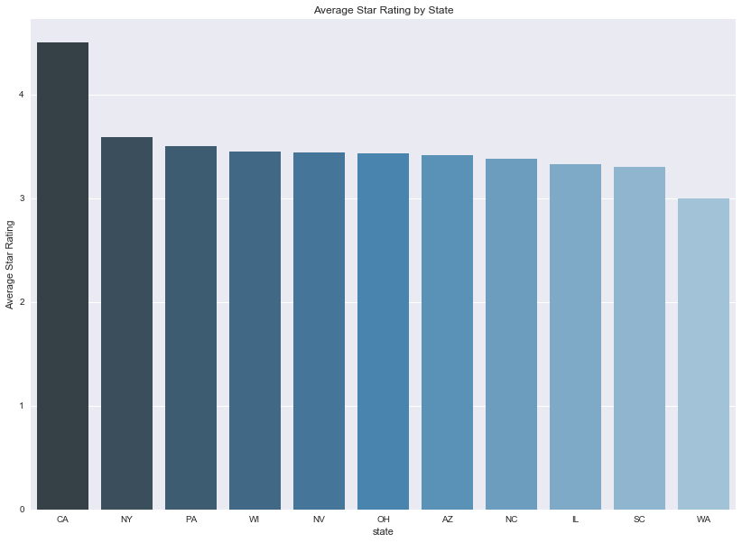
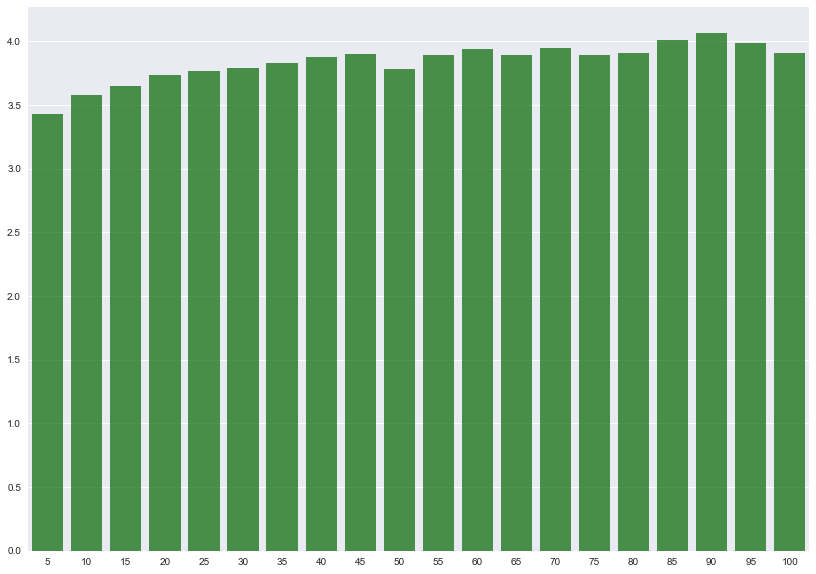
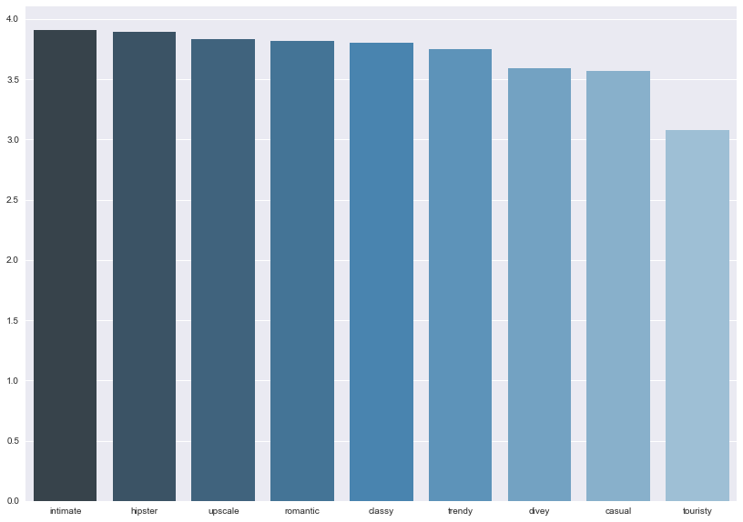
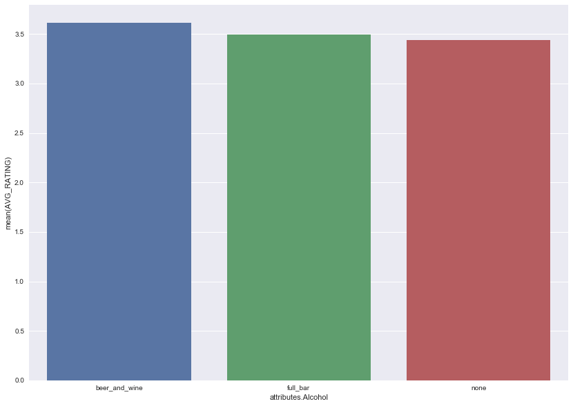
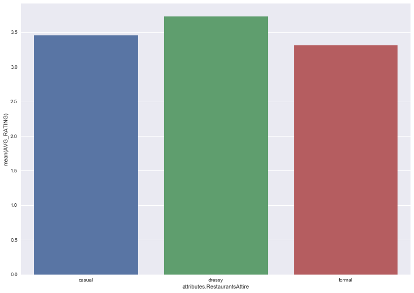
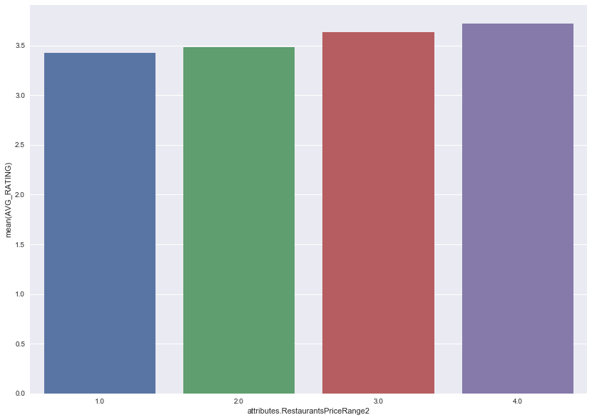
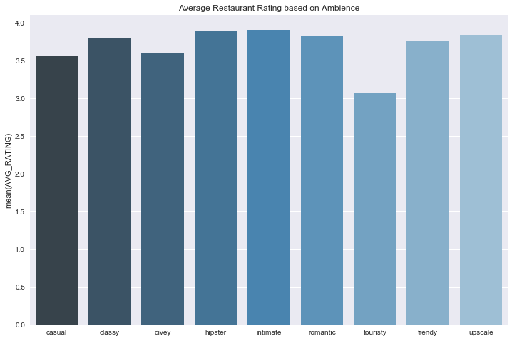
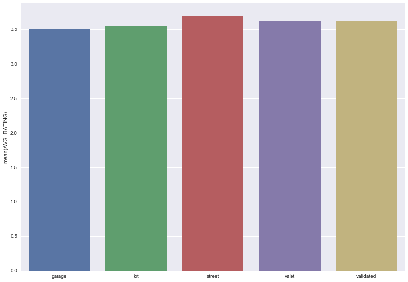
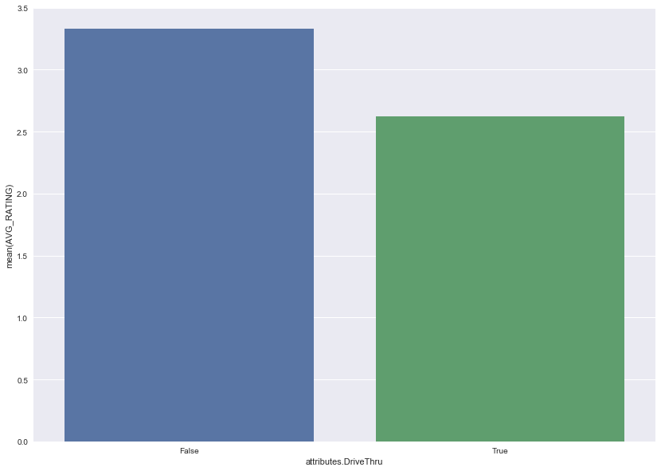
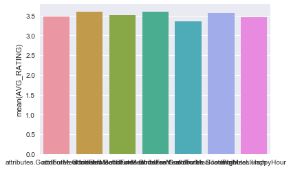

## Part 0: Data Processing and EDA

### Importing Data


```python
import numpy as np
import pandas as pd
import seaborn as sns
import json
import matplotlib
import matplotlib.pyplot as plt
import sklearn.metrics as metrics
from sklearn.model_selection import cross_val_score
from sklearn import tree
from sklearn.tree import DecisionTreeClassifier
from sklearn.ensemble import RandomForestClassifier
from sklearn.ensemble import AdaBoostClassifier
from sklearn.linear_model import LogisticRegressionCV
from random import *
from math import log
from pandas.io.json import json_normalize
import copy
pd.set_option('display.max_columns', None)

from scipy.stats.stats import pearsonr   
%matplotlib inline
```


```python
with open('dataset/business.json') as f:
    business_data = [json.loads(line) for line in f]
with open('dataset/user.json') as f:
    user_data = [json.loads(line) for line in f]  
```


```python
# preprocessed file with reviews only for restaurants
with open('dataset/restaurant_reviews_trimmed.json') as f:
    review_data = [json.loads(line) for line in f]
```


```python
# convert array to list
restaurant_reviews = review_data[0]
```


```python
# pull just restaurant data from business data
restaurant_data = [x for x in business_data if 'Restaurants' in x['categories']]
```


```python
del review_data
del business_data
```


### EDA


```python
restaurant_df = json_normalize(restaurant_data)
```


```python
statemeans_df = restaurant_df.groupby('state', as_index=False)['stars'].mean()
statemeans_df = statemeans_df.sort_values(by=['stars'], ascending=False)
states = [ "AK","AL","AR","AS","AZ","CA","CO","CT","DC","DE","FL","GA","GU","HI","IA","ID","IL","IN",
"KS","KY","LA","MA","MD","ME","MI","MN","MO","MS","MT","NC","ND","NE","NH","NJ","NM","NV","NY","OH",
"OK","OR","PA","PR","RI","SC","SD","TN","TX","UT","VA","VI","VT","WA","WI","WV","WY"]
statemeans_df = statemeans_df[statemeans_df['state'].isin(states)]
fig, ax = plt.subplots(figsize=(14,10))
ax=sns.barplot(x='state',y='stars',palette="Blues_d", data=statemeans_df)
ax.set_ylabel('Average Star Rating')
ax.set_title('Average Star Rating by State')
```


    <matplotlib.text.Text at 0x110f4a668>





```python
numbermeans_df = restaurant_df.groupby('review_count', as_index=False)['stars'].mean()
#plt.plot(numbermeans_df['review_count'], numbermeans_df['stars'])

slices = np.linspace(0, len(numbermeans_df), len(numbermeans_df)/45+1, True).astype(np.int)
counts = np.diff(slices)
mean = np.add.reduceat(numbermeans_df['stars'], slices[:-1]) / counts
fig, ax = plt.subplots(figsize=(14,10))
ax = sns.barplot(x=[x*10 for x in range(len(mean))], y=mean, color = 'green', alpha=0.75)
ax.set(xticklabels = [(x+1)*5 for x in range(21)]);
```


    /Users/PeterAyala/anaconda/lib/python3.6/site-packages/ipykernel_launcher.py:4: DeprecationWarning: object of type <class 'float'> cannot be safely interpreted as an integer.
      after removing the cwd from sys.path.





```python
ambience_headers=restaurant_df.columns[4:13].values
ambience_dict = {}

for item in ambience_headers:
    trimmed_name = item[20:]
    ambience_dict[trimmed_name] = restaurant_df.loc[restaurant_df[item] == True, 'stars'].mean()

pairs = zip(list(ambience_dict.keys()), list(ambience_dict.values()))
pairs = sorted(pairs, key=lambda x: x[1], reverse=True)
ambiences, means = zip(*pairs)
fig, ax = plt.subplots(figsize=(14,10))
ax=sns.barplot(x=ambiences, y=means, palette='Blues_d')
```





```python
dietary_headers = restaurant_df.columns[34:41]
dietary_dict={}

for item in dietary_headers:
    trimmed_name = item[31:]
    dietary_dict[trimmed_name] = restaurant_df.loc[restaurant_df[item] == True, 'stars'].mean()

pairs = zip(list(dietary_dict.keys()), list(dietary_dict.values()))
pairs = sorted(pairs, key=lambda x: x[1], reverse=True)
dietaryrestrictions, means = zip(*pairs)
fig, ax = plt.subplots(figsize=(14,10))
ax=sns.barplot(x=dietaryrestrictions, y=means, palette='Blues_d')
```


```python
def create_pivot_restaurant(df, cat):
    sub_df = df[[cat,'stars']]
    pivot = pd.pivot_table(sub_df,index=[cat], aggfunc=np.sum) 
    pivot['TOTAL_COUNT'] = sub_df[cat].value_counts() 
    pivot['AVG_RATING'] = pivot['stars']/pivot['TOTAL_COUNT'] 
    return pivot
```


```python
d = create_pivot_restaurant(restaurant_df, 'attributes.Alcohol')
d
```


<div>
<style>
    .dataframe thead tr:only-child th {
        text-align: right;
    }

    .dataframe thead th {
        text-align: left;
    }

    .dataframe tbody tr th {
        vertical-align: top;
    }
</style>
<table border="1" class="dataframe">
  <thead>
    <tr style="text-align: right;">
      <th></th>
      <th>stars</th>
      <th>TOTAL_COUNT</th>
      <th>AVG_RATING</th>
    </tr>
    <tr>
      <th>attributes.Alcohol</th>
      <th></th>
      <th></th>
      <th></th>
    </tr>
  </thead>
  <tbody>
    <tr>
      <th>beer_and_wine</th>
      <td>21917.5</td>
      <td>6066</td>
      <td>3.613172</td>
    </tr>
    <tr>
      <th>full_bar</th>
      <td>55407.5</td>
      <td>15853</td>
      <td>3.495080</td>
    </tr>
    <tr>
      <th>none</th>
      <td>63020.5</td>
      <td>18316</td>
      <td>3.440735</td>
    </tr>
  </tbody>
</table>
</div>


```python
fig, ax = plt.subplots(figsize=(14,10))
sns.barplot(d.index, d['AVG_RATING'], ax = ax)
```


    <matplotlib.axes._subplots.AxesSubplot at 0x1111bbac8>





```python
restaurant_df_v2 = restaurant_df
d = create_pivot_restaurant(restaurant_df_v2, 'attributes.RestaurantsAttire')
d
```


<div>
<style>
    .dataframe thead tr:only-child th {
        text-align: right;
    }

    .dataframe thead th {
        text-align: left;
    }

    .dataframe tbody tr th {
        vertical-align: top;
    }
</style>
<table border="1" class="dataframe">
  <thead>
    <tr style="text-align: right;">
      <th></th>
      <th>stars</th>
      <th>TOTAL_COUNT</th>
      <th>AVG_RATING</th>
    </tr>
    <tr>
      <th>attributes.RestaurantsAttire</th>
      <th></th>
      <th></th>
      <th></th>
    </tr>
  </thead>
  <tbody>
    <tr>
      <th>casual</th>
      <td>149545.5</td>
      <td>43276</td>
      <td>3.455622</td>
    </tr>
    <tr>
      <th>dressy</th>
      <td>5207.0</td>
      <td>1397</td>
      <td>3.727273</td>
    </tr>
    <tr>
      <th>formal</th>
      <td>413.5</td>
      <td>125</td>
      <td>3.308000</td>
    </tr>
  </tbody>
</table>
</div>


```python
fig, ax = plt.subplots(figsize=(14,10))
sns.barplot(d.index, d['AVG_RATING'], ax = ax)
```


    <matplotlib.axes._subplots.AxesSubplot at 0x1117845c0>





```python
r = create_pivot_restaurant(restaurant_df_v2, 'attributes.RestaurantsPriceRange2')
r
```


<div>
<style>
    .dataframe thead tr:only-child th {
        text-align: right;
    }

    .dataframe thead th {
        text-align: left;
    }

    .dataframe tbody tr th {
        vertical-align: top;
    }
</style>
<table border="1" class="dataframe">
  <thead>
    <tr style="text-align: right;">
      <th></th>
      <th>stars</th>
      <th>TOTAL_COUNT</th>
      <th>AVG_RATING</th>
    </tr>
    <tr>
      <th>attributes.RestaurantsPriceRange2</th>
      <th></th>
      <th></th>
      <th></th>
    </tr>
  </thead>
  <tbody>
    <tr>
      <th>1.0</th>
      <td>65102.5</td>
      <td>19013</td>
      <td>3.424105</td>
    </tr>
    <tr>
      <th>2.0</th>
      <td>86878.5</td>
      <td>24919</td>
      <td>3.486436</td>
    </tr>
    <tr>
      <th>3.0</th>
      <td>10331.5</td>
      <td>2845</td>
      <td>3.631459</td>
    </tr>
    <tr>
      <th>4.0</th>
      <td>1998.0</td>
      <td>537</td>
      <td>3.720670</td>
    </tr>
  </tbody>
</table>
</div>


```python
fig, ax = plt.subplots(figsize=(14,10))
sns.barplot(r.index, r['AVG_RATING'], ax = ax);
```





```python
ambience_ratings = {}
for a in ['attributes.Ambience.casual', 'attributes.Ambience.classy', 'attributes.Ambience.divey',
          'attributes.Ambience.hipster', 'attributes.Ambience.intimate', 'attributes.Ambience.romantic',
          'attributes.Ambience.touristy', 'attributes.Ambience.trendy', 'attributes.Ambience.upscale']:
    ambience_ratings[a] =  create_pivot_restaurant(restaurant_df, a).iloc[1]
```


```python
ambience_df = pd.DataFrame.from_dict(ambience_ratings, orient = 'index')
ambience_df
```


<div>
<style>
    .dataframe thead tr:only-child th {
        text-align: right;
    }

    .dataframe thead th {
        text-align: left;
    }

    .dataframe tbody tr th {
        vertical-align: top;
    }
</style>
<table border="1" class="dataframe">
  <thead>
    <tr style="text-align: right;">
      <th></th>
      <th>stars</th>
      <th>TOTAL_COUNT</th>
      <th>AVG_RATING</th>
    </tr>
  </thead>
  <tbody>
    <tr>
      <th>attributes.Ambience.casual</th>
      <td>64843.5</td>
      <td>18166.0</td>
      <td>3.569498</td>
    </tr>
    <tr>
      <th>attributes.Ambience.classy</th>
      <td>3123.5</td>
      <td>821.0</td>
      <td>3.804507</td>
    </tr>
    <tr>
      <th>attributes.Ambience.divey</th>
      <td>3012.5</td>
      <td>838.0</td>
      <td>3.594869</td>
    </tr>
    <tr>
      <th>attributes.Ambience.hipster</th>
      <td>3186.0</td>
      <td>818.0</td>
      <td>3.894866</td>
    </tr>
    <tr>
      <th>attributes.Ambience.intimate</th>
      <td>1985.5</td>
      <td>508.0</td>
      <td>3.908465</td>
    </tr>
    <tr>
      <th>attributes.Ambience.romantic</th>
      <td>1904.5</td>
      <td>499.0</td>
      <td>3.816633</td>
    </tr>
    <tr>
      <th>attributes.Ambience.touristy</th>
      <td>553.5</td>
      <td>180.0</td>
      <td>3.075000</td>
    </tr>
    <tr>
      <th>attributes.Ambience.trendy</th>
      <td>6536.0</td>
      <td>1741.0</td>
      <td>3.754164</td>
    </tr>
    <tr>
      <th>attributes.Ambience.upscale</th>
      <td>1338.5</td>
      <td>349.0</td>
      <td>3.835244</td>
    </tr>
  </tbody>
</table>
</div>


```python
fig, ax = plt.subplots(figsize=(12,8))
index = [x.split('.')[2] for x in ambience_df.index]
sns.barplot(index, ambience_df['AVG_RATING'], ax = ax, palette = "Blues_d")
ax.set_title('Average Restaurant Rating based on Ambience');
```





```python
parking_ratings = {}
for a in ['attributes.BusinessParking.garage', 'attributes.BusinessParking.lot', 'attributes.BusinessParking.street',
          'attributes.BusinessParking.valet', 'attributes.BusinessParking.validated']:
    parking_ratings[a] =  create_pivot_restaurant(restaurant_df_v2, a).iloc[1]
parking_df = pd.DataFrame.from_dict(parking_ratings, orient = 'index')
parking_df
```


<div>
<style>
    .dataframe thead tr:only-child th {
        text-align: right;
    }

    .dataframe thead th {
        text-align: left;
    }

    .dataframe tbody tr th {
        vertical-align: top;
    }
</style>
<table border="1" class="dataframe">
  <thead>
    <tr style="text-align: right;">
      <th></th>
      <th>stars</th>
      <th>TOTAL_COUNT</th>
      <th>AVG_RATING</th>
    </tr>
  </thead>
  <tbody>
    <tr>
      <th>attributes.BusinessParking.garage</th>
      <td>7593.5</td>
      <td>2171.0</td>
      <td>3.497697</td>
    </tr>
    <tr>
      <th>attributes.BusinessParking.lot</th>
      <td>58328.0</td>
      <td>16437.0</td>
      <td>3.548579</td>
    </tr>
    <tr>
      <th>attributes.BusinessParking.street</th>
      <td>32030.5</td>
      <td>8676.0</td>
      <td>3.691851</td>
    </tr>
    <tr>
      <th>attributes.BusinessParking.valet</th>
      <td>3769.5</td>
      <td>1039.0</td>
      <td>3.628008</td>
    </tr>
    <tr>
      <th>attributes.BusinessParking.validated</th>
      <td>862.5</td>
      <td>238.0</td>
      <td>3.623950</td>
    </tr>
  </tbody>
</table>
</div>


```python
fig, ax = plt.subplots(figsize=(14,10))
index = [x.split('.')[2] for x in parking_df.index]
sns.barplot(index, parking_df['AVG_RATING'], ax = ax);
```





```python
drivethru = create_pivot_restaurant(restaurant_df, 'attributes.DriveThru')
drivethru
```


<div>
<style>
    .dataframe thead tr:only-child th {
        text-align: right;
    }

    .dataframe thead th {
        text-align: left;
    }

    .dataframe tbody tr th {
        vertical-align: top;
    }
</style>
<table border="1" class="dataframe">
  <thead>
    <tr style="text-align: right;">
      <th></th>
      <th>stars</th>
      <th>TOTAL_COUNT</th>
      <th>AVG_RATING</th>
    </tr>
    <tr>
      <th>attributes.DriveThru</th>
      <th></th>
      <th></th>
      <th></th>
    </tr>
  </thead>
  <tbody>
    <tr>
      <th>False</th>
      <td>12276.5</td>
      <td>3686</td>
      <td>3.330575</td>
    </tr>
    <tr>
      <th>True</th>
      <td>6171.0</td>
      <td>2352</td>
      <td>2.623724</td>
    </tr>
  </tbody>
</table>
</div>


```python
fig, ax = plt.subplots(figsize=(14,10))
sns.barplot(drivethru.index, drivethru['AVG_RATING'])
```


    <matplotlib.axes._subplots.AxesSubplot at 0x1119e48d0>





```python
create_pivot_restaurant(restaurant_df, 'attributes.GoodForKids')
```


<div>
<style>
    .dataframe thead tr:only-child th {
        text-align: right;
    }

    .dataframe thead th {
        text-align: left;
    }

    .dataframe tbody tr th {
        vertical-align: top;
    }
</style>
<table border="1" class="dataframe">
  <thead>
    <tr style="text-align: right;">
      <th></th>
      <th>stars</th>
      <th>TOTAL_COUNT</th>
      <th>AVG_RATING</th>
    </tr>
    <tr>
      <th>attributes.GoodForKids</th>
      <th></th>
      <th></th>
      <th></th>
    </tr>
  </thead>
  <tbody>
    <tr>
      <th>False</th>
      <td>26598.0</td>
      <td>7640</td>
      <td>3.481414</td>
    </tr>
    <tr>
      <th>True</th>
      <td>130648.0</td>
      <td>37796</td>
      <td>3.456662</td>
    </tr>
  </tbody>
</table>
</div>


```python
good_for_meals = {}
for a in ['attributes.GoodForMeal.breakfast', 'attributes.GoodForMeal.brunch', 
          'attributes.GoodForMeal.dessert', 'attributes.GoodForMeal.dinner', 'attributes.GoodForMeal.latenight',
          'attributes.GoodForMeal.lunch', 'attributes.HappyHour']:
    good_for_meals[a] =  create_pivot_restaurant(restaurant_df, a).iloc[1]
    
good_for_meals_df = pd.DataFrame.from_dict(good_for_meals, orient = 'index')
good_for_meals_df
```


<div>
<style>
    .dataframe thead tr:only-child th {
        text-align: right;
    }

    .dataframe thead th {
        text-align: left;
    }

    .dataframe tbody tr th {
        vertical-align: top;
    }
</style>
<table border="1" class="dataframe">
  <thead>
    <tr style="text-align: right;">
      <th></th>
      <th>stars</th>
      <th>TOTAL_COUNT</th>
      <th>AVG_RATING</th>
    </tr>
  </thead>
  <tbody>
    <tr>
      <th>attributes.GoodForMeal.breakfast</th>
      <td>12970.0</td>
      <td>3722.0</td>
      <td>3.484686</td>
    </tr>
    <tr>
      <th>attributes.GoodForMeal.brunch</th>
      <td>12790.5</td>
      <td>3549.0</td>
      <td>3.603973</td>
    </tr>
    <tr>
      <th>attributes.GoodForMeal.dessert</th>
      <td>5325.0</td>
      <td>1513.0</td>
      <td>3.519498</td>
    </tr>
    <tr>
      <th>attributes.GoodForMeal.dinner</th>
      <td>54958.5</td>
      <td>15299.0</td>
      <td>3.592294</td>
    </tr>
    <tr>
      <th>attributes.GoodForMeal.latenight</th>
      <td>8282.5</td>
      <td>2473.0</td>
      <td>3.349171</td>
    </tr>
    <tr>
      <th>attributes.GoodForMeal.lunch</th>
      <td>63607.5</td>
      <td>17817.0</td>
      <td>3.570045</td>
    </tr>
    <tr>
      <th>attributes.HappyHour</th>
      <td>14500.0</td>
      <td>4185.0</td>
      <td>3.464755</td>
    </tr>
  </tbody>
</table>
</div>


```python
sns.barplot(good_for_meals_df.index, good_for_meals_df['AVG_RATING'])
```


    <matplotlib.axes._subplots.AxesSubplot at 0x111a4c828>





## Part 1: Create a Baseline

### Getting global averages


```python
user_total = [x['average_stars'] for x in user_data]
global_user_average = sum(user_total)/len(user_total)
print (global_user_average)
```


```python
restaurant_total = [x['stars'] for x in restaurant_data]
global_restaurant_average = sum(restaurant_total)/len(restaurant_total)
print (global_restaurant_average)
```


```python
reviews_total = [x['stars'] for x in restaurant_reviews]
global_review_average = sum(reviews_total)/len(reviews_total)
print (global_review_average)
```


### Getting restaurant and user biases


```python
# for easy lookup based on user id
user_dict = {}
for item in user_data:
    user_id = item['user_id']
    user_dict[user_id] = item
```


```python
user_deviations = {}
for item in user_data:
    user_id = item['user_id']
    user_deviations[user_id] = item['average_stars'] - global_user_average
    
```


```python
restaurant_deviations = {}
for item in restaurant_data:
    rest_id = item['business_id']
    restaurant_deviations[rest_id] = item['stars'] - global_restaurant_average
```


### Rating the Model


```python
#getting a random evaluation set of 20000
evaluation_set = np.random.choice(restaurant_reviews, size = 20000)

```


```python
evaluation_df = pd.DataFrame(list(evaluation_set))
```


```python
evaluation_df = evaluation_df.drop(['cool', 'date', 'funny','text','useful'], axis = 1)

```


```python
def baseline(user_id, business_id):
    pred = global_review_average + user_deviations[user_id] + restaurant_deviations[business_id]
    return pred
```


```python
evaluation_df['baseline_pred'] = [baseline(x,y) for (x,y) in zip(evaluation_df['user_id'],evaluation_df['business_id'])]
```


```python
score = metrics.mean_squared_error(evaluation_df['stars'], evaluation_df['baseline_pred'])
print (score)
```


```python
del evaluation_df
```


## Part 2: Create a Regularized Regression

### Creating training, validating, and testing sets


```python
# take 100000 reviews as sample
data_array = (np.random.choice(restaurant_reviews, size = 100000))
data_set = list(data_array)
```


```python
# find all categories for one-hot encoding purposes
from collections import Counter
all_categories = []
for r in restaurant_data:
    if 'Restaurants' in r['categories']:
        for c in r['categories']:
            all_categories.append(c)
```


```python
# take 150 most popular categories
counts = list (Counter(all_categories).items())
counts.sort(key=lambda x: x[1], reverse = True)
most_popular = [x[0] for x in counts[:150]]

```


```python
expanded_reviews = copy.deepcopy(data_array)
```


```python
# add business and user info
for review in expanded_reviews:
    #print (review)
    restaurant = review['business_id']
    user = review['user_id']
    restaurant_info = restaurant_dict[restaurant]
    #print (restaurant_info)
    user_info = user_dict[user]
    for attribute in restaurant_info:
        #print (attribute)
        if attribute not in ['is_open', 'latitude','longitude','name','business_id',
                             'neighborhood','address','city','postal_code','hours']:
            if attribute == 'categories':
                for c in most_popular:
                    if c in restaurant_info[attribute]:
                        review['R_' +  c] = 1
                    else:
                        review['R_' +  c] = 0
            else:         
                review['R_' + attribute] = restaurant_info[attribute]
    for attribute in user_info:
        if attribute not in ['user_id','name']:   
            if attribute == 'friends':
                review['U_friends'] = len(user_info[attribute])
            elif attribute == 'yelping_since':
                review['U_yelping_since'] = user_info[attribute][:4]
            elif attribute == 'elite':
                if user_info[attribute]:
                    review['U_elite'] = True
                else:
                    review['U_elite'] = False        
            else:
                review['U_' + attribute] = user_info[attribute] 
```


```python
# create pandas dataframe
flatframe = json_normalize(expanded_reviews)
flatframe = flatframe.drop(['text','useful','funny','cool','date'], axis=1)
```


```python
# change user since
flatframe['U_years_yelping'] = [2015 - int(x) for x in flatframe['U_yelping_since']]
flatframe.drop(['U_yelping_since'],axis = 1, inplace = True)
```


```python
# drop ids
flatframe = flatframe.drop(['business_id', 'review_id', 'user_id'], axis = 1)
```


```python
#one hot encode state
flatframe = pd.get_dummies(flatframe, columns = ['R_state'])
```


```python
# train test split
msk = np.random.rand(len(flatframe)) < 0.5
data_train = flatframe[msk]
data_test = flatframe[~msk]
```


### Making the Model


```python

```

