## Contents
{:.no_toc}
*  
{: toc}

## Part 0: Data Processing and EDA

### Importing Data


```python
import numpy as np
import pandas as pd
import seaborn as sns
import json
import matplotlib
import matplotlib.pyplot as plt
import sklearn.metrics as metrics
from sklearn.model_selection import cross_val_score
from sklearn.linear_model import LinearRegression
from sklearn.linear_model import LogisticRegressionCV
from sklearn.linear_model import RidgeCV
from sklearn.linear_model import LassoCV
from random import *
from math import log
import copy
pd.set_option('display.max_columns', None)
from pandas.io.json import json_normalize

from scipy.stats.stats import pearsonr   
%matplotlib inline
```


```python
with open('dataset/business.json') as f:
    business_data = [json.loads(line) for line in f]
with open('dataset/user.json') as f:
    user_data = [json.loads(line) for line in f]  
```


```python
with open('dataset/restaurant_reviews.json', encoding = 'utf-8') as f:
    review_data = [json.loads(line) for line in f]
```


```python
restaurant_reviews = review_data[0]
```


```python
restaurant_data = [x for x in business_data if 'Restaurants' in x['categories']]
```


```python
del review_data
del business_data
```


### EDA


```python
restaurant_df = json_normalize(restaurant_data)
```


```python
statemeans_df = restaurant_df.groupby('state', as_index=False)['stars'].mean()
statemeans_df = statemeans_df.sort_values(by=['stars'], ascending=False)
states = [ "AK","AL","AR","AS","AZ","CA","CO","CT","DC","DE","FL","GA","GU","HI","IA","ID","IL","IN",
"KS","KY","LA","MA","MD","ME","MI","MN","MO","MS","MT","NC","ND","NE","NH","NJ","NM","NV","NY","OH",
"OK","OR","PA","PR","RI","SC","SD","TN","TX","UT","VA","VI","VT","WA","WI","WV","WY"]
statemeans_df = statemeans_df[statemeans_df['state'].isin(states)]
fig, ax = plt.subplots(figsize=(14,10))
ax=sns.barplot(x='state',y='stars',palette="Blues_d", data=statemeans_df)
ax.set_ylabel('Average Star Rating')
ax.set_title('Average Star Rating by State')
```


    <matplotlib.text.Text at 0x2047eb0abe0>


```python
numbermeans_df = restaurant_df.groupby('review_count', as_index=False)['stars'].mean()
#plt.plot(numbermeans_df['review_count'], numbermeans_df['stars'])

slices = np.linspace(0, len(numbermeans_df), len(numbermeans_df)/45+1, True).astype(np.int)
counts = np.diff(slices)
mean = np.add.reduceat(numbermeans_df['stars'], slices[:-1]) / counts
fig, ax = plt.subplots(figsize=(14,10))
ax = sns.barplot(x=[x*10 for x in range(len(mean))], y=mean, color = 'green', alpha=0.75)
ax.set(xticklabels = [(x+1)*5 for x in range(21)]);
```


    C:\Users\ikhoon\Anaconda3\lib\site-packages\ipykernel_launcher.py:5: DeprecationWarning: object of type <class 'float'> cannot be safely interpreted as an integer.
      """


```python
dietary_headers = restaurant_df.columns[34:41]
dietary_dict={}

for item in dietary_headers:
    trimmed_name = item[31:]
    dietary_dict[trimmed_name] = restaurant_df.loc[restaurant_df[item] == True, 'stars'].mean()

pairs = zip(list(dietary_dict.keys()), list(dietary_dict.values()))
pairs = sorted(pairs, key=lambda x: x[1], reverse=True)
dietaryrestrictions, means = zip(*pairs)
fig, ax = plt.subplots(figsize=(14,10))
ax=sns.barplot(x=dietaryrestrictions, y=means, palette='Blues_d')
```


```python
def create_pivot_restaurant(df, cat):
    sub_df = df[[cat,'stars']]
    pivot = pd.pivot_table(sub_df,index=[cat], aggfunc=np.sum) 
    pivot['TOTAL_COUNT'] = sub_df[cat].value_counts() 
    pivot['AVG_RATING'] = pivot['stars']/pivot['TOTAL_COUNT'] 
    return pivot
```


```python
d = create_pivot_restaurant(restaurant_df, 'attributes.Alcohol')
d
```


<div>
<style>
    .dataframe thead tr:only-child th {
        text-align: right;
    }

    .dataframe thead th {
        text-align: left;
    }

    .dataframe tbody tr th {
        vertical-align: top;
    }
</style>
<table border="1" class="dataframe">
  <thead>
    <tr style="text-align: right;">
      <th></th>
      <th>stars</th>
      <th>TOTAL_COUNT</th>
      <th>AVG_RATING</th>
    </tr>
    <tr>
      <th>attributes.Alcohol</th>
      <th></th>
      <th></th>
      <th></th>
    </tr>
  </thead>
  <tbody>
    <tr>
      <th>beer_and_wine</th>
      <td>21917.5</td>
      <td>6066</td>
      <td>3.613172</td>
    </tr>
    <tr>
      <th>full_bar</th>
      <td>55407.5</td>
      <td>15853</td>
      <td>3.495080</td>
    </tr>
    <tr>
      <th>none</th>
      <td>63020.5</td>
      <td>18316</td>
      <td>3.440735</td>
    </tr>
  </tbody>
</table>
</div>


```python
fig, ax = plt.subplots(figsize=(14,10))
sns.barplot(d.index, d['AVG_RATING'], ax = ax)
```


    <matplotlib.axes._subplots.AxesSubplot at 0x2047ab97518>


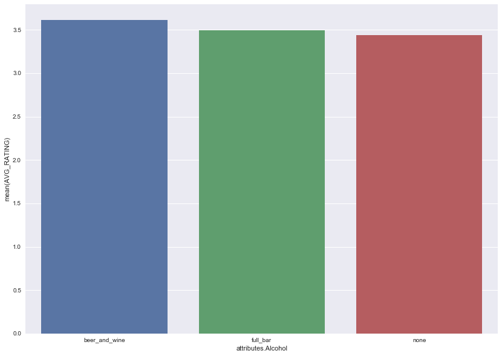


```python
d = create_pivot_restaurant(restaurant_df, 'attributes.RestaurantsAttire')
d
```


<div>
<style>
    .dataframe thead tr:only-child th {
        text-align: right;
    }

    .dataframe thead th {
        text-align: left;
    }

    .dataframe tbody tr th {
        vertical-align: top;
    }
</style>
<table border="1" class="dataframe">
  <thead>
    <tr style="text-align: right;">
      <th></th>
      <th>stars</th>
      <th>TOTAL_COUNT</th>
      <th>AVG_RATING</th>
    </tr>
    <tr>
      <th>attributes.RestaurantsAttire</th>
      <th></th>
      <th></th>
      <th></th>
    </tr>
  </thead>
  <tbody>
    <tr>
      <th>casual</th>
      <td>149545.5</td>
      <td>43276</td>
      <td>3.455622</td>
    </tr>
    <tr>
      <th>dressy</th>
      <td>5207.0</td>
      <td>1397</td>
      <td>3.727273</td>
    </tr>
    <tr>
      <th>formal</th>
      <td>413.5</td>
      <td>125</td>
      <td>3.308000</td>
    </tr>
  </tbody>
</table>
</div>


```python
fig, ax = plt.subplots(figsize=(14,10))
sns.barplot(d.index, d['AVG_RATING'], ax = ax)
```


    <matplotlib.axes._subplots.AxesSubplot at 0x2047ee81898>


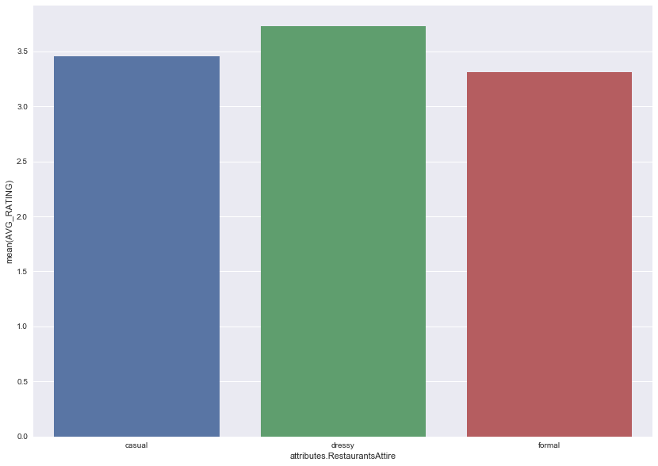


```python
r = create_pivot_restaurant(restaurant_df, 'attributes.RestaurantsPriceRange2')
r
```


<div>
<style>
    .dataframe thead tr:only-child th {
        text-align: right;
    }

    .dataframe thead th {
        text-align: left;
    }

    .dataframe tbody tr th {
        vertical-align: top;
    }
</style>
<table border="1" class="dataframe">
  <thead>
    <tr style="text-align: right;">
      <th></th>
      <th>stars</th>
      <th>TOTAL_COUNT</th>
      <th>AVG_RATING</th>
    </tr>
    <tr>
      <th>attributes.RestaurantsPriceRange2</th>
      <th></th>
      <th></th>
      <th></th>
    </tr>
  </thead>
  <tbody>
    <tr>
      <th>1.0</th>
      <td>65102.5</td>
      <td>19013</td>
      <td>3.424105</td>
    </tr>
    <tr>
      <th>2.0</th>
      <td>86878.5</td>
      <td>24919</td>
      <td>3.486436</td>
    </tr>
    <tr>
      <th>3.0</th>
      <td>10331.5</td>
      <td>2845</td>
      <td>3.631459</td>
    </tr>
    <tr>
      <th>4.0</th>
      <td>1998.0</td>
      <td>537</td>
      <td>3.720670</td>
    </tr>
  </tbody>
</table>
</div>


```python
fig, ax = plt.subplots(figsize=(14,10))
sns.barplot(r.index, r['AVG_RATING'], ax = ax);
```


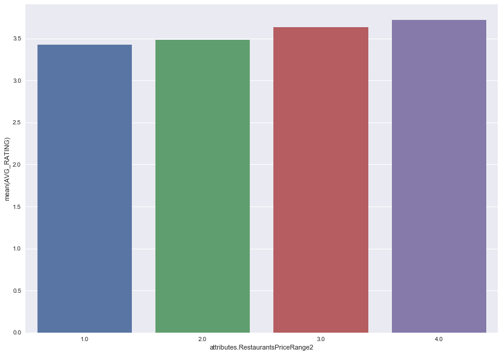


```python
ambience_ratings = {}
for a in ['attributes.Ambience.casual', 'attributes.Ambience.classy', 'attributes.Ambience.divey',
          'attributes.Ambience.hipster', 'attributes.Ambience.intimate', 'attributes.Ambience.romantic',
          'attributes.Ambience.touristy', 'attributes.Ambience.trendy', 'attributes.Ambience.upscale']:
    ambience_ratings[a] =  create_pivot_restaurant(restaurant_df, a).iloc[1]
```


```python
ambience_df = pd.DataFrame.from_dict(ambience_ratings, orient = 'index')
ambience_df
```


<div>
<style>
    .dataframe thead tr:only-child th {
        text-align: right;
    }

    .dataframe thead th {
        text-align: left;
    }

    .dataframe tbody tr th {
        vertical-align: top;
    }
</style>
<table border="1" class="dataframe">
  <thead>
    <tr style="text-align: right;">
      <th></th>
      <th>stars</th>
      <th>TOTAL_COUNT</th>
      <th>AVG_RATING</th>
    </tr>
  </thead>
  <tbody>
    <tr>
      <th>attributes.Ambience.casual</th>
      <td>64843.5</td>
      <td>18166.0</td>
      <td>3.569498</td>
    </tr>
    <tr>
      <th>attributes.Ambience.classy</th>
      <td>3123.5</td>
      <td>821.0</td>
      <td>3.804507</td>
    </tr>
    <tr>
      <th>attributes.Ambience.divey</th>
      <td>3012.5</td>
      <td>838.0</td>
      <td>3.594869</td>
    </tr>
    <tr>
      <th>attributes.Ambience.hipster</th>
      <td>3186.0</td>
      <td>818.0</td>
      <td>3.894866</td>
    </tr>
    <tr>
      <th>attributes.Ambience.intimate</th>
      <td>1985.5</td>
      <td>508.0</td>
      <td>3.908465</td>
    </tr>
    <tr>
      <th>attributes.Ambience.romantic</th>
      <td>1904.5</td>
      <td>499.0</td>
      <td>3.816633</td>
    </tr>
    <tr>
      <th>attributes.Ambience.touristy</th>
      <td>553.5</td>
      <td>180.0</td>
      <td>3.075000</td>
    </tr>
    <tr>
      <th>attributes.Ambience.trendy</th>
      <td>6536.0</td>
      <td>1741.0</td>
      <td>3.754164</td>
    </tr>
    <tr>
      <th>attributes.Ambience.upscale</th>
      <td>1338.5</td>
      <td>349.0</td>
      <td>3.835244</td>
    </tr>
  </tbody>
</table>
</div>


```python
fig, ax = plt.subplots(figsize=(12,8))
index = [x.split('.')[2] for x in ambience_df.index]
sns.barplot(index, ambience_df['AVG_RATING'], ax = ax, palette = "Blues_d")
ax.set_title('Average Restaurant Rating based on Ambience');
```


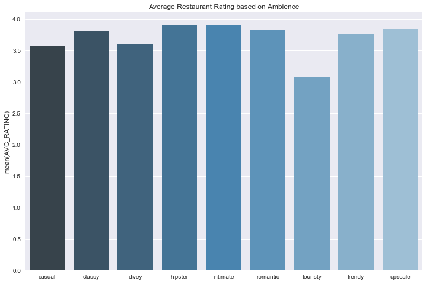


```python
parking_ratings = {}
for a in ['attributes.BusinessParking.garage', 'attributes.BusinessParking.lot', 'attributes.BusinessParking.street',
          'attributes.BusinessParking.valet', 'attributes.BusinessParking.validated']:
    parking_ratings[a] =  create_pivot_restaurant(restaurant_df, a).iloc[1]
parking_df = pd.DataFrame.from_dict(parking_ratings, orient = 'index')
parking_df
```


<div>
<style>
    .dataframe thead tr:only-child th {
        text-align: right;
    }

    .dataframe thead th {
        text-align: left;
    }

    .dataframe tbody tr th {
        vertical-align: top;
    }
</style>
<table border="1" class="dataframe">
  <thead>
    <tr style="text-align: right;">
      <th></th>
      <th>stars</th>
      <th>TOTAL_COUNT</th>
      <th>AVG_RATING</th>
    </tr>
  </thead>
  <tbody>
    <tr>
      <th>attributes.BusinessParking.garage</th>
      <td>7593.5</td>
      <td>2171.0</td>
      <td>3.497697</td>
    </tr>
    <tr>
      <th>attributes.BusinessParking.lot</th>
      <td>58328.0</td>
      <td>16437.0</td>
      <td>3.548579</td>
    </tr>
    <tr>
      <th>attributes.BusinessParking.street</th>
      <td>32030.5</td>
      <td>8676.0</td>
      <td>3.691851</td>
    </tr>
    <tr>
      <th>attributes.BusinessParking.valet</th>
      <td>3769.5</td>
      <td>1039.0</td>
      <td>3.628008</td>
    </tr>
    <tr>
      <th>attributes.BusinessParking.validated</th>
      <td>862.5</td>
      <td>238.0</td>
      <td>3.623950</td>
    </tr>
  </tbody>
</table>
</div>


```python
fig, ax = plt.subplots(figsize=(14,10))
index = [x.split('.')[2] for x in parking_df.index]
sns.barplot(index, parking_df['AVG_RATING'], ax = ax);
```


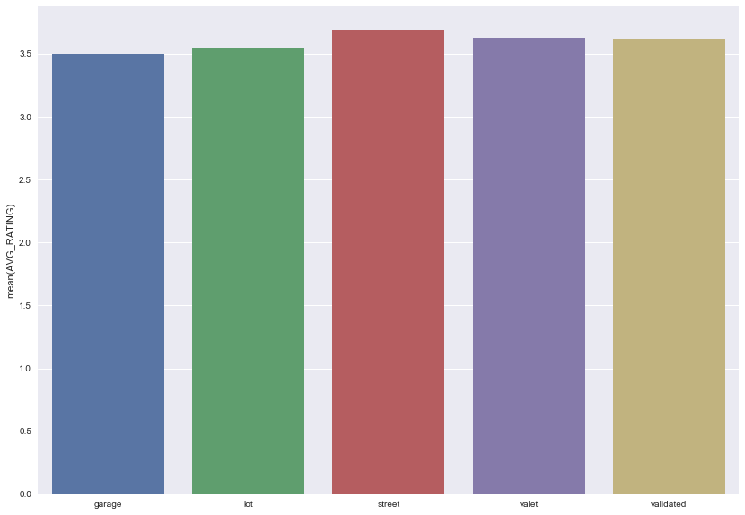


```python
drivethru = create_pivot_restaurant(restaurant_df, 'attributes.DriveThru')
drivethru
```


<div>
<style>
    .dataframe thead tr:only-child th {
        text-align: right;
    }

    .dataframe thead th {
        text-align: left;
    }

    .dataframe tbody tr th {
        vertical-align: top;
    }
</style>
<table border="1" class="dataframe">
  <thead>
    <tr style="text-align: right;">
      <th></th>
      <th>stars</th>
      <th>TOTAL_COUNT</th>
      <th>AVG_RATING</th>
    </tr>
    <tr>
      <th>attributes.DriveThru</th>
      <th></th>
      <th></th>
      <th></th>
    </tr>
  </thead>
  <tbody>
    <tr>
      <th>False</th>
      <td>12276.5</td>
      <td>3686</td>
      <td>3.330575</td>
    </tr>
    <tr>
      <th>True</th>
      <td>6171.0</td>
      <td>2352</td>
      <td>2.623724</td>
    </tr>
  </tbody>
</table>
</div>


```python
fig, ax = plt.subplots(figsize=(14,10))
sns.barplot(drivethru.index, drivethru['AVG_RATING'])
```


    <matplotlib.axes._subplots.AxesSubplot at 0x2047f261908>


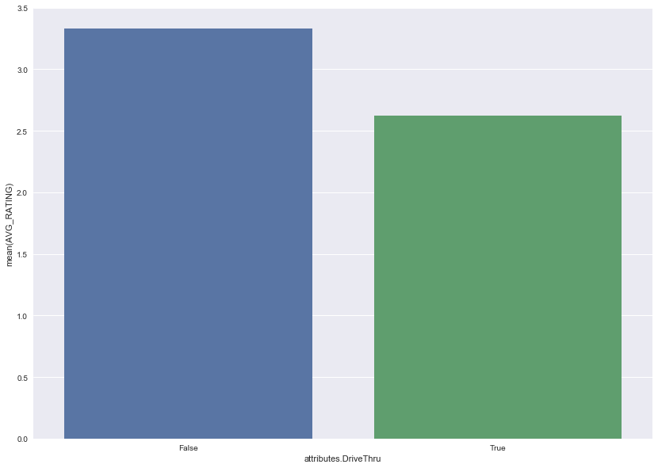


```python
create_pivot_restaurant(restaurant_df, 'attributes.GoodForKids')
```


<div>
<style>
    .dataframe thead tr:only-child th {
        text-align: right;
    }

    .dataframe thead th {
        text-align: left;
    }

    .dataframe tbody tr th {
        vertical-align: top;
    }
</style>
<table border="1" class="dataframe">
  <thead>
    <tr style="text-align: right;">
      <th></th>
      <th>stars</th>
      <th>TOTAL_COUNT</th>
      <th>AVG_RATING</th>
    </tr>
    <tr>
      <th>attributes.GoodForKids</th>
      <th></th>
      <th></th>
      <th></th>
    </tr>
  </thead>
  <tbody>
    <tr>
      <th>False</th>
      <td>26598.0</td>
      <td>7640</td>
      <td>3.481414</td>
    </tr>
    <tr>
      <th>True</th>
      <td>130648.0</td>
      <td>37796</td>
      <td>3.456662</td>
    </tr>
  </tbody>
</table>
</div>


```python
good_for_meals = {}
for a in ['attributes.GoodForMeal.breakfast', 'attributes.GoodForMeal.brunch', 
          'attributes.GoodForMeal.dessert', 'attributes.GoodForMeal.dinner', 'attributes.GoodForMeal.latenight',
          'attributes.GoodForMeal.lunch', 'attributes.HappyHour']:
    good_for_meals[a] =  create_pivot_restaurant(restaurant_df, a).iloc[1]
    
good_for_meals_df = pd.DataFrame.from_dict(good_for_meals, orient = 'index')
good_for_meals_df
```


<div>
<style>
    .dataframe thead tr:only-child th {
        text-align: right;
    }

    .dataframe thead th {
        text-align: left;
    }

    .dataframe tbody tr th {
        vertical-align: top;
    }
</style>
<table border="1" class="dataframe">
  <thead>
    <tr style="text-align: right;">
      <th></th>
      <th>stars</th>
      <th>TOTAL_COUNT</th>
      <th>AVG_RATING</th>
    </tr>
  </thead>
  <tbody>
    <tr>
      <th>attributes.GoodForMeal.breakfast</th>
      <td>12970.0</td>
      <td>3722.0</td>
      <td>3.484686</td>
    </tr>
    <tr>
      <th>attributes.GoodForMeal.brunch</th>
      <td>12790.5</td>
      <td>3549.0</td>
      <td>3.603973</td>
    </tr>
    <tr>
      <th>attributes.GoodForMeal.dessert</th>
      <td>5325.0</td>
      <td>1513.0</td>
      <td>3.519498</td>
    </tr>
    <tr>
      <th>attributes.GoodForMeal.dinner</th>
      <td>54958.5</td>
      <td>15299.0</td>
      <td>3.592294</td>
    </tr>
    <tr>
      <th>attributes.GoodForMeal.latenight</th>
      <td>8282.5</td>
      <td>2473.0</td>
      <td>3.349171</td>
    </tr>
    <tr>
      <th>attributes.GoodForMeal.lunch</th>
      <td>63607.5</td>
      <td>17817.0</td>
      <td>3.570045</td>
    </tr>
    <tr>
      <th>attributes.HappyHour</th>
      <td>14500.0</td>
      <td>4185.0</td>
      <td>3.464755</td>
    </tr>
  </tbody>
</table>
</div>


```python
sns.barplot(good_for_meals_df.index, good_for_meals_df['AVG_RATING'])
```


    <matplotlib.axes._subplots.AxesSubplot at 0x2047f2d4550>


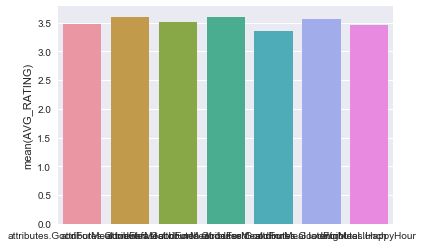


## Part 1: Create a Baseline

### Creating training, validating, and testing sets


```python
data_array = (np.random.choice(restaurant_reviews, size = 100000))
data_set = list(data_array)
```


As the dataset is so large, we had to take a subset of it to work with because of technical limitations of our computers.


```python
from collections import Counter
all_categories = []
for r in restaurant_data:
    if 'Restaurants' in r['categories']:
        for c in r['categories']:
            all_categories.append(c)
```


In the original dataset, "categories" is given as a list in each cell. We found all the unique categories here (e.g. French, Burgers, etc.).


```python
counts = list (Counter(all_categories).items())
counts.sort(key=lambda x: x[1], reverse = True)
most_popular = [x[0] for x in counts[:150]]
```


Many of the categories were either inappropriate (e.g. laundry) or too rare to be useful. Here, we narrowed down the categories to the top 150.


```python
restaurant_dict = {}
for item in restaurant_data:
    restaurant_id = item['business_id']
    restaurant_dict[restaurant_id] = item

user_dict = {}
for item in user_data:
    user_id = item['user_id']
    user_dict[user_id] = item
```


```python
expanded_reviews = copy.deepcopy(data_array)
```


```python
for review in expanded_reviews:
    #print (review)
    restaurant = review['business_id']
    user = review['user_id']
    restaurant_info = restaurant_dict[restaurant]
    #print (restaurant_info)
    user_info = user_dict[user]
    for attribute in restaurant_info:
        #print (attribute)
        if attribute not in ['is_open', 'latitude','longitude','name','business_id',
                             'neighborhood','address','city','postal_code','hours']:
            if attribute == 'categories':
                for c in most_popular:
                    if c in restaurant_info[attribute]:
                        review['R_' +  c] = 1
                    else:
                        review['R_' +  c] = 0
            else:         
                review['R_' + attribute] = restaurant_info[attribute]
    for attribute in user_info:
        if attribute not in ['user_id','name']:   
            if attribute == 'friends':
                review['U_friends'] = len(user_info[attribute])
            elif attribute == 'yelping_since':
                review['U_yelping_since'] = user_info[attribute][:4]
            elif attribute == 'elite':
                if user_info[attribute]:
                    review['U_elite'] = True
                else:
                    review['U_elite'] = False        
            else:
                review['U_' + attribute] = user_info[attribute] 
```


Here, we added user and business attributes to the reviews dictionary.


```python
flatframe = json_normalize(expanded_reviews)
flatframe = flatframe.drop(['text','useful','funny','cool','date'], axis=1)
```


```python
flatframe['U_years_yelping'] = [2015 - int(x) for x in flatframe['U_yelping_since']]
flatframe.drop(['U_yelping_since'],axis = 1, inplace = True)
```


We decided to change "U_yelping_since", which was a year, to the number of years a user has been active (so that it would make more sense as a continuous variable).


```python
flatframe_wids = flatframe.drop(['business_id', 'review_id', 'user_id'], axis = 1)
```


This was just for convenience when performing regression later==we didn't want to use the drop function every time we referred to the dataframe.


```python
#one hot encode
flatframe_wids = pd.get_dummies(flatframe_wids, columns = ['R_state', 
                                                    'R_attributes.Alcohol', 'R_attributes.AgesAllowed', 'R_attributes.RestaurantsAttire',
                                                    'R_attributes.RestaurantsPriceRange2','R_attributes.Smoking',
                                                    'R_attributes.WiFi', 'R_attributes.NoiseLevel','R_attributes.BYOBCorkage'])
```


```python
nan_count = {}
for column in flatframe_wids:
     nan_count[column] = flatframe_wids[column].isnull().sum()

nan_sorted = sorted(nan_count.items(), key=lambda x: x[1], reverse = True) 
drop_nans = [x[0] for x in nan_sorted if x[1] > 50000]
```


```python
flatframe_wids = flatframe_wids.drop(drop_nans, axis = 1)
flatframe_wids = flatframe_wids.fillna(flatframe_wids.mean())
```


There were many attributes with an unusually large number of NaNs (not 0 or False). We used mean imputation for many of these, but if more than half of the rows had missing values, we felt uncomfortable doing so and decided to drop the column entirely instead.


```python
msk = np.random.rand(len(flatframe_wids)) < 0.5
data_train = flatframe_wids[msk]
data_test = flatframe_wids[~msk]
```


### Getting global averages


```python
user_df = json_normalize(user_data)
```


```python
data_train_temp = flatframe[msk]
data_test_temp = flatframe[~msk]
```


For this part of the project, we needed to include business and user ids for lookup purposes, which we had earlier deleted.


```python
users = data_train_temp.user_id.unique()
user_total = user_df[user_df['user_id'].isin(users)]['average_stars']
global_user_average = sum(user_total)/len(user_total)
print (global_user_average)
```


    3.73744539253


```python
restaurants = data_train_temp.business_id.unique()
restaurant_total = restaurant_df[restaurant_df['business_id'].isin(restaurants)]['stars']
global_restaurant_average = sum(restaurant_total)/len(restaurant_total)
print (global_restaurant_average)
```


    3.5691960774


```python
global_review_average = data_train['stars'].mean()
print (global_review_average)
```


    3.7128174365126974


The "global user average" takes a single user and his/her average rating given as one data point. The 'global restaurant average' does the same with individual restaurants. The 'global review average' averages every rating from every review. These are different values as each individual rating is weighted differently in each method.

### Getting restaurant and user biases


```python
user_deviations = {}
for item in user_data:
    user_id = item['user_id']
    user_deviations[user_id] = item['average_stars'] - global_user_average
```


```python
restaurant_deviations = {}
for item in restaurant_data:
    rest_id = item['business_id']
    restaurant_deviations[rest_id] = item['stars'] - global_restaurant_average
```


We decided to use the global user average and the global restaurant average for the user and restaurant bias calculation respectively (rather than global review average for everything) because we felt that it was most appropriate to compare a user's average rating to other users and a restaurant's average rating to other restaurants rather than to an average of all reviews.

### Baseline Model


```python
Xtrain = data_train.drop(['stars'], axis = 1)
ytrain = data_train['stars']
Xtest = data_test.drop(['stars'], axis = 1)
ytest = data_test['stars']
```


```python
def baseline(user_id, business_id):
    pred = global_review_average + user_deviations[user_id] + restaurant_deviations[business_id]
    return int(round(pred))
```


```python
base_pred = [baseline(x,y) for x,y in zip(data_train_temp['user_id'],data_train_temp['business_id'])]
base_pred_test = [baseline(x,y) for x,y in zip(data_test_temp['user_id'],data_test_temp['business_id'])]
```


```python
print ("The accuracy score of the baseline model on the train set is {}"
       .format(metrics.accuracy_score(ytrain, base_pred)))
print ("The accuracy score of the baseline model on the test set is {}"
       .format(metrics.accuracy_score(ytest, base_pred_test)))
```


    The accuracy score of the baseline model on the train set is 0.3932413517296541
    The accuracy score of the baseline model on the test set is 0.38885777155431084


```python
pred_df_train = pd.DataFrame({'y' : ytrain, 'ypred' : base_pred})
pred_df_test = pd.DataFrame({'y' : ytest, 'ypred' : base_pred_test})

base_pred_avg = []
base_pred_test_avg = []
for i in [1, 2, 3, 4, 5]:
    base_pred_avg.append(pred_df_train[pred_df_train['y'] == i]['ypred'].mean())
    base_pred_test_avg.append(pred_df_test[pred_df_test['y'] == i]['ypred'].mean())
```


```python
fig, ax = plt.subplots(1, 1, figsize=(15, 8))
ax.plot([1, 2, 3, 4, 5], base_pred_avg, color='red')

ax.set_xlabel('Actual ratings')
ax.set_ylabel('Average Predicted ratings')
ax.set_title('Actual vs. avg. predicted ratings for baseline model, training set')
ax.set_ylim((1,5))
```


    (1, 5)


```python
fig, ax = plt.subplots(1, 1, figsize=(15, 8))
ax.plot([1, 2, 3, 4, 5], base_pred_test_avg, color='red')

ax.set_xlabel('Actual ratings')
ax.set_ylabel('Average Predicted ratings')
ax.set_title('Actual vs. avg. predicted ratings for baseline model, test set')
ax.set_ylim((1,5))
```


    (1, 5)


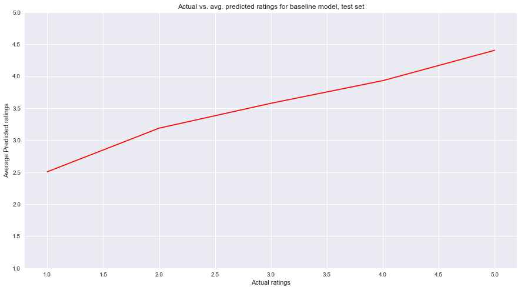


On average, our predictions for both the training and the test set follow the increasing trend of actual ratings but overestimate for lower ratings.

## Part 2: Create a Regularized Regression

### Linear Model


```python
model = LinearRegression()
model.fit(Xtrain, ytrain)
```


    LinearRegression(copy_X=True, fit_intercept=True, n_jobs=1, normalize=False)


We used a linear model rather than a logistic model as although the y-varaible was categorical (1, 2, 3, 4, or 5), it was ordinal.


```python
ypred = model.predict(Xtrain)
ypred_test = model.predict(Xtest)
predround = [int(round(x)) for x in ypred]
print ("The accuracy score of the linear model on the train set is {}"
       .format(metrics.accuracy_score(ytrain, predround)))
predround_test = [int(round(x)) for x in ypred_test]
print ("The accuracy score of the linear model on the test set is {}"
       .format(metrics.accuracy_score(ytest, predround_test)))
```


    The accuracy score of the linear model on the train set is 0.38662267546490703
    The accuracy score of the linear model on the test set is 0.3810962192438488


Here, we round the predictions from the model to the nearest integer to fit the predictions in the categories (1, 2, 3, 4, or 5).

### Lasso CV


```python
model_lasso = LassoCV().fit(Xtrain, ytrain)
```


```python
lasso_ypred = model_lasso.predict(Xtrain)
lasso_ypred_round = [int(round(x)) for x in lasso_ypred]
lasso_ypred_test = model_lasso.predict(Xtest)
lasso_ypred_test_round = [int(round(x)) for x in lasso_ypred_test]
```


```python
print ("The accuracy score of the lasso model on the train set is {}"
       .format(metrics.accuracy_score(ytrain, lasso_ypred_round)))
print ("The accuracy score of the lasso model on the test set is {}"
       .format(metrics.accuracy_score(ytest, lasso_ypred_test_round)))
```


    The accuracy score of the lasso model on the train set is 0.3672265546890622
    The accuracy score of the lasso model on the test set is 0.36415283056611325


### Ridge CV


```python
model_ridge = RidgeCV().fit(Xtrain, ytrain)
```


```python
ridge_ypred = model_ridge.predict(Xtrain)
ridge_ypred_round = [int(round(x)) for x in ridge_ypred]
ridge_ypred_test = model_ridge.predict(Xtest)
ridge_ypred_test_round = [int(round(x)) for x in ridge_ypred_test]
```


```python

print ("The accuracy score of the ridge model on the train set is {}"
       .format(metrics.accuracy_score(ytrain, ridge_ypred_round)))
print ("The accuracy score of the ridge model on the test set is {}"
       .format(metrics.accuracy_score(ytest, ridge_ypred_test_round)))
```


    The accuracy score of the ridge model on the train set is 0.3862627474505099
    The accuracy score of the ridge model on the test set is 0.38135627125425087


We will be using the regularized linear regression using the ridge method as it performed better than the lasso method for accuracy score (and very similarly to the naive linear regression).


```python
pred_df_train = pd.DataFrame({'y' : ytrain, 'ypred' : ridge_ypred_round})
pred_df_test = pd.DataFrame({'y' : ytest, 'ypred' : ridge_ypred_test_round})

ridge_pred_avg = []
ridge_pred_test_avg = []
for i in [1, 2, 3, 4, 5]:
    ridge_pred_avg.append(pred_df_train[pred_df_train['y'] == i]['ypred'].mean())
    ridge_pred_test_avg.append(pred_df_test[pred_df_test['y'] == i]['ypred'].mean())
```


```python
fig, ax = plt.subplots(1, 1, figsize=(15, 8))
ax.plot([1, 2, 3, 4, 5], ridge_pred_avg, color='red')

ax.set_xlabel('Actual ratings')
ax.set_ylabel('Average Predicted ratings')
ax.set_title('Actual vs. avg. predicted ratings for ridge-regularized linear model, training set')
ax.set_ylim((1,5))
```


    (1, 5)


```python
fig, ax = plt.subplots(1, 1, figsize=(15, 8))
ax.plot([1, 2, 3, 4, 5], ridge_pred_test_avg, color='red')

ax.set_xlabel('Actual ratings')
ax.set_ylabel('Average Predicted ratings')
ax.set_title('Actual vs. avg. predicted ratings for ridge-regularized linear model, test set')
ax.set_ylim((1,5))
```


    (1, 5)


On average, our predictions for both the training and the test set follow the increasing trend of actual ratings but overestimate for lower ratings and underestimate for higher ratings.

## Part 3: Matrix Factorization


```python

```


```python

```


```python

```


## Part 4: A Different Model

### Naive kNN Model


```python
from sklearn.neighbors import KNeighborsRegressor
knn = KNeighborsRegressor(n_neighbors=5, n_jobs=-1)
knn.fit(Xtrain, ytrain)
```


    KNeighborsRegressor(algorithm='auto', leaf_size=30, metric='minkowski',
              metric_params=None, n_jobs=-1, n_neighbors=5, p=2,
              weights='uniform')


We used a KNeighborsRegressor model as we felt that a regressor was more appropriate than a classifier because although the y-variable was categorical (1, 2, 3, 4, 5), it was also ordinal.


```python
ypred_train = np.round(knn.predict(Xtrain)).astype(int)
ypred_test = np.round(knn.predict(Xtest)).astype(int)
```


```python
print ("The accuracy score of the knn model on the train set is {}"
       .format(metrics.accuracy_score(ytrain, ypred_train)))
print ("The accuracy score of the knn model on the test set is {}"
       .format(metrics.accuracy_score(ytest, ypred_test)))
```


    The accuracy score of the knn model on the train set is 0.35208958208358326
    The accuracy score of the knn model on the test set is 0.28095619123824767


### Cross-Validation


```python
from sklearn.model_selection import KFold
means = []

for i in range(1, 11):
    knn = KNeighborsRegressor(n_neighbors=i, n_jobs=-1)
    n_folds=5
    fold = 0
    
    valid_acc = [0, 0, 0, 0, 0]
    for train, valid in KFold(n_folds, shuffle=True).split(range(len(Xtrain))):
        train_set = data_train.iloc[train]
        valid_set = data_train.iloc[valid]
        
        X_cross_train = train_set.drop(['stars'], axis = 1)
        y_cross_train = train_set['stars']
        X_cross_valid = valid_set.drop(['stars'], axis = 1)
        y_cross_valid = valid_set['stars']

        knn.fit(X_cross_train, y_cross_train)
        
        y_hat_train_cross = np.round(knn.predict(X_cross_train)).astype(int)
        y_hat_valid_cross = np.round(knn.predict(X_cross_valid)).astype(int)
        
        valid_acc[fold] = metrics.accuracy_score(y_cross_valid, y_hat_valid_cross)
        fold += 1
    print(str(i) + ', ' + str(np.mean(valid_acc)))
    means.append(np.mean(valid_acc))
    
k = (means.index(np.max(means)) + 1)
print(str(k) + " = k model has highest mean validation accuracy score at: " + str(np.max(means)))
```


    1, 0.321295740852
    2, 0.290061987602
    3, 0.289662067586
    4, 0.28600279944
    5, 0.279764047191
    6, 0.275964807039
    7, 0.274945010998
    8, 0.272985402919
    9, 0.268126374725
    10, 0.268326334733
    1 = k model has highest mean validation accuracy score at: 0.321295740852


Here, we had to hard-code cross-validation (rather than using cross_val_score because the default scoring method for kNeighborsRegressor was r2, and we wanted to use classification accuracy. The mean validation accuracy consistently decreases as k increases-- k=1 is the best-performing model.

### Final kNN Model


```python
knn = KNeighborsRegressor(n_neighbors=1, n_jobs=-1)
knn.fit(Xtrain, ytrain)
ypred_train = np.round(knn.predict(Xtrain)).astype(int)
ypred_test = np.round(knn.predict(Xtest)).astype(int)
print ("The accuracy score of the knn model on the train set is {}"
       .format(metrics.accuracy_score(ytrain, ypred_train)))
print ("The accuracy score of the knn model on the test set is {}"
       .format(metrics.accuracy_score(ytest, ypred_test)))
```


    The accuracy score of the knn model on the train set is 0.9999400119976005
    The accuracy score of the knn model on the test set is 0.327125425085017


It is interesting that the highest performing model has k=1--this was true in both cross-validation and when looking at test accuracies separately (code not shown here for test accuracies of other models). This suggests that for a given user-restaurant combination, the single user-restaurant combination already in the dataset that is closest to the desired combination is most reflective of the desired combination (rather than an aggregate of several close combinations). Furthermore, this model has a relatively lower test accuracy than the baseline and the regression models, suggesting that it is not the best model to use for this dataset. Cross-validation did increase the accuracy score from the naive model (which used k = 5 as default).


```python
pred_df_train = pd.DataFrame({'y' : ytrain, 'ypred' : ypred_train})
pred_df_test = pd.DataFrame({'y' : ytest, 'ypred' : ypred_test})

knn_pred_avg = []
knn_pred_test_avg = []
for i in [1, 2, 3, 4, 5]:
    knn_pred_avg.append(pred_df_train[pred_df_train['y'] == i]['ypred'].mean())
    knn_pred_test_avg.append(pred_df_test[pred_df_test['y'] == i]['ypred'].mean())
```


```python
fig, ax = plt.subplots(1, 1, figsize=(15, 8))
ax.plot([1, 2, 3, 4, 5], knn_pred_avg, color='red')

ax.set_xlabel('Actual ratings')
ax.set_ylabel('Average Predicted ratings')
ax.set_title('Actual vs. avg. predicted ratings for knn model, training set')
ax.set_ylim((1,5))
```


    (1, 5)


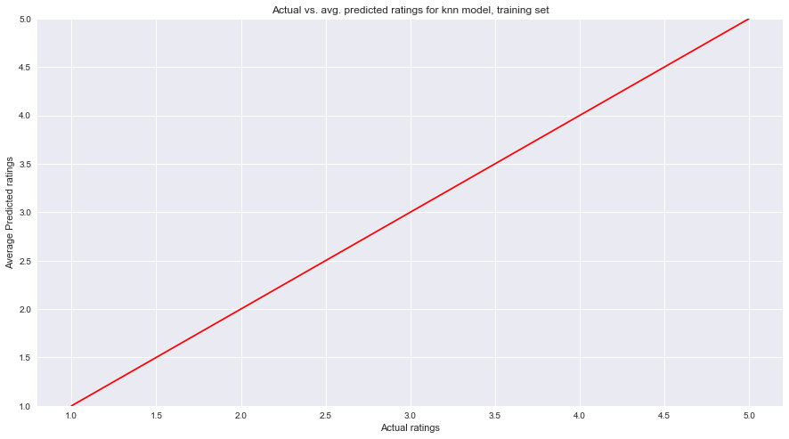


```python
fig, ax = plt.subplots(1, 1, figsize=(15, 8))
ax.plot([1, 2, 3, 4, 5], knn_pred_test_avg, color='red')

ax.set_xlabel('Actual ratings')
ax.set_ylabel('Average Predicted ratings')
ax.set_title('Actual vs. avg. predicted ratings for knn model, training set')
ax.set_ylim((1,5))
```


    (1, 5)


As k=1, the training set has a perfect match between actual ratings and predicted ratings. For the test set, however, the average predicted ratings start at around 3.25 when the actual ratings are 1 and increase slightly to about 3.75 when the actual ratings are 5 (much flatter graph than the other models).

## Part 5: Ensemble Method

### Majority Vote Model


```python
from collections import Counter
predictions_train = []
predictions_test = []
counter_predictions_train = []
counter_predictions_test = []

base_pred = [baseline(x,y) for x,y in zip(data_train_temp['user_id'],data_train_temp['business_id'])]
base_pred_test = [baseline(x,y) for x,y in zip(data_test_temp['user_id'],data_test_temp['business_id'])]
ridge_ypred_round = [int(round(x)) for x in ridge_ypred]
ridge_ypred_test_round = [int(round(x)) for x in ridge_ypred_test]
#matrix factorization train
#matrix factorization test
knn_pred_train = np.round(knn.predict(Xtrain)).astype(int)
knn_pred_test = np.round(knn.predict(Xtest)).astype(int)

for i in range(len(ytrain)):
    temp = []
    temp.append(base_pred[i])
    temp.append(ridge_ypred_round[i])
    #temp.append(matrix factorization train)
    temp.append(knn_pred_train[i])
    counter_predictions_train.append(Counter(temp))
    predictions_train.append(temp)
    
for i in range(len(ytest)):
    temp = []
    temp.append(base_pred_test[i])
    temp.append(ridge_ypred_test_round[i])
    #temp.append(matrix factorization test)
    temp.append(knn_pred_test[i])
    counter_predictions_test.append(Counter(temp))
    predictions_test.append(temp)
```


```python
ensemble_pred_train = []
ensemble_pred_test = []

for i in range(len(counter_predictions_train)):
    value, count = counter_predictions_train[i].most_common()[0]
    ensemble_pred_train.append(value)
    
for i in range(len(counter_predictions_test)):
    value, count = counter_predictions_test[i].most_common()[0]
    ensemble_pred_test.append(value)
```


```python
print ("The accuracy score of the ensemble model (majority vote) on the train set is {}"
       .format(metrics.accuracy_score(ytrain, ensemble_pred_train)))
print ("The accuracy score of the ensemble model (majority vote) on the test set is {}"
       .format(metrics.accuracy_score(ytest, ensemble_pred_test)))
```


    The accuracy score of the ensemble model (majority vote) on the train set is 0.47726454709058186
    The accuracy score of the ensemble model (majority vote) on the test set is 0.39947989597919586


This ensemble method predicts by taking a majority vote of every model's prediction for a given predictor set. This improves upon all the models--both training and test accuracies are higher than any individual component model of the ensemble model (excluding training accuracy for kNN, which was 1 because k = 1).}


```python
pred_df_train = pd.DataFrame({'y' : ytrain, 'ypred' : ensemble_pred_train})
pred_df_test = pd.DataFrame({'y' : ytest, 'ypred' : ensemble_pred_test})

majority_pred_avg = []
majority_pred_test_avg = []
for i in [1, 2, 3, 4, 5]:
    majority_pred_avg.append(pred_df_train[pred_df_train['y'] == i]['ypred'].mean())
    majority_pred_test_avg.append(pred_df_test[pred_df_test['y'] == i]['ypred'].mean())
```


```python
fig, ax = plt.subplots(1, 1, figsize=(15, 8))
ax.plot([1, 2, 3, 4, 5], majority_pred_avg, color='red')

ax.set_xlabel('Actual ratings')
ax.set_ylabel('Average Predicted ratings')
ax.set_title('Actual vs. avg. predicted ratings for majority-based ensemble model, training set')
ax.set_ylim((1,5))
```


    (1, 5)


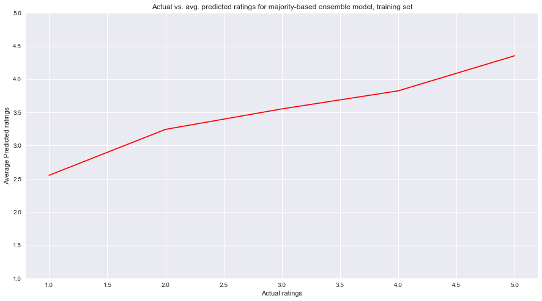


```python
fig, ax = plt.subplots(1, 1, figsize=(15, 8))
ax.plot([1, 2, 3, 4, 5], majority_pred_test_avg, color='red')

ax.set_xlabel('Actual ratings')
ax.set_ylabel('Average Predicted ratings')
ax.set_title('Actual vs. avg. predicted ratings for majority-based ensemble model, training set')
ax.set_ylim((1,5))
```


    (1, 5)


On average, our predictions for both the training and the test set follow the increasing trend of actual ratings but overestimate for lower ratings.

### Ensemble Method Using Logistic Regression


```python
logreg = LogisticRegressionCV()
y_hat_test = logreg.fit(predictions_train, ytrain).predict(predictions_test)
y_hat_train = logreg.fit(predictions_train, ytrain).predict(predictions_train)

print("Train LogReg: ", metrics.accuracy_score(ytrain, y_hat_train))
print("Test LogReg: ", metrics.accuracy_score(ytest, y_hat_test))
```


    Train LogReg:  0.76050789842
    Test LogReg:  0.362692538508


This model performed significantly better on the training set; however, it actually performed *worse* on the test set. This may be because of the kNN model being weighted more because of its high training accuracy due to its parameter k being 1.


```python
pred_df_train = pd.DataFrame({'y' : ytrain, 'ypred' : y_hat_train})
pred_df_test = pd.DataFrame({'y' : ytest, 'ypred' : y_hat_test})

log_pred_avg = []
log_pred_test_avg = []
for i in [1, 2, 3, 4, 5]:
    log_pred_avg.append(pred_df_train[pred_df_train['y'] == i]['ypred'].mean())
    log_pred_test_avg.append(pred_df_test[pred_df_test['y'] == i]['ypred'].mean())
```


```python
fig, ax = plt.subplots(1, 1, figsize=(15, 8))
ax.plot([1, 2, 3, 4, 5], log_pred_avg, color='red')

ax.set_xlabel('Actual ratings')
ax.set_ylabel('Average Predicted ratings')
ax.set_title('Actual vs. avg. predicted ratings for logistic-based ensemble model, training set')
ax.set_ylim((1,5))
```


    (1, 5)


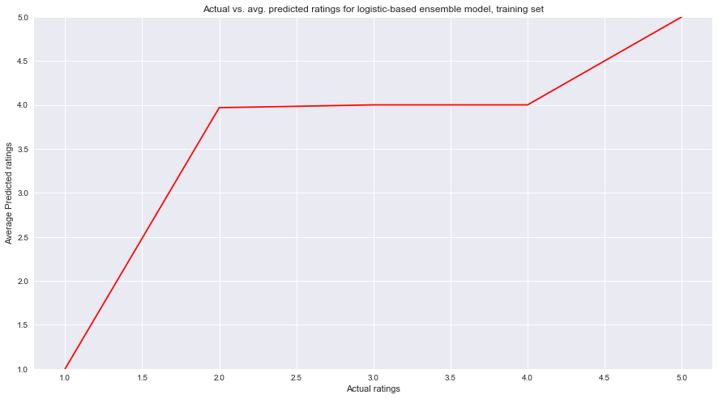


```python
fig, ax = plt.subplots(1, 1, figsize=(15, 8))
ax.plot([1, 2, 3, 4, 5], log_pred_test_avg, color='red')

ax.set_xlabel('Actual ratings')
ax.set_ylabel('Average Predicted ratings')
ax.set_title('Actual vs. avg. predicted ratings for logistic-based ensemble model, training set')
ax.set_ylim((1,5))
```


    (1, 5)


For the training set, the model performed well for when actual ratings were 1, 4, and 5 (not 2 and 3). The line was very flat for the test set, reflecting the large influence that the knn model had using this ensemble method.


```python

```

