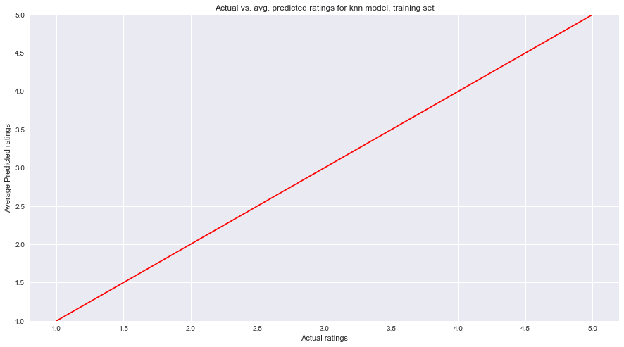
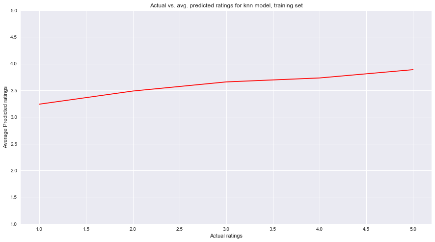

## Contents
{:.no_toc}
*  
{: toc}

## Part 4: A Different Model

### Naive kNN Model


```python
from sklearn.neighbors import KNeighborsRegressor
knn = KNeighborsRegressor(n_neighbors=5, n_jobs=-1)
knn.fit(Xtrain, ytrain)
```


    KNeighborsRegressor(algorithm='auto', leaf_size=30, metric='minkowski',
              metric_params=None, n_jobs=-1, n_neighbors=5, p=2,
              weights='uniform')


We used a KNeighborsRegressor model as we felt that a regressor was more appropriate than a classifier because although the y-variable was categorical (1, 2, 3, 4, 5), it was also ordinal.


```python
ypred_train = np.round(knn.predict(Xtrain)).astype(int)
ypred_test = np.round(knn.predict(Xtest)).astype(int)
```


```python
print ("The accuracy score of the knn model on the train set is {}"
       .format(metrics.accuracy_score(ytrain, ypred_train)))
print ("The accuracy score of the knn model on the test set is {}"
       .format(metrics.accuracy_score(ytest, ypred_test)))
```


    The accuracy score of the knn model on the train set is 0.34845241191652826
    The accuracy score of the knn model on the test set is 0.27967372398488577


### Cross-Validation


```python
from sklearn.model_selection import KFold
means = []

for i in range(1, 11):
    knn = KNeighborsRegressor(n_neighbors=i, n_jobs=-1)
    n_folds=5
    fold = 0
    
    valid_acc = [0, 0, 0, 0, 0]
    for train, valid in KFold(n_folds, shuffle=True).split(range(len(Xtrain))):
        train_set = data_train.iloc[train]
        valid_set = data_train.iloc[valid]
        
        X_cross_train = train_set.drop(['stars'], axis = 1)
        y_cross_train = train_set['stars']
        X_cross_valid = valid_set.drop(['stars'], axis = 1)
        y_cross_valid = valid_set['stars']

        knn.fit(X_cross_train, y_cross_train)
        
        y_hat_train_cross = np.round(knn.predict(X_cross_train)).astype(int)
        y_hat_valid_cross = np.round(knn.predict(X_cross_valid)).astype(int)
        
        valid_acc[fold] = metrics.accuracy_score(y_cross_valid, y_hat_valid_cross)
        fold += 1
    print(str(i) + ', ' + str(np.mean(valid_acc)))
    means.append(np.mean(valid_acc))
    
k = (means.index(np.max(means)) + 1)
print(str(k) + " = k model has highest mean validation accuracy score at: " + str(np.max(means)))
```


    1, 0.324723553521
    2, 0.290070258372
    3, 0.290070168309
    4, 0.282287259207
    5, 0.276865190409
    6, 0.277545480531
    7, 0.274244220045
    8, 0.271763269677
    9, 0.271623037532
    10, 0.270082581397
    1 = k model has highest mean validation accuracy score at: 0.324723553521


Here, we had to hard-code cross-validation (rather than using cross_val_score because the default scoring method for kNeighborsRegressor was r2, and we wanted to use classification accuracy. The mean validation accuracy consistently decreases as k increases-- k=1 is the best-performing model.

### Final kNN Model


```python
knn = KNeighborsRegressor(n_neighbors=1, n_jobs=-1)
knn.fit(Xtrain, ytrain)
ypred_train = np.round(knn.predict(Xtrain)).astype(int)
ypred_test = np.round(knn.predict(Xtest)).astype(int)
print ("The accuracy score of the knn model on the train set is {}"
       .format(metrics.accuracy_score(ytrain, ypred_train)))
print ("The accuracy score of the knn model on the test set is {}"
       .format(metrics.accuracy_score(ytest, ypred_test)))
```


    The accuracy score of the knn model on the train set is 0.9999799923971109
    The accuracy score of the knn model on the test set is 0.3240568583938104


It is interesting that the highest performing model has k=1--this was true in both cross-validation and when looking at test accuracies separately (code not shown here for test accuracies of other models). This suggests that for a given user-restaurant combination, the single user-restaurant combination already in the dataset that is closest to the desired combination is most reflective of the desired combination (rather than an aggregate of several close combinations). Furthermore, this model has a relatively lower test accuracy than the baseline and the regression models, suggesting that it is not the best model to use for this dataset. Cross-validation did increase the accuracy score from the naive model (which used k = 5 as default).


```python
pred_df_train = pd.DataFrame({'y' : ytrain, 'ypred' : ypred_train})
pred_df_test = pd.DataFrame({'y' : ytest, 'ypred' : ypred_test})

knn_pred_avg = []
knn_pred_test_avg = []
for i in [1, 2, 3, 4, 5]:
    knn_pred_avg.append(pred_df_train[pred_df_train['y'] == i]['ypred'].mean())
    knn_pred_test_avg.append(pred_df_test[pred_df_test['y'] == i]['ypred'].mean())
```


```python
fig, ax = plt.subplots(1, 1, figsize=(15, 8))
ax.plot([1, 2, 3, 4, 5], knn_pred_avg, color='red')

ax.set_xlabel('Actual ratings')
ax.set_ylabel('Average Predicted ratings')
ax.set_title('Actual vs. avg. predicted ratings for knn model, training set')
ax.set_ylim((1,5))
```


    (1, 5)





```python
fig, ax = plt.subplots(1, 1, figsize=(15, 8))
ax.plot([1, 2, 3, 4, 5], knn_pred_test_avg, color='red')

ax.set_xlabel('Actual ratings')
ax.set_ylabel('Average Predicted ratings')
ax.set_title('Actual vs. avg. predicted ratings for knn model, training set')
ax.set_ylim((1,5))
```


    (1, 5)





As k=1, the training set has a perfect match between actual ratings and predicted ratings. For the test set, however, the average predicted ratings start at around 3.25 when the actual ratings are 1 and increase slightly to about 3.75 when the actual ratings are 5 (much flatter graph than the other models).
