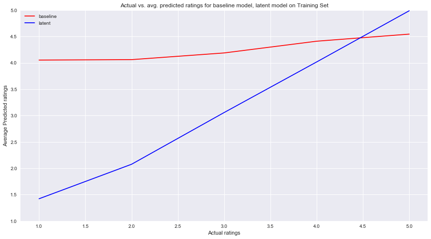
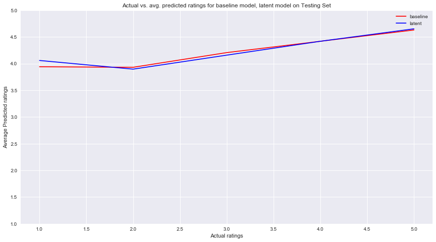

## Contents
{:.no_toc}
*  
{: toc}

### Introduction

Matrix Factorization was time- and computationally- intensive. We initially had trouble understanding how to create and execute the algorithm. Afterwards, we made several mistakes in our execution, but fixed them later in the end: 

* Sparse matrices: When we had matrices with over half zero values, our algorithm was unable to predict those squares. Thus, we changed to a 'flattened' matrix for our training, validating, and testing set where every value was known. 

* Negative values: Initially, every value in our latent factor vectors was positive. However, we realized our mistake when we graphed our latent factor model against the baseline and saw that it consistenly overestimated. We realized that we were assuming that all the residuals were positive, which was incorrect. Thus, we corrected our mistake and made sure our tuning vectors contained values between (-1, 1). 

* Cross validation: We were unable to perform cross validation in time. Additionally, we wanted to test lambda parameters [0.01, 0.1, 1, 10, 100], but were unable to tune across all values. We realize that our model vastly overfits, so we believe that a higher lambda parameter such as 10 or 100 would have been optimal. You will see in our code that we find that the highest lambda that we were able to compute in time was 10, but we unfortunately did not have the time to refit our training set using that lambda. 

* Hyperparamaters: Again, we were unable to validate across hyperparameters such as number of latent factors and regularlization parameters due to time.


Here we are interested in using a matrix factorization approach to predict the resulting ratings. We are interested in minimizing the loss function from the residuals as seen below.

$$ r_{um} = {\bar{q}_m}^T \bar{p}_u $$ 

$$ \sum_{u,m} {\Big(Y_{um} - \mu - \bar{\theta}I_u - \bar{\gamma} I_m - {\bar{q}_m}^T \bar{p}_u \Big)}^2 + \alpha \Big( {\theta_u}^2 + {\gamma_m}^2 + {\| \bar{q}_m \|}^2 + {\| \bar{p}_u \|}^2\Big) $$ 


For matrix factorization, we faced several unique issues:

* Matrix Sparsity: Our data was incredibly sparse. Originally, our matrix had <5% non zero values. However, single-value decomposition doesn't work on sparse matrices. Thus, we had to reduce our set of restaurant reviews significantly, to only include restaurants and user with over 100 reviews. We also used alternating least squares to find the latent factor vectors, as opposed to SVD.

* Runtime: The process of learning the latent was incredibly time intensive. Thus, we limited our model to 4 latent factors. 

* Size of model: Our train set included 1252 users and 3484 restaurants, Thus, we only computed latent factors for 1252 users and 3484 items.

We also made sure that the same users were represented in the train, valid, and test sets and in the same proportion. Please see the end of this notebook for graphs and detailed analysis on matrix factorization. 


### Making the dataset more manageable


```python
trimmed_train = train_df[:2000]
trimmed_train.shape
train_businesses = [x['business_id'] for x in train_set]
train_users = [x['user_id'] for x in train_set]
c = Counter()
c = Counter(train_businesses)
d = Counter()
d = Counter(train_users)
keep_business = [item for item in c if c[item] > 15 ]
keep_users = [item for item in d if d[item] > 15]
```


```python
keep_reviews = [item for item in train_set if item['business_id'] in keep_business and item['user_id'] in keep_users]
```


```python
trimmed_train = pd.DataFrame(keep_reviews)
trimmed_train.head()
```


<div>
<style>
    .dataframe thead tr:only-child th {
        text-align: right;
    }

    .dataframe thead th {
        text-align: left;
    }

    .dataframe tbody tr th {
        vertical-align: top;
    }
</style>
<table border="1" class="dataframe">
  <thead>
    <tr style="text-align: right;">
      <th></th>
      <th>business_id</th>
      <th>stars</th>
      <th>user_id</th>
    </tr>
  </thead>
  <tbody>
    <tr>
      <th>0</th>
      <td>riFzCvp77DMKDX-5GoTpqA</td>
      <td>5</td>
      <td>-267Yx8RmdP6io2-qI4UcQ</td>
    </tr>
    <tr>
      <th>1</th>
      <td>UPIYuRaZvknINOd1w8kqRQ</td>
      <td>4</td>
      <td>-267Yx8RmdP6io2-qI4UcQ</td>
    </tr>
    <tr>
      <th>2</th>
      <td>fL-b760btOaGa85OJ9ut3w</td>
      <td>3</td>
      <td>-50XWnmQGqBgEI-9ANvLlg</td>
    </tr>
    <tr>
      <th>3</th>
      <td>hIUKufhwR6Ifn7bi0-phLA</td>
      <td>5</td>
      <td>-50XWnmQGqBgEI-9ANvLlg</td>
    </tr>
    <tr>
      <th>4</th>
      <td>Ec9CBmL3285XkeHaNp-bSQ</td>
      <td>4</td>
      <td>-50XWnmQGqBgEI-9ANvLlg</td>
    </tr>
  </tbody>
</table>
</div>


### Getting the user and item deviations


```python
restaurant_data = [x for x in business_data if 'Restaurants' in x['categories']]

good_restaurants_info = [x for x in restaurant_data if x['review_count'] >= 100]
restaurant_dict = {x['business_id']: x['stars'] for x in restaurant_data}
good_user_info = [x for x in user_data if x['review_count'] >= 100]
user_dict = {x['user_id']: x['average_stars'] for x in good_user_info}

global_review_average = sum(trimmed_train['stars'].values)/len(trimmed_train)
user_global_average = sum(user_dict.values())/len(user_dict)
rest_global_average = sum(restaurant_dict.values())/len(restaurant_dict)
user_deviations = {x: user_dict[x] - user_global_average for x in user_dict}
restaurant_deviations = {x: restaurant_dict[x] - rest_global_average for x in restaurant_dict}
```


### Making the dictionaries

We wanted to create 2 dictionaries:
* ratings_by_restaurant_train_trimmed: This dictionary has key = restaurant and value = all the reviews given to the restaurant
* ratings_by_user_train_trimmed: This dictionary has key = user and value = all the reviews that the user has given


```python
ratings_by_restaurant_train_trimmed = {}
ratings_by_user_train_trimmed = {}

for i in range(len(trimmed_train)):
    row = trimmed_train.iloc[i]
    bus_id = row[0]
    stars = row[1]
    user_id = row[2]
    if bus_id not in ratings_by_restaurant_train_trimmed:
        ratings_by_restaurant_train_trimmed[bus_id] = {user_id : stars}
    else:
        ratings_by_restaurant_train_trimmed[bus_id][user_id] = stars
        
    if user_id not in ratings_by_user_train_trimmed:
        ratings_by_user_train_trimmed[user_id] = {bus_id : stars}
    else:
        ratings_by_user_train_trimmed[user_id][bus_id] = stars
    
```


```python
len(ratings_by_user_train_trimmed), len(ratings_by_restaurant_train_trimmed)
```


    (308, 173)


### Preparing for Alternating Least Squares

We create the random dummy vectors to initial our p and q vectors, set lambda the regularization parameter equal to 0.1, and decided our tuning vectors (quadruplets with values between -0.9 and 0.9).


```python
#create dummy vectors for p and q at start
import random
q_item = {}
p_user = {}
#just random
for r in ratings_by_restaurant_train_trimmed:
    q_item[r] = [randrange(-10,10)/10 for _ in range(4)]
for u in ratings_by_user_train_trimmed:
    p_user[u] = [randrange(-10,10)/10 for _ in range(4)]
```


```python
tuning_vectors = []
tuning_values = [-0.9, -0.7, -0.5, -0.3, -0.1, 0.1, 0.3, 0.5, 0.7, 0.9]
for a in tuning_values:
    for b in tuning_values:
        for c in tuning_values:
            for d in tuning_values:
                tuning_vectors.append([a, b, c, d])
```


```python
lmda = 0.1
```


### Defining tuning functions


```python
def calculate_sum_user_4(tuning_vector, user):
    user_vector = tuning_vector
    uv_mag = np.linalg.norm(user_vector)
    summation = 0
    #iterate through restaurants that user has rated
    for restaurant in ratings_by_user_train_trimmed[user]:
        #get the restaurants vector
        item_vector = q_item[restaurant]
        rv_mag = np.linalg.norm(item_vector)
        term = np.dot(user_vector, item_vector) 
        #get the biases
        user_dev = user_deviations[user]
        item_dev = restaurant_deviations[restaurant]
        #follow the MLE equation
        error = (ratings_by_user_train_trimmed[user][restaurant] - global_review_average - term - user_dev - item_dev) ** 2 
        + lmda * (uv_mag **2 + rv_mag ** 2 + user_dev ** 2 + item_dev ** 2)
        summation += error
    return summation


def minimize_user_vectors_4():
    convergence = 0
    #iterate though all the the users
    for user in ratings_by_user_train_trimmed:
        #list of tuples (tuning vector, sum)
        tuning_sums = []
        #iterate though the vectors to find the best one for the user
        for tuning_vector in tuning_vectors:
            tuning_sum = calculate_sum_user_4(tuning_vector, user)
            tuning_sums.append((tuning_vector, tuning_sum))
        #get the vector with the lowest sum
        best = (min(tuning_sums, key = lambda x: x[1])[0])
        #get the difference between the current vector and the best vector
        difference = abs(best[0] - p_user[user][0]) + abs(best[1] - p_user[user][1])
        + abs(best[2] - p_user[user][2]) + abs(best[3] - p_user[user][3])
        #set vector to best
        p_user[user] = best
        #add the difference to the convergence
        convergence += difference
    return convergence
                     
                 
```


```python
def calculate_sum_item_4(tuning_vector, item):
    item_vector = tuning_vector
    rv_mag = np.linalg.norm(item_vector)
    summation = 0
    for user in ratings_by_restaurant_train_trimmed[item]:
        user_vector = p_user[user]
        uv_mag = np.linalg.norm(user_vector)
        term = np.dot(item_vector, user_vector) 
        user_dev = user_deviations[user]
        item_dev = restaurant_deviations[item]
        error = (ratings_by_restaurant_train_trimmed[item][user] - global_review_average - user_dev - item_dev - term) ** 2 
        + lmda * (uv_mag **2 + rv_mag ** 2 + user_dev ** 2 + item_dev ** 2)
        #print ('error', error)
        summation += error
    return summation


def minimize_item_vectors_4():
    #print ('minimizing item vectors')
    convergence = 0
    #iterate though all the the restaurants
    for item in ratings_by_restaurant_train_trimmed:
        #list with tuple (vector, corresponding sum)
        tuning_sums = []
        #iterate though the vectors to find the best one for the restaurant
        for tuning_vector in tuning_vectors:
            tuning_sum = calculate_sum_item_4(tuning_vector, item)
            tuning_sums.append((tuning_vector, tuning_sum))
        best = (min(tuning_sums, key = lambda x: x[1])[0])
        #print ('best', best)
        #get the difference between the current vector and the best vector
        difference = abs(best[0] - q_item[item][0]) + abs(best[1] - q_item[item][1]) 
        + abs(best[2] - q_item[item][2]) + abs(best[3] - q_item[item][3])
        #set vector to best
        #print ('best',best)
        q_item[item] = best
        convergence += difference
        #print ('convergence value', convergence)
    return convergence
                     

            
```


```python
def ALS_4():
    print ('minimizing user vectors')
    conv = minimize_user_vectors_4()
    print (conv)
    #whil vectors have not converged
    while conv > 10: 
        for _ in range(1000):
            print ('minimizing item vectors')
            conv = minimize_item_vectors_4()
            print (conv)
            print ('minimizing user vectors')
            conv = minimize_user_vectors_4()
            print (conv)
                
              
```


    minimizing user vectors
    463.99999999999994
    minimizing item vectors
    133.7
    minimizing user vectors
    193.1999999999999
    minimizing item vectors
    65.80000000000001
    minimizing user vectors
    110.8000000000002
    minimizing item vectors
    43.99999999999998
    minimizing user vectors
    86.00000000000006
    minimizing item vectors
    24.999999999999982
    minimizing user vectors
    51.60000000000002
    minimizing item vectors
    24.199999999999985
    minimizing user vectors
    37.20000000000001
    minimizing item vectors
    20.599999999999994
    minimizing user vectors
    26.199999999999996
    minimizing item vectors
    17.0
    minimizing user vectors
    14.399999999999999
    minimizing item vectors
    5.4
    minimizing user vectors
    17.999999999999993
    minimizing item vectors
    5.4
    minimizing user vectors
    11.0
    minimizing item vectors
    5.6000000000000005
    minimizing user vectors


Here are the first ten final vectors after convergence:


```python
list(p_user.items())[:10]
```


    [('-267Yx8RmdP6io2-qI4UcQ', [0.5, -0.3, -0.7, 0.9]),
     ('-50XWnmQGqBgEI-9ANvLlg', [-0.3, 0.9, -0.7, -0.7]),
     ('-9WVpTW5LAEo9y6PbW0-cw', [0.9, -0.1, 0.7, -0.3]),
     ('-ARdx8hOcEWlMDjzwLYZ_g', [0.7, -0.7, 0.9, -0.9]),
     ('-C-l8EHSLXtZZVfUAUhsPA', [-0.9, -0.7, -0.9, 0.3]),
     ('-EJorVxe7h2GSxdiRyMmDA', [0.7, -0.7, -0.1, -0.7]),
     ('-Fy91nyOFqPv9M_MaZ4W2g', [-0.1, 0.1, 0.1, 0.9]),
     ('-RhRXVW9z9fs5zzxhFfnHg', [0.9, 0.9, 0.7, 0.3]),
     ('-Vu7L3U7-kxDyY1VHxw3zw', [-0.9, -0.9, 0.9, -0.7]),
     ('-_2h2cJlBOWAYrfplMU-Cg', [0.5, 0.5, -0.1, -0.7])]


```python
list(q_item.items())[:10]
```


    [('riFzCvp77DMKDX-5GoTpqA', [-0.3, 0.9, -0.5, 0.9]),
     ('UPIYuRaZvknINOd1w8kqRQ', [-0.9, 0.3, -0.9, -0.9]),
     ('fL-b760btOaGa85OJ9ut3w', [-0.1, -0.9, 0.9, 0.9]),
     ('hIUKufhwR6Ifn7bi0-phLA', [-0.5, -0.9, -0.7, -0.5]),
     ('Ec9CBmL3285XkeHaNp-bSQ', [-0.1, -0.7, -0.9, 0.9]),
     ('eoHdUeQDNgQ6WYEnP2aiRw', [-0.9, -0.5, 0.9, -0.1]),
     ('D3dAx-QW_uuClz4MambeHA', [-0.7, 0.9, 0.1, -0.7]),
     ('OGRB__fguKfGpPdH7FvBDA', [0.9, 0.3, 0.3, -0.3]),
     ('4JNXUYY8wbaaDmk3BPzlWw', [-0.7, 0.9, 0.9, -0.9]),
     ('umXvdus9LbC6oxtLdXelFQ', [0.9, -0.7, -0.9, -0.9])]


## Validating to determine the best lambda


```python
valid_businesses = [x['business_id'] for x in valid_set]
valid_users = [x['user_id'] for x in valid_set]
```


```python
from collections import Counter
c = Counter()
c = Counter(valid_businesses)
d = Counter()
d = Counter(valid_users)
keep_business = [item for item in c if c[item] > 20 ]
keep_users = [item for item in d if d[item] > 20]
```


### Validating to determing the regularization parameter


We cut down on our valid set, keeping ~300 data points, in order to expedite the process of validation.

Our code for cross validation is similar to our code above.


```python
def calculate_sum_user_CV(tuning_vector, user, LAMBDA, q_item_CV, p_user_CV):
    user_vector = tuning_vector
    uv_mag = np.linalg.norm(user_vector)
    summation = 0
    for restaurant in ratings_by_user_train_trimmed[user]:
        item_vector = q_item_CV[restaurant]
        rv_mag = np.linalg.norm(item_vector)
        term = np.dot(user_vector, item_vector) 
        user_dev = user_deviations[user]
        item_dev = restaurant_deviations[restaurant]
        error = (ratings_by_user_train_trimmed[user][restaurant] - global_review_average - term - user_dev - item_dev) ** 2 
        + LAMBDA * (uv_mag **2 + rv_mag ** 2 + user_dev ** 2 + item_dev ** 2)
        summation += error
    return summation

def minimize_user_vectors_CV(LAMBDA, q_item_CV, p_user_CV):
    convergence = 0
    for user in ratings_by_user_train_trimmed:
        tuning_sums = []
        for tuning_vector in tuning_vectors:
            tuning_sum = calculate_sum_user_CV(tuning_vector, user, LAMBDA, q_item_CV, p_user_CV)
            tuning_sums.append((tuning_vector, tuning_sum))
        best = (min(tuning_sums, key = lambda x: x[1])[0])
        difference = abs(best[0] - p_user_CV[user][0]) + abs(best[1] - p_user_CV[user][1])
        + abs(best[2] - p_user_CV[user][2]) + abs(best[3] - p_user_CV[user][3])
        p_user_CV[user] = best
        convergence += difference
    return convergence

def calculate_sum_item_CV(tuning_vector, item, LAMBDA, q_item_CV, p_user_CV):
    item_vector = tuning_vector
    rv_mag = np.linalg.norm(item_vector)
    summation = 0
    for user in ratings_by_restaurant_train_trimmed[item]:
        user_vector = p_user_CV[user]
        uv_mag = np.linalg.norm(user_vector)
        term = np.dot(item_vector, user_vector) 
        user_dev = user_deviations[user]
        item_dev = restaurant_deviations[item]
        error = (ratings_by_restaurant_train_trimmed[item][user] - global_review_average - user_dev - item_dev - term) ** 2 
        + LAMBDA * (uv_mag **2 + rv_mag ** 2 + user_dev ** 2 + item_dev ** 2)
        summation += error
    return summation


def minimize_item_vectors_CV(LAMBDA, q_item_CV, p_user_CV):
    convergence = 0
    for item in ratings_by_restaurant_train_trimmed:
        tuning_sums = []
        for tuning_vector in tuning_vectors:
            tuning_sum = calculate_sum_item_CV(tuning_vector, item, LAMBDA, q_item_CV, p_user_CV)
            tuning_sums.append((tuning_vector, tuning_sum))
        best = (min(tuning_sums, key = lambda x: x[1])[0])
        difference = abs(best[0] - q_item_CV[item][0]) + abs(best[1] - q_item_CV[item][1]) 
        + abs(best[2] - q_item_CV[item][2]) + abs(best[3] - q_item_CV[item][3])
        q_item_CV[item] = best
        convergence += difference
    return convergence
                     
                 
```


```python
def ALS_CV(q_item_CV, p_user_CV, LAMBDA):
    print ('optimizing item vectors')
    convergence = minimize_item_vectors_CV(LAMBDA, q_item_CV, p_user_CV)
    print (convergence)
    while convergence > 5:
        print ('optimizing user vectors')
        convergence = minimize_user_vectors_CV(LAMBDA, q_item_CV, p_user_CV)
        print (convergence)
        print ('optimizing item vectors')
        convergence = minimize_item_vectors_CV(LAMBDA, q_item_CV, p_user_CV)
        print (convergence)
    return q_item_CV, p_user_CV

def predict(p_user_CV, q_item_CV, user_id, business_id):
    user_dev = user_deviations[user_id]
    item_dev = restaurant_deviations[business_id]
    latent_term = np.dot(p_user_CV[user_id], q_item_CV[business_id]) 
    #print (latent_term)
    prediction = global_review_average + user_dev + item_dev + latent_term
    return int(round(prediction))

def score_CV(q_item_CV, p_user_CV, LAMBDA, df):
    predictions = []
    for j in range(len(df)):
        row = df.iloc[j]
        business_id = row[0]
        user_id = row[2]
        pred = predict(p_user_CV, q_item_CV, user_id, business_id)
        #print (pred)
        predictions.append(pred)
    print (predictions)
    actual = df['stars']
    df['validation_{}'.format(LAMBDA)] = predictions
    return metrics.accuracy_score(actual, predictions)
        
def validate(LAMBDA):
    q_item_CV = {}
    p_user_CV = {}
    for r in ratings_by_restaurant_train_trimmed:
        q_item_CV[r] = [randrange(-10,10)/10 for _ in range(4)]
    for u in ratings_by_user_train_trimmed:
        p_user_CV[u] = [randrange(-10,10)/10 for _ in range(4)]
    best_q_item, best_p_user = ALS_CV(q_item_CV, p_user_CV, LAMBDA)
    score = score_CV(best_q_item, best_p_user, LAMBDA, trimmed_train)
    return score

def run_validation(LAMBDAS):
    validation_scores = {}
    for LAMBDA in LAMBDAS:
        print (LAMBDA)
        score = validate(LAMBDA)
        print ('score', score)
        validation_scores[LAMBDA] = score
    return validation_scores
        
            
```


```python
LAMBDAS = [0.01, 1, 10]
run_validation(LAMBDAS)
```


    0.01
    optimizing item vectors
    257.39999999999986
    optimizing user vectors
    336.10000000000014
    optimizing item vectors
    75.20000000000006
    optimizing user vectors
    118.40000000000015
    optimizing item vectors
    57.00000000000001
    optimizing user vectors
    98.60000000000012
    optimizing item vectors
    30.199999999999985
    optimizing user vectors


    {0.001: 0.59477124183,
     0.01: 0.598039215686,
     0.1: 0.598039215686,
     1: 0.598039215686,
     10: 0.601307189542}


```python

```


The best lambda according to our validation is 10. However, because ALS is extremely time-intensive, we were unable to retune our latent factors using the lambda.


```python
def model_predict(user_id, business_id):
    user_dev = user_deviations[user_id]
    item_dev = restaurant_deviations[business_id]
    latent_term = 0
    if user_id in p_user:
        if business_id in q_item:
            latent_term = np.dot(p_user[user_id], q_item[business_id]) 
    prediction = global_review_average + user_dev + item_dev 
    latent = prediction + latent_term
    #print (prediction)
    return int(round(prediction)), int(round(latent))

def predict_all(df):
    predictions = []
    base_predictions = []
    for j in range(len(df)):
        row = df.iloc[j]
        business_id = row[0]
        user_id = row[2]
        pred, latent = model_predict(user_id, business_id)
        base_predictions.append(pred)
        predictions.append(latent)
    df['pred_base'] = base_predictions
    df['pred_latent'] = predictions
    base_score = metrics.accuracy_score(df['stars'], df['pred_base'])
    latent_score = metrics.accuracy_score(df['stars'], df['pred_latent'])
    return base_score, latent_score
```


## Evaluating and comparing the latent factors on the train and test sets


```python
train_pred = pd.DataFrame(trimmed_train)
base, latent = predict_all(train_pred)
print ('The accuracy on the train set is {}'.format(base))
print ('The accuracy on the train set using latent factors is {}'.format(latent))
```


    The accuracy on the train set is 0.39976825028968715
    The accuracy on the train set using latent factors is 0.9606025492468134


We modified our test set to include (user, restaurant) reviews where both the user and restaurant had a latent factor associated it.


```python
test_df_v2.shape
```


    (657, 5)


```python
test_set_v2 = [x for x in test_set if x['business_id'] in q_item and x['user_id'] in p_user]
test_df_v2 = pd.DataFrame(test_set_v2)
base_test, latent_test = predict_all(test_df_v2)
print ('The accuracy on the test set is {}'.format(base_test))
print ('The accuracy on the test set using latent factors is {}'.format(latent_test))

```


    The accuracy on the test set is 0.4292237442922374
    The accuracy on the test set using latent factors is 0.2861491628614916


Our latent factor model is much more fitted to the train set, resulting in a higher train accuracy but equal test accuracy. 


```python
train_pred.head()
```


<div>
<style>
    .dataframe thead tr:only-child th {
        text-align: right;
    }

    .dataframe thead th {
        text-align: left;
    }

    .dataframe tbody tr th {
        vertical-align: top;
    }
</style>
<table border="1" class="dataframe">
  <thead>
    <tr style="text-align: right;">
      <th></th>
      <th>business_id</th>
      <th>stars</th>
      <th>user_id</th>
      <th>pred</th>
      <th>pred_base</th>
      <th>pred_latent</th>
    </tr>
  </thead>
  <tbody>
    <tr>
      <th>0</th>
      <td>sZsJooAzpKqOvDysphkqpQ</td>
      <td>5</td>
      <td>---1lKK3aKOuomHnwAkAow</td>
      <td>4</td>
      <td>4</td>
      <td>4</td>
    </tr>
    <tr>
      <th>1</th>
      <td>t6WY1IrohUecqNjd9bG42Q</td>
      <td>4</td>
      <td>---1lKK3aKOuomHnwAkAow</td>
      <td>4</td>
      <td>4</td>
      <td>4</td>
    </tr>
    <tr>
      <th>2</th>
      <td>1JgaRBX0oiRsvEhHF3ZMjw</td>
      <td>1</td>
      <td>---1lKK3aKOuomHnwAkAow</td>
      <td>4</td>
      <td>4</td>
      <td>4</td>
    </tr>
    <tr>
      <th>3</th>
      <td>2BbFeotL85cIaBjSq1SWiA</td>
      <td>1</td>
      <td>---1lKK3aKOuomHnwAkAow</td>
      <td>3</td>
      <td>3</td>
      <td>3</td>
    </tr>
    <tr>
      <th>4</th>
      <td>5cbsjFtrntUAeUx51FaFTg</td>
      <td>1</td>
      <td>---1lKK3aKOuomHnwAkAow</td>
      <td>3</td>
      <td>3</td>
      <td>3</td>
    </tr>
  </tbody>
</table>
</div>


```python
pred_avg = []
pred_avg_latent = []
for i in [1, 2, 3, 4, 5]:
    pred_avg.append(train_pred[train_pred['stars'] == i]['pred_base'].mean())
    pred_avg_latent.append(train_pred[train_pred['stars'] == i]['pred_latent'].mean())
```


```python
fig, ax = plt.subplots(1, 1, figsize=(15, 8))
ax.plot([1, 2, 3, 4, 5], pred_avg, color='red', label = 'baseline')
ax.plot([1, 2, 3, 4, 5], pred_avg_latent, color='blue', label = 'latent')
ax.set_xlabel('Actual ratings')
ax.set_ylabel('Average Predicted ratings')
ax.set_title('Actual vs. avg. predicted ratings for baseline model, latent model on Training Set')
ax.set_ylim((1,5))
ax.legend();
```





```python
test_pred_avg = []
test_pred_avg_latent = []
for i in [1, 2, 3, 4, 5]:
    test_pred_avg.append(test_df_v2[test_df_v2['stars'] == i]['pred_base'].mean())
    test_pred_avg_latent.append(test_df_v2[test_df_v2['stars'] == i]['pred_latent'].mean())
```


```python
fig, ax = plt.subplots(1, 1, figsize=(15, 8))
ax.plot([1, 2, 3, 4, 5], test_pred_avg, color='red', label = 'baseline')
ax.plot([1, 2, 3, 4, 5], test_pred_avg_latent, color='blue', label = 'latent')
ax.set_xlabel('Actual ratings')
ax.set_ylabel('Average Predicted ratings')
ax.set_title('Actual vs. avg. predicted ratings for baseline model, latent model on Testing Set')
ax.set_ylim((1,5))
ax.legend();
```





#### Latent factors overfit

As you can see, our latent factors vastly overfit on our training set. We have a near perfect accuracy score on our training set while we have baseline level accuracy on our test set using the latent factors. There are several reasons to explain this:
* The size of our training set is very small without only roughly 700 data points. We limited ourselves to this size due to the computational intensity of Alternating Least Squares. Our train set only contained 308 users and 173 restaurants. As a result there were not very many interaction terms that our latent factors had to learn. Thus, the variance in our error was very high, since it was specific to the collection of users and restaurants in our selected data train. 
* We only had 4 latent factors. Again, we limited ourselves to four factors due to the time constraints. With an incredibly small inner product space, our model could not capture all the nuances in the interaction terms. We wuld have liked if possible to cross validate in order to tune both the number of factors and lambda.
* We only had one validating set. Cross validating with 4 or 5 folds would have been near impossible. 
* Our tuning vectors are very 'rough' in the sense that they are 0.2 points apart from each other. As a result, it was hard to reach a point of convergence in which none of the vectors were changing between iterations. For the future, we would have liked to tune across more granular values.


```python

```

