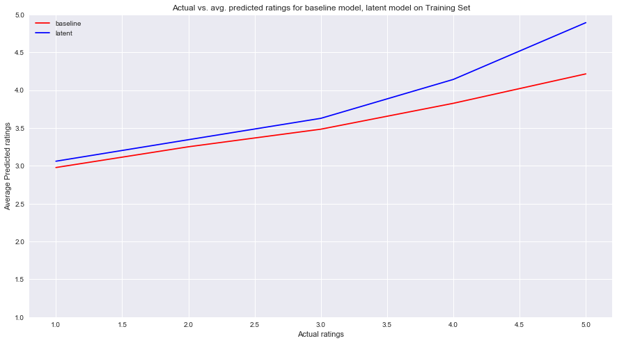
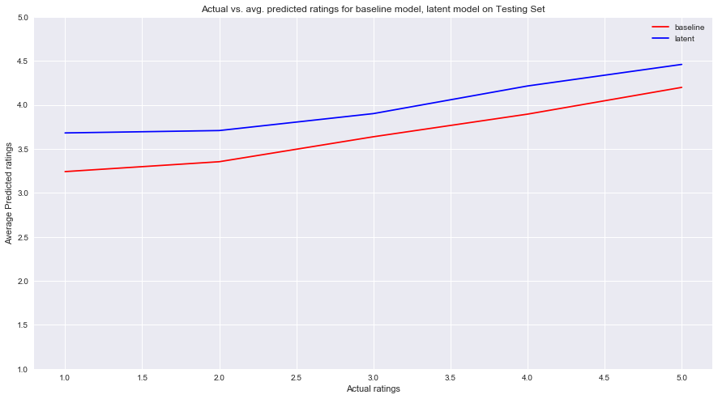

## Contents
{:.no_toc}
*  
{: toc}


## Creating the train, valid, and test sets

For matrix factorization, we faced several unique issues:

* Matrix Sparsity: Our data was incredibly sparse. Originally, our matrix had <5% non zero values. However, single-value decomposition doesn't work on sparse matrices. Thus, we had to reduce our set of restaurant reviews significantly, to only include restaurants and user with over 100 reviews. We also used alternating least squares to find the latent factor vectors, as opposed to SVD.

* Runtime: The process of learning the latent was incredibly time intensive. Thus, we limited our model to 4 latent factors. 

* Size of model: Our train set included 1252 users and 3484 restaurants, Thus, we only computed latent factors for 1252 users and 3484 items.

We also made sure that the same users were represented in the train, valid, and test sets and in the same proportion. 


### Making the dataset more manageable


```python
trimmed_train = train_df[:5000]
trimmed_train.shape
```


    (5000, 3)


### Getting the user and item deviations


```python
restaurant_data = [x for x in business_data if 'Restaurants' in x['categories']]

good_restaurants_info = [x for x in restaurant_data if x['review_count'] >= 100]
restaurant_dict = {x['business_id']: x['stars'] for x in restaurant_data}
good_user_info = [x for x in user_data if x['review_count'] >= 100]
user_dict = {x['user_id']: x['average_stars'] for x in good_user_info}

global_review_average = sum(trimmed_train['stars'].values)/len(trimmed_train)
user_global_average = sum(user_dict.values())/len(user_dict)
rest_global_average = sum(restaurant_dict.values())/len(restaurant_dict)
user_deviations = {x: user_dict[x] - user_global_average for x in user_dict}
restaurant_deviations = {x: restaurant_dict[x] - rest_global_average for x in restaurant_dict}
```


### Making the dictionaries

We wanted to create 2 dictionaries:
* ratings_by_restaurant_train_trimmed: This dictionary has key = restaurant and value = all the reviews given to the restaurant
* ratings_by_user_train_trimmed: This dictionary has key = user and value = all the reviews that the user has given


```python
ratings_by_restaurant_train_trimmed = {}
ratings_by_user_train_trimmed = {}

for i in range(len(trimmed_train)):
    row = trimmed_train.iloc[i]
    bus_id = row[0]
    stars = row[1]
    user_id = row[2]
    if bus_id not in ratings_by_restaurant_train_trimmed:
        ratings_by_restaurant_train_trimmed[bus_id] = {user_id : stars}
    else:
        ratings_by_restaurant_train_trimmed[bus_id][user_id] = stars
        
    if user_id not in ratings_by_user_train_trimmed:
        ratings_by_user_train_trimmed[user_id] = {bus_id : stars}
    else:
        ratings_by_user_train_trimmed[user_id][bus_id] = stars
    
```


### Preparing for Alternating Least Squares

We create the random dummy vectors to initial our p and q vectors, set lambda the regularization parameter equal to 0.1, and decide our tuning vectors.


```python
#create dummy vectors for p and q at start
import random
q_item = {}
p_user = {}
#just random
for r in ratings_by_restaurant_train_trimmed:
    q_item[r] = [randrange(1,10)/10 for _ in range(4)]
for u in ratings_by_user_train_trimmed:
    p_user[u] = [randrange(1,10)/10 for _ in range(4)]
```


```python
tuning_vectors = []
for a in range(1,10):
    for b in range(1,10):
        for c in range(1,10):
            for d in range(1,10):
                tuning_vectors.append([a/10, b/10, c/10, d/10])
```


```python
lmda = 0.1
```


### Defining tuning functions


```python
def calculate_sum_user_4(tuning_vector, user):
    user_vector = tuning_vector
    uv_mag = np.linalg.norm(user_vector)
    summation = 0
    #iterate through restaurants that user has rated
    for restaurant in ratings_by_user_train_trimmed[user]:
        #get the restaurants vector
        item_vector = q_item[restaurant]
        rv_mag = np.linalg.norm(item_vector)
        term = np.dot(user_vector, item_vector) 
        #get the biases
        user_dev = user_deviations[user]
        item_dev = restaurant_deviations[restaurant]
        #follow the MLE equation
        error = (ratings_by_user_train_trimmed[user][restaurant] - global_review_average - term - user_dev - item_dev) ** 2 
        + lmda * (uv_mag **2 + rv_mag ** 2 + user_dev ** 2 + item_dev ** 2)
        summation += error
    return summation


def minimize_user_vectors_4():
    convergence = 0
    #iterate though all the the users
    for user in ratings_by_user_train_trimmed:
        #list of tuples (tuning vector, sum)
        tuning_sums = []
        #iterate though the vectors to find the best one for the user
        for tuning_vector in tuning_vectors:
            tuning_sum = calculate_sum_user_4(tuning_vector, user)
            tuning_sums.append((tuning_vector, tuning_sum))
        #get the vector with the lowest sum
        best = (min(tuning_sums, key = lambda x: x[1])[0])
        #get the difference between the current vector and the best vector
        difference = abs(best[0] - p_user[user][0]) + abs(best[1] - p_user[user][1])
        + abs(best[2] - q_item[item][2]) + abs(best[3] - q_item[item][3])
        #set vector to best
        p_user[user] = best
        #add the difference to the convergence
        convergence += difference
    return convergence
                     
                 
```


```python
def calculate_sum_item_4(tuning_vector, item):
    item_vector = tuning_vector
    rv_mag = np.linalg.norm(item_vector)
    summation = 0
    for user in ratings_by_restaurant_train_trimmed[item]:
        user_vector = p_user[user]
        uv_mag = np.linalg.norm(user_vector)
        term = np.dot(item_vector, user_vector) 
        user_dev = user_deviations[user]
        item_dev = restaurant_deviations[item]
        error = (ratings_by_restaurant_train_trimmed[item][user] - global_review_average - user_dev - item_dev - term) ** 2 
        + lmda * (uv_mag **2 + rv_mag ** 2 + user_dev ** 2 + item_dev ** 2)
        #print ('error', error)
        summation += error
    return summation


def minimize_item_vectors_4():
    #print ('minimizing item vectors')
    convergence = 0
    #iterate though all the the users
    for item in ratings_by_restaurant_train_trimmed:
        #list with tuple (vector, corresponding sum)
        tuning_sums = []
        #iterate though the vectors to find the best one for the user
        for tuning_vector in tuning_vectors:
            tuning_sum = calculate_sum_item_4(tuning_vector, item)
            tuning_sums.append((tuning_vector, tuning_sum))
        best = (min(tuning_sums, key = lambda x: x[1])[0])
        #print ('best', best)
        #get the difference between the current vector and the best vector
        difference = abs(best[0] - q_item[item][0]) + abs(best[1] - q_item[item][1]) 
        + abs(best[2] - q_item[item][2]) + abs(best[3] - q_item[item][3])
        #set vector to best
        #print ('best',best)
        q_item[item] = best
        convergence += difference
        #print ('convergence value', convergence)
    return convergence
                     

            
```


```python
def ALS_4():
    print ('minimizing user vectors')
    conv = minimize_user_vectors_4()
    print (conv)
    #whil vectors have not converged
    while conv > 10: 
        for _ in range(1000):
            print ('minimizing item vectors')
            conv = minimize_item_vectors_4()
            print (conv)
            print ('minimizing user vectors')
            conv = minimize_user_vectors_4()
            print (conv)
                
              
```


```python
ALS_4()
```


    minimizing user vectors
    948.2000000000005
    minimizing item vectors
    2680.099999999998
    minimizing user vectors
    206.19999999999956
    minimizing item vectors
    359.6999999999987
    minimizing user vectors
    90.89999999999995
    minimizing item vectors
    196.79999999999959
    minimizing user vectors
    32.40000000000004
    minimizing item vectors
    144.0
    minimizing user vectors
    21.800000000000004
    minimizing item vectors
    86.80000000000001
    minimizing user vectors
    12.399999999999997

Here are the final vectors after convergence:


```python
list(p_user.items())[:10]
```


    [('---1lKK3aKOuomHnwAkAow', [0.1, 0.1, 0.1, 0.1]),
     ('--2vR0DIsmQ6WfcSzKWigw', [0.1, 0.1, 0.1, 0.1]),
     ('--3WaS23LcIXtxyFULJHTA', [0.1, 0.1, 0.1, 0.1]),
     ('--4q8EyqThydQm-eKZpS-A', [0.9, 0.9, 0.9, 0.9]),
     ('--56mD0sm1eOogphi2FFLw', [0.9, 0.9, 0.9, 0.9]),
     ('--CIuK7sUpaNzalLAlHJKA', [0.1, 0.8, 0.9, 0.1]),
     ('--J3HPoNe-IJ0xE10Z_sDg', [0.1, 0.1, 0.1, 0.1]),
     ('--Qh8yKWAvIP4V4K8ZPfHA', [0.1, 0.8, 0.1, 0.1]),
     ('--RlSfc-QmcHFGHyX6aVjA', [0.1, 0.1, 0.1, 0.1]),
     ('--ZNfWKj1VyVElRx6-g1fg', [0.1, 0.1, 0.1, 0.1])]


```python
list(q_item.items())[:10]
```


    [('sZsJooAzpKqOvDysphkqpQ', [0.1, 0.1, 0.1, 0.1]),
     ('t6WY1IrohUecqNjd9bG42Q', [0.1, 0.3, 0.8, 0.2]),
     ('1JgaRBX0oiRsvEhHF3ZMjw', [0.1, 0.1, 0.1, 0.1]),
     ('2BbFeotL85cIaBjSq1SWiA', [0.1, 0.1, 0.1, 0.1]),
     ('5cbsjFtrntUAeUx51FaFTg', [0.1, 0.1, 0.1, 0.1]),
     ('eJKnymd0BywNPrJw1IuXVw', [0.1, 0.1, 0.1, 0.1]),
     ('Gdv3qhsDeQzZ2Ag-Tzq6vA', [0.1, 0.1, 0.1, 0.1]),
     ('vW65SNLam99SyOuVagNuvg', [0.1, 0.3, 0.1, 0.3]),
     ('nK7JeIqdBli3umEhBIh33g', [0.1, 0.1, 0.9, 0.1]),
     ('zt5S0bSsc8JAWalRMpSk6Q', [0.1, 0.1, 0.1, 0.1])]


## Validating to determine the best lambda


```python
valid_businesses = [x['business_id'] for x in valid_set]
valid_users = [x['user_id'] for x in valid_set]
```


```python
from collections import Counter
c = Counter()
c = Counter(valid_businesses)
d = Counter()
d = Counter(valid_users)
keep_business = [item for item in c if c[item] > 20 ]
keep_users = [item for item in d if d[item] > 20]
```


### Validating to determing the regularization parameter


We cut down on our valid set, keeping ~300 data points, in order to expedite the process of validation.


```python
valid_trimmed = [x for x in valid_set if x['business_id'] in keep_business and x['user_id'] in keep_users]
valid_trimmed_df = pd.DataFrame(valid_trimmed)
valid_trimmed_df.shape

```


    (306, 3)


<div>
<style>
    .dataframe thead tr:only-child th {
        text-align: right;
    }

    .dataframe thead th {
        text-align: left;
    }

    .dataframe tbody tr th {
        vertical-align: top;
    }
</style>
<table border="1" class="dataframe">
  <thead>
    <tr style="text-align: right;">
      <th></th>
      <th>business_id</th>
      <th>stars</th>
      <th>user_id</th>
    </tr>
  </thead>
  <tbody>
    <tr>
      <th>0</th>
      <td>p3YqOYELqXtLyHz9T49p_w</td>
      <td>2</td>
      <td>-50XWnmQGqBgEI-9ANvLlg</td>
    </tr>
    <tr>
      <th>1</th>
      <td>3BCsAgo_1i4xMuTyLKMLRQ</td>
      <td>3</td>
      <td>-50XWnmQGqBgEI-9ANvLlg</td>
    </tr>
    <tr>
      <th>2</th>
      <td>wuQDMDlqM17jQNo0lYQZ7g</td>
      <td>5</td>
      <td>-50XWnmQGqBgEI-9ANvLlg</td>
    </tr>
    <tr>
      <th>3</th>
      <td>g8oxQ1Ji9mr9PMjhEfaWSg</td>
      <td>4</td>
      <td>-50XWnmQGqBgEI-9ANvLlg</td>
    </tr>
    <tr>
      <th>4</th>
      <td>9a3DrZvpYxVs3k_qwlCNSw</td>
      <td>5</td>
      <td>-RhRXVW9z9fs5zzxhFfnHg</td>
    </tr>
  </tbody>
</table>
</div>


Our code for cross validation is similar to our code above.


```python
ratings_by_restaurant_valid = {}
ratings_by_user_valid = {}

for i in range(len(valid_trimmed_df)):
    row = valid_trimmed_df.iloc[i]
    bus_id = row[0]
    stars = row[1]
    user_id = row[2]
    if bus_id not in ratings_by_restaurant_valid:
        ratings_by_restaurant_valid[bus_id] = {user_id : stars}
    else:
        ratings_by_restaurant_valid[bus_id][user_id] = stars
        
    if user_id not in ratings_by_user_valid:
        ratings_by_user_valid[user_id] = {bus_id : stars}
    else:
        ratings_by_user_valid[user_id][bus_id] = stars
    
```


```python
def calculate_sum_user_CV(tuning_vector, user, LAMBDA, q_item_CV, p_user_CV):
    user_vector = tuning_vector
    uv_mag = np.linalg.norm(user_vector)
    summation = 0
    for restaurant in ratings_by_user_valid[user]:
        item_vector = q_item_CV[restaurant]
        rv_mag = np.linalg.norm(item_vector)
        term = np.dot(user_vector, item_vector) 
        user_dev = user_deviations[user]
        item_dev = restaurant_deviations[restaurant]
        error = (ratings_by_user_valid[user][restaurant] - global_review_average - term - user_dev - item_dev) ** 2 
        + LAMBDA * (uv_mag **2 + rv_mag ** 2 + user_dev ** 2 + item_dev ** 2)
        summation += error
    return summation

def minimize_user_vectors_CV(LAMBDA, q_item_CV, p_user_CV):
    convergence = 0
    for user in ratings_by_user_valid:
        tuning_sums = []
        for tuning_vector in tuning_vectors:
            tuning_sum = calculate_sum_user_CV(tuning_vector, user, LAMBDA, q_item_CV, p_user_CV)
            tuning_sums.append((tuning_vector, tuning_sum))
        best = (min(tuning_sums, key = lambda x: x[1])[0])
        difference = abs(best[0] - p_user_CV[user][0]) + abs(best[1] - p_user_CV[user][1])
        + abs(best[2] - p_user_CV[user][2]) + abs(best[3] - p_user_CV[user][3])
        p_user_CV[user] = best
        convergence += difference
    return convergence

def calculate_sum_item_CV(tuning_vector, item, LAMBDA, q_item_CV, p_user_CV):
    item_vector = tuning_vector
    rv_mag = np.linalg.norm(item_vector)
    summation = 0
    for user in ratings_by_restaurant_valid[item]:
        user_vector = p_user_CV[user]
        uv_mag = np.linalg.norm(user_vector)
        term = np.dot(item_vector, user_vector) 
        user_dev = user_deviations[user]
        item_dev = restaurant_deviations[item]
        error = (ratings_by_restaurant_valid[item][user] - global_review_average - user_dev - item_dev - term) ** 2 
        + LAMBDA * (uv_mag **2 + rv_mag ** 2 + user_dev ** 2 + item_dev ** 2)
        summation += error
    return summation


def minimize_item_vectors_CV(LAMBDA, q_item_CV, p_user_CV):
    convergence = 0
    for item in ratings_by_restaurant_valid:
        tuning_sums = []
        for tuning_vector in tuning_vectors:
            tuning_sum = calculate_sum_item_CV(tuning_vector, item, LAMBDA, q_item_CV, p_user_CV)
            tuning_sums.append((tuning_vector, tuning_sum))
        best = (min(tuning_sums, key = lambda x: x[1])[0])
        difference = abs(best[0] - q_item_CV[item][0]) + abs(best[1] - q_item_CV[item][1]) 
        + abs(best[2] - q_item_CV[item][2]) + abs(best[3] - q_item_CV[item][3])
        q_item_CV[item] = best
        convergence += difference
    return convergence
                     
                 
```


```python
def ALS_CV(q_item_CV, p_user_CV, LAMBDA):
    print ('optimizing item vectors')
    convergence = minimize_item_vectors_CV(LAMBDA, q_item_CV, p_user_CV)
    print (convergence)
    while convergence > 5:
        print ('optimizing user vectors')
        convergence = minimize_user_vectors_CV(LAMBDA, q_item_CV, p_user_CV)
        print (convergence)
        print ('optimizing item vectors')
        convergence = minimize_item_vectors_CV(LAMBDA, q_item_CV, p_user_CV)
        print (convergence)
    return q_item_CV, p_user_CV

def predict(p_user_CV, q_item_CV, user_id, business_id):
    user_dev = user_deviations[user_id]
    item_dev = restaurant_deviations[business_id]
    latent_term = np.dot(p_user_CV[user_id], q_item_CV[business_id]) 
    #print (latent_term)
    prediction = global_review_average + user_dev + item_dev + latent_term
    return int(round(prediction))

def score_CV(q_item_CV, p_user_CV, LAMBDA, df):
    predictions = []
    for j in range(len(df)):
        row = df.iloc[j]
        business_id = row[0]
        user_id = row[2]
        pred = predict(p_user_CV, q_item_CV, user_id, business_id)
        #print (pred)
        predictions.append(pred)
    print (predictions)
    actual = df['stars']
    df['validation_{}'.format(LAMBDA)] = predictions
    return metrics.accuracy_score(actual, predictions)
        
def validate(LAMBDA):
    q_item_CV = {}
    p_user_CV = {}
    for r in ratings_by_restaurant_valid:
        q_item_CV[r] = [randrange(1,10)/10 for _ in range(4)]
    for u in ratings_by_user_valid:
        p_user_CV[u] = [randrange(1,10)/10 for _ in range(4)]
    best_q_item, best_p_user = ALS_CV(q_item_CV, p_user_CV, LAMBDA)
    score = score_CV(best_q_item, best_p_user, LAMBDA, valid_trimmed_df)
    return score

def run_validation(LAMBDAS):
    validation_scores = {}
    for LAMBDA in LAMBDAS:
        print (LAMBDA)
        score = validate(LAMBDA)
        print ('score', score)
        validation_scores[LAMBDA] = score
    return validation_scores
        
        
```


```python
LAMBDAS = [0.001, 0.01, 0.1, 1, 10]
run_validation(LAMBDAS)
```


    0.001
    optimizing item vectors
    78.89999999999999
    optimizing user vectors
    84.80000000000003
    optimizing item vectors
    16.700000000000003
    optimizing user vectors
    9.0
    optimizing item vectors
    3.8000000000000007
    [4, 5, 4, 4, 5, 4, 4, 3, 4, 5, 4, 4, 4, 4, 4, 4, 4, 4, 5, 5, 4, 5, 5, 3, 5, 4, 4, 4, 4, 3, 4, 4, 5, 4, 4, 4, 5, 4, 4, 4, 5, 5, 5, 4, 3, 3, 4, 4, 4, 5, 4, 4, 5, 5, 5, 4, 5, 5, 5, 5, 4, 5, 4, 4, 4, 4, 3, 5, 5, 5, 3, 5, 4, 5, 5, 5, 4, 5, 5, 5, 5, 5, 4, 5, 4, 4, 5, 5, 5, 5, 5, 5, 5, 4, 4, 4, 5, 4, 3, 5, 5, 5, 4, 4, 5, 4, 5, 4, 5, 5, 5, 5, 4, 4, 4, 4, 4, 4, 4, 5, 4, 4, 4, 5, 5, 4, 3, 4, 5, 4, 5, 5, 5, 5, 5, 4, 5, 5, 5, 5, 5, 5, 5, 5, 5, 5, 5, 5, 4, 4, 4, 4, 4, 4, 5, 4, 4, 4, 4, 5, 4, 5, 5, 3, 3, 4, 3, 4, 4, 4, 4, 4, 5, 4, 5, 4, 4, 4, 4, 4, 4, 3, 4, 4, 4, 4, 4, 4, 4, 5, 5, 5, 4, 4, 5, 5, 4, 4, 4, 5, 5, 5, 5, 4, 4, 4, 4, 5, 4, 4, 3, 3, 5, 3, 4, 4, 4, 3, 4, 4, 5, 4, 3, 5, 5, 5, 5, 5, 5, 5, 5, 4, 5, 4, 4, 4, 3, 4, 5, 4, 5, 4, 3, 4, 3, 5, 4, 5, 4, 4, 4, 5, 4, 4, 4, 4, 4, 4, 4, 4, 4, 5, 4, 5, 5, 3, 4, 4, 4, 4, 5, 4, 5, 4, 5, 4, 3, 5, 4, 4, 5, 4, 4, 4, 5, 5, 5, 4, 4, 4, 5, 5, 4, 5, 5, 3, 4, 5, 4, 4, 4, 5, 4, 4, 5, 5]
    score 0.59477124183
    0.01
    optimizing item vectors
    74.6
    optimizing user vectors
    89.89999999999998
    optimizing item vectors
    17.0
    optimizing user vectors
    5.4
    optimizing item vectors
    6.3
    optimizing user vectors
    2.7000000000000006
    optimizing item vectors
    2.8
    [4, 5, 4, 4, 5, 4, 4, 3, 4, 5, 4, 4, 4, 4, 4, 4, 4, 4, 5, 5, 4, 5, 5, 3, 5, 4, 4, 4, 4, 3, 4, 4, 5, 4, 4, 4, 5, 4, 4, 4, 5, 5, 5, 4, 3, 3, 4, 4, 4, 5, 4, 4, 5, 5, 5, 4, 5, 5, 5, 5, 4, 5, 4, 4, 4, 4, 3, 5, 5, 5, 3, 5, 4, 5, 5, 5, 4, 5, 5, 5, 5, 5, 4, 5, 4, 4, 5, 5, 5, 5, 5, 5, 5, 4, 4, 4, 5, 4, 3, 5, 5, 5, 4, 4, 5, 4, 5, 4, 5, 5, 5, 5, 4, 4, 4, 4, 4, 4, 4, 5, 4, 4, 4, 5, 5, 4, 3, 4, 5, 4, 5, 5, 5, 5, 5, 4, 5, 5, 5, 5, 5, 5, 5, 5, 5, 5, 5, 5, 4, 4, 4, 4, 4, 4, 5, 4, 4, 4, 4, 5, 4, 5, 5, 3, 3, 4, 3, 4, 4, 4, 4, 4, 5, 4, 5, 4, 4, 4, 4, 4, 4, 3, 4, 4, 4, 4, 4, 4, 4, 5, 5, 5, 4, 4, 5, 5, 4, 4, 4, 5, 5, 5, 5, 4, 4, 4, 4, 5, 4, 4, 3, 3, 5, 3, 4, 4, 4, 3, 4, 4, 5, 4, 3, 5, 5, 5, 5, 5, 5, 5, 5, 4, 5, 4, 4, 4, 3, 5, 5, 4, 5, 4, 3, 4, 3, 5, 4, 5, 4, 4, 4, 5, 4, 4, 4, 4, 4, 4, 4, 4, 4, 5, 4, 5, 5, 3, 4, 4, 4, 4, 5, 4, 5, 4, 5, 4, 3, 5, 4, 4, 5, 4, 4, 4, 5, 5, 5, 4, 4, 4, 5, 5, 4, 5, 5, 3, 4, 5, 4, 4, 4, 5, 4, 4, 5, 5]
    score 0.598039215686
    0.1
    optimizing item vectors
    70.5
    optimizing user vectors
    90.80000000000004
    optimizing item vectors
    18.900000000000002
    optimizing user vectors
    5.699999999999999
    optimizing item vectors
    5.199999999999999
    optimizing user vectors
    3.1000000000000005
    optimizing item vectors
    0.9999999999999999
    [4, 5, 4, 4, 5, 4, 4, 3, 4, 5, 4, 4, 4, 4, 4, 4, 4, 4, 5, 5, 4, 5, 5, 3, 5, 3, 4, 4, 4, 3, 4, 4, 5, 4, 4, 4, 5, 4, 4, 4, 5, 5, 5, 4, 3, 3, 4, 4, 4, 5, 4, 4, 5, 5, 5, 4, 5, 5, 5, 5, 4, 5, 4, 4, 4, 4, 3, 5, 5, 5, 3, 5, 4, 5, 5, 5, 4, 5, 5, 5, 5, 5, 4, 5, 4, 4, 5, 5, 5, 5, 5, 5, 5, 4, 4, 4, 5, 4, 3, 5, 5, 5, 4, 4, 5, 4, 5, 4, 5, 5, 5, 5, 4, 4, 4, 4, 4, 4, 4, 5, 4, 4, 4, 5, 5, 4, 3, 4, 5, 4, 5, 5, 5, 5, 5, 4, 5, 5, 5, 5, 5, 5, 5, 5, 5, 5, 5, 5, 4, 4, 4, 4, 4, 4, 5, 4, 4, 4, 4, 5, 4, 5, 5, 3, 3, 4, 3, 4, 4, 4, 4, 4, 5, 4, 5, 4, 4, 4, 4, 4, 4, 3, 4, 4, 4, 4, 4, 4, 4, 5, 5, 5, 4, 4, 5, 5, 4, 4, 4, 5, 5, 5, 5, 4, 4, 4, 4, 5, 4, 4, 3, 3, 5, 3, 4, 4, 4, 3, 4, 4, 5, 4, 3, 5, 5, 5, 5, 5, 5, 5, 5, 4, 5, 4, 4, 4, 3, 4, 5, 4, 5, 4, 3, 4, 3, 5, 4, 5, 4, 4, 4, 5, 4, 4, 4, 4, 4, 5, 5, 4, 5, 5, 4, 5, 5, 3, 4, 4, 4, 4, 5, 4, 5, 4, 5, 4, 3, 5, 4, 4, 5, 4, 4, 4, 5, 5, 5, 4, 4, 4, 5, 5, 4, 5, 5, 3, 4, 5, 4, 4, 5, 5, 4, 4, 5, 5]
    score 0.598039215686
    1
    optimizing item vectors
    73.7
    optimizing user vectors
    98.00000000000003
    optimizing item vectors
    16.099999999999998
    optimizing user vectors
    9.600000000000001
    optimizing item vectors
    6.6000000000000005
    optimizing user vectors
    4.8
    optimizing item vectors
    2.9000000000000004
    [4, 5, 4, 4, 5, 4, 4, 3, 4, 5, 4, 4, 4, 4, 4, 4, 4, 4, 5, 5, 4, 5, 5, 3, 5, 4, 4, 4, 4, 3, 4, 4, 5, 4, 4, 4, 5, 4, 4, 4, 5, 5, 5, 4, 3, 3, 4, 4, 4, 5, 4, 4, 5, 5, 5, 4, 5, 5, 5, 5, 4, 5, 4, 4, 4, 4, 3, 5, 5, 5, 3, 5, 4, 5, 5, 5, 4, 5, 5, 5, 5, 5, 4, 5, 4, 4, 5, 5, 5, 5, 5, 5, 5, 4, 4, 4, 5, 4, 3, 5, 5, 5, 4, 4, 5, 4, 5, 4, 5, 5, 5, 5, 4, 4, 4, 4, 4, 4, 4, 5, 4, 4, 4, 5, 5, 4, 3, 4, 5, 4, 5, 5, 5, 5, 5, 4, 5, 5, 5, 5, 5, 5, 5, 5, 5, 5, 5, 5, 4, 4, 4, 4, 4, 4, 5, 4, 4, 4, 4, 5, 4, 5, 5, 3, 3, 4, 3, 4, 4, 4, 4, 4, 5, 4, 5, 4, 4, 4, 4, 4, 4, 3, 4, 4, 4, 4, 4, 4, 4, 5, 5, 5, 4, 4, 5, 5, 4, 4, 4, 5, 5, 5, 5, 4, 4, 4, 4, 5, 4, 4, 3, 3, 5, 3, 4, 4, 4, 3, 4, 4, 5, 4, 3, 5, 5, 5, 5, 5, 5, 5, 5, 4, 5, 4, 4, 4, 3, 4, 5, 4, 5, 4, 3, 4, 3, 5, 4, 5, 4, 4, 4, 5, 4, 4, 4, 4, 4, 4, 4, 4, 4, 5, 4, 5, 5, 3, 4, 4, 4, 4, 5, 4, 5, 4, 5, 4, 3, 5, 4, 4, 5, 4, 4, 4, 5, 5, 5, 4, 4, 4, 5, 5, 4, 5, 5, 3, 4, 5, 4, 4, 5, 5, 4, 4, 5, 5]
    score 0.598039215686
    10
    optimizing item vectors
    75.0
    optimizing user vectors
    91.70000000000002
    optimizing item vectors
    15.599999999999998
    optimizing user vectors
    7.800000000000001
    optimizing item vectors
    5.900000000000001
    optimizing user vectors
    1.8000000000000003
    optimizing item vectors
    1.6
    [4, 5, 4, 4, 5, 4, 4, 3, 4, 5, 4, 4, 4, 4, 4, 4, 4, 4, 5, 5, 4, 5, 5, 3, 5, 3, 4, 4, 4, 3, 4, 4, 5, 4, 4, 4, 5, 4, 4, 4, 5, 5, 5, 4, 3, 3, 4, 4, 4, 5, 4, 4, 5, 5, 5, 4, 5, 5, 5, 5, 4, 5, 4, 4, 4, 4, 3, 5, 5, 5, 3, 5, 4, 5, 5, 5, 4, 5, 5, 5, 5, 5, 4, 5, 4, 4, 5, 5, 5, 5, 5, 5, 5, 4, 4, 4, 5, 4, 3, 5, 5, 5, 4, 4, 5, 4, 5, 4, 5, 5, 5, 5, 4, 4, 4, 4, 4, 4, 4, 5, 4, 4, 4, 5, 5, 4, 3, 4, 5, 4, 5, 5, 5, 5, 5, 4, 5, 5, 5, 5, 5, 5, 5, 5, 5, 5, 5, 5, 4, 4, 4, 4, 4, 4, 5, 4, 4, 4, 4, 5, 5, 5, 5, 3, 3, 4, 3, 4, 4, 4, 4, 4, 5, 4, 5, 4, 4, 4, 4, 4, 4, 3, 4, 4, 4, 4, 4, 4, 4, 5, 5, 5, 4, 4, 5, 5, 4, 4, 4, 5, 5, 5, 5, 4, 4, 4, 4, 5, 4, 4, 3, 3, 5, 3, 4, 4, 4, 3, 4, 4, 5, 4, 3, 5, 5, 5, 5, 5, 5, 5, 5, 4, 5, 4, 4, 4, 3, 4, 5, 4, 5, 4, 3, 4, 3, 5, 4, 5, 4, 4, 4, 5, 4, 4, 4, 4, 4, 5, 5, 4, 5, 5, 4, 5, 5, 3, 4, 4, 4, 4, 5, 4, 5, 4, 5, 4, 3, 5, 4, 4, 5, 4, 4, 4, 5, 5, 5, 4, 4, 4, 5, 5, 4, 5, 5, 3, 4, 5, 4, 4, 5, 5, 4, 4, 5, 5]
    score 0.601307189542


```python
validation_scores
```


    {0.001: 0.59477124183,
     0.01: 0.598039215686,
     0.1: 0.598039215686,
     1: 0.598039215686,
     10: 0.601307189542}


The best lambda according to our validation is 10. However, because ALS is extremely time-intensive, we were unable to retune our latent factors using the lambda.


```python
def model_predict(user_id, business_id):
    user_dev = user_deviations[user_id]
    item_dev = restaurant_deviations[business_id]
    latent_term = 0
    if user_id in p_user:
        if business_id in q_item:
            latent_term = np.dot(p_user[user_id], q_item[business_id]) 
    prediction = global_review_average + user_dev + item_dev 
    latent = prediction + latent_term
    #print (prediction)
    return int(round(prediction)), int(round(latent))

def predict_all(df):
    predictions = []
    base_predictions = []
    for j in range(len(df)):
        row = df.iloc[j]
        business_id = row[0]
        user_id = row[2]
        pred, latent = model_predict(user_id, business_id)
        base_predictions.append(pred)
        predictions.append(latent)
    df['pred_base'] = base_predictions
    df['pred_latent'] = predictions
    base_score = metrics.accuracy_score(df['stars'], df['pred_base'])
    latent_score = metrics.accuracy_score(df['stars'], df['pred_latent'])
    return base_score, latent_score
```


## Evaluating and comparing the latent factors on the train and test sets


```python
train_pred = pd.DataFrame(trimmed_train)
base, latent = predict_all(train_pred)
print ('The accuracy on the train set is {}'.format(base))
print ('The accuracy on the train set using latent factors is {}'.format(latent))
```


    The accuracy on the train set is 0.4056
    The accuracy on the train set using latent factors is 0.6136


We modified our test set to include (user, restaurant) reviews where both the user and restaurant had a latent factor associated it.


```python
test_set_v2 = [x for x in test_set if x['business_id'] in q_item and x['user_id'] in p_user]
test_df_v2 = pd.DataFrame(test_set_v2)
base_test, latent_test = predict_all(test_df_v2)
print ('The accuracy on the test set is {}'.format(base_test))
print ('The accuracy on the test set using latent factors is {}'.format(latent_test))

```


    The accuracy on the test set is 0.398324802233597
    The accuracy on the test set using latent factors is 0.39599813866914846


Our latent factor model is much more fitted to the train set, resulting in a higher train accuracy but equal test accuracy. 


```python
train_pred.head()
```


<div>
<style>
    .dataframe thead tr:only-child th {
        text-align: right;
    }

    .dataframe thead th {
        text-align: left;
    }

    .dataframe tbody tr th {
        vertical-align: top;
    }
</style>
<table border="1" class="dataframe">
  <thead>
    <tr style="text-align: right;">
      <th></th>
      <th>business_id</th>
      <th>stars</th>
      <th>user_id</th>
      <th>pred</th>
      <th>pred_base</th>
      <th>pred_latent</th>
    </tr>
  </thead>
  <tbody>
    <tr>
      <th>0</th>
      <td>sZsJooAzpKqOvDysphkqpQ</td>
      <td>5</td>
      <td>---1lKK3aKOuomHnwAkAow</td>
      <td>4</td>
      <td>4</td>
      <td>4</td>
    </tr>
    <tr>
      <th>1</th>
      <td>t6WY1IrohUecqNjd9bG42Q</td>
      <td>4</td>
      <td>---1lKK3aKOuomHnwAkAow</td>
      <td>4</td>
      <td>4</td>
      <td>4</td>
    </tr>
    <tr>
      <th>2</th>
      <td>1JgaRBX0oiRsvEhHF3ZMjw</td>
      <td>1</td>
      <td>---1lKK3aKOuomHnwAkAow</td>
      <td>4</td>
      <td>4</td>
      <td>4</td>
    </tr>
    <tr>
      <th>3</th>
      <td>2BbFeotL85cIaBjSq1SWiA</td>
      <td>1</td>
      <td>---1lKK3aKOuomHnwAkAow</td>
      <td>3</td>
      <td>3</td>
      <td>3</td>
    </tr>
    <tr>
      <th>4</th>
      <td>5cbsjFtrntUAeUx51FaFTg</td>
      <td>1</td>
      <td>---1lKK3aKOuomHnwAkAow</td>
      <td>3</td>
      <td>3</td>
      <td>3</td>
    </tr>
  </tbody>
</table>
</div>


```python
pred_avg = []
pred_avg_latent = []
for i in [1, 2, 3, 4, 5]:
    pred_avg.append(train_pred[train_pred['stars'] == i]['pred_base'].mean())
    pred_avg_latent.append(train_pred[train_pred['stars'] == i]['pred_latent'].mean())
```


```python
fig, ax = plt.subplots(1, 1, figsize=(15, 8))
ax.plot([1, 2, 3, 4, 5], pred_avg, color='red', label = 'baseline')
ax.plot([1, 2, 3, 4, 5], pred_avg_latent, color='blue', label = 'latent')
ax.set_xlabel('Actual ratings')
ax.set_ylabel('Average Predicted ratings')
ax.set_title('Actual vs. avg. predicted ratings for baseline model, latent model on Training Set')
ax.set_ylim((1,5))
ax.legend();
```





```python
test_pred_avg = []
test_pred_avg_latent = []
for i in [1, 2, 3, 4, 5]:
    test_pred_avg.append(test_df_v2[test_df_v2['stars'] == i]['pred_base'].mean())
    test_pred_avg_latent.append(test_df_v2[test_df_v2['stars'] == i]['pred_latent'].mean())
```


```python
fig, ax = plt.subplots(1, 1, figsize=(15, 8))
ax.plot([1, 2, 3, 4, 5], test_pred_avg, color='red', label = 'baseline')
ax.plot([1, 2, 3, 4, 5], test_pred_avg_latent, color='blue', label = 'latent')
ax.set_xlabel('Actual ratings')
ax.set_ylabel('Average Predicted ratings')
ax.set_title('Actual vs. avg. predicted ratings for baseline model, latent model on Testing Set')
ax.set_ylim((1,5))
ax.legend();
```





### Latent factors overestimate

As you can see, our latent factors overestimate compared the baseline. This is becase we only tuned using positive values, which assumed that all the residuals are positive. However, this is a false assumption as some residuals are negative. If we had the computational resources, we would have the values in our tuning vector range beteen (-1, 1). 
