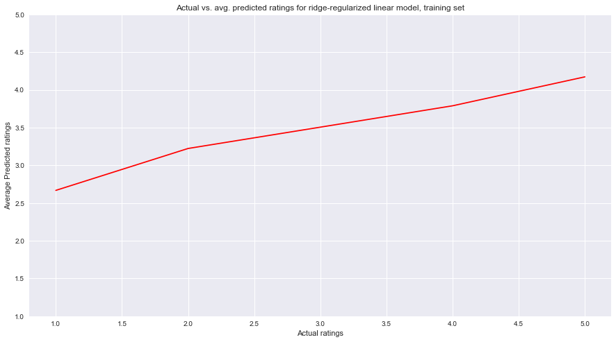

## Contents
{:.no_toc}
*  
{: toc}


## Part 2: Create a Regularized Regression

### Linear Model

Now we are interested in building regularized regressions from our baseline model. In do so we are changing our regression fit from 

$$ \hat{Y}_{um} = \hat{\mu} + \hat{\theta}_{u} + \hat{\gamma}_m $$

to 

$$ \hat{Y}_{um} = \hat{\mu} + \bar{\theta}I_u + \hat{\gamma} I_m $$

where $I_u$ and $I_m$ are the indicator variables for the u-th user and the m-th restaurant in the feature matrix. We ended up building both Lasso and Ridge regressions to see if there were any improvements. 

```python
model = LinearRegression()
model.fit(Xtrain, ytrain)
```


    LinearRegression(copy_X=True, fit_intercept=True, n_jobs=1, normalize=False)


We used a linear model rather than a logistic model as although the y-varaible was categorical (1, 2, 3, 4, or 5), it was ordinal.


```python
ypred = model.predict(Xtrain)
ypred_test = model.predict(Xtest)
predround = [int(round(x)) for x in ypred]
print ("The accuracy score of the linear model on the train set is {}"
       .format(metrics.accuracy_score(ytrain, predround)))
predround_test = [int(round(x)) for x in ypred_test]
print ("The accuracy score of the linear model on the test set is {}"
       .format(metrics.accuracy_score(ytest, predround_test)))
```


    The accuracy score of the linear model on the train set is 0.38662267546490703
    The accuracy score of the linear model on the test set is 0.3810962192438488


Here, we round the predictions from the model to the nearest integer to fit the predictions in the categories (1, 2, 3, 4, or 5).

### Lasso CV


```python
model_lasso = LassoCV().fit(Xtrain, ytrain)
```


```python
lasso_ypred = model_lasso.predict(Xtrain)
lasso_ypred_round = [int(round(x)) for x in lasso_ypred]
lasso_ypred_test = model_lasso.predict(Xtest)
lasso_ypred_test_round = [int(round(x)) for x in lasso_ypred_test]
```


```python
print ("The accuracy score of the lasso model on the train set is {}"
       .format(metrics.accuracy_score(ytrain, lasso_ypred_round)))
print ("The accuracy score of the lasso model on the test set is {}"
       .format(metrics.accuracy_score(ytest, lasso_ypred_test_round)))
```


    The accuracy score of the lasso model on the train set is 0.3672265546890622
    The accuracy score of the lasso model on the test set is 0.36415283056611325


### Ridge CV


```python
model_ridge = RidgeCV().fit(Xtrain, ytrain)
```


```python
ridge_ypred = model_ridge.predict(Xtrain)
ridge_ypred_round = [int(round(x)) for x in ridge_ypred]
ridge_ypred_test = model_ridge.predict(Xtest)
ridge_ypred_test_round = [int(round(x)) for x in ridge_ypred_test]
```


```python
print ("The accuracy score of the ridge model on the train set is {}"
       .format(metrics.accuracy_score(ytrain, ridge_ypred_round)))
print ("The accuracy score of the ridge model on the test set is {}"
       .format(metrics.accuracy_score(ytest, ridge_ypred_test_round)))
```


    The accuracy score of the ridge model on the train set is 0.3862627474505099
    The accuracy score of the ridge model on the test set is 0.38135627125425087


We will be using the regularized linear regression using the ridge method as it performed better than the lasso method for accuracy score (and very similarly to the naive linear regression).


```python
pred_df_train = pd.DataFrame({'y' : ytrain, 'ypred' : ridge_ypred_round})
pred_df_test = pd.DataFrame({'y' : ytest, 'ypred' : ridge_ypred_test_round})

ridge_pred_avg = []
ridge_pred_test_avg = []
for i in [1, 2, 3, 4, 5]:
    ridge_pred_avg.append(pred_df_train[pred_df_train['y'] == i]['ypred'].mean())
    ridge_pred_test_avg.append(pred_df_test[pred_df_test['y'] == i]['ypred'].mean())
```


```python
fig, ax = plt.subplots(1, 1, figsize=(15, 8))
ax.plot([1, 2, 3, 4, 5], ridge_pred_avg, color='red')

ax.set_xlabel('Actual ratings')
ax.set_ylabel('Average Predicted ratings')
ax.set_title('Actual vs. avg. predicted ratings for ridge-regularized linear model, training set')
ax.set_ylim((1,5))
```





```python
fig, ax = plt.subplots(1, 1, figsize=(15, 8))
ax.plot([1, 2, 3, 4, 5], ridge_pred_test_avg, color='red')

ax.set_xlabel('Actual ratings')
ax.set_ylabel('Average Predicted ratings')
ax.set_title('Actual vs. avg. predicted ratings for ridge-regularized linear model, test set')
ax.set_ylim((1,5))
```


On average, our predictions for both the training and the test set follow the increasing trend of actual ratings but overestimate for lower ratings and underestimate for higher ratings. On the whole, it seems that our model tends to be pretty conservative by guessing values near 3.5, which is where a lot of the global averages are centered. 
